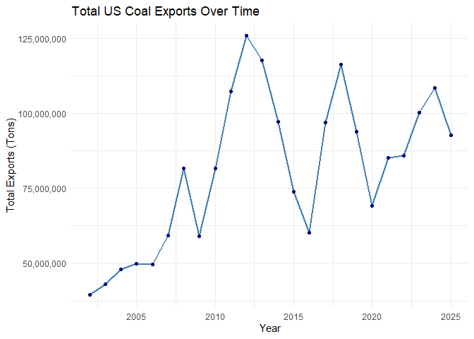
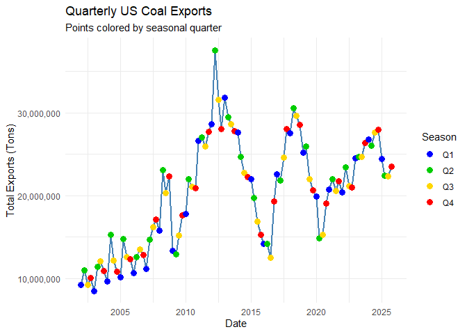
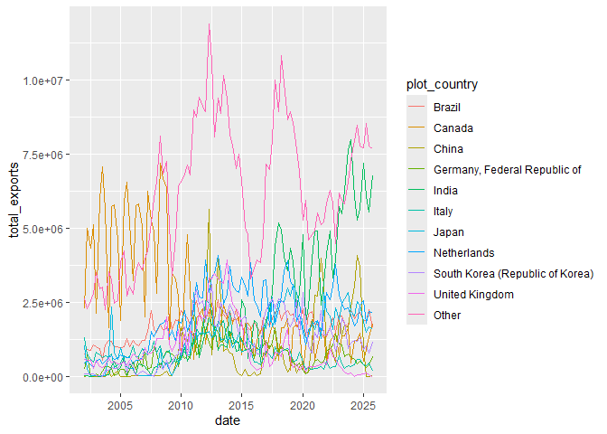
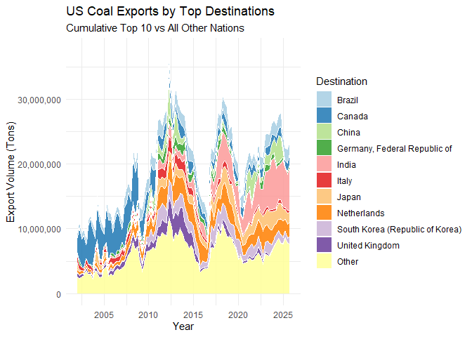
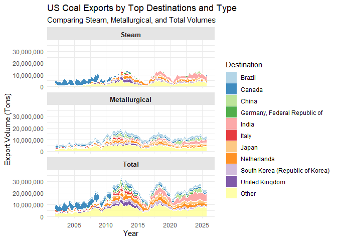

## Goal and requirements

The goal of this assignment is to impress with your data wrangling skills.

Some additional points:

-   You can create a new GitHub repo for this assignment.\
-   Name your GitHub repo something like `aec699-hw2-datawrangling-lastname`.\
-   Make sure to organize your data into a `data/` folder and your code into a `scripts/` or `code/` folder.\
-   Do not forget to knit the assignment (click the “Knit” button, or press `Ctrl+Shift+K`) before submitting.\
-   **Please put your (written) answers in bold.**

### What you will be graded on

-   Is the code correct?\
-   Are the outcomes correct?\
-   Did you show your work?\
-   Are the figures clear?\
-   Did you follow the instructions of the assignment?

## Preliminaries:

### Load libraries

It is a good idea to load your libraries at the top of the Rmd document so that everyone can see what you are using. Similarly, it is good practice to set this type of chunk with `cache=FALSE` to ensure that the libraries are dynamically loaded each time you knit the document.

*Hint: I have only added the libraries needed to download and read the data. You will need to load additional libraries to complete this assignment. Add them here once you discover that you need them.*


``` r
if (!require("pacman")) install.packages("pacman")  # install the pacman package if necessary
```

```
## Loading required package: pacman
```

``` r
pacman::p_load(httr, readxl, here, tidyverse, janitor, lubridate, plotly)  # install other packages using pacman::p_load()
```

### Read in the data

Use `httr::GET()` to fetch the EIA excel file for us from web.


``` r
# library(here)  # already loaded
# library(httr)  # already loaded
url <- "https://www.eia.gov/coal/archive/coal_historical_exports.xlsx"
if(!file.exists(here::here("data/coal.xlsx"))) {  # only download the file if we need to
  GET(url, write_disk(here::here("data/coal.xlsx")))  # modify relative path to match directory
}
```

```         
## Response [https://www.eia.gov/coal/archive/coal_historical_exports.xlsx]
##   Date: 2026-04-17 22:46
##   Status: 200
##   Content-Type: application/vnd.openxmlformats-officedocument.spreadsheetml.sheet
##   Size: 997 kB
## <ON DISK>  C:\Users\hunte\OneDrive - Oregon State University\Grad Year 3\Data Science\osu-aec699-s26\data\coal.xlsx
```

Next, we read in the file.


``` r
# library(readxl) already loaded
coal <- read_xlsx(here::here("data/coal.xlsx"), skip=3, na=".")
```

We are now ready to go.

## 1) Clean the column names

The column (i.e. variable) names are not great: Spacing, uppercase letters, etc. Clean them.


``` r
coal_clean <- coal %>%
  janitor::clean_names()
colnames(coal_clean)
```

```
##  [1] "year"                     "quarter"                 
##  [3] "type"                     "customs_district"        
##  [5] "coal_origin_country"      "coal_destination_country"
##  [7] "steam_coal"               "steam_revenue"           
##  [9] "metallurgical"            "metallurgical_revenue"   
## [11] "total"                    "total_revenue"           
## [13] "coke"                     "coke_revenue"
```

*Hint: You can use `gsub()` and regular expressions, or external packages like `magrittr` or `janitor`.*

## 2) Total US coal exports over time (year only)

Plot the US's total coal exports over time by year ONLY. What secular trends do you notice in the data?


``` r
coal_clean %>%
  group_by(year) %>%
  summarize(total = sum(total, na.rm = TRUE)) %>%
  ggplot(aes(x = year, y = total)) +
  geom_line(color = "steelblue", linewidth = 1) +
  geom_point(color = "navy") +
  scale_y_continuous(labels = scales::comma) +
  labs(title = "Total US Coal Exports Over Time",
       x = "Year",
       y = "Total Exports (Tons)") +
  theme_minimal()
```

<!-- -->

**We see a precipitous buildup of coal exports through the early 2000's (minus a minor drop during the recession) followed by a series of extreme boom and bust cycles beginning in 2012 through the present.**

## 3) Total US coal exports over time (year AND quarter)

Now do the same as the above, except aggregated quarter of year (2001Q1, 2002Q2, etc.). Do you notice any seasonality that was masked from the yearly totals?


``` r
coal_ts <- coal_clean %>%
  mutate(date = yq(paste(year, quarter, sep = "Q"))) %>%
  group_by(date) %>%
  summarize(total = sum(total, na.rm = TRUE))%>%
  mutate(qtr = factor(quarter(date)))

ggplot(coal_ts, aes(x = date, y = total)) +
  geom_line(color = "steelblue", linewidth = 1) +
  geom_point(aes(color = qtr), size = 3) + 
  scale_color_manual(
    values = c("1" = "blue", "2" = "green3", "3" = "gold", "4" = "red"),
    labels = c("Q1", "Q2", "Q3", "Q4"),
    name = "Season"
  ) +
  scale_y_continuous(labels = scales::comma) +
  labs(
    title = "Quarterly US Coal Exports",
    subtitle = "Points colored by seasonal quarter",
    x = "Date",
    y = "Total Exports (Tons)"
  ) +
  theme_minimal()
```

<!-- -->

**When dissaggregating from annual exports we see that coal exports are even more volatile and follow periods of export declines roughly corresponding to the winter.** *Hint: ggplot2 is going to want you to convert your quarterly data into actual date format before it plots nicely. (i.e. Don't leave it as a string.)*

## 4) Exports by destination country

### 4.1) Create a new data frame


``` r
coal_country <- coal_clean %>%
  mutate(date = yq(paste(year, quarter, sep = "Q"))) %>%
  group_by(coal_destination_country, year, quarter, date) %>%
  summarize(total_exports = sum(total, na.rm = TRUE), .groups = "drop")

print(coal_country)
```

```
## # A tibble: 5,750 × 5
##    coal_destination_country  year quarter date       total_exports
##    <chr>                    <dbl>   <dbl> <date>             <dbl>
##  1 Albania                   2016       4 2016-10-01            74
##  2 Albania                   2023       2 2023-04-01         24152
##  3 Algeria                   2002       1 2002-01-01        129305
##  4 Algeria                   2002       3 2002-07-01         62931
##  5 Algeria                   2002       4 2002-10-01        129563
##  6 Algeria                   2003       1 2003-01-01        128525
##  7 Algeria                   2003       2 2003-04-01         70539
##  8 Algeria                   2003       3 2003-07-01        141813
##  9 Algeria                   2003       4 2003-10-01         66499
## 10 Algeria                   2004       1 2004-01-01        141438
## # ℹ 5,740 more rows
```

Create a new data frame called `coal_country` that aggregates total exports by destination country (and quarter of year). Make sure you print the resulting data frame so that it appears in the knitted R markdown document.

### 4.2) Inspect the data frame

It looks like some countries are missing data for a number of years and periods (e.g. Albania). Confirm that this is the case. What do you think is happening here?

**This is true, we see multiple countries with missing data. This may be the result of measurement error, export restrictions or simply not exporting coal to those countries, leading to missing observations across time.**

### 4.3) Complete the data frame

Fill in the implicit missing values, so that each country has a representative row for every year-quarter time period. In other words, you should modify the data frame so that every destination country has row entries for all possible year-quarter combinations (from 2002Q1 through the most recent quarter). I.e., a balanced panel. Order your updated data frame by country, year and, quarter.

**Assuming these values are true 0's, another alternative would be filling in linear values between observations.**


``` r
coal_country_complete <- coal_country %>%
  complete(coal_destination_country, nesting(year, quarter, date), fill = list(total_exports = 0)) %>%
  arrange(coal_destination_country, year, quarter)

print(coal_country_complete)
```

```
## # A tibble: 14,592 × 5
##    coal_destination_country  year quarter date       total_exports
##    <chr>                    <dbl>   <dbl> <date>             <dbl>
##  1 Albania                   2002       1 2002-01-01             0
##  2 Albania                   2002       2 2002-04-01             0
##  3 Albania                   2002       3 2002-07-01             0
##  4 Albania                   2002       4 2002-10-01             0
##  5 Albania                   2003       1 2003-01-01             0
##  6 Albania                   2003       2 2003-04-01             0
##  7 Albania                   2003       3 2003-07-01             0
##  8 Albania                   2003       4 2003-10-01             0
##  9 Albania                   2004       1 2004-01-01             0
## 10 Albania                   2004       2 2004-04-01             0
## # ℹ 14,582 more rows
```

*Hints: See `?tidyr::complete()` for some convenient options. Another option is `tidyr::crossing()`. Do not forget to print `coal_country` after you have updated the data frame to show the results.*

### 4.4 Some more tidying up

In answering the previous question, you *may* encounter a situation where the data frame contains a quarter that is missing total export numbers for *all* countries. Did this happen to you? Filter out the completely missing quarter if so. Also: Why do you think this might have happened? (Please answer the latter question even if it did not happen to you.)


``` r
missing_inspection <- coal_country %>%
  complete(coal_destination_country, nesting(year, quarter, date)) %>%
  group_by(date) %>%
  summarize(
    total_countries = n(),
    missing_values = sum(is.na(total_exports))
  ) %>%
  filter(missing_values > 0) %>%
  arrange(desc(missing_values))

print(missing_inspection)
```

```
## # A tibble: 96 × 3
##    date       total_countries missing_values
##    <date>               <int>          <int>
##  1 2003-10-01             152            110
##  2 2002-01-01             152            106
##  3 2002-10-01             152            106
##  4 2002-07-01             152            105
##  5 2003-01-01             152            105
##  6 2003-04-01             152            103
##  7 2003-07-01             152            103
##  8 2004-04-01             152            103
##  9 2024-10-01             152            103
## 10 2025-10-01             152            103
## # ℹ 86 more rows
```

**The printout shows that at the highest missing frequency, we still have some observations for countries. If this did happen it may be the result of a data reporting error, trade restrictions or global shocks to coal sector**


``` r
coal_country_complete <- coal_country_complete %>%
  group_by(date) %>%
  filter(sum(total_exports) > 0) %>%
  ungroup()
```

### 4.5) Culmulative top 10 US coal export destinations

Produce a vector -- call it `coal10_culm` -- of the top 10 top coal destinations over the full study period. What are they?


``` r
coal10_cumul <- coal_country_complete %>%
  group_by(coal_destination_country) %>%
  summarize(grand_total = sum(total_exports)) %>%
  slice_max(order_by = grand_total, n = 10) %>%
  pull(coal_destination_country)
```

**The top coal receiving nations are:**


``` r
print(coal10_cumul)
```

```
##  [1] "Canada"                          "India"                          
##  [3] "Netherlands"                     "Brazil"                         
##  [5] "Japan"                           "South Korea (Republic of Korea)"
##  [7] "United Kingdom"                  "China"                          
##  [9] "Italy"                           "Germany, Federal Republic of"
```

### 4.6) Recent top 10 US coal export destinations

Now do the same, except for the most recent period on record (i.e. final quarter in the dataset). Call this vector `coal10_recent` and make sure to print it so that it is visible too. Are there any interesting differences between the two vectors? Apart from any secular trends, what else might explain these differences?


``` r
recent_date <- max(coal_country_complete$date)

coal10_recent <- coal_country_complete %>%
  filter(date == recent_date) %>%
  group_by(coal_destination_country) %>%
  summarize(recent_total = sum(total_exports)) %>%
  slice_max(order_by = recent_total, n = 10) %>%
  pull(coal_destination_country)

print(coal10_recent)
```

```
##  [1] "India"                           "Netherlands"                    
##  [3] "Canada"                          "Brazil"                         
##  [5] "Japan"                           "Indonesia"                      
##  [7] "Turkey"                          "South Korea (Republic of Korea)"
##  [9] "Morocco"                         "Germany, Federal Republic of"
```

**Interestingly, we find significant discrepancies between the two groups. In the most recent data we see that Canada has been superseded by India and the Netherlands. Indonesia, Turkey and Morocco have also imported more coal and replaced European trade partners. Finally, China has dropped out of the top 10. This is likely driven by climate goals in the EU with trade restrictions towards China.**

### 4.7) US coal exports over time by country

Plot the quarterly coal exports over time, but now disaggregated by country. In particular, highlight the top 10 (cumulative) export destinations and then sum the remaining countries into a combined "Other" category. (In other words, your figure should contain the time series of eleven different countries/categories.)


``` r
coal_plot_data <- coal_country_complete %>%
  mutate(plot_country = if_else(coal_destination_country %in% coal10_cumul, 
                                coal_destination_country, "Other")) %>%
  group_by(date, plot_country) %>%
  summarize(total_exports = sum(total_exports), .groups = "drop") %>%
  mutate(plot_country = fct_relevel(as.factor(plot_country), "Other", after = Inf))
  
ggplot(coal_plot_data, aes(x = date, y = total_exports, color = plot_country)) +
  geom_line()
```

<!-- -->

### 4.8) Make it pretty

Take your previous plot and add some style to it. That is, try to make it as visually appealing as possible without overloading it with chart junk.

*Hint: You have a lot of options here. If you have not already done so, consider a more bespoke theme with the `ggthemes` or `cowplot` packages. Try out `scale_fill_brewer()` and `scale_color_brewer()` for a range of interesting color palettes. Try transparency effects with `alpha`. Give your axis labels more refined names with the `labs()` layer in ggplot2. Or, you might want to scale (i.e. normalize) your y-variable to get rid of all those zeros. You can shorten any country names to their ISO abbreviation; see `?countrycode::countrycode`. More substantively, but more complicated, you might want to re-order your legend (and the plot itself) according to the relative importance of the destination countries. See `?forcats::fct_reorder` or `?forcats::fct_relevel`.*


``` r
p <- ggplot(coal_plot_data, aes(x = date, y = total_exports, fill = plot_country)) +
  geom_area(alpha = 0.85, color = "white", linewidth = 0.1) +
  scale_fill_brewer(palette = "Paired") + 
  scale_y_continuous(labels = scales::comma) +
  labs(title = "US Coal Exports by Top Destinations",
       subtitle = "Cumulative Top 10 vs All Other Nations",
       x = "Year",
       y = "Export Volume (Tons)",
       fill = "Destination") +
  theme_minimal() +
  theme(legend.position = "right")

p
```

<!-- -->
### 4.9) Make it interactive

Create an interactive version of your previous figure.


``` r
ggplotly(p)
```

```{=html}
<div class="plotly html-widget html-fill-item" id="htmlwidget-44775b8e25d02815b05c" style="width:672px;height:480px;"></div>
<script type="application/json" data-for="htmlwidget-44775b8e25d02815b05c">{"x":{"data":[{"x":[11679.325999999999,11688,11696.674000000001,11769.325999999999,11778,11786.674000000001,11860.325999999999,11869,11877.674000000001,11952.325999999999,11961,11969.674000000001,12044.325999999999,12053,12061.674000000001,12134.325999999999,12143,12151.674000000001,12225.325999999999,12234,12242.674000000001,12317.325999999999,12326,12334.674000000001,12409.325999999999,12418,12426.674000000001,12500.325999999999,12509,12517.674000000001,12591.325999999999,12600,12608.674000000001,12683.325999999999,12692,12700.674000000001,12775.325999999999,12784,12792.674000000001,12865.325999999999,12874,12882.674000000001,12956.325999999999,12965,12973.674000000001,13048.325999999999,13057,13065.674000000001,13140.325999999999,13149,13157.674000000001,13230.325999999999,13239,13247.674000000001,13321.325999999999,13330,13338.674000000001,13413.325999999999,13422,13430.674000000001,13505.325999999999,13514,13522.674000000001,13595.325999999999,13604,13612.674000000001,13686.325999999999,13695,13703.674000000001,13778.325999999999,13787,13795.674000000001,13870.325999999999,13879,13887.674000000001,13961.325999999999,13970,13978.674000000001,14052.325999999999,14061,14069.674000000001,14144.325999999999,14153,14161.674000000001,14236.325999999999,14245,14253.674000000001,14326.325999999999,14335,14343.674000000001,14417.325999999999,14426,14434.674000000001,14509.325999999999,14518,14526.674000000001,14601.325999999999,14610,14618.674000000001,14691.325999999999,14700,14708.674000000001,14782.325999999999,14791,14799.674000000001,14874.325999999999,14883,14891.674000000001,14966.325999999999,14975,14983.674000000001,15056.325999999999,15065,15073.674000000001,15147.325999999999,15156,15164.674000000001,15239.325999999999,15248,15256.674000000001,15331.325999999999,15340,15348.674000000001,15422.325999999999,15431,15439.674000000001,15513.325999999999,15522,15530.674000000001,15605.325999999999,15614,15622.674000000001,15697.325999999999,15706,15714.674000000001,15787.325999999999,15796,15804.674000000001,15878.325999999999,15887,15895.674000000001,15970.325999999999,15979,15987.674000000001,16062.325999999999,16071,16079.674000000001,16152.325999999999,16161,16169.674000000001,16243.325999999999,16252,16260.674000000001,16335.325999999999,16344,16352.674000000001,16427.326000000001,16436,16444.673999999999,16517.326000000001,16526,16534.673999999999,16608.326000000001,16617,16625.673999999999,16700.326000000001,16709,16717.673999999999,16792.326000000001,16801,16809.673999999999,16883.326000000001,16892,16900.673999999999,16974.326000000001,16983,16991.673999999999,17066.326000000001,17075,17083.673999999999,17158.326000000001,17167,17175.673999999999,17248.326000000001,17257,17265.673999999999,17339.326000000001,17348,17356.673999999999,17431.326000000001,17440,17448.673999999999,17523.326000000001,17532,17540.673999999999,17613.326000000001,17622,17630.673999999999,17704.326000000001,17713,17721.673999999999,17796.326000000001,17805,17813.673999999999,17888.326000000001,17897,17905.673999999999,17978.326000000001,17987,17995.673999999999,18069.326000000001,18078,18086.673999999999,18161.326000000001,18170,18178.673999999999,18253.326000000001,18262,18270.673999999999,18344.326000000001,18353,18361.673999999999,18435.326000000001,18444,18452.673999999999,18527.326000000001,18536,18544.673999999999,18619.326000000001,18628,18636.673999999999,18709.326000000001,18718,18726.673999999999,18800.326000000001,18809,18817.673999999999,18892.326000000001,18901,18909.673999999999,18984.326000000001,18993,19001.673999999999,19074.326000000001,19083,19091.673999999999,19165.326000000001,19174,19182.673999999999,19257.326000000001,19266,19274.673999999999,19349.326000000001,19358,19366.673999999999,19439.326000000001,19448,19456.673999999999,19530.326000000001,19539,19547.673999999999,19622.326000000001,19631,19639.673999999999,19714.326000000001,19723,19731.673999999999,19805.326000000001,19814,19822.673999999999,19896.326000000001,19905,19913.673999999999,19988.326000000001,19997,20005.673999999999,20080.326000000001,20089,20097.673999999999,20170.326000000001,20179,20187.673999999999,20261.326000000001,20270,20278.673999999999,20353.326000000001,20362,20370.673999999999,20370.673999999999,20362,20353.326000000001,20278.673999999999,20270,20261.326000000001,20187.673999999999,20179,20170.326000000001,20097.673999999999,20089,20080.326000000001,20005.673999999999,19997,19988.326000000001,19913.673999999999,19905,19896.326000000001,19822.673999999999,19814,19805.326000000001,19731.673999999999,19723,19714.326000000001,19639.673999999999,19631,19622.326000000001,19547.673999999999,19539,19530.326000000001,19456.673999999999,19448,19439.326000000001,19366.673999999999,19358,19349.326000000001,19274.673999999999,19266,19257.326000000001,19182.673999999999,19174,19165.326000000001,19091.673999999999,19083,19074.326000000001,19001.673999999999,18993,18984.326000000001,18909.673999999999,18901,18892.326000000001,18817.673999999999,18809,18800.326000000001,18726.673999999999,18718,18709.326000000001,18636.673999999999,18628,18619.326000000001,18544.673999999999,18536,18527.326000000001,18452.673999999999,18444,18435.326000000001,18361.673999999999,18353,18344.326000000001,18270.673999999999,18262,18253.326000000001,18178.673999999999,18170,18161.326000000001,18086.673999999999,18078,18069.326000000001,17995.673999999999,17987,17978.326000000001,17905.673999999999,17897,17888.326000000001,17813.673999999999,17805,17796.326000000001,17721.673999999999,17713,17704.326000000001,17630.673999999999,17622,17613.326000000001,17540.673999999999,17532,17523.326000000001,17448.673999999999,17440,17431.326000000001,17356.673999999999,17348,17339.326000000001,17265.673999999999,17257,17248.326000000001,17175.673999999999,17167,17158.326000000001,17083.673999999999,17075,17066.326000000001,16991.673999999999,16983,16974.326000000001,16900.673999999999,16892,16883.326000000001,16809.673999999999,16801,16792.326000000001,16717.673999999999,16709,16700.326000000001,16625.673999999999,16617,16608.326000000001,16534.673999999999,16526,16517.326000000001,16444.673999999999,16436,16427.326000000001,16352.674000000001,16344,16335.325999999999,16260.674000000001,16252,16243.325999999999,16169.674000000001,16161,16152.325999999999,16079.674000000001,16071,16062.325999999999,15987.674000000001,15979,15970.325999999999,15895.674000000001,15887,15878.325999999999,15804.674000000001,15796,15787.325999999999,15714.674000000001,15706,15697.325999999999,15622.674000000001,15614,15605.325999999999,15530.674000000001,15522,15513.325999999999,15439.674000000001,15431,15422.325999999999,15348.674000000001,15340,15331.325999999999,15256.674000000001,15248,15239.325999999999,15164.674000000001,15156,15147.325999999999,15073.674000000001,15065,15056.325999999999,14983.674000000001,14975,14966.325999999999,14891.674000000001,14883,14874.325999999999,14799.674000000001,14791,14782.325999999999,14708.674000000001,14700,14691.325999999999,14618.674000000001,14610,14601.325999999999,14526.674000000001,14518,14509.325999999999,14434.674000000001,14426,14417.325999999999,14343.674000000001,14335,14326.325999999999,14253.674000000001,14245,14236.325999999999,14161.674000000001,14153,14144.325999999999,14069.674000000001,14061,14052.325999999999,13978.674000000001,13970,13961.325999999999,13887.674000000001,13879,13870.325999999999,13795.674000000001,13787,13778.325999999999,13703.674000000001,13695,13686.325999999999,13612.674000000001,13604,13595.325999999999,13522.674000000001,13514,13505.325999999999,13430.674000000001,13422,13413.325999999999,13338.674000000001,13330,13321.325999999999,13247.674000000001,13239,13230.325999999999,13157.674000000001,13149,13140.325999999999,13065.674000000001,13057,13048.325999999999,12973.674000000001,12965,12956.325999999999,12882.674000000001,12874,12865.325999999999,12792.674000000001,12784,12775.325999999999,12700.674000000001,12692,12683.325999999999,12608.674000000001,12600,12591.325999999999,12517.674000000001,12509,12500.325999999999,12426.674000000001,12418,12409.325999999999,12334.674000000001,12326,12317.325999999999,12242.674000000001,12234,12225.325999999999,12151.674000000001,12143,12134.325999999999,12061.674000000001,12053,12044.325999999999,11969.674000000001,11961,11952.325999999999,11877.674000000001,11869,11860.325999999999,11786.674000000001,11778,11769.325999999999,11696.674000000001,11688,11679.325999999999,11679.325999999999],"y":[0,8543413,8696118.8663777933,9975158.1336222067,10127864,9962811.9824834988,8561335.0175165012,8396283,8452773.4621087015,8938953.5378912985,8995444,8857555.8733478114,7670834.1266521877,7532946,7820089.3249778068,10225154.675022192,10512298,10611140.327010999,11450422.672989001,11549265,11394232.429499984,10059958.570500016,9904926,9771323.3950434644,8621484.6049565356,8487882,9021526.3062857687,13552765.693714231,14086410,13810935.388879092,11471846.611120908,11196372,11070934.080391292,9991363.9196087085,9865926,9801917.3483912982,9251032.6516087018,9187024,9632415.6846000459,13362943.315399954,13808335,13574547.15628569,11589425.84371431,11355638,11359133.150586957,11389213.849413043,11392709,11208900.6230652,9626970.3769348022,9443162,9641839.1026000213,11305925.897399981,11504603,11600959.225164846,12419131.774835154,12515488,12433930.432152165,11732012.567847835,11650455,11489600.28984781,10105218.71015219,9944364,10256819.695400031,12873897.304599967,13186353,13261208.476175832,13896815.523824168,13971671,14120324.786326101,15399700.213673899,15548354,15432228.750782598,14432807.249217404,14316682,14986203.65841765,20671194.34158235,21340716,21094298.335692283,19001935.664307717,18755518,18941352.133065235,20540716.866934765,20726551,19831609.541478168,12129376.45852183,11234435,11248921.543777779,11370258.456222221,11384745,11563912.093802216,13085241.906197783,13264409,13503217.231000025,15558498.768999975,15797307,15778835.528434781,15619862.471565219,15601391,16019051.617466711,19517308.382533289,19934969,19854687.793846145,19173010.206153855,19092729,19099238.742717393,19155264.257282607,19161774,19653576.317587007,23886228.682412993,24378031,24383697.049555555,24431154.950444445,24436821,24384689.116175819,23942030.883824181,23889899,24076923.828130454,25686536.171869546,25873561,25958962.658369575,26693964.341630425,26779366,27591726.133846238,34489575.866153762,35301936,34759251.765296645,30151253.234703355,29608569,29277948.458934747,26432492.541065253,26101872,26399592.6247609,28961898.3752391,29259619,29081754.582133316,27591991.417866684,27414127,27325743.801252738,26575271.198747262,26486888,26430443.642086949,25944660.357913051,25888216,25839155.667434778,25416922.332565222,25367862,25128002.28744442,23118976.71255558,22879117,22650416.218988989,20708489.781011011,20479789,20481508.809065219,20496310.190934781,20498030,20476391.669891302,20290163.330108695,20268525,20077561.396466687,18478081.603533313,18287118,18001874.558505524,15579837.441494474,15294594,15150707.802347841,13912364.197652159,13768478,13629478.752804363,12433194.247195639,12294195,12319598.095802195,12535298.904197805,12560702,12421711.635054961,11241527.364945039,11102537,11693885.912891241,16783277.087108757,17374626,17684400.561999965,20350447.438000035,20660222,20609491.05084445,20184576.94915555,20133846,20371789.833538435,22392200.166461565,22630144,22933082.978586923,25540300.021413077,25843239,25785675.413239136,25290259.586760864,25232696,25562231.090533298,28322362.909466702,28651898,28539895.403934076,27588867.596065924,27476865,27372202.818913054,26471437.181086946,26366775,26063495.378347859,23453346.621652141,23150067,23216502.12977777,23772951.87022223,23839387,23501249.983098935,20630087.016901061,20291950,20160012.33163045,19024502.66836955,18892565,18774512.14284784,17758500.85715216,17640448,17246265.504857186,13899213.495142814,13505031,13471845.801098904,13190066.198901096,13156881,13507434.958760832,16524446.041239168,16875000,17075035.073869545,18796618.926130455,18996654,19117941.481844433,20133825.518155567,20255113,20149628.581318691,19253947.418681309,19148463,19272408.048782595,20339129.951217405,20463075,20333608.667369578,19219368.332630422,19089902,19347768.551044416,21507616.448955584,21765483,21517045.246879149,19407529.753120851,19159092,19192635.300826084,19481322.699173916,19514866,19794237.4377391,22198622.5622609,22477994,22497741.999422219,22663148.000577781,22682896,22702171.534373622,22865842.465626378,22885118,23050636.022260852,24475151.977739148,24640670,24629774.041760873,24535998.958239131,24525103,24486114.132549454,24155054.867450546,24116066,24249578.876923062,25383253.123076938,25516766,25539061.951304346,25730950.048695654,25753246,25447766.010826118,22818679.989173882,22513200,22321669.406000022,20717440.593999978,20525910,20486634.604593411,20153142.395406589,20113867,20277144.207499981,21682374.792500019,21845652,0,0,23465818,23360031.687369578,22449591.312630422,22343805,22347043.738153845,22374544.261846155,22377783,22573820.797155533,24215801.202844467,24411839,24741886.962782573,27582415.037217427,27912463,27882122.950804353,27621004.049195647,27590664,27444037.655494522,26199015.344505478,26052389,26120873.375516478,26702382.624483522,26770867,26730149.358347829,26379716.641652171,26338999,26178452.216847844,24796720.783152156,24636174,24642640.324021976,24697546.675978024,24704013,24687133.781511113,24545756.218488887,24528877,24196868.901782647,21339471.098217357,21007463,21017550.579152171,21104368.420847826,21114456,21335420.049604371,23211652.950395629,23432617,23140455.766022254,20693361.233977746,20401200,20529628.846804332,21634940.153195664,21763369,21653191.097739141,20704954.902260859,20594777,20730386.887912076,21881867.112087928,22017477,21894331.06546668,20862880.93453332,20739735,20580244.747760888,19207606.252239116,19048116,18690955.564565256,15617086.435434744,15259926,15220647.840351652,14887132.159648348,14847854,15330435.326153794,19428092.673846204,19910674,19981613.083326079,20592143.916673921,20663083,20785316.913717378,21837312.086282622,21959546,22337913.88676919,25550682.11323081,25929050,25860035.993644454,25281986.00635555,25212972,25529998.685978226,28258460.314021774,28575487,28672275.263304338,29505274.736695662,29602063,29691312.836197793,30449144.163802207,30538394,30248271.252400029,27818250.747599971,27528128,27572464.302456517,27954040.697543483,27998377,27675231.93841308,24894113.061586924,24570968,24310291.042241786,22096850.957758214,21836174,21903968.634711105,22471805.365288895,22539600,22238186.136891335,19644094.863108665,19342681,18702429.395065285,13192161.604934713,12551910,12711234.699230751,14064080.300769249,14223405,14216696.089934066,14159729.910065934,14153021,14261041.810456511,15190713.189543489,15298734,15451053.965565201,16761982.034434799,16914302,17186103.124461509,19493999.875538491,19765801,19979109.116666645,21765742.883333355,21979051,22007022.952913042,22247761.047086954,22275733,22317909.570739135,22680898.429260865,22723075,22909039.364285734,24488085.635714266,24674050,24954493.720133364,27303444.279866636,27583888,27605080.279086959,27787469.720913041,27808662,27882202.529065225,28515122.470934775,28588663,28668549.491494514,29346875.508505486,29426762,29658880.071177803,31603062.928822197,31835181,31474170.81708692,28367169.18291308,28006159,28341541.849913079,31227984.150086921,31563367,32132521.613780279,36965283.386219718,37534438,36686793.749890022,29489342.250109978,28641698,28550958.531739119,27770017.468260881,27679278,27518651.925173897,26136238.074826103,25975612,26071969.845582429,26890156.154417571,26986514,26950916.193133332,26652754.806866668,26617157,26075301.648260813,21411872.351739187,20870017,20889257.911934786,21054853.088065214,21074094,21159011.03021979,21880051.96978021,21964969,21564194.154711071,18207369.845288929,17806595,17792094.051934782,17667292.948065218,17652792,17417634.108760845,15393768.891239155,15158611,14948158.313296681,13161178.686703319,12950726,12987744.318933338,13297803.681066662,13334822,14182769.612173999,21480554.387825999,22328502,22139185.067369547,20509845.932630453,20320529,20582462.543934092,22806572.456065908,23068506,22375832.005802128,16494251.994197873,15801578,15926277.498217404,16999492.501782596,17124192,17036829.64049999,16284953.359500008,16197591,16055026.94705493,14844498.05294507,14701934,14358583.540533299,11482736.459466701,11139386,11301444.98191306,12696191.01808694,12858250,12922484.26989131,13475310.73010869,13539545,13449065.171538452,12680789.828461548,12590310,12404190.439955536,10845283.560044464,10659164,10822338.062326103,12226680.937673897,12389855,12411544.714130437,12598215.285869563,12619905,12827999.121252768,14594951.878747232,14803046,14352610.866288843,10579840.133711157,10129405,10197517.113586964,10783717.886413036,10851830,10979189.77630436,12075300.22369564,12202660,12493637.622725304,14964364.377274696,15255342,14724676.307186758,10218728.692813242,9688063,9807229.1461956631,10832821.853804337,10951988,11059654.590695662,11986277.409304338,12093944,12032544.85270329,11511197.14729671,11449798,11167216.427999971,8800359.5720000286,8517778,8662200.6656956673,9905161.3343043327,10049584,9974815.0628260784,9331322.9371739198,9256554,9426789.8286813367,10872283.171318663,11042519,10870009.042333316,9425093.9576666839,9252584,0,0],"text":"date: 2002-01-01<br />total_exports:  709171<br />plot_country: Brazil","type":"scatter","mode":"lines","line":{"width":0.37795275590551186,"color":"rgba(255,255,255,0.85)","dash":"solid"},"fill":"toself","fillcolor":"rgba(166,206,227,0.85)","hoveron":"points","name":"Brazil","legendgroup":"Brazil","showlegend":true,"xaxis":"x","yaxis":"y","hoverinfo":"text","frame":null},{"x":[11679.325999999999,11688,11696.674000000001,11769.325999999999,11778,11786.674000000001,11860.325999999999,11869,11877.674000000001,11952.325999999999,11961,11969.674000000001,12044.325999999999,12053,12061.674000000001,12134.325999999999,12143,12151.674000000001,12225.325999999999,12234,12242.674000000001,12317.325999999999,12326,12334.674000000001,12409.325999999999,12418,12426.674000000001,12500.325999999999,12509,12517.674000000001,12591.325999999999,12600,12608.674000000001,12683.325999999999,12692,12700.674000000001,12775.325999999999,12784,12792.674000000001,12865.325999999999,12874,12882.674000000001,12956.325999999999,12965,12973.674000000001,13048.325999999999,13057,13065.674000000001,13140.325999999999,13149,13157.674000000001,13230.325999999999,13239,13247.674000000001,13321.325999999999,13330,13338.674000000001,13413.325999999999,13422,13430.674000000001,13505.325999999999,13514,13522.674000000001,13595.325999999999,13604,13612.674000000001,13686.325999999999,13695,13703.674000000001,13778.325999999999,13787,13795.674000000001,13870.325999999999,13879,13887.674000000001,13961.325999999999,13970,13978.674000000001,14052.325999999999,14061,14069.674000000001,14144.325999999999,14153,14161.674000000001,14236.325999999999,14245,14253.674000000001,14326.325999999999,14335,14343.674000000001,14417.325999999999,14426,14434.674000000001,14509.325999999999,14518,14526.674000000001,14601.325999999999,14610,14618.674000000001,14691.325999999999,14700,14708.674000000001,14782.325999999999,14791,14799.674000000001,14874.325999999999,14883,14891.674000000001,14966.325999999999,14975,14983.674000000001,15056.325999999999,15065,15073.674000000001,15147.325999999999,15156,15164.674000000001,15239.325999999999,15248,15256.674000000001,15331.325999999999,15340,15348.674000000001,15422.325999999999,15431,15439.674000000001,15513.325999999999,15522,15530.674000000001,15605.325999999999,15614,15622.674000000001,15697.325999999999,15706,15714.674000000001,15787.325999999999,15796,15804.674000000001,15878.325999999999,15887,15895.674000000001,15970.325999999999,15979,15987.674000000001,16062.325999999999,16071,16079.674000000001,16152.325999999999,16161,16169.674000000001,16243.325999999999,16252,16260.674000000001,16335.325999999999,16344,16352.674000000001,16427.326000000001,16436,16444.673999999999,16517.326000000001,16526,16534.673999999999,16608.326000000001,16617,16625.673999999999,16700.326000000001,16709,16717.673999999999,16792.326000000001,16801,16809.673999999999,16883.326000000001,16892,16900.673999999999,16974.326000000001,16983,16991.673999999999,17066.326000000001,17075,17083.673999999999,17158.326000000001,17167,17175.673999999999,17248.326000000001,17257,17265.673999999999,17339.326000000001,17348,17356.673999999999,17431.326000000001,17440,17448.673999999999,17523.326000000001,17532,17540.673999999999,17613.326000000001,17622,17630.673999999999,17704.326000000001,17713,17721.673999999999,17796.326000000001,17805,17813.673999999999,17888.326000000001,17897,17905.673999999999,17978.326000000001,17987,17995.673999999999,18069.326000000001,18078,18086.673999999999,18161.326000000001,18170,18178.673999999999,18253.326000000001,18262,18270.673999999999,18344.326000000001,18353,18361.673999999999,18435.326000000001,18444,18452.673999999999,18527.326000000001,18536,18544.673999999999,18619.326000000001,18628,18636.673999999999,18709.326000000001,18718,18726.673999999999,18800.326000000001,18809,18817.673999999999,18892.326000000001,18901,18909.673999999999,18984.326000000001,18993,19001.673999999999,19074.326000000001,19083,19091.673999999999,19165.326000000001,19174,19182.673999999999,19257.326000000001,19266,19274.673999999999,19349.326000000001,19358,19366.673999999999,19439.326000000001,19448,19456.673999999999,19530.326000000001,19539,19547.673999999999,19622.326000000001,19631,19639.673999999999,19714.326000000001,19723,19731.673999999999,19805.326000000001,19814,19822.673999999999,19896.326000000001,19905,19913.673999999999,19988.326000000001,19997,20005.673999999999,20080.326000000001,20089,20097.673999999999,20170.326000000001,20179,20187.673999999999,20261.326000000001,20270,20278.673999999999,20353.326000000001,20362,20370.673999999999,20370.673999999999,20362,20353.326000000001,20278.673999999999,20270,20261.326000000001,20187.673999999999,20179,20170.326000000001,20097.673999999999,20089,20080.326000000001,20005.673999999999,19997,19988.326000000001,19913.673999999999,19905,19896.326000000001,19822.673999999999,19814,19805.326000000001,19731.673999999999,19723,19714.326000000001,19639.673999999999,19631,19622.326000000001,19547.673999999999,19539,19530.326000000001,19456.673999999999,19448,19439.326000000001,19366.673999999999,19358,19349.326000000001,19274.673999999999,19266,19257.326000000001,19182.673999999999,19174,19165.326000000001,19091.673999999999,19083,19074.326000000001,19001.673999999999,18993,18984.326000000001,18909.673999999999,18901,18892.326000000001,18817.673999999999,18809,18800.326000000001,18726.673999999999,18718,18709.326000000001,18636.673999999999,18628,18619.326000000001,18544.673999999999,18536,18527.326000000001,18452.673999999999,18444,18435.326000000001,18361.673999999999,18353,18344.326000000001,18270.673999999999,18262,18253.326000000001,18178.673999999999,18170,18161.326000000001,18086.673999999999,18078,18069.326000000001,17995.673999999999,17987,17978.326000000001,17905.673999999999,17897,17888.326000000001,17813.673999999999,17805,17796.326000000001,17721.673999999999,17713,17704.326000000001,17630.673999999999,17622,17613.326000000001,17540.673999999999,17532,17523.326000000001,17448.673999999999,17440,17431.326000000001,17356.673999999999,17348,17339.326000000001,17265.673999999999,17257,17248.326000000001,17175.673999999999,17167,17158.326000000001,17083.673999999999,17075,17066.326000000001,16991.673999999999,16983,16974.326000000001,16900.673999999999,16892,16883.326000000001,16809.673999999999,16801,16792.326000000001,16717.673999999999,16709,16700.326000000001,16625.673999999999,16617,16608.326000000001,16534.673999999999,16526,16517.326000000001,16444.673999999999,16436,16427.326000000001,16352.674000000001,16344,16335.325999999999,16260.674000000001,16252,16243.325999999999,16169.674000000001,16161,16152.325999999999,16079.674000000001,16071,16062.325999999999,15987.674000000001,15979,15970.325999999999,15895.674000000001,15887,15878.325999999999,15804.674000000001,15796,15787.325999999999,15714.674000000001,15706,15697.325999999999,15622.674000000001,15614,15605.325999999999,15530.674000000001,15522,15513.325999999999,15439.674000000001,15431,15422.325999999999,15348.674000000001,15340,15331.325999999999,15256.674000000001,15248,15239.325999999999,15164.674000000001,15156,15147.325999999999,15073.674000000001,15065,15056.325999999999,14983.674000000001,14975,14966.325999999999,14891.674000000001,14883,14874.325999999999,14799.674000000001,14791,14782.325999999999,14708.674000000001,14700,14691.325999999999,14618.674000000001,14610,14601.325999999999,14526.674000000001,14518,14509.325999999999,14434.674000000001,14426,14417.325999999999,14343.674000000001,14335,14326.325999999999,14253.674000000001,14245,14236.325999999999,14161.674000000001,14153,14144.325999999999,14069.674000000001,14061,14052.325999999999,13978.674000000001,13970,13961.325999999999,13887.674000000001,13879,13870.325999999999,13795.674000000001,13787,13778.325999999999,13703.674000000001,13695,13686.325999999999,13612.674000000001,13604,13595.325999999999,13522.674000000001,13514,13505.325999999999,13430.674000000001,13422,13413.325999999999,13338.674000000001,13330,13321.325999999999,13247.674000000001,13239,13230.325999999999,13157.674000000001,13149,13140.325999999999,13065.674000000001,13057,13048.325999999999,12973.674000000001,12965,12956.325999999999,12882.674000000001,12874,12865.325999999999,12792.674000000001,12784,12775.325999999999,12700.674000000001,12692,12683.325999999999,12608.674000000001,12600,12591.325999999999,12517.674000000001,12509,12500.325999999999,12426.674000000001,12418,12409.325999999999,12334.674000000001,12326,12317.325999999999,12242.674000000001,12234,12225.325999999999,12151.674000000001,12143,12134.325999999999,12061.674000000001,12053,12044.325999999999,11969.674000000001,11961,11952.325999999999,11877.674000000001,11869,11860.325999999999,11786.674000000001,11778,11769.325999999999,11696.674000000001,11688,11679.325999999999,11679.325999999999],"y":[0,6272801,6162913.1780888774,5242510.8219111226,5132623,5033888.1924615279,4195518.8075384721,4096784,4075894.4623695631,3896110.5376304365,3875221,4020543.9703261019,5271253.0296738977,5416576,5333568.9040888799,4638315.0959111201,4555308,4548453.6336263726,4490252.3663736274,4483398,4464589.4681086931,4302715.5318913059,4283907,4527681.0017174166,6625699.9982825834,6869474,7011422.580219795,8216725.419780205,8358674,8078253.3978241468,5697167.6021758523,5416747,5399285.3894565199,5249003.6105434801,5231542,5427792.6642391505,7116806.3357608495,7313057,7370673.1776000056,7853256.8223999944,7910873,7616747.9544175519,5119296.0455824472,4825171,4957502.203978274,6096398.796021726,6228730,6227224.3067391301,6214265.6932608699,6212760,6168734.534733329,5799984.465266671,5755959,5845444.178021987,6605273.821978013,6694759,6682152.4723913027,6573655.5276086973,6561049,6690350.3380652303,7803170.6619347697,7932472,7838848.6991111012,7054675.3008888988,6961052,7129522.4313846324,8560025.5686153676,8728496,8908660.9198043663,10459234.080195634,10639399,10724014.341413053,11452248.658586949,11536864,11786423.272725299,13905461.727274701,14155021,13959099.074351627,12295501.925648373,12099580,12313593.224869587,14155478.775130413,14369492,13959700.466760827,10432866.533239173,10023075,9822042.5208888687,8138227.4791111313,7937195,8133267.7198022176,9798145.2801977824,9994218,10289598.247565247,12831761.752434751,13127142,13304622.505369583,14832092.494630417,15009573,15182240.342577796,16628473.657422205,16801141,16563936.553472502,14549804.446527496,14312600,14496927.496978279,16083325.503021721,16267653,16979079.866195723,23101911.133804273,23813338,23685142.15904443,22611394.84095557,22483199,22421407.044417575,21896723.955582425,21834932,22001491.185108714,23434967.814891286,23601527,23799832.270847846,25506528.729152154,25704834,26419301.657494579,32485934.342505421,33200402,32625167.102857083,27740776.897142917,27165542,26915170.478456497,24760370.521543503,24509999,24868891.312673949,27957665.687326051,28316558,28058643.838333305,25898397.161666695,25640483,25492396.659252733,24234977.340747267,24086891,24068786.099217389,23912967.900782611,23894863,23944513.635978267,24371827.364021733,24421478,24091773.670088854,21330224.329911146,21000520,20769084.90729668,18803941.09270332,18572506,18566281.839304347,18512714.160695653,18506490,18605140.910521749,19454171.089478273,19552822,19258101.068622254,16789566.931377746,16494846,16210916.431208823,13800035.568791179,13516106,13382342.643195666,12231120.356804334,12097357,12058509.642456526,11724173.357543474,11685326,11653132.11538462,11379769.88461538,11347576,11177727.832395623,9735526.1676043775,9565678,10146120.489282547,15141646.510717453,15722089,16127171.776913,19613480.223087002,20018563,19895407.234933347,18863874.765066653,18740719,18950715.586813163,20733822.413186837,20943819,21258099.233586922,23962923.766413078,24277204,24317366.128521733,24663017.871478263,24703180,24927007.2692222,26801747.7307778,27025575,26913731.776769243,25964057.223230757,25852214,25717479.343760885,24557897.656239115,24423163,24283011.336478278,23076808.663521722,22936657,22867457.370044451,22287852.629955549,22218653,21871313.917604432,18922015.082395565,18574676,18456968.68860871,17443931.31139129,17326224,17336742.356391303,17427267.643608697,17437786,16964291.689692359,12943793.310307641,12470299,12398455.40351649,11788422.59648351,11716579,12022914.320999967,14659361.679000033,14965697,15295798.798152139,18136790.201847862,18466892,18544377.709399991,19193385.290600009,19270871,19112240.220769249,17765286.779230755,17606656,17731623.166543465,18807141.833456535,18932109,18907179.546869569,18692626.453130431,18667697,18854069.358955536,20415093.641044464,20601466,20341744.326065961,18136415.673934039,17876694,17894725.171782605,18049908.828217391,18067940,18420176.903326049,21451672.096673951,21803909,21756643.988488894,21360760.011511106,21313495,21333138.178527471,21499930.821472529,21519574,21663801.972108681,22905087.027891319,23049315,23147528.156369556,23992790.843630444,24091004,23978313.584329683,23021445.415670317,22908755,23043893.060439546,24191366.939560454,24326505,24324540.339000002,24307631.660999998,24305667,24088893.840326112,22223255.159673892,22006482,21776767.01233336,19852711.98766664,19622997,19543522.857120886,18868698.142879114,18789224,18913108.70791303,19979311.29208697,20103196,0,0,21845652,21682374.792500019,20277144.207499981,20113867,20153142.395406589,20486634.604593411,20525910,20717440.593999978,22321669.406000022,22513200,22818679.989173882,25447766.010826118,25753246,25730950.048695654,25539061.951304346,25516766,25383253.123076938,24249578.876923062,24116066,24155054.867450546,24486114.132549454,24525103,24535998.958239131,24629774.041760873,24640670,24475151.977739148,23050636.022260852,22885118,22865842.465626378,22702171.534373622,22682896,22663148.000577781,22497741.999422219,22477994,22198622.5622609,19794237.4377391,19514866,19481322.699173916,19192635.300826084,19159092,19407529.753120851,21517045.246879149,21765483,21507616.448955584,19347768.551044416,19089902,19219368.332630422,20333608.667369578,20463075,20339129.951217405,19272408.048782595,19148463,19253947.418681309,20149628.581318691,20255113,20133825.518155567,19117941.481844433,18996654,18796618.926130455,17075035.073869545,16875000,16524446.041239168,13507434.958760832,13156881,13190066.198901096,13471845.801098904,13505031,13899213.495142814,17246265.504857186,17640448,17758500.85715216,18774512.14284784,18892565,19024502.66836955,20160012.33163045,20291950,20630087.016901061,23501249.983098935,23839387,23772951.87022223,23216502.12977777,23150067,23453346.621652141,26063495.378347859,26366775,26471437.181086946,27372202.818913054,27476865,27588867.596065924,28539895.403934076,28651898,28322362.909466702,25562231.090533298,25232696,25290259.586760864,25785675.413239136,25843239,25540300.021413077,22933082.978586923,22630144,22392200.166461565,20371789.833538435,20133846,20184576.94915555,20609491.05084445,20660222,20350447.438000035,17684400.561999965,17374626,16783277.087108757,11693885.912891241,11102537,11241527.364945039,12421711.635054961,12560702,12535298.904197805,12319598.095802195,12294195,12433194.247195639,13629478.752804363,13768478,13912364.197652159,15150707.802347841,15294594,15579837.441494474,18001874.558505524,18287118,18478081.603533313,20077561.396466687,20268525,20290163.330108695,20476391.669891302,20498030,20496310.190934781,20481508.809065219,20479789,20708489.781011011,22650416.218988989,22879117,23118976.71255558,25128002.28744442,25367862,25416922.332565222,25839155.667434778,25888216,25944660.357913051,26430443.642086949,26486888,26575271.198747262,27325743.801252738,27414127,27591991.417866684,29081754.582133316,29259619,28961898.3752391,26399592.6247609,26101872,26432492.541065253,29277948.458934747,29608569,30151253.234703355,34759251.765296645,35301936,34489575.866153762,27591726.133846238,26779366,26693964.341630425,25958962.658369575,25873561,25686536.171869546,24076923.828130454,23889899,23942030.883824181,24384689.116175819,24436821,24431154.950444445,24383697.049555555,24378031,23886228.682412993,19653576.317587007,19161774,19155264.257282607,19099238.742717393,19092729,19173010.206153855,19854687.793846145,19934969,19517308.382533289,16019051.617466711,15601391,15619862.471565219,15778835.528434781,15797307,15558498.768999975,13503217.231000025,13264409,13085241.906197783,11563912.093802216,11384745,11370258.456222221,11248921.543777779,11234435,12129376.45852183,19831609.541478168,20726551,20540716.866934765,18941352.133065235,18755518,19001935.664307717,21094298.335692283,21340716,20671194.34158235,14986203.65841765,14316682,14432807.249217404,15432228.750782598,15548354,15399700.213673899,14120324.786326101,13971671,13896815.523824168,13261208.476175832,13186353,12873897.304599967,10256819.695400031,9944364,10105218.71015219,11489600.28984781,11650455,11732012.567847835,12433930.432152165,12515488,12419131.774835154,11600959.225164846,11504603,11305925.897399981,9641839.1026000213,9443162,9626970.3769348022,11208900.6230652,11392709,11389213.849413043,11359133.150586957,11355638,11589425.84371431,13574547.15628569,13808335,13362943.315399954,9632415.6846000459,9187024,9251032.6516087018,9801917.3483912982,9865926,9991363.9196087085,11070934.080391292,11196372,11471846.611120908,13810935.388879092,14086410,13552765.693714231,9021526.3062857687,8487882,8621484.6049565356,9771323.3950434644,9904926,10059958.570500016,11394232.429499984,11549265,11450422.672989001,10611140.327010999,10512298,10225154.675022192,7820089.3249778068,7532946,7670834.1266521877,8857555.8733478114,8995444,8938953.5378912985,8452773.4621087015,8396283,8561335.0175165012,9962811.9824834988,10127864,9975158.1336222067,8696118.8663777933,8543413,0,0],"text":"date: 2002-01-01<br />total_exports: 2270612<br />plot_country: Canada","type":"scatter","mode":"lines","line":{"width":0.37795275590551186,"color":"rgba(255,255,255,0.85)","dash":"solid"},"fill":"toself","fillcolor":"rgba(31,120,180,0.85)","hoveron":"points","name":"Canada","legendgroup":"Canada","showlegend":true,"xaxis":"x","yaxis":"y","hoverinfo":"text","frame":null},{"x":[11679.325999999999,11688,11696.674000000001,11769.325999999999,11778,11786.674000000001,11860.325999999999,11869,11877.674000000001,11952.325999999999,11961,11969.674000000001,12044.325999999999,12053,12061.674000000001,12134.325999999999,12143,12151.674000000001,12225.325999999999,12234,12242.674000000001,12317.325999999999,12326,12334.674000000001,12409.325999999999,12418,12426.674000000001,12500.325999999999,12509,12517.674000000001,12591.325999999999,12600,12608.674000000001,12683.325999999999,12692,12700.674000000001,12775.325999999999,12784,12792.674000000001,12865.325999999999,12874,12882.674000000001,12956.325999999999,12965,12973.674000000001,13048.325999999999,13057,13065.674000000001,13140.325999999999,13149,13157.674000000001,13230.325999999999,13239,13247.674000000001,13321.325999999999,13330,13338.674000000001,13413.325999999999,13422,13430.674000000001,13505.325999999999,13514,13522.674000000001,13595.325999999999,13604,13612.674000000001,13686.325999999999,13695,13703.674000000001,13778.325999999999,13787,13795.674000000001,13870.325999999999,13879,13887.674000000001,13961.325999999999,13970,13978.674000000001,14052.325999999999,14061,14069.674000000001,14144.325999999999,14153,14161.674000000001,14236.325999999999,14245,14253.674000000001,14326.325999999999,14335,14343.674000000001,14417.325999999999,14426,14434.674000000001,14509.325999999999,14518,14526.674000000001,14601.325999999999,14610,14618.674000000001,14691.325999999999,14700,14708.674000000001,14782.325999999999,14791,14799.674000000001,14874.325999999999,14883,14891.674000000001,14966.325999999999,14975,14983.674000000001,15056.325999999999,15065,15073.674000000001,15147.325999999999,15156,15164.674000000001,15239.325999999999,15248,15256.674000000001,15331.325999999999,15340,15348.674000000001,15422.325999999999,15431,15439.674000000001,15513.325999999999,15522,15530.674000000001,15605.325999999999,15614,15622.674000000001,15697.325999999999,15706,15714.674000000001,15787.325999999999,15796,15804.674000000001,15878.325999999999,15887,15895.674000000001,15970.325999999999,15979,15987.674000000001,16062.325999999999,16071,16079.674000000001,16152.325999999999,16161,16169.674000000001,16243.325999999999,16252,16260.674000000001,16335.325999999999,16344,16352.674000000001,16427.326000000001,16436,16444.673999999999,16517.326000000001,16526,16534.673999999999,16608.326000000001,16617,16625.673999999999,16700.326000000001,16709,16717.673999999999,16792.326000000001,16801,16809.673999999999,16883.326000000001,16892,16900.673999999999,16974.326000000001,16983,16991.673999999999,17066.326000000001,17075,17083.673999999999,17158.326000000001,17167,17175.673999999999,17248.326000000001,17257,17265.673999999999,17339.326000000001,17348,17356.673999999999,17431.326000000001,17440,17448.673999999999,17523.326000000001,17532,17540.673999999999,17613.326000000001,17622,17630.673999999999,17704.326000000001,17713,17721.673999999999,17796.326000000001,17805,17813.673999999999,17888.326000000001,17897,17905.673999999999,17978.326000000001,17987,17995.673999999999,18069.326000000001,18078,18086.673999999999,18161.326000000001,18170,18178.673999999999,18253.326000000001,18262,18270.673999999999,18344.326000000001,18353,18361.673999999999,18435.326000000001,18444,18452.673999999999,18527.326000000001,18536,18544.673999999999,18619.326000000001,18628,18636.673999999999,18709.326000000001,18718,18726.673999999999,18800.326000000001,18809,18817.673999999999,18892.326000000001,18901,18909.673999999999,18984.326000000001,18993,19001.673999999999,19074.326000000001,19083,19091.673999999999,19165.326000000001,19174,19182.673999999999,19257.326000000001,19266,19274.673999999999,19349.326000000001,19358,19366.673999999999,19439.326000000001,19448,19456.673999999999,19530.326000000001,19539,19547.673999999999,19622.326000000001,19631,19639.673999999999,19714.326000000001,19723,19731.673999999999,19805.326000000001,19814,19822.673999999999,19896.326000000001,19905,19913.673999999999,19988.326000000001,19997,20005.673999999999,20080.326000000001,20089,20097.673999999999,20170.326000000001,20179,20187.673999999999,20261.326000000001,20270,20278.673999999999,20353.326000000001,20362,20370.673999999999,20370.673999999999,20362,20353.326000000001,20278.673999999999,20270,20261.326000000001,20187.673999999999,20179,20170.326000000001,20097.673999999999,20089,20080.326000000001,20005.673999999999,19997,19988.326000000001,19913.673999999999,19905,19896.326000000001,19822.673999999999,19814,19805.326000000001,19731.673999999999,19723,19714.326000000001,19639.673999999999,19631,19622.326000000001,19547.673999999999,19539,19530.326000000001,19456.673999999999,19448,19439.326000000001,19366.673999999999,19358,19349.326000000001,19274.673999999999,19266,19257.326000000001,19182.673999999999,19174,19165.326000000001,19091.673999999999,19083,19074.326000000001,19001.673999999999,18993,18984.326000000001,18909.673999999999,18901,18892.326000000001,18817.673999999999,18809,18800.326000000001,18726.673999999999,18718,18709.326000000001,18636.673999999999,18628,18619.326000000001,18544.673999999999,18536,18527.326000000001,18452.673999999999,18444,18435.326000000001,18361.673999999999,18353,18344.326000000001,18270.673999999999,18262,18253.326000000001,18178.673999999999,18170,18161.326000000001,18086.673999999999,18078,18069.326000000001,17995.673999999999,17987,17978.326000000001,17905.673999999999,17897,17888.326000000001,17813.673999999999,17805,17796.326000000001,17721.673999999999,17713,17704.326000000001,17630.673999999999,17622,17613.326000000001,17540.673999999999,17532,17523.326000000001,17448.673999999999,17440,17431.326000000001,17356.673999999999,17348,17339.326000000001,17265.673999999999,17257,17248.326000000001,17175.673999999999,17167,17158.326000000001,17083.673999999999,17075,17066.326000000001,16991.673999999999,16983,16974.326000000001,16900.673999999999,16892,16883.326000000001,16809.673999999999,16801,16792.326000000001,16717.673999999999,16709,16700.326000000001,16625.673999999999,16617,16608.326000000001,16534.673999999999,16526,16517.326000000001,16444.673999999999,16436,16427.326000000001,16352.674000000001,16344,16335.325999999999,16260.674000000001,16252,16243.325999999999,16169.674000000001,16161,16152.325999999999,16079.674000000001,16071,16062.325999999999,15987.674000000001,15979,15970.325999999999,15895.674000000001,15887,15878.325999999999,15804.674000000001,15796,15787.325999999999,15714.674000000001,15706,15697.325999999999,15622.674000000001,15614,15605.325999999999,15530.674000000001,15522,15513.325999999999,15439.674000000001,15431,15422.325999999999,15348.674000000001,15340,15331.325999999999,15256.674000000001,15248,15239.325999999999,15164.674000000001,15156,15147.325999999999,15073.674000000001,15065,15056.325999999999,14983.674000000001,14975,14966.325999999999,14891.674000000001,14883,14874.325999999999,14799.674000000001,14791,14782.325999999999,14708.674000000001,14700,14691.325999999999,14618.674000000001,14610,14601.325999999999,14526.674000000001,14518,14509.325999999999,14434.674000000001,14426,14417.325999999999,14343.674000000001,14335,14326.325999999999,14253.674000000001,14245,14236.325999999999,14161.674000000001,14153,14144.325999999999,14069.674000000001,14061,14052.325999999999,13978.674000000001,13970,13961.325999999999,13887.674000000001,13879,13870.325999999999,13795.674000000001,13787,13778.325999999999,13703.674000000001,13695,13686.325999999999,13612.674000000001,13604,13595.325999999999,13522.674000000001,13514,13505.325999999999,13430.674000000001,13422,13413.325999999999,13338.674000000001,13330,13321.325999999999,13247.674000000001,13239,13230.325999999999,13157.674000000001,13149,13140.325999999999,13065.674000000001,13057,13048.325999999999,12973.674000000001,12965,12956.325999999999,12882.674000000001,12874,12865.325999999999,12792.674000000001,12784,12775.325999999999,12700.674000000001,12692,12683.325999999999,12608.674000000001,12600,12591.325999999999,12517.674000000001,12509,12500.325999999999,12426.674000000001,12418,12409.325999999999,12334.674000000001,12326,12317.325999999999,12242.674000000001,12234,12225.325999999999,12151.674000000001,12143,12134.325999999999,12061.674000000001,12053,12044.325999999999,11969.674000000001,11961,11952.325999999999,11877.674000000001,11869,11860.325999999999,11786.674000000001,11778,11769.325999999999,11696.674000000001,11688,11679.325999999999,11679.325999999999],"y":[0,6272801,6162132.0361999888,5235186.9638000112,5124518,5026555.7503736159,4194746.2496263841,4096784,4075894.4623695631,3896110.5376304365,3875221,4020543.9703261019,5271253.0296738977,5416576,5333568.9040888799,4638315.0959111201,4555308,4548453.6336263726,4490252.3663736274,4483398,4464589.4681086931,4302715.5318913059,4283907,4512581.0762391537,6480643.9237608463,6709318,6866530.5325714452,8201441.4674285557,8358654,8070673.1966153551,5625392.8033846449,5337412,5311908.9314782582,5092419.0685217418,5066916,5278684.2616739348,7101248.7383260652,7313017,7370629.129733339,7853178.870266661,7910791,7616668.0514285415,5119233.9485714585,4825111,4957444.0896304483,6096356.9103695517,6228690,6227062.1164782606,6213051.8835217394,6211424,6167504.5502888849,5799642.4497111151,5755723,5845182.5372967124,6604794.4627032876,6694254,6681607.3079999983,6572764.6920000017,6560118,6689027.9709565351,7798480.0290434649,7927390,7833832.3323777681,7050208.6676222319,6956651,7125435.220483534,8558602.779516466,8727387,8907542.3029782791,10458032.697021721,10638188,10722873.393391313,11451710.606608687,11536396,11785968.426703323,13905118.573296677,14154691,13950622.377296682,12217850.622703318,12013782,12221215.524456542,14006473.475543456,14213907,13818772.735391265,10418085.264608735,10022951,9821680.8532888684,8135875.1467111316,7934605,8094299.7263516644,9450287.2736483347,9609982,9870353.1350217648,12111213.864978233,12371585,12462445.715695662,13244430.284304338,13335291,13549579.471422244,15344424.528577756,15558713,15329829.969670307,13386356.030329693,13157473,13288043.853391318,14411790.146608682,14542361,15222829.983065287,21079225.016934711,21759694,21735622.975355554,21534008.024644446,21509937,21446598.212857135,20908780.787142865,20845442,20957266.170891315,21919670.829108685,22031495,22189164.183652189,23546129.816347811,23703799,24073497.36674729,27212651.63325271,27582350,27473715.48953845,26551286.51046155,26442652,26098883.937717356,23140275.062282644,22796507,22944758.105304364,24220667.894695636,24368919,24247346.239933319,23229072.760066681,23107500,23121977.859186817,23244911.140813183,23259389,23232430.490847822,23000414.509152178,22973456,23036313.36667392,23577289.63332608,23640147,23315192.166977745,20593423.833022255,20268469,20088931.497802179,18564456.502197821,18384919,18389215.175630435,18426189.824369565,18430486,18536267.787065227,19446669.212934796,19552451,19235736.081466701,16582983.918533299,16266269,16004064.941648381,13777658.058351619,13515454,13381724.679217406,12230795.320782594,12097066,12046569.649021745,11611977.350978255,11561481,11540986.339692309,11366963.660307691,11346469,11169100.474395623,9663042.5256043766,9485674,9999087.117173858,14417730.882826142,14931144,15341421.842934739,18872441.157065261,19282719,19132878.348577794,17877837.651422206,17727997,17934717.865010966,19690010.134989034,19896731,20260622.365152135,23392420.634847865,23756312,23758323.330891304,23775633.669108696,23777645,23992827.760822199,25795163.239177801,26010346,25953865.391978029,25474281.608021975,25417801,25310477.220869578,24386804.779130422,24279481,24125376.641782627,22799091.358217373,22644987,22548257.6360889,21738068.3639111,21641339,21337937.063758273,18761713.936241724,18458312,18321467.581826102,17143728.418173898,17006884,17005179.464717392,16990509.535282608,16988805,16550212.673362684,12826071.326637315,12387479,12310906.357780227,11660718.642219773,11584146,11797049.80141302,13629387.19858698,13842291,14022286.02254346,15571396.97745654,15751392,15831621.584733324,16503611.415266676,16583841,16303230.6183297,13920533.3816703,13639923,13848725.130804326,15645761.869195675,15854564,16064910.762782587,17875241.237217415,18085588,18224503.459288873,19388036.540711127,19526952,19295137.157670356,17326768.842329644,17094954,17141741.461717386,17544413.538282614,17591201,17809152.31515215,19684930.68484785,19902882,19907142.6688,19942829.3312,19947090,19932092.368043955,19804745.631956045,19789748,19942512.790913027,21257269.209086973,21410034,21441629.044999998,21713548.955000002,21745144,21565833.070307713,20043281.929692291,19863971,19900657.921296697,20212171.078703299,20248858,20285980.740065213,20605474.259934787,20642597,20677127.25117391,20974308.74882609,21008839,20875266.628333349,19756486.371666651,19622914,19543447.482615393,18868687.517384607,18789221,18913089.019891292,19979147.980108708,20103016,0,0,20103196,19979311.29208697,18913108.70791303,18789224,18868698.142879114,19543522.857120886,19622997,19852711.98766664,21776767.01233336,22006482,22223255.159673892,24088893.840326112,24305667,24307631.660999998,24324540.339000002,24326505,24191366.939560454,23043893.060439546,22908755,23021445.415670317,23978313.584329683,24091004,23992790.843630444,23147528.156369556,23049315,22905087.027891319,21663801.972108681,21519574,21499930.821472529,21333138.178527471,21313495,21360760.011511106,21756643.988488894,21803909,21451672.096673951,18420176.903326049,18067940,18049908.828217391,17894725.171782605,17876694,18136415.673934039,20341744.326065961,20601466,20415093.641044464,18854069.358955536,18667697,18692626.453130431,18907179.546869569,18932109,18807141.833456535,17731623.166543465,17606656,17765286.779230755,19112240.220769249,19270871,19193385.290600009,18544377.709399991,18466892,18136790.201847862,15295798.798152139,14965697,14659361.679000033,12022914.320999967,11716579,11788422.59648351,12398455.40351649,12470299,12943793.310307641,16964291.689692359,17437786,17427267.643608697,17336742.356391303,17326224,17443931.31139129,18456968.68860871,18574676,18922015.082395565,21871313.917604432,22218653,22287852.629955549,22867457.370044451,22936657,23076808.663521722,24283011.336478278,24423163,24557897.656239115,25717479.343760885,25852214,25964057.223230757,26913731.776769243,27025575,26801747.7307778,24927007.2692222,24703180,24663017.871478263,24317366.128521733,24277204,23962923.766413078,21258099.233586922,20943819,20733822.413186837,18950715.586813163,18740719,18863874.765066653,19895407.234933347,20018563,19613480.223087002,16127171.776913,15722089,15141646.510717453,10146120.489282547,9565678,9735526.1676043775,11177727.832395623,11347576,11379769.88461538,11653132.11538462,11685326,11724173.357543474,12058509.642456526,12097357,12231120.356804334,13382342.643195666,13516106,13800035.568791179,16210916.431208823,16494846,16789566.931377746,19258101.068622254,19552822,19454171.089478273,18605140.910521749,18506490,18512714.160695653,18566281.839304347,18572506,18803941.09270332,20769084.90729668,21000520,21330224.329911146,24091773.670088854,24421478,24371827.364021733,23944513.635978267,23894863,23912967.900782611,24068786.099217389,24086891,24234977.340747267,25492396.659252733,25640483,25898397.161666695,28058643.838333305,28316558,27957665.687326051,24868891.312673949,24509999,24760370.521543503,26915170.478456497,27165542,27740776.897142917,32625167.102857083,33200402,32485934.342505421,26419301.657494579,25704834,25506528.729152154,23799832.270847846,23601527,23434967.814891286,22001491.185108714,21834932,21896723.955582425,22421407.044417575,22483199,22611394.84095557,23685142.15904443,23813338,23101911.133804273,16979079.866195723,16267653,16083325.503021721,14496927.496978279,14312600,14549804.446527496,16563936.553472502,16801141,16628473.657422205,15182240.342577796,15009573,14832092.494630417,13304622.505369583,13127142,12831761.752434751,10289598.247565247,9994218,9798145.2801977824,8133267.7198022176,7937195,8138227.4791111313,9822042.5208888687,10023075,10432866.533239173,13959700.466760827,14369492,14155478.775130413,12313593.224869587,12099580,12295501.925648373,13959099.074351627,14155021,13905461.727274701,11786423.272725299,11536864,11452248.658586949,10724014.341413053,10639399,10459234.080195634,8908660.9198043663,8728496,8560025.5686153676,7129522.4313846324,6961052,7054675.3008888988,7838848.6991111012,7932472,7803170.6619347697,6690350.3380652303,6561049,6573655.5276086973,6682152.4723913027,6694759,6605273.821978013,5845444.178021987,5755959,5799984.465266671,6168734.534733329,6212760,6214265.6932608699,6227224.3067391301,6228730,6096398.796021726,4957502.203978274,4825171,5119296.0455824472,7616747.9544175519,7910873,7853256.8223999944,7370673.1776000056,7313057,7116806.3357608495,5427792.6642391505,5231542,5249003.6105434801,5399285.3894565199,5416747,5697167.6021758523,8078253.3978241468,8358674,8216725.419780205,7011422.580219795,6869474,6625699.9982825834,4527681.0017174166,4283907,4302715.5318913059,4464589.4681086931,4483398,4490252.3663736274,4548453.6336263726,4555308,4638315.0959111201,5333568.9040888799,5416576,5271253.0296738977,4020543.9703261019,3875221,3896110.5376304365,4075894.4623695631,4096784,4195518.8075384721,5033888.1924615279,5132623,5242510.8219111226,6162913.1780888774,6272801,0,0],"text":"date: 2002-01-01<br />total_exports:       0<br />plot_country: China","type":"scatter","mode":"lines","line":{"width":0.37795275590551186,"color":"rgba(255,255,255,0.85)","dash":"solid"},"fill":"toself","fillcolor":"rgba(178,223,138,0.85)","hoveron":"points","name":"China","legendgroup":"China","showlegend":true,"xaxis":"x","yaxis":"y","hoverinfo":"text","frame":null},{"x":[11679.325999999999,11688,11696.674000000001,11769.325999999999,11778,11786.674000000001,11860.325999999999,11869,11877.674000000001,11952.325999999999,11961,11969.674000000001,12044.325999999999,12053,12061.674000000001,12134.325999999999,12143,12151.674000000001,12225.325999999999,12234,12242.674000000001,12317.325999999999,12326,12334.674000000001,12409.325999999999,12418,12426.674000000001,12500.325999999999,12509,12517.674000000001,12591.325999999999,12600,12608.674000000001,12683.325999999999,12692,12700.674000000001,12775.325999999999,12784,12792.674000000001,12865.325999999999,12874,12882.674000000001,12956.325999999999,12965,12973.674000000001,13048.325999999999,13057,13065.674000000001,13140.325999999999,13149,13157.674000000001,13230.325999999999,13239,13247.674000000001,13321.325999999999,13330,13338.674000000001,13413.325999999999,13422,13430.674000000001,13505.325999999999,13514,13522.674000000001,13595.325999999999,13604,13612.674000000001,13686.325999999999,13695,13703.674000000001,13778.325999999999,13787,13795.674000000001,13870.325999999999,13879,13887.674000000001,13961.325999999999,13970,13978.674000000001,14052.325999999999,14061,14069.674000000001,14144.325999999999,14153,14161.674000000001,14236.325999999999,14245,14253.674000000001,14326.325999999999,14335,14343.674000000001,14417.325999999999,14426,14434.674000000001,14509.325999999999,14518,14526.674000000001,14601.325999999999,14610,14618.674000000001,14691.325999999999,14700,14708.674000000001,14782.325999999999,14791,14799.674000000001,14874.325999999999,14883,14891.674000000001,14966.325999999999,14975,14983.674000000001,15056.325999999999,15065,15073.674000000001,15147.325999999999,15156,15164.674000000001,15239.325999999999,15248,15256.674000000001,15331.325999999999,15340,15348.674000000001,15422.325999999999,15431,15439.674000000001,15513.325999999999,15522,15530.674000000001,15605.325999999999,15614,15622.674000000001,15697.325999999999,15706,15714.674000000001,15787.325999999999,15796,15804.674000000001,15878.325999999999,15887,15895.674000000001,15970.325999999999,15979,15987.674000000001,16062.325999999999,16071,16079.674000000001,16152.325999999999,16161,16169.674000000001,16243.325999999999,16252,16260.674000000001,16335.325999999999,16344,16352.674000000001,16427.326000000001,16436,16444.673999999999,16517.326000000001,16526,16534.673999999999,16608.326000000001,16617,16625.673999999999,16700.326000000001,16709,16717.673999999999,16792.326000000001,16801,16809.673999999999,16883.326000000001,16892,16900.673999999999,16974.326000000001,16983,16991.673999999999,17066.326000000001,17075,17083.673999999999,17158.326000000001,17167,17175.673999999999,17248.326000000001,17257,17265.673999999999,17339.326000000001,17348,17356.673999999999,17431.326000000001,17440,17448.673999999999,17523.326000000001,17532,17540.673999999999,17613.326000000001,17622,17630.673999999999,17704.326000000001,17713,17721.673999999999,17796.326000000001,17805,17813.673999999999,17888.326000000001,17897,17905.673999999999,17978.326000000001,17987,17995.673999999999,18069.326000000001,18078,18086.673999999999,18161.326000000001,18170,18178.673999999999,18253.326000000001,18262,18270.673999999999,18344.326000000001,18353,18361.673999999999,18435.326000000001,18444,18452.673999999999,18527.326000000001,18536,18544.673999999999,18619.326000000001,18628,18636.673999999999,18709.326000000001,18718,18726.673999999999,18800.326000000001,18809,18817.673999999999,18892.326000000001,18901,18909.673999999999,18984.326000000001,18993,19001.673999999999,19074.326000000001,19083,19091.673999999999,19165.326000000001,19174,19182.673999999999,19257.326000000001,19266,19274.673999999999,19349.326000000001,19358,19366.673999999999,19439.326000000001,19448,19456.673999999999,19530.326000000001,19539,19547.673999999999,19622.326000000001,19631,19639.673999999999,19714.326000000001,19723,19731.673999999999,19805.326000000001,19814,19822.673999999999,19896.326000000001,19905,19913.673999999999,19988.326000000001,19997,20005.673999999999,20080.326000000001,20089,20097.673999999999,20170.326000000001,20179,20187.673999999999,20261.326000000001,20270,20278.673999999999,20353.326000000001,20362,20370.673999999999,20370.673999999999,20362,20353.326000000001,20278.673999999999,20270,20261.326000000001,20187.673999999999,20179,20170.326000000001,20097.673999999999,20089,20080.326000000001,20005.673999999999,19997,19988.326000000001,19913.673999999999,19905,19896.326000000001,19822.673999999999,19814,19805.326000000001,19731.673999999999,19723,19714.326000000001,19639.673999999999,19631,19622.326000000001,19547.673999999999,19539,19530.326000000001,19456.673999999999,19448,19439.326000000001,19366.673999999999,19358,19349.326000000001,19274.673999999999,19266,19257.326000000001,19182.673999999999,19174,19165.326000000001,19091.673999999999,19083,19074.326000000001,19001.673999999999,18993,18984.326000000001,18909.673999999999,18901,18892.326000000001,18817.673999999999,18809,18800.326000000001,18726.673999999999,18718,18709.326000000001,18636.673999999999,18628,18619.326000000001,18544.673999999999,18536,18527.326000000001,18452.673999999999,18444,18435.326000000001,18361.673999999999,18353,18344.326000000001,18270.673999999999,18262,18253.326000000001,18178.673999999999,18170,18161.326000000001,18086.673999999999,18078,18069.326000000001,17995.673999999999,17987,17978.326000000001,17905.673999999999,17897,17888.326000000001,17813.673999999999,17805,17796.326000000001,17721.673999999999,17713,17704.326000000001,17630.673999999999,17622,17613.326000000001,17540.673999999999,17532,17523.326000000001,17448.673999999999,17440,17431.326000000001,17356.673999999999,17348,17339.326000000001,17265.673999999999,17257,17248.326000000001,17175.673999999999,17167,17158.326000000001,17083.673999999999,17075,17066.326000000001,16991.673999999999,16983,16974.326000000001,16900.673999999999,16892,16883.326000000001,16809.673999999999,16801,16792.326000000001,16717.673999999999,16709,16700.326000000001,16625.673999999999,16617,16608.326000000001,16534.673999999999,16526,16517.326000000001,16444.673999999999,16436,16427.326000000001,16352.674000000001,16344,16335.325999999999,16260.674000000001,16252,16243.325999999999,16169.674000000001,16161,16152.325999999999,16079.674000000001,16071,16062.325999999999,15987.674000000001,15979,15970.325999999999,15895.674000000001,15887,15878.325999999999,15804.674000000001,15796,15787.325999999999,15714.674000000001,15706,15697.325999999999,15622.674000000001,15614,15605.325999999999,15530.674000000001,15522,15513.325999999999,15439.674000000001,15431,15422.325999999999,15348.674000000001,15340,15331.325999999999,15256.674000000001,15248,15239.325999999999,15164.674000000001,15156,15147.325999999999,15073.674000000001,15065,15056.325999999999,14983.674000000001,14975,14966.325999999999,14891.674000000001,14883,14874.325999999999,14799.674000000001,14791,14782.325999999999,14708.674000000001,14700,14691.325999999999,14618.674000000001,14610,14601.325999999999,14526.674000000001,14518,14509.325999999999,14434.674000000001,14426,14417.325999999999,14343.674000000001,14335,14326.325999999999,14253.674000000001,14245,14236.325999999999,14161.674000000001,14153,14144.325999999999,14069.674000000001,14061,14052.325999999999,13978.674000000001,13970,13961.325999999999,13887.674000000001,13879,13870.325999999999,13795.674000000001,13787,13778.325999999999,13703.674000000001,13695,13686.325999999999,13612.674000000001,13604,13595.325999999999,13522.674000000001,13514,13505.325999999999,13430.674000000001,13422,13413.325999999999,13338.674000000001,13330,13321.325999999999,13247.674000000001,13239,13230.325999999999,13157.674000000001,13149,13140.325999999999,13065.674000000001,13057,13048.325999999999,12973.674000000001,12965,12956.325999999999,12882.674000000001,12874,12865.325999999999,12792.674000000001,12784,12775.325999999999,12700.674000000001,12692,12683.325999999999,12608.674000000001,12600,12591.325999999999,12517.674000000001,12509,12500.325999999999,12426.674000000001,12418,12409.325999999999,12334.674000000001,12326,12317.325999999999,12242.674000000001,12234,12225.325999999999,12151.674000000001,12143,12134.325999999999,12061.674000000001,12053,12044.325999999999,11969.674000000001,11961,11952.325999999999,11877.674000000001,11869,11860.325999999999,11786.674000000001,11778,11769.325999999999,11696.674000000001,11688,11679.325999999999,11679.325999999999],"y":[0,6036282,5878950.3857999835,4561166.6142000165,4403835,4374482.2793186782,4125244.7206813218,4095892,4075086.5624565193,3896026.4375434802,3875221,4013762.2222826229,5206104.7777173771,5344646,5268540.6131333252,4631094.3868666748,4554989,4533405.6097142836,4350138.3902857164,4328555,4295306.5208913004,4009156.4791086991,3975908,4204317.0478261104,6170098.9521738896,6398508,6561082.3037143024,7941520.6962856976,8104095,7840341.9177582143,5600782.0822417848,5337029,5304357.8133043442,5023176.1866956558,4990505,5188359.3171304548,6891174.6828695452,7089029,7146421.7739111166,7627134.2260888834,7684527,7411969.1405274449,5097646.8594725551,4825089,4936848.2101739245,5898693.7898260755,6010453,5983715.3007173883,5753599.6992826117,5726862,5707203.6319111092,5542548.3680888908,5522890,5575387.5262857201,6021150.4737142799,6073648,6090093.904000002,6231634.095999998,6248080,6329211.3161739213,7027460.6838260787,7108592,7071997.2613999965,6765485.7386000035,6728891,6893155.5898901271,8287946.4101098729,8452211,8564127.1907174028,9527323.8092825972,9639240,9744409.7043695748,10649543.295630425,10754713,11050020.664461568,13557514.335538432,13852822,13619194.482307669,11635434.517692331,11401807,11588138.662391324,13191785.337608676,13378117,12987196.979434744,9622779.0205652565,9231859,9035867.4641777575,7394274.5358222425,7198283,7368895.4327912265,8817586.5672087744,8988199,9278157.3375869859,11773657.662413012,12063616,12108750.499021744,12497196.500978256,12542331,12777013.009200023,14742670.990799977,14977353,14737918.286967007,12704848.713032991,12465414,12604956.032173928,13805911.967826072,13945454,14545885.439434845,19713444.560565155,20313876,20359976.960711114,20746111.039288886,20792212,20723800.066681311,20142905.933318689,20074494,20086810.797152176,20192814.202847824,20205131,20389543.445608716,21976672.554391284,22161085,22569576.449626416,26038127.550373584,26446619,26361720.938197792,25640841.061802208,25555943,25135953.38839126,21521350.61160874,21101361,21269955.180934802,22720945.819065198,22889540,22801339.780288879,22062589.219711121,21974389,21983278.99213187,22058765.00786813,22067655,21995496.559695646,21374471.440304354,21302313,21390714.825260878,22151537.174739122,22239939,21946998.648066636,19493378.351933364,19200438,19009457.776065916,17387821.223934084,17196841,17203929.355086956,17264934.644913044,17272023,17368309.868391313,18196994.131608706,18293281,18010509.852911141,15642065.147088857,15359294,15098180.768637391,12881036.231362609,12619923,12480441.780108711,11280009.219891289,11140528,11120889.404021742,10951871.59597826,10932233,10878874.078791214,10425796.921208786,10372438,10203628.901340678,8770250.0986593217,8601441,9102438.3232825547,13414226.676717445,13915224,14306332.680065176,17672374.319934826,18063483,17941250.919555567,16917455.080444433,16795223,16981064.879780199,18559071.120219801,18744913,19064750.439108662,21817402.560891338,22137240,22216190.747999992,22895673.252000008,22974624,23171190.429266647,24817598.570733353,25014165,24965873.410527479,24555823.589472525,24507532,24405050.198521748,23523049.801478252,23420568,23297160.079239145,22235060.920760855,22111653,22020954.475533344,21261278.524466656,21170580,20879146.086747285,18404544.913252715,18113111,17967033.768804364,16709833.231195636,16563756,16584361.558413042,16761701.441586958,16782307,16357392.904131914,12749395.095868085,12324481,12238985.671340669,11513034.328659331,11427539,11630956.4624565,13381650.5375435,13585068,13741252.515413027,15085440.484586973,15241625,15317141.133133324,15949651.866866676,16025168,15756238.73208794,13472727.26791206,13203798,13405201.68021737,15138564.31978263,15339968,15519627.187891286,17065847.812108714,17245507,17375600.808533318,18465245.191466682,18595339,18355703.5458242,16320929.454175798,16081294,16089999.113260869,16164918.886739131,16173624,16423715.407913016,18576104.592086986,18826196,18833649.279066667,18896076.720933333,18903530,18926214.89296703,19118835.10703297,19141520,19285795.773391288,20527492.226608712,20671768,20710761.401304346,21046354.598695658,21085348,20913755.691164855,19456744.308835149,19285152,19337030.526769225,19777537.473230775,19829416,19858157.770413041,20105521.229586959,20134263,20180750.454456516,20580840.545543484,20627328,20503276.210733347,19464238.789266653,19340187,19251986.622483525,18503066.377516475,18414866,18512174.703304335,19349653.296695661,19446962,0,0,20103016,19979147.980108708,18913089.019891292,18789221,18868687.517384607,19543447.482615393,19622914,19756486.371666651,20875266.628333349,21008839,20974308.74882609,20677127.25117391,20642597,20605474.259934787,20285980.740065213,20248858,20212171.078703299,19900657.921296697,19863971,20043281.929692291,21565833.070307713,21745144,21713548.955000002,21441629.044999998,21410034,21257269.209086973,19942512.790913027,19789748,19804745.631956045,19932092.368043955,19947090,19942829.3312,19907142.6688,19902882,19684930.68484785,17809152.31515215,17591201,17544413.538282614,17141741.461717386,17094954,17326768.842329644,19295137.157670356,19526952,19388036.540711127,18224503.459288873,18085588,17875241.237217415,16064910.762782587,15854564,15645761.869195675,13848725.130804326,13639923,13920533.3816703,16303230.6183297,16583841,16503611.415266676,15831621.584733324,15751392,15571396.97745654,14022286.02254346,13842291,13629387.19858698,11797049.80141302,11584146,11660718.642219773,12310906.357780227,12387479,12826071.326637315,16550212.673362684,16988805,16990509.535282608,17005179.464717392,17006884,17143728.418173898,18321467.581826102,18458312,18761713.936241724,21337937.063758273,21641339,21738068.3639111,22548257.6360889,22644987,22799091.358217373,24125376.641782627,24279481,24386804.779130422,25310477.220869578,25417801,25474281.608021975,25953865.391978029,26010346,25795163.239177801,23992827.760822199,23777645,23775633.669108696,23758323.330891304,23756312,23392420.634847865,20260622.365152135,19896731,19690010.134989034,17934717.865010966,17727997,17877837.651422206,19132878.348577794,19282719,18872441.157065261,15341421.842934739,14931144,14417730.882826142,9999087.117173858,9485674,9663042.5256043766,11169100.474395623,11346469,11366963.660307691,11540986.339692309,11561481,11611977.350978255,12046569.649021745,12097066,12230795.320782594,13381724.679217406,13515454,13777658.058351619,16004064.941648381,16266269,16582983.918533299,19235736.081466701,19552451,19446669.212934796,18536267.787065227,18430486,18426189.824369565,18389215.175630435,18384919,18564456.502197821,20088931.497802179,20268469,20593423.833022255,23315192.166977745,23640147,23577289.63332608,23036313.36667392,22973456,23000414.509152178,23232430.490847822,23259389,23244911.140813183,23121977.859186817,23107500,23229072.760066681,24247346.239933319,24368919,24220667.894695636,22944758.105304364,22796507,23140275.062282644,26098883.937717356,26442652,26551286.51046155,27473715.48953845,27582350,27212651.63325271,24073497.36674729,23703799,23546129.816347811,22189164.183652189,22031495,21919670.829108685,20957266.170891315,20845442,20908780.787142865,21446598.212857135,21509937,21534008.024644446,21735622.975355554,21759694,21079225.016934711,15222829.983065287,14542361,14411790.146608682,13288043.853391318,13157473,13386356.030329693,15329829.969670307,15558713,15344424.528577756,13549579.471422244,13335291,13244430.284304338,12462445.715695662,12371585,12111213.864978233,9870353.1350217648,9609982,9450287.2736483347,8094299.7263516644,7934605,8135875.1467111316,9821680.8532888684,10022951,10418085.264608735,13818772.735391265,14213907,14006473.475543456,12221215.524456542,12013782,12217850.622703318,13950622.377296682,14154691,13905118.573296677,11785968.426703323,11536396,11451710.606608687,10722873.393391313,10638188,10458032.697021721,8907542.3029782791,8727387,8558602.779516466,7125435.220483534,6956651,7050208.6676222319,7833832.3323777681,7927390,7798480.0290434649,6689027.9709565351,6560118,6572764.6920000017,6681607.3079999983,6694254,6604794.4627032876,5845182.5372967124,5755723,5799642.4497111151,6167504.5502888849,6211424,6213051.8835217394,6227062.1164782606,6228690,6096356.9103695517,4957444.0896304483,4825111,5119233.9485714585,7616668.0514285415,7910791,7853178.870266661,7370629.129733339,7313017,7101248.7383260652,5278684.2616739348,5066916,5092419.0685217418,5311908.9314782582,5337412,5625392.8033846449,8070673.1966153551,8358654,8201441.4674285557,6866530.5325714452,6709318,6480643.9237608463,4512581.0762391537,4283907,4302715.5318913059,4464589.4681086931,4483398,4490252.3663736274,4548453.6336263726,4555308,4638315.0959111201,5333568.9040888799,5416576,5271253.0296738977,4020543.9703261019,3875221,3896110.5376304365,4075894.4623695631,4096784,4194746.2496263841,5026555.7503736159,5124518,5235186.9638000112,6162132.0361999888,6272801,0,0],"text":"date: 2002-01-01<br />total_exports:  236519<br />plot_country: Germany, Federal Republic of","type":"scatter","mode":"lines","line":{"width":0.37795275590551186,"color":"rgba(255,255,255,0.85)","dash":"solid"},"fill":"toself","fillcolor":"rgba(51,160,44,0.85)","hoveron":"points","name":"Germany, Federal Republic of","legendgroup":"Germany, Federal Republic of","showlegend":true,"xaxis":"x","yaxis":"y","hoverinfo":"text","frame":null},{"x":[11679.325999999999,11688,11696.674000000001,11769.325999999999,11778,11786.674000000001,11860.325999999999,11869,11877.674000000001,11952.325999999999,11961,11969.674000000001,12044.325999999999,12053,12061.674000000001,12134.325999999999,12143,12151.674000000001,12225.325999999999,12234,12242.674000000001,12317.325999999999,12326,12334.674000000001,12409.325999999999,12418,12426.674000000001,12500.325999999999,12509,12517.674000000001,12591.325999999999,12600,12608.674000000001,12683.325999999999,12692,12700.674000000001,12775.325999999999,12784,12792.674000000001,12865.325999999999,12874,12882.674000000001,12956.325999999999,12965,12973.674000000001,13048.325999999999,13057,13065.674000000001,13140.325999999999,13149,13157.674000000001,13230.325999999999,13239,13247.674000000001,13321.325999999999,13330,13338.674000000001,13413.325999999999,13422,13430.674000000001,13505.325999999999,13514,13522.674000000001,13595.325999999999,13604,13612.674000000001,13686.325999999999,13695,13703.674000000001,13778.325999999999,13787,13795.674000000001,13870.325999999999,13879,13887.674000000001,13961.325999999999,13970,13978.674000000001,14052.325999999999,14061,14069.674000000001,14144.325999999999,14153,14161.674000000001,14236.325999999999,14245,14253.674000000001,14326.325999999999,14335,14343.674000000001,14417.325999999999,14426,14434.674000000001,14509.325999999999,14518,14526.674000000001,14601.325999999999,14610,14618.674000000001,14691.325999999999,14700,14708.674000000001,14782.325999999999,14791,14799.674000000001,14874.325999999999,14883,14891.674000000001,14966.325999999999,14975,14983.674000000001,15056.325999999999,15065,15073.674000000001,15147.325999999999,15156,15164.674000000001,15239.325999999999,15248,15256.674000000001,15331.325999999999,15340,15348.674000000001,15422.325999999999,15431,15439.674000000001,15513.325999999999,15522,15530.674000000001,15605.325999999999,15614,15622.674000000001,15697.325999999999,15706,15714.674000000001,15787.325999999999,15796,15804.674000000001,15878.325999999999,15887,15895.674000000001,15970.325999999999,15979,15987.674000000001,16062.325999999999,16071,16079.674000000001,16152.325999999999,16161,16169.674000000001,16243.325999999999,16252,16260.674000000001,16335.325999999999,16344,16352.674000000001,16427.326000000001,16436,16444.673999999999,16517.326000000001,16526,16534.673999999999,16608.326000000001,16617,16625.673999999999,16700.326000000001,16709,16717.673999999999,16792.326000000001,16801,16809.673999999999,16883.326000000001,16892,16900.673999999999,16974.326000000001,16983,16991.673999999999,17066.326000000001,17075,17083.673999999999,17158.326000000001,17167,17175.673999999999,17248.326000000001,17257,17265.673999999999,17339.326000000001,17348,17356.673999999999,17431.326000000001,17440,17448.673999999999,17523.326000000001,17532,17540.673999999999,17613.326000000001,17622,17630.673999999999,17704.326000000001,17713,17721.673999999999,17796.326000000001,17805,17813.673999999999,17888.326000000001,17897,17905.673999999999,17978.326000000001,17987,17995.673999999999,18069.326000000001,18078,18086.673999999999,18161.326000000001,18170,18178.673999999999,18253.326000000001,18262,18270.673999999999,18344.326000000001,18353,18361.673999999999,18435.326000000001,18444,18452.673999999999,18527.326000000001,18536,18544.673999999999,18619.326000000001,18628,18636.673999999999,18709.326000000001,18718,18726.673999999999,18800.326000000001,18809,18817.673999999999,18892.326000000001,18901,18909.673999999999,18984.326000000001,18993,19001.673999999999,19074.326000000001,19083,19091.673999999999,19165.326000000001,19174,19182.673999999999,19257.326000000001,19266,19274.673999999999,19349.326000000001,19358,19366.673999999999,19439.326000000001,19448,19456.673999999999,19530.326000000001,19539,19547.673999999999,19622.326000000001,19631,19639.673999999999,19714.326000000001,19723,19731.673999999999,19805.326000000001,19814,19822.673999999999,19896.326000000001,19905,19913.673999999999,19988.326000000001,19997,20005.673999999999,20080.326000000001,20089,20097.673999999999,20170.326000000001,20179,20187.673999999999,20261.326000000001,20270,20278.673999999999,20353.326000000001,20362,20370.673999999999,20370.673999999999,20362,20353.326000000001,20278.673999999999,20270,20261.326000000001,20187.673999999999,20179,20170.326000000001,20097.673999999999,20089,20080.326000000001,20005.673999999999,19997,19988.326000000001,19913.673999999999,19905,19896.326000000001,19822.673999999999,19814,19805.326000000001,19731.673999999999,19723,19714.326000000001,19639.673999999999,19631,19622.326000000001,19547.673999999999,19539,19530.326000000001,19456.673999999999,19448,19439.326000000001,19366.673999999999,19358,19349.326000000001,19274.673999999999,19266,19257.326000000001,19182.673999999999,19174,19165.326000000001,19091.673999999999,19083,19074.326000000001,19001.673999999999,18993,18984.326000000001,18909.673999999999,18901,18892.326000000001,18817.673999999999,18809,18800.326000000001,18726.673999999999,18718,18709.326000000001,18636.673999999999,18628,18619.326000000001,18544.673999999999,18536,18527.326000000001,18452.673999999999,18444,18435.326000000001,18361.673999999999,18353,18344.326000000001,18270.673999999999,18262,18253.326000000001,18178.673999999999,18170,18161.326000000001,18086.673999999999,18078,18069.326000000001,17995.673999999999,17987,17978.326000000001,17905.673999999999,17897,17888.326000000001,17813.673999999999,17805,17796.326000000001,17721.673999999999,17713,17704.326000000001,17630.673999999999,17622,17613.326000000001,17540.673999999999,17532,17523.326000000001,17448.673999999999,17440,17431.326000000001,17356.673999999999,17348,17339.326000000001,17265.673999999999,17257,17248.326000000001,17175.673999999999,17167,17158.326000000001,17083.673999999999,17075,17066.326000000001,16991.673999999999,16983,16974.326000000001,16900.673999999999,16892,16883.326000000001,16809.673999999999,16801,16792.326000000001,16717.673999999999,16709,16700.326000000001,16625.673999999999,16617,16608.326000000001,16534.673999999999,16526,16517.326000000001,16444.673999999999,16436,16427.326000000001,16352.674000000001,16344,16335.325999999999,16260.674000000001,16252,16243.325999999999,16169.674000000001,16161,16152.325999999999,16079.674000000001,16071,16062.325999999999,15987.674000000001,15979,15970.325999999999,15895.674000000001,15887,15878.325999999999,15804.674000000001,15796,15787.325999999999,15714.674000000001,15706,15697.325999999999,15622.674000000001,15614,15605.325999999999,15530.674000000001,15522,15513.325999999999,15439.674000000001,15431,15422.325999999999,15348.674000000001,15340,15331.325999999999,15256.674000000001,15248,15239.325999999999,15164.674000000001,15156,15147.325999999999,15073.674000000001,15065,15056.325999999999,14983.674000000001,14975,14966.325999999999,14891.674000000001,14883,14874.325999999999,14799.674000000001,14791,14782.325999999999,14708.674000000001,14700,14691.325999999999,14618.674000000001,14610,14601.325999999999,14526.674000000001,14518,14509.325999999999,14434.674000000001,14426,14417.325999999999,14343.674000000001,14335,14326.325999999999,14253.674000000001,14245,14236.325999999999,14161.674000000001,14153,14144.325999999999,14069.674000000001,14061,14052.325999999999,13978.674000000001,13970,13961.325999999999,13887.674000000001,13879,13870.325999999999,13795.674000000001,13787,13778.325999999999,13703.674000000001,13695,13686.325999999999,13612.674000000001,13604,13595.325999999999,13522.674000000001,13514,13505.325999999999,13430.674000000001,13422,13413.325999999999,13338.674000000001,13330,13321.325999999999,13247.674000000001,13239,13230.325999999999,13157.674000000001,13149,13140.325999999999,13065.674000000001,13057,13048.325999999999,12973.674000000001,12965,12956.325999999999,12882.674000000001,12874,12865.325999999999,12792.674000000001,12784,12775.325999999999,12700.674000000001,12692,12683.325999999999,12608.674000000001,12600,12591.325999999999,12517.674000000001,12509,12500.325999999999,12426.674000000001,12418,12409.325999999999,12334.674000000001,12326,12317.325999999999,12242.674000000001,12234,12225.325999999999,12151.674000000001,12143,12134.325999999999,12061.674000000001,12053,12044.325999999999,11969.674000000001,11961,11952.325999999999,11877.674000000001,11869,11860.325999999999,11786.674000000001,11778,11769.325999999999,11696.674000000001,11688,11679.325999999999,11679.325999999999],"y":[0,6036103,5877833.148133317,4552190.851866683,4393921,4365513.2687252713,4124299.7312747282,4095892,4075036.121260867,3895541.8787391325,3874686,4012251.8686956665,5196200.1313043339,5333766,5258709.203355548,4630045.796644452,4554989,4533388.9289450524,4349980.0710549476,4328380,4294300.0425652135,4000993.957434786,3966914,4191831.4799782843,6127563.5200217161,6352481,6486614.8781318823,7625562.1218681177,7759696,7480695.2649010699,5111665.7350989291,4832665,4829059.0673478255,4798024.9326521745,4794419,4983307.7953043673,6608962.2046956327,6797851,6822684.4692444466,7030685.5307555534,7055519,6837911.0258461311,4990174.9741538679,4772567,4846407.4420434861,5481908.5579565139,5555749,5551744.1576304343,5517276.8423695657,5513272,5508698.9708222216,5470396.0291777784,5465823,5485162.6838461561,5649378.3161538439,5668718,5687146.8558260892,5845753.1441739108,5864182,5950835.0714347912,6696606.9285652088,6783260,6757572.3345111087,6542416.6654888913,6516729,6696303.2952088099,8221090.7047911901,8400665,8489694.7474347912,9255921.2525652088,9344951,9447509.7360869665,10330172.263913034,10432731,10718140.867912117,13141591.132087883,13427001,13184782.886153821,11128079.113846179,10885861,11082852.631260891,12778243.368739109,12975235,12580966.24973909,9187727.75026091,8793459,8585967.378599979,6848051.621400021,6640560,6819266.4186154027,8336684.5813845973,8515391,8794006.0083695929,11191880.991630405,11470496,11518053.467782613,11927352.532217387,11974910,12172285.327955576,13825468.672044424,14022844,13827320.792395584,12167109.207604416,11971586,12091037.25680436,13119083.74319564,13238535,13789988.887000056,18536027.112999942,19087481,19104555.38348889,19247567.61651111,19264642,19280920.429076925,19419142.570923075,19435421,19403614.101978257,19129870.898021743,19098064,19247864.922826104,20537113.077173896,20686914,21049226.598725311,24125667.401274689,24487980,24425067.573318675,23890870.426681325,23827958,23415025.158804305,19861155.841195695,19448223,19691643.15908698,21786616.84091302,22030037,21923892.876488879,21034847.123511124,20928703,20936725.878087915,21004849.121912085,21012872,20949581.876152169,20404881.123847831,20341591,20379074.088195655,20701668.911804345,20739152,20458646.212577749,18109175.787422251,17828670,17688023.282329656,16493774.717670344,16353128,16357699.763695654,16397046.236304346,16401618,16337211.570065212,15782903.429934775,15718497,15465048.309911139,13342203.690088861,13088755,12987152.81589012,12124436.18410988,12022834,11850494.065304367,10367265.934695633,10194926,10088139.160326099,9169087.8396739028,9062301,9018359.087912092,8645242.912087908,8601301,8555409.9161978066,8165743.0838021925,8119852,8533734.5499129985,12095777.450087,12509660,12855443.918739093,15831402.081260907,16177186,16025097.336911127,14751227.663088873,14599139,14726482.9471868,15807776.0528132,15935120,16107781.532673895,17593777.467326105,17766439,17770449.027913041,17804960.972086959,17808971,18028532.010511089,19867538.989488911,20087100,20124466.257538456,20441747.742461544,20479114,20421012.436673921,19920966.563326079,19862865,19668348.287217412,17994257.712782588,17799741,17752327.663088895,17355201.336911105,17307788,17164984.792483531,15952425.207516467,15809622,15616810.953891326,13957400.046108674,13764589,13599618.948260887,12179819.051739112,12014849,11872638.770000014,10665114.229999984,10522904,10386843.350043971,9231535.6499560289,9095475,9147360.8880652115,9593912.1119347885,9645798,9712487.5775869489,10286445.422413051,10353135,10428883.692711102,11063342.307288898,11139091,11107495.240109893,10839211.759890107,10807616,10940666.391717376,12085752.608282624,12218803,12302974.553173903,13027389.446826095,13111561,13168609.512488883,13646438.487511117,13703487,13614032.419274734,12854462.580725266,12765008,12717776.561478266,12311283.438521734,12264052,12343924.266217383,13031337.733782617,13111210,13141201.415155552,13392404.584844448,13422396,13369606.41727473,12921363.58272527,12868574,12883710.507130433,13013981.492869567,13029118,13036733.960565217,13102280.039434783,13109896,13122976.773274723,13234047.226725277,13247128,13372018.444329657,14432478.555670343,14557369,14549449.826565217,14481294.173434783,14473375,14376746.545717401,13545122.454282599,13448494,13433470.632000001,13307637.367999997,13292614,13253635.712923082,12922666.287076918,12883688,12866559.489913044,12719144.510086954,12702016,0,0,19446962,19349653.296695661,18512174.703304335,18414866,18503066.377516475,19251986.622483525,19340187,19464238.789266653,20503276.210733347,20627328,20580840.545543484,20180750.454456516,20134263,20105521.229586959,19858157.770413041,19829416,19777537.473230775,19337030.526769225,19285152,19456744.308835149,20913755.691164855,21085348,21046354.598695658,20710761.401304346,20671768,20527492.226608712,19285795.773391288,19141520,19118835.10703297,18926214.89296703,18903530,18896076.720933333,18833649.279066667,18826196,18576104.592086986,16423715.407913016,16173624,16164918.886739131,16089999.113260869,16081294,16320929.454175798,18355703.5458242,18595339,18465245.191466682,17375600.808533318,17245507,17065847.812108714,15519627.187891286,15339968,15138564.31978263,13405201.68021737,13203798,13472727.26791206,15756238.73208794,16025168,15949651.866866676,15317141.133133324,15241625,15085440.484586973,13741252.515413027,13585068,13381650.5375435,11630956.4624565,11427539,11513034.328659331,12238985.671340669,12324481,12749395.095868085,16357392.904131914,16782307,16761701.441586958,16584361.558413042,16563756,16709833.231195636,17967033.768804364,18113111,18404544.913252715,20879146.086747285,21170580,21261278.524466656,22020954.475533344,22111653,22235060.920760855,23297160.079239145,23420568,23523049.801478252,24405050.198521748,24507532,24555823.589472525,24965873.410527479,25014165,24817598.570733353,23171190.429266647,22974624,22895673.252000008,22216190.747999992,22137240,21817402.560891338,19064750.439108662,18744913,18559071.120219801,16981064.879780199,16795223,16917455.080444433,17941250.919555567,18063483,17672374.319934826,14306332.680065176,13915224,13414226.676717445,9102438.3232825547,8601441,8770250.0986593217,10203628.901340678,10372438,10425796.921208786,10878874.078791214,10932233,10951871.59597826,11120889.404021742,11140528,11280009.219891289,12480441.780108711,12619923,12881036.231362609,15098180.768637391,15359294,15642065.147088857,18010509.852911141,18293281,18196994.131608706,17368309.868391313,17272023,17264934.644913044,17203929.355086956,17196841,17387821.223934084,19009457.776065916,19200438,19493378.351933364,21946998.648066636,22239939,22151537.174739122,21390714.825260878,21302313,21374471.440304354,21995496.559695646,22067655,22058765.00786813,21983278.99213187,21974389,22062589.219711121,22801339.780288879,22889540,22720945.819065198,21269955.180934802,21101361,21521350.61160874,25135953.38839126,25555943,25640841.061802208,26361720.938197792,26446619,26038127.550373584,22569576.449626416,22161085,21976672.554391284,20389543.445608716,20205131,20192814.202847824,20086810.797152176,20074494,20142905.933318689,20723800.066681311,20792212,20746111.039288886,20359976.960711114,20313876,19713444.560565155,14545885.439434845,13945454,13805911.967826072,12604956.032173928,12465414,12704848.713032991,14737918.286967007,14977353,14742670.990799977,12777013.009200023,12542331,12497196.500978256,12108750.499021744,12063616,11773657.662413012,9278157.3375869859,8988199,8817586.5672087744,7368895.4327912265,7198283,7394274.5358222425,9035867.4641777575,9231859,9622779.0205652565,12987196.979434744,13378117,13191785.337608676,11588138.662391324,11401807,11635434.517692331,13619194.482307669,13852822,13557514.335538432,11050020.664461568,10754713,10649543.295630425,9744409.7043695748,9639240,9527323.8092825972,8564127.1907174028,8452211,8287946.4101098729,6893155.5898901271,6728891,6765485.7386000035,7071997.2613999965,7108592,7027460.6838260787,6329211.3161739213,6248080,6231634.095999998,6090093.904000002,6073648,6021150.4737142799,5575387.5262857201,5522890,5542548.3680888908,5707203.6319111092,5726862,5753599.6992826117,5983715.3007173883,6010453,5898693.7898260755,4936848.2101739245,4825089,5097646.8594725551,7411969.1405274449,7684527,7627134.2260888834,7146421.7739111166,7089029,6891174.6828695452,5188359.3171304548,4990505,5023176.1866956558,5304357.8133043442,5337029,5600782.0822417848,7840341.9177582143,8104095,7941520.6962856976,6561082.3037143024,6398508,6170098.9521738896,4204317.0478261104,3975908,4009156.4791086991,4295306.5208913004,4328555,4350138.3902857164,4533405.6097142836,4554989,4631094.3868666748,5268540.6131333252,5344646,5206104.7777173771,4013762.2222826229,3875221,3896026.4375434802,4075086.5624565193,4095892,4125244.7206813218,4374482.2793186782,4403835,4561166.6142000165,5878950.3857999835,6036282,0,0],"text":"date: 2002-01-01<br />total_exports:     179<br />plot_country: India","type":"scatter","mode":"lines","line":{"width":0.37795275590551186,"color":"rgba(255,255,255,0.85)","dash":"solid"},"fill":"toself","fillcolor":"rgba(251,154,153,0.85)","hoveron":"points","name":"India","legendgroup":"India","showlegend":true,"xaxis":"x","yaxis":"y","hoverinfo":"text","frame":null},{"x":[11679.325999999999,11688,11696.674000000001,11769.325999999999,11778,11786.674000000001,11860.325999999999,11869,11877.674000000001,11952.325999999999,11961,11969.674000000001,12044.325999999999,12053,12061.674000000001,12134.325999999999,12143,12151.674000000001,12225.325999999999,12234,12242.674000000001,12317.325999999999,12326,12334.674000000001,12409.325999999999,12418,12426.674000000001,12500.325999999999,12509,12517.674000000001,12591.325999999999,12600,12608.674000000001,12683.325999999999,12692,12700.674000000001,12775.325999999999,12784,12792.674000000001,12865.325999999999,12874,12882.674000000001,12956.325999999999,12965,12973.674000000001,13048.325999999999,13057,13065.674000000001,13140.325999999999,13149,13157.674000000001,13230.325999999999,13239,13247.674000000001,13321.325999999999,13330,13338.674000000001,13413.325999999999,13422,13430.674000000001,13505.325999999999,13514,13522.674000000001,13595.325999999999,13604,13612.674000000001,13686.325999999999,13695,13703.674000000001,13778.325999999999,13787,13795.674000000001,13870.325999999999,13879,13887.674000000001,13961.325999999999,13970,13978.674000000001,14052.325999999999,14061,14069.674000000001,14144.325999999999,14153,14161.674000000001,14236.325999999999,14245,14253.674000000001,14326.325999999999,14335,14343.674000000001,14417.325999999999,14426,14434.674000000001,14509.325999999999,14518,14526.674000000001,14601.325999999999,14610,14618.674000000001,14691.325999999999,14700,14708.674000000001,14782.325999999999,14791,14799.674000000001,14874.325999999999,14883,14891.674000000001,14966.325999999999,14975,14983.674000000001,15056.325999999999,15065,15073.674000000001,15147.325999999999,15156,15164.674000000001,15239.325999999999,15248,15256.674000000001,15331.325999999999,15340,15348.674000000001,15422.325999999999,15431,15439.674000000001,15513.325999999999,15522,15530.674000000001,15605.325999999999,15614,15622.674000000001,15697.325999999999,15706,15714.674000000001,15787.325999999999,15796,15804.674000000001,15878.325999999999,15887,15895.674000000001,15970.325999999999,15979,15987.674000000001,16062.325999999999,16071,16079.674000000001,16152.325999999999,16161,16169.674000000001,16243.325999999999,16252,16260.674000000001,16335.325999999999,16344,16352.674000000001,16427.326000000001,16436,16444.673999999999,16517.326000000001,16526,16534.673999999999,16608.326000000001,16617,16625.673999999999,16700.326000000001,16709,16717.673999999999,16792.326000000001,16801,16809.673999999999,16883.326000000001,16892,16900.673999999999,16974.326000000001,16983,16991.673999999999,17066.326000000001,17075,17083.673999999999,17158.326000000001,17167,17175.673999999999,17248.326000000001,17257,17265.673999999999,17339.326000000001,17348,17356.673999999999,17431.326000000001,17440,17448.673999999999,17523.326000000001,17532,17540.673999999999,17613.326000000001,17622,17630.673999999999,17704.326000000001,17713,17721.673999999999,17796.326000000001,17805,17813.673999999999,17888.326000000001,17897,17905.673999999999,17978.326000000001,17987,17995.673999999999,18069.326000000001,18078,18086.673999999999,18161.326000000001,18170,18178.673999999999,18253.326000000001,18262,18270.673999999999,18344.326000000001,18353,18361.673999999999,18435.326000000001,18444,18452.673999999999,18527.326000000001,18536,18544.673999999999,18619.326000000001,18628,18636.673999999999,18709.326000000001,18718,18726.673999999999,18800.326000000001,18809,18817.673999999999,18892.326000000001,18901,18909.673999999999,18984.326000000001,18993,19001.673999999999,19074.326000000001,19083,19091.673999999999,19165.326000000001,19174,19182.673999999999,19257.326000000001,19266,19274.673999999999,19349.326000000001,19358,19366.673999999999,19439.326000000001,19448,19456.673999999999,19530.326000000001,19539,19547.673999999999,19622.326000000001,19631,19639.673999999999,19714.326000000001,19723,19731.673999999999,19805.326000000001,19814,19822.673999999999,19896.326000000001,19905,19913.673999999999,19988.326000000001,19997,20005.673999999999,20080.326000000001,20089,20097.673999999999,20170.326000000001,20179,20187.673999999999,20261.326000000001,20270,20278.673999999999,20353.326000000001,20362,20370.673999999999,20370.673999999999,20362,20353.326000000001,20278.673999999999,20270,20261.326000000001,20187.673999999999,20179,20170.326000000001,20097.673999999999,20089,20080.326000000001,20005.673999999999,19997,19988.326000000001,19913.673999999999,19905,19896.326000000001,19822.673999999999,19814,19805.326000000001,19731.673999999999,19723,19714.326000000001,19639.673999999999,19631,19622.326000000001,19547.673999999999,19539,19530.326000000001,19456.673999999999,19448,19439.326000000001,19366.673999999999,19358,19349.326000000001,19274.673999999999,19266,19257.326000000001,19182.673999999999,19174,19165.326000000001,19091.673999999999,19083,19074.326000000001,19001.673999999999,18993,18984.326000000001,18909.673999999999,18901,18892.326000000001,18817.673999999999,18809,18800.326000000001,18726.673999999999,18718,18709.326000000001,18636.673999999999,18628,18619.326000000001,18544.673999999999,18536,18527.326000000001,18452.673999999999,18444,18435.326000000001,18361.673999999999,18353,18344.326000000001,18270.673999999999,18262,18253.326000000001,18178.673999999999,18170,18161.326000000001,18086.673999999999,18078,18069.326000000001,17995.673999999999,17987,17978.326000000001,17905.673999999999,17897,17888.326000000001,17813.673999999999,17805,17796.326000000001,17721.673999999999,17713,17704.326000000001,17630.673999999999,17622,17613.326000000001,17540.673999999999,17532,17523.326000000001,17448.673999999999,17440,17431.326000000001,17356.673999999999,17348,17339.326000000001,17265.673999999999,17257,17248.326000000001,17175.673999999999,17167,17158.326000000001,17083.673999999999,17075,17066.326000000001,16991.673999999999,16983,16974.326000000001,16900.673999999999,16892,16883.326000000001,16809.673999999999,16801,16792.326000000001,16717.673999999999,16709,16700.326000000001,16625.673999999999,16617,16608.326000000001,16534.673999999999,16526,16517.326000000001,16444.673999999999,16436,16427.326000000001,16352.674000000001,16344,16335.325999999999,16260.674000000001,16252,16243.325999999999,16169.674000000001,16161,16152.325999999999,16079.674000000001,16071,16062.325999999999,15987.674000000001,15979,15970.325999999999,15895.674000000001,15887,15878.325999999999,15804.674000000001,15796,15787.325999999999,15714.674000000001,15706,15697.325999999999,15622.674000000001,15614,15605.325999999999,15530.674000000001,15522,15513.325999999999,15439.674000000001,15431,15422.325999999999,15348.674000000001,15340,15331.325999999999,15256.674000000001,15248,15239.325999999999,15164.674000000001,15156,15147.325999999999,15073.674000000001,15065,15056.325999999999,14983.674000000001,14975,14966.325999999999,14891.674000000001,14883,14874.325999999999,14799.674000000001,14791,14782.325999999999,14708.674000000001,14700,14691.325999999999,14618.674000000001,14610,14601.325999999999,14526.674000000001,14518,14509.325999999999,14434.674000000001,14426,14417.325999999999,14343.674000000001,14335,14326.325999999999,14253.674000000001,14245,14236.325999999999,14161.674000000001,14153,14144.325999999999,14069.674000000001,14061,14052.325999999999,13978.674000000001,13970,13961.325999999999,13887.674000000001,13879,13870.325999999999,13795.674000000001,13787,13778.325999999999,13703.674000000001,13695,13686.325999999999,13612.674000000001,13604,13595.325999999999,13522.674000000001,13514,13505.325999999999,13430.674000000001,13422,13413.325999999999,13338.674000000001,13330,13321.325999999999,13247.674000000001,13239,13230.325999999999,13157.674000000001,13149,13140.325999999999,13065.674000000001,13057,13048.325999999999,12973.674000000001,12965,12956.325999999999,12882.674000000001,12874,12865.325999999999,12792.674000000001,12784,12775.325999999999,12700.674000000001,12692,12683.325999999999,12608.674000000001,12600,12591.325999999999,12517.674000000001,12509,12500.325999999999,12426.674000000001,12418,12409.325999999999,12334.674000000001,12326,12317.325999999999,12242.674000000001,12234,12225.325999999999,12151.674000000001,12143,12134.325999999999,12061.674000000001,12053,12044.325999999999,11969.674000000001,11961,11952.325999999999,11877.674000000001,11869,11860.325999999999,11786.674000000001,11778,11769.325999999999,11696.674000000001,11688,11679.325999999999,11679.325999999999],"y":[0,4734240,4628777.7492666561,3745443.2507333444,3639981,3630994.8313186802,3554692.1686813198,3545706,3532280.1565217376,3416731.843478262,3403306,3508070.2891521845,4409714.7108478155,4514479,4449565.1934444383,3905857.8065555622,3840944,3828831.6645274712,3725984.3354725288,3713872,3673748.4330652133,3328428.5669347867,3288305,3515793.5667174147,5473653.4332825849,5701142,5824811.6979780346,6874906.3020219654,6998576,6763812.1883076681,4770403.8116923319,4535640,4522757.0357826073,4411880.9642173927,4398998,4582380.2195434971,6160642.7804565029,6344025,6345595.1867555557,6358746.8132444443,6360317,6148192.900219758,4347021.099780241,4134897,4205845.888717398,4816461.111282602,4887410,4849152.7573043434,4519895.2426956566,4481638,4513952.5051111151,4784613.4948888849,4816928,4835018.1512527494,4988623.8487472506,5006714,4998917.7710869554,4931820.2289130446,4924024,5025746.9207608802,5901216.0792391198,6002939,5982644.6349555533,5812662.3650444467,5792368,5957758.6847912259,7362111.3152087741,7527502,7588938.0563478321,8117681.9436521679,8179118,8318578.3834347967,9518831.6165652033,9658292,9920216.5839780476,12144250.416021952,12406175,12205858.978461517,10504951.021538483,10304635,10479088.939347845,11980511.060652155,12154965,11755542.196652133,8317945.803347867,7918523,7756570.4568666499,6400082.5431333501,6238130,6399063.3926154012,7765568.6073845988,7926502,8215674.9634565506,10704416.036543448,10993589,11007601.18702174,11128195.81297826,11142208,11343101.309600022,13025750.69039998,13226644,13020161.336373605,11266891.663626395,11060409,11193337.107173927,12337370.892826073,12470299,12987931.82960875,17442892.17039125,17960525,17928246.443799995,17657886.556200005,17625608,17663319.978395607,17983537.021604393,18021249,17989906.349543475,17720158.650456525,17688816,17732643.83634783,18109844.16365217,18153672,18520620.613428608,21636426.386571392,22003375,21968723.132549446,21674489.867450554,21639838,21307447.868652139,18446762.131347861,18114372,18310023.686826106,19993882.313173894,20189534,20095909.253444433,19311723.746555567,19218099,19211396.571604397,19154485.428395603,19147783,19149327.537695654,19162620.462304346,19164165,19106458.575086951,18609813.424913049,18552107,18353950.626533315,16694225.373466687,16496069,16372404.7351868,15322356.2648132,15198692,15207745.770347826,15285666.229652174,15294720,15258024.925847823,14942212.07415217,14905517,14646159.195600029,12473820.804399971,12214463,12111715.085340671,11239269.914659329,11136522,10966906.549847845,9507126.450152155,9337511,9265834.2495434862,8648954.7504565138,8577278,8533853.9543076977,8165135.0456923032,8121711,8086394.3800659385,7786516.6199340615,7751200,8145433.4885651749,11538368.511434825,11932602,12255052.858739095,15030197.141260903,15352648,15209677.734844459,14012182.265155541,13869212,14008838.903098887,15194428.096901115,15334055,15470311.943239117,16642995.056760885,16779252,16808166.778999995,17057019.221000005,17085934,17294318.9470222,19039717.0529778,19248102,19283053.549384613,19579831.450615387,19614783,19551053.990608703,19002576.009391297,18938847,18751141.074304368,17135666.925695632,16947961,16937215.456044447,16847212.543955553,16836467,16686689.133934082,15414906.866065918,15265129,15047595.639652198,13175414.360347802,12957881,12823337.737456536,11665403.262543464,11530860,11413347.793516496,10415537.206483504,10298025,10156045.345890125,8950478.6541098747,8808499,8866178.460086951,9362591.539913049,9420271,9482511.8526956458,10018182.147304354,10080423,10158388.863488881,10811418.136511119,10889384,10851014.036747256,10525209.963252744,10486840,10629648.358869551,11858715.641130451,12001524,12058177.193891298,12545757.806108702,12602411,12682354.439111102,13351947.560888898,13431891,13336645.714065945,12527906.285934055,12432661,12387237.619065223,11996305.380934777,11950882,11995544.614565212,12379929.385434788,12424592,12480306.933177773,12946966.066822227,13002681,12966243.623010993,12656849.376989007,12620412,12625080.591934782,12665260.408065218,12669929,12682472.546826087,12790427.453173915,12802971,12808505.297956044,12855497.702043958,12861032,12969809.20252746,13893449.797472538,14002227,13994168.005456522,13924808.994543478,13916750,13837083.364152182,13151439.635847818,13071773,13059027.617155557,12952274.382844443,12939529,12890732.888747258,12476399.111252742,12427603,12437682.093717391,12524426.906282609,12534506,0,0,12702016,12719144.510086954,12866559.489913044,12883688,12922666.287076918,13253635.712923082,13292614,13307637.367999997,13433470.632000001,13448494,13545122.454282599,14376746.545717401,14473375,14481294.173434783,14549449.826565217,14557369,14432478.555670343,13372018.444329657,13247128,13234047.226725277,13122976.773274723,13109896,13102280.039434783,13036733.960565217,13029118,13013981.492869567,12883710.507130433,12868574,12921363.58272527,13369606.41727473,13422396,13392404.584844448,13141201.415155552,13111210,13031337.733782617,12343924.266217383,12264052,12311283.438521734,12717776.561478266,12765008,12854462.580725266,13614032.419274734,13703487,13646438.487511117,13168609.512488883,13111561,13027389.446826095,12302974.553173903,12218803,12085752.608282624,10940666.391717376,10807616,10839211.759890107,11107495.240109893,11139091,11063342.307288898,10428883.692711102,10353135,10286445.422413051,9712487.5775869489,9645798,9593912.1119347885,9147360.8880652115,9095475,9231535.6499560289,10386843.350043971,10522904,10665114.229999984,11872638.770000014,12014849,12179819.051739112,13599618.948260887,13764589,13957400.046108674,15616810.953891326,15809622,15952425.207516467,17164984.792483531,17307788,17355201.336911105,17752327.663088895,17799741,17994257.712782588,19668348.287217412,19862865,19920966.563326079,20421012.436673921,20479114,20441747.742461544,20124466.257538456,20087100,19867538.989488911,18028532.010511089,17808971,17804960.972086959,17770449.027913041,17766439,17593777.467326105,16107781.532673895,15935120,15807776.0528132,14726482.9471868,14599139,14751227.663088873,16025097.336911127,16177186,15831402.081260907,12855443.918739093,12509660,12095777.450087,8533734.5499129985,8119852,8165743.0838021925,8555409.9161978066,8601301,8645242.912087908,9018359.087912092,9062301,9169087.8396739028,10088139.160326099,10194926,10367265.934695633,11850494.065304367,12022834,12124436.18410988,12987152.81589012,13088755,13342203.690088861,15465048.309911139,15718497,15782903.429934775,16337211.570065212,16401618,16397046.236304346,16357699.763695654,16353128,16493774.717670344,17688023.282329656,17828670,18109175.787422251,20458646.212577749,20739152,20701668.911804345,20379074.088195655,20341591,20404881.123847831,20949581.876152169,21012872,21004849.121912085,20936725.878087915,20928703,21034847.123511124,21923892.876488879,22030037,21786616.84091302,19691643.15908698,19448223,19861155.841195695,23415025.158804305,23827958,23890870.426681325,24425067.573318675,24487980,24125667.401274689,21049226.598725311,20686914,20537113.077173896,19247864.922826104,19098064,19129870.898021743,19403614.101978257,19435421,19419142.570923075,19280920.429076925,19264642,19247567.61651111,19104555.38348889,19087481,18536027.112999942,13789988.887000056,13238535,13119083.74319564,12091037.25680436,11971586,12167109.207604416,13827320.792395584,14022844,13825468.672044424,12172285.327955576,11974910,11927352.532217387,11518053.467782613,11470496,11191880.991630405,8794006.0083695929,8515391,8336684.5813845973,6819266.4186154027,6640560,6848051.621400021,8585967.378599979,8793459,9187727.75026091,12580966.24973909,12975235,12778243.368739109,11082852.631260891,10885861,11128079.113846179,13184782.886153821,13427001,13141591.132087883,10718140.867912117,10432731,10330172.263913034,9447509.7360869665,9344951,9255921.2525652088,8489694.7474347912,8400665,8221090.7047911901,6696303.2952088099,6516729,6542416.6654888913,6757572.3345111087,6783260,6696606.9285652088,5950835.0714347912,5864182,5845753.1441739108,5687146.8558260892,5668718,5649378.3161538439,5485162.6838461561,5465823,5470396.0291777784,5508698.9708222216,5513272,5517276.8423695657,5551744.1576304343,5555749,5481908.5579565139,4846407.4420434861,4772567,4990174.9741538679,6837911.0258461311,7055519,7030685.5307555534,6822684.4692444466,6797851,6608962.2046956327,4983307.7953043673,4794419,4798024.9326521745,4829059.0673478255,4832665,5111665.7350989291,7480695.2649010699,7759696,7625562.1218681177,6486614.8781318823,6352481,6127563.5200217161,4191831.4799782843,3966914,4000993.957434786,4294300.0425652135,4328380,4349980.0710549476,4533388.9289450524,4554989,4630045.796644452,5258709.203355548,5333766,5196200.1313043339,4012251.8686956665,3874686,3895541.8787391325,4075036.121260867,4095892,4124299.7312747282,4365513.2687252713,4393921,4552190.851866683,5877833.148133317,6036103,0,0],"text":"date: 2002-01-01<br />total_exports: 1301863<br />plot_country: Italy","type":"scatter","mode":"lines","line":{"width":0.37795275590551186,"color":"rgba(255,255,255,0.85)","dash":"solid"},"fill":"toself","fillcolor":"rgba(227,26,28,0.85)","hoveron":"points","name":"Italy","legendgroup":"Italy","showlegend":true,"xaxis":"x","yaxis":"y","hoverinfo":"text","frame":null},{"x":[11679.325999999999,11688,11696.674000000001,11769.325999999999,11778,11786.674000000001,11860.325999999999,11869,11877.674000000001,11952.325999999999,11961,11969.674000000001,12044.325999999999,12053,12061.674000000001,12134.325999999999,12143,12151.674000000001,12225.325999999999,12234,12242.674000000001,12317.325999999999,12326,12334.674000000001,12409.325999999999,12418,12426.674000000001,12500.325999999999,12509,12517.674000000001,12591.325999999999,12600,12608.674000000001,12683.325999999999,12692,12700.674000000001,12775.325999999999,12784,12792.674000000001,12865.325999999999,12874,12882.674000000001,12956.325999999999,12965,12973.674000000001,13048.325999999999,13057,13065.674000000001,13140.325999999999,13149,13157.674000000001,13230.325999999999,13239,13247.674000000001,13321.325999999999,13330,13338.674000000001,13413.325999999999,13422,13430.674000000001,13505.325999999999,13514,13522.674000000001,13595.325999999999,13604,13612.674000000001,13686.325999999999,13695,13703.674000000001,13778.325999999999,13787,13795.674000000001,13870.325999999999,13879,13887.674000000001,13961.325999999999,13970,13978.674000000001,14052.325999999999,14061,14069.674000000001,14144.325999999999,14153,14161.674000000001,14236.325999999999,14245,14253.674000000001,14326.325999999999,14335,14343.674000000001,14417.325999999999,14426,14434.674000000001,14509.325999999999,14518,14526.674000000001,14601.325999999999,14610,14618.674000000001,14691.325999999999,14700,14708.674000000001,14782.325999999999,14791,14799.674000000001,14874.325999999999,14883,14891.674000000001,14966.325999999999,14975,14983.674000000001,15056.325999999999,15065,15073.674000000001,15147.325999999999,15156,15164.674000000001,15239.325999999999,15248,15256.674000000001,15331.325999999999,15340,15348.674000000001,15422.325999999999,15431,15439.674000000001,15513.325999999999,15522,15530.674000000001,15605.325999999999,15614,15622.674000000001,15697.325999999999,15706,15714.674000000001,15787.325999999999,15796,15804.674000000001,15878.325999999999,15887,15895.674000000001,15970.325999999999,15979,15987.674000000001,16062.325999999999,16071,16079.674000000001,16152.325999999999,16161,16169.674000000001,16243.325999999999,16252,16260.674000000001,16335.325999999999,16344,16352.674000000001,16427.326000000001,16436,16444.673999999999,16517.326000000001,16526,16534.673999999999,16608.326000000001,16617,16625.673999999999,16700.326000000001,16709,16717.673999999999,16792.326000000001,16801,16809.673999999999,16883.326000000001,16892,16900.673999999999,16974.326000000001,16983,16991.673999999999,17066.326000000001,17075,17083.673999999999,17158.326000000001,17167,17175.673999999999,17248.326000000001,17257,17265.673999999999,17339.326000000001,17348,17356.673999999999,17431.326000000001,17440,17448.673999999999,17523.326000000001,17532,17540.673999999999,17613.326000000001,17622,17630.673999999999,17704.326000000001,17713,17721.673999999999,17796.326000000001,17805,17813.673999999999,17888.326000000001,17897,17905.673999999999,17978.326000000001,17987,17995.673999999999,18069.326000000001,18078,18086.673999999999,18161.326000000001,18170,18178.673999999999,18253.326000000001,18262,18270.673999999999,18344.326000000001,18353,18361.673999999999,18435.326000000001,18444,18452.673999999999,18527.326000000001,18536,18544.673999999999,18619.326000000001,18628,18636.673999999999,18709.326000000001,18718,18726.673999999999,18800.326000000001,18809,18817.673999999999,18892.326000000001,18901,18909.673999999999,18984.326000000001,18993,19001.673999999999,19074.326000000001,19083,19091.673999999999,19165.326000000001,19174,19182.673999999999,19257.326000000001,19266,19274.673999999999,19349.326000000001,19358,19366.673999999999,19439.326000000001,19448,19456.673999999999,19530.326000000001,19539,19547.673999999999,19622.326000000001,19631,19639.673999999999,19714.326000000001,19723,19731.673999999999,19805.326000000001,19814,19822.673999999999,19896.326000000001,19905,19913.673999999999,19988.326000000001,19997,20005.673999999999,20080.326000000001,20089,20097.673999999999,20170.326000000001,20179,20187.673999999999,20261.326000000001,20270,20278.673999999999,20353.326000000001,20362,20370.673999999999,20370.673999999999,20362,20353.326000000001,20278.673999999999,20270,20261.326000000001,20187.673999999999,20179,20170.326000000001,20097.673999999999,20089,20080.326000000001,20005.673999999999,19997,19988.326000000001,19913.673999999999,19905,19896.326000000001,19822.673999999999,19814,19805.326000000001,19731.673999999999,19723,19714.326000000001,19639.673999999999,19631,19622.326000000001,19547.673999999999,19539,19530.326000000001,19456.673999999999,19448,19439.326000000001,19366.673999999999,19358,19349.326000000001,19274.673999999999,19266,19257.326000000001,19182.673999999999,19174,19165.326000000001,19091.673999999999,19083,19074.326000000001,19001.673999999999,18993,18984.326000000001,18909.673999999999,18901,18892.326000000001,18817.673999999999,18809,18800.326000000001,18726.673999999999,18718,18709.326000000001,18636.673999999999,18628,18619.326000000001,18544.673999999999,18536,18527.326000000001,18452.673999999999,18444,18435.326000000001,18361.673999999999,18353,18344.326000000001,18270.673999999999,18262,18253.326000000001,18178.673999999999,18170,18161.326000000001,18086.673999999999,18078,18069.326000000001,17995.673999999999,17987,17978.326000000001,17905.673999999999,17897,17888.326000000001,17813.673999999999,17805,17796.326000000001,17721.673999999999,17713,17704.326000000001,17630.673999999999,17622,17613.326000000001,17540.673999999999,17532,17523.326000000001,17448.673999999999,17440,17431.326000000001,17356.673999999999,17348,17339.326000000001,17265.673999999999,17257,17248.326000000001,17175.673999999999,17167,17158.326000000001,17083.673999999999,17075,17066.326000000001,16991.673999999999,16983,16974.326000000001,16900.673999999999,16892,16883.326000000001,16809.673999999999,16801,16792.326000000001,16717.673999999999,16709,16700.326000000001,16625.673999999999,16617,16608.326000000001,16534.673999999999,16526,16517.326000000001,16444.673999999999,16436,16427.326000000001,16352.674000000001,16344,16335.325999999999,16260.674000000001,16252,16243.325999999999,16169.674000000001,16161,16152.325999999999,16079.674000000001,16071,16062.325999999999,15987.674000000001,15979,15970.325999999999,15895.674000000001,15887,15878.325999999999,15804.674000000001,15796,15787.325999999999,15714.674000000001,15706,15697.325999999999,15622.674000000001,15614,15605.325999999999,15530.674000000001,15522,15513.325999999999,15439.674000000001,15431,15422.325999999999,15348.674000000001,15340,15331.325999999999,15256.674000000001,15248,15239.325999999999,15164.674000000001,15156,15147.325999999999,15073.674000000001,15065,15056.325999999999,14983.674000000001,14975,14966.325999999999,14891.674000000001,14883,14874.325999999999,14799.674000000001,14791,14782.325999999999,14708.674000000001,14700,14691.325999999999,14618.674000000001,14610,14601.325999999999,14526.674000000001,14518,14509.325999999999,14434.674000000001,14426,14417.325999999999,14343.674000000001,14335,14326.325999999999,14253.674000000001,14245,14236.325999999999,14161.674000000001,14153,14144.325999999999,14069.674000000001,14061,14052.325999999999,13978.674000000001,13970,13961.325999999999,13887.674000000001,13879,13870.325999999999,13795.674000000001,13787,13778.325999999999,13703.674000000001,13695,13686.325999999999,13612.674000000001,13604,13595.325999999999,13522.674000000001,13514,13505.325999999999,13430.674000000001,13422,13413.325999999999,13338.674000000001,13330,13321.325999999999,13247.674000000001,13239,13230.325999999999,13157.674000000001,13149,13140.325999999999,13065.674000000001,13057,13048.325999999999,12973.674000000001,12965,12956.325999999999,12882.674000000001,12874,12865.325999999999,12792.674000000001,12784,12775.325999999999,12700.674000000001,12692,12683.325999999999,12608.674000000001,12600,12591.325999999999,12517.674000000001,12509,12500.325999999999,12426.674000000001,12418,12409.325999999999,12334.674000000001,12326,12317.325999999999,12242.674000000001,12234,12225.325999999999,12151.674000000001,12143,12134.325999999999,12061.674000000001,12053,12044.325999999999,11969.674000000001,11961,11952.325999999999,11877.674000000001,11869,11860.325999999999,11786.674000000001,11778,11769.325999999999,11696.674000000001,11688,11679.325999999999,11679.325999999999],"y":[0,3700484,3673625.9227777747,3448667.0772222253,3421809,3433586.3856263747,3533589.6143736253,3545367,3531874.8758478244,3415756.1241521752,3402264,3506859.900413054,4407055.099586946,4511651,4446892.1689111041,3904482.8310888954,3839724,3827695.1636923063,3725556.8363076937,3713528,3673247.7353695608,3326579.2646304392,3286299,3443558.2428695816,4796995.757130418,4954255,4928053.8961977996,4705577.1038022004,4679376,4591199.9287472442,3842486.0712527563,3754310,3760568.0081521743,3814426.9918478257,3820685,3967049.416021754,5226721.583978246,5373086,5417336.411000005,5787970.588999996,5832221,5639563.643868112,4003686.3561318875,3811029,3888196.5810217471,4552332.4189782534,4629500,4590740.7966956478,4257163.2033043522,4218404,4269554.7707555611,4697985.2292444389,4749136,4773640.3359560464,4981709.6640439536,5006214,4998388.0720652165,4931034.9279347835,4923209,5024954.454304358,5900617.545695642,6002363,5981986.4247111091,5811315.5752888909,5790939,5956384.8743077088,7361206.1256922912,7526652,7587921.4589782674,8115231.5410217326,8176501,8303906.9747826215,9400415.0252173785,9527821,9715526.8365934249,11309360.163406575,11497066,11359520.094351634,10191600.905648366,10054055,10210426.572108712,11556224.427891288,11712596,11336581.399891267,8100445.6001087334,7724431,7581045.7321333187,6380074.2678666813,6236689,6369828.9902417716,7500337.0097582284,7633477,7910864.3545217672,10298173.645478232,10575561,10570504.058,10526981.942,10521925,10674985.151088905,11956991.848911095,12110052,11945700.288835147,10550169.711164853,10385818,10511388.198108708,11592096.801891292,11717667,12040569.661000034,14819602.338999966,15142505,15263268.090355568,16274759.909644432,16395523,16416020.901142858,16590071.098857142,16610569,16574222.394369561,16261408.605630439,16225062,16272090.448065223,16676836.551934777,16723865,17081780.929230805,20120889.070769195,20478805,20466145.821252745,20358655.178747255,20345996,19998837.817956485,17011052.182043515,16663894,16828800.882391322,18248057.117608678,18412964,18374993.179488886,18056955.820511118,18018985,18004608.083296701,17882531.916703299,17868155,17886168.823782612,18041203.176217388,18059217,17982502.541195646,17322266.458804354,17245552,17079997.62655554,15693341.373444462,15527787,15384144.702131853,14164460.297868147,14020818,14004622.604891302,13865238.395108698,13849043,13836561.491130434,13729140.508869564,13716659,13470927.182200026,11412717.817799974,11166986,11042877.740769245,9989059.2592307553,9864951,9706912.8885000162,8346772.1114999829,8188734,8133004.8699565278,7653377.1300434731,7597648,7565732.9225274762,7294738.0774725238,7262823,7221006.3132307744,6865935.6867692256,6824119,7137005.0766521404,9829830.9233478587,10142717,10482836.042478224,13410039.957521776,13750159,13522791.389488913,11618397.610511087,11391030,11608488.609780196,13454956.390219804,13672415,13782322.216891292,14728228.783108708,14838136,14812123.805391308,14588252.194608694,14562240,14767946.704955533,16490912.295044467,16696619,16738255.725098897,17091798.274901103,17133435,17022069.891130447,16063616.108869553,15952251,15791878.63967393,14411648.36032607,14251276,14202748.921488894,13796294.078511106,13747767,13625886.147714298,12590980.8522857,12469100,12284849.154782629,10699110.845217371,10514860,10456856.490586963,9957654.5094130374,9899651,9815304.0708131958,9099103.9291868042,9014757,8868587.7085714433,7627446.2914285557,7481277,7491489.1264782604,7579378.8735217396,7589591,7675100.4233912956,8411029.5766087044,8496539,8545824.667999994,8958633.332000006,9007919,9028097.7741978001,9199438.2258021999,9219617,9214985.5554130431,9175125.4445869569,9170494,9287444.5048912913,10293968.495108707,10410919,10507894.223622212,11320142.776377788,11417118,11363408.87795605,10907358.12204395,10853649,10741259.322021751,9773987.6779782474,9661598,9742858.4833478164,10442219.516652184,10523480,10529502.840088889,10579949.159911111,10585972,10530984.082527479,10064074.917472521,10009087,9994494.9749347847,9868910.0250652153,9854318,9925672.9639130365,10539783.036086963,10611138,10630988.210703295,10799538.789296705,10819389,10882470.140747245,11418099.859252753,11481181,11484861.415913044,11516536.584086956,11520217,11492012.829021743,11249276.170978257,11221072,11242881.616466664,11425555.383533334,11447365,11381435.260461545,10821617.739538455,10755688,10773358.635086956,10925439.364913044,10943110,0,0,12534506,12524426.906282609,12437682.093717391,12427603,12476399.111252742,12890732.888747258,12939529,12952274.382844443,13059027.617155557,13071773,13151439.635847818,13837083.364152182,13916750,13924808.994543478,13994168.005456522,14002227,13893449.797472538,12969809.20252746,12861032,12855497.702043958,12808505.297956044,12802971,12790427.453173915,12682472.546826087,12669929,12665260.408065218,12625080.591934782,12620412,12656849.376989007,12966243.623010993,13002681,12946966.066822227,12480306.933177773,12424592,12379929.385434788,11995544.614565212,11950882,11996305.380934777,12387237.619065223,12432661,12527906.285934055,13336645.714065945,13431891,13351947.560888898,12682354.439111102,12602411,12545757.806108702,12058177.193891298,12001524,11858715.641130451,10629648.358869551,10486840,10525209.963252744,10851014.036747256,10889384,10811418.136511119,10158388.863488881,10080423,10018182.147304354,9482511.8526956458,9420271,9362591.539913049,8866178.460086951,8808499,8950478.6541098747,10156045.345890125,10298025,10415537.206483504,11413347.793516496,11530860,11665403.262543464,12823337.737456536,12957881,13175414.360347802,15047595.639652198,15265129,15414906.866065918,16686689.133934082,16836467,16847212.543955553,16937215.456044447,16947961,17135666.925695632,18751141.074304368,18938847,19002576.009391297,19551053.990608703,19614783,19579831.450615387,19283053.549384613,19248102,19039717.0529778,17294318.9470222,17085934,17057019.221000005,16808166.778999995,16779252,16642995.056760885,15470311.943239117,15334055,15194428.096901115,14008838.903098887,13869212,14012182.265155541,15209677.734844459,15352648,15030197.141260903,12255052.858739095,11932602,11538368.511434825,8145433.4885651749,7751200,7786516.6199340615,8086394.3800659385,8121711,8165135.0456923032,8533853.9543076977,8577278,8648954.7504565138,9265834.2495434862,9337511,9507126.450152155,10966906.549847845,11136522,11239269.914659329,12111715.085340671,12214463,12473820.804399971,14646159.195600029,14905517,14942212.07415217,15258024.925847823,15294720,15285666.229652174,15207745.770347826,15198692,15322356.2648132,16372404.7351868,16496069,16694225.373466687,18353950.626533315,18552107,18609813.424913049,19106458.575086951,19164165,19162620.462304346,19149327.537695654,19147783,19154485.428395603,19211396.571604397,19218099,19311723.746555567,20095909.253444433,20189534,19993882.313173894,18310023.686826106,18114372,18446762.131347861,21307447.868652139,21639838,21674489.867450554,21968723.132549446,22003375,21636426.386571392,18520620.613428608,18153672,18109844.16365217,17732643.83634783,17688816,17720158.650456525,17989906.349543475,18021249,17983537.021604393,17663319.978395607,17625608,17657886.556200005,17928246.443799995,17960525,17442892.17039125,12987931.82960875,12470299,12337370.892826073,11193337.107173927,11060409,11266891.663626395,13020161.336373605,13226644,13025750.69039998,11343101.309600022,11142208,11128195.81297826,11007601.18702174,10993589,10704416.036543448,8215674.9634565506,7926502,7765568.6073845988,6399063.3926154012,6238130,6400082.5431333501,7756570.4568666499,7918523,8317945.803347867,11755542.196652133,12154965,11980511.060652155,10479088.939347845,10304635,10504951.021538483,12205858.978461517,12406175,12144250.416021952,9920216.5839780476,9658292,9518831.6165652033,8318578.3834347967,8179118,8117681.9436521679,7588938.0563478321,7527502,7362111.3152087741,5957758.6847912259,5792368,5812662.3650444467,5982644.6349555533,6002939,5901216.0792391198,5025746.9207608802,4924024,4931820.2289130446,4998917.7710869554,5006714,4988623.8487472506,4835018.1512527494,4816928,4784613.4948888849,4513952.5051111151,4481638,4519895.2426956566,4849152.7573043434,4887410,4816461.111282602,4205845.888717398,4134897,4347021.099780241,6148192.900219758,6360317,6358746.8132444443,6345595.1867555557,6344025,6160642.7804565029,4582380.2195434971,4398998,4411880.9642173927,4522757.0357826073,4535640,4770403.8116923319,6763812.1883076681,6998576,6874906.3020219654,5824811.6979780346,5701142,5473653.4332825849,3515793.5667174147,3288305,3328428.5669347867,3673748.4330652133,3713872,3725984.3354725288,3828831.6645274712,3840944,3905857.8065555622,4449565.1934444383,4514479,4409714.7108478155,3508070.2891521845,3403306,3416731.843478262,3532280.1565217376,3545706,3554692.1686813198,3630994.8313186802,3639981,3745443.2507333444,4628777.7492666561,4734240,0,0],"text":"date: 2002-01-01<br />total_exports: 1033756<br />plot_country: Japan","type":"scatter","mode":"lines","line":{"width":0.37795275590551186,"color":"rgba(255,255,255,0.85)","dash":"solid"},"fill":"toself","fillcolor":"rgba(253,191,111,0.85)","hoveron":"points","name":"Japan","legendgroup":"Japan","showlegend":true,"xaxis":"x","yaxis":"y","hoverinfo":"text","frame":null},{"x":[11679.325999999999,11688,11696.674000000001,11769.325999999999,11778,11786.674000000001,11860.325999999999,11869,11877.674000000001,11952.325999999999,11961,11969.674000000001,12044.325999999999,12053,12061.674000000001,12134.325999999999,12143,12151.674000000001,12225.325999999999,12234,12242.674000000001,12317.325999999999,12326,12334.674000000001,12409.325999999999,12418,12426.674000000001,12500.325999999999,12509,12517.674000000001,12591.325999999999,12600,12608.674000000001,12683.325999999999,12692,12700.674000000001,12775.325999999999,12784,12792.674000000001,12865.325999999999,12874,12882.674000000001,12956.325999999999,12965,12973.674000000001,13048.325999999999,13057,13065.674000000001,13140.325999999999,13149,13157.674000000001,13230.325999999999,13239,13247.674000000001,13321.325999999999,13330,13338.674000000001,13413.325999999999,13422,13430.674000000001,13505.325999999999,13514,13522.674000000001,13595.325999999999,13604,13612.674000000001,13686.325999999999,13695,13703.674000000001,13778.325999999999,13787,13795.674000000001,13870.325999999999,13879,13887.674000000001,13961.325999999999,13970,13978.674000000001,14052.325999999999,14061,14069.674000000001,14144.325999999999,14153,14161.674000000001,14236.325999999999,14245,14253.674000000001,14326.325999999999,14335,14343.674000000001,14417.325999999999,14426,14434.674000000001,14509.325999999999,14518,14526.674000000001,14601.325999999999,14610,14618.674000000001,14691.325999999999,14700,14708.674000000001,14782.325999999999,14791,14799.674000000001,14874.325999999999,14883,14891.674000000001,14966.325999999999,14975,14983.674000000001,15056.325999999999,15065,15073.674000000001,15147.325999999999,15156,15164.674000000001,15239.325999999999,15248,15256.674000000001,15331.325999999999,15340,15348.674000000001,15422.325999999999,15431,15439.674000000001,15513.325999999999,15522,15530.674000000001,15605.325999999999,15614,15622.674000000001,15697.325999999999,15706,15714.674000000001,15787.325999999999,15796,15804.674000000001,15878.325999999999,15887,15895.674000000001,15970.325999999999,15979,15987.674000000001,16062.325999999999,16071,16079.674000000001,16152.325999999999,16161,16169.674000000001,16243.325999999999,16252,16260.674000000001,16335.325999999999,16344,16352.674000000001,16427.326000000001,16436,16444.673999999999,16517.326000000001,16526,16534.673999999999,16608.326000000001,16617,16625.673999999999,16700.326000000001,16709,16717.673999999999,16792.326000000001,16801,16809.673999999999,16883.326000000001,16892,16900.673999999999,16974.326000000001,16983,16991.673999999999,17066.326000000001,17075,17083.673999999999,17158.326000000001,17167,17175.673999999999,17248.326000000001,17257,17265.673999999999,17339.326000000001,17348,17356.673999999999,17431.326000000001,17440,17448.673999999999,17523.326000000001,17532,17540.673999999999,17613.326000000001,17622,17630.673999999999,17704.326000000001,17713,17721.673999999999,17796.326000000001,17805,17813.673999999999,17888.326000000001,17897,17905.673999999999,17978.326000000001,17987,17995.673999999999,18069.326000000001,18078,18086.673999999999,18161.326000000001,18170,18178.673999999999,18253.326000000001,18262,18270.673999999999,18344.326000000001,18353,18361.673999999999,18435.326000000001,18444,18452.673999999999,18527.326000000001,18536,18544.673999999999,18619.326000000001,18628,18636.673999999999,18709.326000000001,18718,18726.673999999999,18800.326000000001,18809,18817.673999999999,18892.326000000001,18901,18909.673999999999,18984.326000000001,18993,19001.673999999999,19074.326000000001,19083,19091.673999999999,19165.326000000001,19174,19182.673999999999,19257.326000000001,19266,19274.673999999999,19349.326000000001,19358,19366.673999999999,19439.326000000001,19448,19456.673999999999,19530.326000000001,19539,19547.673999999999,19622.326000000001,19631,19639.673999999999,19714.326000000001,19723,19731.673999999999,19805.326000000001,19814,19822.673999999999,19896.326000000001,19905,19913.673999999999,19988.326000000001,19997,20005.673999999999,20080.326000000001,20089,20097.673999999999,20170.326000000001,20179,20187.673999999999,20261.326000000001,20270,20278.673999999999,20353.326000000001,20362,20370.673999999999,20370.673999999999,20362,20353.326000000001,20278.673999999999,20270,20261.326000000001,20187.673999999999,20179,20170.326000000001,20097.673999999999,20089,20080.326000000001,20005.673999999999,19997,19988.326000000001,19913.673999999999,19905,19896.326000000001,19822.673999999999,19814,19805.326000000001,19731.673999999999,19723,19714.326000000001,19639.673999999999,19631,19622.326000000001,19547.673999999999,19539,19530.326000000001,19456.673999999999,19448,19439.326000000001,19366.673999999999,19358,19349.326000000001,19274.673999999999,19266,19257.326000000001,19182.673999999999,19174,19165.326000000001,19091.673999999999,19083,19074.326000000001,19001.673999999999,18993,18984.326000000001,18909.673999999999,18901,18892.326000000001,18817.673999999999,18809,18800.326000000001,18726.673999999999,18718,18709.326000000001,18636.673999999999,18628,18619.326000000001,18544.673999999999,18536,18527.326000000001,18452.673999999999,18444,18435.326000000001,18361.673999999999,18353,18344.326000000001,18270.673999999999,18262,18253.326000000001,18178.673999999999,18170,18161.326000000001,18086.673999999999,18078,18069.326000000001,17995.673999999999,17987,17978.326000000001,17905.673999999999,17897,17888.326000000001,17813.673999999999,17805,17796.326000000001,17721.673999999999,17713,17704.326000000001,17630.673999999999,17622,17613.326000000001,17540.673999999999,17532,17523.326000000001,17448.673999999999,17440,17431.326000000001,17356.673999999999,17348,17339.326000000001,17265.673999999999,17257,17248.326000000001,17175.673999999999,17167,17158.326000000001,17083.673999999999,17075,17066.326000000001,16991.673999999999,16983,16974.326000000001,16900.673999999999,16892,16883.326000000001,16809.673999999999,16801,16792.326000000001,16717.673999999999,16709,16700.326000000001,16625.673999999999,16617,16608.326000000001,16534.673999999999,16526,16517.326000000001,16444.673999999999,16436,16427.326000000001,16352.674000000001,16344,16335.325999999999,16260.674000000001,16252,16243.325999999999,16169.674000000001,16161,16152.325999999999,16079.674000000001,16071,16062.325999999999,15987.674000000001,15979,15970.325999999999,15895.674000000001,15887,15878.325999999999,15804.674000000001,15796,15787.325999999999,15714.674000000001,15706,15697.325999999999,15622.674000000001,15614,15605.325999999999,15530.674000000001,15522,15513.325999999999,15439.674000000001,15431,15422.325999999999,15348.674000000001,15340,15331.325999999999,15256.674000000001,15248,15239.325999999999,15164.674000000001,15156,15147.325999999999,15073.674000000001,15065,15056.325999999999,14983.674000000001,14975,14966.325999999999,14891.674000000001,14883,14874.325999999999,14799.674000000001,14791,14782.325999999999,14708.674000000001,14700,14691.325999999999,14618.674000000001,14610,14601.325999999999,14526.674000000001,14518,14509.325999999999,14434.674000000001,14426,14417.325999999999,14343.674000000001,14335,14326.325999999999,14253.674000000001,14245,14236.325999999999,14161.674000000001,14153,14144.325999999999,14069.674000000001,14061,14052.325999999999,13978.674000000001,13970,13961.325999999999,13887.674000000001,13879,13870.325999999999,13795.674000000001,13787,13778.325999999999,13703.674000000001,13695,13686.325999999999,13612.674000000001,13604,13595.325999999999,13522.674000000001,13514,13505.325999999999,13430.674000000001,13422,13413.325999999999,13338.674000000001,13330,13321.325999999999,13247.674000000001,13239,13230.325999999999,13157.674000000001,13149,13140.325999999999,13065.674000000001,13057,13048.325999999999,12973.674000000001,12965,12956.325999999999,12882.674000000001,12874,12865.325999999999,12792.674000000001,12784,12775.325999999999,12700.674000000001,12692,12683.325999999999,12608.674000000001,12600,12591.325999999999,12517.674000000001,12509,12500.325999999999,12426.674000000001,12418,12409.325999999999,12334.674000000001,12326,12317.325999999999,12242.674000000001,12234,12225.325999999999,12151.674000000001,12143,12134.325999999999,12061.674000000001,12053,12044.325999999999,11969.674000000001,11961,11952.325999999999,11877.674000000001,11869,11860.325999999999,11786.674000000001,11778,11769.325999999999,11696.674000000001,11688,11679.325999999999,11679.325999999999],"y":[0,3247419,3214795.7968666633,2941549.2031333367,2908926,2932766.3460219805,3135197.6539780195,3159038,3153940.7050434775,3110071.2949565221,3104974,3190746.0004565306,3928934.9995434694,4014707,3942164.8923333259,3334564.1076666741,3262022,3264491.1351208789,3285456.8648791211,3287926,3241275.2480652123,2839779.7519347877,2793129,2938718.1301304498,4191717.8698695502,4337307,4303301.0119340625,4014551.9880659375,3980546,3906565.4539999925,3278387.5460000075,3204407,3205440.9030869566,3214339.0969130434,3215373,3350604.8084347965,4514465.1915652035,4649697,4701806.0550000053,5138262.9449999947,5190372,4998935.9621318486,3373429.037868151,3181993,3259161.8066956601,3923308.1933043399,4000477,3980901.6676521716,3812428.3323478284,3792853,3834603.8533333377,4184302.1466666623,4226053,4250182.6382197831,4455070.3617802169,4479200,4463021.8586086938,4323786.1413913062,4307608,4377408.2436956596,4978137.7563043404,5047938,5046557.9665999999,5034999.0334000001,5033619,5126216.4282857236,5912472.5717142764,6005070,6085355.8840217469,6776329.1159782531,6856615,6964499.4778043581,7892997.5221956419,8000882,8167096.2381978193,9578441.7618021816,9744656,9604886.309516469,8418084.690483531,8278315,8418331.0851304494,9623366.9148695506,9763383,9447350.0527173597,6727440.9472826403,6411408,6244971.1916222051,4850923.8083777949,4684487,4853255.8741758419,6286293.125824159,6455062,6670603.0745435003,8525637.9254564997,8741179,8739589.678065218,8725911.321934782,8724322,8837070.5071111228,9781433.4928888772,9894182,9796329.3668571338,8965450.6331428662,8867598,8968988.1974347923,9841593.8025652077,9942984,10215534.185282636,12561212.814717364,12833763,12872828.382933337,13200033.617066663,13239099,13305691.109054951,13871132.890945049,13937725,13903776.283956518,13611599.716043482,13577651,13505728.077652168,12886729.922347832,12814807,13275416.988835212,17186513.011164788,17647123,17584772.858219773,17055350.141780227,16993000,16636828.683413006,13571472.316586994,13215301,13321224.493826099,14232845.506173901,14338769,14358448.860333335,14523284.139666665,14542964,14630131.218329679,15370278.781670321,15457446,15443672.25369565,15325129.74630435,15311356,15145264.739478244,13715815.260521755,13549724,13444894.662133321,12566861.337866679,12462032,12335161.881978009,11257892.118021991,11131022,11120699.845717389,11031863.154282611,11021541,10960955.56134782,10439532.438652167,10378947,10162250.047911134,8347231.9520888655,8130535,8037791.2575384723,7250292.7424615286,7157549,6894010.535021767,4625890.464978233,4362352,4427528.3417173838,4988462.6582826162,5053639,5035002.0054725297,4876752.9945274703,4858116,4855105.5500879129,4829543.4499120871,4826533,5024819.5086086746,6731354.4913913254,6929641,7267066.0112173548,10171083.988782644,10508509,10433548.099244453,9805687.9007555488,9730727,9853260.4039780088,10893706.596021991,11016240,11211126.112043457,12888395.887956543,13083282,13010947.91119566,12388411.08880434,12316077,12477279.145755539,13827481.854244461,13988684,13949063.836923081,13612644.163076919,13573024,13429590.547434798,12195143.452565202,12051710,11959030.855630446,11161396.144369554,11068717,11032341.231711116,10727663.768288884,10691288,10686198.649648352,10642984.350351647,10637895,10430433.756456545,8644937.2435434554,8437476,8437199.5633913036,8434820.4366086945,8434544,8388858.042000005,8000932.957999995,7955247,7760652.1010329872,6108322.8989670128,5913728,5911131.3626739131,5888783.6373260869,5886187,5962192.3593043396,6616325.6406956604,6692331,6735211.3045111066,7094369.6954888934,7137250,7190467.2776483456,7642341.7223516544,7695559,7634408.3371087024,7108120.6628912976,7046970,7099244.4266956467,7549139.5733043533,7601414,7720229.0063333204,8715403.9936666805,8834219,8738819.3931208886,7928769.6068791104,7833370,7651463.8689782806,6085905.1310217194,5903999,6083140.7649347633,7624908.2350652367,7804050,7836486.2302444419,8108166.7697555581,8140603,8103742.503384619,7790755.496615381,7753895,7735482.737913046,7577019.262086954,7558607,7651852.971413034,8454366.0285869669,8547612,8602253.3387472481,9066219.6612527538,9120861,9173932.9166593347,9624573.0833406635,9677645,9625268.0881087016,9174490.9118912984,9122114,9079258.4059130475,8710425.5940869525,8667570,8763474.7556444332,9566757.2443555649,9662662,9560294.6928351745,8691081.3071648255,8588714,8607530.5459130425,8769473.4540869575,8788290,0,0,10943110,10925439.364913044,10773358.635086956,10755688,10821617.739538455,11381435.260461545,11447365,11425555.383533334,11242881.616466664,11221072,11249276.170978257,11492012.829021743,11520217,11516536.584086956,11484861.415913044,11481181,11418099.859252753,10882470.140747245,10819389,10799538.789296705,10630988.210703295,10611138,10539783.036086963,9925672.9639130365,9854318,9868910.0250652153,9994494.9749347847,10009087,10064074.917472521,10530984.082527479,10585972,10579949.159911111,10529502.840088889,10523480,10442219.516652184,9742858.4833478164,9661598,9773987.6779782474,10741259.322021751,10853649,10907358.12204395,11363408.87795605,11417118,11320142.776377788,10507894.223622212,10410919,10293968.495108707,9287444.5048912913,9170494,9175125.4445869569,9214985.5554130431,9219617,9199438.2258021999,9028097.7741978001,9007919,8958633.332000006,8545824.667999994,8496539,8411029.5766087044,7675100.4233912956,7589591,7579378.8735217396,7491489.1264782604,7481277,7627446.2914285557,8868587.7085714433,9014757,9099103.9291868042,9815304.0708131958,9899651,9957654.5094130374,10456856.490586963,10514860,10699110.845217371,12284849.154782629,12469100,12590980.8522857,13625886.147714298,13747767,13796294.078511106,14202748.921488894,14251276,14411648.36032607,15791878.63967393,15952251,16063616.108869553,17022069.891130447,17133435,17091798.274901103,16738255.725098897,16696619,16490912.295044467,14767946.704955533,14562240,14588252.194608694,14812123.805391308,14838136,14728228.783108708,13782322.216891292,13672415,13454956.390219804,11608488.609780196,11391030,11618397.610511087,13522791.389488913,13750159,13410039.957521776,10482836.042478224,10142717,9829830.9233478587,7137005.0766521404,6824119,6865935.6867692256,7221006.3132307744,7262823,7294738.0774725238,7565732.9225274762,7597648,7653377.1300434731,8133004.8699565278,8188734,8346772.1114999829,9706912.8885000162,9864951,9989059.2592307553,11042877.740769245,11166986,11412717.817799974,13470927.182200026,13716659,13729140.508869564,13836561.491130434,13849043,13865238.395108698,14004622.604891302,14020818,14164460.297868147,15384144.702131853,15527787,15693341.373444462,17079997.62655554,17245552,17322266.458804354,17982502.541195646,18059217,18041203.176217388,17886168.823782612,17868155,17882531.916703299,18004608.083296701,18018985,18056955.820511118,18374993.179488886,18412964,18248057.117608678,16828800.882391322,16663894,17011052.182043515,19998837.817956485,20345996,20358655.178747255,20466145.821252745,20478805,20120889.070769195,17081780.929230805,16723865,16676836.551934777,16272090.448065223,16225062,16261408.605630439,16574222.394369561,16610569,16590071.098857142,16416020.901142858,16395523,16274759.909644432,15263268.090355568,15142505,14819602.338999966,12040569.661000034,11717667,11592096.801891292,10511388.198108708,10385818,10550169.711164853,11945700.288835147,12110052,11956991.848911095,10674985.151088905,10521925,10526981.942,10570504.058,10575561,10298173.645478232,7910864.3545217672,7633477,7500337.0097582284,6369828.9902417716,6236689,6380074.2678666813,7581045.7321333187,7724431,8100445.6001087334,11336581.399891267,11712596,11556224.427891288,10210426.572108712,10054055,10191600.905648366,11359520.094351634,11497066,11309360.163406575,9715526.8365934249,9527821,9400415.0252173785,8303906.9747826215,8176501,8115231.5410217326,7587921.4589782674,7526652,7361206.1256922912,5956384.8743077088,5790939,5811315.5752888909,5981986.4247111091,6002363,5900617.545695642,5024954.454304358,4923209,4931034.9279347835,4998388.0720652165,5006214,4981709.6640439536,4773640.3359560464,4749136,4697985.2292444389,4269554.7707555611,4218404,4257163.2033043522,4590740.7966956478,4629500,4552332.4189782534,3888196.5810217471,3811029,4003686.3561318875,5639563.643868112,5832221,5787970.588999996,5417336.411000005,5373086,5226721.583978246,3967049.416021754,3820685,3814426.9918478257,3760568.0081521743,3754310,3842486.0712527563,4591199.9287472442,4679376,4705577.1038022004,4928053.8961977996,4954255,4796995.757130418,3443558.2428695816,3286299,3326579.2646304392,3673247.7353695608,3713528,3725556.8363076937,3827695.1636923063,3839724,3904482.8310888954,4446892.1689111041,4511651,4407055.099586946,3506859.900413054,3402264,3415756.1241521752,3531874.8758478244,3545367,3533589.6143736253,3433586.3856263747,3421809,3448667.0772222253,3673625.9227777747,3700484,0,0],"text":"date: 2002-01-01<br />total_exports:  453065<br />plot_country: Netherlands","type":"scatter","mode":"lines","line":{"width":0.37795275590551186,"color":"rgba(255,255,255,0.85)","dash":"solid"},"fill":"toself","fillcolor":"rgba(255,127,0,0.85)","hoveron":"points","name":"Netherlands","legendgroup":"Netherlands","showlegend":true,"xaxis":"x","yaxis":"y","hoverinfo":"text","frame":null},{"x":[11679.325999999999,11688,11696.674000000001,11769.325999999999,11778,11786.674000000001,11860.325999999999,11869,11877.674000000001,11952.325999999999,11961,11969.674000000001,12044.325999999999,12053,12061.674000000001,12134.325999999999,12143,12151.674000000001,12225.325999999999,12234,12242.674000000001,12317.325999999999,12326,12334.674000000001,12409.325999999999,12418,12426.674000000001,12500.325999999999,12509,12517.674000000001,12591.325999999999,12600,12608.674000000001,12683.325999999999,12692,12700.674000000001,12775.325999999999,12784,12792.674000000001,12865.325999999999,12874,12882.674000000001,12956.325999999999,12965,12973.674000000001,13048.325999999999,13057,13065.674000000001,13140.325999999999,13149,13157.674000000001,13230.325999999999,13239,13247.674000000001,13321.325999999999,13330,13338.674000000001,13413.325999999999,13422,13430.674000000001,13505.325999999999,13514,13522.674000000001,13595.325999999999,13604,13612.674000000001,13686.325999999999,13695,13703.674000000001,13778.325999999999,13787,13795.674000000001,13870.325999999999,13879,13887.674000000001,13961.325999999999,13970,13978.674000000001,14052.325999999999,14061,14069.674000000001,14144.325999999999,14153,14161.674000000001,14236.325999999999,14245,14253.674000000001,14326.325999999999,14335,14343.674000000001,14417.325999999999,14426,14434.674000000001,14509.325999999999,14518,14526.674000000001,14601.325999999999,14610,14618.674000000001,14691.325999999999,14700,14708.674000000001,14782.325999999999,14791,14799.674000000001,14874.325999999999,14883,14891.674000000001,14966.325999999999,14975,14983.674000000001,15056.325999999999,15065,15073.674000000001,15147.325999999999,15156,15164.674000000001,15239.325999999999,15248,15256.674000000001,15331.325999999999,15340,15348.674000000001,15422.325999999999,15431,15439.674000000001,15513.325999999999,15522,15530.674000000001,15605.325999999999,15614,15622.674000000001,15697.325999999999,15706,15714.674000000001,15787.325999999999,15796,15804.674000000001,15878.325999999999,15887,15895.674000000001,15970.325999999999,15979,15987.674000000001,16062.325999999999,16071,16079.674000000001,16152.325999999999,16161,16169.674000000001,16243.325999999999,16252,16260.674000000001,16335.325999999999,16344,16352.674000000001,16427.326000000001,16436,16444.673999999999,16517.326000000001,16526,16534.673999999999,16608.326000000001,16617,16625.673999999999,16700.326000000001,16709,16717.673999999999,16792.326000000001,16801,16809.673999999999,16883.326000000001,16892,16900.673999999999,16974.326000000001,16983,16991.673999999999,17066.326000000001,17075,17083.673999999999,17158.326000000001,17167,17175.673999999999,17248.326000000001,17257,17265.673999999999,17339.326000000001,17348,17356.673999999999,17431.326000000001,17440,17448.673999999999,17523.326000000001,17532,17540.673999999999,17613.326000000001,17622,17630.673999999999,17704.326000000001,17713,17721.673999999999,17796.326000000001,17805,17813.673999999999,17888.326000000001,17897,17905.673999999999,17978.326000000001,17987,17995.673999999999,18069.326000000001,18078,18086.673999999999,18161.326000000001,18170,18178.673999999999,18253.326000000001,18262,18270.673999999999,18344.326000000001,18353,18361.673999999999,18435.326000000001,18444,18452.673999999999,18527.326000000001,18536,18544.673999999999,18619.326000000001,18628,18636.673999999999,18709.326000000001,18718,18726.673999999999,18800.326000000001,18809,18817.673999999999,18892.326000000001,18901,18909.673999999999,18984.326000000001,18993,19001.673999999999,19074.326000000001,19083,19091.673999999999,19165.326000000001,19174,19182.673999999999,19257.326000000001,19266,19274.673999999999,19349.326000000001,19358,19366.673999999999,19439.326000000001,19448,19456.673999999999,19530.326000000001,19539,19547.673999999999,19622.326000000001,19631,19639.673999999999,19714.326000000001,19723,19731.673999999999,19805.326000000001,19814,19822.673999999999,19896.326000000001,19905,19913.673999999999,19988.326000000001,19997,20005.673999999999,20080.326000000001,20089,20097.673999999999,20170.326000000001,20179,20187.673999999999,20261.326000000001,20270,20278.673999999999,20353.326000000001,20362,20370.673999999999,20370.673999999999,20362,20353.326000000001,20278.673999999999,20270,20261.326000000001,20187.673999999999,20179,20170.326000000001,20097.673999999999,20089,20080.326000000001,20005.673999999999,19997,19988.326000000001,19913.673999999999,19905,19896.326000000001,19822.673999999999,19814,19805.326000000001,19731.673999999999,19723,19714.326000000001,19639.673999999999,19631,19622.326000000001,19547.673999999999,19539,19530.326000000001,19456.673999999999,19448,19439.326000000001,19366.673999999999,19358,19349.326000000001,19274.673999999999,19266,19257.326000000001,19182.673999999999,19174,19165.326000000001,19091.673999999999,19083,19074.326000000001,19001.673999999999,18993,18984.326000000001,18909.673999999999,18901,18892.326000000001,18817.673999999999,18809,18800.326000000001,18726.673999999999,18718,18709.326000000001,18636.673999999999,18628,18619.326000000001,18544.673999999999,18536,18527.326000000001,18452.673999999999,18444,18435.326000000001,18361.673999999999,18353,18344.326000000001,18270.673999999999,18262,18253.326000000001,18178.673999999999,18170,18161.326000000001,18086.673999999999,18078,18069.326000000001,17995.673999999999,17987,17978.326000000001,17905.673999999999,17897,17888.326000000001,17813.673999999999,17805,17796.326000000001,17721.673999999999,17713,17704.326000000001,17630.673999999999,17622,17613.326000000001,17540.673999999999,17532,17523.326000000001,17448.673999999999,17440,17431.326000000001,17356.673999999999,17348,17339.326000000001,17265.673999999999,17257,17248.326000000001,17175.673999999999,17167,17158.326000000001,17083.673999999999,17075,17066.326000000001,16991.673999999999,16983,16974.326000000001,16900.673999999999,16892,16883.326000000001,16809.673999999999,16801,16792.326000000001,16717.673999999999,16709,16700.326000000001,16625.673999999999,16617,16608.326000000001,16534.673999999999,16526,16517.326000000001,16444.673999999999,16436,16427.326000000001,16352.674000000001,16344,16335.325999999999,16260.674000000001,16252,16243.325999999999,16169.674000000001,16161,16152.325999999999,16079.674000000001,16071,16062.325999999999,15987.674000000001,15979,15970.325999999999,15895.674000000001,15887,15878.325999999999,15804.674000000001,15796,15787.325999999999,15714.674000000001,15706,15697.325999999999,15622.674000000001,15614,15605.325999999999,15530.674000000001,15522,15513.325999999999,15439.674000000001,15431,15422.325999999999,15348.674000000001,15340,15331.325999999999,15256.674000000001,15248,15239.325999999999,15164.674000000001,15156,15147.325999999999,15073.674000000001,15065,15056.325999999999,14983.674000000001,14975,14966.325999999999,14891.674000000001,14883,14874.325999999999,14799.674000000001,14791,14782.325999999999,14708.674000000001,14700,14691.325999999999,14618.674000000001,14610,14601.325999999999,14526.674000000001,14518,14509.325999999999,14434.674000000001,14426,14417.325999999999,14343.674000000001,14335,14326.325999999999,14253.674000000001,14245,14236.325999999999,14161.674000000001,14153,14144.325999999999,14069.674000000001,14061,14052.325999999999,13978.674000000001,13970,13961.325999999999,13887.674000000001,13879,13870.325999999999,13795.674000000001,13787,13778.325999999999,13703.674000000001,13695,13686.325999999999,13612.674000000001,13604,13595.325999999999,13522.674000000001,13514,13505.325999999999,13430.674000000001,13422,13413.325999999999,13338.674000000001,13330,13321.325999999999,13247.674000000001,13239,13230.325999999999,13157.674000000001,13149,13140.325999999999,13065.674000000001,13057,13048.325999999999,12973.674000000001,12965,12956.325999999999,12882.674000000001,12874,12865.325999999999,12792.674000000001,12784,12775.325999999999,12700.674000000001,12692,12683.325999999999,12608.674000000001,12600,12591.325999999999,12517.674000000001,12509,12500.325999999999,12426.674000000001,12418,12409.325999999999,12334.674000000001,12326,12317.325999999999,12242.674000000001,12234,12225.325999999999,12151.674000000001,12143,12134.325999999999,12061.674000000001,12053,12044.325999999999,11969.674000000001,11961,11952.325999999999,11877.674000000001,11869,11860.325999999999,11786.674000000001,11778,11769.325999999999,11696.674000000001,11688,11679.325999999999,11679.325999999999],"y":[0,3180331,3146462.5959777739,2862786.4040222261,2828918,2852374.9742857167,3051551.0257142833,3075008,3071271.4859347818,3039113.5140652177,3035377,3127689.6678695749,3922170.3321304251,4014483,3941941.8561111037,3334349.1438888963,3261808,3264296.770769231,3285429.229230769,3287918,3222909.1041956455,2663415.8958043545,2598407,2744665.4423695803,4003425.5576304197,4149684,4107136.8861758201,3745864.1138241799,3703317,3632248.5350329597,3028797.4649670403,2957729,2956780.988369565,2948622.011630435,2947674,3072454.8641087087,4146370.1358912913,4271151,4312419.5789333377,4658078.4210666632,4699347,4543418.696021962,3219412.3039780376,3063484,3109190.0401956569,3502554.9598043431,3548261,3542490.9986304343,3492832.0013695657,3487062,3555847.4946444519,4131983.5053555481,4200769,4219419.6250989027,4377784.3749010973,4396435,4373500.3783043455,4176115.6216956545,4153181,4224097.6440652246,4834435.3559347754,4905352,4913900.3233777788,4985499.6766222212,4994048,5086616.4514066027,5872626.5485933973,5965195,6049232.1061739214,6772489.8938260786,6856527,6944777.3131087041,7704295.6868912959,7792546,7941587.6245714435,9207118.3754285574,9356160,9232547.3979120757,8182937.6020879252,8059325,8169675.7222826201,9119399.2777173799,9229750,8940106.1891956236,6447312.8108043773,6157669,5969027.4262666469,4388996.5737333531,4200355,4351104.4493846307,5631136.5506153693,5781886,5990831.9117826298,7789106.0882173693,7998052,7929608.011630428,7340550.988369572,7272107,7364897.9824000094,8142100.0175999906,8234891,8194270.6579999961,7849358.3420000039,7808738,7858897.5735000046,8290591.4264999945,8340751,8519811.3990434967,10060878.600956503,10239939,10249645.398755556,10330944.601244444,10340651,10452904.8561099,11406066.1438901,11518320,11473277.143673908,11085619.856326092,11040577,11033686.826956522,10974387.173043478,10967497,11368036.298000041,14769064.701999959,15169604,15049334.033428557,14028106.966571443,13907837,13683703.762760846,11754721.237239154,11530588,11636655.934782621,12549520.065217379,12655588,12596532.51666666,12101893.48333334,12042838,12159353.363714298,13148699.636285702,13265215,13264413.314978261,13257513.685021739,13256712,13056458.661891283,11332996.338108715,11132743,11046155.276888879,10320910.723111121,10234323,10143803.709604386,9375193.2903956138,9284674,9315583.516152177,9581603.483847823,9612513,9503777.4330869466,8567954.5669130329,8459219,8231640.2257778021,6325477.7742221979,6097899,6054910.6560000051,5689891.3439999949,5646903,5462668.8428043677,3877074.1571956323,3692840,3716991.0559130409,3924844.9440869591,3948996,3965450.2920439546,4105165.7079560454,4121620,4116175.8735164842,4069949.1264835158,4064505,4158525.4087608596,4967703.5912391404,5061724,5368064.412260836,8004555.587739164,8310896,8212352.1316666771,7386964.8683333229,7288421,7394777.4892966915,8297863.5107033085,8404220,8630229.9325651936,10575364.067434808,10801374,10697805.591456532,9806453.4085434675,9702885,9873348.5683110934,11301123.431688907,11471587,11435644.422285717,11130451.577714283,11094509,11014207.08793479,10323095.91206521,10242794,10164502.193152184,9490690.8068478163,9412399,9358345.9088444505,8905606.0911555495,8851553,8774960.1502197888,8124600.8497802112,8048008,7957126.8249782706,7174966.1750217294,7084085,6944648.8471956672,5744604.1528043328,5605168,5647718.2593406551,6009017.7406593449,6051568,5941727.6129011102,5009059.3870988898,4899219,4918655.5483478243,5085934.4516521757,5105371,5115125.1958478251,5199073.8041521749,5208828,5269888.5266222153,5781321.4733777847,5842382,5808951.5461318716,5525089.4538681284,5491659,5506834.2572826073,5637438.7427173927,5652614,5705146.7610434731,6157265.2389565269,6209798,6304112.1367999893,7094071.8632000107,7188386,7121056.9822197873,6549358.0177802127,6482029,6348583.6584347971,5200098.3415652029,5066653,5203668.9182391157,6382884.0817608843,6519900,6489613.0905777812,6235934.9094222188,6205648,6181618.6370329699,5977582.3629670301,5953553,6016056.4297608631,6553986.5702391369,6616490,6693186.2622608617,7353265.7377391383,7429962,7477668.2374505447,7882747.7625494562,7930454,7984749.9038461475,8445783.0961538516,8500079,8435362.0974347889,7878381.9025652111,7813665,7809537.401673913,7774013.598326087,7769886,7853112.6444888795,8550205.3555111196,8633432,8554428.9220439643,7883604.0779560357,7804601,7790577.1219347846,7669881.8780652154,7655858,0,0,8788290,8769473.4540869575,8607530.5459130425,8588714,8691081.3071648255,9560294.6928351745,9662662,9566757.2443555649,8763474.7556444332,8667570,8710425.5940869525,9079258.4059130475,9122114,9174490.9118912984,9625268.0881087016,9677645,9624573.0833406635,9173932.9166593347,9120861,9066219.6612527538,8602253.3387472481,8547612,8454366.0285869669,7651852.971413034,7558607,7577019.262086954,7735482.737913046,7753895,7790755.496615381,8103742.503384619,8140603,8108166.7697555581,7836486.2302444419,7804050,7624908.2350652367,6083140.7649347633,5903999,6085905.1310217194,7651463.8689782806,7833370,7928769.6068791104,8738819.3931208886,8834219,8715403.9936666805,7720229.0063333204,7601414,7549139.5733043533,7099244.4266956467,7046970,7108120.6628912976,7634408.3371087024,7695559,7642341.7223516544,7190467.2776483456,7137250,7094369.6954888934,6735211.3045111066,6692331,6616325.6406956604,5962192.3593043396,5886187,5888783.6373260869,5911131.3626739131,5913728,6108322.8989670128,7760652.1010329872,7955247,8000932.957999995,8388858.042000005,8434544,8434820.4366086945,8437199.5633913036,8437476,8644937.2435434554,10430433.756456545,10637895,10642984.350351647,10686198.649648352,10691288,10727663.768288884,11032341.231711116,11068717,11161396.144369554,11959030.855630446,12051710,12195143.452565202,13429590.547434798,13573024,13612644.163076919,13949063.836923081,13988684,13827481.854244461,12477279.145755539,12316077,12388411.08880434,13010947.91119566,13083282,12888395.887956543,11211126.112043457,11016240,10893706.596021991,9853260.4039780088,9730727,9805687.9007555488,10433548.099244453,10508509,10171083.988782644,7267066.0112173548,6929641,6731354.4913913254,5024819.5086086746,4826533,4829543.4499120871,4855105.5500879129,4858116,4876752.9945274703,5035002.0054725297,5053639,4988462.6582826162,4427528.3417173838,4362352,4625890.464978233,6894010.535021767,7157549,7250292.7424615286,8037791.2575384723,8130535,8347231.9520888655,10162250.047911134,10378947,10439532.438652167,10960955.56134782,11021541,11031863.154282611,11120699.845717389,11131022,11257892.118021991,12335161.881978009,12462032,12566861.337866679,13444894.662133321,13549724,13715815.260521755,15145264.739478244,15311356,15325129.74630435,15443672.25369565,15457446,15370278.781670321,14630131.218329679,14542964,14523284.139666665,14358448.860333335,14338769,14232845.506173901,13321224.493826099,13215301,13571472.316586994,16636828.683413006,16993000,17055350.141780227,17584772.858219773,17647123,17186513.011164788,13275416.988835212,12814807,12886729.922347832,13505728.077652168,13577651,13611599.716043482,13903776.283956518,13937725,13871132.890945049,13305691.109054951,13239099,13200033.617066663,12872828.382933337,12833763,12561212.814717364,10215534.185282636,9942984,9841593.8025652077,8968988.1974347923,8867598,8965450.6331428662,9796329.3668571338,9894182,9781433.4928888772,8837070.5071111228,8724322,8725911.321934782,8739589.678065218,8741179,8525637.9254564997,6670603.0745435003,6455062,6286293.125824159,4853255.8741758419,4684487,4850923.8083777949,6244971.1916222051,6411408,6727440.9472826403,9447350.0527173597,9763383,9623366.9148695506,8418331.0851304494,8278315,8418084.690483531,9604886.309516469,9744656,9578441.7618021816,8167096.2381978193,8000882,7892997.5221956419,6964499.4778043581,6856615,6776329.1159782531,6085355.8840217469,6005070,5912472.5717142764,5126216.4282857236,5033619,5034999.0334000001,5046557.9665999999,5047938,4978137.7563043404,4377408.2436956596,4307608,4323786.1413913062,4463021.8586086938,4479200,4455070.3617802169,4250182.6382197831,4226053,4184302.1466666623,3834603.8533333377,3792853,3812428.3323478284,3980901.6676521716,4000477,3923308.1933043399,3259161.8066956601,3181993,3373429.037868151,4998935.9621318486,5190372,5138262.9449999947,4701806.0550000053,4649697,4514465.1915652035,3350604.8084347965,3215373,3214339.0969130434,3205440.9030869566,3204407,3278387.5460000075,3906565.4539999925,3980546,4014551.9880659375,4303301.0119340625,4337307,4191717.8698695502,2938718.1301304498,2793129,2839779.7519347877,3241275.2480652123,3287926,3285456.8648791211,3264491.1351208789,3262022,3334564.1076666741,3942164.8923333259,4014707,3928934.9995434694,3190746.0004565306,3104974,3110071.2949565221,3153940.7050434775,3159038,3135197.6539780195,2932766.3460219805,2908926,2941549.2031333367,3214795.7968666633,3247419,0,0],"text":"date: 2002-01-01<br />total_exports:   67088<br />plot_country: South Korea (Republic of Korea)","type":"scatter","mode":"lines","line":{"width":0.37795275590551186,"color":"rgba(255,255,255,0.85)","dash":"solid"},"fill":"toself","fillcolor":"rgba(202,178,214,0.85)","hoveron":"points","name":"South Korea (Republic of Korea)","legendgroup":"South Korea (Republic of Korea)","showlegend":true,"xaxis":"x","yaxis":"y","hoverinfo":"text","frame":null},{"x":[11679.325999999999,11688,11696.674000000001,11769.325999999999,11778,11786.674000000001,11860.325999999999,11869,11877.674000000001,11952.325999999999,11961,11969.674000000001,12044.325999999999,12053,12061.674000000001,12134.325999999999,12143,12151.674000000001,12225.325999999999,12234,12242.674000000001,12317.325999999999,12326,12334.674000000001,12409.325999999999,12418,12426.674000000001,12500.325999999999,12509,12517.674000000001,12591.325999999999,12600,12608.674000000001,12683.325999999999,12692,12700.674000000001,12775.325999999999,12784,12792.674000000001,12865.325999999999,12874,12882.674000000001,12956.325999999999,12965,12973.674000000001,13048.325999999999,13057,13065.674000000001,13140.325999999999,13149,13157.674000000001,13230.325999999999,13239,13247.674000000001,13321.325999999999,13330,13338.674000000001,13413.325999999999,13422,13430.674000000001,13505.325999999999,13514,13522.674000000001,13595.325999999999,13604,13612.674000000001,13686.325999999999,13695,13703.674000000001,13778.325999999999,13787,13795.674000000001,13870.325999999999,13879,13887.674000000001,13961.325999999999,13970,13978.674000000001,14052.325999999999,14061,14069.674000000001,14144.325999999999,14153,14161.674000000001,14236.325999999999,14245,14253.674000000001,14326.325999999999,14335,14343.674000000001,14417.325999999999,14426,14434.674000000001,14509.325999999999,14518,14526.674000000001,14601.325999999999,14610,14618.674000000001,14691.325999999999,14700,14708.674000000001,14782.325999999999,14791,14799.674000000001,14874.325999999999,14883,14891.674000000001,14966.325999999999,14975,14983.674000000001,15056.325999999999,15065,15073.674000000001,15147.325999999999,15156,15164.674000000001,15239.325999999999,15248,15256.674000000001,15331.325999999999,15340,15348.674000000001,15422.325999999999,15431,15439.674000000001,15513.325999999999,15522,15530.674000000001,15605.325999999999,15614,15622.674000000001,15697.325999999999,15706,15714.674000000001,15787.325999999999,15796,15804.674000000001,15878.325999999999,15887,15895.674000000001,15970.325999999999,15979,15987.674000000001,16062.325999999999,16071,16079.674000000001,16152.325999999999,16161,16169.674000000001,16243.325999999999,16252,16260.674000000001,16335.325999999999,16344,16352.674000000001,16427.326000000001,16436,16444.673999999999,16517.326000000001,16526,16534.673999999999,16608.326000000001,16617,16625.673999999999,16700.326000000001,16709,16717.673999999999,16792.326000000001,16801,16809.673999999999,16883.326000000001,16892,16900.673999999999,16974.326000000001,16983,16991.673999999999,17066.326000000001,17075,17083.673999999999,17158.326000000001,17167,17175.673999999999,17248.326000000001,17257,17265.673999999999,17339.326000000001,17348,17356.673999999999,17431.326000000001,17440,17448.673999999999,17523.326000000001,17532,17540.673999999999,17613.326000000001,17622,17630.673999999999,17704.326000000001,17713,17721.673999999999,17796.326000000001,17805,17813.673999999999,17888.326000000001,17897,17905.673999999999,17978.326000000001,17987,17995.673999999999,18069.326000000001,18078,18086.673999999999,18161.326000000001,18170,18178.673999999999,18253.326000000001,18262,18270.673999999999,18344.326000000001,18353,18361.673999999999,18435.326000000001,18444,18452.673999999999,18527.326000000001,18536,18544.673999999999,18619.326000000001,18628,18636.673999999999,18709.326000000001,18718,18726.673999999999,18800.326000000001,18809,18817.673999999999,18892.326000000001,18901,18909.673999999999,18984.326000000001,18993,19001.673999999999,19074.326000000001,19083,19091.673999999999,19165.326000000001,19174,19182.673999999999,19257.326000000001,19266,19274.673999999999,19349.326000000001,19358,19366.673999999999,19439.326000000001,19448,19456.673999999999,19530.326000000001,19539,19547.673999999999,19622.326000000001,19631,19639.673999999999,19714.326000000001,19723,19731.673999999999,19805.326000000001,19814,19822.673999999999,19896.326000000001,19905,19913.673999999999,19988.326000000001,19997,20005.673999999999,20080.326000000001,20089,20097.673999999999,20170.326000000001,20179,20187.673999999999,20261.326000000001,20270,20278.673999999999,20353.326000000001,20362,20370.673999999999,20370.673999999999,20362,20353.326000000001,20278.673999999999,20270,20261.326000000001,20187.673999999999,20179,20170.326000000001,20097.673999999999,20089,20080.326000000001,20005.673999999999,19997,19988.326000000001,19913.673999999999,19905,19896.326000000001,19822.673999999999,19814,19805.326000000001,19731.673999999999,19723,19714.326000000001,19639.673999999999,19631,19622.326000000001,19547.673999999999,19539,19530.326000000001,19456.673999999999,19448,19439.326000000001,19366.673999999999,19358,19349.326000000001,19274.673999999999,19266,19257.326000000001,19182.673999999999,19174,19165.326000000001,19091.673999999999,19083,19074.326000000001,19001.673999999999,18993,18984.326000000001,18909.673999999999,18901,18892.326000000001,18817.673999999999,18809,18800.326000000001,18726.673999999999,18718,18709.326000000001,18636.673999999999,18628,18619.326000000001,18544.673999999999,18536,18527.326000000001,18452.673999999999,18444,18435.326000000001,18361.673999999999,18353,18344.326000000001,18270.673999999999,18262,18253.326000000001,18178.673999999999,18170,18161.326000000001,18086.673999999999,18078,18069.326000000001,17995.673999999999,17987,17978.326000000001,17905.673999999999,17897,17888.326000000001,17813.673999999999,17805,17796.326000000001,17721.673999999999,17713,17704.326000000001,17630.673999999999,17622,17613.326000000001,17540.673999999999,17532,17523.326000000001,17448.673999999999,17440,17431.326000000001,17356.673999999999,17348,17339.326000000001,17265.673999999999,17257,17248.326000000001,17175.673999999999,17167,17158.326000000001,17083.673999999999,17075,17066.326000000001,16991.673999999999,16983,16974.326000000001,16900.673999999999,16892,16883.326000000001,16809.673999999999,16801,16792.326000000001,16717.673999999999,16709,16700.326000000001,16625.673999999999,16617,16608.326000000001,16534.673999999999,16526,16517.326000000001,16444.673999999999,16436,16427.326000000001,16352.674000000001,16344,16335.325999999999,16260.674000000001,16252,16243.325999999999,16169.674000000001,16161,16152.325999999999,16079.674000000001,16071,16062.325999999999,15987.674000000001,15979,15970.325999999999,15895.674000000001,15887,15878.325999999999,15804.674000000001,15796,15787.325999999999,15714.674000000001,15706,15697.325999999999,15622.674000000001,15614,15605.325999999999,15530.674000000001,15522,15513.325999999999,15439.674000000001,15431,15422.325999999999,15348.674000000001,15340,15331.325999999999,15256.674000000001,15248,15239.325999999999,15164.674000000001,15156,15147.325999999999,15073.674000000001,15065,15056.325999999999,14983.674000000001,14975,14966.325999999999,14891.674000000001,14883,14874.325999999999,14799.674000000001,14791,14782.325999999999,14708.674000000001,14700,14691.325999999999,14618.674000000001,14610,14601.325999999999,14526.674000000001,14518,14509.325999999999,14434.674000000001,14426,14417.325999999999,14343.674000000001,14335,14326.325999999999,14253.674000000001,14245,14236.325999999999,14161.674000000001,14153,14144.325999999999,14069.674000000001,14061,14052.325999999999,13978.674000000001,13970,13961.325999999999,13887.674000000001,13879,13870.325999999999,13795.674000000001,13787,13778.325999999999,13703.674000000001,13695,13686.325999999999,13612.674000000001,13604,13595.325999999999,13522.674000000001,13514,13505.325999999999,13430.674000000001,13422,13413.325999999999,13338.674000000001,13330,13321.325999999999,13247.674000000001,13239,13230.325999999999,13157.674000000001,13149,13140.325999999999,13065.674000000001,13057,13048.325999999999,12973.674000000001,12965,12956.325999999999,12882.674000000001,12874,12865.325999999999,12792.674000000001,12784,12775.325999999999,12700.674000000001,12692,12683.325999999999,12608.674000000001,12600,12591.325999999999,12517.674000000001,12509,12500.325999999999,12426.674000000001,12418,12409.325999999999,12334.674000000001,12326,12317.325999999999,12242.674000000001,12234,12225.325999999999,12151.674000000001,12143,12134.325999999999,12061.674000000001,12053,12044.325999999999,11969.674000000001,11961,11952.325999999999,11877.674000000001,11869,11860.325999999999,11786.674000000001,11778,11769.325999999999,11696.674000000001,11688,11679.325999999999,11679.325999999999],"y":[0,2605613,2574379.8535555522,2312776.1464444478,2281543,2306934.4669230795,2522536.5330769205,2547928,2570030.6719565238,2760255.3280434757,2782358,2849410.2827826156,3426489.7172173844,3493542,3441578.2826888836,3006338.7173111164,2954375,2957683.6067472529,2985777.3932527471,2989086,2919035.1531304275,2316148.8468695725,2246098,2366516.1249565342,3402883.8750434658,3523302,3497966.3898241734,3282838.6101758266,3257503,3180026.5460439483,2522164.4539560517,2444688,2454346.4990000008,2537471.5009999992,2547130,2669842.5865217517,3725957.4134782483,3848670,3885675.9825777817,4195632.0174222188,4232638,4086391.7863955894,2844597.2136044102,2698351,2729157.0881304378,2994286.9118695622,3025093,2999635.8471086929,2780541.1528913071,2755084,2828565.8873777855,3444038.1126222145,3517520,3546214.7358241789,3789865.2641758211,3818560,3796169.5775217367,3603468.4224782633,3581078,3616741.4338478297,3923675.5661521703,3959339,3986149.3702222249,4210708.6297777751,4237519,4327461.0404615477,5091169.9595384523,5181112,5256653.5831521815,5906795.4168478185,5982337,6035047.955173918,6488700.044826082,6541411,6689874.3261318831,7950494.6738681169,8098958,7975395.0589450421,6926206.9410549579,6802644,6843110.4727826128,7191381.5272173872,7231848,7029240.896565197,5285521.103434803,5082914,4917862.3330444274,3535416.6669555726,3370365,3494249.5462857271,4546168.4537142729,4670053,4835610.9980869731,6260471.001913026,6426029,6437362.3352608709,6534901.6647391291,6546235,6572879.5040666694,6796049.4959333306,6822694,6851014.8959560469,7091491.1040439531,7119812,7087420.7383695617,6808648.2616304383,6776257,6983151.2279348038,8763767.7720651962,8970662,8946663.8369555529,8745659.1630444471,8721661,8787778.3267033026,9349188.6732966974,9415306,9386064.0603478234,9134395.9396521766,9105154,9086997.4323478248,8930734.5676521752,8912578,9194318.5752747543,11586612.424725246,11868353,11751114.930043943,10755632.069956057,10638394,10396533.746673888,8314985.2533261124,8073125,8195352.5025000125,9247292.4974999875,9369520,9320099.0175999943,8906156.9824000057,8856736,8980233.8383956179,10028869.161604382,10152367,10074880.83804347,9408003.1619565301,9330517,9219872.3045434672,8267618.6954565328,8156974,8122542.3642444406,7834148.6357555594,7799717,7724026.3415384535,7081327.6584615465,7005637,7051671.0493913088,7447858.9506086912,7493893,7410517.2863260787,6692951.7136739045,6609576,6456870.422755572,5177833.577244428,5025128,5002102.152109893,4806586.847890107,4783561,4641527.8327391455,3419132.1672608545,3277099,3311742.2960217353,3609896.7039782647,3644540,3671643.8670329642,3901786.1329670358,3928890,3918226.9850769243,3827686.0149230757,3817023,3904231.1131521645,4654779.886847835,4741988,4968727.9628043231,6920145.0371956769,7146885,7128446.3890666682,6974007.6109333318,6955569,7053646.2992747147,7886432.7007252853,7984510,8173441.5996086756,9799464.4003913254,9988396,9888932.5619565323,9032909.4380434677,8933446,9115302.6745555364,10638504.325444464,10820361,10732818.988615394,9989489.0113846064,9901947,9782536.1904347949,8754837.8095652051,8635427,8662233.9027173892,8892945.0972826108,8919752,8885452.4981777817,8598165.5018222183,8563866,8474483.7661538552,7715528.2338461438,7626146,7556740.0461739209,6959403.9538260791,6889998,6735534.9907391472,5406163.0092608528,5251700,5315197.4927472463,5854362.5072527537,5917860,5790489.5542197935,4708971.4457802065,4581601,4599813.7600869546,4756560.2399130454,4774773,4785195.9423913034,4874900.0576086966,4885323,4944156.0434222156,5436931.9565777844,5495765,5459158.5276703332,5148328.4723296668,5111722,5118844.5796739124,5180144.4203260876,5187267,5248551.8270434719,5775994.1729565281,5837279,5878783.1262222175,6226414.8737777825,6267919,6226558.4131208835,5875360.5868791165,5834000,5705974.4941956662,4604134.5058043338,4476109,4636803.1468695477,6019802.8531304523,6180497,6156895.1423777808,5959209.8576222192,5935608,5923106.4783516498,5816954.5216483502,5804453,5872580.3873695582,6458912.6126304418,6527040,6600827.9266304271,7235877.0733695729,7309665,7368829.0195384556,7871197.9804615453,7930362,7980246.3646373572,8403820.6353626419,8453705,8387652.1128695719,7819173.8871304281,7753121,7748256.7716521742,7706393.2283478258,7701529,7780812.7332222136,8444880.2667777855,8524164,8451523.6346593481,7834725.3653406519,7762085,7752066.907130436,7665847.092869564,7655829,0,0,7655858,7669881.8780652154,7790577.1219347846,7804601,7883604.0779560357,8554428.9220439643,8633432,8550205.3555111196,7853112.6444888795,7769886,7774013.598326087,7809537.401673913,7813665,7878381.9025652111,8435362.0974347889,8500079,8445783.0961538516,7984749.9038461475,7930454,7882747.7625494562,7477668.2374505447,7429962,7353265.7377391383,6693186.2622608617,6616490,6553986.5702391369,6016056.4297608631,5953553,5977582.3629670301,6181618.6370329699,6205648,6235934.9094222188,6489613.0905777812,6519900,6382884.0817608843,5203668.9182391157,5066653,5200098.3415652029,6348583.6584347971,6482029,6549358.0177802127,7121056.9822197873,7188386,7094071.8632000107,6304112.1367999893,6209798,6157265.2389565269,5705146.7610434731,5652614,5637438.7427173927,5506834.2572826073,5491659,5525089.4538681284,5808951.5461318716,5842382,5781321.4733777847,5269888.5266222153,5208828,5199073.8041521749,5115125.1958478251,5105371,5085934.4516521757,4918655.5483478243,4899219,5009059.3870988898,5941727.6129011102,6051568,6009017.7406593449,5647718.2593406551,5605168,5744604.1528043328,6944648.8471956672,7084085,7174966.1750217294,7957126.8249782706,8048008,8124600.8497802112,8774960.1502197888,8851553,8905606.0911555495,9358345.9088444505,9412399,9490690.8068478163,10164502.193152184,10242794,10323095.91206521,11014207.08793479,11094509,11130451.577714283,11435644.422285717,11471587,11301123.431688907,9873348.5683110934,9702885,9806453.4085434675,10697805.591456532,10801374,10575364.067434808,8630229.9325651936,8404220,8297863.5107033085,7394777.4892966915,7288421,7386964.8683333229,8212352.1316666771,8310896,8004555.587739164,5368064.412260836,5061724,4967703.5912391404,4158525.4087608596,4064505,4069949.1264835158,4116175.8735164842,4121620,4105165.7079560454,3965450.2920439546,3948996,3924844.9440869591,3716991.0559130409,3692840,3877074.1571956323,5462668.8428043677,5646903,5689891.3439999949,6054910.6560000051,6097899,6325477.7742221979,8231640.2257778021,8459219,8567954.5669130329,9503777.4330869466,9612513,9581603.483847823,9315583.516152177,9284674,9375193.2903956138,10143803.709604386,10234323,10320910.723111121,11046155.276888879,11132743,11332996.338108715,13056458.661891283,13256712,13257513.685021739,13264413.314978261,13265215,13148699.636285702,12159353.363714298,12042838,12101893.48333334,12596532.51666666,12655588,12549520.065217379,11636655.934782621,11530588,11754721.237239154,13683703.762760846,13907837,14028106.966571443,15049334.033428557,15169604,14769064.701999959,11368036.298000041,10967497,10974387.173043478,11033686.826956522,11040577,11085619.856326092,11473277.143673908,11518320,11406066.1438901,10452904.8561099,10340651,10330944.601244444,10249645.398755556,10239939,10060878.600956503,8519811.3990434967,8340751,8290591.4264999945,7858897.5735000046,7808738,7849358.3420000039,8194270.6579999961,8234891,8142100.0175999906,7364897.9824000094,7272107,7340550.988369572,7929608.011630428,7998052,7789106.0882173693,5990831.9117826298,5781886,5631136.5506153693,4351104.4493846307,4200355,4388996.5737333531,5969027.4262666469,6157669,6447312.8108043773,8940106.1891956236,9229750,9119399.2777173799,8169675.7222826201,8059325,8182937.6020879252,9232547.3979120757,9356160,9207118.3754285574,7941587.6245714435,7792546,7704295.6868912959,6944777.3131087041,6856527,6772489.8938260786,6049232.1061739214,5965195,5872626.5485933973,5086616.4514066027,4994048,4985499.6766222212,4913900.3233777788,4905352,4834435.3559347754,4224097.6440652246,4153181,4176115.6216956545,4373500.3783043455,4396435,4377784.3749010973,4219419.6250989027,4200769,4131983.5053555481,3555847.4946444519,3487062,3492832.0013695657,3542490.9986304343,3548261,3502554.9598043431,3109190.0401956569,3063484,3219412.3039780376,4543418.696021962,4699347,4658078.4210666632,4312419.5789333377,4271151,4146370.1358912913,3072454.8641087087,2947674,2948622.011630435,2956780.988369565,2957729,3028797.4649670403,3632248.5350329597,3703317,3745864.1138241799,4107136.8861758201,4149684,4003425.5576304197,2744665.4423695803,2598407,2663415.8958043545,3222909.1041956455,3287918,3285429.229230769,3264296.770769231,3261808,3334349.1438888963,3941941.8561111037,4014483,3922170.3321304251,3127689.6678695749,3035377,3039113.5140652177,3071271.4859347818,3075008,3051551.0257142833,2852374.9742857167,2828918,2862786.4040222261,3146462.5959777739,3180331,0,0],"text":"date: 2002-01-01<br />total_exports:  574718<br />plot_country: United Kingdom","type":"scatter","mode":"lines","line":{"width":0.37795275590551186,"color":"rgba(255,255,255,0.85)","dash":"solid"},"fill":"toself","fillcolor":"rgba(106,61,154,0.85)","hoveron":"points","name":"United Kingdom","legendgroup":"United Kingdom","showlegend":true,"xaxis":"x","yaxis":"y","hoverinfo":"text","frame":null},{"x":[11679.325999999999,11688,11696.674000000001,11769.325999999999,11778,11786.674000000001,11860.325999999999,11869,11877.674000000001,11952.325999999999,11961,11969.674000000001,12044.325999999999,12053,12061.674000000001,12134.325999999999,12143,12151.674000000001,12225.325999999999,12234,12242.674000000001,12317.325999999999,12326,12334.674000000001,12409.325999999999,12418,12426.674000000001,12500.325999999999,12509,12517.674000000001,12591.325999999999,12600,12608.674000000001,12683.325999999999,12692,12700.674000000001,12775.325999999999,12784,12792.674000000001,12865.325999999999,12874,12882.674000000001,12956.325999999999,12965,12973.674000000001,13048.325999999999,13057,13065.674000000001,13140.325999999999,13149,13157.674000000001,13230.325999999999,13239,13247.674000000001,13321.325999999999,13330,13338.674000000001,13413.325999999999,13422,13430.674000000001,13505.325999999999,13514,13522.674000000001,13595.325999999999,13604,13612.674000000001,13686.325999999999,13695,13703.674000000001,13778.325999999999,13787,13795.674000000001,13870.325999999999,13879,13887.674000000001,13961.325999999999,13970,13978.674000000001,14052.325999999999,14061,14069.674000000001,14144.325999999999,14153,14161.674000000001,14236.325999999999,14245,14253.674000000001,14326.325999999999,14335,14343.674000000001,14417.325999999999,14426,14434.674000000001,14509.325999999999,14518,14526.674000000001,14601.325999999999,14610,14618.674000000001,14691.325999999999,14700,14708.674000000001,14782.325999999999,14791,14799.674000000001,14874.325999999999,14883,14891.674000000001,14966.325999999999,14975,14983.674000000001,15056.325999999999,15065,15073.674000000001,15147.325999999999,15156,15164.674000000001,15239.325999999999,15248,15256.674000000001,15331.325999999999,15340,15348.674000000001,15422.325999999999,15431,15439.674000000001,15513.325999999999,15522,15530.674000000001,15605.325999999999,15614,15622.674000000001,15697.325999999999,15706,15714.674000000001,15787.325999999999,15796,15804.674000000001,15878.325999999999,15887,15895.674000000001,15970.325999999999,15979,15987.674000000001,16062.325999999999,16071,16079.674000000001,16152.325999999999,16161,16169.674000000001,16243.325999999999,16252,16260.674000000001,16335.325999999999,16344,16352.674000000001,16427.326000000001,16436,16444.673999999999,16517.326000000001,16526,16534.673999999999,16608.326000000001,16617,16625.673999999999,16700.326000000001,16709,16717.673999999999,16792.326000000001,16801,16809.673999999999,16883.326000000001,16892,16900.673999999999,16974.326000000001,16983,16991.673999999999,17066.326000000001,17075,17083.673999999999,17158.326000000001,17167,17175.673999999999,17248.326000000001,17257,17265.673999999999,17339.326000000001,17348,17356.673999999999,17431.326000000001,17440,17448.673999999999,17523.326000000001,17532,17540.673999999999,17613.326000000001,17622,17630.673999999999,17704.326000000001,17713,17721.673999999999,17796.326000000001,17805,17813.673999999999,17888.326000000001,17897,17905.673999999999,17978.326000000001,17987,17995.673999999999,18069.326000000001,18078,18086.673999999999,18161.326000000001,18170,18178.673999999999,18253.326000000001,18262,18270.673999999999,18344.326000000001,18353,18361.673999999999,18435.326000000001,18444,18452.673999999999,18527.326000000001,18536,18544.673999999999,18619.326000000001,18628,18636.673999999999,18709.326000000001,18718,18726.673999999999,18800.326000000001,18809,18817.673999999999,18892.326000000001,18901,18909.673999999999,18984.326000000001,18993,19001.673999999999,19074.326000000001,19083,19091.673999999999,19165.326000000001,19174,19182.673999999999,19257.326000000001,19266,19274.673999999999,19349.326000000001,19358,19366.673999999999,19439.326000000001,19448,19456.673999999999,19530.326000000001,19539,19547.673999999999,19622.326000000001,19631,19639.673999999999,19714.326000000001,19723,19731.673999999999,19805.326000000001,19814,19822.673999999999,19896.326000000001,19905,19913.673999999999,19988.326000000001,19997,20005.673999999999,20080.326000000001,20089,20097.673999999999,20170.326000000001,20179,20187.673999999999,20261.326000000001,20270,20278.673999999999,20353.326000000001,20362,20370.673999999999,20370.673999999999,20370.673999999999,20362,20353.326000000001,20278.673999999999,20270,20261.326000000001,20187.673999999999,20179,20170.326000000001,20097.673999999999,20089,20080.326000000001,20005.673999999999,19997,19988.326000000001,19913.673999999999,19905,19896.326000000001,19822.673999999999,19814,19805.326000000001,19731.673999999999,19723,19714.326000000001,19639.673999999999,19631,19622.326000000001,19547.673999999999,19539,19530.326000000001,19456.673999999999,19448,19439.326000000001,19366.673999999999,19358,19349.326000000001,19274.673999999999,19266,19257.326000000001,19182.673999999999,19174,19165.326000000001,19091.673999999999,19083,19074.326000000001,19001.673999999999,18993,18984.326000000001,18909.673999999999,18901,18892.326000000001,18817.673999999999,18809,18800.326000000001,18726.673999999999,18718,18709.326000000001,18636.673999999999,18628,18619.326000000001,18544.673999999999,18536,18527.326000000001,18452.673999999999,18444,18435.326000000001,18361.673999999999,18353,18344.326000000001,18270.673999999999,18262,18253.326000000001,18178.673999999999,18170,18161.326000000001,18086.673999999999,18078,18069.326000000001,17995.673999999999,17987,17978.326000000001,17905.673999999999,17897,17888.326000000001,17813.673999999999,17805,17796.326000000001,17721.673999999999,17713,17704.326000000001,17630.673999999999,17622,17613.326000000001,17540.673999999999,17532,17523.326000000001,17448.673999999999,17440,17431.326000000001,17356.673999999999,17348,17339.326000000001,17265.673999999999,17257,17248.326000000001,17175.673999999999,17167,17158.326000000001,17083.673999999999,17075,17066.326000000001,16991.673999999999,16983,16974.326000000001,16900.673999999999,16892,16883.326000000001,16809.673999999999,16801,16792.326000000001,16717.673999999999,16709,16700.326000000001,16625.673999999999,16617,16608.326000000001,16534.673999999999,16526,16517.326000000001,16444.673999999999,16436,16427.326000000001,16352.674000000001,16344,16335.325999999999,16260.674000000001,16252,16243.325999999999,16169.674000000001,16161,16152.325999999999,16079.674000000001,16071,16062.325999999999,15987.674000000001,15979,15970.325999999999,15895.674000000001,15887,15878.325999999999,15804.674000000001,15796,15787.325999999999,15714.674000000001,15706,15697.325999999999,15622.674000000001,15614,15605.325999999999,15530.674000000001,15522,15513.325999999999,15439.674000000001,15431,15422.325999999999,15348.674000000001,15340,15331.325999999999,15256.674000000001,15248,15239.325999999999,15164.674000000001,15156,15147.325999999999,15073.674000000001,15065,15056.325999999999,14983.674000000001,14975,14966.325999999999,14891.674000000001,14883,14874.325999999999,14799.674000000001,14791,14782.325999999999,14708.674000000001,14700,14691.325999999999,14618.674000000001,14610,14601.325999999999,14526.674000000001,14518,14509.325999999999,14434.674000000001,14426,14417.325999999999,14343.674000000001,14335,14326.325999999999,14253.674000000001,14245,14236.325999999999,14161.674000000001,14153,14144.325999999999,14069.674000000001,14061,14052.325999999999,13978.674000000001,13970,13961.325999999999,13887.674000000001,13879,13870.325999999999,13795.674000000001,13787,13778.325999999999,13703.674000000001,13695,13686.325999999999,13612.674000000001,13604,13595.325999999999,13522.674000000001,13514,13505.325999999999,13430.674000000001,13422,13413.325999999999,13338.674000000001,13330,13321.325999999999,13247.674000000001,13239,13230.325999999999,13157.674000000001,13149,13140.325999999999,13065.674000000001,13057,13048.325999999999,12973.674000000001,12965,12956.325999999999,12882.674000000001,12874,12865.325999999999,12792.674000000001,12784,12775.325999999999,12700.674000000001,12692,12683.325999999999,12608.674000000001,12600,12591.325999999999,12517.674000000001,12509,12500.325999999999,12426.674000000001,12418,12409.325999999999,12334.674000000001,12326,12317.325999999999,12242.674000000001,12234,12225.325999999999,12151.674000000001,12143,12134.325999999999,12061.674000000001,12053,12044.325999999999,11969.674000000001,11961,11952.325999999999,11877.674000000001,11869,11860.325999999999,11786.674000000001,11778,11769.325999999999,11696.674000000001,11688,11679.325999999999,11679.325999999999],"y":[0,0,0,0,0,0,0,0,0,0,0,0,0,0,0,0,0,0,0,0,0,0,0,0,0,0,0,0,0,0,0,0,0,0,0,0,0,0,0,0,0,0,0,0,0,0,0,0,0,0,0,0,0,0,0,0,0,0,0,0,0,0,0,0,0,0,0,0,0,0,0,0,0,0,0,0,0,0,0,0,0,0,0,0,0,0,0,0,0,0,0,0,0,0,0,0,0,0,0,0,0,0,0,0,0,0,0,0,0,0,0,0,0,0,0,0,0,0,0,0,0,0,0,0,0,0,0,0,0,0,0,0,0,0,0,0,0,0,0,0,0,0,0,0,0,0,0,0,0,0,0,0,0,0,0,0,0,0,0,0,0,0,0,0,0,0,0,0,0,0,0,0,0,0,0,0,0,0,0,0,0,0,0,0,0,0,0,0,0,0,0,0,0,0,0,0,0,0,0,0,0,0,0,0,0,0,0,0,0,0,0,0,0,0,0,0,0,0,0,0,0,0,0,0,0,0,0,0,0,0,0,0,0,0,0,0,0,0,0,0,0,0,0,0,0,0,0,0,0,0,0,0,0,0,0,0,0,0,0,0,0,0,0,0,0,0,0,0,0,0,0,0,0,0,0,0,0,0,0,0,0,0,0,0,0,0,0,0,0,0,7655829,7665847.092869564,7752066.907130436,7762085,7834725.3653406519,8451523.6346593481,8524164,8444880.2667777855,7780812.7332222136,7701529,7706393.2283478258,7748256.7716521742,7753121,7819173.8871304281,8387652.1128695719,8453705,8403820.6353626419,7980246.3646373572,7930362,7871197.9804615453,7368829.0195384556,7309665,7235877.0733695729,6600827.9266304271,6527040,6458912.6126304418,5872580.3873695582,5804453,5816954.5216483502,5923106.4783516498,5935608,5959209.8576222192,6156895.1423777808,6180497,6019802.8531304523,4636803.1468695477,4476109,4604134.5058043338,5705974.4941956662,5834000,5875360.5868791165,6226558.4131208835,6267919,6226414.8737777825,5878783.1262222175,5837279,5775994.1729565281,5248551.8270434719,5187267,5180144.4203260876,5118844.5796739124,5111722,5148328.4723296668,5459158.5276703332,5495765,5436931.9565777844,4944156.0434222156,4885323,4874900.0576086966,4785195.9423913034,4774773,4756560.2399130454,4599813.7600869546,4581601,4708971.4457802065,5790489.5542197935,5917860,5854362.5072527537,5315197.4927472463,5251700,5406163.0092608528,6735534.9907391472,6889998,6959403.9538260791,7556740.0461739209,7626146,7715528.2338461438,8474483.7661538552,8563866,8598165.5018222183,8885452.4981777817,8919752,8892945.0972826108,8662233.9027173892,8635427,8754837.8095652051,9782536.1904347949,9901947,9989489.0113846064,10732818.988615394,10820361,10638504.325444464,9115302.6745555364,8933446,9032909.4380434677,9888932.5619565323,9988396,9799464.4003913254,8173441.5996086756,7984510,7886432.7007252853,7053646.2992747147,6955569,6974007.6109333318,7128446.3890666682,7146885,6920145.0371956769,4968727.9628043231,4741988,4654779.886847835,3904231.1131521645,3817023,3827686.0149230757,3918226.9850769243,3928890,3901786.1329670358,3671643.8670329642,3644540,3609896.7039782647,3311742.2960217353,3277099,3419132.1672608545,4641527.8327391455,4783561,4806586.847890107,5002102.152109893,5025128,5177833.577244428,6456870.422755572,6609576,6692951.7136739045,7410517.2863260787,7493893,7447858.9506086912,7051671.0493913088,7005637,7081327.6584615465,7724026.3415384535,7799717,7834148.6357555594,8122542.3642444406,8156974,8267618.6954565328,9219872.3045434672,9330517,9408003.1619565301,10074880.83804347,10152367,10028869.161604382,8980233.8383956179,8856736,8906156.9824000057,9320099.0175999943,9369520,9247292.4974999875,8195352.5025000125,8073125,8314985.2533261124,10396533.746673888,10638394,10755632.069956057,11751114.930043943,11868353,11586612.424725246,9194318.5752747543,8912578,8930734.5676521752,9086997.4323478248,9105154,9134395.9396521766,9386064.0603478234,9415306,9349188.6732966974,8787778.3267033026,8721661,8745659.1630444471,8946663.8369555529,8970662,8763767.7720651962,6983151.2279348038,6776257,6808648.2616304383,7087420.7383695617,7119812,7091491.1040439531,6851014.8959560469,6822694,6796049.4959333306,6572879.5040666694,6546235,6534901.6647391291,6437362.3352608709,6426029,6260471.001913026,4835610.9980869731,4670053,4546168.4537142729,3494249.5462857271,3370365,3535416.6669555726,4917862.3330444274,5082914,5285521.103434803,7029240.896565197,7231848,7191381.5272173872,6843110.4727826128,6802644,6926206.9410549579,7975395.0589450421,8098958,7950494.6738681169,6689874.3261318831,6541411,6488700.044826082,6035047.955173918,5982337,5906795.4168478185,5256653.5831521815,5181112,5091169.9595384523,4327461.0404615477,4237519,4210708.6297777751,3986149.3702222249,3959339,3923675.5661521703,3616741.4338478297,3581078,3603468.4224782633,3796169.5775217367,3818560,3789865.2641758211,3546214.7358241789,3517520,3444038.1126222145,2828565.8873777855,2755084,2780541.1528913071,2999635.8471086929,3025093,2994286.9118695622,2729157.0881304378,2698351,2844597.2136044102,4086391.7863955894,4232638,4195632.0174222188,3885675.9825777817,3848670,3725957.4134782483,2669842.5865217517,2547130,2537471.5009999992,2454346.4990000008,2444688,2522164.4539560517,3180026.5460439483,3257503,3282838.6101758266,3497966.3898241734,3523302,3402883.8750434658,2366516.1249565342,2246098,2316148.8468695725,2919035.1531304275,2989086,2985777.3932527471,2957683.6067472529,2954375,3006338.7173111164,3441578.2826888836,3493542,3426489.7172173844,2849410.2827826156,2782358,2760255.3280434757,2570030.6719565238,2547928,2522536.5330769205,2306934.4669230795,2281543,2312776.1464444478,2574379.8535555522,2605613,0,0],"text":"date: 2002-01-01<br />total_exports: 2605613<br />plot_country: Other","type":"scatter","mode":"lines","line":{"width":0.37795275590551186,"color":"rgba(255,255,255,0.85)","dash":"solid"},"fill":"toself","fillcolor":"rgba(255,255,153,0.85)","hoveron":"points","name":"Other","legendgroup":"Other","showlegend":true,"xaxis":"x","yaxis":"y","hoverinfo":"text","frame":null}],"layout":{"margin":{"t":40.840182648401829,"r":7.3059360730593621,"b":37.260273972602747,"l":84.018264840182667},"paper_bgcolor":"rgba(255,255,255,1)","font":{"color":"rgba(0,0,0,1)","family":"","size":14.611872146118724},"title":{"text":"US Coal Exports by Top Destinations","font":{"color":"rgba(0,0,0,1)","family":"","size":17.534246575342465},"x":0,"xref":"paper"},"xaxis":{"domain":[0,1],"automargin":true,"type":"linear","autorange":false,"range":[11244.758599999999,20805.241399999999],"tickmode":"array","ticktext":["2005","2010","2015","2020","2025"],"tickvals":[12784,14610,16436,18262,20089],"categoryorder":"array","categoryarray":["2005","2010","2015","2020","2025"],"nticks":null,"ticks":"","tickcolor":null,"ticklen":3.6529680365296811,"tickwidth":0,"showticklabels":true,"tickfont":{"color":"rgba(77,77,77,1)","family":"","size":11.68949771689498},"tickangle":-0,"showline":false,"linecolor":null,"linewidth":0,"showgrid":true,"gridcolor":"rgba(235,235,235,1)","gridwidth":0.66417600664176002,"zeroline":false,"anchor":"y","title":{"text":"Year","font":{"color":"rgba(0,0,0,1)","family":"","size":14.611872146118724}},"hoverformat":".2f"},"yaxis":{"domain":[0,1],"automargin":true,"type":"linear","autorange":false,"range":[-1876721.9000000001,39411159.899999999],"tickmode":"array","ticktext":["0","10,000,000","20,000,000","30,000,000"],"tickvals":[0,10000000,20000000,30000000],"categoryorder":"array","categoryarray":["0","10,000,000","20,000,000","30,000,000"],"nticks":null,"ticks":"","tickcolor":null,"ticklen":3.6529680365296811,"tickwidth":0,"showticklabels":true,"tickfont":{"color":"rgba(77,77,77,1)","family":"","size":11.68949771689498},"tickangle":-0,"showline":false,"linecolor":null,"linewidth":0,"showgrid":true,"gridcolor":"rgba(235,235,235,1)","gridwidth":0.66417600664176002,"zeroline":false,"anchor":"x","title":{"text":"Export Volume (Tons)","font":{"color":"rgba(0,0,0,1)","family":"","size":14.611872146118724}},"hoverformat":".2f"},"shapes":[],"showlegend":true,"legend":{"bgcolor":null,"bordercolor":null,"borderwidth":0,"font":{"color":"rgba(0,0,0,1)","family":"","size":11.68949771689498},"title":{"text":"Destination","font":{"color":"rgba(0,0,0,1)","family":"","size":14.611872146118724}}},"hovermode":"closest","barmode":"relative"},"config":{"doubleClick":"reset","modeBarButtonsToAdd":["hoverclosest","hovercompare"],"showSendToCloud":false},"source":"A","attrs":{"c3897a5a2c":{"x":{},"y":{},"fill":{},"type":"scatter"}},"cur_data":"c3897a5a2c","visdat":{"c3897a5a2c":["function (y) ","x"]},"highlight":{"on":"plotly_click","persistent":false,"dynamic":false,"selectize":false,"opacityDim":0.20000000000000001,"selected":{"opacity":1},"debounce":0},"shinyEvents":["plotly_hover","plotly_click","plotly_selected","plotly_relayout","plotly_brushed","plotly_brushing","plotly_clickannotation","plotly_doubleclick","plotly_deselect","plotly_afterplot","plotly_sunburstclick"],"base_url":"https://plot.ly"},"evals":[],"jsHooks":[]}</script>
```

*Hint: Take a look at plotly::ggplotly(), or the gganimate package.*

## 5) Show something interesting


``` r
coal_plot_data_multi <- coal_clean %>%
  mutate(date = yq(paste(year, quarter, sep = "Q"))) %>%
  mutate(plot_country = if_else(coal_destination_country %in% coal10_cumul, 
                                coal_destination_country, "Other")) %>%
  group_by(date, plot_country) %>%
  summarize(
    Steam = sum(steam_coal, na.rm = TRUE),
    Metallurgical = sum(metallurgical, na.rm = TRUE),
    Total = sum(total, na.rm = TRUE),
    .groups = "drop"
  ) %>%
  pivot_longer(
    cols = c(Steam, Metallurgical, Total),
    names_to = "coal_type",
    values_to = "volume"
  ) %>%
  mutate(
    plot_country = fct_relevel(as.factor(plot_country), "Other", after = Inf),
    coal_type = fct_relevel(as.factor(coal_type), "Steam", "Metallurgical", "Total")
  )

z <- ggplot(coal_plot_data_multi, aes(x = date, y = volume, fill = plot_country)) +
  geom_area(alpha = 0.85, color = "white", linewidth = 0.1) +
  facet_wrap(~ coal_type, ncol = 1) + 
  scale_fill_brewer(palette = "Paired") + 
  scale_y_continuous(labels = scales::comma) +
  labs(title = "US Coal Exports by Top Destinations and Type",
       subtitle = "Comparing Steam, Metallurgical, and Total Volumes",
       x = "Year",
       y = "Export Volume (Tons)",
       fill = "Destination") +
  theme_minimal() +
  theme(
    legend.position = "right",
    # Add styling to the facet labels to make them pop
    strip.background = element_rect(fill = "gray90", color = NA),
    strip.text = element_text(face = "bold", size = 10)
  )

z
```

<!-- -->

``` r
ggplotly(z)
```

```{=html}
<div class="plotly html-widget html-fill-item" id="htmlwidget-7497e22f5e7c2d528279" style="width:672px;height:480px;"></div>
<script type="application/json" data-for="htmlwidget-7497e22f5e7c2d528279">{"x":{"data":[{"x":[11679.325999999999,11688,11696.674000000001,11769.325999999999,11778,11786.674000000001,11860.325999999999,11869,11877.674000000001,11952.325999999999,11961,11969.674000000001,12044.325999999999,12053,12061.674000000001,12134.325999999999,12143,12151.674000000001,12225.325999999999,12234,12242.674000000001,12317.325999999999,12326,12334.674000000001,12409.325999999999,12418,12426.674000000001,12500.325999999999,12509,12517.674000000001,12591.325999999999,12600,12608.674000000001,12683.325999999999,12692,12700.674000000001,12775.325999999999,12784,12792.674000000001,12865.325999999999,12874,12882.674000000001,12956.325999999999,12965,12973.674000000001,13048.325999999999,13057,13065.674000000001,13140.325999999999,13149,13157.674000000001,13230.325999999999,13239,13247.674000000001,13321.325999999999,13330,13338.674000000001,13413.325999999999,13422,13430.674000000001,13505.325999999999,13514,13522.674000000001,13595.325999999999,13604,13612.674000000001,13686.325999999999,13695,13703.674000000001,13778.325999999999,13787,13795.674000000001,13870.325999999999,13879,13887.674000000001,13961.325999999999,13970,13978.674000000001,14052.325999999999,14061,14069.674000000001,14144.325999999999,14153,14161.674000000001,14236.325999999999,14245,14253.674000000001,14326.325999999999,14335,14343.674000000001,14417.325999999999,14426,14434.674000000001,14509.325999999999,14518,14526.674000000001,14601.325999999999,14610,14618.674000000001,14691.325999999999,14700,14708.674000000001,14782.325999999999,14791,14799.674000000001,14874.325999999999,14883,14891.674000000001,14966.325999999999,14975,14983.674000000001,15056.325999999999,15065,15073.674000000001,15147.325999999999,15156,15164.674000000001,15239.325999999999,15248,15256.674000000001,15331.325999999999,15340,15348.674000000001,15422.325999999999,15431,15439.674000000001,15513.325999999999,15522,15530.674000000001,15605.325999999999,15614,15622.674000000001,15697.325999999999,15706,15714.674000000001,15787.325999999999,15796,15804.674000000001,15878.325999999999,15887,15895.674000000001,15970.325999999999,15979,15987.674000000001,16062.325999999999,16071,16079.674000000001,16152.325999999999,16161,16169.674000000001,16243.325999999999,16252,16260.674000000001,16335.325999999999,16344,16352.674000000001,16427.326000000001,16436,16444.673999999999,16517.326000000001,16526,16534.673999999999,16608.326000000001,16617,16625.673999999999,16700.326000000001,16709,16717.673999999999,16792.326000000001,16801,16809.673999999999,16883.326000000001,16892,16900.673999999999,16974.326000000001,16983,16991.673999999999,17066.326000000001,17075,17083.673999999999,17158.326000000001,17167,17175.673999999999,17248.326000000001,17257,17265.673999999999,17339.326000000001,17348,17356.673999999999,17431.326000000001,17440,17448.673999999999,17523.326000000001,17532,17540.673999999999,17613.326000000001,17622,17630.673999999999,17704.326000000001,17713,17721.673999999999,17796.326000000001,17805,17813.673999999999,17888.326000000001,17897,17905.673999999999,17978.326000000001,17987,17995.673999999999,18069.326000000001,18078,18086.673999999999,18161.326000000001,18170,18178.673999999999,18253.326000000001,18262,18270.673999999999,18344.326000000001,18353,18361.673999999999,18435.326000000001,18444,18452.673999999999,18527.326000000001,18536,18544.673999999999,18619.326000000001,18628,18636.673999999999,18709.326000000001,18718,18726.673999999999,18800.326000000001,18809,18817.673999999999,18892.326000000001,18901,18909.673999999999,18984.326000000001,18993,19001.673999999999,19074.326000000001,19083,19091.673999999999,19165.326000000001,19174,19182.673999999999,19257.326000000001,19266,19274.673999999999,19349.326000000001,19358,19366.673999999999,19439.326000000001,19448,19456.673999999999,19530.326000000001,19539,19547.673999999999,19622.326000000001,19631,19639.673999999999,19714.326000000001,19723,19731.673999999999,19805.326000000001,19814,19822.673999999999,19896.326000000001,19905,19913.673999999999,19988.326000000001,19997,20005.673999999999,20080.326000000001,20089,20097.673999999999,20170.326000000001,20179,20187.673999999999,20261.326000000001,20270,20278.673999999999,20353.326000000001,20362,20370.673999999999,20370.673999999999,20362,20353.326000000001,20278.673999999999,20270,20261.326000000001,20187.673999999999,20179,20170.326000000001,20097.673999999999,20089,20080.326000000001,20005.673999999999,19997,19988.326000000001,19913.673999999999,19905,19896.326000000001,19822.673999999999,19814,19805.326000000001,19731.673999999999,19723,19714.326000000001,19639.673999999999,19631,19622.326000000001,19547.673999999999,19539,19530.326000000001,19456.673999999999,19448,19439.326000000001,19366.673999999999,19358,19349.326000000001,19274.673999999999,19266,19257.326000000001,19182.673999999999,19174,19165.326000000001,19091.673999999999,19083,19074.326000000001,19001.673999999999,18993,18984.326000000001,18909.673999999999,18901,18892.326000000001,18817.673999999999,18809,18800.326000000001,18726.673999999999,18718,18709.326000000001,18636.673999999999,18628,18619.326000000001,18544.673999999999,18536,18527.326000000001,18452.673999999999,18444,18435.326000000001,18361.673999999999,18353,18344.326000000001,18270.673999999999,18262,18253.326000000001,18178.673999999999,18170,18161.326000000001,18086.673999999999,18078,18069.326000000001,17995.673999999999,17987,17978.326000000001,17905.673999999999,17897,17888.326000000001,17813.673999999999,17805,17796.326000000001,17721.673999999999,17713,17704.326000000001,17630.673999999999,17622,17613.326000000001,17540.673999999999,17532,17523.326000000001,17448.673999999999,17440,17431.326000000001,17356.673999999999,17348,17339.326000000001,17265.673999999999,17257,17248.326000000001,17175.673999999999,17167,17158.326000000001,17083.673999999999,17075,17066.326000000001,16991.673999999999,16983,16974.326000000001,16900.673999999999,16892,16883.326000000001,16809.673999999999,16801,16792.326000000001,16717.673999999999,16709,16700.326000000001,16625.673999999999,16617,16608.326000000001,16534.673999999999,16526,16517.326000000001,16444.673999999999,16436,16427.326000000001,16352.674000000001,16344,16335.325999999999,16260.674000000001,16252,16243.325999999999,16169.674000000001,16161,16152.325999999999,16079.674000000001,16071,16062.325999999999,15987.674000000001,15979,15970.325999999999,15895.674000000001,15887,15878.325999999999,15804.674000000001,15796,15787.325999999999,15714.674000000001,15706,15697.325999999999,15622.674000000001,15614,15605.325999999999,15530.674000000001,15522,15513.325999999999,15439.674000000001,15431,15422.325999999999,15348.674000000001,15340,15331.325999999999,15256.674000000001,15248,15239.325999999999,15164.674000000001,15156,15147.325999999999,15073.674000000001,15065,15056.325999999999,14983.674000000001,14975,14966.325999999999,14891.674000000001,14883,14874.325999999999,14799.674000000001,14791,14782.325999999999,14708.674000000001,14700,14691.325999999999,14618.674000000001,14610,14601.325999999999,14526.674000000001,14518,14509.325999999999,14434.674000000001,14426,14417.325999999999,14343.674000000001,14335,14326.325999999999,14253.674000000001,14245,14236.325999999999,14161.674000000001,14153,14144.325999999999,14069.674000000001,14061,14052.325999999999,13978.674000000001,13970,13961.325999999999,13887.674000000001,13879,13870.325999999999,13795.674000000001,13787,13778.325999999999,13703.674000000001,13695,13686.325999999999,13612.674000000001,13604,13595.325999999999,13522.674000000001,13514,13505.325999999999,13430.674000000001,13422,13413.325999999999,13338.674000000001,13330,13321.325999999999,13247.674000000001,13239,13230.325999999999,13157.674000000001,13149,13140.325999999999,13065.674000000001,13057,13048.325999999999,12973.674000000001,12965,12956.325999999999,12882.674000000001,12874,12865.325999999999,12792.674000000001,12784,12775.325999999999,12700.674000000001,12692,12683.325999999999,12608.674000000001,12600,12591.325999999999,12517.674000000001,12509,12500.325999999999,12426.674000000001,12418,12409.325999999999,12334.674000000001,12326,12317.325999999999,12242.674000000001,12234,12225.325999999999,12151.674000000001,12143,12134.325999999999,12061.674000000001,12053,12044.325999999999,11969.674000000001,11961,11952.325999999999,11877.674000000001,11869,11860.325999999999,11786.674000000001,11778,11769.325999999999,11696.674000000001,11688,11679.325999999999,11679.325999999999],"y":[0,4922294,4916630.9381555552,4869198.0618444448,4863535,4758662.5308988066,3868177.5073525598,3763305.038251366,3835897.7406449351,4460660.2976064309,4533253,4379511.7241086802,3056351.2758913203,2902610,3148998.2484418913,5212705.7681326941,5459094.0165745858,5580687.0960221831,6613148.8769160388,6734741.9563636361,6630248.8260511355,5730938.108494319,5626444.9781818185,5359881.0806301702,3065722.8975516483,2799159,3150248.0146373985,6131387.9853626024,6482477,6428971.4786593355,5974649.5213406645,5921144,5832514.1993912952,5069729.8006087048,4981100,4772441.8387391092,2976644.1612608908,2767986,3129177.8173111482,6154461.1826888518,6515653,6461193.1480219727,5998767.8519780273,5944308,5882325.953065211,5348883.046934789,5286901,5165778.4896739004,4123348.5103260991,4002226,4135711.3425333467,5253762.6574666528,5387248,5522782.3001978165,6673620.6998021835,6809155,6709671.3854782507,5853474.6145217493,5753991,5628319.2595217265,4546736.7404782735,4421065,4649637.7182444679,6564125.2817555331,6792698,6808958.1278901119,6947024.8721098881,6963285,7126651.3045652341,8532648.6954347659,8696015,8510193.029391285,6910932.970608714,6725111,7064943.7362417933,9950505.2637582067,10290338,10226340.560769225,9682930.4392307755,9618933,9840752.2591739353,11749819.740826065,11971639,11302128.57882602,5540047.4211739814,4870537,5017664.5206000153,6249980.4793999847,6397108,6243187.2027692152,4936226.7972307848,4782306,4875438.3608695753,5676973.6391304256,5770106,5568060.6323478054,3829175.3676521946,3627130,3889254.0393778044,6084761.9606221952,6346886,6507089.5374725433,7867397.4625274567,8027601,7980585.1858043429,7575947.8141956571,7528932,7697122.462804365,9144638.5371956341,9312829,9291869.3391555529,9116314.6608444471,9095355,9120959.3135384638,9338368.6864615362,9363973,9387289.7491086982,9587963.2508913018,9611280,9750728.3152608834,10950877.684739117,11090326,11684055.008967094,16725480.991032906,17319210,17051923.263604369,14782358.736395631,14515072,14354046.826891288,12968198.173108712,12807173,12866234.925978268,13374546.074021732,13433608,13410430.397355553,13216298.602644447,13193121,13140417.585362632,12692906.414637368,12640203,12608473.97941304,12335401.02058696,12303672,12210679.46023912,11410347.53976088,11317355,11135651.855244426,9613736.1447555739,9432033,9321816.8666593283,8385958.1333406707,8275742,8210046.8210869497,7644647.1789130503,7578952,7656879.0274347905,8327550.9725652263,8405478,8273470.5143111255,7167797.4856888745,7035790,6981561.0098681375,6521095.9901318625,6466867,6408800.0383913107,5909051.9616086893,5850985,5676419.9957391499,4174042.0042608511,3999477,4014088.3053406579,4138154.6946593421,4152766,4087300.2718022047,3531422.7281977953,3465957,3856026.8742825668,7213128.1257174332,7603198,7841222.4596738871,9889758.5403261129,10127783,9948167.3015333526,8443735.6984666474,8264120,8412947.9200878963,9676664.0799121037,9825492,10231806.862043435,13728719.137956565,14135034,14002759.837000014,12864354.162999986,12732080,12818716.779399991,13544372.220600009,13631009,13700320.551032959,14288853.448967041,14358165,14247756.576760881,13297536.423239119,13187128,13076438.331739143,12123797.668260857,12013108,11921306.72100001,11152394.27899999,11060593,10863192.20501101,9187037.7949889898,8989637,8951819.1142608747,8626342.8857391253,8588525,8551909.7832173947,8236784.2167826053,8200169,7949387.8370989282,5819974.1629010718,5569193,5500047.1128351716,4912920.8871648274,4843775,5081858.0091738878,7130897.9908261122,7368981,7644667.9676738838,10017343.032326117,10293030,10274995.211955557,10123938.788044443,10105904,10014711.950351657,9240389.0496483427,9149197,9220566.1063043401,9834797.8936956599,9906167,9895496.7543260884,9803664.2456739116,9792994,9834320.8874888849,10180468.112511117,10221795,10136838.507846164,9415462.4921538364,9330506,9356567.7872608677,9580866.2127391342,9606928,9864984.1198477987,12085920.880152201,12343977,12287924.55184445,11818438.44815555,11762386,11686942.979472535,11046347.020527463,10970904,11203726.982434757,13207497.017565241,13440320,13348358.817695662,12556903.182304338,12464942,12419149.38039561,12030318.619604392,11984526,12156971.982945036,13621232.017054964,13793678,13628867.851565234,12210444.148434766,12045634,11996875.371782614,11577238.628217386,11528480,11425528.101244455,10563219.898755545,10460268,10344317.971384628,9359772.0286153723,9243822,9316411.3118260801,9941144.6881739199,10013734,0,0,10188818,10147585.009608701,9792716.990391301,9751484,9853252.8964835051,10717385.103516495,10819154,10906145.449622214,11634771.550377786,11721763,11806162.811369557,12532542.188630443,12616942,12765753.898260854,14046490.101739146,14195302,14006292.203846173,12401386.796153827,12212377,12260276.448417578,12666996.551582422,12714896,12798357.416565208,13516660.583434792,13600122,13365473.423413068,11345991.576586932,11111343,11193185.621472519,11888121.378527481,11969964,12015734.866822217,12399104.133177783,12444875,12177537.983000029,9876726.0169999711,9609389,9611557.2171521746,9630217.7828478254,9632386,9699107.0752307624,10265643.924769238,10332365,10291050.54524445,9945007.4547555503,9903693,9920099.965282606,10061305.034717394,10077712,10004036.269673921,9369952.7303260788,9296277,9395220.4601318575,10235361.539868142,10334305,10344185.07151111,10426938.92848889,10436819,10190596.761782635,8071507.238217365,7825285,7565201.5212174188,5326816.4787825812,5066733,5134304.1272307616,5708058.8727692375,5775630,6024740.321736237,8139966.678263763,8389077,8408741.0522826072,8577977.9477173928,8597642,8635931.5816304311,8965467.4183695689,9003757,9200721.997978,10873176.002021998,11070141,11176870.714888878,12070821.285111122,12177551,12275760.290782599,13120989.709217401,13219199,13335736.452782596,14338705.547217404,14455243,14380860.399802206,13749268.600197794,13674886,13585199.056688899,12833995.943311101,12744309,12882672.405282594,14073484.594717408,14211848,13811981.596978303,10370567.403021695,9970701,9808946.1509890296,8435465.8490109723,8273711,8453542.9701999817,9959786.0298000183,10139618,9909887.204282634,7932729.795717367,7702999,7304465.8473478686,3874526.1526521309,3475993,3541378.6605054876,4096576.3394945124,4161962,4146507.6009230786,4015282.3990769214,3999828,4174400.8297173725,5676846.1702826275,5851419,5922064.1101521663,6530064.8898478337,6600710,6642195.1683955994,6994450.8316044006,7035936,7173469.7874666518,8325430.2125333482,8462964,8396462.9876304418,7824128.0123695722,7757627,7811944.7193913097,8279425.2806086903,8333743,8442424.4072527587,9365251.5927472413,9473933,9680822.7421777993,11413697.257822201,11620587,11692938.342521748,12315623.657478252,12387975,12412749.546804352,12625969.45319565,12650744,12711163.461890116,13224192.538109884,13284612,13320508.867111115,13621175.132888885,13657072,13576954.221869556,12887427.778130444,12807310,12974502.481391322,14413429.518608678,14580622,14846145.62674728,17100739.37325272,17366263,16770447.465098839,11711304.534901161,11115489,10976712.259760855,9782342.7402391452,9643566,9629358.2708478253,9507080.7291521747,9492873,9459117.8907032926,9172499.1092967074,9138744,9168906.0038222261,9421537.9961777758,9451700,9276418.9193260688,7767878.0806739312,7592597,7633674.8012173958,7987207.1987826042,8028285,7868552.8134065773,6512247.1865934227,6352515,6089976.8253110843,3891000.1746889157,3628462,3830935.3164130645,5573503.6835869355,5775977,5682311.0938478168,4876183.9061521841,4782518,4937087.7268132027,6249558.2731867973,6404128,6256529.4811999844,5020268.5188000156,4872670,5542055.8738478953,11303065.126152106,11972451,11763983.949586935,9969831.0504130647,9761364,9832647.9805055019,10437929.019494498,10509213,10148752.824527435,7088041.1754725641,6727581,6916319.5088261059,8540680.4911738932,8729419,8568578.5265217237,7184319.4734782772,7023479,7002575.7085054927,6825083.2914945073,6804180,6574509.9243777553,4650831.0756222457,4421161,4549010.2916087089,5649333.7083912911,5777183,5874542.7101956625,6712460.2898043385,6809820,6681884.8863516347,5595572.1136483653,5467637,5335279.2774666529,4226672.7225333471,4094315,4222567.8211739259,5326364.1788260741,5454617,5519954.3764130501,6082274.6235869499,6147612,6201828.9799780268,6662192.0200219732,6716409,6354636.6029555192,3324490.3970444817,2962718,3191870.8433261104,5164054.1566738896,5393207,5453374.8609782672,5971204.1390217328,6031372,6095472.2880879184,6639755.7119120816,6703856,6353567.0903735915,3379220.9096264094,3028932,3284078.2736386033,5479971.7045432152,5735117.9781818185,5836846.2709943186,6712361.663551135,6814089.9563636361,6686138.5489599947,5599687.4239782272,5471736.0165745858,5224145.8408660274,3150371.1757085584,2902781,3056617.9727391461,4380602.0272608539,4534439,4462930.0761933876,3847494.9620579784,3775986.038251366,3880229.2134184935,4765370.8248328725,4869614,4874738.8883333337,4917664.1116666663,4922789,0,0],"text":"date: 2002-01-01<br />volume:     495<br />plot_country: Brazil","type":"scatter","mode":"lines","line":{"width":0.37795275590551186,"color":"rgba(255,255,255,0.85)","dash":"solid"},"fill":"toself","fillcolor":"rgba(166,206,227,0.85)","hoveron":"points","name":"Brazil","legendgroup":"Brazil","showlegend":true,"xaxis":"x","yaxis":"y","hoverinfo":"text","frame":null},{"x":[11679.325999999999,11688,11696.674000000001,11769.325999999999,11778,11786.674000000001,11860.325999999999,11869,11877.674000000001,11952.325999999999,11961,11969.674000000001,12044.325999999999,12053,12061.674000000001,12134.325999999999,12143,12151.674000000001,12225.325999999999,12234,12242.674000000001,12317.325999999999,12326,12334.674000000001,12409.325999999999,12418,12426.674000000001,12500.325999999999,12509,12517.674000000001,12591.325999999999,12600,12608.674000000001,12683.325999999999,12692,12700.674000000001,12775.325999999999,12784,12792.674000000001,12865.325999999999,12874,12882.674000000001,12956.325999999999,12965,12973.674000000001,13048.325999999999,13057,13065.674000000001,13140.325999999999,13149,13157.674000000001,13230.325999999999,13239,13247.674000000001,13321.325999999999,13330,13338.674000000001,13413.325999999999,13422,13430.674000000001,13505.325999999999,13514,13522.674000000001,13595.325999999999,13604,13612.674000000001,13686.325999999999,13695,13703.674000000001,13778.325999999999,13787,13795.674000000001,13870.325999999999,13879,13887.674000000001,13961.325999999999,13970,13978.674000000001,14052.325999999999,14061,14069.674000000001,14144.325999999999,14153,14161.674000000001,14236.325999999999,14245,14253.674000000001,14326.325999999999,14335,14343.674000000001,14417.325999999999,14426,14434.674000000001,14509.325999999999,14518,14526.674000000001,14601.325999999999,14610,14618.674000000001,14691.325999999999,14700,14708.674000000001,14782.325999999999,14791,14799.674000000001,14874.325999999999,14883,14891.674000000001,14966.325999999999,14975,14983.674000000001,15056.325999999999,15065,15073.674000000001,15147.325999999999,15156,15164.674000000001,15239.325999999999,15248,15256.674000000001,15331.325999999999,15340,15348.674000000001,15422.325999999999,15431,15439.674000000001,15513.325999999999,15522,15530.674000000001,15605.325999999999,15614,15622.674000000001,15697.325999999999,15706,15714.674000000001,15787.325999999999,15796,15804.674000000001,15878.325999999999,15887,15895.674000000001,15970.325999999999,15979,15987.674000000001,16062.325999999999,16071,16079.674000000001,16152.325999999999,16161,16169.674000000001,16243.325999999999,16252,16260.674000000001,16335.325999999999,16344,16352.674000000001,16427.326000000001,16436,16444.673999999999,16517.326000000001,16526,16534.673999999999,16608.326000000001,16617,16625.673999999999,16700.326000000001,16709,16717.673999999999,16792.326000000001,16801,16809.673999999999,16883.326000000001,16892,16900.673999999999,16974.326000000001,16983,16991.673999999999,17066.326000000001,17075,17083.673999999999,17158.326000000001,17167,17175.673999999999,17248.326000000001,17257,17265.673999999999,17339.326000000001,17348,17356.673999999999,17431.326000000001,17440,17448.673999999999,17523.326000000001,17532,17540.673999999999,17613.326000000001,17622,17630.673999999999,17704.326000000001,17713,17721.673999999999,17796.326000000001,17805,17813.673999999999,17888.326000000001,17897,17905.673999999999,17978.326000000001,17987,17995.673999999999,18069.326000000001,18078,18086.673999999999,18161.326000000001,18170,18178.673999999999,18253.326000000001,18262,18270.673999999999,18344.326000000001,18353,18361.673999999999,18435.326000000001,18444,18452.673999999999,18527.326000000001,18536,18544.673999999999,18619.326000000001,18628,18636.673999999999,18709.326000000001,18718,18726.673999999999,18800.326000000001,18809,18817.673999999999,18892.326000000001,18901,18909.673999999999,18984.326000000001,18993,19001.673999999999,19074.326000000001,19083,19091.673999999999,19165.326000000001,19174,19182.673999999999,19257.326000000001,19266,19274.673999999999,19349.326000000001,19358,19366.673999999999,19439.326000000001,19448,19456.673999999999,19530.326000000001,19539,19547.673999999999,19622.326000000001,19631,19639.673999999999,19714.326000000001,19723,19731.673999999999,19805.326000000001,19814,19822.673999999999,19896.326000000001,19905,19913.673999999999,19988.326000000001,19997,20005.673999999999,20080.326000000001,20089,20097.673999999999,20170.326000000001,20179,20187.673999999999,20261.326000000001,20270,20278.673999999999,20353.326000000001,20362,20370.673999999999,20370.673999999999,20362,20353.326000000001,20278.673999999999,20270,20261.326000000001,20187.673999999999,20179,20170.326000000001,20097.673999999999,20089,20080.326000000001,20005.673999999999,19997,19988.326000000001,19913.673999999999,19905,19896.326000000001,19822.673999999999,19814,19805.326000000001,19731.673999999999,19723,19714.326000000001,19639.673999999999,19631,19622.326000000001,19547.673999999999,19539,19530.326000000001,19456.673999999999,19448,19439.326000000001,19366.673999999999,19358,19349.326000000001,19274.673999999999,19266,19257.326000000001,19182.673999999999,19174,19165.326000000001,19091.673999999999,19083,19074.326000000001,19001.673999999999,18993,18984.326000000001,18909.673999999999,18901,18892.326000000001,18817.673999999999,18809,18800.326000000001,18726.673999999999,18718,18709.326000000001,18636.673999999999,18628,18619.326000000001,18544.673999999999,18536,18527.326000000001,18452.673999999999,18444,18435.326000000001,18361.673999999999,18353,18344.326000000001,18270.673999999999,18262,18253.326000000001,18178.673999999999,18170,18161.326000000001,18086.673999999999,18078,18069.326000000001,17995.673999999999,17987,17978.326000000001,17905.673999999999,17897,17888.326000000001,17813.673999999999,17805,17796.326000000001,17721.673999999999,17713,17704.326000000001,17630.673999999999,17622,17613.326000000001,17540.673999999999,17532,17523.326000000001,17448.673999999999,17440,17431.326000000001,17356.673999999999,17348,17339.326000000001,17265.673999999999,17257,17248.326000000001,17175.673999999999,17167,17158.326000000001,17083.673999999999,17075,17066.326000000001,16991.673999999999,16983,16974.326000000001,16900.673999999999,16892,16883.326000000001,16809.673999999999,16801,16792.326000000001,16717.673999999999,16709,16700.326000000001,16625.673999999999,16617,16608.326000000001,16534.673999999999,16526,16517.326000000001,16444.673999999999,16436,16427.326000000001,16352.674000000001,16344,16335.325999999999,16260.674000000001,16252,16243.325999999999,16169.674000000001,16161,16152.325999999999,16079.674000000001,16071,16062.325999999999,15987.674000000001,15979,15970.325999999999,15895.674000000001,15887,15878.325999999999,15804.674000000001,15796,15787.325999999999,15714.674000000001,15706,15697.325999999999,15622.674000000001,15614,15605.325999999999,15530.674000000001,15522,15513.325999999999,15439.674000000001,15431,15422.325999999999,15348.674000000001,15340,15331.325999999999,15256.674000000001,15248,15239.325999999999,15164.674000000001,15156,15147.325999999999,15073.674000000001,15065,15056.325999999999,14983.674000000001,14975,14966.325999999999,14891.674000000001,14883,14874.325999999999,14799.674000000001,14791,14782.325999999999,14708.674000000001,14700,14691.325999999999,14618.674000000001,14610,14601.325999999999,14526.674000000001,14518,14509.325999999999,14434.674000000001,14426,14417.325999999999,14343.674000000001,14335,14326.325999999999,14253.674000000001,14245,14236.325999999999,14161.674000000001,14153,14144.325999999999,14069.674000000001,14061,14052.325999999999,13978.674000000001,13970,13961.325999999999,13887.674000000001,13879,13870.325999999999,13795.674000000001,13787,13778.325999999999,13703.674000000001,13695,13686.325999999999,13612.674000000001,13604,13595.325999999999,13522.674000000001,13514,13505.325999999999,13430.674000000001,13422,13413.325999999999,13338.674000000001,13330,13321.325999999999,13247.674000000001,13239,13230.325999999999,13157.674000000001,13149,13140.325999999999,13065.674000000001,13057,13048.325999999999,12973.674000000001,12965,12956.325999999999,12882.674000000001,12874,12865.325999999999,12792.674000000001,12784,12775.325999999999,12700.674000000001,12692,12683.325999999999,12608.674000000001,12600,12591.325999999999,12517.674000000001,12509,12500.325999999999,12426.674000000001,12418,12409.325999999999,12334.674000000001,12326,12317.325999999999,12242.674000000001,12234,12225.325999999999,12151.674000000001,12143,12134.325999999999,12061.674000000001,12053,12044.325999999999,11969.674000000001,11961,11952.325999999999,11877.674000000001,11869,11860.325999999999,11786.674000000001,11778,11769.325999999999,11696.674000000001,11688,11679.325999999999,11679.325999999999],"y":[0,3621119,3779487.9282222381,5105960.0717777619,5264329,5204649.8866415601,4697907.2007901343,4638228.0874316944,4625063.7756666653,4511766.3117650291,4498602,4511022.2251739139,4617915.7748260861,4630336,4671626.6547691878,5017470.4004794313,5058761.0552486191,5040532.2214865666,4885748.9537620516,4867520.1200000001,4822032.2912452128,4430545.3887547869,4385057.5599999996,4507970.5385495778,5565810.0214504218,5688723,5871278.2916483702,7421377.7083516289,7603933,7381963.9102197578,5497197.0897802422,5275228,5238419.8809999963,4921634.1190000037,4884826,5029475.509652189,6274388.490347811,6419038,6503237.8672888977,7208482.1327111023,7292682,7113354.0082637183,5590657.9917362817,5411330,5476807.1975217462,6040330.8024782538,6105808,6043122.1333912974,5503621.8666087026,5440936,5506127.7600666732,6052163.2399333268,6117355,6078176.9249670291,5745511.0750329709,5706333,5724259.0466739144,5878537.9533260856,5896464,5861281.0303260833,5558481.9696739167,5523299,5607181.9771555644,6309772.0228444356,6393655,6452250.3482857207,6949790.6517142793,7008386,6993673.4817608679,6867051.5182391321,6852339,6922035.7213913118,7521874.2786086882,7591571,7921259.9221758582,10720689.077824142,11050378,10867957.774923058,9319005.2250769418,9136585,9100599.8738913015,8790897.1261086985,8754912,8529480.9626521505,6589329.0373478495,6363898,6231257.0231777644,5120277.9768222356,4987637,5320724.8910330012,8149015.1089669988,8482103,8627778.8701304495,9881525.1298695505,10027201,10210774.896086976,11790687.103913024,11974261,12129797.578088904,13432546.421911094,13588083,13347598.256373601,11305612.743626399,11065128,11118653.556913048,11579316.44308695,11632842,11956453.854782641,14741590.145217359,15065202,15091827.710400004,15314840.289599998,15341466,15263729.802637355,14603662.197362645,14525926,14689634.079021756,16098572.920978244,16262281,16208234.343108691,15743086.656891309,15689040,15907671.124879144,17764094.875120856,17982726,17707328.50169228,15368894.498307722,15093497,14923901.63204346,13464294.36795654,13294699,13533357.698782634,15587352.301217366,15826011,15671324.184777761,14375692.815222239,14221006,14185326.215890106,13882364.784109894,13846685,13821969.662673911,13609259.337326089,13584544,13628476.207195656,14006574.792804344,14050507,13992350.432199994,13505240.567800006,13447084,13328599.352329658,12322531.647670342,12204047,12271461.987978268,12851663.012021732,12919078,12819512.642456511,11962612.357543467,11863047,11804090.882155562,11310284.117844438,11251328,11020313.548637388,9058741.4513626117,8827727,8741907.76395653,8003312.236043469,7917493,7953058.7570652133,8259152.2429347867,8294718,8305509.7904615374,8397144.2095384635,8407936,8334411.3632527553,7710104.6367472447,7636580,7837859.038608674,9570148.961391326,9771428,9843178.1023260802,10460688.89767392,10532439,10661323.749311097,11740841.250688903,11869726,11958841.913450539,12715536.086549461,12804652,12701276.116543489,11811580.883456511,11708205,11782915.576239122,12425905.423760878,12500616,12743514.311133306,14777990.688866692,15020889,14839574.85290112,13300014.14709888,13118700,13124446.242152173,13173900.757847827,13179647,12987057.046608716,11329548.953391284,11136959,11295195.40877776,12620557.59122224,12778794,12638057.778087927,11443049.221912073,11302313,11208193.217369575,10398159.782630425,10304040,10222602.359630443,9521716.6403695568,9440279,9296877.6677582562,8079239.3322417429,7935838,7971798.6882637329,8277145.311736268,8313106,8425576.9495869447,9393548.0504130553,9506019,9430367.1061956603,8779275.8938043397,8703624,8842946.2698888741,10009886.730111126,10149209,10134916.630967034,10013558.369032966,9999266,10051841.942478256,10504332.057521746,10556908,10438111.913043492,9415704.0869565085,9296908,9513447.6635555327,11327148.336444467,11543688,11380206.739032984,9992067.2609670162,9828586,9836067.5135652162,9900456.4864347838,9907938,9929253.3178913016,10112701.682108698,10134017,10209817.447577769,10844709.552422231,10920510,11015228.55490109,11819495.44509891,11914214,11846909.039826095,11267654.960173905,11200350,11281415.224065209,11979095.775934791,12060161,12066964.752153846,12124736.247846154,12131540,12092606.893978026,11762021.106021974,11723088,11910194.09973911,13520505.90026089,13707612,13450890.639043506,11241441.360956494,10984720,10896141.304755565,10154220.695244435,10065642,10142316.633208783,10793370.366791217,10870045,10960732.895673903,11741230.104326095,11831918,0,0,13277000,13212446.677760877,12656874.322239123,12592321,12493790.84167034,11657159.15832966,11558629,11667675.347533321,12581029.652466679,12690076,12935724.151413018,15049872.848586984,15295521,15116369.052543497,13574513.947456501,13395362,13437745.451648347,13797628.548351653,13840012,13860596.927098898,14035386.0729011,14055971,13931791.941782622,12863056.058217378,12738877,12812978.793434775,13450729.206565225,13524831,13449454.702549458,12809425.297450542,12734049,12671398.914688896,12146652.085311104,12084002,12019330.918782616,11462745.081217384,11398074,11405993.361999998,11474150.638,11482070,11636312.974373611,12946009.025626391,13100252,12849405.220777804,10748353.779222196,10497507,10609528.881521726,11573635.118478274,11685657,11649154.828065222,11335002.17193478,11298500,11335166.427780217,11646505.572219783,11683172,11550145.993955569,10435942.006044431,10302916,10389647.985978251,11136099.014021749,11222831,11125754.043347837,10290269.956652163,10193193,10086343.713120891,9179073.2868791092,9072224,9305695.0044175573,11288125.995582443,11521597,11572872.031043472,12014165.968956528,12065441,12149385.332086947,12871844.667913053,12955789,13137191.888791189,14677506.111208811,14858909,14683165.278755575,13211164.721244425,13035421,13254238.395195629,15137470.604804371,15356288,15336538.810521742,15166569.189478258,15146820,15310452.436395586,16699875.563604414,16863508,16663072.195711132,14984254.804288866,14783819,14689791.897173923,13880556.102826077,13786529,13863250.341434775,14523545.658565225,14600267,14501344.891252758,13661385.108747242,13562463,13450425.664511124,12512019.335488876,12399982,12328298.932608703,11711365.067391297,11639682,11397963.547717417,9317635.4522825833,9075917,9169856.0387252644,9967503.9612747356,10061443,10070188.489010988,10144447.510989012,10153193,10086640.980739137,9513867.0192608628,9447315,9528989.8554130346,10231917.144586965,10313592,10543907.95606591,12499549.04393409,12729865,12805639.329199992,13440312.670800008,13516087,13610559.965282599,14423633.034717381,14518106,14505964.851347825,14401473.148652175,14389332,14466614.957032975,15122834.042967025,15200117,15273670.977955563,15889747.022044437,15963301,15912141.936565213,15471846.063434787,15420687,15469452.982260875,15889153.017739125,15937919,15957386.029604398,16122682.970395602,16142150,16338371.204066686,17981887.795933314,18178109,17897216.595217362,15479741.404782638,15198849,15367039.368521757,16814554.631478243,16982745,17286375.987032998,19864544.012967002,20168175,19916346.284791183,17778037.715208817,17526209,17574246.271978267,17987674.728021733,18035712,17889293.65432607,16629157.345673928,16482739,16612851.954879135,17717657.045120865,17847770,17782010.189311106,17231216.810688898,17165457,16798882.728934746,13643994.271065256,13277420,13255583.11071739,13067645.88928261,13045809,13290458.216813212,15367804.783186788,15612454,15474217.329399986,14316369.670600014,14178133,13961158.735521717,12093789.264478283,11876815,11735323.014913028,10517584.98508697,10376093,10011070.586483479,6911620.4135165205,6546598,6731214.8377333516,8277535.1622666474,8462152,8640713.7383261062,10177489.261673896,10356051,10375201.117782611,10540014.882217389,10559165,10749814.56342859,12368643.43657141,12559293,12227079.181274692,9406210.8187253084,9073997,9009957.9893912971,8458812.0106087029,8394773,8468251.1139782686,9100633.8860217314,9174112,9052451.2385494374,8019414.7614505626,7897754,7784073.6161555443,6831905.3838444557,6718225,6752434.690304351,7046857.309695649,7081067,7047941.559695649,6762850.440304351,6729725,6767180.2851868169,7085217.7148131831,7122673,7068911.1624888834,6618610.8375111166,6564849,6599770.2411521776,6900316.7588478224,6935238,6891590.3377173869,6515940.6622826131,6472293,6626170.1412747409,7932759.8587252591,8086637,7997974.2633333243,7255349.7366666757,7166687,7005646.2702608528,5619663.7297391472,5458623,5525814.9153260943,6104096.0846739057,6171288,6398165.3346373858,8324608.6653626142,8551486,8371109.2168131676,6839507.7831868315,6659131,6533199.1866025953,5449378.3733974043,5323446.5599999996,5324333.2464504344,5331964.4335495653,5332851.1200000001,5394881.4614323862,5921588.713816233,5983619.0552486191,5948092.0807238761,5650523.9745247429,5614997,5609015.6170217386,5557537.3829782614,5551556,5545358.0581128532,5492016.0293188412,5485818.0874316944,5551310.3058890356,6107412.7815426579,6172905,5995270.1539999815,4507429.8460000176,4329795,0,0],"text":"date: 2002-01-01<br />volume:  708676<br />plot_country: Brazil","type":"scatter","mode":"lines","line":{"width":0.37795275590551186,"color":"rgba(255,255,255,0.85)","dash":"solid"},"fill":"toself","fillcolor":"rgba(166,206,227,0.85)","hoveron":"points","name":"Brazil","legendgroup":"Brazil","showlegend":false,"xaxis":"x","yaxis":"y2","hoverinfo":"text","frame":null},{"x":[11679.325999999999,11688,11696.674000000001,11769.325999999999,11778,11786.674000000001,11860.325999999999,11869,11877.674000000001,11952.325999999999,11961,11969.674000000001,12044.325999999999,12053,12061.674000000001,12134.325999999999,12143,12151.674000000001,12225.325999999999,12234,12242.674000000001,12317.325999999999,12326,12334.674000000001,12409.325999999999,12418,12426.674000000001,12500.325999999999,12509,12517.674000000001,12591.325999999999,12600,12608.674000000001,12683.325999999999,12692,12700.674000000001,12775.325999999999,12784,12792.674000000001,12865.325999999999,12874,12882.674000000001,12956.325999999999,12965,12973.674000000001,13048.325999999999,13057,13065.674000000001,13140.325999999999,13149,13157.674000000001,13230.325999999999,13239,13247.674000000001,13321.325999999999,13330,13338.674000000001,13413.325999999999,13422,13430.674000000001,13505.325999999999,13514,13522.674000000001,13595.325999999999,13604,13612.674000000001,13686.325999999999,13695,13703.674000000001,13778.325999999999,13787,13795.674000000001,13870.325999999999,13879,13887.674000000001,13961.325999999999,13970,13978.674000000001,14052.325999999999,14061,14069.674000000001,14144.325999999999,14153,14161.674000000001,14236.325999999999,14245,14253.674000000001,14326.325999999999,14335,14343.674000000001,14417.325999999999,14426,14434.674000000001,14509.325999999999,14518,14526.674000000001,14601.325999999999,14610,14618.674000000001,14691.325999999999,14700,14708.674000000001,14782.325999999999,14791,14799.674000000001,14874.325999999999,14883,14891.674000000001,14966.325999999999,14975,14983.674000000001,15056.325999999999,15065,15073.674000000001,15147.325999999999,15156,15164.674000000001,15239.325999999999,15248,15256.674000000001,15331.325999999999,15340,15348.674000000001,15422.325999999999,15431,15439.674000000001,15513.325999999999,15522,15530.674000000001,15605.325999999999,15614,15622.674000000001,15697.325999999999,15706,15714.674000000001,15787.325999999999,15796,15804.674000000001,15878.325999999999,15887,15895.674000000001,15970.325999999999,15979,15987.674000000001,16062.325999999999,16071,16079.674000000001,16152.325999999999,16161,16169.674000000001,16243.325999999999,16252,16260.674000000001,16335.325999999999,16344,16352.674000000001,16427.326000000001,16436,16444.673999999999,16517.326000000001,16526,16534.673999999999,16608.326000000001,16617,16625.673999999999,16700.326000000001,16709,16717.673999999999,16792.326000000001,16801,16809.673999999999,16883.326000000001,16892,16900.673999999999,16974.326000000001,16983,16991.673999999999,17066.326000000001,17075,17083.673999999999,17158.326000000001,17167,17175.673999999999,17248.326000000001,17257,17265.673999999999,17339.326000000001,17348,17356.673999999999,17431.326000000001,17440,17448.673999999999,17523.326000000001,17532,17540.673999999999,17613.326000000001,17622,17630.673999999999,17704.326000000001,17713,17721.673999999999,17796.326000000001,17805,17813.673999999999,17888.326000000001,17897,17905.673999999999,17978.326000000001,17987,17995.673999999999,18069.326000000001,18078,18086.673999999999,18161.326000000001,18170,18178.673999999999,18253.326000000001,18262,18270.673999999999,18344.326000000001,18353,18361.673999999999,18435.326000000001,18444,18452.673999999999,18527.326000000001,18536,18544.673999999999,18619.326000000001,18628,18636.673999999999,18709.326000000001,18718,18726.673999999999,18800.326000000001,18809,18817.673999999999,18892.326000000001,18901,18909.673999999999,18984.326000000001,18993,19001.673999999999,19074.326000000001,19083,19091.673999999999,19165.326000000001,19174,19182.673999999999,19257.326000000001,19266,19274.673999999999,19349.326000000001,19358,19366.673999999999,19439.326000000001,19448,19456.673999999999,19530.326000000001,19539,19547.673999999999,19622.326000000001,19631,19639.673999999999,19714.326000000001,19723,19731.673999999999,19805.326000000001,19814,19822.673999999999,19896.326000000001,19905,19913.673999999999,19988.326000000001,19997,20005.673999999999,20080.326000000001,20089,20097.673999999999,20170.326000000001,20179,20187.673999999999,20261.326000000001,20270,20278.673999999999,20353.326000000001,20362,20370.673999999999,20370.673999999999,20362,20353.326000000001,20278.673999999999,20270,20261.326000000001,20187.673999999999,20179,20170.326000000001,20097.673999999999,20089,20080.326000000001,20005.673999999999,19997,19988.326000000001,19913.673999999999,19905,19896.326000000001,19822.673999999999,19814,19805.326000000001,19731.673999999999,19723,19714.326000000001,19639.673999999999,19631,19622.326000000001,19547.673999999999,19539,19530.326000000001,19456.673999999999,19448,19439.326000000001,19366.673999999999,19358,19349.326000000001,19274.673999999999,19266,19257.326000000001,19182.673999999999,19174,19165.326000000001,19091.673999999999,19083,19074.326000000001,19001.673999999999,18993,18984.326000000001,18909.673999999999,18901,18892.326000000001,18817.673999999999,18809,18800.326000000001,18726.673999999999,18718,18709.326000000001,18636.673999999999,18628,18619.326000000001,18544.673999999999,18536,18527.326000000001,18452.673999999999,18444,18435.326000000001,18361.673999999999,18353,18344.326000000001,18270.673999999999,18262,18253.326000000001,18178.673999999999,18170,18161.326000000001,18086.673999999999,18078,18069.326000000001,17995.673999999999,17987,17978.326000000001,17905.673999999999,17897,17888.326000000001,17813.673999999999,17805,17796.326000000001,17721.673999999999,17713,17704.326000000001,17630.673999999999,17622,17613.326000000001,17540.673999999999,17532,17523.326000000001,17448.673999999999,17440,17431.326000000001,17356.673999999999,17348,17339.326000000001,17265.673999999999,17257,17248.326000000001,17175.673999999999,17167,17158.326000000001,17083.673999999999,17075,17066.326000000001,16991.673999999999,16983,16974.326000000001,16900.673999999999,16892,16883.326000000001,16809.673999999999,16801,16792.326000000001,16717.673999999999,16709,16700.326000000001,16625.673999999999,16617,16608.326000000001,16534.673999999999,16526,16517.326000000001,16444.673999999999,16436,16427.326000000001,16352.674000000001,16344,16335.325999999999,16260.674000000001,16252,16243.325999999999,16169.674000000001,16161,16152.325999999999,16079.674000000001,16071,16062.325999999999,15987.674000000001,15979,15970.325999999999,15895.674000000001,15887,15878.325999999999,15804.674000000001,15796,15787.325999999999,15714.674000000001,15706,15697.325999999999,15622.674000000001,15614,15605.325999999999,15530.674000000001,15522,15513.325999999999,15439.674000000001,15431,15422.325999999999,15348.674000000001,15340,15331.325999999999,15256.674000000001,15248,15239.325999999999,15164.674000000001,15156,15147.325999999999,15073.674000000001,15065,15056.325999999999,14983.674000000001,14975,14966.325999999999,14891.674000000001,14883,14874.325999999999,14799.674000000001,14791,14782.325999999999,14708.674000000001,14700,14691.325999999999,14618.674000000001,14610,14601.325999999999,14526.674000000001,14518,14509.325999999999,14434.674000000001,14426,14417.325999999999,14343.674000000001,14335,14326.325999999999,14253.674000000001,14245,14236.325999999999,14161.674000000001,14153,14144.325999999999,14069.674000000001,14061,14052.325999999999,13978.674000000001,13970,13961.325999999999,13887.674000000001,13879,13870.325999999999,13795.674000000001,13787,13778.325999999999,13703.674000000001,13695,13686.325999999999,13612.674000000001,13604,13595.325999999999,13522.674000000001,13514,13505.325999999999,13430.674000000001,13422,13413.325999999999,13338.674000000001,13330,13321.325999999999,13247.674000000001,13239,13230.325999999999,13157.674000000001,13149,13140.325999999999,13065.674000000001,13057,13048.325999999999,12973.674000000001,12965,12956.325999999999,12882.674000000001,12874,12865.325999999999,12792.674000000001,12784,12775.325999999999,12700.674000000001,12692,12683.325999999999,12608.674000000001,12600,12591.325999999999,12517.674000000001,12509,12500.325999999999,12426.674000000001,12418,12409.325999999999,12334.674000000001,12326,12317.325999999999,12242.674000000001,12234,12225.325999999999,12151.674000000001,12143,12134.325999999999,12061.674000000001,12053,12044.325999999999,11969.674000000001,11961,11952.325999999999,11877.674000000001,11869,11860.325999999999,11786.674000000001,11778,11769.325999999999,11696.674000000001,11688,11679.325999999999,11679.325999999999],"y":[0,8543413,8696118.8663777933,9975158.1336222067,10127864,9963312.4175403658,8566084.7081426941,8401533.1256830599,8460961.5163116008,8972426.6093714591,9031855,8890533.949282594,7674267.050717406,7532946,7820624.9032110795,10230176.168612124,10517855.071823204,10621219.31750875,11498897.83067809,11602262.076363636,11452281.117296349,10161483.497249106,10011502.538181819,9867851.619179748,8631532.9190020692,8487882,9021526.3062857687,13552765.693714231,14086410,13810935.388879092,11471846.611120908,11196372,11070934.080391292,9991363.9196087085,9865926,9801917.3483912982,9251032.6516087018,9187024,9632415.6846000459,13362943.315399954,13808335,13574547.15628569,11589425.84371431,11355638,11359133.150586957,11389213.849413043,11392709,11208900.6230652,9626970.3769348022,9443162,9641839.1026000213,11305925.897399981,11504603,11600959.225164846,12419131.774835154,12515488,12433930.432152165,11732012.567847835,11650455,11489600.28984781,10105218.71015219,9944364,10256819.695400031,12873897.304599967,13186353,13261208.476175832,13896815.523824168,13971671,14120324.786326101,15399700.213673899,15548354,15432228.750782598,14432807.249217404,14316682,14986203.65841765,20671194.34158235,21340716,21094298.335692283,19001935.664307717,18755518,18941352.133065235,20540716.866934765,20726551,19831609.541478168,12129376.45852183,11234435,11248921.543777779,11370258.456222221,11384745,11563912.093802216,13085241.906197783,13264409,13503217.231000025,15558498.768999975,15797307,15778835.528434781,15619862.471565219,15601391,16019051.617466711,19517308.382533289,19934969,19854687.793846145,19173010.206153855,19092729,19099238.742717393,19155264.257282607,19161774,19653576.317587007,23886228.682412993,24378031,24383697.049555555,24431154.950444445,24436821,24384689.116175819,23942030.883824181,23889899,24076923.828130454,25686536.171869546,25873561,25958962.658369575,26693964.341630425,26779366,27591726.133846238,34489575.866153762,35301936,34759251.765296645,30151253.234703355,29608569,29277948.458934747,26432492.541065253,26101872,26399592.6247609,28961898.3752391,29259619,29081754.582133316,27591991.417866684,27414127,27325743.801252738,26575271.198747262,26486888,26430443.642086949,25944660.357913051,25888216,25839155.667434778,25416922.332565222,25367862,25128002.28744442,23118976.71255558,22879117,22650416.218988989,20708489.781011011,20479789,20481508.809065219,20496310.190934781,20498030,20476391.669891302,20290163.330108695,20268525,20077561.396466687,18478081.603533313,18287118,18001874.558505524,15579837.441494474,15294594,15150707.802347841,13912364.197652159,13768478,13629478.752804363,12433194.247195639,12294195,12319598.095802195,12535298.904197805,12560702,12421711.635054961,11241527.364945039,11102537,11693885.912891241,16783277.087108757,17374626,17684400.561999965,20350447.438000035,20660222,20609491.05084445,20184576.94915555,20133846,20371789.833538435,22392200.166461565,22630144,22933082.978586923,25540300.021413077,25843239,25785675.413239136,25290259.586760864,25232696,25562231.090533298,28322362.909466702,28651898,28539895.403934076,27588867.596065924,27476865,27372202.818913054,26471437.181086946,26366775,26063495.378347859,23453346.621652141,23150067,23216502.12977777,23772951.87022223,23839387,23501249.983098935,20630087.016901061,20291950,20160012.33163045,19024502.66836955,18892565,18774512.14284784,17758500.85715216,17640448,17246265.504857186,13899213.495142814,13505031,13471845.801098904,13190066.198901096,13156881,13507434.958760832,16524446.041239168,16875000,17075035.073869545,18796618.926130455,18996654,19117941.481844433,20133825.518155567,20255113,20149628.581318691,19253947.418681309,19148463,19272408.048782595,20339129.951217405,20463075,20333608.667369578,19219368.332630422,19089902,19347768.551044416,21507616.448955584,21765483,21517045.246879149,19407529.753120851,19159092,19192635.300826084,19481322.699173916,19514866,19794237.4377391,22198622.5622609,22477994,22497741.999422219,22663148.000577781,22682896,22702171.534373622,22865842.465626378,22885118,23050636.022260852,24475151.977739148,24640670,24629774.041760873,24535998.958239131,24525103,24486114.132549454,24155054.867450546,24116066,24249578.876923062,25383253.123076938,25516766,25539061.951304346,25730950.048695654,25753246,25447766.010826118,22818679.989173882,22513200,22321669.406000022,20717440.593999978,20525910,20486634.604593411,20153142.395406589,20113867,20277144.207499981,21682374.792500019,21845652,0,0,23465818,23360031.687369578,22449591.312630422,22343805,22347043.738153845,22374544.261846155,22377783,22573820.797155533,24215801.202844467,24411839,24741886.962782573,27582415.037217427,27912463,27882122.950804353,27621004.049195647,27590664,27444037.655494522,26199015.344505478,26052389,26120873.375516478,26702382.624483522,26770867,26730149.358347829,26379716.641652171,26338999,26178452.216847844,24796720.783152156,24636174,24642640.324021976,24697546.675978024,24704013,24687133.781511113,24545756.218488887,24528877,24196868.901782647,21339471.098217357,21007463,21017550.579152171,21104368.420847826,21114456,21335420.049604371,23211652.950395629,23432617,23140455.766022254,20693361.233977746,20401200,20529628.846804332,21634940.153195664,21763369,21653191.097739141,20704954.902260859,20594777,20730386.887912076,21881867.112087928,22017477,21894331.06546668,20862880.93453332,20739735,20580244.747760888,19207606.252239116,19048116,18690955.564565256,15617086.435434744,15259926,15220647.840351652,14887132.159648348,14847854,15330435.326153794,19428092.673846204,19910674,19981613.083326079,20592143.916673921,20663083,20785316.913717378,21837312.086282622,21959546,22337913.88676919,25550682.11323081,25929050,25860035.993644454,25281986.00635555,25212972,25529998.685978226,28258460.314021774,28575487,28672275.263304338,29505274.736695662,29602063,29691312.836197793,30449144.163802207,30538394,30248271.252400029,27818250.747599971,27528128,27572464.302456517,27954040.697543483,27998377,27675231.93841308,24894113.061586924,24570968,24310291.042241786,22096850.957758214,21836174,21903968.634711105,22471805.365288895,22539600,22238186.136891335,19644094.863108665,19342681,18702429.395065285,13192161.604934713,12551910,12711234.699230751,14064080.300769249,14223405,14216696.089934066,14159729.910065934,14153021,14261041.810456511,15190713.189543489,15298734,15451053.965565201,16761982.034434799,16914302,17186103.124461509,19493999.875538491,19765801,19979109.116666645,21765742.883333355,21979051,22007022.952913042,22247761.047086954,22275733,22317909.570739135,22680898.429260865,22723075,22909039.364285734,24488085.635714266,24674050,24954493.720133364,27303444.279866636,27583888,27605080.279086959,27787469.720913041,27808662,27882202.529065225,28515122.470934775,28588663,28668549.491494514,29346875.508505486,29426762,29658880.071177803,31603062.928822197,31835181,31474170.81708692,28367169.18291308,28006159,28341541.849913079,31227984.150086921,31563367,32132521.613780279,36965283.386219718,37534438,36686793.749890022,29489342.250109978,28641698,28550958.531739119,27770017.468260881,27679278,27518651.925173897,26136238.074826103,25975612,26071969.845582429,26890156.154417571,26986514,26950916.193133332,26652754.806866668,26617157,26075301.648260813,21411872.351739187,20870017,20889257.911934786,21054853.088065214,21074094,21159011.03021979,21880051.96978021,21964969,21564194.154711071,18207369.845288929,17806595,17792094.051934782,17667292.948065218,17652792,17417634.108760845,15393768.891239155,15158611,14948158.313296681,13161178.686703319,12950726,12987744.318933338,13297803.681066662,13334822,14182769.612173999,21480554.387825999,22328502,22139185.067369547,20509845.932630453,20320529,20582462.543934092,22806572.456065908,23068506,22375832.005802128,16494251.994197873,15801578,15926277.498217404,16999492.501782596,17124192,17036829.64049999,16284953.359500008,16197591,16055026.94705493,14844498.05294507,14701934,14358583.540533299,11482736.459466701,11139386,11301444.98191306,12696191.01808694,12858250,12922484.26989131,13475310.73010869,13539545,13449065.171538452,12680789.828461548,12590310,12404190.439955536,10845283.560044464,10659164,10822338.062326103,12226680.937673897,12389855,12411544.714130437,12598215.285869563,12619905,12827999.121252768,14594951.878747232,14803046,14352610.866288843,10579840.133711157,10129405,10197517.113586964,10783717.886413036,10851830,10979189.77630436,12075300.22369564,12202660,12493637.622725304,14964364.377274696,15255342,14724676.307186758,10218728.692813242,9688063,9817277.4602411985,10929350.07794062,11058564.538181819,11161179.517444754,12044326.097100701,12146941.076363636,12081020.010392381,11521276.137794461,11455355.071823204,11172237.921589904,8800895.1502333004,8517778,8665633.5897608846,9938139.4102391154,10085995,10008288.134306241,9339510.9913768191,9261804.1256830599,9431539.5193075296,10872783.60637553,11042519,10870009.042333316,9425093.9576666839,9252584,0,0],"text":"date: 2002-01-01<br />volume:  709171<br />plot_country: Brazil","type":"scatter","mode":"lines","line":{"width":0.37795275590551186,"color":"rgba(255,255,255,0.85)","dash":"solid"},"fill":"toself","fillcolor":"rgba(166,206,227,0.85)","hoveron":"points","name":"Brazil","legendgroup":"Brazil","showlegend":false,"xaxis":"x","yaxis":"y3","hoverinfo":"text","frame":null},{"x":[11679.325999999999,11688,11696.674000000001,11769.325999999999,11778,11786.674000000001,11860.325999999999,11869,11877.674000000001,11952.325999999999,11961,11969.674000000001,12044.325999999999,12053,12061.674000000001,12134.325999999999,12143,12151.674000000001,12225.325999999999,12234,12242.674000000001,12317.325999999999,12326,12334.674000000001,12409.325999999999,12418,12426.674000000001,12500.325999999999,12509,12517.674000000001,12591.325999999999,12600,12608.674000000001,12683.325999999999,12692,12700.674000000001,12775.325999999999,12784,12792.674000000001,12865.325999999999,12874,12882.674000000001,12956.325999999999,12965,12973.674000000001,13048.325999999999,13057,13065.674000000001,13140.325999999999,13149,13157.674000000001,13230.325999999999,13239,13247.674000000001,13321.325999999999,13330,13338.674000000001,13413.325999999999,13422,13430.674000000001,13505.325999999999,13514,13522.674000000001,13595.325999999999,13604,13612.674000000001,13686.325999999999,13695,13703.674000000001,13778.325999999999,13787,13795.674000000001,13870.325999999999,13879,13887.674000000001,13961.325999999999,13970,13978.674000000001,14052.325999999999,14061,14069.674000000001,14144.325999999999,14153,14161.674000000001,14236.325999999999,14245,14253.674000000001,14326.325999999999,14335,14343.674000000001,14417.325999999999,14426,14434.674000000001,14509.325999999999,14518,14526.674000000001,14601.325999999999,14610,14618.674000000001,14691.325999999999,14700,14708.674000000001,14782.325999999999,14791,14799.674000000001,14874.325999999999,14883,14891.674000000001,14966.325999999999,14975,14983.674000000001,15056.325999999999,15065,15073.674000000001,15147.325999999999,15156,15164.674000000001,15239.325999999999,15248,15256.674000000001,15331.325999999999,15340,15348.674000000001,15422.325999999999,15431,15439.674000000001,15513.325999999999,15522,15530.674000000001,15605.325999999999,15614,15622.674000000001,15697.325999999999,15706,15714.674000000001,15787.325999999999,15796,15804.674000000001,15878.325999999999,15887,15895.674000000001,15970.325999999999,15979,15987.674000000001,16062.325999999999,16071,16079.674000000001,16152.325999999999,16161,16169.674000000001,16243.325999999999,16252,16260.674000000001,16335.325999999999,16344,16352.674000000001,16427.326000000001,16436,16444.673999999999,16517.326000000001,16526,16534.673999999999,16608.326000000001,16617,16625.673999999999,16700.326000000001,16709,16717.673999999999,16792.326000000001,16801,16809.673999999999,16883.326000000001,16892,16900.673999999999,16974.326000000001,16983,16991.673999999999,17066.326000000001,17075,17083.673999999999,17158.326000000001,17167,17175.673999999999,17248.326000000001,17257,17265.673999999999,17339.326000000001,17348,17356.673999999999,17431.326000000001,17440,17448.673999999999,17523.326000000001,17532,17540.673999999999,17613.326000000001,17622,17630.673999999999,17704.326000000001,17713,17721.673999999999,17796.326000000001,17805,17813.673999999999,17888.326000000001,17897,17905.673999999999,17978.326000000001,17987,17995.673999999999,18069.326000000001,18078,18086.673999999999,18161.326000000001,18170,18178.673999999999,18253.326000000001,18262,18270.673999999999,18344.326000000001,18353,18361.673999999999,18435.326000000001,18444,18452.673999999999,18527.326000000001,18536,18544.673999999999,18619.326000000001,18628,18636.673999999999,18709.326000000001,18718,18726.673999999999,18800.326000000001,18809,18817.673999999999,18892.326000000001,18901,18909.673999999999,18984.326000000001,18993,19001.673999999999,19074.326000000001,19083,19091.673999999999,19165.326000000001,19174,19182.673999999999,19257.326000000001,19266,19274.673999999999,19349.326000000001,19358,19366.673999999999,19439.326000000001,19448,19456.673999999999,19530.326000000001,19539,19547.673999999999,19622.326000000001,19631,19639.673999999999,19714.326000000001,19723,19731.673999999999,19805.326000000001,19814,19822.673999999999,19896.326000000001,19905,19913.673999999999,19988.326000000001,19997,20005.673999999999,20080.326000000001,20089,20097.673999999999,20170.326000000001,20179,20187.673999999999,20261.326000000001,20270,20278.673999999999,20353.326000000001,20362,20370.673999999999,20370.673999999999,20362,20353.326000000001,20278.673999999999,20270,20261.326000000001,20187.673999999999,20179,20170.326000000001,20097.673999999999,20089,20080.326000000001,20005.673999999999,19997,19988.326000000001,19913.673999999999,19905,19896.326000000001,19822.673999999999,19814,19805.326000000001,19731.673999999999,19723,19714.326000000001,19639.673999999999,19631,19622.326000000001,19547.673999999999,19539,19530.326000000001,19456.673999999999,19448,19439.326000000001,19366.673999999999,19358,19349.326000000001,19274.673999999999,19266,19257.326000000001,19182.673999999999,19174,19165.326000000001,19091.673999999999,19083,19074.326000000001,19001.673999999999,18993,18984.326000000001,18909.673999999999,18901,18892.326000000001,18817.673999999999,18809,18800.326000000001,18726.673999999999,18718,18709.326000000001,18636.673999999999,18628,18619.326000000001,18544.673999999999,18536,18527.326000000001,18452.673999999999,18444,18435.326000000001,18361.673999999999,18353,18344.326000000001,18270.673999999999,18262,18253.326000000001,18178.673999999999,18170,18161.326000000001,18086.673999999999,18078,18069.326000000001,17995.673999999999,17987,17978.326000000001,17905.673999999999,17897,17888.326000000001,17813.673999999999,17805,17796.326000000001,17721.673999999999,17713,17704.326000000001,17630.673999999999,17622,17613.326000000001,17540.673999999999,17532,17523.326000000001,17448.673999999999,17440,17431.326000000001,17356.673999999999,17348,17339.326000000001,17265.673999999999,17257,17248.326000000001,17175.673999999999,17167,17158.326000000001,17083.673999999999,17075,17066.326000000001,16991.673999999999,16983,16974.326000000001,16900.673999999999,16892,16883.326000000001,16809.673999999999,16801,16792.326000000001,16717.673999999999,16709,16700.326000000001,16625.673999999999,16617,16608.326000000001,16534.673999999999,16526,16517.326000000001,16444.673999999999,16436,16427.326000000001,16352.674000000001,16344,16335.325999999999,16260.674000000001,16252,16243.325999999999,16169.674000000001,16161,16152.325999999999,16079.674000000001,16071,16062.325999999999,15987.674000000001,15979,15970.325999999999,15895.674000000001,15887,15878.325999999999,15804.674000000001,15796,15787.325999999999,15714.674000000001,15706,15697.325999999999,15622.674000000001,15614,15605.325999999999,15530.674000000001,15522,15513.325999999999,15439.674000000001,15431,15422.325999999999,15348.674000000001,15340,15331.325999999999,15256.674000000001,15248,15239.325999999999,15164.674000000001,15156,15147.325999999999,15073.674000000001,15065,15056.325999999999,14983.674000000001,14975,14966.325999999999,14891.674000000001,14883,14874.325999999999,14799.674000000001,14791,14782.325999999999,14708.674000000001,14700,14691.325999999999,14618.674000000001,14610,14601.325999999999,14526.674000000001,14518,14509.325999999999,14434.674000000001,14426,14417.325999999999,14343.674000000001,14335,14326.325999999999,14253.674000000001,14245,14236.325999999999,14161.674000000001,14153,14144.325999999999,14069.674000000001,14061,14052.325999999999,13978.674000000001,13970,13961.325999999999,13887.674000000001,13879,13870.325999999999,13795.674000000001,13787,13778.325999999999,13703.674000000001,13695,13686.325999999999,13612.674000000001,13604,13595.325999999999,13522.674000000001,13514,13505.325999999999,13430.674000000001,13422,13413.325999999999,13338.674000000001,13330,13321.325999999999,13247.674000000001,13239,13230.325999999999,13157.674000000001,13149,13140.325999999999,13065.674000000001,13057,13048.325999999999,12973.674000000001,12965,12956.325999999999,12882.674000000001,12874,12865.325999999999,12792.674000000001,12784,12775.325999999999,12700.674000000001,12692,12683.325999999999,12608.674000000001,12600,12591.325999999999,12517.674000000001,12509,12500.325999999999,12426.674000000001,12418,12409.325999999999,12334.674000000001,12326,12317.325999999999,12242.674000000001,12234,12225.325999999999,12151.674000000001,12143,12134.325999999999,12061.674000000001,12053,12044.325999999999,11969.674000000001,11961,11952.325999999999,11877.674000000001,11869,11860.325999999999,11786.674000000001,11778,11769.325999999999,11696.674000000001,11688,11679.325999999999,11679.325999999999],"y":[0,2828083,2731775.192488879,1925116.807511121,1828809,1725032.6957339712,843855.34251739492,740079.03825136612,737610.90451449249,716369.13373687363,713901,737293.74089130678,938621.25910869322,962014,937625.60493075254,733352.41164383304,708964.01657458558,714408.13731887436,760634.83561934764,766078.95636363642,799701.26807288872,1089068.6664725658,1122690.9781818183,1156046.4701084618,1443117.5080733562,1476473,1523417.2599120927,1922026.7400879073,1968971,1908989.718087906,1399681.281912094,1339700,1347297.1983260878,1412681.8016739124,1420279,1428750.5752391312,1501660.4247608688,1510132,1529938.693488891,1695836.306511109,1715643,1625330.8370988918,858479.16290110815,768167,837260.50126087666,1431907.4987391233,1501001,1472764.0186739101,1229744.9813260897,1201508,1194307.5198444438,1133997.4801555562,1126797,1244312.0660439681,2242146.9339560317,2359662,2319413.9800217352,1973023.019978265,1932775,1994320.3298913108,2524004.6701086895,2585550,2518829.5919999932,1959990.408000007,1893270,1998546.147362648,2892458.852637352,2997735,3152917.5741304504,4488482.4258695496,4643665,4608958.7231956488,4310262.2768043512,4275556,4253954.6898021959,4070535.3101978046,4048934,4047745.9479560438,4037658.0520439562,4036470,4303321.2730000271,6599952.726999972,6866804,6581620.7936956231,4127217.2063043774,3842034,3791165.0378666618,3365094.9621333387,3314226,3252017.2158241696,2723794.7841758304,2661586,2768194.4569782717,3685710.5430217283,3792319,3744203.2848912994,3330099.7151087006,3281984,3364184.124777786,4052678.875222214,4134879,4154119.2664615405,4317490.73353846,4336731,4473165.1002608836,5647372.8997391164,5783807,6087370.600869596,8699963.399130404,9003527,8933449.6576222144,8346493.3423777847,8276416,8280744.0400439566,8317493.9599560434,8321822,8394680.7715217471,9021733.2284782529,9094592,9241294.9848695807,10503881.015130419,10650584,11206059.811098959,15922673.188901043,16478149,16221093.961494479,14038408.038505521,13781353,13654664.987282597,12564336.012717403,12437648,12475003.523826091,12796500.476173909,12833856,12791585.092177773,12437530.907822227,12395260,12309618.547802189,11582426.452197811,11496785,11491591.442499999,11446893.557500001,11441700,11380354.077826081,10852385.922173919,10791040,10570834.800422199,8726432.1995778009,8506227,8439530.4216703232,7873201.5783296768,7806505,7742275.6328043416,7189491.3671956584,7125262,7210452.9367391393,7943641.0632608784,8028832,7880398.656888905,6637145.343111095,6488712,6446583.8117802246,6088868.1882197754,6046740,5997165.4500869615,5570506.5499130385,5520932,5361650.7723043654,3990811.2276956351,3831530,3821836.7573406603,3739530.2426593397,3729837,3666371.4390109959,3127477.5609890041,3064012,3469005.3969999566,6954544.603000043,7359538,7594246.5403260617,9614244.4596739374,9848953,9671209.9217555746,8182463.0782444254,8004720,8141099.9675384471,9299119.0324615538,9435499,9858449.7454999536,13498537.254500045,13921488,13785932.51936958,12619286.48063042,12483731,12575434.841066657,13343531.158933343,13435235,13501434.014813179,14063537.985186821,14129737,14004455.589521753,12926232.410478247,12800951,12709719.847934792,11924547.152065208,11833316,11739815.677155565,10956672.322844435,10863172,10657537.100725297,8911465.8992747031,8705831,8671216.0830434822,8373305.9169565178,8338691,8313783.2318695681,8099416.7681304328,8074509,7823197.1026813462,5689276.8973186538,5437965,5362843.1081098979,4724973.8918901021,4649852,4868721.3449130198,6752400.6550869802,6971270,7254140.9253260568,9688644.0746739432,9971515,9978600.3087111097,10037945.69128889,10045031,9935223.5931648463,9002835.4068351537,8893028,8943966.2535652127,9382361.7464347873,9433300,9447407.035326086,9568817.964673914,9582925,9612155.9944888856,9856990.0055111144,9886221,9799592.9994505588,9064024.0005494412,8977396,8991691.6948260851,9114726.3051739149,9129022,9394781.0089782327,11682011.991021767,11947771,11892388.088266673,11428509.911733327,11373127,11317784.115758248,10847860.884241752,10792518,11012028.278086932,12901223.721913066,13120734,13019669.360413054,12149865.639586946,12048801,12010965.012000004,11689694.987999996,11651859,11825163.99490108,13296718.00509892,13470023,13299905.49495654,11835804.50504346,11665687,11612706.490847832,11156734.509152168,11103754,11006832.169666678,10195030.830333322,10098109,9967454.7303296849,8858053.2696703151,8727399,8762861.8947391268,9068070.1052608732,9103533,0,0,10013734,9941144.6881739199,9316411.3118260801,9243822,9359772.0286153723,10344317.971384628,10460268,10563219.898755545,11425528.101244455,11528480,11577238.628217386,11996875.371782614,12045634,12210444.148434766,13628867.851565234,13793678,13621232.017054964,12156971.982945036,11984526,12030318.619604392,12419149.38039561,12464942,12556903.182304338,13348358.817695662,13440320,13207497.017565241,11203726.982434757,10970904,11046347.020527463,11686942.979472535,11762386,11818438.44815555,12287924.55184445,12343977,12085920.880152201,9864984.1198477987,9606928,9580866.2127391342,9356567.7872608677,9330506,9415462.4921538364,10136838.507846164,10221795,10180468.112511117,9834320.8874888849,9792994,9803664.2456739116,9895496.7543260884,9906167,9834797.8936956599,9220566.1063043401,9149197,9240389.0496483427,10014711.950351657,10105904,10123938.788044443,10274995.211955557,10293030,10017343.032326117,7644667.9676738838,7368981,7130897.9908261122,5081858.0091738878,4843775,4912920.8871648274,5500047.1128351716,5569193,5819974.1629010718,7949387.8370989282,8200169,8236784.2167826053,8551909.7832173947,8588525,8626342.8857391253,8951819.1142608747,8989637,9187037.7949889898,10863192.20501101,11060593,11152394.27899999,11921306.72100001,12013108,12123797.668260857,13076438.331739143,13187128,13297536.423239119,14247756.576760881,14358165,14288853.448967041,13700320.551032959,13631009,13544372.220600009,12818716.779399991,12732080,12864354.162999986,14002759.837000014,14135034,13728719.137956565,10231806.862043435,9825492,9676664.0799121037,8412947.9200878963,8264120,8443735.6984666474,9948167.3015333526,10127783,9889758.5403261129,7841222.4596738871,7603198,7213128.1257174332,3856026.8742825668,3465957,3531422.7281977953,4087300.2718022047,4152766,4138154.6946593421,4014088.3053406579,3999477,4174042.0042608511,5676419.9957391499,5850985,5909051.9616086893,6408800.0383913107,6466867,6521095.9901318625,6981561.0098681375,7035790,7167797.4856888745,8273470.5143111255,8405478,8327550.9725652263,7656879.0274347905,7578952,7644647.1789130503,8210046.8210869497,8275742,8385958.1333406707,9321816.8666593283,9432033,9613736.1447555739,11135651.855244426,11317355,11410347.53976088,12210679.46023912,12303672,12335401.02058696,12608473.97941304,12640203,12692906.414637368,13140417.585362632,13193121,13216298.602644447,13410430.397355553,13433608,13374546.074021732,12866234.925978268,12807173,12968198.173108712,14354046.826891288,14515072,14782358.736395631,17051923.263604369,17319210,16725480.991032906,11684055.008967094,11090326,10950877.684739117,9750728.3152608834,9611280,9587963.2508913018,9387289.7491086982,9363973,9338368.6864615362,9120959.3135384638,9095355,9116314.6608444471,9291869.3391555529,9312829,9144638.5371956341,7697122.462804365,7528932,7575947.8141956571,7980585.1858043429,8027601,7867397.4625274567,6507089.5374725433,6346886,6084761.9606221952,3889254.0393778044,3627130,3829175.3676521946,5568060.6323478054,5770106,5676973.6391304256,4875438.3608695753,4782306,4936226.7972307848,6243187.2027692152,6397108,6249980.4793999847,5017664.5206000153,4870537,5540047.4211739814,11302128.57882602,11971639,11749819.740826065,9840752.2591739353,9618933,9682930.4392307755,10226340.560769225,10290338,9950505.2637582067,7064943.7362417933,6725111,6910932.970608714,8510193.029391285,8696015,8532648.6954347659,7126651.3045652341,6963285,6947024.8721098881,6808958.1278901119,6792698,6564125.2817555331,4649637.7182444679,4421065,4546736.7404782735,5628319.2595217265,5753991,5853474.6145217493,6709671.3854782507,6809155,6673620.6998021835,5522782.3001978165,5387248,5253762.6574666528,4135711.3425333467,4002226,4123348.5103260991,5165778.4896739004,5286901,5348883.046934789,5882325.953065211,5944308,5998767.8519780273,6461193.1480219727,6515653,6154461.1826888518,3129177.8173111482,2767986,2976644.1612608908,4772441.8387391092,4981100,5069729.8006087048,5832514.1993912952,5921144,5974649.5213406645,6428971.4786593355,6482477,6131387.9853626024,3150248.0146373985,2799159,3065722.8975516483,5359881.0806301702,5626444.9781818185,5730938.108494319,6630248.8260511355,6734741.9563636361,6613148.8769160388,5580687.0960221831,5459094.0165745858,5212705.7681326941,3148998.2484418913,2902610,3056351.2758913203,4379511.7241086802,4533253,4460660.2976064309,3835897.7406449351,3763305.038251366,3868177.5073525598,4758662.5308988066,4863535,4869198.0618444448,4916630.9381555552,4922294,0,0],"text":"date: 2002-01-01<br />volume: 2094211<br />plot_country: Canada","type":"scatter","mode":"lines","line":{"width":0.37795275590551186,"color":"rgba(255,255,255,0.85)","dash":"solid"},"fill":"toself","fillcolor":"rgba(31,120,180,0.85)","hoveron":"points","name":"Canada","legendgroup":"Canada","showlegend":true,"xaxis":"x","yaxis":"y","hoverinfo":"text","frame":null},{"x":[11679.325999999999,11688,11696.674000000001,11769.325999999999,11778,11786.674000000001,11860.325999999999,11869,11877.674000000001,11952.325999999999,11961,11969.674000000001,12044.325999999999,12053,12061.674000000001,12134.325999999999,12143,12151.674000000001,12225.325999999999,12234,12242.674000000001,12317.325999999999,12326,12334.674000000001,12409.325999999999,12418,12426.674000000001,12500.325999999999,12509,12517.674000000001,12591.325999999999,12600,12608.674000000001,12683.325999999999,12692,12700.674000000001,12775.325999999999,12784,12792.674000000001,12865.325999999999,12874,12882.674000000001,12956.325999999999,12965,12973.674000000001,13048.325999999999,13057,13065.674000000001,13140.325999999999,13149,13157.674000000001,13230.325999999999,13239,13247.674000000001,13321.325999999999,13330,13338.674000000001,13413.325999999999,13422,13430.674000000001,13505.325999999999,13514,13522.674000000001,13595.325999999999,13604,13612.674000000001,13686.325999999999,13695,13703.674000000001,13778.325999999999,13787,13795.674000000001,13870.325999999999,13879,13887.674000000001,13961.325999999999,13970,13978.674000000001,14052.325999999999,14061,14069.674000000001,14144.325999999999,14153,14161.674000000001,14236.325999999999,14245,14253.674000000001,14326.325999999999,14335,14343.674000000001,14417.325999999999,14426,14434.674000000001,14509.325999999999,14518,14526.674000000001,14601.325999999999,14610,14618.674000000001,14691.325999999999,14700,14708.674000000001,14782.325999999999,14791,14799.674000000001,14874.325999999999,14883,14891.674000000001,14966.325999999999,14975,14983.674000000001,15056.325999999999,15065,15073.674000000001,15147.325999999999,15156,15164.674000000001,15239.325999999999,15248,15256.674000000001,15331.325999999999,15340,15348.674000000001,15422.325999999999,15431,15439.674000000001,15513.325999999999,15522,15530.674000000001,15605.325999999999,15614,15622.674000000001,15697.325999999999,15706,15714.674000000001,15787.325999999999,15796,15804.674000000001,15878.325999999999,15887,15895.674000000001,15970.325999999999,15979,15987.674000000001,16062.325999999999,16071,16079.674000000001,16152.325999999999,16161,16169.674000000001,16243.325999999999,16252,16260.674000000001,16335.325999999999,16344,16352.674000000001,16427.326000000001,16436,16444.673999999999,16517.326000000001,16526,16534.673999999999,16608.326000000001,16617,16625.673999999999,16700.326000000001,16709,16717.673999999999,16792.326000000001,16801,16809.673999999999,16883.326000000001,16892,16900.673999999999,16974.326000000001,16983,16991.673999999999,17066.326000000001,17075,17083.673999999999,17158.326000000001,17167,17175.673999999999,17248.326000000001,17257,17265.673999999999,17339.326000000001,17348,17356.673999999999,17431.326000000001,17440,17448.673999999999,17523.326000000001,17532,17540.673999999999,17613.326000000001,17622,17630.673999999999,17704.326000000001,17713,17721.673999999999,17796.326000000001,17805,17813.673999999999,17888.326000000001,17897,17905.673999999999,17978.326000000001,17987,17995.673999999999,18069.326000000001,18078,18086.673999999999,18161.326000000001,18170,18178.673999999999,18253.326000000001,18262,18270.673999999999,18344.326000000001,18353,18361.673999999999,18435.326000000001,18444,18452.673999999999,18527.326000000001,18536,18544.673999999999,18619.326000000001,18628,18636.673999999999,18709.326000000001,18718,18726.673999999999,18800.326000000001,18809,18817.673999999999,18892.326000000001,18901,18909.673999999999,18984.326000000001,18993,19001.673999999999,19074.326000000001,19083,19091.673999999999,19165.326000000001,19174,19182.673999999999,19257.326000000001,19266,19274.673999999999,19349.326000000001,19358,19366.673999999999,19439.326000000001,19448,19456.673999999999,19530.326000000001,19539,19547.673999999999,19622.326000000001,19631,19639.673999999999,19714.326000000001,19723,19731.673999999999,19805.326000000001,19814,19822.673999999999,19896.326000000001,19905,19913.673999999999,19988.326000000001,19997,20005.673999999999,20080.326000000001,20089,20097.673999999999,20170.326000000001,20179,20187.673999999999,20261.326000000001,20270,20278.673999999999,20353.326000000001,20362,20370.673999999999,20370.673999999999,20362,20353.326000000001,20278.673999999999,20270,20261.326000000001,20187.673999999999,20179,20170.326000000001,20097.673999999999,20089,20080.326000000001,20005.673999999999,19997,19988.326000000001,19913.673999999999,19905,19896.326000000001,19822.673999999999,19814,19805.326000000001,19731.673999999999,19723,19714.326000000001,19639.673999999999,19631,19622.326000000001,19547.673999999999,19539,19530.326000000001,19456.673999999999,19448,19439.326000000001,19366.673999999999,19358,19349.326000000001,19274.673999999999,19266,19257.326000000001,19182.673999999999,19174,19165.326000000001,19091.673999999999,19083,19074.326000000001,19001.673999999999,18993,18984.326000000001,18909.673999999999,18901,18892.326000000001,18817.673999999999,18809,18800.326000000001,18726.673999999999,18718,18709.326000000001,18636.673999999999,18628,18619.326000000001,18544.673999999999,18536,18527.326000000001,18452.673999999999,18444,18435.326000000001,18361.673999999999,18353,18344.326000000001,18270.673999999999,18262,18253.326000000001,18178.673999999999,18170,18161.326000000001,18086.673999999999,18078,18069.326000000001,17995.673999999999,17987,17978.326000000001,17905.673999999999,17897,17888.326000000001,17813.673999999999,17805,17796.326000000001,17721.673999999999,17713,17704.326000000001,17630.673999999999,17622,17613.326000000001,17540.673999999999,17532,17523.326000000001,17448.673999999999,17440,17431.326000000001,17356.673999999999,17348,17339.326000000001,17265.673999999999,17257,17248.326000000001,17175.673999999999,17167,17158.326000000001,17083.673999999999,17075,17066.326000000001,16991.673999999999,16983,16974.326000000001,16900.673999999999,16892,16883.326000000001,16809.673999999999,16801,16792.326000000001,16717.673999999999,16709,16700.326000000001,16625.673999999999,16617,16608.326000000001,16534.673999999999,16526,16517.326000000001,16444.673999999999,16436,16427.326000000001,16352.674000000001,16344,16335.325999999999,16260.674000000001,16252,16243.325999999999,16169.674000000001,16161,16152.325999999999,16079.674000000001,16071,16062.325999999999,15987.674000000001,15979,15970.325999999999,15895.674000000001,15887,15878.325999999999,15804.674000000001,15796,15787.325999999999,15714.674000000001,15706,15697.325999999999,15622.674000000001,15614,15605.325999999999,15530.674000000001,15522,15513.325999999999,15439.674000000001,15431,15422.325999999999,15348.674000000001,15340,15331.325999999999,15256.674000000001,15248,15239.325999999999,15164.674000000001,15156,15147.325999999999,15073.674000000001,15065,15056.325999999999,14983.674000000001,14975,14966.325999999999,14891.674000000001,14883,14874.325999999999,14799.674000000001,14791,14782.325999999999,14708.674000000001,14700,14691.325999999999,14618.674000000001,14610,14601.325999999999,14526.674000000001,14518,14509.325999999999,14434.674000000001,14426,14417.325999999999,14343.674000000001,14335,14326.325999999999,14253.674000000001,14245,14236.325999999999,14161.674000000001,14153,14144.325999999999,14069.674000000001,14061,14052.325999999999,13978.674000000001,13970,13961.325999999999,13887.674000000001,13879,13870.325999999999,13795.674000000001,13787,13778.325999999999,13703.674000000001,13695,13686.325999999999,13612.674000000001,13604,13595.325999999999,13522.674000000001,13514,13505.325999999999,13430.674000000001,13422,13413.325999999999,13338.674000000001,13330,13321.325999999999,13247.674000000001,13239,13230.325999999999,13157.674000000001,13149,13140.325999999999,13065.674000000001,13057,13048.325999999999,12973.674000000001,12965,12956.325999999999,12882.674000000001,12874,12865.325999999999,12792.674000000001,12784,12775.325999999999,12700.674000000001,12692,12683.325999999999,12608.674000000001,12600,12591.325999999999,12517.674000000001,12509,12500.325999999999,12426.674000000001,12418,12409.325999999999,12334.674000000001,12326,12317.325999999999,12242.674000000001,12234,12225.325999999999,12151.674000000001,12143,12134.325999999999,12061.674000000001,12053,12044.325999999999,11969.674000000001,11961,11952.325999999999,11877.674000000001,11869,11860.325999999999,11786.674000000001,11778,11769.325999999999,11696.674000000001,11688,11679.325999999999,11679.325999999999],"y":[0,3444718,3431137.9855999984,3317394.0144000016,3303814,3309355.9317844235,3356413.1556472704,3361955.0874316939,3346471.6120579694,3213214.4753737245,3197731,3316228.3053695774,4336064.6946304226,4454562,4396478.8773913998,3909984.1778572188,3851901.0552486186,3844124.4868052495,3778092.6884433692,3770316.1200000001,3722936.887832169,3315171.7921678307,3267792.5600000001,3468162.7557452382,5192630.8042547619,5393001,5488005.3203077028,6294698.6796922972,6389703,6169263.6797362408,4297486.3202637592,4077047,4051988.1911304318,3836321.8088695682,3811263,3999042.0890000192,5615145.9109999808,5802925,5840734.4841111153,6157420.5158888847,6195230,5991417.117318661,4260816.882681339,4057004,4120241.7027173978,4664491.2972826017,4727729,4754460.2880652202,4984520.7119347798,5011252,4974427.0148888854,4665986.9851111146,4629162,4601132.1119780196,4363126.8880219804,4335097,4362738.492369568,4600632.507630432,4628274,4696030.0081739202,5279165.9918260798,5346922,5320019.1071111085,5094684.8928888915,5067782,5130976.2840219848,5667566.7159780152,5730761,5755743.345673915,5970751.654326085,5995734,6115055.6182174031,7141986.3817825969,7261308,7532468.582923105,9834926.417076895,10106087,9911353.126395585,8257843.873604415,8063110,8010271.9518695595,7555526.0481304405,7502688,7378079.6730652051,6305649.3269347958,6181041,6030877.4830222074,4773132.5169777926,4622969,4881250.5039780485,7074350.4960219515,7332632,7521403.7905869763,9146051.2094130237,9334823,9560419.2204782832,11501992.779521715,11727589,11818056.217800008,12575794.78219999,12666262,12409817.287010962,10232313.712989038,9975869,10023762.396717396,10435952.603282604,10483846,10891709.265326129,14401947.734673871,14809811,14751692.501422217,14264901.498577783,14206783,14140663.004373619,13579229.995626381,13513110,13606810.413586967,14413234.586413033,14506935,14558537.285978267,15002647.714021733,15054250,15213241.846395621,16563261.153604379,16722253,16404073.141362604,13702368.858637396,13384189,13260505.491173901,12196034.508826099,12072351,12393887.78884786,15161165.21115214,15482702,15267058.746155534,13460866.253844466,13245223,13182778.111450544,12652550.888549456,12590106,12577194.65671739,12466074.34328261,12453163,12564159.558152186,13519441.441847814,13630438,13520938.869666656,12603792.130333344,12494293,12329554.485626357,10930739.514373643,10766001,10824006.206500007,11323222.793499993,11381228,11394687.97378261,11510530.026217392,11523990,11377702.41173335,10152421.58826665,10006134,9764332.6194285974,7711167.3805714026,7469366,7385177.1931087049,6660613.8068912951,6576425,6696858.8701521605,7733362.1298478395,7853796,7831295.3580439584,7640239.6419560416,7617739,7511356.3933846271,6608048.6066153729,6501666,6677115.0922825905,8187101.9077174095,8362551,8532925.2365869377,9999235.7634130605,10169610,10224197.313177772,10681411.686822228,10735999,10809615.619274717,11434703.380725283,11508320,11399649.488086969,10464386.511913031,10355716,10531433.609152155,12043731.390847845,12219449,12351572.428155541,13458216.571844459,13590340,13412297.761956064,11900519.238043936,11722477,11713023.754239131,11631665.245760869,11622212,11573291.488543484,11152261.511456516,11103341,11127641.692888886,11331180.307111114,11355481,11213776.816879136,10010549.183120864,9868845,9785752.6055652257,9070625.3944347743,8987533,9022959.1245217361,9327850.8754782639,9363277,9141094.5870110132,7254516.4129889868,7032334,7035612.295406593,7063448.704593407,7066727,7154192.9760869471,7906961.0239130529,7994427,8041657.8728260817,8448146.1271739174,8495377,8565777.4006888811,9155439.5993111189,9225840,9177016.6276044007,8762451.3723955993,8713628,8787656.9129782524,9424780.0870217476,9498809,9459772.5115434825,9123808.4884565175,9084772,9241913.3644666504,10558103.63553335,10715245,10542151.326615402,9072391.6733845975,8899298,8903033.4769565221,8935182.5230434779,8938918,9025395.8943478167,9769660.1056521833,9856138,9864255.9002222214,9932250.0997777786,9940368,10015354.062769223,10652069.937230777,10727056,10651773.694021747,10003863.305978253,9928581,10127858.7959565,11842925.2040435,12042203,11967348.572329678,11331750.427670322,11256896,11218729.065538466,10894648.934461534,10856482,11024634.84404346,12471827.15595654,12639980,12476187.349478278,11066520.650521722,10902728,10769934.842666682,9657681.1573333181,9524888,9576068.1267912034,10010644.873208797,10061825,10150246.813173903,10911241.186826095,10999663,0,0,11831918,11741230.104326095,10960732.895673903,10870045,10793370.366791217,10142316.633208783,10065642,10154220.695244435,10896141.304755565,10984720,11241441.360956494,13450890.639043506,13707612,13520505.90026089,11910194.09973911,11723088,11762021.106021974,12092606.893978026,12131540,12124736.247846154,12066964.752153846,12060161,11979095.775934791,11281415.224065209,11200350,11267654.960173905,11846909.039826095,11914214,11819495.44509891,11015228.55490109,10920510,10844709.552422231,10209817.447577769,10134017,10112701.682108698,9929253.3178913016,9907938,9900456.4864347838,9836067.5135652162,9828586,9992067.2609670162,11380206.739032984,11543688,11327148.336444467,9513447.6635555327,9296908,9415704.0869565085,10438111.913043492,10556908,10504332.057521746,10051841.942478256,9999266,10013558.369032966,10134916.630967034,10149209,10009886.730111126,8842946.2698888741,8703624,8779275.8938043397,9430367.1061956603,9506019,9393548.0504130553,8425576.9495869447,8313106,8277145.311736268,7971798.6882637329,7935838,8079239.3322417429,9296877.6677582562,9440279,9521716.6403695568,10222602.359630443,10304040,10398159.782630425,11208193.217369575,11302313,11443049.221912073,12638057.778087927,12778794,12620557.59122224,11295195.40877776,11136959,11329548.953391284,12987057.046608716,13179647,13173900.757847827,13124446.242152173,13118700,13300014.14709888,14839574.85290112,15020889,14777990.688866692,12743514.311133306,12500616,12425905.423760878,11782915.576239122,11708205,11811580.883456511,12701276.116543489,12804652,12715536.086549461,11958841.913450539,11869726,11740841.250688903,10661323.749311097,10532439,10460688.89767392,9843178.1023260802,9771428,9570148.961391326,7837859.038608674,7636580,7710104.6367472447,8334411.3632527553,8407936,8397144.2095384635,8305509.7904615374,8294718,8259152.2429347867,7953058.7570652133,7917493,8003312.236043469,8741907.76395653,8827727,9058741.4513626117,11020313.548637388,11251328,11310284.117844438,11804090.882155562,11863047,11962612.357543467,12819512.642456511,12919078,12851663.012021732,12271461.987978268,12204047,12322531.647670342,13328599.352329658,13447084,13505240.567800006,13992350.432199994,14050507,14006574.792804344,13628476.207195656,13584544,13609259.337326089,13821969.662673911,13846685,13882364.784109894,14185326.215890106,14221006,14375692.815222239,15671324.184777761,15826011,15587352.301217366,13533357.698782634,13294699,13464294.36795654,14923901.63204346,15093497,15368894.498307722,17707328.50169228,17982726,17764094.875120856,15907671.124879144,15689040,15743086.656891309,16208234.343108691,16262281,16098572.920978244,14689634.079021756,14525926,14603662.197362645,15263729.802637355,15341466,15314840.289599998,15091827.710400004,15065202,14741590.145217359,11956453.854782641,11632842,11579316.44308695,11118653.556913048,11065128,11305612.743626399,13347598.256373601,13588083,13432546.421911094,12129797.578088904,11974261,11790687.103913024,10210774.896086976,10027201,9881525.1298695505,8627778.8701304495,8482103,8149015.1089669988,5320724.8910330012,4987637,5120277.9768222356,6231257.0231777644,6363898,6589329.0373478495,8529480.9626521505,8754912,8790897.1261086985,9100599.8738913015,9136585,9319005.2250769418,10867957.774923058,11050378,10720689.077824142,7921259.9221758582,7591571,7521874.2786086882,6922035.7213913118,6852339,6867051.5182391321,6993673.4817608679,7008386,6949790.6517142793,6452250.3482857207,6393655,6309772.0228444356,5607181.9771555644,5523299,5558481.9696739167,5861281.0303260833,5896464,5878537.9533260856,5724259.0466739144,5706333,5745511.0750329709,6078176.9249670291,6117355,6052163.2399333268,5506127.7600666732,5440936,5503621.8666087026,6043122.1333912974,6105808,6040330.8024782538,5476807.1975217462,5411330,5590657.9917362817,7113354.0082637183,7292682,7208482.1327111023,6503237.8672888977,6419038,6274388.490347811,5029475.509652189,4884826,4921634.1190000037,5238419.8809999963,5275228,5497197.0897802422,7381963.9102197578,7603933,7421377.7083516289,5871278.2916483702,5688723,5565810.0214504218,4507970.5385495778,4385057.5599999996,4430545.3887547869,4822032.2912452128,4867520.1200000001,4885748.9537620516,5040532.2214865666,5058761.0552486191,5017470.4004794313,4671626.6547691878,4630336,4617915.7748260861,4511022.2251739139,4498602,4511766.3117650291,4625063.7756666653,4638228.0874316944,4697907.2007901343,5204649.8866415601,5264329,5105960.0717777619,3779487.9282222381,3621119,0,0],"text":"date: 2002-01-01<br />volume:  176401<br />plot_country: Canada","type":"scatter","mode":"lines","line":{"width":0.37795275590551186,"color":"rgba(255,255,255,0.85)","dash":"solid"},"fill":"toself","fillcolor":"rgba(31,120,180,0.85)","hoveron":"points","name":"Canada","legendgroup":"Canada","showlegend":false,"xaxis":"x","yaxis":"y2","hoverinfo":"text","frame":null},{"x":[11679.325999999999,11688,11696.674000000001,11769.325999999999,11778,11786.674000000001,11860.325999999999,11869,11877.674000000001,11952.325999999999,11961,11969.674000000001,12044.325999999999,12053,12061.674000000001,12134.325999999999,12143,12151.674000000001,12225.325999999999,12234,12242.674000000001,12317.325999999999,12326,12334.674000000001,12409.325999999999,12418,12426.674000000001,12500.325999999999,12509,12517.674000000001,12591.325999999999,12600,12608.674000000001,12683.325999999999,12692,12700.674000000001,12775.325999999999,12784,12792.674000000001,12865.325999999999,12874,12882.674000000001,12956.325999999999,12965,12973.674000000001,13048.325999999999,13057,13065.674000000001,13140.325999999999,13149,13157.674000000001,13230.325999999999,13239,13247.674000000001,13321.325999999999,13330,13338.674000000001,13413.325999999999,13422,13430.674000000001,13505.325999999999,13514,13522.674000000001,13595.325999999999,13604,13612.674000000001,13686.325999999999,13695,13703.674000000001,13778.325999999999,13787,13795.674000000001,13870.325999999999,13879,13887.674000000001,13961.325999999999,13970,13978.674000000001,14052.325999999999,14061,14069.674000000001,14144.325999999999,14153,14161.674000000001,14236.325999999999,14245,14253.674000000001,14326.325999999999,14335,14343.674000000001,14417.325999999999,14426,14434.674000000001,14509.325999999999,14518,14526.674000000001,14601.325999999999,14610,14618.674000000001,14691.325999999999,14700,14708.674000000001,14782.325999999999,14791,14799.674000000001,14874.325999999999,14883,14891.674000000001,14966.325999999999,14975,14983.674000000001,15056.325999999999,15065,15073.674000000001,15147.325999999999,15156,15164.674000000001,15239.325999999999,15248,15256.674000000001,15331.325999999999,15340,15348.674000000001,15422.325999999999,15431,15439.674000000001,15513.325999999999,15522,15530.674000000001,15605.325999999999,15614,15622.674000000001,15697.325999999999,15706,15714.674000000001,15787.325999999999,15796,15804.674000000001,15878.325999999999,15887,15895.674000000001,15970.325999999999,15979,15987.674000000001,16062.325999999999,16071,16079.674000000001,16152.325999999999,16161,16169.674000000001,16243.325999999999,16252,16260.674000000001,16335.325999999999,16344,16352.674000000001,16427.326000000001,16436,16444.673999999999,16517.326000000001,16526,16534.673999999999,16608.326000000001,16617,16625.673999999999,16700.326000000001,16709,16717.673999999999,16792.326000000001,16801,16809.673999999999,16883.326000000001,16892,16900.673999999999,16974.326000000001,16983,16991.673999999999,17066.326000000001,17075,17083.673999999999,17158.326000000001,17167,17175.673999999999,17248.326000000001,17257,17265.673999999999,17339.326000000001,17348,17356.673999999999,17431.326000000001,17440,17448.673999999999,17523.326000000001,17532,17540.673999999999,17613.326000000001,17622,17630.673999999999,17704.326000000001,17713,17721.673999999999,17796.326000000001,17805,17813.673999999999,17888.326000000001,17897,17905.673999999999,17978.326000000001,17987,17995.673999999999,18069.326000000001,18078,18086.673999999999,18161.326000000001,18170,18178.673999999999,18253.326000000001,18262,18270.673999999999,18344.326000000001,18353,18361.673999999999,18435.326000000001,18444,18452.673999999999,18527.326000000001,18536,18544.673999999999,18619.326000000001,18628,18636.673999999999,18709.326000000001,18718,18726.673999999999,18800.326000000001,18809,18817.673999999999,18892.326000000001,18901,18909.673999999999,18984.326000000001,18993,19001.673999999999,19074.326000000001,19083,19091.673999999999,19165.326000000001,19174,19182.673999999999,19257.326000000001,19266,19274.673999999999,19349.326000000001,19358,19366.673999999999,19439.326000000001,19448,19456.673999999999,19530.326000000001,19539,19547.673999999999,19622.326000000001,19631,19639.673999999999,19714.326000000001,19723,19731.673999999999,19805.326000000001,19814,19822.673999999999,19896.326000000001,19905,19913.673999999999,19988.326000000001,19997,20005.673999999999,20080.326000000001,20089,20097.673999999999,20170.326000000001,20179,20187.673999999999,20261.326000000001,20270,20278.673999999999,20353.326000000001,20362,20370.673999999999,20370.673999999999,20362,20353.326000000001,20278.673999999999,20270,20261.326000000001,20187.673999999999,20179,20170.326000000001,20097.673999999999,20089,20080.326000000001,20005.673999999999,19997,19988.326000000001,19913.673999999999,19905,19896.326000000001,19822.673999999999,19814,19805.326000000001,19731.673999999999,19723,19714.326000000001,19639.673999999999,19631,19622.326000000001,19547.673999999999,19539,19530.326000000001,19456.673999999999,19448,19439.326000000001,19366.673999999999,19358,19349.326000000001,19274.673999999999,19266,19257.326000000001,19182.673999999999,19174,19165.326000000001,19091.673999999999,19083,19074.326000000001,19001.673999999999,18993,18984.326000000001,18909.673999999999,18901,18892.326000000001,18817.673999999999,18809,18800.326000000001,18726.673999999999,18718,18709.326000000001,18636.673999999999,18628,18619.326000000001,18544.673999999999,18536,18527.326000000001,18452.673999999999,18444,18435.326000000001,18361.673999999999,18353,18344.326000000001,18270.673999999999,18262,18253.326000000001,18178.673999999999,18170,18161.326000000001,18086.673999999999,18078,18069.326000000001,17995.673999999999,17987,17978.326000000001,17905.673999999999,17897,17888.326000000001,17813.673999999999,17805,17796.326000000001,17721.673999999999,17713,17704.326000000001,17630.673999999999,17622,17613.326000000001,17540.673999999999,17532,17523.326000000001,17448.673999999999,17440,17431.326000000001,17356.673999999999,17348,17339.326000000001,17265.673999999999,17257,17248.326000000001,17175.673999999999,17167,17158.326000000001,17083.673999999999,17075,17066.326000000001,16991.673999999999,16983,16974.326000000001,16900.673999999999,16892,16883.326000000001,16809.673999999999,16801,16792.326000000001,16717.673999999999,16709,16700.326000000001,16625.673999999999,16617,16608.326000000001,16534.673999999999,16526,16517.326000000001,16444.673999999999,16436,16427.326000000001,16352.674000000001,16344,16335.325999999999,16260.674000000001,16252,16243.325999999999,16169.674000000001,16161,16152.325999999999,16079.674000000001,16071,16062.325999999999,15987.674000000001,15979,15970.325999999999,15895.674000000001,15887,15878.325999999999,15804.674000000001,15796,15787.325999999999,15714.674000000001,15706,15697.325999999999,15622.674000000001,15614,15605.325999999999,15530.674000000001,15522,15513.325999999999,15439.674000000001,15431,15422.325999999999,15348.674000000001,15340,15331.325999999999,15256.674000000001,15248,15239.325999999999,15164.674000000001,15156,15147.325999999999,15073.674000000001,15065,15056.325999999999,14983.674000000001,14975,14966.325999999999,14891.674000000001,14883,14874.325999999999,14799.674000000001,14791,14782.325999999999,14708.674000000001,14700,14691.325999999999,14618.674000000001,14610,14601.325999999999,14526.674000000001,14518,14509.325999999999,14434.674000000001,14426,14417.325999999999,14343.674000000001,14335,14326.325999999999,14253.674000000001,14245,14236.325999999999,14161.674000000001,14153,14144.325999999999,14069.674000000001,14061,14052.325999999999,13978.674000000001,13970,13961.325999999999,13887.674000000001,13879,13870.325999999999,13795.674000000001,13787,13778.325999999999,13703.674000000001,13695,13686.325999999999,13612.674000000001,13604,13595.325999999999,13522.674000000001,13514,13505.325999999999,13430.674000000001,13422,13413.325999999999,13338.674000000001,13330,13321.325999999999,13247.674000000001,13239,13230.325999999999,13157.674000000001,13149,13140.325999999999,13065.674000000001,13057,13048.325999999999,12973.674000000001,12965,12956.325999999999,12882.674000000001,12874,12865.325999999999,12792.674000000001,12784,12775.325999999999,12700.674000000001,12692,12683.325999999999,12608.674000000001,12600,12591.325999999999,12517.674000000001,12509,12500.325999999999,12426.674000000001,12418,12409.325999999999,12334.674000000001,12326,12317.325999999999,12242.674000000001,12234,12225.325999999999,12151.674000000001,12143,12134.325999999999,12061.674000000001,12053,12044.325999999999,11969.674000000001,11961,11952.325999999999,11877.674000000001,11869,11860.325999999999,11786.674000000001,11778,11769.325999999999,11696.674000000001,11688,11679.325999999999,11679.325999999999],"y":[0,6272801,6162913.1780888774,5242510.8219111226,5132623,5034388.627518395,4200268.498164665,4102034.1256830599,4084082.5165724615,3929583.609110598,3911632,4053522.046260884,5274685.953739116,5416576,5334104.4823221527,4643336.5895010522,4560865.0718232049,4558532.6241241237,4538727.5240627173,4536395.0763636362,4522638.1559050577,4404240.4586403966,4390483.5381818181,4624209.2258537002,6635748.3123281179,6869474,7011422.580219795,8216725.419780205,8358674,8078253.3978241468,5697167.6021758523,5416747,5399285.3894565199,5249003.6105434801,5231542,5427792.6642391505,7116806.3357608495,7313057,7370673.1776000056,7853256.8223999944,7910873,7616747.9544175519,5119296.0455824472,4825171,4957502.203978274,6096398.796021726,6228730,6227224.3067391301,6214265.6932608699,6212760,6168734.534733329,5799984.465266671,5755959,5845444.178021987,6605273.821978013,6694759,6682152.4723913027,6573655.5276086973,6561049,6690350.3380652303,7803170.6619347697,7932472,7838848.6991111012,7054675.3008888988,6961052,7129522.4313846324,8560025.5686153676,8728496,8908660.9198043663,10459234.080195634,10639399,10724014.341413053,11452248.658586949,11536864,11786423.272725299,13905461.727274701,14155021,13959099.074351627,12295501.925648373,12099580,12313593.224869587,14155478.775130413,14369492,13959700.466760827,10432866.533239173,10023075,9822042.5208888687,8138227.4791111313,7937195,8133267.7198022176,9798145.2801977824,9994218,10289598.247565247,12831761.752434751,13127142,13304622.505369583,14832092.494630417,15009573,15182240.342577796,16628473.657422205,16801141,16563936.553472502,14549804.446527496,14312600,14496927.496978279,16083325.503021721,16267653,16979079.866195723,23101911.133804273,23813338,23685142.15904443,22611394.84095557,22483199,22421407.044417575,21896723.955582425,21834932,22001491.185108714,23434967.814891286,23601527,23799832.270847846,25506528.729152154,25704834,26419301.657494579,32485934.342505421,33200402,32625167.102857083,27740776.897142917,27165542,26915170.478456497,24760370.521543503,24509999,24868891.312673949,27957665.687326051,28316558,28058643.838333305,25898397.161666695,25640483,25492396.659252733,24234977.340747267,24086891,24068786.099217389,23912967.900782611,23894863,23944513.635978267,24371827.364021733,24421478,24091773.670088854,21330224.329911146,21000520,20769084.90729668,18803941.09270332,18572506,18566281.839304347,18512714.160695653,18506490,18605140.910521749,19454171.089478273,19552822,19258101.068622254,16789566.931377746,16494846,16210916.431208823,13800035.568791179,13516106,13382342.643195666,12231120.356804334,12097357,12058509.642456526,11724173.357543474,11685326,11653132.11538462,11379769.88461538,11347576,11177727.832395623,9735526.1676043775,9565678,10146120.489282547,15141646.510717453,15722089,16127171.776913,19613480.223087002,20018563,19895407.234933347,18863874.765066653,18740719,18950715.586813163,20733822.413186837,20943819,21258099.233586922,23962923.766413078,24277204,24317366.128521733,24663017.871478263,24703180,24927007.2692222,26801747.7307778,27025575,26913731.776769243,25964057.223230757,25852214,25717479.343760885,24557897.656239115,24423163,24283011.336478278,23076808.663521722,22936657,22867457.370044451,22287852.629955549,22218653,21871313.917604432,18922015.082395565,18574676,18456968.68860871,17443931.31139129,17326224,17336742.356391303,17427267.643608697,17437786,16964291.689692359,12943793.310307641,12470299,12398455.40351649,11788422.59648351,11716579,12022914.320999967,14659361.679000033,14965697,15295798.798152139,18136790.201847862,18466892,18544377.709399991,19193385.290600009,19270871,19112240.220769249,17765286.779230755,17606656,17731623.166543465,18807141.833456535,18932109,18907179.546869569,18692626.453130431,18667697,18854069.358955536,20415093.641044464,20601466,20341744.326065961,18136415.673934039,17876694,17894725.171782605,18049908.828217391,18067940,18420176.903326049,21451672.096673951,21803909,21756643.988488894,21360760.011511106,21313495,21333138.178527471,21499930.821472529,21519574,21663801.972108681,22905087.027891319,23049315,23147528.156369556,23992790.843630444,24091004,23978313.584329683,23021445.415670317,22908755,23043893.060439546,24191366.939560454,24326505,24324540.339000002,24307631.660999998,24305667,24088893.840326112,22223255.159673892,22006482,21776767.01233336,19852711.98766664,19622997,19543522.857120886,18868698.142879114,18789224,18913108.70791303,19979311.29208697,20103196,0,0,21845652,21682374.792500019,20277144.207499981,20113867,20153142.395406589,20486634.604593411,20525910,20717440.593999978,22321669.406000022,22513200,22818679.989173882,25447766.010826118,25753246,25730950.048695654,25539061.951304346,25516766,25383253.123076938,24249578.876923062,24116066,24155054.867450546,24486114.132549454,24525103,24535998.958239131,24629774.041760873,24640670,24475151.977739148,23050636.022260852,22885118,22865842.465626378,22702171.534373622,22682896,22663148.000577781,22497741.999422219,22477994,22198622.5622609,19794237.4377391,19514866,19481322.699173916,19192635.300826084,19159092,19407529.753120851,21517045.246879149,21765483,21507616.448955584,19347768.551044416,19089902,19219368.332630422,20333608.667369578,20463075,20339129.951217405,19272408.048782595,19148463,19253947.418681309,20149628.581318691,20255113,20133825.518155567,19117941.481844433,18996654,18796618.926130455,17075035.073869545,16875000,16524446.041239168,13507434.958760832,13156881,13190066.198901096,13471845.801098904,13505031,13899213.495142814,17246265.504857186,17640448,17758500.85715216,18774512.14284784,18892565,19024502.66836955,20160012.33163045,20291950,20630087.016901061,23501249.983098935,23839387,23772951.87022223,23216502.12977777,23150067,23453346.621652141,26063495.378347859,26366775,26471437.181086946,27372202.818913054,27476865,27588867.596065924,28539895.403934076,28651898,28322362.909466702,25562231.090533298,25232696,25290259.586760864,25785675.413239136,25843239,25540300.021413077,22933082.978586923,22630144,22392200.166461565,20371789.833538435,20133846,20184576.94915555,20609491.05084445,20660222,20350447.438000035,17684400.561999965,17374626,16783277.087108757,11693885.912891241,11102537,11241527.364945039,12421711.635054961,12560702,12535298.904197805,12319598.095802195,12294195,12433194.247195639,13629478.752804363,13768478,13912364.197652159,15150707.802347841,15294594,15579837.441494474,18001874.558505524,18287118,18478081.603533313,20077561.396466687,20268525,20290163.330108695,20476391.669891302,20498030,20496310.190934781,20481508.809065219,20479789,20708489.781011011,22650416.218988989,22879117,23118976.71255558,25128002.28744442,25367862,25416922.332565222,25839155.667434778,25888216,25944660.357913051,26430443.642086949,26486888,26575271.198747262,27325743.801252738,27414127,27591991.417866684,29081754.582133316,29259619,28961898.3752391,26399592.6247609,26101872,26432492.541065253,29277948.458934747,29608569,30151253.234703355,34759251.765296645,35301936,34489575.866153762,27591726.133846238,26779366,26693964.341630425,25958962.658369575,25873561,25686536.171869546,24076923.828130454,23889899,23942030.883824181,24384689.116175819,24436821,24431154.950444445,24383697.049555555,24378031,23886228.682412993,19653576.317587007,19161774,19155264.257282607,19099238.742717393,19092729,19173010.206153855,19854687.793846145,19934969,19517308.382533289,16019051.617466711,15601391,15619862.471565219,15778835.528434781,15797307,15558498.768999975,13503217.231000025,13264409,13085241.906197783,11563912.093802216,11384745,11370258.456222221,11248921.543777779,11234435,12129376.45852183,19831609.541478168,20726551,20540716.866934765,18941352.133065235,18755518,19001935.664307717,21094298.335692283,21340716,20671194.34158235,14986203.65841765,14316682,14432807.249217404,15432228.750782598,15548354,15399700.213673899,14120324.786326101,13971671,13896815.523824168,13261208.476175832,13186353,12873897.304599967,10256819.695400031,9944364,10105218.71015219,11489600.28984781,11650455,11732012.567847835,12433930.432152165,12515488,12419131.774835154,11600959.225164846,11504603,11305925.897399981,9641839.1026000213,9443162,9626970.3769348022,11208900.6230652,11392709,11389213.849413043,11359133.150586957,11355638,11589425.84371431,13574547.15628569,13808335,13362943.315399954,9632415.6846000459,9187024,9251032.6516087018,9801917.3483912982,9865926,9991363.9196087085,11070934.080391292,11196372,11471846.611120908,13810935.388879092,14086410,13552765.693714231,9021526.3062857687,8487882,8631532.9190020692,9867851.619179748,10011502.538181819,10161483.497249106,11452281.117296349,11602262.076363636,11498897.83067809,10621219.31750875,10517855.071823204,10230176.168612124,7820624.9032110795,7532946,7674267.050717406,8890533.949282594,9031855,8972426.6093714591,8460961.5163116008,8401533.1256830599,8566084.7081426941,9963312.4175403658,10127864,9975158.1336222067,8696118.8663777933,8543413,0,0],"text":"date: 2002-01-01<br />volume: 2270612<br />plot_country: Canada","type":"scatter","mode":"lines","line":{"width":0.37795275590551186,"color":"rgba(255,255,255,0.85)","dash":"solid"},"fill":"toself","fillcolor":"rgba(31,120,180,0.85)","hoveron":"points","name":"Canada","legendgroup":"Canada","showlegend":false,"xaxis":"x","yaxis":"y3","hoverinfo":"text","frame":null},{"x":[11679.325999999999,11688,11696.674000000001,11769.325999999999,11778,11786.674000000001,11860.325999999999,11869,11877.674000000001,11952.325999999999,11961,11969.674000000001,12044.325999999999,12053,12061.674000000001,12134.325999999999,12143,12151.674000000001,12225.325999999999,12234,12242.674000000001,12317.325999999999,12326,12334.674000000001,12409.325999999999,12418,12426.674000000001,12500.325999999999,12509,12517.674000000001,12591.325999999999,12600,12608.674000000001,12683.325999999999,12692,12700.674000000001,12775.325999999999,12784,12792.674000000001,12865.325999999999,12874,12882.674000000001,12956.325999999999,12965,12973.674000000001,13048.325999999999,13057,13065.674000000001,13140.325999999999,13149,13157.674000000001,13230.325999999999,13239,13247.674000000001,13321.325999999999,13330,13338.674000000001,13413.325999999999,13422,13430.674000000001,13505.325999999999,13514,13522.674000000001,13595.325999999999,13604,13612.674000000001,13686.325999999999,13695,13703.674000000001,13778.325999999999,13787,13795.674000000001,13870.325999999999,13879,13887.674000000001,13961.325999999999,13970,13978.674000000001,14052.325999999999,14061,14069.674000000001,14144.325999999999,14153,14161.674000000001,14236.325999999999,14245,14253.674000000001,14326.325999999999,14335,14343.674000000001,14417.325999999999,14426,14434.674000000001,14509.325999999999,14518,14526.674000000001,14601.325999999999,14610,14618.674000000001,14691.325999999999,14700,14708.674000000001,14782.325999999999,14791,14799.674000000001,14874.325999999999,14883,14891.674000000001,14966.325999999999,14975,14983.674000000001,15056.325999999999,15065,15073.674000000001,15147.325999999999,15156,15164.674000000001,15239.325999999999,15248,15256.674000000001,15331.325999999999,15340,15348.674000000001,15422.325999999999,15431,15439.674000000001,15513.325999999999,15522,15530.674000000001,15605.325999999999,15614,15622.674000000001,15697.325999999999,15706,15714.674000000001,15787.325999999999,15796,15804.674000000001,15878.325999999999,15887,15895.674000000001,15970.325999999999,15979,15987.674000000001,16062.325999999999,16071,16079.674000000001,16152.325999999999,16161,16169.674000000001,16243.325999999999,16252,16260.674000000001,16335.325999999999,16344,16352.674000000001,16427.326000000001,16436,16444.673999999999,16517.326000000001,16526,16534.673999999999,16608.326000000001,16617,16625.673999999999,16700.326000000001,16709,16717.673999999999,16792.326000000001,16801,16809.673999999999,16883.326000000001,16892,16900.673999999999,16974.326000000001,16983,16991.673999999999,17066.326000000001,17075,17083.673999999999,17158.326000000001,17167,17175.673999999999,17248.326000000001,17257,17265.673999999999,17339.326000000001,17348,17356.673999999999,17431.326000000001,17440,17448.673999999999,17523.326000000001,17532,17540.673999999999,17613.326000000001,17622,17630.673999999999,17704.326000000001,17713,17721.673999999999,17796.326000000001,17805,17813.673999999999,17888.326000000001,17897,17905.673999999999,17978.326000000001,17987,17995.673999999999,18069.326000000001,18078,18086.673999999999,18161.326000000001,18170,18178.673999999999,18253.326000000001,18262,18270.673999999999,18344.326000000001,18353,18361.673999999999,18435.326000000001,18444,18452.673999999999,18527.326000000001,18536,18544.673999999999,18619.326000000001,18628,18636.673999999999,18709.326000000001,18718,18726.673999999999,18800.326000000001,18809,18817.673999999999,18892.326000000001,18901,18909.673999999999,18984.326000000001,18993,19001.673999999999,19074.326000000001,19083,19091.673999999999,19165.326000000001,19174,19182.673999999999,19257.326000000001,19266,19274.673999999999,19349.326000000001,19358,19366.673999999999,19439.326000000001,19448,19456.673999999999,19530.326000000001,19539,19547.673999999999,19622.326000000001,19631,19639.673999999999,19714.326000000001,19723,19731.673999999999,19805.326000000001,19814,19822.673999999999,19896.326000000001,19905,19913.673999999999,19988.326000000001,19997,20005.673999999999,20080.326000000001,20089,20097.673999999999,20170.326000000001,20179,20187.673999999999,20261.326000000001,20270,20278.673999999999,20353.326000000001,20362,20370.673999999999,20370.673999999999,20362,20353.326000000001,20278.673999999999,20270,20261.326000000001,20187.673999999999,20179,20170.326000000001,20097.673999999999,20089,20080.326000000001,20005.673999999999,19997,19988.326000000001,19913.673999999999,19905,19896.326000000001,19822.673999999999,19814,19805.326000000001,19731.673999999999,19723,19714.326000000001,19639.673999999999,19631,19622.326000000001,19547.673999999999,19539,19530.326000000001,19456.673999999999,19448,19439.326000000001,19366.673999999999,19358,19349.326000000001,19274.673999999999,19266,19257.326000000001,19182.673999999999,19174,19165.326000000001,19091.673999999999,19083,19074.326000000001,19001.673999999999,18993,18984.326000000001,18909.673999999999,18901,18892.326000000001,18817.673999999999,18809,18800.326000000001,18726.673999999999,18718,18709.326000000001,18636.673999999999,18628,18619.326000000001,18544.673999999999,18536,18527.326000000001,18452.673999999999,18444,18435.326000000001,18361.673999999999,18353,18344.326000000001,18270.673999999999,18262,18253.326000000001,18178.673999999999,18170,18161.326000000001,18086.673999999999,18078,18069.326000000001,17995.673999999999,17987,17978.326000000001,17905.673999999999,17897,17888.326000000001,17813.673999999999,17805,17796.326000000001,17721.673999999999,17713,17704.326000000001,17630.673999999999,17622,17613.326000000001,17540.673999999999,17532,17523.326000000001,17448.673999999999,17440,17431.326000000001,17356.673999999999,17348,17339.326000000001,17265.673999999999,17257,17248.326000000001,17175.673999999999,17167,17158.326000000001,17083.673999999999,17075,17066.326000000001,16991.673999999999,16983,16974.326000000001,16900.673999999999,16892,16883.326000000001,16809.673999999999,16801,16792.326000000001,16717.673999999999,16709,16700.326000000001,16625.673999999999,16617,16608.326000000001,16534.673999999999,16526,16517.326000000001,16444.673999999999,16436,16427.326000000001,16352.674000000001,16344,16335.325999999999,16260.674000000001,16252,16243.325999999999,16169.674000000001,16161,16152.325999999999,16079.674000000001,16071,16062.325999999999,15987.674000000001,15979,15970.325999999999,15895.674000000001,15887,15878.325999999999,15804.674000000001,15796,15787.325999999999,15714.674000000001,15706,15697.325999999999,15622.674000000001,15614,15605.325999999999,15530.674000000001,15522,15513.325999999999,15439.674000000001,15431,15422.325999999999,15348.674000000001,15340,15331.325999999999,15256.674000000001,15248,15239.325999999999,15164.674000000001,15156,15147.325999999999,15073.674000000001,15065,15056.325999999999,14983.674000000001,14975,14966.325999999999,14891.674000000001,14883,14874.325999999999,14799.674000000001,14791,14782.325999999999,14708.674000000001,14700,14691.325999999999,14618.674000000001,14610,14601.325999999999,14526.674000000001,14518,14509.325999999999,14434.674000000001,14426,14417.325999999999,14343.674000000001,14335,14326.325999999999,14253.674000000001,14245,14236.325999999999,14161.674000000001,14153,14144.325999999999,14069.674000000001,14061,14052.325999999999,13978.674000000001,13970,13961.325999999999,13887.674000000001,13879,13870.325999999999,13795.674000000001,13787,13778.325999999999,13703.674000000001,13695,13686.325999999999,13612.674000000001,13604,13595.325999999999,13522.674000000001,13514,13505.325999999999,13430.674000000001,13422,13413.325999999999,13338.674000000001,13330,13321.325999999999,13247.674000000001,13239,13230.325999999999,13157.674000000001,13149,13140.325999999999,13065.674000000001,13057,13048.325999999999,12973.674000000001,12965,12956.325999999999,12882.674000000001,12874,12865.325999999999,12792.674000000001,12784,12775.325999999999,12700.674000000001,12692,12683.325999999999,12608.674000000001,12600,12591.325999999999,12517.674000000001,12509,12500.325999999999,12426.674000000001,12418,12409.325999999999,12334.674000000001,12326,12317.325999999999,12242.674000000001,12234,12225.325999999999,12151.674000000001,12143,12134.325999999999,12061.674000000001,12053,12044.325999999999,11969.674000000001,11961,11952.325999999999,11877.674000000001,11869,11860.325999999999,11786.674000000001,11778,11769.325999999999,11696.674000000001,11688,11679.325999999999,11679.325999999999],"y":[0,2828083,2731706.5715111014,1924473.4284888988,1828097,1724388.5626350702,843787.47561629594,740079.03825136612,737610.90451449249,716369.13373687363,713901,737293.74089130678,938621.25910869322,962014,937625.60493075254,733352.41164383304,708964.01657458558,714407.56956614717,760629.44700843852,766073,799694.74395652511,1089057.2560434749,1122679,1156033.9241739165,1443100.0758260835,1476455,1523399.06927473,1922006.93072527,1968951,1908969.718087906,1399661.281912094,1339680,1347263.9987608704,1412535.0012391298,1420119,1428601.8891521748,1501609.1108478252,1510092,1529894.6456222243,1695758.3543777757,1715561,1625250.9341098808,858417.06589011906,768107,837202.38691305055,1431865.6130869496,1500961,1472601.8284130406,1228531.1715869594,1200172,1193077.5353999992,1133655.4646000008,1126561,1244050.4253186933,2241667.5746813067,2359157,2318868.8156304308,1972132.1843695694,1931844,1992997.9627826151,2519314.0372173851,2580468,2513813.2252666596,1955523.7747333404,1888869,1994458.9364615493,2891036.0635384507,2996626,3151798.9573043636,4487281.0426956359,4642454,4607817.77517391,4309724.22482609,4275088,4253499.8437802177,4070192.1562197828,4048604,4039269.2509010974,3960006.7490989021,3950672,4210943.5725869834,6450947.4274130166,6711219,6440693.0623260597,4112435.9376739413,3841910,3790804.3340444393,3362751.6659555607,3311646,3245040.1650549383,2679481.8349450617,2612876,2714065.3754782714,3584942.6245217286,3686132,3576913.7061304236,2636936.2938695764,2527718,2666927.5078889029,3832923.4921110971,3972133,3967637.8663076917,3929469.1336923083,3924974,4074734.1927391458,5363631.8072608542,5513392,5794778.7285000291,8216508.2714999709,8497895,8461155.020088885,8153426.979911115,8116687,8136186.2473186832,8301756.7526813168,8321256,8365840.1714347871,8749549.8285652138,8794134,8911580.8085434902,9922376.1914565098,10039823,10479095.139472572,14209008.860527428,14648281,14565555.250945047,13863120.749054953,13780395,13584902.745065197,11902416.254934803,11706924,11733904.194152176,11966106.805847824,11993087,11969415.268488886,11771144.731511114,11747473,11723536.477428569,11520288.522571431,11496352,11491125.349304346,11446142.650695654,11440916,11371730.007499993,10776286.992500007,10707101,10477208.966355532,8551671.0336444676,8321779,8272593.6072527422,7854954.3927472578,7805769,7741553.2094999934,7188885.7905000066,7124670,7209881.7731956607,7943249.226804357,8028461,7880021.0068222377,6636711.9931777623,6488272,6446123.604219785,6088236.395780215,6046088,5996547.4861087007,5570181.5138912993,5520641,5361323.662065235,3990173.3379347655,3830856,3821121.4843516494,3738464.5156483506,3728730,3665324.7757362705,3126943.2242637295,3063538,3442710.784652133,6706027.2153478665,7085200,7329461.725652148,9431678.2743478529,9675940,9505999.5702666845,8082606.4297333155,7912666,8057763.62349449,9289805.3765055109,9434903,9851569.8096303903,13437575.19036961,13854242,13708055.495260885,12449914.504739115,12303728,12412566.557044433,13324180.442955568,13433019,13481347.28716483,13891708.71283517,13940037,13832604.984434795,12908001.015565205,12800569,12709239.511173923,11923220.488826077,11831891,11726204.670933343,10840993.329066655,10735307,10541742.972571449,8898167.0274285506,8704603,8670010.2394565251,8372290.760543474,8337698,8312851.7041304372,8099014.2958695628,8074168,7822874.5945055215,5689111.4054944785,5437818,5362695.2502417658,4724818.7497582333,4649696,4868559.1222608462,6752184.8777391538,6971048,7210039.4221086698,9266897.5778913293,9505889,9544569.4500888847,9868550.5499111153,9907231,9784123.300967047,8738800.6990329549,8615693,8679758.3154565152,9231130.6845434848,9295196,9322316.6752391271,9555728.3247608729,9582849,9612074.8864666633,9856866.1135333367,9886092,9782949.4660000112,8907153.5339999888,8804011,8828881.0550869536,9042922.9449130464,9067793,9328537.5884347558,11572612.411565246,11833357,11761782.332466675,11162284.667533325,11090710,11055140.118329674,10753111.881670326,10717542,10866508.710304331,12148577.289695667,12297544,12212657.313239139,11482087.686760861,11397201,11320022.893516492,10664694.106483508,10587516,10695857.977428559,11615803.022571441,11724145,11635876.490347836,10876201.509652164,10787933,10809513.157739129,10995240.842260873,11016821,10928274.302177787,10186621.697822213,10098075,9967423.6852088049,8858047.3147911951,8727396,8762842.2067173887,9067906.7932826132,9103353,0,0,9103533,9068070.1052608732,8762861.8947391268,8727399,8858053.2696703151,9967454.7303296849,10098109,10195030.830333322,11006832.169666678,11103754,11156734.509152168,11612706.490847832,11665687,11835804.50504346,13299905.49495654,13470023,13296718.00509892,11825163.99490108,11651859,11689694.987999996,12010965.012000004,12048801,12149865.639586946,13019669.360413054,13120734,12901223.721913066,11012028.278086932,10792518,10847860.884241752,11317784.115758248,11373127,11428509.911733327,11892388.088266673,11947771,11682011.991021767,9394781.0089782327,9129022,9114726.3051739149,8991691.6948260851,8977396,9064024.0005494412,9799592.9994505588,9886221,9856990.0055111144,9612155.9944888856,9582925,9568817.964673914,9447407.035326086,9433300,9382361.7464347873,8943966.2535652127,8893028,9002835.4068351537,9935223.5931648463,10045031,10037945.69128889,9978600.3087111097,9971515,9688644.0746739432,7254140.9253260568,6971270,6752400.6550869802,4868721.3449130198,4649852,4724973.8918901021,5362843.1081098979,5437965,5689276.8973186538,7823197.1026813462,8074509,8099416.7681304328,8313783.2318695681,8338691,8373305.9169565178,8671216.0830434822,8705831,8911465.8992747031,10657537.100725297,10863172,10956672.322844435,11739815.677155565,11833316,11924547.152065208,12709719.847934792,12800951,12926232.410478247,14004455.589521753,14129737,14063537.985186821,13501434.014813179,13435235,13343531.158933343,12575434.841066657,12483731,12619286.48063042,13785932.51936958,13921488,13498537.254500045,9858449.7454999536,9435499,9299119.0324615538,8141099.9675384471,8004720,8182463.0782444254,9671209.9217555746,9848953,9614244.4596739374,7594246.5403260617,7359538,6954544.603000043,3469005.3969999566,3064012,3127477.5609890041,3666371.4390109959,3729837,3739530.2426593397,3821836.7573406603,3831530,3990811.2276956351,5361650.7723043654,5520932,5570506.5499130385,5997165.4500869615,6046740,6088868.1882197754,6446583.8117802246,6488712,6637145.343111095,7880398.656888905,8028832,7943641.0632608784,7210452.9367391393,7125262,7189491.3671956584,7742275.6328043416,7806505,7873201.5783296768,8439530.4216703232,8506227,8726432.1995778009,10570834.800422199,10791040,10852385.922173919,11380354.077826081,11441700,11446893.557500001,11491591.442499999,11496785,11582426.452197811,12309618.547802189,12395260,12437530.907822227,12791585.092177773,12833856,12796500.476173909,12475003.523826091,12437648,12564336.012717403,13654664.987282597,13781353,14038408.038505521,16221093.961494479,16478149,15922673.188901043,11206059.811098959,10650584,10503881.015130419,9241294.9848695807,9094592,9021733.2284782529,8394680.7715217471,8321822,8317493.9599560434,8280744.0400439566,8276416,8346493.3423777847,8933449.6576222144,9003527,8699963.399130404,6087370.600869596,5783807,5647372.8997391164,4473165.1002608836,4336731,4317490.73353846,4154119.2664615405,4134879,4052678.875222214,3364184.124777786,3281984,3330099.7151087006,3744203.2848912994,3792319,3685710.5430217283,2768194.4569782717,2661586,2723794.7841758304,3252017.2158241696,3314226,3365094.9621333387,3791165.0378666618,3842034,4127217.2063043774,6581620.7936956231,6866804,6599952.726999972,4303321.2730000271,4036470,4037658.0520439562,4047745.9479560438,4048934,4070535.3101978046,4253954.6898021959,4275556,4310262.2768043512,4608958.7231956488,4643665,4488482.4258695496,3152917.5741304504,2997735,2892458.852637352,1998546.147362648,1893270,1959990.408000007,2518829.5919999932,2585550,2524004.6701086895,1994320.3298913108,1932775,1973023.019978265,2319413.9800217352,2359662,2242146.9339560317,1244312.0660439681,1126797,1133997.4801555562,1194307.5198444438,1201508,1229744.9813260897,1472764.0186739101,1501001,1431907.4987391233,837260.50126087666,768167,858479.16290110815,1625330.8370988918,1715643,1695836.306511109,1529938.693488891,1510132,1501660.4247608688,1428750.5752391312,1420279,1412681.8016739124,1347297.1983260878,1339700,1399681.281912094,1908989.718087906,1968971,1922026.7400879073,1523417.2599120927,1476473,1443117.5080733562,1156046.4701084618,1122690.9781818183,1089068.6664725658,799701.26807288872,766078.95636363642,760634.83561934764,714408.13731887436,708964.01657458558,733352.41164383304,937625.60493075254,962014,938621.25910869322,737293.74089130678,713901,716369.13373687363,737610.90451449249,740079.03825136612,843855.34251739492,1725032.6957339712,1828809,1925116.807511121,2731775.192488879,2828083,0,0],"text":"date: 2002-01-01<br />volume:       0<br />plot_country: China","type":"scatter","mode":"lines","line":{"width":0.37795275590551186,"color":"rgba(255,255,255,0.85)","dash":"solid"},"fill":"toself","fillcolor":"rgba(178,223,138,0.85)","hoveron":"points","name":"China","legendgroup":"China","showlegend":true,"xaxis":"x","yaxis":"y","hoverinfo":"text","frame":null},{"x":[11679.325999999999,11688,11696.674000000001,11769.325999999999,11778,11786.674000000001,11860.325999999999,11869,11877.674000000001,11952.325999999999,11961,11969.674000000001,12044.325999999999,12053,12061.674000000001,12134.325999999999,12143,12151.674000000001,12225.325999999999,12234,12242.674000000001,12317.325999999999,12326,12334.674000000001,12409.325999999999,12418,12426.674000000001,12500.325999999999,12509,12517.674000000001,12591.325999999999,12600,12608.674000000001,12683.325999999999,12692,12700.674000000001,12775.325999999999,12784,12792.674000000001,12865.325999999999,12874,12882.674000000001,12956.325999999999,12965,12973.674000000001,13048.325999999999,13057,13065.674000000001,13140.325999999999,13149,13157.674000000001,13230.325999999999,13239,13247.674000000001,13321.325999999999,13330,13338.674000000001,13413.325999999999,13422,13430.674000000001,13505.325999999999,13514,13522.674000000001,13595.325999999999,13604,13612.674000000001,13686.325999999999,13695,13703.674000000001,13778.325999999999,13787,13795.674000000001,13870.325999999999,13879,13887.674000000001,13961.325999999999,13970,13978.674000000001,14052.325999999999,14061,14069.674000000001,14144.325999999999,14153,14161.674000000001,14236.325999999999,14245,14253.674000000001,14326.325999999999,14335,14343.674000000001,14417.325999999999,14426,14434.674000000001,14509.325999999999,14518,14526.674000000001,14601.325999999999,14610,14618.674000000001,14691.325999999999,14700,14708.674000000001,14782.325999999999,14791,14799.674000000001,14874.325999999999,14883,14891.674000000001,14966.325999999999,14975,14983.674000000001,15056.325999999999,15065,15073.674000000001,15147.325999999999,15156,15164.674000000001,15239.325999999999,15248,15256.674000000001,15331.325999999999,15340,15348.674000000001,15422.325999999999,15431,15439.674000000001,15513.325999999999,15522,15530.674000000001,15605.325999999999,15614,15622.674000000001,15697.325999999999,15706,15714.674000000001,15787.325999999999,15796,15804.674000000001,15878.325999999999,15887,15895.674000000001,15970.325999999999,15979,15987.674000000001,16062.325999999999,16071,16079.674000000001,16152.325999999999,16161,16169.674000000001,16243.325999999999,16252,16260.674000000001,16335.325999999999,16344,16352.674000000001,16427.326000000001,16436,16444.673999999999,16517.326000000001,16526,16534.673999999999,16608.326000000001,16617,16625.673999999999,16700.326000000001,16709,16717.673999999999,16792.326000000001,16801,16809.673999999999,16883.326000000001,16892,16900.673999999999,16974.326000000001,16983,16991.673999999999,17066.326000000001,17075,17083.673999999999,17158.326000000001,17167,17175.673999999999,17248.326000000001,17257,17265.673999999999,17339.326000000001,17348,17356.673999999999,17431.326000000001,17440,17448.673999999999,17523.326000000001,17532,17540.673999999999,17613.326000000001,17622,17630.673999999999,17704.326000000001,17713,17721.673999999999,17796.326000000001,17805,17813.673999999999,17888.326000000001,17897,17905.673999999999,17978.326000000001,17987,17995.673999999999,18069.326000000001,18078,18086.673999999999,18161.326000000001,18170,18178.673999999999,18253.326000000001,18262,18270.673999999999,18344.326000000001,18353,18361.673999999999,18435.326000000001,18444,18452.673999999999,18527.326000000001,18536,18544.673999999999,18619.326000000001,18628,18636.673999999999,18709.326000000001,18718,18726.673999999999,18800.326000000001,18809,18817.673999999999,18892.326000000001,18901,18909.673999999999,18984.326000000001,18993,19001.673999999999,19074.326000000001,19083,19091.673999999999,19165.326000000001,19174,19182.673999999999,19257.326000000001,19266,19274.673999999999,19349.326000000001,19358,19366.673999999999,19439.326000000001,19448,19456.673999999999,19530.326000000001,19539,19547.673999999999,19622.326000000001,19631,19639.673999999999,19714.326000000001,19723,19731.673999999999,19805.326000000001,19814,19822.673999999999,19896.326000000001,19905,19913.673999999999,19988.326000000001,19997,20005.673999999999,20080.326000000001,20089,20097.673999999999,20170.326000000001,20179,20187.673999999999,20261.326000000001,20270,20278.673999999999,20353.326000000001,20362,20370.673999999999,20370.673999999999,20362,20353.326000000001,20278.673999999999,20270,20261.326000000001,20187.673999999999,20179,20170.326000000001,20097.673999999999,20089,20080.326000000001,20005.673999999999,19997,19988.326000000001,19913.673999999999,19905,19896.326000000001,19822.673999999999,19814,19805.326000000001,19731.673999999999,19723,19714.326000000001,19639.673999999999,19631,19622.326000000001,19547.673999999999,19539,19530.326000000001,19456.673999999999,19448,19439.326000000001,19366.673999999999,19358,19349.326000000001,19274.673999999999,19266,19257.326000000001,19182.673999999999,19174,19165.326000000001,19091.673999999999,19083,19074.326000000001,19001.673999999999,18993,18984.326000000001,18909.673999999999,18901,18892.326000000001,18817.673999999999,18809,18800.326000000001,18726.673999999999,18718,18709.326000000001,18636.673999999999,18628,18619.326000000001,18544.673999999999,18536,18527.326000000001,18452.673999999999,18444,18435.326000000001,18361.673999999999,18353,18344.326000000001,18270.673999999999,18262,18253.326000000001,18178.673999999999,18170,18161.326000000001,18086.673999999999,18078,18069.326000000001,17995.673999999999,17987,17978.326000000001,17905.673999999999,17897,17888.326000000001,17813.673999999999,17805,17796.326000000001,17721.673999999999,17713,17704.326000000001,17630.673999999999,17622,17613.326000000001,17540.673999999999,17532,17523.326000000001,17448.673999999999,17440,17431.326000000001,17356.673999999999,17348,17339.326000000001,17265.673999999999,17257,17248.326000000001,17175.673999999999,17167,17158.326000000001,17083.673999999999,17075,17066.326000000001,16991.673999999999,16983,16974.326000000001,16900.673999999999,16892,16883.326000000001,16809.673999999999,16801,16792.326000000001,16717.673999999999,16709,16700.326000000001,16625.673999999999,16617,16608.326000000001,16534.673999999999,16526,16517.326000000001,16444.673999999999,16436,16427.326000000001,16352.674000000001,16344,16335.325999999999,16260.674000000001,16252,16243.325999999999,16169.674000000001,16161,16152.325999999999,16079.674000000001,16071,16062.325999999999,15987.674000000001,15979,15970.325999999999,15895.674000000001,15887,15878.325999999999,15804.674000000001,15796,15787.325999999999,15714.674000000001,15706,15697.325999999999,15622.674000000001,15614,15605.325999999999,15530.674000000001,15522,15513.325999999999,15439.674000000001,15431,15422.325999999999,15348.674000000001,15340,15331.325999999999,15256.674000000001,15248,15239.325999999999,15164.674000000001,15156,15147.325999999999,15073.674000000001,15065,15056.325999999999,14983.674000000001,14975,14966.325999999999,14891.674000000001,14883,14874.325999999999,14799.674000000001,14791,14782.325999999999,14708.674000000001,14700,14691.325999999999,14618.674000000001,14610,14601.325999999999,14526.674000000001,14518,14509.325999999999,14434.674000000001,14426,14417.325999999999,14343.674000000001,14335,14326.325999999999,14253.674000000001,14245,14236.325999999999,14161.674000000001,14153,14144.325999999999,14069.674000000001,14061,14052.325999999999,13978.674000000001,13970,13961.325999999999,13887.674000000001,13879,13870.325999999999,13795.674000000001,13787,13778.325999999999,13703.674000000001,13695,13686.325999999999,13612.674000000001,13604,13595.325999999999,13522.674000000001,13514,13505.325999999999,13430.674000000001,13422,13413.325999999999,13338.674000000001,13330,13321.325999999999,13247.674000000001,13239,13230.325999999999,13157.674000000001,13149,13140.325999999999,13065.674000000001,13057,13048.325999999999,12973.674000000001,12965,12956.325999999999,12882.674000000001,12874,12865.325999999999,12792.674000000001,12784,12775.325999999999,12700.674000000001,12692,12683.325999999999,12608.674000000001,12600,12591.325999999999,12517.674000000001,12509,12500.325999999999,12426.674000000001,12418,12409.325999999999,12334.674000000001,12326,12317.325999999999,12242.674000000001,12234,12225.325999999999,12151.674000000001,12143,12134.325999999999,12061.674000000001,12053,12044.325999999999,11969.674000000001,11961,11952.325999999999,11877.674000000001,11869,11860.325999999999,11786.674000000001,11778,11769.325999999999,11696.674000000001,11688,11679.325999999999,11679.325999999999],"y":[0,3444718,3430425.4646888874,3310713.5353111126,3296421,3302667.6227954128,3355708.4646362811,3361955.0874316939,3346471.6120579694,3213214.4753737245,3197731,3316228.3053695774,4336064.6946304226,4454562,4396478.8773913998,3909984.1778572188,3851901.0552486186,3839073.4431252489,3730152.6121233697,3717325,3664894.7241521683,3213658.2758478313,3161228,3356547.1520652375,5037543.847934762,5232863,5343131.4632967152,6279434.5367032848,6389703,6161703.4785274491,4225731.5214725509,3997732,3964644.9327173876,3679884.0672826124,3646797,3850082.3725217599,5599639.6274782401,5802925,5840734.4841111153,6157420.5158888847,6195230,5991417.117318661,4260816.882681339,4057004,4120241.7027173978,4664491.2972826017,4727729,4754460.2880652202,4984520.7119347798,5011252,4974427.0148888854,4665986.9851111146,4629162,4601132.1119780196,4363126.8880219804,4335097,4362738.492369568,4600632.507630432,4628274,4696030.0081739202,5279165.9918260798,5346922,5320019.1071111085,5094684.8928888915,5067782,5130976.2840219848,5667566.7159780152,5730761,5755743.345673915,5970751.654326085,5995734,6115055.6182174031,7141986.3817825969,7261308,7532468.582923105,9834926.417076895,10106087,9911353.126395585,8257843.873604415,8063110,8010271.9518695595,7555526.0481304405,7502688,7378079.6730652051,6305649.3269347958,6181041,6030876.5192444297,4773123.4807555703,4622959,4849259.5612967266,6770805.4387032734,6997106,7156287.7595434943,8526271.2404565047,8685453,8885532.0095652379,10607493.990434762,10807573,10882651.96353334,11511501.03646666,11586580,11362192.103362614,9456886.8966373857,9232499,9213309.6606521718,9048158.3393478282,9028969,9428051.2545652576,12862716.745434742,13261799,13274467.955266668,13380581.044733332,13393250,13310411.965538453,12607024.034461547,12524186,12591425.999456529,13170121.000543471,13237361,13277583.3751087,13623753.6248913,13663976,13594402.227274718,13003642.772725282,12934069,12908160.238593403,12688165.761406597,12662257,12513981.192652158,11237858.807347842,11089583,11210853.911152186,12254561.088847814,12375832,12277930.971444434,11457928.028555566,11360027,11398441.381758247,11724622.618241755,11763037,11741305.141543476,11554271.858456524,11532540,11664583.359173926,12801002.640826073,12933046,12837983.200622212,12041752.799377788,11946690,11816337.890549436,10709502.109450564,10579150,10647661.966130443,11237304.033869557,11305816,11326386.013869567,11503419.986130437,11523990,11355715.074644463,9946271.9253555369,9777997,9557941.3374285959,7689421.6625714051,7469366,7385177.1931087049,6660613.8068912951,6576425,6685245.9869565098,7621804.0130434902,7730625,7719864.8553406605,7628499.1446593395,7617739,7503775.698659353,6536099.301340647,6422136,6556376.3325217245,7711703.6674782755,7845944,8011960.1172825908,9440762.8827174082,9606779,9626878.7783111092,9795231.2216888908,9815331,9876954.2415164765,10400204.758483524,10461828,10409052.555521745,9954845.4444782548,9902070,10050267.835630419,11325719.164369581,11473917,11580261.203777766,12470982.796222232,12577327,12472518.104813199,11582572.895186801,11477764,11477872.236434782,11478803.763565218,11478912,11416137.130608702,10875870.869391298,10813096,10822052.965155555,10897075.034844445,10906032,10796194.091186825,9863546.9088131748,9753709,9651457.3423695769,8771437.6576304231,8669186,8692327.7605869547,8891495.2394130453,8914637,8727338.078857163,7136959.921142837,6949661,6948211.1075384617,6935899.8924615383,6934450,6928490.6791521749,6877202.3208478261,6871243,6812246.6004347894,6304499.3995652106,6245503,6287052.1346444394,6635060.8653555606,6676610,6519107.317362654,5181732.682637346,5024230,5168966.8153478103,6414631.1846521897,6559368,6742594.0875434587,8319512.9124565413,8502739,8612428.5728222113,9531170.4271777906,9640860,9512187.6916703433,8419615.3083296567,8290943,8312860.4066304322,8501490.5933695678,8523408,8480614.7267173957,8112318.2732826043,8069525,8145360.3363333251,8780544.6636666749,8856380,8876952.2497142833,9051633.7502857167,9072206,9076004.0806086957,9108691.9193913043,9112490,9228971.7317608576,10231461.268239142,10347943,10245810.176791219,9378587.823208781,9276455,9204799.9438681398,8596368.0561318602,8524713,8650104.2497173771,9729272.7502826229,9854664,9867614.0934347808,9979067.9065652192,9992018,9946992.3261555601,9569864.6738444399,9524839,9576023.7974065877,10010640.202593412,10061825,10150246.813173903,10911241.186826095,10999663,0,0,10999663,10911241.186826095,10150246.813173903,10061825,10010644.873208797,9576068.1267912034,9524888,9657681.1573333181,10769934.842666682,10902728,11066520.650521722,12476187.349478278,12639980,12471827.15595654,11024634.84404346,10856482,10894648.934461534,11218729.065538466,11256896,11331750.427670322,11967348.572329678,12042203,11842925.2040435,10127858.7959565,9928581,10003863.305978253,10651773.694021747,10727056,10652069.937230777,10015354.062769223,9940368,9932250.0997777786,9864255.9002222214,9856138,9769660.1056521833,9025395.8943478167,8938918,8935182.5230434779,8903033.4769565221,8899298,9072391.6733845975,10542151.326615402,10715245,10558103.63553335,9241913.3644666504,9084772,9123808.4884565175,9459772.5115434825,9498809,9424780.0870217476,8787656.9129782524,8713628,8762451.3723955993,9177016.6276044007,9225840,9155439.5993111189,8565777.4006888811,8495377,8448146.1271739174,8041657.8728260817,7994427,7906961.0239130529,7154192.9760869471,7066727,7063448.704593407,7035612.295406593,7032334,7254516.4129889868,9141094.5870110132,9363277,9327850.8754782639,9022959.1245217361,8987533,9070625.3944347743,9785752.6055652257,9868845,10010549.183120864,11213776.816879136,11355481,11331180.307111114,11127641.692888886,11103341,11152261.511456516,11573291.488543484,11622212,11631665.245760869,11713023.754239131,11722477,11900519.238043936,13412297.761956064,13590340,13458216.571844459,12351572.428155541,12219449,12043731.390847845,10531433.609152155,10355716,10464386.511913031,11399649.488086969,11508320,11434703.380725283,10809615.619274717,10735999,10681411.686822228,10224197.313177772,10169610,9999235.7634130605,8532925.2365869377,8362551,8187101.9077174095,6677115.0922825905,6501666,6608048.6066153729,7511356.3933846271,7617739,7640239.6419560416,7831295.3580439584,7853796,7733362.1298478395,6696858.8701521605,6576425,6660613.8068912951,7385177.1931087049,7469366,7711167.3805714026,9764332.6194285974,10006134,10152421.58826665,11377702.41173335,11523990,11510530.026217392,11394687.97378261,11381228,11323222.793499993,10824006.206500007,10766001,10930739.514373643,12329554.485626357,12494293,12603792.130333344,13520938.869666656,13630438,13519441.441847814,12564159.558152186,12453163,12466074.34328261,12577194.65671739,12590106,12652550.888549456,13182778.111450544,13245223,13460866.253844466,15267058.746155534,15482702,15161165.21115214,12393887.78884786,12072351,12196034.508826099,13260505.491173901,13384189,13702368.858637396,16404073.141362604,16722253,16563261.153604379,15213241.846395621,15054250,15002647.714021733,14558537.285978267,14506935,14413234.586413033,13606810.413586967,13513110,13579229.995626381,14140663.004373619,14206783,14264901.498577783,14751692.501422217,14809811,14401947.734673871,10891709.265326129,10483846,10435952.603282604,10023762.396717396,9975869,10232313.712989038,12409817.287010962,12666262,12575794.78219999,11818056.217800008,11727589,11501992.779521715,9560419.2204782832,9334823,9146051.2094130237,7521403.7905869763,7332632,7074350.4960219515,4881250.5039780485,4622969,4773132.5169777926,6030877.4830222074,6181041,6305649.3269347958,7378079.6730652051,7502688,7555526.0481304405,8010271.9518695595,8063110,8257843.873604415,9911353.126395585,10106087,9834926.417076895,7532468.582923105,7261308,7141986.3817825969,6115055.6182174031,5995734,5970751.654326085,5755743.345673915,5730761,5667566.7159780152,5130976.2840219848,5067782,5094684.8928888915,5320019.1071111085,5346922,5279165.9918260798,4696030.0081739202,4628274,4600632.507630432,4362738.492369568,4335097,4363126.8880219804,4601132.1119780196,4629162,4665986.9851111146,4974427.0148888854,5011252,4984520.7119347798,4754460.2880652202,4727729,4664491.2972826017,4120241.7027173978,4057004,4260816.882681339,5991417.117318661,6195230,6157420.5158888847,5840734.4841111153,5802925,5615145.9109999808,3999042.0890000192,3811263,3836321.8088695682,4051988.1911304318,4077047,4297486.3202637592,6169263.6797362408,6389703,6294698.6796922972,5488005.3203077028,5393001,5192630.8042547619,3468162.7557452382,3267792.5600000001,3315171.7921678307,3722936.887832169,3770316.1200000001,3778092.6884433692,3844124.4868052495,3851901.0552486186,3909984.1778572188,4396478.8773913998,4454562,4336064.6946304226,3316228.3053695774,3197731,3213214.4753737245,3346471.6120579694,3361955.0874316939,3356413.1556472704,3309355.9317844235,3303814,3317394.0144000016,3431137.9855999984,3444718,0,0],"text":"date: 2002-01-01<br />volume:       0<br />plot_country: China","type":"scatter","mode":"lines","line":{"width":0.37795275590551186,"color":"rgba(255,255,255,0.85)","dash":"solid"},"fill":"toself","fillcolor":"rgba(178,223,138,0.85)","hoveron":"points","name":"China","legendgroup":"China","showlegend":false,"xaxis":"x","yaxis":"y2","hoverinfo":"text","frame":null},{"x":[11679.325999999999,11688,11696.674000000001,11769.325999999999,11778,11786.674000000001,11860.325999999999,11869,11877.674000000001,11952.325999999999,11961,11969.674000000001,12044.325999999999,12053,12061.674000000001,12134.325999999999,12143,12151.674000000001,12225.325999999999,12234,12242.674000000001,12317.325999999999,12326,12334.674000000001,12409.325999999999,12418,12426.674000000001,12500.325999999999,12509,12517.674000000001,12591.325999999999,12600,12608.674000000001,12683.325999999999,12692,12700.674000000001,12775.325999999999,12784,12792.674000000001,12865.325999999999,12874,12882.674000000001,12956.325999999999,12965,12973.674000000001,13048.325999999999,13057,13065.674000000001,13140.325999999999,13149,13157.674000000001,13230.325999999999,13239,13247.674000000001,13321.325999999999,13330,13338.674000000001,13413.325999999999,13422,13430.674000000001,13505.325999999999,13514,13522.674000000001,13595.325999999999,13604,13612.674000000001,13686.325999999999,13695,13703.674000000001,13778.325999999999,13787,13795.674000000001,13870.325999999999,13879,13887.674000000001,13961.325999999999,13970,13978.674000000001,14052.325999999999,14061,14069.674000000001,14144.325999999999,14153,14161.674000000001,14236.325999999999,14245,14253.674000000001,14326.325999999999,14335,14343.674000000001,14417.325999999999,14426,14434.674000000001,14509.325999999999,14518,14526.674000000001,14601.325999999999,14610,14618.674000000001,14691.325999999999,14700,14708.674000000001,14782.325999999999,14791,14799.674000000001,14874.325999999999,14883,14891.674000000001,14966.325999999999,14975,14983.674000000001,15056.325999999999,15065,15073.674000000001,15147.325999999999,15156,15164.674000000001,15239.325999999999,15248,15256.674000000001,15331.325999999999,15340,15348.674000000001,15422.325999999999,15431,15439.674000000001,15513.325999999999,15522,15530.674000000001,15605.325999999999,15614,15622.674000000001,15697.325999999999,15706,15714.674000000001,15787.325999999999,15796,15804.674000000001,15878.325999999999,15887,15895.674000000001,15970.325999999999,15979,15987.674000000001,16062.325999999999,16071,16079.674000000001,16152.325999999999,16161,16169.674000000001,16243.325999999999,16252,16260.674000000001,16335.325999999999,16344,16352.674000000001,16427.326000000001,16436,16444.673999999999,16517.326000000001,16526,16534.673999999999,16608.326000000001,16617,16625.673999999999,16700.326000000001,16709,16717.673999999999,16792.326000000001,16801,16809.673999999999,16883.326000000001,16892,16900.673999999999,16974.326000000001,16983,16991.673999999999,17066.326000000001,17075,17083.673999999999,17158.326000000001,17167,17175.673999999999,17248.326000000001,17257,17265.673999999999,17339.326000000001,17348,17356.673999999999,17431.326000000001,17440,17448.673999999999,17523.326000000001,17532,17540.673999999999,17613.326000000001,17622,17630.673999999999,17704.326000000001,17713,17721.673999999999,17796.326000000001,17805,17813.673999999999,17888.326000000001,17897,17905.673999999999,17978.326000000001,17987,17995.673999999999,18069.326000000001,18078,18086.673999999999,18161.326000000001,18170,18178.673999999999,18253.326000000001,18262,18270.673999999999,18344.326000000001,18353,18361.673999999999,18435.326000000001,18444,18452.673999999999,18527.326000000001,18536,18544.673999999999,18619.326000000001,18628,18636.673999999999,18709.326000000001,18718,18726.673999999999,18800.326000000001,18809,18817.673999999999,18892.326000000001,18901,18909.673999999999,18984.326000000001,18993,19001.673999999999,19074.326000000001,19083,19091.673999999999,19165.326000000001,19174,19182.673999999999,19257.326000000001,19266,19274.673999999999,19349.326000000001,19358,19366.673999999999,19439.326000000001,19448,19456.673999999999,19530.326000000001,19539,19547.673999999999,19622.326000000001,19631,19639.673999999999,19714.326000000001,19723,19731.673999999999,19805.326000000001,19814,19822.673999999999,19896.326000000001,19905,19913.673999999999,19988.326000000001,19997,20005.673999999999,20080.326000000001,20089,20097.673999999999,20170.326000000001,20179,20187.673999999999,20261.326000000001,20270,20278.673999999999,20353.326000000001,20362,20370.673999999999,20370.673999999999,20362,20353.326000000001,20278.673999999999,20270,20261.326000000001,20187.673999999999,20179,20170.326000000001,20097.673999999999,20089,20080.326000000001,20005.673999999999,19997,19988.326000000001,19913.673999999999,19905,19896.326000000001,19822.673999999999,19814,19805.326000000001,19731.673999999999,19723,19714.326000000001,19639.673999999999,19631,19622.326000000001,19547.673999999999,19539,19530.326000000001,19456.673999999999,19448,19439.326000000001,19366.673999999999,19358,19349.326000000001,19274.673999999999,19266,19257.326000000001,19182.673999999999,19174,19165.326000000001,19091.673999999999,19083,19074.326000000001,19001.673999999999,18993,18984.326000000001,18909.673999999999,18901,18892.326000000001,18817.673999999999,18809,18800.326000000001,18726.673999999999,18718,18709.326000000001,18636.673999999999,18628,18619.326000000001,18544.673999999999,18536,18527.326000000001,18452.673999999999,18444,18435.326000000001,18361.673999999999,18353,18344.326000000001,18270.673999999999,18262,18253.326000000001,18178.673999999999,18170,18161.326000000001,18086.673999999999,18078,18069.326000000001,17995.673999999999,17987,17978.326000000001,17905.673999999999,17897,17888.326000000001,17813.673999999999,17805,17796.326000000001,17721.673999999999,17713,17704.326000000001,17630.673999999999,17622,17613.326000000001,17540.673999999999,17532,17523.326000000001,17448.673999999999,17440,17431.326000000001,17356.673999999999,17348,17339.326000000001,17265.673999999999,17257,17248.326000000001,17175.673999999999,17167,17158.326000000001,17083.673999999999,17075,17066.326000000001,16991.673999999999,16983,16974.326000000001,16900.673999999999,16892,16883.326000000001,16809.673999999999,16801,16792.326000000001,16717.673999999999,16709,16700.326000000001,16625.673999999999,16617,16608.326000000001,16534.673999999999,16526,16517.326000000001,16444.673999999999,16436,16427.326000000001,16352.674000000001,16344,16335.325999999999,16260.674000000001,16252,16243.325999999999,16169.674000000001,16161,16152.325999999999,16079.674000000001,16071,16062.325999999999,15987.674000000001,15979,15970.325999999999,15895.674000000001,15887,15878.325999999999,15804.674000000001,15796,15787.325999999999,15714.674000000001,15706,15697.325999999999,15622.674000000001,15614,15605.325999999999,15530.674000000001,15522,15513.325999999999,15439.674000000001,15431,15422.325999999999,15348.674000000001,15340,15331.325999999999,15256.674000000001,15248,15239.325999999999,15164.674000000001,15156,15147.325999999999,15073.674000000001,15065,15056.325999999999,14983.674000000001,14975,14966.325999999999,14891.674000000001,14883,14874.325999999999,14799.674000000001,14791,14782.325999999999,14708.674000000001,14700,14691.325999999999,14618.674000000001,14610,14601.325999999999,14526.674000000001,14518,14509.325999999999,14434.674000000001,14426,14417.325999999999,14343.674000000001,14335,14326.325999999999,14253.674000000001,14245,14236.325999999999,14161.674000000001,14153,14144.325999999999,14069.674000000001,14061,14052.325999999999,13978.674000000001,13970,13961.325999999999,13887.674000000001,13879,13870.325999999999,13795.674000000001,13787,13778.325999999999,13703.674000000001,13695,13686.325999999999,13612.674000000001,13604,13595.325999999999,13522.674000000001,13514,13505.325999999999,13430.674000000001,13422,13413.325999999999,13338.674000000001,13330,13321.325999999999,13247.674000000001,13239,13230.325999999999,13157.674000000001,13149,13140.325999999999,13065.674000000001,13057,13048.325999999999,12973.674000000001,12965,12956.325999999999,12882.674000000001,12874,12865.325999999999,12792.674000000001,12784,12775.325999999999,12700.674000000001,12692,12683.325999999999,12608.674000000001,12600,12591.325999999999,12517.674000000001,12509,12500.325999999999,12426.674000000001,12418,12409.325999999999,12334.674000000001,12326,12317.325999999999,12242.674000000001,12234,12225.325999999999,12151.674000000001,12143,12134.325999999999,12061.674000000001,12053,12044.325999999999,11969.674000000001,11961,11952.325999999999,11877.674000000001,11869,11860.325999999999,11786.674000000001,11778,11769.325999999999,11696.674000000001,11688,11679.325999999999,11679.325999999999],"y":[0,6272801,6162132.0361999888,5235186.9638000112,5124518,5027056.185430483,4199495.940252577,4102034.1256830599,4084082.5165724615,3929583.609110598,3911632,4053522.046260884,5274685.953739116,5416576,5334104.4823221527,4643336.5895010522,4560865.0718232049,4553481.0126913963,4490782.0591318086,4483398,4464589.4681086931,4302715.5318913059,4283907,4512581.0762391537,6480643.9237608463,6709318,6866530.5325714452,8201441.4674285557,8358654,8070673.1966153551,5625392.8033846449,5337412,5311908.9314782582,5092419.0685217418,5066916,5278684.2616739348,7101248.7383260652,7313017,7370629.129733339,7853178.870266661,7910791,7616668.0514285415,5119233.9485714585,4825111,4957444.0896304483,6096356.9103695517,6228690,6227062.1164782606,6213051.8835217394,6211424,6167504.5502888849,5799642.4497111151,5755723,5845182.5372967124,6604794.4627032876,6694254,6681607.3079999983,6572764.6920000017,6560118,6689027.9709565351,7798480.0290434649,7927390,7833832.3323777681,7050208.6676222319,6956651,7125435.220483534,8558602.779516466,8727387,8907542.3029782791,10458032.697021721,10638188,10722873.393391313,11451710.606608687,11536396,11785968.426703323,13905118.573296677,14154691,13950622.377296682,12217850.622703318,12013782,12221215.524456542,14006473.475543456,14213907,13818772.735391265,10418085.264608735,10022951,9821680.8532888684,8135875.1467111316,7934605,8094299.7263516644,9450287.2736483347,9609982,9870353.1350217648,12111213.864978233,12371585,12462445.715695662,13244430.284304338,13335291,13549579.471422244,15344424.528577756,15558713,15329829.969670307,13386356.030329693,13157473,13288043.853391318,14411790.146608682,14542361,15222829.983065287,21079225.016934711,21759694,21735622.975355554,21534008.024644446,21509937,21446598.212857135,20908780.787142865,20845442,20957266.170891315,21919670.829108685,22031495,22189164.183652189,23546129.816347811,23703799,24073497.36674729,27212651.63325271,27582350,27473715.48953845,26551286.51046155,26442652,26098883.937717356,23140275.062282644,22796507,22944758.105304364,24220667.894695636,24368919,24247346.239933319,23229072.760066681,23107500,23121977.859186817,23244911.140813183,23259389,23232430.490847822,23000414.509152178,22973456,23036313.36667392,23577289.63332608,23640147,23315192.166977745,20593423.833022255,20268469,20088931.497802179,18564456.502197821,18384919,18389215.175630435,18426189.824369565,18430486,18536267.787065227,19446669.212934796,19552451,19235736.081466701,16582983.918533299,16266269,16004064.941648381,13777658.058351619,13515454,13381724.679217406,12230795.320782594,12097066,12046569.649021745,11611977.350978255,11561481,11540986.339692309,11366963.660307691,11346469,11169100.474395623,9663042.5256043766,9485674,9999087.117173858,14417730.882826142,14931144,15341421.842934739,18872441.157065261,19282719,19132878.348577794,17877837.651422206,17727997,17934717.865010966,19690010.134989034,19896731,20260622.365152135,23392420.634847865,23756312,23758323.330891304,23775633.669108696,23777645,23992827.760822199,25795163.239177801,26010346,25953865.391978029,25474281.608021975,25417801,25310477.220869578,24386804.779130422,24279481,24125376.641782627,22799091.358217373,22644987,22548257.6360889,21738068.3639111,21641339,21337937.063758273,18761713.936241724,18458312,18321467.581826102,17143728.418173898,17006884,17005179.464717392,16990509.535282608,16988805,16550212.673362684,12826071.326637315,12387479,12310906.357780227,11660718.642219773,11584146,11797049.80141302,13629387.19858698,13842291,14022286.02254346,15571396.97745654,15751392,15831621.584733324,16503611.415266676,16583841,16303230.6183297,13920533.3816703,13639923,13848725.130804326,15645761.869195675,15854564,16064910.762782587,17875241.237217415,18085588,18224503.459288873,19388036.540711127,19526952,19295137.157670356,17326768.842329644,17094954,17141741.461717386,17544413.538282614,17591201,17809152.31515215,19684930.68484785,19902882,19907142.6688,19942829.3312,19947090,19932092.368043955,19804745.631956045,19789748,19942512.790913027,21257269.209086973,21410034,21441629.044999998,21713548.955000002,21745144,21565833.070307713,20043281.929692291,19863971,19900657.921296697,20212171.078703299,20248858,20285980.740065213,20605474.259934787,20642597,20677127.25117391,20974308.74882609,21008839,20875266.628333349,19756486.371666651,19622914,19543447.482615393,18868687.517384607,18789221,18913089.019891292,19979147.980108708,20103016,0,0,20103196,19979311.29208697,18913108.70791303,18789224,18868698.142879114,19543522.857120886,19622997,19852711.98766664,21776767.01233336,22006482,22223255.159673892,24088893.840326112,24305667,24307631.660999998,24324540.339000002,24326505,24191366.939560454,23043893.060439546,22908755,23021445.415670317,23978313.584329683,24091004,23992790.843630444,23147528.156369556,23049315,22905087.027891319,21663801.972108681,21519574,21499930.821472529,21333138.178527471,21313495,21360760.011511106,21756643.988488894,21803909,21451672.096673951,18420176.903326049,18067940,18049908.828217391,17894725.171782605,17876694,18136415.673934039,20341744.326065961,20601466,20415093.641044464,18854069.358955536,18667697,18692626.453130431,18907179.546869569,18932109,18807141.833456535,17731623.166543465,17606656,17765286.779230755,19112240.220769249,19270871,19193385.290600009,18544377.709399991,18466892,18136790.201847862,15295798.798152139,14965697,14659361.679000033,12022914.320999967,11716579,11788422.59648351,12398455.40351649,12470299,12943793.310307641,16964291.689692359,17437786,17427267.643608697,17336742.356391303,17326224,17443931.31139129,18456968.68860871,18574676,18922015.082395565,21871313.917604432,22218653,22287852.629955549,22867457.370044451,22936657,23076808.663521722,24283011.336478278,24423163,24557897.656239115,25717479.343760885,25852214,25964057.223230757,26913731.776769243,27025575,26801747.7307778,24927007.2692222,24703180,24663017.871478263,24317366.128521733,24277204,23962923.766413078,21258099.233586922,20943819,20733822.413186837,18950715.586813163,18740719,18863874.765066653,19895407.234933347,20018563,19613480.223087002,16127171.776913,15722089,15141646.510717453,10146120.489282547,9565678,9735526.1676043775,11177727.832395623,11347576,11379769.88461538,11653132.11538462,11685326,11724173.357543474,12058509.642456526,12097357,12231120.356804334,13382342.643195666,13516106,13800035.568791179,16210916.431208823,16494846,16789566.931377746,19258101.068622254,19552822,19454171.089478273,18605140.910521749,18506490,18512714.160695653,18566281.839304347,18572506,18803941.09270332,20769084.90729668,21000520,21330224.329911146,24091773.670088854,24421478,24371827.364021733,23944513.635978267,23894863,23912967.900782611,24068786.099217389,24086891,24234977.340747267,25492396.659252733,25640483,25898397.161666695,28058643.838333305,28316558,27957665.687326051,24868891.312673949,24509999,24760370.521543503,26915170.478456497,27165542,27740776.897142917,32625167.102857083,33200402,32485934.342505421,26419301.657494579,25704834,25506528.729152154,23799832.270847846,23601527,23434967.814891286,22001491.185108714,21834932,21896723.955582425,22421407.044417575,22483199,22611394.84095557,23685142.15904443,23813338,23101911.133804273,16979079.866195723,16267653,16083325.503021721,14496927.496978279,14312600,14549804.446527496,16563936.553472502,16801141,16628473.657422205,15182240.342577796,15009573,14832092.494630417,13304622.505369583,13127142,12831761.752434751,10289598.247565247,9994218,9798145.2801977824,8133267.7198022176,7937195,8138227.4791111313,9822042.5208888687,10023075,10432866.533239173,13959700.466760827,14369492,14155478.775130413,12313593.224869587,12099580,12295501.925648373,13959099.074351627,14155021,13905461.727274701,11786423.272725299,11536864,11452248.658586949,10724014.341413053,10639399,10459234.080195634,8908660.9198043663,8728496,8560025.5686153676,7129522.4313846324,6961052,7054675.3008888988,7838848.6991111012,7932472,7803170.6619347697,6690350.3380652303,6561049,6573655.5276086973,6682152.4723913027,6694759,6605273.821978013,5845444.178021987,5755959,5799984.465266671,6168734.534733329,6212760,6214265.6932608699,6227224.3067391301,6228730,6096398.796021726,4957502.203978274,4825171,5119296.0455824472,7616747.9544175519,7910873,7853256.8223999944,7370673.1776000056,7313057,7116806.3357608495,5427792.6642391505,5231542,5249003.6105434801,5399285.3894565199,5416747,5697167.6021758523,8078253.3978241468,8358674,8216725.419780205,7011422.580219795,6869474,6635748.3123281179,4624209.2258537002,4390483.5381818181,4404240.4586403966,4522638.1559050577,4536395.0763636362,4538727.5240627173,4558532.6241241237,4560865.0718232049,4643336.5895010522,5334104.4823221527,5416576,5274685.953739116,4053522.046260884,3911632,3929583.609110598,4084082.5165724615,4102034.1256830599,4200268.498164665,5034388.627518395,5132623,5242510.8219111226,6162913.1780888774,6272801,0,0],"text":"date: 2002-01-01<br />volume:       0<br />plot_country: China","type":"scatter","mode":"lines","line":{"width":0.37795275590551186,"color":"rgba(255,255,255,0.85)","dash":"solid"},"fill":"toself","fillcolor":"rgba(178,223,138,0.85)","hoveron":"points","name":"China","legendgroup":"China","showlegend":false,"xaxis":"x","yaxis":"y3","hoverinfo":"text","frame":null},{"x":[11679.325999999999,11688,11696.674000000001,11769.325999999999,11778,11786.674000000001,11860.325999999999,11869,11877.674000000001,11952.325999999999,11961,11969.674000000001,12044.325999999999,12053,12061.674000000001,12134.325999999999,12143,12151.674000000001,12225.325999999999,12234,12242.674000000001,12317.325999999999,12326,12334.674000000001,12409.325999999999,12418,12426.674000000001,12500.325999999999,12509,12517.674000000001,12591.325999999999,12600,12608.674000000001,12683.325999999999,12692,12700.674000000001,12775.325999999999,12784,12792.674000000001,12865.325999999999,12874,12882.674000000001,12956.325999999999,12965,12973.674000000001,13048.325999999999,13057,13065.674000000001,13140.325999999999,13149,13157.674000000001,13230.325999999999,13239,13247.674000000001,13321.325999999999,13330,13338.674000000001,13413.325999999999,13422,13430.674000000001,13505.325999999999,13514,13522.674000000001,13595.325999999999,13604,13612.674000000001,13686.325999999999,13695,13703.674000000001,13778.325999999999,13787,13795.674000000001,13870.325999999999,13879,13887.674000000001,13961.325999999999,13970,13978.674000000001,14052.325999999999,14061,14069.674000000001,14144.325999999999,14153,14161.674000000001,14236.325999999999,14245,14253.674000000001,14326.325999999999,14335,14343.674000000001,14417.325999999999,14426,14434.674000000001,14509.325999999999,14518,14526.674000000001,14601.325999999999,14610,14618.674000000001,14691.325999999999,14700,14708.674000000001,14782.325999999999,14791,14799.674000000001,14874.325999999999,14883,14891.674000000001,14966.325999999999,14975,14983.674000000001,15056.325999999999,15065,15073.674000000001,15147.325999999999,15156,15164.674000000001,15239.325999999999,15248,15256.674000000001,15331.325999999999,15340,15348.674000000001,15422.325999999999,15431,15439.674000000001,15513.325999999999,15522,15530.674000000001,15605.325999999999,15614,15622.674000000001,15697.325999999999,15706,15714.674000000001,15787.325999999999,15796,15804.674000000001,15878.325999999999,15887,15895.674000000001,15970.325999999999,15979,15987.674000000001,16062.325999999999,16071,16079.674000000001,16152.325999999999,16161,16169.674000000001,16243.325999999999,16252,16260.674000000001,16335.325999999999,16344,16352.674000000001,16427.326000000001,16436,16444.673999999999,16517.326000000001,16526,16534.673999999999,16608.326000000001,16617,16625.673999999999,16700.326000000001,16709,16717.673999999999,16792.326000000001,16801,16809.673999999999,16883.326000000001,16892,16900.673999999999,16974.326000000001,16983,16991.673999999999,17066.326000000001,17075,17083.673999999999,17158.326000000001,17167,17175.673999999999,17248.326000000001,17257,17265.673999999999,17339.326000000001,17348,17356.673999999999,17431.326000000001,17440,17448.673999999999,17523.326000000001,17532,17540.673999999999,17613.326000000001,17622,17630.673999999999,17704.326000000001,17713,17721.673999999999,17796.326000000001,17805,17813.673999999999,17888.326000000001,17897,17905.673999999999,17978.326000000001,17987,17995.673999999999,18069.326000000001,18078,18086.673999999999,18161.326000000001,18170,18178.673999999999,18253.326000000001,18262,18270.673999999999,18344.326000000001,18353,18361.673999999999,18435.326000000001,18444,18452.673999999999,18527.326000000001,18536,18544.673999999999,18619.326000000001,18628,18636.673999999999,18709.326000000001,18718,18726.673999999999,18800.326000000001,18809,18817.673999999999,18892.326000000001,18901,18909.673999999999,18984.326000000001,18993,19001.673999999999,19074.326000000001,19083,19091.673999999999,19165.326000000001,19174,19182.673999999999,19257.326000000001,19266,19274.673999999999,19349.326000000001,19358,19366.673999999999,19439.326000000001,19448,19456.673999999999,19530.326000000001,19539,19547.673999999999,19622.326000000001,19631,19639.673999999999,19714.326000000001,19723,19731.673999999999,19805.326000000001,19814,19822.673999999999,19896.326000000001,19905,19913.673999999999,19988.326000000001,19997,20005.673999999999,20080.326000000001,20089,20097.673999999999,20170.326000000001,20179,20187.673999999999,20261.326000000001,20270,20278.673999999999,20353.326000000001,20362,20370.673999999999,20370.673999999999,20362,20353.326000000001,20278.673999999999,20270,20261.326000000001,20187.673999999999,20179,20170.326000000001,20097.673999999999,20089,20080.326000000001,20005.673999999999,19997,19988.326000000001,19913.673999999999,19905,19896.326000000001,19822.673999999999,19814,19805.326000000001,19731.673999999999,19723,19714.326000000001,19639.673999999999,19631,19622.326000000001,19547.673999999999,19539,19530.326000000001,19456.673999999999,19448,19439.326000000001,19366.673999999999,19358,19349.326000000001,19274.673999999999,19266,19257.326000000001,19182.673999999999,19174,19165.326000000001,19091.673999999999,19083,19074.326000000001,19001.673999999999,18993,18984.326000000001,18909.673999999999,18901,18892.326000000001,18817.673999999999,18809,18800.326000000001,18726.673999999999,18718,18709.326000000001,18636.673999999999,18628,18619.326000000001,18544.673999999999,18536,18527.326000000001,18452.673999999999,18444,18435.326000000001,18361.673999999999,18353,18344.326000000001,18270.673999999999,18262,18253.326000000001,18178.673999999999,18170,18161.326000000001,18086.673999999999,18078,18069.326000000001,17995.673999999999,17987,17978.326000000001,17905.673999999999,17897,17888.326000000001,17813.673999999999,17805,17796.326000000001,17721.673999999999,17713,17704.326000000001,17630.673999999999,17622,17613.326000000001,17540.673999999999,17532,17523.326000000001,17448.673999999999,17440,17431.326000000001,17356.673999999999,17348,17339.326000000001,17265.673999999999,17257,17248.326000000001,17175.673999999999,17167,17158.326000000001,17083.673999999999,17075,17066.326000000001,16991.673999999999,16983,16974.326000000001,16900.673999999999,16892,16883.326000000001,16809.673999999999,16801,16792.326000000001,16717.673999999999,16709,16700.326000000001,16625.673999999999,16617,16608.326000000001,16534.673999999999,16526,16517.326000000001,16444.673999999999,16436,16427.326000000001,16352.674000000001,16344,16335.325999999999,16260.674000000001,16252,16243.325999999999,16169.674000000001,16161,16152.325999999999,16079.674000000001,16071,16062.325999999999,15987.674000000001,15979,15970.325999999999,15895.674000000001,15887,15878.325999999999,15804.674000000001,15796,15787.325999999999,15714.674000000001,15706,15697.325999999999,15622.674000000001,15614,15605.325999999999,15530.674000000001,15522,15513.325999999999,15439.674000000001,15431,15422.325999999999,15348.674000000001,15340,15331.325999999999,15256.674000000001,15248,15239.325999999999,15164.674000000001,15156,15147.325999999999,15073.674000000001,15065,15056.325999999999,14983.674000000001,14975,14966.325999999999,14891.674000000001,14883,14874.325999999999,14799.674000000001,14791,14782.325999999999,14708.674000000001,14700,14691.325999999999,14618.674000000001,14610,14601.325999999999,14526.674000000001,14518,14509.325999999999,14434.674000000001,14426,14417.325999999999,14343.674000000001,14335,14326.325999999999,14253.674000000001,14245,14236.325999999999,14161.674000000001,14153,14144.325999999999,14069.674000000001,14061,14052.325999999999,13978.674000000001,13970,13961.325999999999,13887.674000000001,13879,13870.325999999999,13795.674000000001,13787,13778.325999999999,13703.674000000001,13695,13686.325999999999,13612.674000000001,13604,13595.325999999999,13522.674000000001,13514,13505.325999999999,13430.674000000001,13422,13413.325999999999,13338.674000000001,13330,13321.325999999999,13247.674000000001,13239,13230.325999999999,13157.674000000001,13149,13140.325999999999,13065.674000000001,13057,13048.325999999999,12973.674000000001,12965,12956.325999999999,12882.674000000001,12874,12865.325999999999,12792.674000000001,12784,12775.325999999999,12700.674000000001,12692,12683.325999999999,12608.674000000001,12600,12591.325999999999,12517.674000000001,12509,12500.325999999999,12426.674000000001,12418,12409.325999999999,12334.674000000001,12326,12317.325999999999,12242.674000000001,12234,12225.325999999999,12151.674000000001,12143,12134.325999999999,12061.674000000001,12053,12044.325999999999,11969.674000000001,11961,11952.325999999999,11877.674000000001,11869,11860.325999999999,11786.674000000001,11778,11769.325999999999,11696.674000000001,11688,11679.325999999999,11679.325999999999],"y":[0,2674574,2553741.9995333212,1541673.000466679,1420841,1355866.6432504586,804161.39500090736,739187.03825136612,733370.08053623128,683306.95771513483,677490,697533.91691304557,870040.08308695443,890084,872597.31397519773,726131.70259938797,708645.01657458558,706533.3249287837,688602.69164580188,686491,704997.16756521922,864268.83243478078,882775,916471.69863043819,1206479.3013695618,1240176,1292664.6616483571,1738352.3383516432,1790841,1747800.4213626329,1382337.5786373671,1339297,1346911.2634782617,1412442.7365217383,1420057,1414712.2131956515,1368712.7868043485,1363368,1397269.7507333369,1681225.2492666631,1715127,1624856.2054065843,858355.79459341581,768085,837182.46113044186,1431863.5388695581,1500961,1457628.6187608652,1084692.3812391348,1041360,1049549.2197777785,1118140.7802222213,1126330,1214147.1964175915,1959813.8035824085,2047631,2021878.2711304321,1800239.7288695679,1774487,1797979.774739133,2000168.2252608673,2023661,2010582.8246888875,1901042.1753111125,1887964,1983014.1685934162,2790096.8314065835,2885147,3004847.0686087077,4035034.9313912923,4154735,4114654.1430869526,3769701.8569130474,3729621,3752502.4400879145,3946791.559912086,3969673,3938687.3749890076,3675584.6250109924,3644599,3889870.6809565471,6000779.3190434529,6246051,5997122.5680651916,3854742.4319348084,3605814,3545067.2794222161,3036262.7205777839,2975516,2918852.1894725217,2437712.8105274783,2381049,2504093.8384347954,3563068.1615652046,3686113,3561215.9797173785,2486301.0202826215,2361404,2492708.0242889021,3592488.9757110979,3723793,3707693.8653626358,3570994.1346373642,3554895,3716088.8446956687,5103389.1553043313,5264583,5484667.17632611,7378801.8236738909,7598886,7607569.9269111119,7680305.0730888881,7688989,7708227.1694505513,7871580.8305494487,7890819,7892832.4993913043,7910161.5006086957,7912175,8023887.3517174032,8985329.6482825968,9097042,9566275.9465275202,13550599.05347248,14019833,13951725.32391208,13373414.67608792,13305307,13045810.336173886,10812475.663826114,10552979,10587806.807086959,10887549.192913041,10922377,10941108.599377779,11098001.400622221,11116733,11100194.255604394,10959761.744395606,10943223,10881409.436086949,10349416.563913051,10287603,10266575.62119565,10085605.37880435,10064578,9859572.9252666458,8142484.0747333542,7937479,7863298.8566813106,7233426.1433186894,7159246,7099280.658065211,6583194.341934789,6523229,6609019.6684130523,7347369.3315869663,7433160,7285892.8280000156,6052407.1719999844,5905140,5872112.9347912129,5591676.0652087871,5558649,5499557.1864347886,4990988.8135652114,4931897,4790867.0939782765,3577105.906021724,3436076,3437326.3904615385,3447943.6095384615,3449194,3347609.9264395712,2485047.0735604288,2383463,2780453.0291956095,6197111.9708043905,6594102,6825247.7891086712,8814583.2108913288,9045729,8900756.8720222376,7686494.1279777624,7541522,7660833.4419120746,8673921.5580879245,8793233,9185040.9741738699,12557101.025826128,12948909,12866403.23195653,12156324.76804347,12073819,12140027.449244438,12694578.550755564,12760787,12811843.97505494,13245375.02494506,13296432,13189620.835413055,12270360.164586945,12163549,12096597.599608703,11520386.400391297,11453435,11356825.819177788,10547643.180822212,10451034,10251662.395956066,8558773.6040439345,8359402,8325465.4464130476,8033393.5535869524,7999457,7990478.0900434786,7913201.9099565214,7904223,7663123.6415165095,5615919.3584834905,5374820,5290774.5638022069,4577134.4361977931,4493089,4702465.7833043253,6504448.2166956747,6713825,6951268.4902391052,8994804.5097608957,9232248,9279066.4932666607,9671210.5067333393,9718029,9586938.4567252882,8473832.5432747118,8342742,8416096.1323478185,9047411.8676521815,9120766,9106828.6733695678,8986878.3266304322,8972941,9007104.8982888851,9293256.1017111149,9327420,9221562.6946373731,8322715.305362626,8216858,8214381.2901521744,8193065.7098478256,8190589,8464422.3715869281,10821144.628413074,11094978,11031181.693777785,10496834.306222215,10433038,10424899.500351649,10355794.499648351,10347656,10504002.492934765,11849584.507065233,12005931,11921509.597913053,11194944.402086947,11110523,11053520.045604402,10569500.954395598,10512498,10617141.612593396,11505683.387406604,11610327,11498502.546260882,10536095.453739118,10424271,10463305.1313913,10799248.8686087,10838283,10760144.138400009,10105665.861599991,10027527,9887156.7065055091,8695255.2934944909,8554885,8581294.4072391279,8808584.5927608721,8834994,0,0,9103353,9067906.7932826132,8762842.2067173887,8727396,8858047.3147911951,9967423.6852088049,10098075,10186621.697822213,10928274.302177787,11016821,10995240.842260873,10809513.157739129,10787933,10876201.509652164,11635876.490347836,11724145,11615803.022571441,10695857.977428559,10587516,10664694.106483508,11320022.893516492,11397201,11482087.686760861,12212657.313239139,12297544,12148577.289695667,10866508.710304331,10717542,10753111.881670326,11055140.118329674,11090710,11162284.667533325,11761782.332466675,11833357,11572612.411565246,9328537.5884347558,9067793,9042922.9449130464,8828881.0550869536,8804011,8907153.5339999888,9782949.4660000112,9886092,9856866.1135333367,9612074.8864666633,9582849,9555728.3247608729,9322316.6752391271,9295196,9231130.6845434848,8679758.3154565152,8615693,8738800.6990329549,9784123.300967047,9907231,9868550.5499111153,9544569.4500888847,9505889,9266897.5778913293,7210039.4221086698,6971048,6752184.8777391538,4868559.1222608462,4649696,4724818.7497582333,5362695.2502417658,5437818,5689111.4054944785,7822874.5945055215,8074168,8099014.2958695628,8312851.7041304372,8337698,8372290.760543474,8670010.2394565251,8704603,8898167.0274285506,10541742.972571449,10735307,10840993.329066655,11726204.670933343,11831891,11923220.488826077,12709239.511173923,12800569,12908001.015565205,13832604.984434795,13940037,13891708.71283517,13481347.28716483,13433019,13324180.442955568,12412566.557044433,12303728,12449914.504739115,13708055.495260885,13854242,13437575.19036961,9851569.8096303903,9434903,9289805.3765055109,8057763.62349449,7912666,8082606.4297333155,9505999.5702666845,9675940,9431678.2743478529,7329461.725652148,7085200,6706027.2153478665,3442710.784652133,3063538,3126943.2242637295,3665324.7757362705,3728730,3738464.5156483506,3821121.4843516494,3830856,3990173.3379347655,5361323.662065235,5520641,5570181.5138912993,5996547.4861087007,6046088,6088236.395780215,6446123.604219785,6488272,6636711.9931777623,7880021.0068222377,8028461,7943249.226804357,7209881.7731956607,7124670,7188885.7905000066,7741553.2094999934,7805769,7854954.3927472578,8272593.6072527422,8321779,8551671.0336444676,10477208.966355532,10707101,10776286.992500007,11371730.007499993,11440916,11446142.650695654,11491125.349304346,11496352,11520288.522571431,11723536.477428569,11747473,11771144.731511114,11969415.268488886,11993087,11966106.805847824,11733904.194152176,11706924,11902416.254934803,13584902.745065197,13780395,13863120.749054953,14565555.250945047,14648281,14209008.860527428,10479095.139472572,10039823,9922376.1914565098,8911580.8085434902,8794134,8749549.8285652138,8365840.1714347871,8321256,8301756.7526813168,8136186.2473186832,8116687,8153426.979911115,8461155.020088885,8497895,8216508.2714999709,5794778.7285000291,5513392,5363631.8072608542,4074734.1927391458,3924974,3929469.1336923083,3967637.8663076917,3972133,3832923.4921110971,2666927.5078889029,2527718,2636936.2938695764,3576913.7061304236,3686132,3584942.6245217286,2714065.3754782714,2612876,2679481.8349450617,3245040.1650549383,3311646,3362751.6659555607,3790804.3340444393,3841910,4112435.9376739413,6440693.0623260597,6711219,6450947.4274130166,4210943.5725869834,3950672,3960006.7490989021,4039269.2509010974,4048604,4070192.1562197828,4253499.8437802177,4275088,4309724.22482609,4607817.77517391,4642454,4487281.0426956359,3151798.9573043636,2996626,2891036.0635384507,1994458.9364615493,1888869,1955523.7747333404,2513813.2252666596,2580468,2519314.0372173851,1992997.9627826151,1931844,1972132.1843695694,2318868.8156304308,2359157,2241667.5746813067,1244050.4253186933,1126561,1133655.4646000008,1193077.5353999992,1200172,1228531.1715869594,1472601.8284130406,1500961,1431865.6130869496,837202.38691305055,768107,858417.06589011906,1625250.9341098808,1715561,1695758.3543777757,1529894.6456222243,1510092,1501609.1108478252,1428601.8891521748,1420119,1412535.0012391298,1347263.9987608704,1339680,1399661.281912094,1908969.718087906,1968951,1922006.93072527,1523399.06927473,1476455,1443100.0758260835,1156033.9241739165,1122679,1089057.2560434749,799694.74395652511,766073,760629.44700843852,714407.56956614717,708964.01657458558,733352.41164383304,937625.60493075254,962014,938621.25910869322,737293.74089130678,713901,716369.13373687363,737610.90451449249,740079.03825136612,843787.47561629594,1724388.5626350702,1828097,1924473.4284888988,2731706.5715111014,2828083,0,0],"text":"date: 2002-01-01<br />volume:  153509<br />plot_country: Germany, Federal Republic of","type":"scatter","mode":"lines","line":{"width":0.37795275590551186,"color":"rgba(255,255,255,0.85)","dash":"solid"},"fill":"toself","fillcolor":"rgba(51,160,44,0.85)","hoveron":"points","name":"Germany, Federal Republic of","legendgroup":"Germany, Federal Republic of","showlegend":true,"xaxis":"x","yaxis":"y","hoverinfo":"text","frame":null},{"x":[11679.325999999999,11688,11696.674000000001,11769.325999999999,11778,11786.674000000001,11860.325999999999,11869,11877.674000000001,11952.325999999999,11961,11969.674000000001,12044.325999999999,12053,12061.674000000001,12134.325999999999,12143,12151.674000000001,12225.325999999999,12234,12242.674000000001,12317.325999999999,12326,12334.674000000001,12409.325999999999,12418,12426.674000000001,12500.325999999999,12509,12517.674000000001,12591.325999999999,12600,12608.674000000001,12683.325999999999,12692,12700.674000000001,12775.325999999999,12784,12792.674000000001,12865.325999999999,12874,12882.674000000001,12956.325999999999,12965,12973.674000000001,13048.325999999999,13057,13065.674000000001,13140.325999999999,13149,13157.674000000001,13230.325999999999,13239,13247.674000000001,13321.325999999999,13330,13338.674000000001,13413.325999999999,13422,13430.674000000001,13505.325999999999,13514,13522.674000000001,13595.325999999999,13604,13612.674000000001,13686.325999999999,13695,13703.674000000001,13778.325999999999,13787,13795.674000000001,13870.325999999999,13879,13887.674000000001,13961.325999999999,13970,13978.674000000001,14052.325999999999,14061,14069.674000000001,14144.325999999999,14153,14161.674000000001,14236.325999999999,14245,14253.674000000001,14326.325999999999,14335,14343.674000000001,14417.325999999999,14426,14434.674000000001,14509.325999999999,14518,14526.674000000001,14601.325999999999,14610,14618.674000000001,14691.325999999999,14700,14708.674000000001,14782.325999999999,14791,14799.674000000001,14874.325999999999,14883,14891.674000000001,14966.325999999999,14975,14983.674000000001,15056.325999999999,15065,15073.674000000001,15147.325999999999,15156,15164.674000000001,15239.325999999999,15248,15256.674000000001,15331.325999999999,15340,15348.674000000001,15422.325999999999,15431,15439.674000000001,15513.325999999999,15522,15530.674000000001,15605.325999999999,15614,15622.674000000001,15697.325999999999,15706,15714.674000000001,15787.325999999999,15796,15804.674000000001,15878.325999999999,15887,15895.674000000001,15970.325999999999,15979,15987.674000000001,16062.325999999999,16071,16079.674000000001,16152.325999999999,16161,16169.674000000001,16243.325999999999,16252,16260.674000000001,16335.325999999999,16344,16352.674000000001,16427.326000000001,16436,16444.673999999999,16517.326000000001,16526,16534.673999999999,16608.326000000001,16617,16625.673999999999,16700.326000000001,16709,16717.673999999999,16792.326000000001,16801,16809.673999999999,16883.326000000001,16892,16900.673999999999,16974.326000000001,16983,16991.673999999999,17066.326000000001,17075,17083.673999999999,17158.326000000001,17167,17175.673999999999,17248.326000000001,17257,17265.673999999999,17339.326000000001,17348,17356.673999999999,17431.326000000001,17440,17448.673999999999,17523.326000000001,17532,17540.673999999999,17613.326000000001,17622,17630.673999999999,17704.326000000001,17713,17721.673999999999,17796.326000000001,17805,17813.673999999999,17888.326000000001,17897,17905.673999999999,17978.326000000001,17987,17995.673999999999,18069.326000000001,18078,18086.673999999999,18161.326000000001,18170,18178.673999999999,18253.326000000001,18262,18270.673999999999,18344.326000000001,18353,18361.673999999999,18435.326000000001,18444,18452.673999999999,18527.326000000001,18536,18544.673999999999,18619.326000000001,18628,18636.673999999999,18709.326000000001,18718,18726.673999999999,18800.326000000001,18809,18817.673999999999,18892.326000000001,18901,18909.673999999999,18984.326000000001,18993,19001.673999999999,19074.326000000001,19083,19091.673999999999,19165.326000000001,19174,19182.673999999999,19257.326000000001,19266,19274.673999999999,19349.326000000001,19358,19366.673999999999,19439.326000000001,19448,19456.673999999999,19530.326000000001,19539,19547.673999999999,19622.326000000001,19631,19639.673999999999,19714.326000000001,19723,19731.673999999999,19805.326000000001,19814,19822.673999999999,19896.326000000001,19905,19913.673999999999,19988.326000000001,19997,20005.673999999999,20080.326000000001,20089,20097.673999999999,20170.326000000001,20179,20187.673999999999,20261.326000000001,20270,20278.673999999999,20353.326000000001,20362,20370.673999999999,20370.673999999999,20362,20353.326000000001,20278.673999999999,20270,20261.326000000001,20187.673999999999,20179,20170.326000000001,20097.673999999999,20089,20080.326000000001,20005.673999999999,19997,19988.326000000001,19913.673999999999,19905,19896.326000000001,19822.673999999999,19814,19805.326000000001,19731.673999999999,19723,19714.326000000001,19639.673999999999,19631,19622.326000000001,19547.673999999999,19539,19530.326000000001,19456.673999999999,19448,19439.326000000001,19366.673999999999,19358,19349.326000000001,19274.673999999999,19266,19257.326000000001,19182.673999999999,19174,19165.326000000001,19091.673999999999,19083,19074.326000000001,19001.673999999999,18993,18984.326000000001,18909.673999999999,18901,18892.326000000001,18817.673999999999,18809,18800.326000000001,18726.673999999999,18718,18709.326000000001,18636.673999999999,18628,18619.326000000001,18544.673999999999,18536,18527.326000000001,18452.673999999999,18444,18435.326000000001,18361.673999999999,18353,18344.326000000001,18270.673999999999,18262,18253.326000000001,18178.673999999999,18170,18161.326000000001,18086.673999999999,18078,18069.326000000001,17995.673999999999,17987,17978.326000000001,17905.673999999999,17897,17888.326000000001,17813.673999999999,17805,17796.326000000001,17721.673999999999,17713,17704.326000000001,17630.673999999999,17622,17613.326000000001,17540.673999999999,17532,17523.326000000001,17448.673999999999,17440,17431.326000000001,17356.673999999999,17348,17339.326000000001,17265.673999999999,17257,17248.326000000001,17175.673999999999,17167,17158.326000000001,17083.673999999999,17075,17066.326000000001,16991.673999999999,16983,16974.326000000001,16900.673999999999,16892,16883.326000000001,16809.673999999999,16801,16792.326000000001,16717.673999999999,16709,16700.326000000001,16625.673999999999,16617,16608.326000000001,16534.673999999999,16526,16517.326000000001,16444.673999999999,16436,16427.326000000001,16352.674000000001,16344,16335.325999999999,16260.674000000001,16252,16243.325999999999,16169.674000000001,16161,16152.325999999999,16079.674000000001,16071,16062.325999999999,15987.674000000001,15979,15970.325999999999,15895.674000000001,15887,15878.325999999999,15804.674000000001,15796,15787.325999999999,15714.674000000001,15706,15697.325999999999,15622.674000000001,15614,15605.325999999999,15530.674000000001,15522,15513.325999999999,15439.674000000001,15431,15422.325999999999,15348.674000000001,15340,15331.325999999999,15256.674000000001,15248,15239.325999999999,15164.674000000001,15156,15147.325999999999,15073.674000000001,15065,15056.325999999999,14983.674000000001,14975,14966.325999999999,14891.674000000001,14883,14874.325999999999,14799.674000000001,14791,14782.325999999999,14708.674000000001,14700,14691.325999999999,14618.674000000001,14610,14601.325999999999,14526.674000000001,14518,14509.325999999999,14434.674000000001,14426,14417.325999999999,14343.674000000001,14335,14326.325999999999,14253.674000000001,14245,14236.325999999999,14161.674000000001,14153,14144.325999999999,14069.674000000001,14061,14052.325999999999,13978.674000000001,13970,13961.325999999999,13887.674000000001,13879,13870.325999999999,13795.674000000001,13787,13778.325999999999,13703.674000000001,13695,13686.325999999999,13612.674000000001,13604,13595.325999999999,13522.674000000001,13514,13505.325999999999,13430.674000000001,13422,13413.325999999999,13338.674000000001,13330,13321.325999999999,13247.674000000001,13239,13230.325999999999,13157.674000000001,13149,13140.325999999999,13065.674000000001,13057,13048.325999999999,12973.674000000001,12965,12956.325999999999,12882.674000000001,12874,12865.325999999999,12792.674000000001,12784,12775.325999999999,12700.674000000001,12692,12683.325999999999,12608.674000000001,12600,12591.325999999999,12517.674000000001,12509,12500.325999999999,12426.674000000001,12418,12409.325999999999,12334.674000000001,12326,12317.325999999999,12242.674000000001,12234,12225.325999999999,12151.674000000001,12143,12134.325999999999,12061.674000000001,12053,12044.325999999999,11969.674000000001,11961,11952.325999999999,11877.674000000001,11869,11860.325999999999,11786.674000000001,11778,11769.325999999999,11696.674000000001,11688,11679.325999999999,11679.325999999999],"y":[0,3361708,3325208.3862666627,3019493.6137333373,2982994,3019116.0711250859,3325833.016306608,3361955.0874316939,3346471.6120579694,3213214.4753737245,3197731,3316228.3053695774,4336064.6946304226,4454562,4396478.8773913998,3909984.1778572188,3851901.0552486186,3831899.6638505231,3662065.391398096,3642064,3590309.3533260813,3144887.6466739182,3093133,3287845.3491956722,4963619.6508043278,5158332,5268417.642065946,6203168.357934054,6313254,6092541.4963955814,4218444.5036044186,3997732,3957446.5498260828,3610733.4501739172,3570448,3773647.1039348035,5522461.896065197,5725661,5749152.0231777802,5945908.9768222198,5969400,5787112.935120861,4239291.0648791399,4057004,4099665.7490434828,4466830.2509565167,4509492,4526086.6819565231,4668907.3180434769,4685502,4657654.4121333305,4424407.5878666695,4396560,4361240.3298681285,4061336.6701318715,4026017,4068215.6328695696,4431394.3671304304,4473593,4531231.5414347881,5027292.4585652119,5084931,5061414.4367111083,4864443.5632888917,4840927,4910141.4212967101,5497849.5787032899,5567064,5559280.1221086951,5492288.8778913049,5484505,5629755.5612826236,6879841.4387173764,7025092,7297518.2243736545,9610722.7756263465,9883149,9680507.1073186602,7959849.8926813388,7757208,7698267.9814347764,7191006.0185652236,7132066,6990074.411369551,5768036.58863045,5626045,5490800.1847555423,4358011.8152444577,4222767,4450043.2433187049,6379873.7566812951,6607150,6774063.499152191,8210589.500847809,8377503,8547534.5193043649,10010895.480695635,10180927,10284304.984911121,11150182.015088879,11253560,11030224.421604373,9133854.5783956274,8910519,8888867.1874782592,8702522.8125217408,8680871,9061218.263108734,12334642.736891266,12714990,12752407.033800004,13065805.966199996,13103223,13015572.897230759,12271325.102769241,12183675,12193978.29776087,12282652.70223913,12292956,12365656.093891311,12991342.906108689,13064043,13003300.503098896,12487528.496901104,12426786,12409995.614285713,12267426.385714287,12250636,12090143.052217375,10708874.947782625,10548382,10682148.37384784,11833396.62615216,11967163,11860231.1809111,10964587.8190889,10857656,10883084.736527475,11099003.263472525,11124432,11114087.123608693,11025054.876391307,11014710,11124139.204065228,12065931.79593477,12175361,12087425.72279999,11350894.27720001,11262959,11146158.919384602,10154395.080615398,10037595,10104648.697021747,10681740.302978253,10748794,10759290.199978262,10849624.80002174,10860121,10724617.024911126,9589657.9750888739,9454154,9226067.8338461779,7289360.1661538212,7061274,6980884.5936739212,6289020.4063260788,6208631,6330022.3100434653,7374765.6899565347,7496157,7441547.6883296762,6977853.3116703238,6923244,6856018.9749011062,6285203.0250988938,6217978,6321985.2940869452,7217114.7059130548,7321122,7481084.8909565043,8857791.1090434957,9017754,9040494.0475333314,9230960.9524666686,9253701,9320231.4378681239,9885149.5621318761,9951680,9879709.4649347905,9260301.5350652095,9188331,9349787.5160434619,10739348.483956538,10900805,11031162.980022207,12123020.019977791,12253378,12154029.435472539,11310448.564527461,11211100,11215429.363108695,11252689.636891305,11257019,11200562.47963044,10714674.52036956,10658218,10664128.656355554,10713635.343644446,10719546,10627483.690791219,9845771.3092087805,9753709,9641568.3223913163,8676439.6776086837,8564299,8593883.4683695622,8848499.5316304378,8878084,8694269.262615405,7133475.7373845959,6949661,6948211.1075384617,6935899.8924615383,6934450,6928490.6791521749,6877202.3208478261,6871243,6789984.0251739221,6090635.9748260779,6009377,6038074.6398666631,6278441.3601333369,6307139,6169300.2753626518,4998894.7246373482,4861056,4989105.5478695519,6091152.4521304481,6219202,6412798.514521718,8078969.485478281,8272566,8368495.9102444341,9171989.0897555668,9267919,9134140.8511868268,7998214.1488131722,7864436,7875617.8231086945,7971853.1768913055,7983035,7959293.0363260899,7754959.9636739101,7731218,7802467.5852888813,8399242.4147111196,8470492,8501315.3926153816,8763040.6073846184,8793864,8781793.2804565225,8677907.7195434775,8665837,8789251.8033912908,9851410.1966087092,9974825,9860235.6455604509,8887243.3544395491,8772654,8719888.9141758289,8271854.0858241701,8219089,8359655.2241521589,9569425.7758478411,9709992,9717445.3230652176,9781591.6769347824,9789045,9743132.0723333377,9358572.9276666623,9312660,9364829.9159780163,9807811.0840219837,9859981,9930880.2960652094,10541068.703934791,10611968,0,0,10999663,10911241.186826095,10150246.813173903,10061825,10010640.202593412,9576023.7974065877,9524839,9569864.6738444399,9946992.3261555601,9992018,9979067.9065652192,9867614.0934347808,9854664,9729272.7502826229,8650104.2497173771,8524713,8596368.0561318602,9204799.9438681398,9276455,9378587.823208781,10245810.176791219,10347943,10231461.268239142,9228971.7317608576,9112490,9108691.9193913043,9076004.0806086957,9072206,9051633.7502857167,8876952.2497142833,8856380,8780544.6636666749,8145360.3363333251,8069525,8112318.2732826043,8480614.7267173957,8523408,8501490.5933695678,8312860.4066304322,8290943,8419615.3083296567,9512187.6916703433,9640860,9531170.4271777906,8612428.5728222113,8502739,8319512.9124565413,6742594.0875434587,6559368,6414631.1846521897,5168966.8153478103,5024230,5181732.682637346,6519107.317362654,6676610,6635060.8653555606,6287052.1346444394,6245503,6304499.3995652106,6812246.6004347894,6871243,6877202.3208478261,6928490.6791521749,6934450,6935899.8924615383,6948211.1075384617,6949661,7136959.921142837,8727338.078857163,8914637,8891495.2394130453,8692327.7605869547,8669186,8771437.6576304231,9651457.3423695769,9753709,9863546.9088131748,10796194.091186825,10906032,10897075.034844445,10822052.965155555,10813096,10875870.869391298,11416137.130608702,11478912,11478803.763565218,11477872.236434782,11477764,11582572.895186801,12472518.104813199,12577327,12470982.796222232,11580261.203777766,11473917,11325719.164369581,10050267.835630419,9902070,9954845.4444782548,10409052.555521745,10461828,10400204.758483524,9876954.2415164765,9815331,9795231.2216888908,9626878.7783111092,9606779,9440762.8827174082,8011960.1172825908,7845944,7711703.6674782755,6556376.3325217245,6422136,6536099.301340647,7503775.698659353,7617739,7628499.1446593395,7719864.8553406605,7730625,7621804.0130434902,6685245.9869565098,6576425,6660613.8068912951,7385177.1931087049,7469366,7689421.6625714051,9557941.3374285959,9777997,9946271.9253555369,11355715.074644463,11523990,11503419.986130437,11326386.013869567,11305816,11237304.033869557,10647661.966130443,10579150,10709502.109450564,11816337.890549436,11946690,12041752.799377788,12837983.200622212,12933046,12801002.640826073,11664583.359173926,11532540,11554271.858456524,11741305.141543476,11763037,11724622.618241755,11398441.381758247,11360027,11457928.028555566,12277930.971444434,12375832,12254561.088847814,11210853.911152186,11089583,11237858.807347842,12513981.192652158,12662257,12688165.761406597,12908160.238593403,12934069,13003642.772725282,13594402.227274718,13663976,13623753.6248913,13277583.3751087,13237361,13170121.000543471,12591425.999456529,12524186,12607024.034461547,13310411.965538453,13393250,13380581.044733332,13274467.955266668,13261799,12862716.745434742,9428051.2545652576,9028969,9048158.3393478282,9213309.6606521718,9232499,9456886.8966373857,11362192.103362614,11586580,11511501.03646666,10882651.96353334,10807573,10607493.990434762,8885532.0095652379,8685453,8526271.2404565047,7156287.7595434943,6997106,6770805.4387032734,4849259.5612967266,4622959,4773123.4807555703,6030876.5192444297,6181041,6305649.3269347958,7378079.6730652051,7502688,7555526.0481304405,8010271.9518695595,8063110,8257843.873604415,9911353.126395585,10106087,9834926.417076895,7532468.582923105,7261308,7141986.3817825969,6115055.6182174031,5995734,5970751.654326085,5755743.345673915,5730761,5667566.7159780152,5130976.2840219848,5067782,5094684.8928888915,5320019.1071111085,5346922,5279165.9918260798,4696030.0081739202,4628274,4600632.507630432,4362738.492369568,4335097,4363126.8880219804,4601132.1119780196,4629162,4665986.9851111146,4974427.0148888854,5011252,4984520.7119347798,4754460.2880652202,4727729,4664491.2972826017,4120241.7027173978,4057004,4260816.882681339,5991417.117318661,6195230,6157420.5158888847,5840734.4841111153,5802925,5599639.6274782401,3850082.3725217599,3646797,3679884.0672826124,3964644.9327173876,3997732,4225731.5214725509,6161703.4785274491,6389703,6279434.5367032848,5343131.4632967152,5232863,5037543.847934762,3356547.1520652375,3161228,3213658.2758478313,3664894.7241521683,3717325,3730152.6121233697,3839073.4431252489,3851901.0552486186,3909984.1778572188,4396478.8773913998,4454562,4336064.6946304226,3316228.3053695774,3197731,3213214.4753737245,3346471.6120579694,3361955.0874316939,3355708.4646362811,3302667.6227954128,3296421,3310713.5353111126,3430425.4646888874,3444718,0,0],"text":"date: 2002-01-01<br />volume:   83010<br />plot_country: Germany, Federal Republic of","type":"scatter","mode":"lines","line":{"width":0.37795275590551186,"color":"rgba(255,255,255,0.85)","dash":"solid"},"fill":"toself","fillcolor":"rgba(51,160,44,0.85)","hoveron":"points","name":"Germany, Federal Republic of","legendgroup":"Germany, Federal Republic of","showlegend":false,"xaxis":"x","yaxis":"y2","hoverinfo":"text","frame":null},{"x":[11679.325999999999,11688,11696.674000000001,11769.325999999999,11778,11786.674000000001,11860.325999999999,11869,11877.674000000001,11952.325999999999,11961,11969.674000000001,12044.325999999999,12053,12061.674000000001,12134.325999999999,12143,12151.674000000001,12225.325999999999,12234,12242.674000000001,12317.325999999999,12326,12334.674000000001,12409.325999999999,12418,12426.674000000001,12500.325999999999,12509,12517.674000000001,12591.325999999999,12600,12608.674000000001,12683.325999999999,12692,12700.674000000001,12775.325999999999,12784,12792.674000000001,12865.325999999999,12874,12882.674000000001,12956.325999999999,12965,12973.674000000001,13048.325999999999,13057,13065.674000000001,13140.325999999999,13149,13157.674000000001,13230.325999999999,13239,13247.674000000001,13321.325999999999,13330,13338.674000000001,13413.325999999999,13422,13430.674000000001,13505.325999999999,13514,13522.674000000001,13595.325999999999,13604,13612.674000000001,13686.325999999999,13695,13703.674000000001,13778.325999999999,13787,13795.674000000001,13870.325999999999,13879,13887.674000000001,13961.325999999999,13970,13978.674000000001,14052.325999999999,14061,14069.674000000001,14144.325999999999,14153,14161.674000000001,14236.325999999999,14245,14253.674000000001,14326.325999999999,14335,14343.674000000001,14417.325999999999,14426,14434.674000000001,14509.325999999999,14518,14526.674000000001,14601.325999999999,14610,14618.674000000001,14691.325999999999,14700,14708.674000000001,14782.325999999999,14791,14799.674000000001,14874.325999999999,14883,14891.674000000001,14966.325999999999,14975,14983.674000000001,15056.325999999999,15065,15073.674000000001,15147.325999999999,15156,15164.674000000001,15239.325999999999,15248,15256.674000000001,15331.325999999999,15340,15348.674000000001,15422.325999999999,15431,15439.674000000001,15513.325999999999,15522,15530.674000000001,15605.325999999999,15614,15622.674000000001,15697.325999999999,15706,15714.674000000001,15787.325999999999,15796,15804.674000000001,15878.325999999999,15887,15895.674000000001,15970.325999999999,15979,15987.674000000001,16062.325999999999,16071,16079.674000000001,16152.325999999999,16161,16169.674000000001,16243.325999999999,16252,16260.674000000001,16335.325999999999,16344,16352.674000000001,16427.326000000001,16436,16444.673999999999,16517.326000000001,16526,16534.673999999999,16608.326000000001,16617,16625.673999999999,16700.326000000001,16709,16717.673999999999,16792.326000000001,16801,16809.673999999999,16883.326000000001,16892,16900.673999999999,16974.326000000001,16983,16991.673999999999,17066.326000000001,17075,17083.673999999999,17158.326000000001,17167,17175.673999999999,17248.326000000001,17257,17265.673999999999,17339.326000000001,17348,17356.673999999999,17431.326000000001,17440,17448.673999999999,17523.326000000001,17532,17540.673999999999,17613.326000000001,17622,17630.673999999999,17704.326000000001,17713,17721.673999999999,17796.326000000001,17805,17813.673999999999,17888.326000000001,17897,17905.673999999999,17978.326000000001,17987,17995.673999999999,18069.326000000001,18078,18086.673999999999,18161.326000000001,18170,18178.673999999999,18253.326000000001,18262,18270.673999999999,18344.326000000001,18353,18361.673999999999,18435.326000000001,18444,18452.673999999999,18527.326000000001,18536,18544.673999999999,18619.326000000001,18628,18636.673999999999,18709.326000000001,18718,18726.673999999999,18800.326000000001,18809,18817.673999999999,18892.326000000001,18901,18909.673999999999,18984.326000000001,18993,19001.673999999999,19074.326000000001,19083,19091.673999999999,19165.326000000001,19174,19182.673999999999,19257.326000000001,19266,19274.673999999999,19349.326000000001,19358,19366.673999999999,19439.326000000001,19448,19456.673999999999,19530.326000000001,19539,19547.673999999999,19622.326000000001,19631,19639.673999999999,19714.326000000001,19723,19731.673999999999,19805.326000000001,19814,19822.673999999999,19896.326000000001,19905,19913.673999999999,19988.326000000001,19997,20005.673999999999,20080.326000000001,20089,20097.673999999999,20170.326000000001,20179,20187.673999999999,20261.326000000001,20270,20278.673999999999,20353.326000000001,20362,20370.673999999999,20370.673999999999,20362,20353.326000000001,20278.673999999999,20270,20261.326000000001,20187.673999999999,20179,20170.326000000001,20097.673999999999,20089,20080.326000000001,20005.673999999999,19997,19988.326000000001,19913.673999999999,19905,19896.326000000001,19822.673999999999,19814,19805.326000000001,19731.673999999999,19723,19714.326000000001,19639.673999999999,19631,19622.326000000001,19547.673999999999,19539,19530.326000000001,19456.673999999999,19448,19439.326000000001,19366.673999999999,19358,19349.326000000001,19274.673999999999,19266,19257.326000000001,19182.673999999999,19174,19165.326000000001,19091.673999999999,19083,19074.326000000001,19001.673999999999,18993,18984.326000000001,18909.673999999999,18901,18892.326000000001,18817.673999999999,18809,18800.326000000001,18726.673999999999,18718,18709.326000000001,18636.673999999999,18628,18619.326000000001,18544.673999999999,18536,18527.326000000001,18452.673999999999,18444,18435.326000000001,18361.673999999999,18353,18344.326000000001,18270.673999999999,18262,18253.326000000001,18178.673999999999,18170,18161.326000000001,18086.673999999999,18078,18069.326000000001,17995.673999999999,17987,17978.326000000001,17905.673999999999,17897,17888.326000000001,17813.673999999999,17805,17796.326000000001,17721.673999999999,17713,17704.326000000001,17630.673999999999,17622,17613.326000000001,17540.673999999999,17532,17523.326000000001,17448.673999999999,17440,17431.326000000001,17356.673999999999,17348,17339.326000000001,17265.673999999999,17257,17248.326000000001,17175.673999999999,17167,17158.326000000001,17083.673999999999,17075,17066.326000000001,16991.673999999999,16983,16974.326000000001,16900.673999999999,16892,16883.326000000001,16809.673999999999,16801,16792.326000000001,16717.673999999999,16709,16700.326000000001,16625.673999999999,16617,16608.326000000001,16534.673999999999,16526,16517.326000000001,16444.673999999999,16436,16427.326000000001,16352.674000000001,16344,16335.325999999999,16260.674000000001,16252,16243.325999999999,16169.674000000001,16161,16152.325999999999,16079.674000000001,16071,16062.325999999999,15987.674000000001,15979,15970.325999999999,15895.674000000001,15887,15878.325999999999,15804.674000000001,15796,15787.325999999999,15714.674000000001,15706,15697.325999999999,15622.674000000001,15614,15605.325999999999,15530.674000000001,15522,15513.325999999999,15439.674000000001,15431,15422.325999999999,15348.674000000001,15340,15331.325999999999,15256.674000000001,15248,15239.325999999999,15164.674000000001,15156,15147.325999999999,15073.674000000001,15065,15056.325999999999,14983.674000000001,14975,14966.325999999999,14891.674000000001,14883,14874.325999999999,14799.674000000001,14791,14782.325999999999,14708.674000000001,14700,14691.325999999999,14618.674000000001,14610,14601.325999999999,14526.674000000001,14518,14509.325999999999,14434.674000000001,14426,14417.325999999999,14343.674000000001,14335,14326.325999999999,14253.674000000001,14245,14236.325999999999,14161.674000000001,14153,14144.325999999999,14069.674000000001,14061,14052.325999999999,13978.674000000001,13970,13961.325999999999,13887.674000000001,13879,13870.325999999999,13795.674000000001,13787,13778.325999999999,13703.674000000001,13695,13686.325999999999,13612.674000000001,13604,13595.325999999999,13522.674000000001,13514,13505.325999999999,13430.674000000001,13422,13413.325999999999,13338.674000000001,13330,13321.325999999999,13247.674000000001,13239,13230.325999999999,13157.674000000001,13149,13140.325999999999,13065.674000000001,13057,13048.325999999999,12973.674000000001,12965,12956.325999999999,12882.674000000001,12874,12865.325999999999,12792.674000000001,12784,12775.325999999999,12700.674000000001,12692,12683.325999999999,12608.674000000001,12600,12591.325999999999,12517.674000000001,12509,12500.325999999999,12426.674000000001,12418,12409.325999999999,12334.674000000001,12326,12317.325999999999,12242.674000000001,12234,12225.325999999999,12151.674000000001,12143,12134.325999999999,12061.674000000001,12053,12044.325999999999,11969.674000000001,11961,11952.325999999999,11877.674000000001,11869,11860.325999999999,11786.674000000001,11778,11769.325999999999,11696.674000000001,11688,11679.325999999999,11679.325999999999],"y":[0,6036282,5878950.3857999835,4561166.6142000165,4403835,4374982.7143755453,4129994.4113075151,4101142.1256830599,4079841.6925942004,3896521.4330888591,3875221,4013762.2222826229,5206104.7777173771,5344646,5269076.191366598,4636115.8804566069,4560546.0718232049,4538432.9887793064,4350668.0830438975,4328555,4295306.5208913004,4009156.4791086991,3975908,4204317.0478261104,6170098.9521738896,6398508,6561082.3037143024,7941520.6962856976,8104095,7840341.9177582143,5600782.0822417848,5337029,5304357.8133043442,5023176.1866956558,4990505,5188359.3171304548,6891174.6828695452,7089029,7146421.7739111166,7627134.2260888834,7684527,7411969.1405274449,5097646.8594725551,4825089,4936848.2101739245,5898693.7898260755,6010453,5983715.3007173883,5753599.6992826117,5726862,5707203.6319111092,5542548.3680888908,5522890,5575387.5262857201,6021150.4737142799,6073648,6090093.904000002,6231634.095999998,6248080,6329211.3161739213,7027460.6838260787,7108592,7071997.2613999965,6765485.7386000035,6728891,6893155.5898901271,8287946.4101098729,8452211,8564127.1907174028,9527323.8092825972,9639240,9744409.7043695748,10649543.295630425,10754713,11050020.664461568,13557514.335538432,13852822,13619194.482307669,11635434.517692331,11401807,11588138.662391324,13191785.337608676,13378117,12987196.979434744,9622779.0205652565,9231859,9035867.4641777575,7394274.5358222425,7198283,7368895.4327912265,8817586.5672087744,8988199,9278157.3375869859,11773657.662413012,12063616,12108750.499021744,12497196.500978256,12542331,12777013.009200023,14742670.990799977,14977353,14737918.286967007,12704848.713032991,12465414,12604956.032173928,13805911.967826072,13945454,14545885.439434845,19713444.560565155,20313876,20359976.960711114,20746111.039288886,20792212,20723800.066681311,20142905.933318689,20074494,20086810.797152176,20192814.202847824,20205131,20389543.445608716,21976672.554391284,22161085,22569576.449626416,26038127.550373584,26446619,26361720.938197792,25640841.061802208,25555943,25135953.38839126,21521350.61160874,21101361,21269955.180934802,22720945.819065198,22889540,22801339.780288879,22062589.219711121,21974389,21983278.99213187,22058765.00786813,22067655,21995496.559695646,21374471.440304354,21302313,21390714.825260878,22151537.174739122,22239939,21946998.648066636,19493378.351933364,19200438,19009457.776065916,17387821.223934084,17196841,17203929.355086956,17264934.644913044,17272023,17368309.868391313,18196994.131608706,18293281,18010509.852911141,15642065.147088857,15359294,15098180.768637391,12881036.231362609,12619923,12480441.780108711,11280009.219891289,11140528,11120889.404021742,10951871.59597826,10932233,10878874.078791214,10425796.921208786,10372438,10203628.901340678,8770250.0986593217,8601441,9102438.3232825547,13414226.676717445,13915224,14306332.680065176,17672374.319934826,18063483,17941250.919555567,16917455.080444433,16795223,16981064.879780199,18559071.120219801,18744913,19064750.439108662,21817402.560891338,22137240,22216190.747999992,22895673.252000008,22974624,23171190.429266647,24817598.570733353,25014165,24965873.410527479,24555823.589472525,24507532,24405050.198521748,23523049.801478252,23420568,23297160.079239145,22235060.920760855,22111653,22020954.475533344,21261278.524466656,21170580,20879146.086747285,18404544.913252715,18113111,17967033.768804364,16709833.231195636,16563756,16584361.558413042,16761701.441586958,16782307,16357392.904131914,12749395.095868085,12324481,12238985.671340669,11513034.328659331,11427539,11630956.4624565,13381650.5375435,13585068,13741252.515413027,15085440.484586973,15241625,15317141.133133324,15949651.866866676,16025168,15756238.73208794,13472727.26791206,13203798,13405201.68021737,15138564.31978263,15339968,15519627.187891286,17065847.812108714,17245507,17375600.808533318,18465245.191466682,18595339,18355703.5458242,16320929.454175798,16081294,16089999.113260869,16164918.886739131,16173624,16423715.407913016,18576104.592086986,18826196,18833649.279066667,18896076.720933333,18903530,18926214.89296703,19118835.10703297,19141520,19285795.773391288,20527492.226608712,20671768,20710761.401304346,21046354.598695658,21085348,20913755.691164855,19456744.308835149,19285152,19337030.526769225,19777537.473230775,19829416,19858157.770413041,20105521.229586959,20134263,20180750.454456516,20580840.545543484,20627328,20503276.210733347,19464238.789266653,19340187,19251986.622483525,18503066.377516475,18414866,18512174.703304335,19349653.296695661,19446962,0,0,20103016,19979147.980108708,18913089.019891292,18789221,18868687.517384607,19543447.482615393,19622914,19756486.371666651,20875266.628333349,21008839,20974308.74882609,20677127.25117391,20642597,20605474.259934787,20285980.740065213,20248858,20212171.078703299,19900657.921296697,19863971,20043281.929692291,21565833.070307713,21745144,21713548.955000002,21441629.044999998,21410034,21257269.209086973,19942512.790913027,19789748,19804745.631956045,19932092.368043955,19947090,19942829.3312,19907142.6688,19902882,19684930.68484785,17809152.31515215,17591201,17544413.538282614,17141741.461717386,17094954,17326768.842329644,19295137.157670356,19526952,19388036.540711127,18224503.459288873,18085588,17875241.237217415,16064910.762782587,15854564,15645761.869195675,13848725.130804326,13639923,13920533.3816703,16303230.6183297,16583841,16503611.415266676,15831621.584733324,15751392,15571396.97745654,14022286.02254346,13842291,13629387.19858698,11797049.80141302,11584146,11660718.642219773,12310906.357780227,12387479,12826071.326637315,16550212.673362684,16988805,16990509.535282608,17005179.464717392,17006884,17143728.418173898,18321467.581826102,18458312,18761713.936241724,21337937.063758273,21641339,21738068.3639111,22548257.6360889,22644987,22799091.358217373,24125376.641782627,24279481,24386804.779130422,25310477.220869578,25417801,25474281.608021975,25953865.391978029,26010346,25795163.239177801,23992827.760822199,23777645,23775633.669108696,23758323.330891304,23756312,23392420.634847865,20260622.365152135,19896731,19690010.134989034,17934717.865010966,17727997,17877837.651422206,19132878.348577794,19282719,18872441.157065261,15341421.842934739,14931144,14417730.882826142,9999087.117173858,9485674,9663042.5256043766,11169100.474395623,11346469,11366963.660307691,11540986.339692309,11561481,11611977.350978255,12046569.649021745,12097066,12230795.320782594,13381724.679217406,13515454,13777658.058351619,16004064.941648381,16266269,16582983.918533299,19235736.081466701,19552451,19446669.212934796,18536267.787065227,18430486,18426189.824369565,18389215.175630435,18384919,18564456.502197821,20088931.497802179,20268469,20593423.833022255,23315192.166977745,23640147,23577289.63332608,23036313.36667392,22973456,23000414.509152178,23232430.490847822,23259389,23244911.140813183,23121977.859186817,23107500,23229072.760066681,24247346.239933319,24368919,24220667.894695636,22944758.105304364,22796507,23140275.062282644,26098883.937717356,26442652,26551286.51046155,27473715.48953845,27582350,27212651.63325271,24073497.36674729,23703799,23546129.816347811,22189164.183652189,22031495,21919670.829108685,20957266.170891315,20845442,20908780.787142865,21446598.212857135,21509937,21534008.024644446,21735622.975355554,21759694,21079225.016934711,15222829.983065287,14542361,14411790.146608682,13288043.853391318,13157473,13386356.030329693,15329829.969670307,15558713,15344424.528577756,13549579.471422244,13335291,13244430.284304338,12462445.715695662,12371585,12111213.864978233,9870353.1350217648,9609982,9450287.2736483347,8094299.7263516644,7934605,8135875.1467111316,9821680.8532888684,10022951,10418085.264608735,13818772.735391265,14213907,14006473.475543456,12221215.524456542,12013782,12217850.622703318,13950622.377296682,14154691,13905118.573296677,11785968.426703323,11536396,11451710.606608687,10722873.393391313,10638188,10458032.697021721,8907542.3029782791,8727387,8558602.779516466,7125435.220483534,6956651,7050208.6676222319,7833832.3323777681,7927390,7798480.0290434649,6689027.9709565351,6560118,6572764.6920000017,6681607.3079999983,6694254,6604794.4627032876,5845182.5372967124,5755723,5799642.4497111151,6167504.5502888849,6211424,6213051.8835217394,6227062.1164782606,6228690,6096356.9103695517,4957444.0896304483,4825111,5119233.9485714585,7616668.0514285415,7910791,7853178.870266661,7370629.129733339,7313017,7101248.7383260652,5278684.2616739348,5066916,5092419.0685217418,5311908.9314782582,5337412,5625392.8033846449,8070673.1966153551,8358654,8201441.4674285557,6866530.5325714452,6709318,6480643.9237608463,4512581.0762391537,4283907,4302715.5318913059,4464589.4681086931,4483398,4490782.0591318086,4553481.0126913963,4560865.0718232049,4643336.5895010522,5334104.4823221527,5416576,5274685.953739116,4053522.046260884,3911632,3929583.609110598,4084082.5165724615,4102034.1256830599,4199495.940252577,5027056.185430483,5124518,5235186.9638000112,6162132.0361999888,6272801,0,0],"text":"date: 2002-01-01<br />volume:  236519<br />plot_country: Germany, Federal Republic of","type":"scatter","mode":"lines","line":{"width":0.37795275590551186,"color":"rgba(255,255,255,0.85)","dash":"solid"},"fill":"toself","fillcolor":"rgba(51,160,44,0.85)","hoveron":"points","name":"Germany, Federal Republic of","legendgroup":"Germany, Federal Republic of","showlegend":false,"xaxis":"x","yaxis":"y3","hoverinfo":"text","frame":null},{"x":[11679.325999999999,11688,11696.674000000001,11769.325999999999,11778,11786.674000000001,11860.325999999999,11869,11877.674000000001,11952.325999999999,11961,11969.674000000001,12044.325999999999,12053,12061.674000000001,12134.325999999999,12143,12151.674000000001,12225.325999999999,12234,12242.674000000001,12317.325999999999,12326,12334.674000000001,12409.325999999999,12418,12426.674000000001,12500.325999999999,12509,12517.674000000001,12591.325999999999,12600,12608.674000000001,12683.325999999999,12692,12700.674000000001,12775.325999999999,12784,12792.674000000001,12865.325999999999,12874,12882.674000000001,12956.325999999999,12965,12973.674000000001,13048.325999999999,13057,13065.674000000001,13140.325999999999,13149,13157.674000000001,13230.325999999999,13239,13247.674000000001,13321.325999999999,13330,13338.674000000001,13413.325999999999,13422,13430.674000000001,13505.325999999999,13514,13522.674000000001,13595.325999999999,13604,13612.674000000001,13686.325999999999,13695,13703.674000000001,13778.325999999999,13787,13795.674000000001,13870.325999999999,13879,13887.674000000001,13961.325999999999,13970,13978.674000000001,14052.325999999999,14061,14069.674000000001,14144.325999999999,14153,14161.674000000001,14236.325999999999,14245,14253.674000000001,14326.325999999999,14335,14343.674000000001,14417.325999999999,14426,14434.674000000001,14509.325999999999,14518,14526.674000000001,14601.325999999999,14610,14618.674000000001,14691.325999999999,14700,14708.674000000001,14782.325999999999,14791,14799.674000000001,14874.325999999999,14883,14891.674000000001,14966.325999999999,14975,14983.674000000001,15056.325999999999,15065,15073.674000000001,15147.325999999999,15156,15164.674000000001,15239.325999999999,15248,15256.674000000001,15331.325999999999,15340,15348.674000000001,15422.325999999999,15431,15439.674000000001,15513.325999999999,15522,15530.674000000001,15605.325999999999,15614,15622.674000000001,15697.325999999999,15706,15714.674000000001,15787.325999999999,15796,15804.674000000001,15878.325999999999,15887,15895.674000000001,15970.325999999999,15979,15987.674000000001,16062.325999999999,16071,16079.674000000001,16152.325999999999,16161,16169.674000000001,16243.325999999999,16252,16260.674000000001,16335.325999999999,16344,16352.674000000001,16427.326000000001,16436,16444.673999999999,16517.326000000001,16526,16534.673999999999,16608.326000000001,16617,16625.673999999999,16700.326000000001,16709,16717.673999999999,16792.326000000001,16801,16809.673999999999,16883.326000000001,16892,16900.673999999999,16974.326000000001,16983,16991.673999999999,17066.326000000001,17075,17083.673999999999,17158.326000000001,17167,17175.673999999999,17248.326000000001,17257,17265.673999999999,17339.326000000001,17348,17356.673999999999,17431.326000000001,17440,17448.673999999999,17523.326000000001,17532,17540.673999999999,17613.326000000001,17622,17630.673999999999,17704.326000000001,17713,17721.673999999999,17796.326000000001,17805,17813.673999999999,17888.326000000001,17897,17905.673999999999,17978.326000000001,17987,17995.673999999999,18069.326000000001,18078,18086.673999999999,18161.326000000001,18170,18178.673999999999,18253.326000000001,18262,18270.673999999999,18344.326000000001,18353,18361.673999999999,18435.326000000001,18444,18452.673999999999,18527.326000000001,18536,18544.673999999999,18619.326000000001,18628,18636.673999999999,18709.326000000001,18718,18726.673999999999,18800.326000000001,18809,18817.673999999999,18892.326000000001,18901,18909.673999999999,18984.326000000001,18993,19001.673999999999,19074.326000000001,19083,19091.673999999999,19165.326000000001,19174,19182.673999999999,19257.326000000001,19266,19274.673999999999,19349.326000000001,19358,19366.673999999999,19439.326000000001,19448,19456.673999999999,19530.326000000001,19539,19547.673999999999,19622.326000000001,19631,19639.673999999999,19714.326000000001,19723,19731.673999999999,19805.326000000001,19814,19822.673999999999,19896.326000000001,19905,19913.673999999999,19988.326000000001,19997,20005.673999999999,20080.326000000001,20089,20097.673999999999,20170.326000000001,20179,20187.673999999999,20261.326000000001,20270,20278.673999999999,20353.326000000001,20362,20370.673999999999,20370.673999999999,20362,20353.326000000001,20278.673999999999,20270,20261.326000000001,20187.673999999999,20179,20170.326000000001,20097.673999999999,20089,20080.326000000001,20005.673999999999,19997,19988.326000000001,19913.673999999999,19905,19896.326000000001,19822.673999999999,19814,19805.326000000001,19731.673999999999,19723,19714.326000000001,19639.673999999999,19631,19622.326000000001,19547.673999999999,19539,19530.326000000001,19456.673999999999,19448,19439.326000000001,19366.673999999999,19358,19349.326000000001,19274.673999999999,19266,19257.326000000001,19182.673999999999,19174,19165.326000000001,19091.673999999999,19083,19074.326000000001,19001.673999999999,18993,18984.326000000001,18909.673999999999,18901,18892.326000000001,18817.673999999999,18809,18800.326000000001,18726.673999999999,18718,18709.326000000001,18636.673999999999,18628,18619.326000000001,18544.673999999999,18536,18527.326000000001,18452.673999999999,18444,18435.326000000001,18361.673999999999,18353,18344.326000000001,18270.673999999999,18262,18253.326000000001,18178.673999999999,18170,18161.326000000001,18086.673999999999,18078,18069.326000000001,17995.673999999999,17987,17978.326000000001,17905.673999999999,17897,17888.326000000001,17813.673999999999,17805,17796.326000000001,17721.673999999999,17713,17704.326000000001,17630.673999999999,17622,17613.326000000001,17540.673999999999,17532,17523.326000000001,17448.673999999999,17440,17431.326000000001,17356.673999999999,17348,17339.326000000001,17265.673999999999,17257,17248.326000000001,17175.673999999999,17167,17158.326000000001,17083.673999999999,17075,17066.326000000001,16991.673999999999,16983,16974.326000000001,16900.673999999999,16892,16883.326000000001,16809.673999999999,16801,16792.326000000001,16717.673999999999,16709,16700.326000000001,16625.673999999999,16617,16608.326000000001,16534.673999999999,16526,16517.326000000001,16444.673999999999,16436,16427.326000000001,16352.674000000001,16344,16335.325999999999,16260.674000000001,16252,16243.325999999999,16169.674000000001,16161,16152.325999999999,16079.674000000001,16071,16062.325999999999,15987.674000000001,15979,15970.325999999999,15895.674000000001,15887,15878.325999999999,15804.674000000001,15796,15787.325999999999,15714.674000000001,15706,15697.325999999999,15622.674000000001,15614,15605.325999999999,15530.674000000001,15522,15513.325999999999,15439.674000000001,15431,15422.325999999999,15348.674000000001,15340,15331.325999999999,15256.674000000001,15248,15239.325999999999,15164.674000000001,15156,15147.325999999999,15073.674000000001,15065,15056.325999999999,14983.674000000001,14975,14966.325999999999,14891.674000000001,14883,14874.325999999999,14799.674000000001,14791,14782.325999999999,14708.674000000001,14700,14691.325999999999,14618.674000000001,14610,14601.325999999999,14526.674000000001,14518,14509.325999999999,14434.674000000001,14426,14417.325999999999,14343.674000000001,14335,14326.325999999999,14253.674000000001,14245,14236.325999999999,14161.674000000001,14153,14144.325999999999,14069.674000000001,14061,14052.325999999999,13978.674000000001,13970,13961.325999999999,13887.674000000001,13879,13870.325999999999,13795.674000000001,13787,13778.325999999999,13703.674000000001,13695,13686.325999999999,13612.674000000001,13604,13595.325999999999,13522.674000000001,13514,13505.325999999999,13430.674000000001,13422,13413.325999999999,13338.674000000001,13330,13321.325999999999,13247.674000000001,13239,13230.325999999999,13157.674000000001,13149,13140.325999999999,13065.674000000001,13057,13048.325999999999,12973.674000000001,12965,12956.325999999999,12882.674000000001,12874,12865.325999999999,12792.674000000001,12784,12775.325999999999,12700.674000000001,12692,12683.325999999999,12608.674000000001,12600,12591.325999999999,12517.674000000001,12509,12500.325999999999,12426.674000000001,12418,12409.325999999999,12334.674000000001,12326,12317.325999999999,12242.674000000001,12234,12225.325999999999,12151.674000000001,12143,12134.325999999999,12061.674000000001,12053,12044.325999999999,11969.674000000001,11961,11952.325999999999,11877.674000000001,11869,11860.325999999999,11786.674000000001,11778,11769.325999999999,11696.674000000001,11688,11679.325999999999,11679.325999999999],"y":[0,2674395,2553580.2511555431,1541655.7488444569,1420841,1355841.2848351581,803920.71516484185,738921,733078.68386956456,682797.31613043544,676955,697049.35810869769,869989.64189130231,890084,872588.92751110927,726053.07248889073,708558,706437.92189010966,688436.07810989034,686316,704838.66702174104,864252.33297825896,882775,916471.69863043819,1206479.3013695618,1240176,1289960.4706593456,1712686.5293406544,1762471,1701230.1770329608,1181226.8229670392,1119986,1148216.5701086984,1391180.4298913016,1419411,1414127.1197608691,1368651.8802391309,1363368,1381875.7138000019,1536893.2861999981,1555401,1480330.0082857066,842892.99171429337,767822,829457.74691304984,1359920.2530869504,1421556,1385710.1293043441,1077205.8706956559,1041360,1049523.486911112,1117899.513088888,1126063,1206448.7707472611,1889014.2292527389,1969400,1951016.8712391285,1792804.1287608715,1774421,1797917.9231739156,2000142.0768260846,2023639,2010488.4449777764,1900341.5550222236,1887191,1982308.5589011086,2789963.4410988912,2885081,3004720.6334565338,4034388.3665434662,4154028,4113971.9394130395,3769233.0605869605,3729177,3744549.0437362655,3875074.956263735,3890447,3866973.1543076895,3667653.84569231,3644180,3889482.6999348081,6000658.3000651924,6245961,5997025.8739999747,3854588.1260000258,3605653,3544907.0504444386,3036108.9495555619,2975363,2918648.0986593347,2437074.9013406653,2380360,2503380.136391317,3562141.863608683,3685162,3560343.9885434657,2486109.0114565347,2361291,2492593.1931111244,3592358.8068888756,3723661,3707560.6262197783,3570850.3737802217,3554750,3698178.8327174061,4932586.1672825944,5076015,5292035.9730217615,7151201.0269782385,7367222,7376118.5362888901,7450634.4637111099,7459531,7477995.086439562,7634775.913560437,7653240,7677634.8707391331,7887587.1292608669,7911982,7983938.9583695726,8603230.0416304264,8675187,9130994.7383516952,13001314.261648305,13457122,13409861.37738461,13008565.62261539,12961305,12669465.912934752,10157779.087065248,9865940,9955080.623782618,10722261.376217382,10811402,10821596.552200001,10906984.447799999,10917179,10876398.903890105,10530130.096109895,10489350,10459582.71765217,10203393.28234783,10173626,10112233.313652167,9583862.6863478329,9522470,9330662.8017777577,7724117.1982222414,7532310,7480705.037846148,7042520.962153852,6990916,6946793.6247826042,6567058.3752173958,6522936,6537717.7216739142,6664935.2783260886,6679717,6510247.8576000184,5090802.1423999816,4921333,4959359.8159999959,5282250.1840000041,5320277,5240389.1771521829,4552841.822847818,4472954,4311106.5882608872,2918181.4117391133,2756334,2738334.9734065952,2585503.0265934048,2567504,2536564.2232747287,2273850.7767252713,2242911,2560863.0697825747,5297288.9302174253,5615241,5831437.810086933,7692116.189913067,7908313,7738502.7766444627,6316200.2233555373,6146390,6226161.8231208706,6903514.1768791294,6983286,7226693.8080651909,9321561.1919348091,9564969,9499597.3990000077,8936982.6009999942,8871611,8985730.3846222106,9941575.6153777912,10055695,10074488.221846152,10234063.778153848,10252857,10191461.390891312,9663065.6091086883,9601670,9499270.6958043594,8617980.3041956406,8515581,8444154.9470000081,7845902.0529999919,7774476,7711113.4785055015,7173094.5214944985,7109732,7031719.3639565306,6360310.6360434694,6282298,6106320.8308261055,4591789.1691738945,4415812,4440438.8204615358,4649548.1795384642,4674175,4516707.7759121042,3179634.2240878954,3022167,3112592.6957391207,3890833.3042608793,3981259,4089701.3479999886,5023000.6520000119,5131443,5197902.6097333264,5754557.3902666736,5821017,5906541.0195824085,6632735.9804175915,6718260,6746419.9524347791,6988776.0475652209,7016936,6991765.3719565244,6775136.6280434756,6749966,6783378.3443777738,7063234.6556222262,7096647,7065450.6253846185,6800558.3746153815,6769362,6723257.8043478308,6326466.1956521692,6280362,6378227.81923912,7220501.18076088,7318367,7290289.6475111144,7055118.3524888856,7027041,6987666.5684835212,6653333.4315164788,6613959,6656977.6087173866,7027213.3912826134,7070232,7009871.8025000067,6490387.1974999942,6430027,6471956.1628131829,6827981.837186818,6869911,7023603.8902637195,8328629.1097362805,8482322,8358697.4178043613,7294733.5821956387,7171109,7124846.315282614,6726690.684717386,6680428,6608719.0782222301,6008096.9217777699,5936388,5907480.2269230802,5662020.7730769198,5633113,5613798.6419130461,5447571.3580869548,5428257,0,0,8834994,8808584.5927608721,8581294.4072391279,8554885,8695255.2934944909,9887156.7065055091,10027527,10105665.861599991,10760144.138400009,10838283,10799248.8686087,10463305.1313913,10424271,10536095.453739118,11498502.546260882,11610327,11505683.387406604,10617141.612593396,10512498,10569500.954395598,11053520.045604402,11110523,11194944.402086947,11921509.597913053,12005931,11849584.507065233,10504002.492934765,10347656,10355794.499648351,10424899.500351649,10433038,10496834.306222215,11031181.693777785,11094978,10821144.628413074,8464422.3715869281,8190589,8193065.7098478256,8214381.2901521744,8216858,8322715.305362626,9221562.6946373731,9327420,9293256.1017111149,9007104.8982888851,8972941,8986878.3266304322,9106828.6733695678,9120766,9047411.8676521815,8416096.1323478185,8342742,8473832.5432747118,9586938.4567252882,9718029,9671210.5067333393,9279066.4932666607,9232248,8994804.5097608957,6951268.4902391052,6713825,6504448.2166956747,4702465.7833043253,4493089,4577134.4361977931,5290774.5638022069,5374820,5615919.3584834905,7663123.6415165095,7904223,7913201.9099565214,7990478.0900434786,7999457,8033393.5535869524,8325465.4464130476,8359402,8558773.6040439345,10251662.395956066,10451034,10547643.180822212,11356825.819177788,11453435,11520386.400391297,12096597.599608703,12163549,12270360.164586945,13189620.835413055,13296432,13245375.02494506,12811843.97505494,12760787,12694578.550755564,12140027.449244438,12073819,12156324.76804347,12866403.23195653,12948909,12557101.025826128,9185040.9741738699,8793233,8673921.5580879245,7660833.4419120746,7541522,7686494.1279777624,8900756.8720222376,9045729,8814583.2108913288,6825247.7891086712,6594102,6197111.9708043905,2780453.0291956095,2383463,2485047.0735604288,3347609.9264395712,3449194,3447943.6095384615,3437326.3904615385,3436076,3577105.906021724,4790867.0939782765,4931897,4990988.8135652114,5499557.1864347886,5558649,5591676.0652087871,5872112.9347912129,5905140,6052407.1719999844,7285892.8280000156,7433160,7347369.3315869663,6609019.6684130523,6523229,6583194.341934789,7099280.658065211,7159246,7233426.1433186894,7863298.8566813106,7937479,8142484.0747333542,9859572.9252666458,10064578,10085605.37880435,10266575.62119565,10287603,10349416.563913051,10881409.436086949,10943223,10959761.744395606,11100194.255604394,11116733,11098001.400622221,10941108.599377779,10922377,10887549.192913041,10587806.807086959,10552979,10812475.663826114,13045810.336173886,13305307,13373414.67608792,13951725.32391208,14019833,13550599.05347248,9566275.9465275202,9097042,8985329.6482825968,8023887.3517174032,7912175,7910161.5006086957,7892832.4993913043,7890819,7871580.8305494487,7708227.1694505513,7688989,7680305.0730888881,7607569.9269111119,7598886,7378801.8236738909,5484667.17632611,5264583,5103389.1553043313,3716088.8446956687,3554895,3570994.1346373642,3707693.8653626358,3723793,3592488.9757110979,2492708.0242889021,2361404,2486301.0202826215,3561215.9797173785,3686113,3563068.1615652046,2504093.8384347954,2381049,2437712.8105274783,2918852.1894725217,2975516,3036262.7205777839,3545067.2794222161,3605814,3854742.4319348084,5997122.5680651916,6246051,6000779.3190434529,3889870.6809565471,3644599,3675584.6250109924,3938687.3749890076,3969673,3946791.559912086,3752502.4400879145,3729621,3769701.8569130474,4114654.1430869526,4154735,4035034.9313912923,3004847.0686087077,2885147,2790096.8314065835,1983014.1685934162,1887964,1901042.1753111125,2010582.8246888875,2023661,2000168.2252608673,1797979.774739133,1774487,1800239.7288695679,2021878.2711304321,2047631,1959813.8035824085,1214147.1964175915,1126330,1118140.7802222213,1049549.2197777785,1041360,1084692.3812391348,1457628.6187608652,1500961,1431863.5388695581,837182.46113044186,768085,858355.79459341581,1624856.2054065843,1715127,1681225.2492666631,1397269.7507333369,1363368,1368712.7868043485,1414712.2131956515,1420057,1412442.7365217383,1346911.2634782617,1339297,1382337.5786373671,1747800.4213626329,1790841,1738352.3383516432,1292664.6616483571,1240176,1206479.3013695618,916471.69863043819,882775,864268.83243478078,704997.16756521922,686491,688602.69164580188,706533.3249287837,708645.01657458558,726131.70259938797,872597.31397519773,890084,870040.08308695443,697533.91691304557,677490,683306.95771513483,733370.08053623128,739187.03825136612,804161.39500090736,1355866.6432504586,1420841,1541673.000466679,2553741.9995333212,2674574,0,0],"text":"date: 2002-01-01<br />volume:     179<br />plot_country: India","type":"scatter","mode":"lines","line":{"width":0.37795275590551186,"color":"rgba(255,255,255,0.85)","dash":"solid"},"fill":"toself","fillcolor":"rgba(251,154,153,0.85)","hoveron":"points","name":"India","legendgroup":"India","showlegend":true,"xaxis":"x","yaxis":"y","hoverinfo":"text","frame":null},{"x":[11679.325999999999,11688,11696.674000000001,11769.325999999999,11778,11786.674000000001,11860.325999999999,11869,11877.674000000001,11952.325999999999,11961,11969.674000000001,12044.325999999999,12053,12061.674000000001,12134.325999999999,12143,12151.674000000001,12225.325999999999,12234,12242.674000000001,12317.325999999999,12326,12334.674000000001,12409.325999999999,12418,12426.674000000001,12500.325999999999,12509,12517.674000000001,12591.325999999999,12600,12608.674000000001,12683.325999999999,12692,12700.674000000001,12775.325999999999,12784,12792.674000000001,12865.325999999999,12874,12882.674000000001,12956.325999999999,12965,12973.674000000001,13048.325999999999,13057,13065.674000000001,13140.325999999999,13149,13157.674000000001,13230.325999999999,13239,13247.674000000001,13321.325999999999,13330,13338.674000000001,13413.325999999999,13422,13430.674000000001,13505.325999999999,13514,13522.674000000001,13595.325999999999,13604,13612.674000000001,13686.325999999999,13695,13703.674000000001,13778.325999999999,13787,13795.674000000001,13870.325999999999,13879,13887.674000000001,13961.325999999999,13970,13978.674000000001,14052.325999999999,14061,14069.674000000001,14144.325999999999,14153,14161.674000000001,14236.325999999999,14245,14253.674000000001,14326.325999999999,14335,14343.674000000001,14417.325999999999,14426,14434.674000000001,14509.325999999999,14518,14526.674000000001,14601.325999999999,14610,14618.674000000001,14691.325999999999,14700,14708.674000000001,14782.325999999999,14791,14799.674000000001,14874.325999999999,14883,14891.674000000001,14966.325999999999,14975,14983.674000000001,15056.325999999999,15065,15073.674000000001,15147.325999999999,15156,15164.674000000001,15239.325999999999,15248,15256.674000000001,15331.325999999999,15340,15348.674000000001,15422.325999999999,15431,15439.674000000001,15513.325999999999,15522,15530.674000000001,15605.325999999999,15614,15622.674000000001,15697.325999999999,15706,15714.674000000001,15787.325999999999,15796,15804.674000000001,15878.325999999999,15887,15895.674000000001,15970.325999999999,15979,15987.674000000001,16062.325999999999,16071,16079.674000000001,16152.325999999999,16161,16169.674000000001,16243.325999999999,16252,16260.674000000001,16335.325999999999,16344,16352.674000000001,16427.326000000001,16436,16444.673999999999,16517.326000000001,16526,16534.673999999999,16608.326000000001,16617,16625.673999999999,16700.326000000001,16709,16717.673999999999,16792.326000000001,16801,16809.673999999999,16883.326000000001,16892,16900.673999999999,16974.326000000001,16983,16991.673999999999,17066.326000000001,17075,17083.673999999999,17158.326000000001,17167,17175.673999999999,17248.326000000001,17257,17265.673999999999,17339.326000000001,17348,17356.673999999999,17431.326000000001,17440,17448.673999999999,17523.326000000001,17532,17540.673999999999,17613.326000000001,17622,17630.673999999999,17704.326000000001,17713,17721.673999999999,17796.326000000001,17805,17813.673999999999,17888.326000000001,17897,17905.673999999999,17978.326000000001,17987,17995.673999999999,18069.326000000001,18078,18086.673999999999,18161.326000000001,18170,18178.673999999999,18253.326000000001,18262,18270.673999999999,18344.326000000001,18353,18361.673999999999,18435.326000000001,18444,18452.673999999999,18527.326000000001,18536,18544.673999999999,18619.326000000001,18628,18636.673999999999,18709.326000000001,18718,18726.673999999999,18800.326000000001,18809,18817.673999999999,18892.326000000001,18901,18909.673999999999,18984.326000000001,18993,19001.673999999999,19074.326000000001,19083,19091.673999999999,19165.326000000001,19174,19182.673999999999,19257.326000000001,19266,19274.673999999999,19349.326000000001,19358,19366.673999999999,19439.326000000001,19448,19456.673999999999,19530.326000000001,19539,19547.673999999999,19622.326000000001,19631,19639.673999999999,19714.326000000001,19723,19731.673999999999,19805.326000000001,19814,19822.673999999999,19896.326000000001,19905,19913.673999999999,19988.326000000001,19997,20005.673999999999,20080.326000000001,20089,20097.673999999999,20170.326000000001,20179,20187.673999999999,20261.326000000001,20270,20278.673999999999,20353.326000000001,20362,20370.673999999999,20370.673999999999,20362,20353.326000000001,20278.673999999999,20270,20261.326000000001,20187.673999999999,20179,20170.326000000001,20097.673999999999,20089,20080.326000000001,20005.673999999999,19997,19988.326000000001,19913.673999999999,19905,19896.326000000001,19822.673999999999,19814,19805.326000000001,19731.673999999999,19723,19714.326000000001,19639.673999999999,19631,19622.326000000001,19547.673999999999,19539,19530.326000000001,19456.673999999999,19448,19439.326000000001,19366.673999999999,19358,19349.326000000001,19274.673999999999,19266,19257.326000000001,19182.673999999999,19174,19165.326000000001,19091.673999999999,19083,19074.326000000001,19001.673999999999,18993,18984.326000000001,18909.673999999999,18901,18892.326000000001,18817.673999999999,18809,18800.326000000001,18726.673999999999,18718,18709.326000000001,18636.673999999999,18628,18619.326000000001,18544.673999999999,18536,18527.326000000001,18452.673999999999,18444,18435.326000000001,18361.673999999999,18353,18344.326000000001,18270.673999999999,18262,18253.326000000001,18178.673999999999,18170,18161.326000000001,18086.673999999999,18078,18069.326000000001,17995.673999999999,17987,17978.326000000001,17905.673999999999,17897,17888.326000000001,17813.673999999999,17805,17796.326000000001,17721.673999999999,17713,17704.326000000001,17630.673999999999,17622,17613.326000000001,17540.673999999999,17532,17523.326000000001,17448.673999999999,17440,17431.326000000001,17356.673999999999,17348,17339.326000000001,17265.673999999999,17257,17248.326000000001,17175.673999999999,17167,17158.326000000001,17083.673999999999,17075,17066.326000000001,16991.673999999999,16983,16974.326000000001,16900.673999999999,16892,16883.326000000001,16809.673999999999,16801,16792.326000000001,16717.673999999999,16709,16700.326000000001,16625.673999999999,16617,16608.326000000001,16534.673999999999,16526,16517.326000000001,16444.673999999999,16436,16427.326000000001,16352.674000000001,16344,16335.325999999999,16260.674000000001,16252,16243.325999999999,16169.674000000001,16161,16152.325999999999,16079.674000000001,16071,16062.325999999999,15987.674000000001,15979,15970.325999999999,15895.674000000001,15887,15878.325999999999,15804.674000000001,15796,15787.325999999999,15714.674000000001,15706,15697.325999999999,15622.674000000001,15614,15605.325999999999,15530.674000000001,15522,15513.325999999999,15439.674000000001,15431,15422.325999999999,15348.674000000001,15340,15331.325999999999,15256.674000000001,15248,15239.325999999999,15164.674000000001,15156,15147.325999999999,15073.674000000001,15065,15056.325999999999,14983.674000000001,14975,14966.325999999999,14891.674000000001,14883,14874.325999999999,14799.674000000001,14791,14782.325999999999,14708.674000000001,14700,14691.325999999999,14618.674000000001,14610,14601.325999999999,14526.674000000001,14518,14509.325999999999,14434.674000000001,14426,14417.325999999999,14343.674000000001,14335,14326.325999999999,14253.674000000001,14245,14236.325999999999,14161.674000000001,14153,14144.325999999999,14069.674000000001,14061,14052.325999999999,13978.674000000001,13970,13961.325999999999,13887.674000000001,13879,13870.325999999999,13795.674000000001,13787,13778.325999999999,13703.674000000001,13695,13686.325999999999,13612.674000000001,13604,13595.325999999999,13522.674000000001,13514,13505.325999999999,13430.674000000001,13422,13413.325999999999,13338.674000000001,13330,13321.325999999999,13247.674000000001,13239,13230.325999999999,13157.674000000001,13149,13140.325999999999,13065.674000000001,13057,13048.325999999999,12973.674000000001,12965,12956.325999999999,12882.674000000001,12874,12865.325999999999,12792.674000000001,12784,12775.325999999999,12700.674000000001,12692,12683.325999999999,12608.674000000001,12600,12591.325999999999,12517.674000000001,12509,12500.325999999999,12426.674000000001,12418,12409.325999999999,12334.674000000001,12326,12317.325999999999,12242.674000000001,12234,12225.325999999999,12151.674000000001,12143,12134.325999999999,12061.674000000001,12053,12044.325999999999,11969.674000000001,11961,11952.325999999999,11877.674000000001,11869,11860.325999999999,11786.674000000001,11778,11769.325999999999,11696.674000000001,11688,11679.325999999999,11679.325999999999],"y":[0,3361708,3324252.8969777739,3010535.1030222261,2973080,3009671.9838901134,3320379.0161098866,3356971,3341957.4373913025,3212744.5626086975,3197731,3315202.5105869686,4326210.4894130314,4443682,4386120.2758444389,3903992.7241555615,3846431,3826951.0070549427,3661543.9929450573,3642064,3589461.3755434728,3136741.6244565272,3084139,3275359.7813478457,4921084.2186521543,5112305,5196654.407472536,5912875.592527464,5997225,5779465.0878681093,3930438.9121318907,3712679,3680842.4972391268,3406844.5027608732,3375008,3569180.6755434982,5240310.3244565018,5434483,5440808.7554444456,5493792.2445555553,5500118,5357581.0175604252,4147281.9824395748,4004745,4016949.6951304362,4121988.3048695638,4134193,4166034.02832609,4440070.9716739096,4471912,4459175.4839111101,4352496.5160888899,4339760,4278713.913098895,3760364.086901105,3699318,3736129.9845869602,4052949.0154130398,4089761,4152917.1482608761,4696464.8517391244,4759621,4747083.8895333316,4642075.1104666684,4629538,4713994.7363077011,5431127.2636922989,5515584,5484974.1139782574,5221532.8860217426,5190923,5333537.7966739275,6560939.2033260725,6703554,6973591.8241758514,9266516.1758241486,9536554,9317809.7318461314,7460425.2681538677,7241681,7193369.931326082,6777585.068673918,6729274,6583940.3757391162,5333139.6242608847,5187806,5041060.3281555409,3811942.6718444591,3665197,3900618.3199560679,5899609.6800439321,6135031,6290625.8719782764,7629739.1280217236,7785334,7957709.4792391481,9441243.520760851,9613619,9679692.1348444503,10233109.86515555,10299183,10119760.166175805,8596258.833824195,8416836,8392858.4240869544,8186497.5759130456,8162520,8497952.9139782954,11384826.086021705,11720259,11728436.847200001,11796933.152799999,11805111,11802925.342637362,11784366.657362638,11782181,11725979.231239125,11242283.768760875,11186082,11263925.96445653,11933883.03554347,12011727,11918231.860373616,11124353.139626384,11030858,11015206.195934065,10882304.804065935,10866653,10745559.245869553,9703376.7541304473,9582283,9736562.5353043638,11064355.464695636,11218635,11102296.324288877,10127862.675711123,10011524,10060326.974197807,10474719.025802193,10523522,10489999.158499997,10201487.841500003,10167965,10266840.774543488,11117806.225456512,11216682,11127983.410799991,10385058.589200009,10296360,10207318.244483508,9451253.7555164918,9362212,9410906.1389130484,9829987.8610869516,9878682,9799493.8483912963,9117968.1516086869,9038780,8954800.4523111209,8251401.54768888,8167422,8027792.9998901254,6842186.0001098746,6702557,6610104.888152184,5814424.111847816,5721972,5777032.5720652109,6250906.4279347891,6305967,6280024.1145054977,6059739.8854945023,6033797,6018845.6929230783,5891892.3070769217,5876941,5972871.4801304247,6798488.5198695753,6894419,7024006.1086521596,8139285.8913478395,8268873,8286594.5602666652,8435027.4397333357,8452749,8500321.1240659282,8904261.8759340718,8951834,8881087.7246087026,8272216.2753912965,8201470,8270851.6289130365,8867978.3710869644,8937360,9042801.6258888766,9925963.3741111215,10031405,10049978.035692306,10207683.964307694,10226257,10229551.045782607,10257900.954217393,10261195,10169077.591413053,9376277.4085869472,9284160,9308172.7160888854,9509299.2839111146,9533312,9453871.3139780313,8779330.6860219687,8699890,8585091.5899347942,7597089.4100652048,7482291,7493298.117434782,7588029.882565218,7599037,7432199.9495384796,6015566.0504615204,5848729,5870135.574131866,6051901.425868134,6073308,6034768.1923260912,5703078.8076739088,5664539,5622786.2295869607,5263444.7704130393,5221692,5230981.0829777764,5308784.9170222236,5318074,5200954.220527485,4206475.779472515,4089356,4194246.4392825975,5096976.560717402,5201867,5311209.1812173799,6252252.8187826201,6361595,6385231.1681111082,6583203.8318888918,6606840,6548581.7938901158,6053904.2061098842,5995646,5994518.7571304347,5984817.2428695643,5983690,5965696.4469782626,5810836.5530217374,5792843,5850911.767644438,6337286.232355562,6395355,6381939.84879121,6268030.15120879,6254615,6226732.8984130463,5986768.1015869537,5958886,6026862.1580652101,6611892.8419347899,6679869,6651020.6104615415,6406065.3895384585,6377217,6348414.5540659372,6103849.4459340628,6075047,6190752.4087608568,7186560.5912391422,7302266,7251900.2304347884,6818431.7695652116,6768066,6824751.553777772,7299540.446222228,7356226,7346155.4860000005,7260645.5139999986,7250575,7252760.8479999993,7271573.1519999998,7273759,0,0,10611968,10541068.703934791,9930880.2960652094,9859981,9807811.0840219837,9364829.9159780163,9312660,9358572.9276666623,9743132.0723333377,9789045,9781591.6769347824,9717445.3230652176,9709992,9569425.7758478411,8359655.2241521589,8219089,8271854.0858241701,8719888.9141758289,8772654,8887243.3544395491,9860235.6455604509,9974825,9851410.1966087092,8789251.8033912908,8665837,8677907.7195434775,8781793.2804565225,8793864,8763040.6073846184,8501315.3926153816,8470492,8399242.4147111196,7802467.5852888813,7731218,7754959.9636739101,7959293.0363260899,7983035,7971853.1768913055,7875617.8231086945,7864436,7998214.1488131722,9134140.8511868268,9267919,9171989.0897555668,8368495.9102444341,8272566,8078969.485478281,6412798.514521718,6219202,6091152.4521304481,4989105.5478695519,4861056,4998894.7246373482,6169300.2753626518,6307139,6278441.3601333369,6038074.6398666631,6009377,6090635.9748260779,6789984.0251739221,6871243,6877202.3208478261,6928490.6791521749,6934450,6935899.8924615383,6948211.1075384617,6949661,7133475.7373845959,8694269.262615405,8878084,8848499.5316304378,8593883.4683695622,8564299,8676439.6776086837,9641568.3223913163,9753709,9845771.3092087805,10627483.690791219,10719546,10713635.343644446,10664128.656355554,10658218,10714674.52036956,11200562.47963044,11257019,11252689.636891305,11215429.363108695,11211100,11310448.564527461,12154029.435472539,12253378,12123020.019977791,11031162.980022207,10900805,10739348.483956538,9349787.5160434619,9188331,9260301.5350652095,9879709.4649347905,9951680,9885149.5621318761,9320231.4378681239,9253701,9230960.9524666686,9040494.0475333314,9017754,8857791.1090434957,7481084.8909565043,7321122,7217114.7059130548,6321985.2940869452,6217978,6285203.0250988938,6856018.9749011062,6923244,6977853.3116703238,7441547.6883296762,7496157,7374765.6899565347,6330022.3100434653,6208631,6289020.4063260788,6980884.5936739212,7061274,7289360.1661538212,9226067.8338461779,9454154,9589657.9750888739,10724617.024911126,10860121,10849624.80002174,10759290.199978262,10748794,10681740.302978253,10104648.697021747,10037595,10154395.080615398,11146158.919384602,11262959,11350894.27720001,12087425.72279999,12175361,12065931.79593477,11124139.204065228,11014710,11025054.876391307,11114087.123608693,11124432,11099003.263472525,10883084.736527475,10857656,10964587.8190889,11860231.1809111,11967163,11833396.62615216,10682148.37384784,10548382,10708874.947782625,12090143.052217375,12250636,12267426.385714287,12409995.614285713,12426786,12487528.496901104,13003300.503098896,13064043,12991342.906108689,12365656.093891311,12292956,12282652.70223913,12193978.29776087,12183675,12271325.102769241,13015572.897230759,13103223,13065805.966199996,12752407.033800004,12714990,12334642.736891266,9061218.263108734,8680871,8702522.8125217408,8888867.1874782592,8910519,9133854.5783956274,11030224.421604373,11253560,11150182.015088879,10284304.984911121,10180927,10010895.480695635,8547534.5193043649,8377503,8210589.500847809,6774063.499152191,6607150,6379873.7566812951,4450043.2433187049,4222767,4358011.8152444577,5490800.1847555423,5626045,5768036.58863045,6990074.411369551,7132066,7191006.0185652236,7698267.9814347764,7757208,7959849.8926813388,9680507.1073186602,9883149,9610722.7756263465,7297518.2243736545,7025092,6879841.4387173764,5629755.5612826236,5484505,5492288.8778913049,5559280.1221086951,5567064,5497849.5787032899,4910141.4212967101,4840927,4864443.5632888917,5061414.4367111083,5084931,5027292.4585652119,4531231.5414347881,4473593,4431394.3671304304,4068215.6328695696,4026017,4061336.6701318715,4361240.3298681285,4396560,4424407.5878666695,4657654.4121333305,4685502,4668907.3180434769,4526086.6819565231,4509492,4466830.2509565167,4099665.7490434828,4057004,4239291.0648791399,5787112.935120861,5969400,5945908.9768222198,5749152.0231777802,5725661,5522461.896065197,3773647.1039348035,3570448,3610733.4501739172,3957446.5498260828,3997732,4218444.5036044186,6092541.4963955814,6313254,6203168.357934054,5268417.642065946,5158332,4963619.6508043278,3287845.3491956722,3093133,3144887.6466739182,3590309.3533260813,3642064,3662065.391398096,3831899.6638505231,3851901.0552486186,3909984.1778572188,4396478.8773913998,4454562,4336064.6946304226,3316228.3053695774,3197731,3213214.4753737245,3346471.6120579694,3361955.0874316939,3325833.016306608,3019116.0711250859,2982994,3019493.6137333373,3325208.3862666627,3361708,0,0],"text":"date: 2002-01-01<br />volume:       0<br />plot_country: India","type":"scatter","mode":"lines","line":{"width":0.37795275590551186,"color":"rgba(255,255,255,0.85)","dash":"solid"},"fill":"toself","fillcolor":"rgba(251,154,153,0.85)","hoveron":"points","name":"India","legendgroup":"India","showlegend":false,"xaxis":"x","yaxis":"y2","hoverinfo":"text","frame":null},{"x":[11679.325999999999,11688,11696.674000000001,11769.325999999999,11778,11786.674000000001,11860.325999999999,11869,11877.674000000001,11952.325999999999,11961,11969.674000000001,12044.325999999999,12053,12061.674000000001,12134.325999999999,12143,12151.674000000001,12225.325999999999,12234,12242.674000000001,12317.325999999999,12326,12334.674000000001,12409.325999999999,12418,12426.674000000001,12500.325999999999,12509,12517.674000000001,12591.325999999999,12600,12608.674000000001,12683.325999999999,12692,12700.674000000001,12775.325999999999,12784,12792.674000000001,12865.325999999999,12874,12882.674000000001,12956.325999999999,12965,12973.674000000001,13048.325999999999,13057,13065.674000000001,13140.325999999999,13149,13157.674000000001,13230.325999999999,13239,13247.674000000001,13321.325999999999,13330,13338.674000000001,13413.325999999999,13422,13430.674000000001,13505.325999999999,13514,13522.674000000001,13595.325999999999,13604,13612.674000000001,13686.325999999999,13695,13703.674000000001,13778.325999999999,13787,13795.674000000001,13870.325999999999,13879,13887.674000000001,13961.325999999999,13970,13978.674000000001,14052.325999999999,14061,14069.674000000001,14144.325999999999,14153,14161.674000000001,14236.325999999999,14245,14253.674000000001,14326.325999999999,14335,14343.674000000001,14417.325999999999,14426,14434.674000000001,14509.325999999999,14518,14526.674000000001,14601.325999999999,14610,14618.674000000001,14691.325999999999,14700,14708.674000000001,14782.325999999999,14791,14799.674000000001,14874.325999999999,14883,14891.674000000001,14966.325999999999,14975,14983.674000000001,15056.325999999999,15065,15073.674000000001,15147.325999999999,15156,15164.674000000001,15239.325999999999,15248,15256.674000000001,15331.325999999999,15340,15348.674000000001,15422.325999999999,15431,15439.674000000001,15513.325999999999,15522,15530.674000000001,15605.325999999999,15614,15622.674000000001,15697.325999999999,15706,15714.674000000001,15787.325999999999,15796,15804.674000000001,15878.325999999999,15887,15895.674000000001,15970.325999999999,15979,15987.674000000001,16062.325999999999,16071,16079.674000000001,16152.325999999999,16161,16169.674000000001,16243.325999999999,16252,16260.674000000001,16335.325999999999,16344,16352.674000000001,16427.326000000001,16436,16444.673999999999,16517.326000000001,16526,16534.673999999999,16608.326000000001,16617,16625.673999999999,16700.326000000001,16709,16717.673999999999,16792.326000000001,16801,16809.673999999999,16883.326000000001,16892,16900.673999999999,16974.326000000001,16983,16991.673999999999,17066.326000000001,17075,17083.673999999999,17158.326000000001,17167,17175.673999999999,17248.326000000001,17257,17265.673999999999,17339.326000000001,17348,17356.673999999999,17431.326000000001,17440,17448.673999999999,17523.326000000001,17532,17540.673999999999,17613.326000000001,17622,17630.673999999999,17704.326000000001,17713,17721.673999999999,17796.326000000001,17805,17813.673999999999,17888.326000000001,17897,17905.673999999999,17978.326000000001,17987,17995.673999999999,18069.326000000001,18078,18086.673999999999,18161.326000000001,18170,18178.673999999999,18253.326000000001,18262,18270.673999999999,18344.326000000001,18353,18361.673999999999,18435.326000000001,18444,18452.673999999999,18527.326000000001,18536,18544.673999999999,18619.326000000001,18628,18636.673999999999,18709.326000000001,18718,18726.673999999999,18800.326000000001,18809,18817.673999999999,18892.326000000001,18901,18909.673999999999,18984.326000000001,18993,19001.673999999999,19074.326000000001,19083,19091.673999999999,19165.326000000001,19174,19182.673999999999,19257.326000000001,19266,19274.673999999999,19349.326000000001,19358,19366.673999999999,19439.326000000001,19448,19456.673999999999,19530.326000000001,19539,19547.673999999999,19622.326000000001,19631,19639.673999999999,19714.326000000001,19723,19731.673999999999,19805.326000000001,19814,19822.673999999999,19896.326000000001,19905,19913.673999999999,19988.326000000001,19997,20005.673999999999,20080.326000000001,20089,20097.673999999999,20170.326000000001,20179,20187.673999999999,20261.326000000001,20270,20278.673999999999,20353.326000000001,20362,20370.673999999999,20370.673999999999,20362,20353.326000000001,20278.673999999999,20270,20261.326000000001,20187.673999999999,20179,20170.326000000001,20097.673999999999,20089,20080.326000000001,20005.673999999999,19997,19988.326000000001,19913.673999999999,19905,19896.326000000001,19822.673999999999,19814,19805.326000000001,19731.673999999999,19723,19714.326000000001,19639.673999999999,19631,19622.326000000001,19547.673999999999,19539,19530.326000000001,19456.673999999999,19448,19439.326000000001,19366.673999999999,19358,19349.326000000001,19274.673999999999,19266,19257.326000000001,19182.673999999999,19174,19165.326000000001,19091.673999999999,19083,19074.326000000001,19001.673999999999,18993,18984.326000000001,18909.673999999999,18901,18892.326000000001,18817.673999999999,18809,18800.326000000001,18726.673999999999,18718,18709.326000000001,18636.673999999999,18628,18619.326000000001,18544.673999999999,18536,18527.326000000001,18452.673999999999,18444,18435.326000000001,18361.673999999999,18353,18344.326000000001,18270.673999999999,18262,18253.326000000001,18178.673999999999,18170,18161.326000000001,18086.673999999999,18078,18069.326000000001,17995.673999999999,17987,17978.326000000001,17905.673999999999,17897,17888.326000000001,17813.673999999999,17805,17796.326000000001,17721.673999999999,17713,17704.326000000001,17630.673999999999,17622,17613.326000000001,17540.673999999999,17532,17523.326000000001,17448.673999999999,17440,17431.326000000001,17356.673999999999,17348,17339.326000000001,17265.673999999999,17257,17248.326000000001,17175.673999999999,17167,17158.326000000001,17083.673999999999,17075,17066.326000000001,16991.673999999999,16983,16974.326000000001,16900.673999999999,16892,16883.326000000001,16809.673999999999,16801,16792.326000000001,16717.673999999999,16709,16700.326000000001,16625.673999999999,16617,16608.326000000001,16534.673999999999,16526,16517.326000000001,16444.673999999999,16436,16427.326000000001,16352.674000000001,16344,16335.325999999999,16260.674000000001,16252,16243.325999999999,16169.674000000001,16161,16152.325999999999,16079.674000000001,16071,16062.325999999999,15987.674000000001,15979,15970.325999999999,15895.674000000001,15887,15878.325999999999,15804.674000000001,15796,15787.325999999999,15714.674000000001,15706,15697.325999999999,15622.674000000001,15614,15605.325999999999,15530.674000000001,15522,15513.325999999999,15439.674000000001,15431,15422.325999999999,15348.674000000001,15340,15331.325999999999,15256.674000000001,15248,15239.325999999999,15164.674000000001,15156,15147.325999999999,15073.674000000001,15065,15056.325999999999,14983.674000000001,14975,14966.325999999999,14891.674000000001,14883,14874.325999999999,14799.674000000001,14791,14782.325999999999,14708.674000000001,14700,14691.325999999999,14618.674000000001,14610,14601.325999999999,14526.674000000001,14518,14509.325999999999,14434.674000000001,14426,14417.325999999999,14343.674000000001,14335,14326.325999999999,14253.674000000001,14245,14236.325999999999,14161.674000000001,14153,14144.325999999999,14069.674000000001,14061,14052.325999999999,13978.674000000001,13970,13961.325999999999,13887.674000000001,13879,13870.325999999999,13795.674000000001,13787,13778.325999999999,13703.674000000001,13695,13686.325999999999,13612.674000000001,13604,13595.325999999999,13522.674000000001,13514,13505.325999999999,13430.674000000001,13422,13413.325999999999,13338.674000000001,13330,13321.325999999999,13247.674000000001,13239,13230.325999999999,13157.674000000001,13149,13140.325999999999,13065.674000000001,13057,13048.325999999999,12973.674000000001,12965,12956.325999999999,12882.674000000001,12874,12865.325999999999,12792.674000000001,12784,12775.325999999999,12700.674000000001,12692,12683.325999999999,12608.674000000001,12600,12591.325999999999,12517.674000000001,12509,12500.325999999999,12426.674000000001,12418,12409.325999999999,12334.674000000001,12326,12317.325999999999,12242.674000000001,12234,12225.325999999999,12151.674000000001,12143,12134.325999999999,12061.674000000001,12053,12044.325999999999,11969.674000000001,11961,11952.325999999999,11877.674000000001,11869,11860.325999999999,11786.674000000001,11778,11769.325999999999,11696.674000000001,11688,11679.325999999999,11679.325999999999],"y":[0,6036103,5877833.148133317,4552190.851866683,4393921,4365513.2687252713,4124299.7312747282,4095892,4075036.121260867,3895541.8787391325,3874686,4012251.8686956665,5196200.1313043339,5333766,5258709.203355548,4630045.796644452,4554989,4533388.9289450524,4349980.0710549476,4328380,4294300.0425652135,4000993.957434786,3966914,4191831.4799782843,6127563.5200217161,6352481,6486614.8781318823,7625562.1218681177,7759696,7480695.2649010699,5111665.7350989291,4832665,4829059.0673478255,4798024.9326521745,4794419,4983307.7953043673,6608962.2046956327,6797851,6822684.4692444466,7030685.5307555534,7055519,6837911.0258461311,4990174.9741538679,4772567,4846407.4420434861,5481908.5579565139,5555749,5551744.1576304343,5517276.8423695657,5513272,5508698.9708222216,5470396.0291777784,5465823,5485162.6838461561,5649378.3161538439,5668718,5687146.8558260892,5845753.1441739108,5864182,5950835.0714347912,6696606.9285652088,6783260,6757572.3345111087,6542416.6654888913,6516729,6696303.2952088099,8221090.7047911901,8400665,8489694.7474347912,9255921.2525652088,9344951,9447509.7360869665,10330172.263913034,10432731,10718140.867912117,13141591.132087883,13427001,13184782.886153821,11128079.113846179,10885861,11082852.631260891,12778243.368739109,12975235,12580966.24973909,9187727.75026091,8793459,8585967.378599979,6848051.621400021,6640560,6819266.4186154027,8336684.5813845973,8515391,8794006.0083695929,11191880.991630405,11470496,11518053.467782613,11927352.532217387,11974910,12172285.327955576,13825468.672044424,14022844,13827320.792395584,12167109.207604416,11971586,12091037.25680436,13119083.74319564,13238535,13789988.887000056,18536027.112999942,19087481,19104555.38348889,19247567.61651111,19264642,19280920.429076925,19419142.570923075,19435421,19403614.101978257,19129870.898021743,19098064,19247864.922826104,20537113.077173896,20686914,21049226.598725311,24125667.401274689,24487980,24425067.573318675,23890870.426681325,23827958,23415025.158804305,19861155.841195695,19448223,19691643.15908698,21786616.84091302,22030037,21923892.876488879,21034847.123511124,20928703,20936725.878087915,21004849.121912085,21012872,20949581.876152169,20404881.123847831,20341591,20379074.088195655,20701668.911804345,20739152,20458646.212577749,18109175.787422251,17828670,17688023.282329656,16493774.717670344,16353128,16357699.763695654,16397046.236304346,16401618,16337211.570065212,15782903.429934775,15718497,15465048.309911139,13342203.690088861,13088755,12987152.81589012,12124436.18410988,12022834,11850494.065304367,10367265.934695633,10194926,10088139.160326099,9169087.8396739028,9062301,9018359.087912092,8645242.912087908,8601301,8555409.9161978066,8165743.0838021925,8119852,8533734.5499129985,12095777.450087,12509660,12855443.918739093,15831402.081260907,16177186,16025097.336911127,14751227.663088873,14599139,14726482.9471868,15807776.0528132,15935120,16107781.532673895,17593777.467326105,17766439,17770449.027913041,17804960.972086959,17808971,18028532.010511089,19867538.989488911,20087100,20124466.257538456,20441747.742461544,20479114,20421012.436673921,19920966.563326079,19862865,19668348.287217412,17994257.712782588,17799741,17752327.663088895,17355201.336911105,17307788,17164984.792483531,15952425.207516467,15809622,15616810.953891326,13957400.046108674,13764589,13599618.948260887,12179819.051739112,12014849,11872638.770000014,10665114.229999984,10522904,10386843.350043971,9231535.6499560289,9095475,9147360.8880652115,9593912.1119347885,9645798,9712487.5775869489,10286445.422413051,10353135,10428883.692711102,11063342.307288898,11139091,11107495.240109893,10839211.759890107,10807616,10940666.391717376,12085752.608282624,12218803,12302974.553173903,13027389.446826095,13111561,13168609.512488883,13646438.487511117,13703487,13614032.419274734,12854462.580725266,12765008,12717776.561478266,12311283.438521734,12264052,12343924.266217383,13031337.733782617,13111210,13141201.415155552,13392404.584844448,13422396,13369606.41727473,12921363.58272527,12868574,12883710.507130433,13013981.492869567,13029118,13036733.960565217,13102280.039434783,13109896,13122976.773274723,13234047.226725277,13247128,13372018.444329657,14432478.555670343,14557369,14549449.826565217,14481294.173434783,14473375,14376746.545717401,13545122.454282599,13448494,13433470.632000001,13307637.367999997,13292614,13253635.712923082,12922666.287076918,12883688,12866559.489913044,12719144.510086954,12702016,0,0,19446962,19349653.296695661,18512174.703304335,18414866,18503066.377516475,19251986.622483525,19340187,19464238.789266653,20503276.210733347,20627328,20580840.545543484,20180750.454456516,20134263,20105521.229586959,19858157.770413041,19829416,19777537.473230775,19337030.526769225,19285152,19456744.308835149,20913755.691164855,21085348,21046354.598695658,20710761.401304346,20671768,20527492.226608712,19285795.773391288,19141520,19118835.10703297,18926214.89296703,18903530,18896076.720933333,18833649.279066667,18826196,18576104.592086986,16423715.407913016,16173624,16164918.886739131,16089999.113260869,16081294,16320929.454175798,18355703.5458242,18595339,18465245.191466682,17375600.808533318,17245507,17065847.812108714,15519627.187891286,15339968,15138564.31978263,13405201.68021737,13203798,13472727.26791206,15756238.73208794,16025168,15949651.866866676,15317141.133133324,15241625,15085440.484586973,13741252.515413027,13585068,13381650.5375435,11630956.4624565,11427539,11513034.328659331,12238985.671340669,12324481,12749395.095868085,16357392.904131914,16782307,16761701.441586958,16584361.558413042,16563756,16709833.231195636,17967033.768804364,18113111,18404544.913252715,20879146.086747285,21170580,21261278.524466656,22020954.475533344,22111653,22235060.920760855,23297160.079239145,23420568,23523049.801478252,24405050.198521748,24507532,24555823.589472525,24965873.410527479,25014165,24817598.570733353,23171190.429266647,22974624,22895673.252000008,22216190.747999992,22137240,21817402.560891338,19064750.439108662,18744913,18559071.120219801,16981064.879780199,16795223,16917455.080444433,17941250.919555567,18063483,17672374.319934826,14306332.680065176,13915224,13414226.676717445,9102438.3232825547,8601441,8770250.0986593217,10203628.901340678,10372438,10425796.921208786,10878874.078791214,10932233,10951871.59597826,11120889.404021742,11140528,11280009.219891289,12480441.780108711,12619923,12881036.231362609,15098180.768637391,15359294,15642065.147088857,18010509.852911141,18293281,18196994.131608706,17368309.868391313,17272023,17264934.644913044,17203929.355086956,17196841,17387821.223934084,19009457.776065916,19200438,19493378.351933364,21946998.648066636,22239939,22151537.174739122,21390714.825260878,21302313,21374471.440304354,21995496.559695646,22067655,22058765.00786813,21983278.99213187,21974389,22062589.219711121,22801339.780288879,22889540,22720945.819065198,21269955.180934802,21101361,21521350.61160874,25135953.38839126,25555943,25640841.061802208,26361720.938197792,26446619,26038127.550373584,22569576.449626416,22161085,21976672.554391284,20389543.445608716,20205131,20192814.202847824,20086810.797152176,20074494,20142905.933318689,20723800.066681311,20792212,20746111.039288886,20359976.960711114,20313876,19713444.560565155,14545885.439434845,13945454,13805911.967826072,12604956.032173928,12465414,12704848.713032991,14737918.286967007,14977353,14742670.990799977,12777013.009200023,12542331,12497196.500978256,12108750.499021744,12063616,11773657.662413012,9278157.3375869859,8988199,8817586.5672087744,7368895.4327912265,7198283,7394274.5358222425,9035867.4641777575,9231859,9622779.0205652565,12987196.979434744,13378117,13191785.337608676,11588138.662391324,11401807,11635434.517692331,13619194.482307669,13852822,13557514.335538432,11050020.664461568,10754713,10649543.295630425,9744409.7043695748,9639240,9527323.8092825972,8564127.1907174028,8452211,8287946.4101098729,6893155.5898901271,6728891,6765485.7386000035,7071997.2613999965,7108592,7027460.6838260787,6329211.3161739213,6248080,6231634.095999998,6090093.904000002,6073648,6021150.4737142799,5575387.5262857201,5522890,5542548.3680888908,5707203.6319111092,5726862,5753599.6992826117,5983715.3007173883,6010453,5898693.7898260755,4936848.2101739245,4825089,5097646.8594725551,7411969.1405274449,7684527,7627134.2260888834,7146421.7739111166,7089029,6891174.6828695452,5188359.3171304548,4990505,5023176.1866956558,5304357.8133043442,5337029,5600782.0822417848,7840341.9177582143,8104095,7941520.6962856976,6561082.3037143024,6398508,6170098.9521738896,4204317.0478261104,3975908,4009156.4791086991,4295306.5208913004,4328555,4350668.0830438975,4538432.9887793064,4560546.0718232049,4636115.8804566069,5269076.191366598,5344646,5206104.7777173771,4013762.2222826229,3875221,3896521.4330888591,4079841.6925942004,4101142.1256830599,4129994.4113075151,4374982.7143755453,4403835,4561166.6142000165,5878950.3857999835,6036282,0,0],"text":"date: 2002-01-01<br />volume:     179<br />plot_country: India","type":"scatter","mode":"lines","line":{"width":0.37795275590551186,"color":"rgba(255,255,255,0.85)","dash":"solid"},"fill":"toself","fillcolor":"rgba(251,154,153,0.85)","hoveron":"points","name":"India","legendgroup":"India","showlegend":false,"xaxis":"x","yaxis":"y3","hoverinfo":"text","frame":null},{"x":[11679.325999999999,11688,11696.674000000001,11769.325999999999,11778,11786.674000000001,11860.325999999999,11869,11877.674000000001,11952.325999999999,11961,11969.674000000001,12044.325999999999,12053,12061.674000000001,12134.325999999999,12143,12151.674000000001,12225.325999999999,12234,12242.674000000001,12317.325999999999,12326,12334.674000000001,12409.325999999999,12418,12426.674000000001,12500.325999999999,12509,12517.674000000001,12591.325999999999,12600,12608.674000000001,12683.325999999999,12692,12700.674000000001,12775.325999999999,12784,12792.674000000001,12865.325999999999,12874,12882.674000000001,12956.325999999999,12965,12973.674000000001,13048.325999999999,13057,13065.674000000001,13140.325999999999,13149,13157.674000000001,13230.325999999999,13239,13247.674000000001,13321.325999999999,13330,13338.674000000001,13413.325999999999,13422,13430.674000000001,13505.325999999999,13514,13522.674000000001,13595.325999999999,13604,13612.674000000001,13686.325999999999,13695,13703.674000000001,13778.325999999999,13787,13795.674000000001,13870.325999999999,13879,13887.674000000001,13961.325999999999,13970,13978.674000000001,14052.325999999999,14061,14069.674000000001,14144.325999999999,14153,14161.674000000001,14236.325999999999,14245,14253.674000000001,14326.325999999999,14335,14343.674000000001,14417.325999999999,14426,14434.674000000001,14509.325999999999,14518,14526.674000000001,14601.325999999999,14610,14618.674000000001,14691.325999999999,14700,14708.674000000001,14782.325999999999,14791,14799.674000000001,14874.325999999999,14883,14891.674000000001,14966.325999999999,14975,14983.674000000001,15056.325999999999,15065,15073.674000000001,15147.325999999999,15156,15164.674000000001,15239.325999999999,15248,15256.674000000001,15331.325999999999,15340,15348.674000000001,15422.325999999999,15431,15439.674000000001,15513.325999999999,15522,15530.674000000001,15605.325999999999,15614,15622.674000000001,15697.325999999999,15706,15714.674000000001,15787.325999999999,15796,15804.674000000001,15878.325999999999,15887,15895.674000000001,15970.325999999999,15979,15987.674000000001,16062.325999999999,16071,16079.674000000001,16152.325999999999,16161,16169.674000000001,16243.325999999999,16252,16260.674000000001,16335.325999999999,16344,16352.674000000001,16427.326000000001,16436,16444.673999999999,16517.326000000001,16526,16534.673999999999,16608.326000000001,16617,16625.673999999999,16700.326000000001,16709,16717.673999999999,16792.326000000001,16801,16809.673999999999,16883.326000000001,16892,16900.673999999999,16974.326000000001,16983,16991.673999999999,17066.326000000001,17075,17083.673999999999,17158.326000000001,17167,17175.673999999999,17248.326000000001,17257,17265.673999999999,17339.326000000001,17348,17356.673999999999,17431.326000000001,17440,17448.673999999999,17523.326000000001,17532,17540.673999999999,17613.326000000001,17622,17630.673999999999,17704.326000000001,17713,17721.673999999999,17796.326000000001,17805,17813.673999999999,17888.326000000001,17897,17905.673999999999,17978.326000000001,17987,17995.673999999999,18069.326000000001,18078,18086.673999999999,18161.326000000001,18170,18178.673999999999,18253.326000000001,18262,18270.673999999999,18344.326000000001,18353,18361.673999999999,18435.326000000001,18444,18452.673999999999,18527.326000000001,18536,18544.673999999999,18619.326000000001,18628,18636.673999999999,18709.326000000001,18718,18726.673999999999,18800.326000000001,18809,18817.673999999999,18892.326000000001,18901,18909.673999999999,18984.326000000001,18993,19001.673999999999,19074.326000000001,19083,19091.673999999999,19165.326000000001,19174,19182.673999999999,19257.326000000001,19266,19274.673999999999,19349.326000000001,19358,19366.673999999999,19439.326000000001,19448,19456.673999999999,19530.326000000001,19539,19547.673999999999,19622.326000000001,19631,19639.673999999999,19714.326000000001,19723,19731.673999999999,19805.326000000001,19814,19822.673999999999,19896.326000000001,19905,19913.673999999999,19988.326000000001,19997,20005.673999999999,20080.326000000001,20089,20097.673999999999,20170.326000000001,20179,20187.673999999999,20261.326000000001,20270,20278.673999999999,20353.326000000001,20362,20370.673999999999,20370.673999999999,20362,20353.326000000001,20278.673999999999,20270,20261.326000000001,20187.673999999999,20179,20170.326000000001,20097.673999999999,20089,20080.326000000001,20005.673999999999,19997,19988.326000000001,19913.673999999999,19905,19896.326000000001,19822.673999999999,19814,19805.326000000001,19731.673999999999,19723,19714.326000000001,19639.673999999999,19631,19622.326000000001,19547.673999999999,19539,19530.326000000001,19456.673999999999,19448,19439.326000000001,19366.673999999999,19358,19349.326000000001,19274.673999999999,19266,19257.326000000001,19182.673999999999,19174,19165.326000000001,19091.673999999999,19083,19074.326000000001,19001.673999999999,18993,18984.326000000001,18909.673999999999,18901,18892.326000000001,18817.673999999999,18809,18800.326000000001,18726.673999999999,18718,18709.326000000001,18636.673999999999,18628,18619.326000000001,18544.673999999999,18536,18527.326000000001,18452.673999999999,18444,18435.326000000001,18361.673999999999,18353,18344.326000000001,18270.673999999999,18262,18253.326000000001,18178.673999999999,18170,18161.326000000001,18086.673999999999,18078,18069.326000000001,17995.673999999999,17987,17978.326000000001,17905.673999999999,17897,17888.326000000001,17813.673999999999,17805,17796.326000000001,17721.673999999999,17713,17704.326000000001,17630.673999999999,17622,17613.326000000001,17540.673999999999,17532,17523.326000000001,17448.673999999999,17440,17431.326000000001,17356.673999999999,17348,17339.326000000001,17265.673999999999,17257,17248.326000000001,17175.673999999999,17167,17158.326000000001,17083.673999999999,17075,17066.326000000001,16991.673999999999,16983,16974.326000000001,16900.673999999999,16892,16883.326000000001,16809.673999999999,16801,16792.326000000001,16717.673999999999,16709,16700.326000000001,16625.673999999999,16617,16608.326000000001,16534.673999999999,16526,16517.326000000001,16444.673999999999,16436,16427.326000000001,16352.674000000001,16344,16335.325999999999,16260.674000000001,16252,16243.325999999999,16169.674000000001,16161,16152.325999999999,16079.674000000001,16071,16062.325999999999,15987.674000000001,15979,15970.325999999999,15895.674000000001,15887,15878.325999999999,15804.674000000001,15796,15787.325999999999,15714.674000000001,15706,15697.325999999999,15622.674000000001,15614,15605.325999999999,15530.674000000001,15522,15513.325999999999,15439.674000000001,15431,15422.325999999999,15348.674000000001,15340,15331.325999999999,15256.674000000001,15248,15239.325999999999,15164.674000000001,15156,15147.325999999999,15073.674000000001,15065,15056.325999999999,14983.674000000001,14975,14966.325999999999,14891.674000000001,14883,14874.325999999999,14799.674000000001,14791,14782.325999999999,14708.674000000001,14700,14691.325999999999,14618.674000000001,14610,14601.325999999999,14526.674000000001,14518,14509.325999999999,14434.674000000001,14426,14417.325999999999,14343.674000000001,14335,14326.325999999999,14253.674000000001,14245,14236.325999999999,14161.674000000001,14153,14144.325999999999,14069.674000000001,14061,14052.325999999999,13978.674000000001,13970,13961.325999999999,13887.674000000001,13879,13870.325999999999,13795.674000000001,13787,13778.325999999999,13703.674000000001,13695,13686.325999999999,13612.674000000001,13604,13595.325999999999,13522.674000000001,13514,13505.325999999999,13430.674000000001,13422,13413.325999999999,13338.674000000001,13330,13321.325999999999,13247.674000000001,13239,13230.325999999999,13157.674000000001,13149,13140.325999999999,13065.674000000001,13057,13048.325999999999,12973.674000000001,12965,12956.325999999999,12882.674000000001,12874,12865.325999999999,12792.674000000001,12784,12775.325999999999,12700.674000000001,12692,12683.325999999999,12608.674000000001,12600,12591.325999999999,12517.674000000001,12509,12500.325999999999,12426.674000000001,12418,12409.325999999999,12334.674000000001,12326,12317.325999999999,12242.674000000001,12234,12225.325999999999,12151.674000000001,12143,12134.325999999999,12061.674000000001,12053,12044.325999999999,11969.674000000001,11961,11952.325999999999,11877.674000000001,11869,11860.325999999999,11786.674000000001,11778,11769.325999999999,11696.674000000001,11688,11679.325999999999,11679.325999999999],"y":[0,2194200,2119657.2824222147,1495299.7175777855,1420757,1355736.1240879055,803635.87591209461,738615,732767.87545652117,682445.12454347883,676598,690278.02939130575,808013.97060869425,821694,810786.15586666553,719423.84413333447,708516,706369.80457142834,688146.19542857166,686000,704519.4614130453,863905.5385869547,882425,909874.06156522012,1146111.9384347799,1173561,1229635.3598022035,1705769.6401977965,1761844,1700652.9333846092,1181072.0666153908,1119881,1141671.4079565241,1329208.5920434762,1350999,1352104.0864565219,1361614.9135434781,1362720,1378829.7383111129,1513762.2616888874,1529872,1457192.1727252672,840058.82727473276,767379,829048.59436957154,1359802.4056304286,1421472,1385579.9308260833,1076678.0691739167,1040786,1048957.679022223,1117402.3209777768,1125574,1205953.0984395687,1888461.9015604313,1968841,1950377.6367391285,1791474.3632608715,1773011,1796544.3162608719,1999081.6837391281,2022615,2009505.8874222208,1899706.1125777792,1886597,1981752.3050989108,2789727.6949010892,2884883,2990416.3523913152,3898679.6476086848,4004213,3971232.1892173882,3687385.8107826118,3654405,3669188.6415164853,3794718.3584835152,3809502,3792851.2561538443,3651467.7438461557,3634817,3866598.0653261109,5861400.9346738886,6093182,5852354.8012173669,3779697.1987826335,3538870,3477647.7514666608,2964860.2485333397,2903638,2848341.1546813129,2378808.8453186871,2323512,2447723.020021752,3516733.979978248,3640945,3508270.9844565084,2366424.015543492,2233750,2363968.5213777912,3454657.4786222088,3584876,3557427.2699780189,3324356.7300219811,3296908,3450372.2735869722,4771148.7264130274,4924613,5133883.6210869784,6934952.3789130216,7144223,7152036.4428222235,7217480.5571777765,7225294,7234894.8788571442,7316417.1211428558,7326018,7350954.3357608719,7565566.6642391281,7590503,7575371.9612608682,7445148.0387391318,7430017,7865890.9331648806,11566950.06683512,12002824,11970700.460571425,11697935.539428575,11665812,11423977.674391279,9342652.325608721,9100818,9149371.7521087006,9567245.2478912994,9615799,9624083.7301555574,9693475.2698444445,9701760,9657805.4105274677,9284581.5894725323,9240627,9276682.0838043503,9586986.9161956497,9623042,9497029.4278912917,8412513.5721087083,8286501,8140513.7248888742,6917748.2751111258,6771761,6719470.8871648293,6275469.1128351707,6223179,6197902.2097391281,5980359.7902608719,5955083,5982814.6265434809,6221484.3734565247,6249216,6091425.3384444611,4769796.6615555389,4612006,4653491.7403076878,5005752.2596923122,5047238,4956366.6303695748,4174290.3696304252,4083419,3954757.1808695793,2847440.8191304212,2718779,2683971.0958681358,2388412.9041318642,2353605,2340775.5820879135,2231839.4179120865,2219010,2532454.1354130097,5230082.8645869903,5543527,5743315.3362825876,7462775.6637174133,7662564,7502654.0874889055,6163274.9125110945,6003365,6089315.0940879025,6819127.9059120975,6905078,7114035.4142608466,8912408.5857391525,9121366,9075594.5276739188,8681666.4723260831,8635895,8742595.8015555441,9636304.1984444559,9743005,9753048.0622197799,9838324.9377802201,9848368,9788860.7772608753,9276717.2227391247,9217210,9123919.6214782707,8321024.3785217293,8227734,8184048.073644449,7818141.926355551,7774456,7711088.9985274794,7173032.0014725206,7109665,7000962.3377174027,6065422.6622825963,5956720,5803439.3889347985,4484243.6110652005,4330963,4363675.5135604357,4641441.4864395643,4674154,4516683.3444395773,3179580.6555604227,3022110,3112525.0418043379,3890673.9581956617,3981089,4086857.3989347713,4997143.6010652287,5102912,5172111.9190888815,5751719.0809111185,5820919,5899767.3757362552,6569278.6242637448,6648127,6681887.9993695617,6972449.0006304383,7006210,6982046.5930652199,6774086.4069347801,6749923,6783333.2240666635,7063171.7759333374,7096582,7065387.8177142888,6800514.1822857112,6769320,6723213.8244130481,6326405.1755869519,6280299,6354208.6454782533,6990305.3545217477,7064215,7060626.2770666666,7030567.7229333334,7026979,6981798.898241763,6598169.101758237,6552989,6595192.4412826039,6958412.5587173961,7000616,6946819.3805869622,6483823.6194130378,6430027,6461614.6578021944,6729829.3421978056,6761417,6897118.012571414,8049371.987428586,8185073,8064348.4565652302,7025343.5434347698,6904619,6875815.7573260898,6627923.2426739102,6599120,6527739.6300666742,5929869.3699333258,5858489,5828334.9351648381,5572293.0648351619,5542139,5526205.4276956543,5389074.5723043466,5373141,0,0,5428257,5447571.3580869548,5613798.6419130461,5633113,5662020.7730769198,5907480.2269230802,5936388,6008096.9217777699,6608719.0782222301,6680428,6726690.684717386,7124846.315282614,7171109,7294733.5821956387,8358697.4178043613,8482322,8328629.1097362805,7023603.8902637195,6869911,6827981.837186818,6471956.1628131829,6430027,6490387.1974999942,7009871.8025000067,7070232,7027213.3912826134,6656977.6087173866,6613959,6653333.4315164788,6987666.5684835212,7027041,7055118.3524888856,7290289.6475111144,7318367,7220501.18076088,6378227.81923912,6280362,6326466.1956521692,6723257.8043478308,6769362,6800558.3746153815,7065450.6253846185,7096647,7063234.6556222262,6783378.3443777738,6749966,6775136.6280434756,6991765.3719565244,7016936,6988776.0475652209,6746419.9524347791,6718260,6632735.9804175915,5906541.0195824085,5821017,5754557.3902666736,5197902.6097333264,5131443,5023000.6520000119,4089701.3479999886,3981259,3890833.3042608793,3112592.6957391207,3022167,3179634.2240878954,4516707.7759121042,4674175,4649548.1795384642,4440438.8204615358,4415812,4591789.1691738945,6106320.8308261055,6282298,6360310.6360434694,7031719.3639565306,7109732,7173094.5214944985,7711113.4785055015,7774476,7845902.0529999919,8444154.9470000081,8515581,8617980.3041956406,9499270.6958043594,9601670,9663065.6091086883,10191461.390891312,10252857,10234063.778153848,10074488.221846152,10055695,9941575.6153777912,8985730.3846222106,8871611,8936982.6009999942,9499597.3990000077,9564969,9321561.1919348091,7226693.8080651909,6983286,6903514.1768791294,6226161.8231208706,6146390,6316200.2233555373,7738502.7766444627,7908313,7692116.189913067,5831437.810086933,5615241,5297288.9302174253,2560863.0697825747,2242911,2273850.7767252713,2536564.2232747287,2567504,2585503.0265934048,2738334.9734065952,2756334,2918181.4117391133,4311106.5882608872,4472954,4552841.822847818,5240389.1771521829,5320277,5282250.1840000041,4959359.8159999959,4921333,5090802.1423999816,6510247.8576000184,6679717,6664935.2783260886,6537717.7216739142,6522936,6567058.3752173958,6946793.6247826042,6990916,7042520.962153852,7480705.037846148,7532310,7724117.1982222414,9330662.8017777577,9522470,9583862.6863478329,10112233.313652167,10173626,10203393.28234783,10459582.71765217,10489350,10530130.096109895,10876398.903890105,10917179,10906984.447799999,10821596.552200001,10811402,10722261.376217382,9955080.623782618,9865940,10157779.087065248,12669465.912934752,12961305,13008565.62261539,13409861.37738461,13457122,13001314.261648305,9130994.7383516952,8675187,8603230.0416304264,7983938.9583695726,7911982,7887587.1292608669,7677634.8707391331,7653240,7634775.913560437,7477995.086439562,7459531,7450634.4637111099,7376118.5362888901,7367222,7151201.0269782385,5292035.9730217615,5076015,4932586.1672825944,3698178.8327174061,3554750,3570850.3737802217,3707560.6262197783,3723661,3592358.8068888756,2492593.1931111244,2361291,2486109.0114565347,3560343.9885434657,3685162,3562141.863608683,2503380.136391317,2380360,2437074.9013406653,2918648.0986593347,2975363,3036108.9495555619,3544907.0504444386,3605653,3854588.1260000258,5997025.8739999747,6245961,6000658.3000651924,3889482.6999348081,3644180,3667653.84569231,3866973.1543076895,3890447,3875074.956263735,3744549.0437362655,3729177,3769233.0605869605,4113971.9394130395,4154028,4034388.3665434662,3004720.6334565338,2885081,2789963.4410988912,1982308.5589011086,1887191,1900341.5550222236,2010488.4449777764,2023639,2000142.0768260846,1797917.9231739156,1774421,1792804.1287608715,1951016.8712391285,1969400,1889014.2292527389,1206448.7707472611,1126063,1117899.513088888,1049523.486911112,1041360,1077205.8706956559,1385710.1293043441,1421556,1359920.2530869504,829457.74691304984,767822,842892.99171429337,1480330.0082857066,1555401,1536893.2861999981,1381875.7138000019,1363368,1368651.8802391309,1414127.1197608691,1419411,1391180.4298913016,1148216.5701086984,1119986,1181226.8229670392,1701230.1770329608,1762471,1712686.5293406544,1289960.4706593456,1240176,1206479.3013695618,916471.69863043819,882775,864252.33297825896,704838.66702174104,686316,688436.07810989034,706437.92189010966,708558,726053.07248889073,872588.92751110927,890084,869989.64189130231,697049.35810869769,676955,682797.31613043544,733078.68386956456,738921,803920.71516484185,1355841.2848351581,1420841,1541655.7488444569,2553580.2511555431,2674395,0,0],"text":"date: 2002-01-01<br />volume:  480195<br />plot_country: Italy","type":"scatter","mode":"lines","line":{"width":0.37795275590551186,"color":"rgba(255,255,255,0.85)","dash":"solid"},"fill":"toself","fillcolor":"rgba(227,26,28,0.85)","hoveron":"points","name":"Italy","legendgroup":"Italy","showlegend":true,"xaxis":"x","yaxis":"y","hoverinfo":"text","frame":null},{"x":[11679.325999999999,11688,11696.674000000001,11769.325999999999,11778,11786.674000000001,11860.325999999999,11869,11877.674000000001,11952.325999999999,11961,11969.674000000001,12044.325999999999,12053,12061.674000000001,12134.325999999999,12143,12151.674000000001,12225.325999999999,12234,12242.674000000001,12317.325999999999,12326,12334.674000000001,12409.325999999999,12418,12426.674000000001,12500.325999999999,12509,12517.674000000001,12591.325999999999,12600,12608.674000000001,12683.325999999999,12692,12700.674000000001,12775.325999999999,12784,12792.674000000001,12865.325999999999,12874,12882.674000000001,12956.325999999999,12965,12973.674000000001,13048.325999999999,13057,13065.674000000001,13140.325999999999,13149,13157.674000000001,13230.325999999999,13239,13247.674000000001,13321.325999999999,13330,13338.674000000001,13413.325999999999,13422,13430.674000000001,13505.325999999999,13514,13522.674000000001,13595.325999999999,13604,13612.674000000001,13686.325999999999,13695,13703.674000000001,13778.325999999999,13787,13795.674000000001,13870.325999999999,13879,13887.674000000001,13961.325999999999,13970,13978.674000000001,14052.325999999999,14061,14069.674000000001,14144.325999999999,14153,14161.674000000001,14236.325999999999,14245,14253.674000000001,14326.325999999999,14335,14343.674000000001,14417.325999999999,14426,14434.674000000001,14509.325999999999,14518,14526.674000000001,14601.325999999999,14610,14618.674000000001,14691.325999999999,14700,14708.674000000001,14782.325999999999,14791,14799.674000000001,14874.325999999999,14883,14891.674000000001,14966.325999999999,14975,14983.674000000001,15056.325999999999,15065,15073.674000000001,15147.325999999999,15156,15164.674000000001,15239.325999999999,15248,15256.674000000001,15331.325999999999,15340,15348.674000000001,15422.325999999999,15431,15439.674000000001,15513.325999999999,15522,15530.674000000001,15605.325999999999,15614,15622.674000000001,15697.325999999999,15706,15714.674000000001,15787.325999999999,15796,15804.674000000001,15878.325999999999,15887,15895.674000000001,15970.325999999999,15979,15987.674000000001,16062.325999999999,16071,16079.674000000001,16152.325999999999,16161,16169.674000000001,16243.325999999999,16252,16260.674000000001,16335.325999999999,16344,16352.674000000001,16427.326000000001,16436,16444.673999999999,16517.326000000001,16526,16534.673999999999,16608.326000000001,16617,16625.673999999999,16700.326000000001,16709,16717.673999999999,16792.326000000001,16801,16809.673999999999,16883.326000000001,16892,16900.673999999999,16974.326000000001,16983,16991.673999999999,17066.326000000001,17075,17083.673999999999,17158.326000000001,17167,17175.673999999999,17248.326000000001,17257,17265.673999999999,17339.326000000001,17348,17356.673999999999,17431.326000000001,17440,17448.673999999999,17523.326000000001,17532,17540.673999999999,17613.326000000001,17622,17630.673999999999,17704.326000000001,17713,17721.673999999999,17796.326000000001,17805,17813.673999999999,17888.326000000001,17897,17905.673999999999,17978.326000000001,17987,17995.673999999999,18069.326000000001,18078,18086.673999999999,18161.326000000001,18170,18178.673999999999,18253.326000000001,18262,18270.673999999999,18344.326000000001,18353,18361.673999999999,18435.326000000001,18444,18452.673999999999,18527.326000000001,18536,18544.673999999999,18619.326000000001,18628,18636.673999999999,18709.326000000001,18718,18726.673999999999,18800.326000000001,18809,18817.673999999999,18892.326000000001,18901,18909.673999999999,18984.326000000001,18993,19001.673999999999,19074.326000000001,19083,19091.673999999999,19165.326000000001,19174,19182.673999999999,19257.326000000001,19266,19274.673999999999,19349.326000000001,19358,19366.673999999999,19439.326000000001,19448,19456.673999999999,19530.326000000001,19539,19547.673999999999,19622.326000000001,19631,19639.673999999999,19714.326000000001,19723,19731.673999999999,19805.326000000001,19814,19822.673999999999,19896.326000000001,19905,19913.673999999999,19988.326000000001,19997,20005.673999999999,20080.326000000001,20089,20097.673999999999,20170.326000000001,20179,20187.673999999999,20261.326000000001,20270,20278.673999999999,20353.326000000001,20362,20370.673999999999,20370.673999999999,20362,20353.326000000001,20278.673999999999,20270,20261.326000000001,20187.673999999999,20179,20170.326000000001,20097.673999999999,20089,20080.326000000001,20005.673999999999,19997,19988.326000000001,19913.673999999999,19905,19896.326000000001,19822.673999999999,19814,19805.326000000001,19731.673999999999,19723,19714.326000000001,19639.673999999999,19631,19622.326000000001,19547.673999999999,19539,19530.326000000001,19456.673999999999,19448,19439.326000000001,19366.673999999999,19358,19349.326000000001,19274.673999999999,19266,19257.326000000001,19182.673999999999,19174,19165.326000000001,19091.673999999999,19083,19074.326000000001,19001.673999999999,18993,18984.326000000001,18909.673999999999,18901,18892.326000000001,18817.673999999999,18809,18800.326000000001,18726.673999999999,18718,18709.326000000001,18636.673999999999,18628,18619.326000000001,18544.673999999999,18536,18527.326000000001,18452.673999999999,18444,18435.326000000001,18361.673999999999,18353,18344.326000000001,18270.673999999999,18262,18253.326000000001,18178.673999999999,18170,18161.326000000001,18086.673999999999,18078,18069.326000000001,17995.673999999999,17987,17978.326000000001,17905.673999999999,17897,17888.326000000001,17813.673999999999,17805,17796.326000000001,17721.673999999999,17713,17704.326000000001,17630.673999999999,17622,17613.326000000001,17540.673999999999,17532,17523.326000000001,17448.673999999999,17440,17431.326000000001,17356.673999999999,17348,17339.326000000001,17265.673999999999,17257,17248.326000000001,17175.673999999999,17167,17158.326000000001,17083.673999999999,17075,17066.326000000001,16991.673999999999,16983,16974.326000000001,16900.673999999999,16892,16883.326000000001,16809.673999999999,16801,16792.326000000001,16717.673999999999,16709,16700.326000000001,16625.673999999999,16617,16608.326000000001,16534.673999999999,16526,16517.326000000001,16444.673999999999,16436,16427.326000000001,16352.674000000001,16344,16335.325999999999,16260.674000000001,16252,16243.325999999999,16169.674000000001,16161,16152.325999999999,16079.674000000001,16071,16062.325999999999,15987.674000000001,15979,15970.325999999999,15895.674000000001,15887,15878.325999999999,15804.674000000001,15796,15787.325999999999,15714.674000000001,15706,15697.325999999999,15622.674000000001,15614,15605.325999999999,15530.674000000001,15522,15513.325999999999,15439.674000000001,15431,15422.325999999999,15348.674000000001,15340,15331.325999999999,15256.674000000001,15248,15239.325999999999,15164.674000000001,15156,15147.325999999999,15073.674000000001,15065,15056.325999999999,14983.674000000001,14975,14966.325999999999,14891.674000000001,14883,14874.325999999999,14799.674000000001,14791,14782.325999999999,14708.674000000001,14700,14691.325999999999,14618.674000000001,14610,14601.325999999999,14526.674000000001,14518,14509.325999999999,14434.674000000001,14426,14417.325999999999,14343.674000000001,14335,14326.325999999999,14253.674000000001,14245,14236.325999999999,14161.674000000001,14153,14144.325999999999,14069.674000000001,14061,14052.325999999999,13978.674000000001,13970,13961.325999999999,13887.674000000001,13879,13870.325999999999,13795.674000000001,13787,13778.325999999999,13703.674000000001,13695,13686.325999999999,13612.674000000001,13604,13595.325999999999,13522.674000000001,13514,13505.325999999999,13430.674000000001,13422,13413.325999999999,13338.674000000001,13330,13321.325999999999,13247.674000000001,13239,13230.325999999999,13157.674000000001,13149,13140.325999999999,13065.674000000001,13057,13048.325999999999,12973.674000000001,12965,12956.325999999999,12882.674000000001,12874,12865.325999999999,12792.674000000001,12784,12775.325999999999,12700.674000000001,12692,12683.325999999999,12608.674000000001,12600,12591.325999999999,12517.674000000001,12509,12500.325999999999,12426.674000000001,12418,12409.325999999999,12334.674000000001,12326,12317.325999999999,12242.674000000001,12234,12225.325999999999,12151.674000000001,12143,12134.325999999999,12061.674000000001,12053,12044.325999999999,11969.674000000001,11961,11952.325999999999,11877.674000000001,11869,11860.325999999999,11786.674000000001,11778,11769.325999999999,11696.674000000001,11688,11679.325999999999,11679.325999999999],"y":[0,2540040,2509120.4668444414,2250143.5331555586,2219224,2275258.7072307747,2751056.2927692253,2807091,2799512.2810652163,2734286.7189347837,2726708,2817792.259760879,3601700.740239121,3692785,3638779.0375777725,3186433.9624222275,3132428,3122461.8599560428,3037838.1400439572,3027872,2969228.9716521678,2464523.0283478322,2405880,2605919.5051521943,4327541.4948478052,4527581,4595176.3381758314,5169136.6618241686,5236732,5063159.2549230587,3589331.7450769409,3415759,3381085.627826083,3082672.3721739165,3047999,3230276.1330869752,4799027.8669130253,4981305,4966765.4484444428,4844984.5515555572,4830445,4691000.7274944913,3506962.2725055087,3367518,3376797.2943478273,3456658.7056521727,3465938,3463572.8264782606,3443217.1735217394,3440852,3464994.8260888914,3667211.1739111086,3691354,3629065.0528131807,3100161.9471868193,3037873,3048540.1343478272,3140345.8656521728,3151013,3229202.6045000078,3902134.3954999922,3980324,3973138.7475333326,3912956.2524666674,3905771,3976006.3796923151,4572383.6203076849,4642619,4598521.7039565174,4219002.2960434826,4174905,4347346.194217409,5831445.805782591,6003887,6251027.9424615642,8349532.0575384367,8596673,8413007.7223076746,6853483.2776923263,6669818,6612490.8740217332,6119110.1259782668,6061783,5903187.395434767,4538248.6045652339,4379653,4278922.7053999901,3435222.2946000099,3334492,3550722.2379340879,5386759.7620659117,5602990,5767951.9434347991,7187682.0565652009,7352644,7499330.2025652323,8761771.7974347677,8908458,8979132.7882222291,9571093.2117777709,9641768,9462734.0663955864,7942534.9336044146,7763501,7742964.8335869545,7566222.1664130455,7545686,7854048.2085217703,10507939.79147823,10816302,10776210.000977773,10440405.999022227,10400314,10428425.099538464,10667119.900461536,10695231,10638952.013782602,10154591.986217396,10098313,10157271.875086963,10664696.124913037,10723655,10654729.68026373,10069476.31973627,10000551,9998022.671978021,9976554.328021979,9974026,9883470.1942608599,9104109.8057391401,9013554,9160651.9347174056,10426637.065282594,10573735,10471825.523288878,9618248.4767111223,9516339,9553591.1610769276,9869903.8389230724,9907156,9872645.4538913015,9575633.5461086985,9541123,9609429.1471956596,10197299.85280434,10265606,10213436.901644439,9776477.0983555615,9724308,9652933.8480219711,9046887.1519780289,8975513,9009843.5606086999,9305306.4393913001,9339637,9275210.2993043419,8720727.7006956451,8656301,8554733.857155567,7704024.1428444339,7602457,7458223.3450329825,6233517.6549670175,6089284,6010539.9194782693,5332836.0805217307,5254092,5311077.0686739068,5801513.9313260932,5858499,5849882.858439561,5776722.1415604381,5768106,5745618.7979780249,5554677.2020219751,5532190,5612979.3531521652,6308285.6468478348,6389075,6511737.5224565081,7567421.4775434909,7690084,7707023.6473555537,7848907.3526444463,7865847,7919523.8090109834,8375300.1909890175,8428977,8356276.5289782686,7730586.4710217314,7657886,7732572.2513260795,8375352.7486739205,8450039,8551723.1454666555,9403412.8545333445,9505097,9530005.4871648327,9741506.5128351673,9766415,9762193.2133478262,9725858.7866521738,9721637,9627221.4528260976,8814642.5471739024,8720227,8753167.3823999967,9029070.6176000033,9062011,8975600.1354066022,8241874.8645933969,8155464,8046633.3019347945,7109991.6980652055,7001161,7019898.3485217374,7181159.6514782626,7199897,7049672.2799560595,5774095.7200439405,5623871,5639362.0014505479,5770897.9985494521,5786389,5753653.4182826122,5471917.5817173878,5439182,5395654.4537608745,5021038.5462391255,4977511,4986276.9443999985,5059699.0556000015,5068465,4951246.6610110011,3955931.3389889984,3838713,3947760.3594999886,4886266.6405000119,4995314,5076130.6008260781,5771671.3991739219,5852488,5899021.2150444398,6288775.7849555602,6335309,6271257.896351655,5727392.103648345,5663341,5664023.7946521742,5669900.2053478258,5670583,5641335.96908696,5389624.03091304,5360377,5419680.6561111044,5916398.3438888956,5975702,5984444.72476923,6058680.27523077,6067423,6029888.1506521776,5706847.8493478224,5669313,5735653.1662391238,6306603.8337608762,6372944,6346890.6401538486,6125668.3598461514,6099615,6072691.1899560466,5844077.8100439534,5817154,5929819.548891292,6899465.4511087071,7012131,6961267.6068260921,6523516.3931739079,6472653,6531287.9870888824,7022405.0129111176,7081040,7062397.9535824191,6904106.04641758,6885464,6911476.6660217363,7135352.3339782637,7161365,0,0,7273759,7271573.1519999998,7252760.8479999993,7250575,7260645.5139999986,7346155.4860000005,7356226,7299540.446222228,6824751.553777772,6768066,6818431.7695652116,7251900.2304347884,7302266,7186560.5912391422,6190752.4087608568,6075047,6103849.4459340628,6348414.5540659372,6377217,6406065.3895384585,6651020.6104615415,6679869,6611892.8419347899,6026862.1580652101,5958886,5986768.1015869537,6226732.8984130463,6254615,6268030.15120879,6381939.84879121,6395355,6337286.232355562,5850911.767644438,5792843,5810836.5530217374,5965696.4469782626,5983690,5984817.2428695643,5994518.7571304347,5995646,6053904.2061098842,6548581.7938901158,6606840,6583203.8318888918,6385231.1681111082,6361595,6252252.8187826201,5311209.1812173799,5201867,5096976.560717402,4194246.4392825975,4089356,4206475.779472515,5200954.220527485,5318074,5308784.9170222236,5230981.0829777764,5221692,5263444.7704130393,5622786.2295869607,5664539,5703078.8076739088,6034768.1923260912,6073308,6051901.425868134,5870135.574131866,5848729,6015566.0504615204,7432199.9495384796,7599037,7588029.882565218,7493298.117434782,7482291,7597089.4100652048,8585091.5899347942,8699890,8779330.6860219687,9453871.3139780313,9533312,9509299.2839111146,9308172.7160888854,9284160,9376277.4085869472,10169077.591413053,10261195,10257900.954217393,10229551.045782607,10226257,10207683.964307694,10049978.035692306,10031405,9925963.3741111215,9042801.6258888766,8937360,8867978.3710869644,8270851.6289130365,8201470,8272216.2753912965,8881087.7246087026,8951834,8904261.8759340718,8500321.1240659282,8452749,8435027.4397333357,8286594.5602666652,8268873,8139285.8913478395,7024006.1086521596,6894419,6798488.5198695753,5972871.4801304247,5876941,5891892.3070769217,6018845.6929230783,6033797,6059739.8854945023,6280024.1145054977,6305967,6250906.4279347891,5777032.5720652109,5721972,5814424.111847816,6610104.888152184,6702557,6842186.0001098746,8027792.9998901254,8167422,8251401.54768888,8954800.4523111209,9038780,9117968.1516086869,9799493.8483912963,9878682,9829987.8610869516,9410906.1389130484,9362212,9451253.7555164918,10207318.244483508,10296360,10385058.589200009,11127983.410799991,11216682,11117806.225456512,10266840.774543488,10167965,10201487.841500003,10489999.158499997,10523522,10474719.025802193,10060326.974197807,10011524,10127862.675711123,11102296.324288877,11218635,11064355.464695636,9736562.5353043638,9582283,9703376.7541304473,10745559.245869553,10866653,10882304.804065935,11015206.195934065,11030858,11124353.139626384,11918231.860373616,12011727,11933883.03554347,11263925.96445653,11186082,11242283.768760875,11725979.231239125,11782181,11784366.657362638,11802925.342637362,11805111,11796933.152799999,11728436.847200001,11720259,11384826.086021705,8497952.9139782954,8162520,8186497.5759130456,8392858.4240869544,8416836,8596258.833824195,10119760.166175805,10299183,10233109.86515555,9679692.1348444503,9613619,9441243.520760851,7957709.4792391481,7785334,7629739.1280217236,6290625.8719782764,6135031,5899609.6800439321,3900618.3199560679,3665197,3811942.6718444591,5041060.3281555409,5187806,5333139.6242608847,6583940.3757391162,6729274,6777585.068673918,7193369.931326082,7241681,7460425.2681538677,9317809.7318461314,9536554,9266516.1758241486,6973591.8241758514,6703554,6560939.2033260725,5333537.7966739275,5190923,5221532.8860217426,5484974.1139782574,5515584,5431127.2636922989,4713994.7363077011,4629538,4642075.1104666684,4747083.8895333316,4759621,4696464.8517391244,4152917.1482608761,4089761,4052949.0154130398,3736129.9845869602,3699318,3760364.086901105,4278713.913098895,4339760,4352496.5160888899,4459175.4839111101,4471912,4440070.9716739096,4166034.02832609,4134193,4121988.3048695638,4016949.6951304362,4004745,4147281.9824395748,5357581.0175604252,5500118,5493792.2445555553,5440808.7554444456,5434483,5240310.3244565018,3569180.6755434982,3375008,3406844.5027608732,3680842.4972391268,3712679,3930438.9121318907,5779465.0878681093,5997225,5912875.592527464,5196654.407472536,5112305,4921084.2186521543,3275359.7813478457,3084139,3136741.6244565272,3589461.3755434728,3642064,3661543.9929450573,3826951.0070549427,3846431,3903992.7241555615,4386120.2758444389,4443682,4326210.4894130314,3315202.5105869686,3197731,3212744.5626086975,3341957.4373913025,3356971,3320379.0161098866,3009671.9838901134,2973080,3010535.1030222261,3324252.8969777739,3361708,0,0],"text":"date: 2002-01-01<br />volume:  821668<br />plot_country: Italy","type":"scatter","mode":"lines","line":{"width":0.37795275590551186,"color":"rgba(255,255,255,0.85)","dash":"solid"},"fill":"toself","fillcolor":"rgba(227,26,28,0.85)","hoveron":"points","name":"Italy","legendgroup":"Italy","showlegend":false,"xaxis":"x","yaxis":"y2","hoverinfo":"text","frame":null},{"x":[11679.325999999999,11688,11696.674000000001,11769.325999999999,11778,11786.674000000001,11860.325999999999,11869,11877.674000000001,11952.325999999999,11961,11969.674000000001,12044.325999999999,12053,12061.674000000001,12134.325999999999,12143,12151.674000000001,12225.325999999999,12234,12242.674000000001,12317.325999999999,12326,12334.674000000001,12409.325999999999,12418,12426.674000000001,12500.325999999999,12509,12517.674000000001,12591.325999999999,12600,12608.674000000001,12683.325999999999,12692,12700.674000000001,12775.325999999999,12784,12792.674000000001,12865.325999999999,12874,12882.674000000001,12956.325999999999,12965,12973.674000000001,13048.325999999999,13057,13065.674000000001,13140.325999999999,13149,13157.674000000001,13230.325999999999,13239,13247.674000000001,13321.325999999999,13330,13338.674000000001,13413.325999999999,13422,13430.674000000001,13505.325999999999,13514,13522.674000000001,13595.325999999999,13604,13612.674000000001,13686.325999999999,13695,13703.674000000001,13778.325999999999,13787,13795.674000000001,13870.325999999999,13879,13887.674000000001,13961.325999999999,13970,13978.674000000001,14052.325999999999,14061,14069.674000000001,14144.325999999999,14153,14161.674000000001,14236.325999999999,14245,14253.674000000001,14326.325999999999,14335,14343.674000000001,14417.325999999999,14426,14434.674000000001,14509.325999999999,14518,14526.674000000001,14601.325999999999,14610,14618.674000000001,14691.325999999999,14700,14708.674000000001,14782.325999999999,14791,14799.674000000001,14874.325999999999,14883,14891.674000000001,14966.325999999999,14975,14983.674000000001,15056.325999999999,15065,15073.674000000001,15147.325999999999,15156,15164.674000000001,15239.325999999999,15248,15256.674000000001,15331.325999999999,15340,15348.674000000001,15422.325999999999,15431,15439.674000000001,15513.325999999999,15522,15530.674000000001,15605.325999999999,15614,15622.674000000001,15697.325999999999,15706,15714.674000000001,15787.325999999999,15796,15804.674000000001,15878.325999999999,15887,15895.674000000001,15970.325999999999,15979,15987.674000000001,16062.325999999999,16071,16079.674000000001,16152.325999999999,16161,16169.674000000001,16243.325999999999,16252,16260.674000000001,16335.325999999999,16344,16352.674000000001,16427.326000000001,16436,16444.673999999999,16517.326000000001,16526,16534.673999999999,16608.326000000001,16617,16625.673999999999,16700.326000000001,16709,16717.673999999999,16792.326000000001,16801,16809.673999999999,16883.326000000001,16892,16900.673999999999,16974.326000000001,16983,16991.673999999999,17066.326000000001,17075,17083.673999999999,17158.326000000001,17167,17175.673999999999,17248.326000000001,17257,17265.673999999999,17339.326000000001,17348,17356.673999999999,17431.326000000001,17440,17448.673999999999,17523.326000000001,17532,17540.673999999999,17613.326000000001,17622,17630.673999999999,17704.326000000001,17713,17721.673999999999,17796.326000000001,17805,17813.673999999999,17888.326000000001,17897,17905.673999999999,17978.326000000001,17987,17995.673999999999,18069.326000000001,18078,18086.673999999999,18161.326000000001,18170,18178.673999999999,18253.326000000001,18262,18270.673999999999,18344.326000000001,18353,18361.673999999999,18435.326000000001,18444,18452.673999999999,18527.326000000001,18536,18544.673999999999,18619.326000000001,18628,18636.673999999999,18709.326000000001,18718,18726.673999999999,18800.326000000001,18809,18817.673999999999,18892.326000000001,18901,18909.673999999999,18984.326000000001,18993,19001.673999999999,19074.326000000001,19083,19091.673999999999,19165.326000000001,19174,19182.673999999999,19257.326000000001,19266,19274.673999999999,19349.326000000001,19358,19366.673999999999,19439.326000000001,19448,19456.673999999999,19530.326000000001,19539,19547.673999999999,19622.326000000001,19631,19639.673999999999,19714.326000000001,19723,19731.673999999999,19805.326000000001,19814,19822.673999999999,19896.326000000001,19905,19913.673999999999,19988.326000000001,19997,20005.673999999999,20080.326000000001,20089,20097.673999999999,20170.326000000001,20179,20187.673999999999,20261.326000000001,20270,20278.673999999999,20353.326000000001,20362,20370.673999999999,20370.673999999999,20362,20353.326000000001,20278.673999999999,20270,20261.326000000001,20187.673999999999,20179,20170.326000000001,20097.673999999999,20089,20080.326000000001,20005.673999999999,19997,19988.326000000001,19913.673999999999,19905,19896.326000000001,19822.673999999999,19814,19805.326000000001,19731.673999999999,19723,19714.326000000001,19639.673999999999,19631,19622.326000000001,19547.673999999999,19539,19530.326000000001,19456.673999999999,19448,19439.326000000001,19366.673999999999,19358,19349.326000000001,19274.673999999999,19266,19257.326000000001,19182.673999999999,19174,19165.326000000001,19091.673999999999,19083,19074.326000000001,19001.673999999999,18993,18984.326000000001,18909.673999999999,18901,18892.326000000001,18817.673999999999,18809,18800.326000000001,18726.673999999999,18718,18709.326000000001,18636.673999999999,18628,18619.326000000001,18544.673999999999,18536,18527.326000000001,18452.673999999999,18444,18435.326000000001,18361.673999999999,18353,18344.326000000001,18270.673999999999,18262,18253.326000000001,18178.673999999999,18170,18161.326000000001,18086.673999999999,18078,18069.326000000001,17995.673999999999,17987,17978.326000000001,17905.673999999999,17897,17888.326000000001,17813.673999999999,17805,17796.326000000001,17721.673999999999,17713,17704.326000000001,17630.673999999999,17622,17613.326000000001,17540.673999999999,17532,17523.326000000001,17448.673999999999,17440,17431.326000000001,17356.673999999999,17348,17339.326000000001,17265.673999999999,17257,17248.326000000001,17175.673999999999,17167,17158.326000000001,17083.673999999999,17075,17066.326000000001,16991.673999999999,16983,16974.326000000001,16900.673999999999,16892,16883.326000000001,16809.673999999999,16801,16792.326000000001,16717.673999999999,16709,16700.326000000001,16625.673999999999,16617,16608.326000000001,16534.673999999999,16526,16517.326000000001,16444.673999999999,16436,16427.326000000001,16352.674000000001,16344,16335.325999999999,16260.674000000001,16252,16243.325999999999,16169.674000000001,16161,16152.325999999999,16079.674000000001,16071,16062.325999999999,15987.674000000001,15979,15970.325999999999,15895.674000000001,15887,15878.325999999999,15804.674000000001,15796,15787.325999999999,15714.674000000001,15706,15697.325999999999,15622.674000000001,15614,15605.325999999999,15530.674000000001,15522,15513.325999999999,15439.674000000001,15431,15422.325999999999,15348.674000000001,15340,15331.325999999999,15256.674000000001,15248,15239.325999999999,15164.674000000001,15156,15147.325999999999,15073.674000000001,15065,15056.325999999999,14983.674000000001,14975,14966.325999999999,14891.674000000001,14883,14874.325999999999,14799.674000000001,14791,14782.325999999999,14708.674000000001,14700,14691.325999999999,14618.674000000001,14610,14601.325999999999,14526.674000000001,14518,14509.325999999999,14434.674000000001,14426,14417.325999999999,14343.674000000001,14335,14326.325999999999,14253.674000000001,14245,14236.325999999999,14161.674000000001,14153,14144.325999999999,14069.674000000001,14061,14052.325999999999,13978.674000000001,13970,13961.325999999999,13887.674000000001,13879,13870.325999999999,13795.674000000001,13787,13778.325999999999,13703.674000000001,13695,13686.325999999999,13612.674000000001,13604,13595.325999999999,13522.674000000001,13514,13505.325999999999,13430.674000000001,13422,13413.325999999999,13338.674000000001,13330,13321.325999999999,13247.674000000001,13239,13230.325999999999,13157.674000000001,13149,13140.325999999999,13065.674000000001,13057,13048.325999999999,12973.674000000001,12965,12956.325999999999,12882.674000000001,12874,12865.325999999999,12792.674000000001,12784,12775.325999999999,12700.674000000001,12692,12683.325999999999,12608.674000000001,12600,12591.325999999999,12517.674000000001,12509,12500.325999999999,12426.674000000001,12418,12409.325999999999,12334.674000000001,12326,12317.325999999999,12242.674000000001,12234,12225.325999999999,12151.674000000001,12143,12134.325999999999,12061.674000000001,12053,12044.325999999999,11969.674000000001,11961,11952.325999999999,11877.674000000001,11869,11860.325999999999,11786.674000000001,11778,11769.325999999999,11696.674000000001,11688,11679.325999999999,11679.325999999999],"y":[0,4734240,4628777.7492666561,3745443.2507333444,3639981,3630994.8313186802,3554692.1686813198,3545706,3532280.1565217376,3416731.843478262,3403306,3508070.2891521845,4409714.7108478155,4514479,4449565.1934444383,3905857.8065555622,3840944,3828831.6645274712,3725984.3354725288,3713872,3673748.4330652133,3328428.5669347867,3288305,3515793.5667174147,5473653.4332825849,5701142,5824811.6979780346,6874906.3020219654,6998576,6763812.1883076681,4770403.8116923319,4535640,4522757.0357826073,4411880.9642173927,4398998,4582380.2195434971,6160642.7804565029,6344025,6345595.1867555557,6358746.8132444443,6360317,6148192.900219758,4347021.099780241,4134897,4205845.888717398,4816461.111282602,4887410,4849152.7573043434,4519895.2426956566,4481638,4513952.5051111151,4784613.4948888849,4816928,4835018.1512527494,4988623.8487472506,5006714,4998917.7710869554,4931820.2289130446,4924024,5025746.9207608802,5901216.0792391198,6002939,5982644.6349555533,5812662.3650444467,5792368,5957758.6847912259,7362111.3152087741,7527502,7588938.0563478321,8117681.9436521679,8179118,8318578.3834347967,9518831.6165652033,9658292,9920216.5839780476,12144250.416021952,12406175,12205858.978461517,10504951.021538483,10304635,10479088.939347845,11980511.060652155,12154965,11755542.196652133,8317945.803347867,7918523,7756570.4568666499,6400082.5431333501,6238130,6399063.3926154012,7765568.6073845988,7926502,8215674.9634565506,10704416.036543448,10993589,11007601.18702174,11128195.81297826,11142208,11343101.309600022,13025750.69039998,13226644,13020161.336373605,11266891.663626395,11060409,11193337.107173927,12337370.892826073,12470299,12987931.82960875,17442892.17039125,17960525,17928246.443799995,17657886.556200005,17625608,17663319.978395607,17983537.021604393,18021249,17989906.349543475,17720158.650456525,17688816,17732643.83634783,18109844.16365217,18153672,18520620.613428608,21636426.386571392,22003375,21968723.132549446,21674489.867450554,21639838,21307447.868652139,18446762.131347861,18114372,18310023.686826106,19993882.313173894,20189534,20095909.253444433,19311723.746555567,19218099,19211396.571604397,19154485.428395603,19147783,19149327.537695654,19162620.462304346,19164165,19106458.575086951,18609813.424913049,18552107,18353950.626533315,16694225.373466687,16496069,16372404.7351868,15322356.2648132,15198692,15207745.770347826,15285666.229652174,15294720,15258024.925847823,14942212.07415217,14905517,14646159.195600029,12473820.804399971,12214463,12111715.085340671,11239269.914659329,11136522,10966906.549847845,9507126.450152155,9337511,9265834.2495434862,8648954.7504565138,8577278,8533853.9543076977,8165135.0456923032,8121711,8086394.3800659385,7786516.6199340615,7751200,8145433.4885651749,11538368.511434825,11932602,12255052.858739095,15030197.141260903,15352648,15209677.734844459,14012182.265155541,13869212,14008838.903098887,15194428.096901115,15334055,15470311.943239117,16642995.056760885,16779252,16808166.778999995,17057019.221000005,17085934,17294318.9470222,19039717.0529778,19248102,19283053.549384613,19579831.450615387,19614783,19551053.990608703,19002576.009391297,18938847,18751141.074304368,17135666.925695632,16947961,16937215.456044447,16847212.543955553,16836467,16686689.133934082,15414906.866065918,15265129,15047595.639652198,13175414.360347802,12957881,12823337.737456536,11665403.262543464,11530860,11413347.793516496,10415537.206483504,10298025,10156045.345890125,8950478.6541098747,8808499,8866178.460086951,9362591.539913049,9420271,9482511.8526956458,10018182.147304354,10080423,10158388.863488881,10811418.136511119,10889384,10851014.036747256,10525209.963252744,10486840,10629648.358869551,11858715.641130451,12001524,12058177.193891298,12545757.806108702,12602411,12682354.439111102,13351947.560888898,13431891,13336645.714065945,12527906.285934055,12432661,12387237.619065223,11996305.380934777,11950882,11995544.614565212,12379929.385434788,12424592,12480306.933177773,12946966.066822227,13002681,12966243.623010993,12656849.376989007,12620412,12625080.591934782,12665260.408065218,12669929,12682472.546826087,12790427.453173915,12802971,12808505.297956044,12855497.702043958,12861032,12969809.20252746,13893449.797472538,14002227,13994168.005456522,13924808.994543478,13916750,13837083.364152182,13151439.635847818,13071773,13059027.617155557,12952274.382844443,12939529,12890732.888747258,12476399.111252742,12427603,12437682.093717391,12524426.906282609,12534506,0,0,12702016,12719144.510086954,12866559.489913044,12883688,12922666.287076918,13253635.712923082,13292614,13307637.367999997,13433470.632000001,13448494,13545122.454282599,14376746.545717401,14473375,14481294.173434783,14549449.826565217,14557369,14432478.555670343,13372018.444329657,13247128,13234047.226725277,13122976.773274723,13109896,13102280.039434783,13036733.960565217,13029118,13013981.492869567,12883710.507130433,12868574,12921363.58272527,13369606.41727473,13422396,13392404.584844448,13141201.415155552,13111210,13031337.733782617,12343924.266217383,12264052,12311283.438521734,12717776.561478266,12765008,12854462.580725266,13614032.419274734,13703487,13646438.487511117,13168609.512488883,13111561,13027389.446826095,12302974.553173903,12218803,12085752.608282624,10940666.391717376,10807616,10839211.759890107,11107495.240109893,11139091,11063342.307288898,10428883.692711102,10353135,10286445.422413051,9712487.5775869489,9645798,9593912.1119347885,9147360.8880652115,9095475,9231535.6499560289,10386843.350043971,10522904,10665114.229999984,11872638.770000014,12014849,12179819.051739112,13599618.948260887,13764589,13957400.046108674,15616810.953891326,15809622,15952425.207516467,17164984.792483531,17307788,17355201.336911105,17752327.663088895,17799741,17994257.712782588,19668348.287217412,19862865,19920966.563326079,20421012.436673921,20479114,20441747.742461544,20124466.257538456,20087100,19867538.989488911,18028532.010511089,17808971,17804960.972086959,17770449.027913041,17766439,17593777.467326105,16107781.532673895,15935120,15807776.0528132,14726482.9471868,14599139,14751227.663088873,16025097.336911127,16177186,15831402.081260907,12855443.918739093,12509660,12095777.450087,8533734.5499129985,8119852,8165743.0838021925,8555409.9161978066,8601301,8645242.912087908,9018359.087912092,9062301,9169087.8396739028,10088139.160326099,10194926,10367265.934695633,11850494.065304367,12022834,12124436.18410988,12987152.81589012,13088755,13342203.690088861,15465048.309911139,15718497,15782903.429934775,16337211.570065212,16401618,16397046.236304346,16357699.763695654,16353128,16493774.717670344,17688023.282329656,17828670,18109175.787422251,20458646.212577749,20739152,20701668.911804345,20379074.088195655,20341591,20404881.123847831,20949581.876152169,21012872,21004849.121912085,20936725.878087915,20928703,21034847.123511124,21923892.876488879,22030037,21786616.84091302,19691643.15908698,19448223,19861155.841195695,23415025.158804305,23827958,23890870.426681325,24425067.573318675,24487980,24125667.401274689,21049226.598725311,20686914,20537113.077173896,19247864.922826104,19098064,19129870.898021743,19403614.101978257,19435421,19419142.570923075,19280920.429076925,19264642,19247567.61651111,19104555.38348889,19087481,18536027.112999942,13789988.887000056,13238535,13119083.74319564,12091037.25680436,11971586,12167109.207604416,13827320.792395584,14022844,13825468.672044424,12172285.327955576,11974910,11927352.532217387,11518053.467782613,11470496,11191880.991630405,8794006.0083695929,8515391,8336684.5813845973,6819266.4186154027,6640560,6848051.621400021,8585967.378599979,8793459,9187727.75026091,12580966.24973909,12975235,12778243.368739109,11082852.631260891,10885861,11128079.113846179,13184782.886153821,13427001,13141591.132087883,10718140.867912117,10432731,10330172.263913034,9447509.7360869665,9344951,9255921.2525652088,8489694.7474347912,8400665,8221090.7047911901,6696303.2952088099,6516729,6542416.6654888913,6757572.3345111087,6783260,6696606.9285652088,5950835.0714347912,5864182,5845753.1441739108,5687146.8558260892,5668718,5649378.3161538439,5485162.6838461561,5465823,5470396.0291777784,5508698.9708222216,5513272,5517276.8423695657,5551744.1576304343,5555749,5481908.5579565139,4846407.4420434861,4772567,4990174.9741538679,6837911.0258461311,7055519,7030685.5307555534,6822684.4692444466,6797851,6608962.2046956327,4983307.7953043673,4794419,4798024.9326521745,4829059.0673478255,4832665,5111665.7350989291,7480695.2649010699,7759696,7625562.1218681177,6486614.8781318823,6352481,6127563.5200217161,4191831.4799782843,3966914,4000993.957434786,4294300.0425652135,4328380,4349980.0710549476,4533388.9289450524,4554989,4630045.796644452,5258709.203355548,5333766,5196200.1313043339,4012251.8686956665,3874686,3895541.8787391325,4075036.121260867,4095892,4124299.7312747282,4365513.2687252713,4393921,4552190.851866683,5877833.148133317,6036103,0,0],"text":"date: 2002-01-01<br />volume: 1301863<br />plot_country: Italy","type":"scatter","mode":"lines","line":{"width":0.37795275590551186,"color":"rgba(255,255,255,0.85)","dash":"solid"},"fill":"toself","fillcolor":"rgba(227,26,28,0.85)","hoveron":"points","name":"Italy","legendgroup":"Italy","showlegend":false,"xaxis":"x","yaxis":"y3","hoverinfo":"text","frame":null},{"x":[11679.325999999999,11688,11696.674000000001,11769.325999999999,11778,11786.674000000001,11860.325999999999,11869,11877.674000000001,11952.325999999999,11961,11969.674000000001,12044.325999999999,12053,12061.674000000001,12134.325999999999,12143,12151.674000000001,12225.325999999999,12234,12242.674000000001,12317.325999999999,12326,12334.674000000001,12409.325999999999,12418,12426.674000000001,12500.325999999999,12509,12517.674000000001,12591.325999999999,12600,12608.674000000001,12683.325999999999,12692,12700.674000000001,12775.325999999999,12784,12792.674000000001,12865.325999999999,12874,12882.674000000001,12956.325999999999,12965,12973.674000000001,13048.325999999999,13057,13065.674000000001,13140.325999999999,13149,13157.674000000001,13230.325999999999,13239,13247.674000000001,13321.325999999999,13330,13338.674000000001,13413.325999999999,13422,13430.674000000001,13505.325999999999,13514,13522.674000000001,13595.325999999999,13604,13612.674000000001,13686.325999999999,13695,13703.674000000001,13778.325999999999,13787,13795.674000000001,13870.325999999999,13879,13887.674000000001,13961.325999999999,13970,13978.674000000001,14052.325999999999,14061,14069.674000000001,14144.325999999999,14153,14161.674000000001,14236.325999999999,14245,14253.674000000001,14326.325999999999,14335,14343.674000000001,14417.325999999999,14426,14434.674000000001,14509.325999999999,14518,14526.674000000001,14601.325999999999,14610,14618.674000000001,14691.325999999999,14700,14708.674000000001,14782.325999999999,14791,14799.674000000001,14874.325999999999,14883,14891.674000000001,14966.325999999999,14975,14983.674000000001,15056.325999999999,15065,15073.674000000001,15147.325999999999,15156,15164.674000000001,15239.325999999999,15248,15256.674000000001,15331.325999999999,15340,15348.674000000001,15422.325999999999,15431,15439.674000000001,15513.325999999999,15522,15530.674000000001,15605.325999999999,15614,15622.674000000001,15697.325999999999,15706,15714.674000000001,15787.325999999999,15796,15804.674000000001,15878.325999999999,15887,15895.674000000001,15970.325999999999,15979,15987.674000000001,16062.325999999999,16071,16079.674000000001,16152.325999999999,16161,16169.674000000001,16243.325999999999,16252,16260.674000000001,16335.325999999999,16344,16352.674000000001,16427.326000000001,16436,16444.673999999999,16517.326000000001,16526,16534.673999999999,16608.326000000001,16617,16625.673999999999,16700.326000000001,16709,16717.673999999999,16792.326000000001,16801,16809.673999999999,16883.326000000001,16892,16900.673999999999,16974.326000000001,16983,16991.673999999999,17066.326000000001,17075,17083.673999999999,17158.326000000001,17167,17175.673999999999,17248.326000000001,17257,17265.673999999999,17339.326000000001,17348,17356.673999999999,17431.326000000001,17440,17448.673999999999,17523.326000000001,17532,17540.673999999999,17613.326000000001,17622,17630.673999999999,17704.326000000001,17713,17721.673999999999,17796.326000000001,17805,17813.673999999999,17888.326000000001,17897,17905.673999999999,17978.326000000001,17987,17995.673999999999,18069.326000000001,18078,18086.673999999999,18161.326000000001,18170,18178.673999999999,18253.326000000001,18262,18270.673999999999,18344.326000000001,18353,18361.673999999999,18435.326000000001,18444,18452.673999999999,18527.326000000001,18536,18544.673999999999,18619.326000000001,18628,18636.673999999999,18709.326000000001,18718,18726.673999999999,18800.326000000001,18809,18817.673999999999,18892.326000000001,18901,18909.673999999999,18984.326000000001,18993,19001.673999999999,19074.326000000001,19083,19091.673999999999,19165.326000000001,19174,19182.673999999999,19257.326000000001,19266,19274.673999999999,19349.326000000001,19358,19366.673999999999,19439.326000000001,19448,19456.673999999999,19530.326000000001,19539,19547.673999999999,19622.326000000001,19631,19639.673999999999,19714.326000000001,19723,19731.673999999999,19805.326000000001,19814,19822.673999999999,19896.326000000001,19905,19913.673999999999,19988.326000000001,19997,20005.673999999999,20080.326000000001,20089,20097.673999999999,20170.326000000001,20179,20187.673999999999,20261.326000000001,20270,20278.673999999999,20353.326000000001,20362,20370.673999999999,20370.673999999999,20362,20353.326000000001,20278.673999999999,20270,20261.326000000001,20187.673999999999,20179,20170.326000000001,20097.673999999999,20089,20080.326000000001,20005.673999999999,19997,19988.326000000001,19913.673999999999,19905,19896.326000000001,19822.673999999999,19814,19805.326000000001,19731.673999999999,19723,19714.326000000001,19639.673999999999,19631,19622.326000000001,19547.673999999999,19539,19530.326000000001,19456.673999999999,19448,19439.326000000001,19366.673999999999,19358,19349.326000000001,19274.673999999999,19266,19257.326000000001,19182.673999999999,19174,19165.326000000001,19091.673999999999,19083,19074.326000000001,19001.673999999999,18993,18984.326000000001,18909.673999999999,18901,18892.326000000001,18817.673999999999,18809,18800.326000000001,18726.673999999999,18718,18709.326000000001,18636.673999999999,18628,18619.326000000001,18544.673999999999,18536,18527.326000000001,18452.673999999999,18444,18435.326000000001,18361.673999999999,18353,18344.326000000001,18270.673999999999,18262,18253.326000000001,18178.673999999999,18170,18161.326000000001,18086.673999999999,18078,18069.326000000001,17995.673999999999,17987,17978.326000000001,17905.673999999999,17897,17888.326000000001,17813.673999999999,17805,17796.326000000001,17721.673999999999,17713,17704.326000000001,17630.673999999999,17622,17613.326000000001,17540.673999999999,17532,17523.326000000001,17448.673999999999,17440,17431.326000000001,17356.673999999999,17348,17339.326000000001,17265.673999999999,17257,17248.326000000001,17175.673999999999,17167,17158.326000000001,17083.673999999999,17075,17066.326000000001,16991.673999999999,16983,16974.326000000001,16900.673999999999,16892,16883.326000000001,16809.673999999999,16801,16792.326000000001,16717.673999999999,16709,16700.326000000001,16625.673999999999,16617,16608.326000000001,16534.673999999999,16526,16517.326000000001,16444.673999999999,16436,16427.326000000001,16352.674000000001,16344,16335.325999999999,16260.674000000001,16252,16243.325999999999,16169.674000000001,16161,16152.325999999999,16079.674000000001,16071,16062.325999999999,15987.674000000001,15979,15970.325999999999,15895.674000000001,15887,15878.325999999999,15804.674000000001,15796,15787.325999999999,15714.674000000001,15706,15697.325999999999,15622.674000000001,15614,15605.325999999999,15530.674000000001,15522,15513.325999999999,15439.674000000001,15431,15422.325999999999,15348.674000000001,15340,15331.325999999999,15256.674000000001,15248,15239.325999999999,15164.674000000001,15156,15147.325999999999,15073.674000000001,15065,15056.325999999999,14983.674000000001,14975,14966.325999999999,14891.674000000001,14883,14874.325999999999,14799.674000000001,14791,14782.325999999999,14708.674000000001,14700,14691.325999999999,14618.674000000001,14610,14601.325999999999,14526.674000000001,14518,14509.325999999999,14434.674000000001,14426,14417.325999999999,14343.674000000001,14335,14326.325999999999,14253.674000000001,14245,14236.325999999999,14161.674000000001,14153,14144.325999999999,14069.674000000001,14061,14052.325999999999,13978.674000000001,13970,13961.325999999999,13887.674000000001,13879,13870.325999999999,13795.674000000001,13787,13778.325999999999,13703.674000000001,13695,13686.325999999999,13612.674000000001,13604,13595.325999999999,13522.674000000001,13514,13505.325999999999,13430.674000000001,13422,13413.325999999999,13338.674000000001,13330,13321.325999999999,13247.674000000001,13239,13230.325999999999,13157.674000000001,13149,13140.325999999999,13065.674000000001,13057,13048.325999999999,12973.674000000001,12965,12956.325999999999,12882.674000000001,12874,12865.325999999999,12792.674000000001,12784,12775.325999999999,12700.674000000001,12692,12683.325999999999,12608.674000000001,12600,12591.325999999999,12517.674000000001,12509,12500.325999999999,12426.674000000001,12418,12409.325999999999,12334.674000000001,12326,12317.325999999999,12242.674000000001,12234,12225.325999999999,12151.674000000001,12143,12134.325999999999,12061.674000000001,12053,12044.325999999999,11969.674000000001,11961,11952.325999999999,11877.674000000001,11869,11860.325999999999,11786.674000000001,11778,11769.325999999999,11696.674000000001,11688,11679.325999999999,11679.325999999999],"y":[0,1160444,1164505.4559333338,1198523.5440666662,1202585,1158327.6783955998,782533.32160440017,738276,732362.5947826081,681469.4052173919,675556,689206.80178261013,806691.19821738987,820342,809446.87773333222,718191.12226666778,707296,705233.30373626354,687718.69626373646,685656,704018.76371739316,862056.23628260684,880419,890881.35252174013,980924.64747825975,991387,1003202.9896923089,1103534.0103076911,1115350,1078043.4119560402,761268.58804395981,723962,780138.12389131007,1263612.8761086899,1319789,1311729.5340434774,1242366.4659565226,1234307,1262734.0110666696,1500833.9889333304,1529261,1444190.6020219694,721847.39797803061,636777,710715.49595652928,1347060.5040434708,1420999,1385069.1234999963,1075841.8765000037,1039912,1047966.1945111119,1115426.8054888879,1123481,1204011.9410989094,1887810.0589010906,1968341,1949847.9377173893,1790689.0622826107,1772196,1795751.8498043502,1998483.1501956498,2022039,2008847.6771777763,1898359.3228222237,1885168,1980378.4946153944,2788822.5053846058,2884033,2989399.75502175,3896229.24497825,4001596,3968732.9481956488,3685900.0518043512,3653037,3652725.0219560438,3650075.9780439562,3649764,3642742.9212527461,3583126.0787472534,3576105,3802333.0082391538,5749343.9917608462,5975572,5745743.7160651935,3767747.2839348065,3537919,3476649.5263555497,2963466.4736444508,2902197,2846909.0193186756,2377451.9806813244,2322164,2426235.1234130543,3321913.8765869457,3425985,3313427.4989782493,2344711.5010217507,2232154,2350095.7272889009,3337956.2727110991,3455898,3440463.8084835149,3309410.1915164851,3293976,3442167.2358478415,4717561.764152159,4865753,5069368.1730869776,6821763.8269130224,7025379,7031912.642311112,7086637.357688888,7093171,7092028.1290109893,7082323.8709890107,7081181,7106829.5465869587,7327571.4534130413,7353220,7348650.1219565216,7309319.8780434784,7304750,7743544.783516529,11469405.216483472,11908200,11885003.055076921,11688034.944923079,11664838,11382503.919847798,8952621.0801522024,8670287,8726102.964326093,9206478.035673907,9262294,9269445.3274888899,9329343.6725111101,9336495,9285124.2358461488,8848928.7641538512,8797558,8856192.6371956579,9360826.3628043421,9419461,9289650.0644347686,8172443.9355652314,8042633,7881153.7681333171,6528630.2318666829,6367151,6308939.4047252685,5814657.5952747315,5756446,5733602.0781739112,5536997.9218260888,5514154,5563513.5855652224,5988322.4144347878,6037682,5882944.4900666829,4586888.5099333171,4432151,4455145.2974065915,4650392.7025934085,4673387,4583553.3047608789,3810407.6952391211,3720574,3614827.6631956636,2704731.3368043364,2598985,2568930.2572307726,2313731.7427692274,2283677,2263947.4627472549,2096421.5372527451,2076692,2376163.2642390984,4953535.7357609011,5253007,5424363.9442173727,6899132.0557826273,7070489,6912865.6502666837,5592638.3497333163,5435015,5526188.1765494402,6300350.8234505598,6391524,6566653.6628043288,8073891.3371956702,8249021,8210440.2736739181,7878398.7263260828,7839818,7913174.0179999918,8527591.9820000082,8600948,8590369.1514725294,8500542.8485274706,8489964,8452162.8022826128,8126830.1977173872,8089029,8005917.1833478352,7290622.8166521657,7207511,7153058.5193333384,6696973.4806666607,6642521,6573284.1788131939,5985385.8211868061,5916149,5822469.4228695752,5016224.5771304248,4922545,4824165.8119565323,3977474.1880434677,3879095,3885456.0921978015,3939468.9078021985,3945830,3817939.3048571562,2732003.6951428433,2604113,2654158.2086956468,3084867.7913043532,3134913,3245622.9390217271,4198438.0609782729,4309148,4358861.1034444394,4775249.8965555606,4824963,4935494.9241318563,5874035.0758681437,5984567,5914135.5342391375,5307973.4657608625,5237542,5275438.988847822,5601596.011152178,5639493,5701213.0397555493,6218169.9602444516,6279890,6234511.9213406639,5849201.0786593361,5803823,5752940.0903260922,5315020.9096739078,5264138,5331359.7086304277,5909897.2913695723,5977119,5995065.8915111087,6145386.1084888913,6163333,6080156.2982637454,5373892.7017362546,5290716,5313508.9149347804,5509674.0850652196,5532467,5506000.4575000023,5278218.5424999977,5251752,5292952.6421318641,5642792.3578681368,5683993,5775613.1258461438,6553570.8741538562,6645191,6567027.2289347909,5894317.7710652091,5816154,5812657.2466086959,5782562.7533913041,5779066,5725885.8023777837,5280457.1976222163,5227277,5189522.128197806,4868940.871802194,4831186,4815159.8421739154,4677232.1578260856,4661206,0,0,5373141,5389074.5723043466,5526205.4276956543,5542139,5572293.0648351619,5828334.9351648381,5858489,5929869.3699333258,6527739.6300666742,6599120,6627923.2426739102,6875815.7573260898,6904619,7025343.5434347698,8064348.4565652302,8185073,8049371.987428586,6897118.012571414,6761417,6729829.3421978056,6461614.6578021944,6430027,6483823.6194130378,6946819.3805869622,7000616,6958412.5587173961,6595192.4412826039,6552989,6598169.101758237,6981798.898241763,7026979,7030567.7229333334,7060626.2770666666,7064215,6990305.3545217477,6354208.6454782533,6280299,6326405.1755869519,6723213.8244130481,6769320,6800514.1822857112,7065387.8177142888,7096582,7063171.7759333374,6783333.2240666635,6749923,6774086.4069347801,6982046.5930652199,7006210,6972449.0006304383,6681887.9993695617,6648127,6569278.6242637448,5899767.3757362552,5820919,5751719.0809111185,5172111.9190888815,5102912,4997143.6010652287,4086857.3989347713,3981089,3890673.9581956617,3112525.0418043379,3022110,3179580.6555604227,4516683.3444395773,4674154,4641441.4864395643,4363675.5135604357,4330963,4484243.6110652005,5803439.3889347985,5956720,6065422.6622825963,7000962.3377174027,7109665,7173032.0014725206,7711088.9985274794,7774456,7818141.926355551,8184048.073644449,8227734,8321024.3785217293,9123919.6214782707,9217210,9276717.2227391247,9788860.7772608753,9848368,9838324.9377802201,9753048.0622197799,9743005,9636304.1984444559,8742595.8015555441,8635895,8681666.4723260831,9075594.5276739188,9121366,8912408.5857391525,7114035.4142608466,6905078,6819127.9059120975,6089315.0940879025,6003365,6163274.9125110945,7502654.0874889055,7662564,7462775.6637174133,5743315.3362825876,5543527,5230082.8645869903,2532454.1354130097,2219010,2231839.4179120865,2340775.5820879135,2353605,2388412.9041318642,2683971.0958681358,2718779,2847440.8191304212,3954757.1808695793,4083419,4174290.3696304252,4956366.6303695748,5047238,5005752.2596923122,4653491.7403076878,4612006,4769796.6615555389,6091425.3384444611,6249216,6221484.3734565247,5982814.6265434809,5955083,5980359.7902608719,6197902.2097391281,6223179,6275469.1128351707,6719470.8871648293,6771761,6917748.2751111258,8140513.7248888742,8286501,8412513.5721087083,9497029.4278912917,9623042,9586986.9161956497,9276682.0838043503,9240627,9284581.5894725323,9657805.4105274677,9701760,9693475.2698444445,9624083.7301555574,9615799,9567245.2478912994,9149371.7521087006,9100818,9342652.325608721,11423977.674391279,11665812,11697935.539428575,11970700.460571425,12002824,11566950.06683512,7865890.9331648806,7430017,7445148.0387391318,7575371.9612608682,7590503,7565566.6642391281,7350954.3357608719,7326018,7316417.1211428558,7234894.8788571442,7225294,7217480.5571777765,7152036.4428222235,7144223,6934952.3789130216,5133883.6210869784,4924613,4771148.7264130274,3450372.2735869722,3296908,3324356.7300219811,3557427.2699780189,3584876,3454657.4786222088,2363968.5213777912,2233750,2366424.015543492,3508270.9844565084,3640945,3516733.979978248,2447723.020021752,2323512,2378808.8453186871,2848341.1546813129,2903638,2964860.2485333397,3477647.7514666608,3538870,3779697.1987826335,5852354.8012173669,6093182,5861400.9346738886,3866598.0653261109,3634817,3651467.7438461557,3792851.2561538443,3809502,3794718.3584835152,3669188.6415164853,3654405,3687385.8107826118,3971232.1892173882,4004213,3898679.6476086848,2990416.3523913152,2884883,2789727.6949010892,1981752.3050989108,1886597,1899706.1125777792,2009505.8874222208,2022615,1999081.6837391281,1796544.3162608719,1773011,1791474.3632608715,1950377.6367391285,1968841,1888461.9015604313,1205953.0984395687,1125574,1117402.3209777768,1048957.679022223,1040786,1076678.0691739167,1385579.9308260833,1421472,1359802.4056304286,829048.59436957154,767379,840058.82727473276,1457192.1727252672,1529872,1513762.2616888874,1378829.7383111129,1362720,1361614.9135434781,1352104.0864565219,1350999,1329208.5920434762,1141671.4079565241,1119881,1181072.0666153908,1700652.9333846092,1761844,1705769.6401977965,1229635.3598022035,1173561,1146111.9384347799,909874.06156522012,882425,863905.5385869547,704519.4614130453,686000,688146.19542857166,706369.80457142834,708516,719423.84413333447,810786.15586666553,821694,808013.97060869425,690278.02939130575,676598,682445.12454347883,732767.87545652117,738615,803635.87591209461,1355736.1240879055,1420757,1495299.7175777855,2119657.2824222147,2194200,0,0],"text":"date: 2002-01-01<br />volume: 1033756<br />plot_country: Japan","type":"scatter","mode":"lines","line":{"width":0.37795275590551186,"color":"rgba(255,255,255,0.85)","dash":"solid"},"fill":"toself","fillcolor":"rgba(253,191,111,0.85)","hoveron":"points","name":"Japan","legendgroup":"Japan","showlegend":true,"xaxis":"x","yaxis":"y","hoverinfo":"text","frame":null},{"x":[11679.325999999999,11688,11696.674000000001,11769.325999999999,11778,11786.674000000001,11860.325999999999,11869,11877.674000000001,11952.325999999999,11961,11969.674000000001,12044.325999999999,12053,12061.674000000001,12134.325999999999,12143,12151.674000000001,12225.325999999999,12234,12242.674000000001,12317.325999999999,12326,12334.674000000001,12409.325999999999,12418,12426.674000000001,12500.325999999999,12509,12517.674000000001,12591.325999999999,12600,12608.674000000001,12683.325999999999,12692,12700.674000000001,12775.325999999999,12784,12792.674000000001,12865.325999999999,12874,12882.674000000001,12956.325999999999,12965,12973.674000000001,13048.325999999999,13057,13065.674000000001,13140.325999999999,13149,13157.674000000001,13230.325999999999,13239,13247.674000000001,13321.325999999999,13330,13338.674000000001,13413.325999999999,13422,13430.674000000001,13505.325999999999,13514,13522.674000000001,13595.325999999999,13604,13612.674000000001,13686.325999999999,13695,13703.674000000001,13778.325999999999,13787,13795.674000000001,13870.325999999999,13879,13887.674000000001,13961.325999999999,13970,13978.674000000001,14052.325999999999,14061,14069.674000000001,14144.325999999999,14153,14161.674000000001,14236.325999999999,14245,14253.674000000001,14326.325999999999,14335,14343.674000000001,14417.325999999999,14426,14434.674000000001,14509.325999999999,14518,14526.674000000001,14601.325999999999,14610,14618.674000000001,14691.325999999999,14700,14708.674000000001,14782.325999999999,14791,14799.674000000001,14874.325999999999,14883,14891.674000000001,14966.325999999999,14975,14983.674000000001,15056.325999999999,15065,15073.674000000001,15147.325999999999,15156,15164.674000000001,15239.325999999999,15248,15256.674000000001,15331.325999999999,15340,15348.674000000001,15422.325999999999,15431,15439.674000000001,15513.325999999999,15522,15530.674000000001,15605.325999999999,15614,15622.674000000001,15697.325999999999,15706,15714.674000000001,15787.325999999999,15796,15804.674000000001,15878.325999999999,15887,15895.674000000001,15970.325999999999,15979,15987.674000000001,16062.325999999999,16071,16079.674000000001,16152.325999999999,16161,16169.674000000001,16243.325999999999,16252,16260.674000000001,16335.325999999999,16344,16352.674000000001,16427.326000000001,16436,16444.673999999999,16517.326000000001,16526,16534.673999999999,16608.326000000001,16617,16625.673999999999,16700.326000000001,16709,16717.673999999999,16792.326000000001,16801,16809.673999999999,16883.326000000001,16892,16900.673999999999,16974.326000000001,16983,16991.673999999999,17066.326000000001,17075,17083.673999999999,17158.326000000001,17167,17175.673999999999,17248.326000000001,17257,17265.673999999999,17339.326000000001,17348,17356.673999999999,17431.326000000001,17440,17448.673999999999,17523.326000000001,17532,17540.673999999999,17613.326000000001,17622,17630.673999999999,17704.326000000001,17713,17721.673999999999,17796.326000000001,17805,17813.673999999999,17888.326000000001,17897,17905.673999999999,17978.326000000001,17987,17995.673999999999,18069.326000000001,18078,18086.673999999999,18161.326000000001,18170,18178.673999999999,18253.326000000001,18262,18270.673999999999,18344.326000000001,18353,18361.673999999999,18435.326000000001,18444,18452.673999999999,18527.326000000001,18536,18544.673999999999,18619.326000000001,18628,18636.673999999999,18709.326000000001,18718,18726.673999999999,18800.326000000001,18809,18817.673999999999,18892.326000000001,18901,18909.673999999999,18984.326000000001,18993,19001.673999999999,19074.326000000001,19083,19091.673999999999,19165.326000000001,19174,19182.673999999999,19257.326000000001,19266,19274.673999999999,19349.326000000001,19358,19366.673999999999,19439.326000000001,19448,19456.673999999999,19530.326000000001,19539,19547.673999999999,19622.326000000001,19631,19639.673999999999,19714.326000000001,19723,19731.673999999999,19805.326000000001,19814,19822.673999999999,19896.326000000001,19905,19913.673999999999,19988.326000000001,19997,20005.673999999999,20080.326000000001,20089,20097.673999999999,20170.326000000001,20179,20187.673999999999,20261.326000000001,20270,20278.673999999999,20353.326000000001,20362,20370.673999999999,20370.673999999999,20362,20353.326000000001,20278.673999999999,20270,20261.326000000001,20187.673999999999,20179,20170.326000000001,20097.673999999999,20089,20080.326000000001,20005.673999999999,19997,19988.326000000001,19913.673999999999,19905,19896.326000000001,19822.673999999999,19814,19805.326000000001,19731.673999999999,19723,19714.326000000001,19639.673999999999,19631,19622.326000000001,19547.673999999999,19539,19530.326000000001,19456.673999999999,19448,19439.326000000001,19366.673999999999,19358,19349.326000000001,19274.673999999999,19266,19257.326000000001,19182.673999999999,19174,19165.326000000001,19091.673999999999,19083,19074.326000000001,19001.673999999999,18993,18984.326000000001,18909.673999999999,18901,18892.326000000001,18817.673999999999,18809,18800.326000000001,18726.673999999999,18718,18709.326000000001,18636.673999999999,18628,18619.326000000001,18544.673999999999,18536,18527.326000000001,18452.673999999999,18444,18435.326000000001,18361.673999999999,18353,18344.326000000001,18270.673999999999,18262,18253.326000000001,18178.673999999999,18170,18161.326000000001,18086.673999999999,18078,18069.326000000001,17995.673999999999,17987,17978.326000000001,17905.673999999999,17897,17888.326000000001,17813.673999999999,17805,17796.326000000001,17721.673999999999,17713,17704.326000000001,17630.673999999999,17622,17613.326000000001,17540.673999999999,17532,17523.326000000001,17448.673999999999,17440,17431.326000000001,17356.673999999999,17348,17339.326000000001,17265.673999999999,17257,17248.326000000001,17175.673999999999,17167,17158.326000000001,17083.673999999999,17075,17066.326000000001,16991.673999999999,16983,16974.326000000001,16900.673999999999,16892,16883.326000000001,16809.673999999999,16801,16792.326000000001,16717.673999999999,16709,16700.326000000001,16625.673999999999,16617,16608.326000000001,16534.673999999999,16526,16517.326000000001,16444.673999999999,16436,16427.326000000001,16352.674000000001,16344,16335.325999999999,16260.674000000001,16252,16243.325999999999,16169.674000000001,16161,16152.325999999999,16079.674000000001,16071,16062.325999999999,15987.674000000001,15979,15970.325999999999,15895.674000000001,15887,15878.325999999999,15804.674000000001,15796,15787.325999999999,15714.674000000001,15706,15697.325999999999,15622.674000000001,15614,15605.325999999999,15530.674000000001,15522,15513.325999999999,15439.674000000001,15431,15422.325999999999,15348.674000000001,15340,15331.325999999999,15256.674000000001,15248,15239.325999999999,15164.674000000001,15156,15147.325999999999,15073.674000000001,15065,15056.325999999999,14983.674000000001,14975,14966.325999999999,14891.674000000001,14883,14874.325999999999,14799.674000000001,14791,14782.325999999999,14708.674000000001,14700,14691.325999999999,14618.674000000001,14610,14601.325999999999,14526.674000000001,14518,14509.325999999999,14434.674000000001,14426,14417.325999999999,14343.674000000001,14335,14326.325999999999,14253.674000000001,14245,14236.325999999999,14161.674000000001,14153,14144.325999999999,14069.674000000001,14061,14052.325999999999,13978.674000000001,13970,13961.325999999999,13887.674000000001,13879,13870.325999999999,13795.674000000001,13787,13778.325999999999,13703.674000000001,13695,13686.325999999999,13612.674000000001,13604,13595.325999999999,13522.674000000001,13514,13505.325999999999,13430.674000000001,13422,13413.325999999999,13338.674000000001,13330,13321.325999999999,13247.674000000001,13239,13230.325999999999,13157.674000000001,13149,13140.325999999999,13065.674000000001,13057,13048.325999999999,12973.674000000001,12965,12956.325999999999,12882.674000000001,12874,12865.325999999999,12792.674000000001,12784,12775.325999999999,12700.674000000001,12692,12683.325999999999,12608.674000000001,12600,12591.325999999999,12517.674000000001,12509,12500.325999999999,12426.674000000001,12418,12409.325999999999,12334.674000000001,12326,12317.325999999999,12242.674000000001,12234,12225.325999999999,12151.674000000001,12143,12134.325999999999,12061.674000000001,12053,12044.325999999999,11969.674000000001,11961,11952.325999999999,11877.674000000001,11869,11860.325999999999,11786.674000000001,11778,11769.325999999999,11696.674000000001,11688,11679.325999999999,11679.325999999999],"y":[0,2540040,2509120.4668444414,2250143.5331555586,2219224,2275258.7072307747,2751056.2927692253,2807091,2799512.2810652163,2734286.7189347837,2726708,2817653.0986304441,3600363.9013695559,3691309,3637445.2911777725,3186291.7088222275,3132428,3122461.8599560428,3037838.1400439572,3027872,2969228.9716521678,2464523.0283478322,2405880,2552676.8903478412,3816071.1096521588,3962868,3924850.9065054907,3602043.0934945093,3564026,3513156.5167912035,3081217.4832087965,3030348,2980429.884260864,2550814.115739136,2500896,2655319.8819782767,3984355.1180217233,4138779,4154602.3999333349,4287136.6000666646,4302960,4195373.0418461431,3281838.9581538569,3174252,3177481.0850652177,3205271.9149347823,3208501,3205671.6731956517,3181321.3268043483,3178492,3221588.5762444488,3582558.4237555512,3625655,3569628.3948571375,3093899.6051428625,3037873,3048540.1343478272,3140345.8656521728,3151013,3229202.6045000078,3902134.3954999922,3980324,3973138.7475333326,3912956.2524666674,3905771,3976006.3796923151,4572383.6203076849,4642619,4598521.7039565174,4219002.2960434826,4174905,4335174.0265869731,5714514.9734130269,5874784,6062801.8146373816,7659284.1853626184,7847302,7716777.1730988882,6608474.8269011118,6477950,6408093.5638695583,5806880.4361304417,5737024,5590837.6838260721,4332698.3161739279,4186512,4104396.2057777694,3416607.7942222306,3334492,3522919.9709230959,5122885.0290769041,5311313,5484629.231108713,6976259.768891287,7149576,7257076.5590217505,8182270.4409782495,8289771,8324889.4238000028,8619035.5761999972,8654154,8505236.4803516325,7240759.5196483675,7091842,7069220.9622608665,6874535.0377391325,6851914,6971201.4879130553,7997838.5120869447,8117126,8231355.4480444565,9188122.5519555435,9302352,9323992.7721318696,9507747.2278681304,9529388,9467392.8477826025,8933837.1522173975,8871842,8923440.3261087015,9367516.6738912985,9419115,9338236.1457142774,8651483.8542857226,8570605,8581142.7661758251,8670620.2338241749,8681158,8616333.8981086891,8058431.1018913109,7993607,8102697.9180652285,9041579.0819347706,9150670,9105547.8519999944,8727612.1480000056,8682490,8719483.8474505525,9033603.1525494475,9070597,9029976.1865869518,8680376.8134130482,8639756,8692852.4767608754,9149822.5232391246,9202919,9198843.8584222216,9164711.1415777784,9160636,9075205.297406584,8349802.702593416,8264372,8271020.5267173927,8328240.4732826073,8334889,8273047.9055652115,7740818.0944347754,7678977,7587982.6921333428,6825829.3078666572,6734835,6587732.4433626533,5338666.5566373467,5191564,5123359.5837391373,4536364.4162608627,4468160,4518177.2067608638,4948645.7932391362,4998663,4996802.6652967036,4981006.3347032964,4979146,4957058.850483519,4769514.149516481,4747427,4760841.8124130424,4876295.1875869576,4889710,5058472.0982608516,6510907.9017391484,6679670,6609925.7392222295,6025759.2607777705,5956015,6082300.4332307559,7154605.5667692451,7280891,7215668.5540869636,6654337.4459130364,6589115,6601683.5317173908,6709853.4682826092,6722422,6854772.6869555404,7963320.3130444586,8095671,8147886.5736263683,8591255.4263736308,8643471,8569907.0888478346,7936785.9111521663,7863222,7785961.4563260954,7121025.5436739046,7043765,7049690.4021555549,7099320.5978444451,7105246,7052601.9689011043,6605595.0310988957,6552951,6462379.7319130534,5682886.2680869466,5592315,5632690.6786304303,5980180.3213695697,6020556,5929847.9786153939,5159635.0213846061,5068927,5050648.403714288,4895442.5962857129,4877164,4837330.9177826131,4494511.0822173869,4454678,4429477.4843695685,4212591.5156304324,4187391,4186963.5645555556,4183383.4354444444,4182956,4092602.8500659438,3325403.1499340562,3235050,3300850.021173906,3867151.978826094,3932952,4012005.5160434698,4692372.4839565298,4771426,4806681.1838666629,5101972.8161333371,5137228,5128896.9566153856,5058157.0433846144,5049826,4988319.2316956585,4458966.7683043415,4397460,4411498.7747173896,4532322.2252826104,4546361,4534436.9485777793,4434563.0514222207,4422639,4450827.7842637328,4690182.2157362672,4718371,4680986.0600000042,4359235.9399999958,4321851,4419672.5064130332,5261564.4935869668,5359386,5338035.5685714306,5156746.4314285694,5135396,5106857.0149011016,4864528.9850988984,4835990,4917834.1869782517,5622218.8130217474,5704063,5679355.5824130466,5466713.4175869534,5442006,5516995.814088881,6145098.185911119,6220088,6191913.1322637387,5952676.8677362604,5924502,5958198.7929130401,6248207.2070869599,6281904,0,0,7161365,7135352.3339782637,6911476.6660217363,6885464,6904106.04641758,7062397.9535824191,7081040,7022405.0129111176,6531287.9870888824,6472653,6523516.3931739079,6961267.6068260921,7012131,6899465.4511087071,5929819.548891292,5817154,5844077.8100439534,6072691.1899560466,6099615,6125668.3598461514,6346890.6401538486,6372944,6306603.8337608762,5735653.1662391238,5669313,5706847.8493478224,6029888.1506521776,6067423,6058680.27523077,5984444.72476923,5975702,5916398.3438888956,5419680.6561111044,5360377,5389624.03091304,5641335.96908696,5670583,5669900.2053478258,5664023.7946521742,5663341,5727392.103648345,6271257.896351655,6335309,6288775.7849555602,5899021.2150444398,5852488,5771671.3991739219,5076130.6008260781,4995314,4886266.6405000119,3947760.3594999886,3838713,3955931.3389889984,4951246.6610110011,5068465,5059699.0556000015,4986276.9443999985,4977511,5021038.5462391255,5395654.4537608745,5439182,5471917.5817173878,5753653.4182826122,5786389,5770897.9985494521,5639362.0014505479,5623871,5774095.7200439405,7049672.2799560595,7199897,7181159.6514782626,7019898.3485217374,7001161,7109991.6980652055,8046633.3019347945,8155464,8241874.8645933969,8975600.1354066022,9062011,9029070.6176000033,8753167.3823999967,8720227,8814642.5471739024,9627221.4528260976,9721637,9725858.7866521738,9762193.2133478262,9766415,9741506.5128351673,9530005.4871648327,9505097,9403412.8545333445,8551723.1454666555,8450039,8375352.7486739205,7732572.2513260795,7657886,7730586.4710217314,8356276.5289782686,8428977,8375300.1909890175,7919523.8090109834,7865847,7848907.3526444463,7707023.6473555537,7690084,7567421.4775434909,6511737.5224565081,6389075,6308285.6468478348,5612979.3531521652,5532190,5554677.2020219751,5745618.7979780249,5768106,5776722.1415604381,5849882.858439561,5858499,5801513.9313260932,5311077.0686739068,5254092,5332836.0805217307,6010539.9194782693,6089284,6233517.6549670175,7458223.3450329825,7602457,7704024.1428444339,8554733.857155567,8656301,8720727.7006956451,9275210.2993043419,9339637,9305306.4393913001,9009843.5606086999,8975513,9046887.1519780289,9652933.8480219711,9724308,9776477.0983555615,10213436.901644439,10265606,10197299.85280434,9609429.1471956596,9541123,9575633.5461086985,9872645.4538913015,9907156,9869903.8389230724,9553591.1610769276,9516339,9618248.4767111223,10471825.523288878,10573735,10426637.065282594,9160651.9347174056,9013554,9104109.8057391401,9883470.1942608599,9974026,9976554.328021979,9998022.671978021,10000551,10069476.31973627,10654729.68026373,10723655,10664696.124913037,10157271.875086963,10098313,10154591.986217396,10638952.013782602,10695231,10667119.900461536,10428425.099538464,10400314,10440405.999022227,10776210.000977773,10816302,10507939.79147823,7854048.2085217703,7545686,7566222.1664130455,7742964.8335869545,7763501,7942534.9336044146,9462734.0663955864,9641768,9571093.2117777709,8979132.7882222291,8908458,8761771.7974347677,7499330.2025652323,7352644,7187682.0565652009,5767951.9434347991,5602990,5386759.7620659117,3550722.2379340879,3334492,3435222.2946000099,4278922.7053999901,4379653,4538248.6045652339,5903187.395434767,6061783,6119110.1259782668,6612490.8740217332,6669818,6853483.2776923263,8413007.7223076746,8596673,8349532.0575384367,6251027.9424615642,6003887,5831445.805782591,4347346.194217409,4174905,4219002.2960434826,4598521.7039565174,4642619,4572383.6203076849,3976006.3796923151,3905771,3912956.2524666674,3973138.7475333326,3980324,3902134.3954999922,3229202.6045000078,3151013,3140345.8656521728,3048540.1343478272,3037873,3100161.9471868193,3629065.0528131807,3691354,3667211.1739111086,3464994.8260888914,3440852,3443217.1735217394,3463572.8264782606,3465938,3456658.7056521727,3376797.2943478273,3367518,3506962.2725055087,4691000.7274944913,4830445,4844984.5515555572,4966765.4484444428,4981305,4799027.8669130253,3230276.1330869752,3047999,3082672.3721739165,3381085.627826083,3415759,3589331.7450769409,5063159.2549230587,5236732,5169136.6618241686,4595176.3381758314,4527581,4327541.4948478052,2605919.5051521943,2405880,2464523.0283478322,2969228.9716521678,3027872,3037838.1400439572,3122461.8599560428,3132428,3186433.9624222275,3638779.0375777725,3692785,3601700.740239121,2817792.259760879,2726708,2734286.7189347837,2799512.2810652163,2807091,2751056.2927692253,2275258.7072307747,2219224,2250143.5331555586,2509120.4668444414,2540040,0,0],"text":"date: 2002-01-01<br />volume:       0<br />plot_country: Japan","type":"scatter","mode":"lines","line":{"width":0.37795275590551186,"color":"rgba(255,255,255,0.85)","dash":"solid"},"fill":"toself","fillcolor":"rgba(253,191,111,0.85)","hoveron":"points","name":"Japan","legendgroup":"Japan","showlegend":false,"xaxis":"x","yaxis":"y2","hoverinfo":"text","frame":null},{"x":[11679.325999999999,11688,11696.674000000001,11769.325999999999,11778,11786.674000000001,11860.325999999999,11869,11877.674000000001,11952.325999999999,11961,11969.674000000001,12044.325999999999,12053,12061.674000000001,12134.325999999999,12143,12151.674000000001,12225.325999999999,12234,12242.674000000001,12317.325999999999,12326,12334.674000000001,12409.325999999999,12418,12426.674000000001,12500.325999999999,12509,12517.674000000001,12591.325999999999,12600,12608.674000000001,12683.325999999999,12692,12700.674000000001,12775.325999999999,12784,12792.674000000001,12865.325999999999,12874,12882.674000000001,12956.325999999999,12965,12973.674000000001,13048.325999999999,13057,13065.674000000001,13140.325999999999,13149,13157.674000000001,13230.325999999999,13239,13247.674000000001,13321.325999999999,13330,13338.674000000001,13413.325999999999,13422,13430.674000000001,13505.325999999999,13514,13522.674000000001,13595.325999999999,13604,13612.674000000001,13686.325999999999,13695,13703.674000000001,13778.325999999999,13787,13795.674000000001,13870.325999999999,13879,13887.674000000001,13961.325999999999,13970,13978.674000000001,14052.325999999999,14061,14069.674000000001,14144.325999999999,14153,14161.674000000001,14236.325999999999,14245,14253.674000000001,14326.325999999999,14335,14343.674000000001,14417.325999999999,14426,14434.674000000001,14509.325999999999,14518,14526.674000000001,14601.325999999999,14610,14618.674000000001,14691.325999999999,14700,14708.674000000001,14782.325999999999,14791,14799.674000000001,14874.325999999999,14883,14891.674000000001,14966.325999999999,14975,14983.674000000001,15056.325999999999,15065,15073.674000000001,15147.325999999999,15156,15164.674000000001,15239.325999999999,15248,15256.674000000001,15331.325999999999,15340,15348.674000000001,15422.325999999999,15431,15439.674000000001,15513.325999999999,15522,15530.674000000001,15605.325999999999,15614,15622.674000000001,15697.325999999999,15706,15714.674000000001,15787.325999999999,15796,15804.674000000001,15878.325999999999,15887,15895.674000000001,15970.325999999999,15979,15987.674000000001,16062.325999999999,16071,16079.674000000001,16152.325999999999,16161,16169.674000000001,16243.325999999999,16252,16260.674000000001,16335.325999999999,16344,16352.674000000001,16427.326000000001,16436,16444.673999999999,16517.326000000001,16526,16534.673999999999,16608.326000000001,16617,16625.673999999999,16700.326000000001,16709,16717.673999999999,16792.326000000001,16801,16809.673999999999,16883.326000000001,16892,16900.673999999999,16974.326000000001,16983,16991.673999999999,17066.326000000001,17075,17083.673999999999,17158.326000000001,17167,17175.673999999999,17248.326000000001,17257,17265.673999999999,17339.326000000001,17348,17356.673999999999,17431.326000000001,17440,17448.673999999999,17523.326000000001,17532,17540.673999999999,17613.326000000001,17622,17630.673999999999,17704.326000000001,17713,17721.673999999999,17796.326000000001,17805,17813.673999999999,17888.326000000001,17897,17905.673999999999,17978.326000000001,17987,17995.673999999999,18069.326000000001,18078,18086.673999999999,18161.326000000001,18170,18178.673999999999,18253.326000000001,18262,18270.673999999999,18344.326000000001,18353,18361.673999999999,18435.326000000001,18444,18452.673999999999,18527.326000000001,18536,18544.673999999999,18619.326000000001,18628,18636.673999999999,18709.326000000001,18718,18726.673999999999,18800.326000000001,18809,18817.673999999999,18892.326000000001,18901,18909.673999999999,18984.326000000001,18993,19001.673999999999,19074.326000000001,19083,19091.673999999999,19165.326000000001,19174,19182.673999999999,19257.326000000001,19266,19274.673999999999,19349.326000000001,19358,19366.673999999999,19439.326000000001,19448,19456.673999999999,19530.326000000001,19539,19547.673999999999,19622.326000000001,19631,19639.673999999999,19714.326000000001,19723,19731.673999999999,19805.326000000001,19814,19822.673999999999,19896.326000000001,19905,19913.673999999999,19988.326000000001,19997,20005.673999999999,20080.326000000001,20089,20097.673999999999,20170.326000000001,20179,20187.673999999999,20261.326000000001,20270,20278.673999999999,20353.326000000001,20362,20370.673999999999,20370.673999999999,20362,20353.326000000001,20278.673999999999,20270,20261.326000000001,20187.673999999999,20179,20170.326000000001,20097.673999999999,20089,20080.326000000001,20005.673999999999,19997,19988.326000000001,19913.673999999999,19905,19896.326000000001,19822.673999999999,19814,19805.326000000001,19731.673999999999,19723,19714.326000000001,19639.673999999999,19631,19622.326000000001,19547.673999999999,19539,19530.326000000001,19456.673999999999,19448,19439.326000000001,19366.673999999999,19358,19349.326000000001,19274.673999999999,19266,19257.326000000001,19182.673999999999,19174,19165.326000000001,19091.673999999999,19083,19074.326000000001,19001.673999999999,18993,18984.326000000001,18909.673999999999,18901,18892.326000000001,18817.673999999999,18809,18800.326000000001,18726.673999999999,18718,18709.326000000001,18636.673999999999,18628,18619.326000000001,18544.673999999999,18536,18527.326000000001,18452.673999999999,18444,18435.326000000001,18361.673999999999,18353,18344.326000000001,18270.673999999999,18262,18253.326000000001,18178.673999999999,18170,18161.326000000001,18086.673999999999,18078,18069.326000000001,17995.673999999999,17987,17978.326000000001,17905.673999999999,17897,17888.326000000001,17813.673999999999,17805,17796.326000000001,17721.673999999999,17713,17704.326000000001,17630.673999999999,17622,17613.326000000001,17540.673999999999,17532,17523.326000000001,17448.673999999999,17440,17431.326000000001,17356.673999999999,17348,17339.326000000001,17265.673999999999,17257,17248.326000000001,17175.673999999999,17167,17158.326000000001,17083.673999999999,17075,17066.326000000001,16991.673999999999,16983,16974.326000000001,16900.673999999999,16892,16883.326000000001,16809.673999999999,16801,16792.326000000001,16717.673999999999,16709,16700.326000000001,16625.673999999999,16617,16608.326000000001,16534.673999999999,16526,16517.326000000001,16444.673999999999,16436,16427.326000000001,16352.674000000001,16344,16335.325999999999,16260.674000000001,16252,16243.325999999999,16169.674000000001,16161,16152.325999999999,16079.674000000001,16071,16062.325999999999,15987.674000000001,15979,15970.325999999999,15895.674000000001,15887,15878.325999999999,15804.674000000001,15796,15787.325999999999,15714.674000000001,15706,15697.325999999999,15622.674000000001,15614,15605.325999999999,15530.674000000001,15522,15513.325999999999,15439.674000000001,15431,15422.325999999999,15348.674000000001,15340,15331.325999999999,15256.674000000001,15248,15239.325999999999,15164.674000000001,15156,15147.325999999999,15073.674000000001,15065,15056.325999999999,14983.674000000001,14975,14966.325999999999,14891.674000000001,14883,14874.325999999999,14799.674000000001,14791,14782.325999999999,14708.674000000001,14700,14691.325999999999,14618.674000000001,14610,14601.325999999999,14526.674000000001,14518,14509.325999999999,14434.674000000001,14426,14417.325999999999,14343.674000000001,14335,14326.325999999999,14253.674000000001,14245,14236.325999999999,14161.674000000001,14153,14144.325999999999,14069.674000000001,14061,14052.325999999999,13978.674000000001,13970,13961.325999999999,13887.674000000001,13879,13870.325999999999,13795.674000000001,13787,13778.325999999999,13703.674000000001,13695,13686.325999999999,13612.674000000001,13604,13595.325999999999,13522.674000000001,13514,13505.325999999999,13430.674000000001,13422,13413.325999999999,13338.674000000001,13330,13321.325999999999,13247.674000000001,13239,13230.325999999999,13157.674000000001,13149,13140.325999999999,13065.674000000001,13057,13048.325999999999,12973.674000000001,12965,12956.325999999999,12882.674000000001,12874,12865.325999999999,12792.674000000001,12784,12775.325999999999,12700.674000000001,12692,12683.325999999999,12608.674000000001,12600,12591.325999999999,12517.674000000001,12509,12500.325999999999,12426.674000000001,12418,12409.325999999999,12334.674000000001,12326,12317.325999999999,12242.674000000001,12234,12225.325999999999,12151.674000000001,12143,12134.325999999999,12061.674000000001,12053,12044.325999999999,11969.674000000001,11961,11952.325999999999,11877.674000000001,11869,11860.325999999999,11786.674000000001,11778,11769.325999999999,11696.674000000001,11688,11679.325999999999,11679.325999999999],"y":[0,3700484,3673625.9227777747,3448667.0772222253,3421809,3433586.3856263747,3533589.6143736253,3545367,3531874.8758478244,3415756.1241521752,3402264,3506859.900413054,4407055.099586946,4511651,4446892.1689111041,3904482.8310888954,3839724,3827695.1636923063,3725556.8363076937,3713528,3673247.7353695608,3326579.2646304392,3286299,3443558.2428695816,4796995.757130418,4954255,4928053.8961977996,4705577.1038022004,4679376,4591199.9287472442,3842486.0712527563,3754310,3760568.0081521743,3814426.9918478257,3820685,3967049.416021754,5226721.583978246,5373086,5417336.411000005,5787970.588999996,5832221,5639563.643868112,4003686.3561318875,3811029,3888196.5810217471,4552332.4189782534,4629500,4590740.7966956478,4257163.2033043522,4218404,4269554.7707555611,4697985.2292444389,4749136,4773640.3359560464,4981709.6640439536,5006214,4998388.0720652165,4931034.9279347835,4923209,5024954.454304358,5900617.545695642,6002363,5981986.4247111091,5811315.5752888909,5790939,5956384.8743077088,7361206.1256922912,7526652,7587921.4589782674,8115231.5410217326,8176501,8303906.9747826215,9400415.0252173785,9527821,9715526.8365934249,11309360.163406575,11497066,11359520.094351634,10191600.905648366,10054055,10210426.572108712,11556224.427891288,11712596,11336581.399891267,8100445.6001087334,7724431,7581045.7321333187,6380074.2678666813,6236689,6369828.9902417716,7500337.0097582284,7633477,7910864.3545217672,10298173.645478232,10575561,10570504.058,10526981.942,10521925,10674985.151088905,11956991.848911095,12110052,11945700.288835147,10550169.711164853,10385818,10511388.198108708,11592096.801891292,11717667,12040569.661000034,14819602.338999966,15142505,15263268.090355568,16274759.909644432,16395523,16416020.901142858,16590071.098857142,16610569,16574222.394369561,16261408.605630439,16225062,16272090.448065223,16676836.551934777,16723865,17081780.929230805,20120889.070769195,20478805,20466145.821252745,20358655.178747255,20345996,19998837.817956485,17011052.182043515,16663894,16828800.882391322,18248057.117608678,18412964,18374993.179488886,18056955.820511118,18018985,18004608.083296701,17882531.916703299,17868155,17886168.823782612,18041203.176217388,18059217,17982502.541195646,17322266.458804354,17245552,17079997.62655554,15693341.373444462,15527787,15384144.702131853,14164460.297868147,14020818,14004622.604891302,13865238.395108698,13849043,13836561.491130434,13729140.508869564,13716659,13470927.182200026,11412717.817799974,11166986,11042877.740769245,9989059.2592307553,9864951,9706912.8885000162,8346772.1114999829,8188734,8133004.8699565278,7653377.1300434731,7597648,7565732.9225274762,7294738.0774725238,7262823,7221006.3132307744,6865935.6867692256,6824119,7137005.0766521404,9829830.9233478587,10142717,10482836.042478224,13410039.957521776,13750159,13522791.389488913,11618397.610511087,11391030,11608488.609780196,13454956.390219804,13672415,13782322.216891292,14728228.783108708,14838136,14812123.805391308,14588252.194608694,14562240,14767946.704955533,16490912.295044467,16696619,16738255.725098897,17091798.274901103,17133435,17022069.891130447,16063616.108869553,15952251,15791878.63967393,14411648.36032607,14251276,14202748.921488894,13796294.078511106,13747767,13625886.147714298,12590980.8522857,12469100,12284849.154782629,10699110.845217371,10514860,10456856.490586963,9957654.5094130374,9899651,9815304.0708131958,9099103.9291868042,9014757,8868587.7085714433,7627446.2914285557,7481277,7491489.1264782604,7579378.8735217396,7589591,7675100.4233912956,8411029.5766087044,8496539,8545824.667999994,8958633.332000006,9007919,9028097.7741978001,9199438.2258021999,9219617,9214985.5554130431,9175125.4445869569,9170494,9287444.5048912913,10293968.495108707,10410919,10507894.223622212,11320142.776377788,11417118,11363408.87795605,10907358.12204395,10853649,10741259.322021751,9773987.6779782474,9661598,9742858.4833478164,10442219.516652184,10523480,10529502.840088889,10579949.159911111,10585972,10530984.082527479,10064074.917472521,10009087,9994494.9749347847,9868910.0250652153,9854318,9925672.9639130365,10539783.036086963,10611138,10630988.210703295,10799538.789296705,10819389,10882470.140747245,11418099.859252753,11481181,11484861.415913044,11516536.584086956,11520217,11492012.829021743,11249276.170978257,11221072,11242881.616466664,11425555.383533334,11447365,11381435.260461545,10821617.739538455,10755688,10773358.635086956,10925439.364913044,10943110,0,0,12534506,12524426.906282609,12437682.093717391,12427603,12476399.111252742,12890732.888747258,12939529,12952274.382844443,13059027.617155557,13071773,13151439.635847818,13837083.364152182,13916750,13924808.994543478,13994168.005456522,14002227,13893449.797472538,12969809.20252746,12861032,12855497.702043958,12808505.297956044,12802971,12790427.453173915,12682472.546826087,12669929,12665260.408065218,12625080.591934782,12620412,12656849.376989007,12966243.623010993,13002681,12946966.066822227,12480306.933177773,12424592,12379929.385434788,11995544.614565212,11950882,11996305.380934777,12387237.619065223,12432661,12527906.285934055,13336645.714065945,13431891,13351947.560888898,12682354.439111102,12602411,12545757.806108702,12058177.193891298,12001524,11858715.641130451,10629648.358869551,10486840,10525209.963252744,10851014.036747256,10889384,10811418.136511119,10158388.863488881,10080423,10018182.147304354,9482511.8526956458,9420271,9362591.539913049,8866178.460086951,8808499,8950478.6541098747,10156045.345890125,10298025,10415537.206483504,11413347.793516496,11530860,11665403.262543464,12823337.737456536,12957881,13175414.360347802,15047595.639652198,15265129,15414906.866065918,16686689.133934082,16836467,16847212.543955553,16937215.456044447,16947961,17135666.925695632,18751141.074304368,18938847,19002576.009391297,19551053.990608703,19614783,19579831.450615387,19283053.549384613,19248102,19039717.0529778,17294318.9470222,17085934,17057019.221000005,16808166.778999995,16779252,16642995.056760885,15470311.943239117,15334055,15194428.096901115,14008838.903098887,13869212,14012182.265155541,15209677.734844459,15352648,15030197.141260903,12255052.858739095,11932602,11538368.511434825,8145433.4885651749,7751200,7786516.6199340615,8086394.3800659385,8121711,8165135.0456923032,8533853.9543076977,8577278,8648954.7504565138,9265834.2495434862,9337511,9507126.450152155,10966906.549847845,11136522,11239269.914659329,12111715.085340671,12214463,12473820.804399971,14646159.195600029,14905517,14942212.07415217,15258024.925847823,15294720,15285666.229652174,15207745.770347826,15198692,15322356.2648132,16372404.7351868,16496069,16694225.373466687,18353950.626533315,18552107,18609813.424913049,19106458.575086951,19164165,19162620.462304346,19149327.537695654,19147783,19154485.428395603,19211396.571604397,19218099,19311723.746555567,20095909.253444433,20189534,19993882.313173894,18310023.686826106,18114372,18446762.131347861,21307447.868652139,21639838,21674489.867450554,21968723.132549446,22003375,21636426.386571392,18520620.613428608,18153672,18109844.16365217,17732643.83634783,17688816,17720158.650456525,17989906.349543475,18021249,17983537.021604393,17663319.978395607,17625608,17657886.556200005,17928246.443799995,17960525,17442892.17039125,12987931.82960875,12470299,12337370.892826073,11193337.107173927,11060409,11266891.663626395,13020161.336373605,13226644,13025750.69039998,11343101.309600022,11142208,11128195.81297826,11007601.18702174,10993589,10704416.036543448,8215674.9634565506,7926502,7765568.6073845988,6399063.3926154012,6238130,6400082.5431333501,7756570.4568666499,7918523,8317945.803347867,11755542.196652133,12154965,11980511.060652155,10479088.939347845,10304635,10504951.021538483,12205858.978461517,12406175,12144250.416021952,9920216.5839780476,9658292,9518831.6165652033,8318578.3834347967,8179118,8117681.9436521679,7588938.0563478321,7527502,7362111.3152087741,5957758.6847912259,5792368,5812662.3650444467,5982644.6349555533,6002939,5901216.0792391198,5025746.9207608802,4924024,4931820.2289130446,4998917.7710869554,5006714,4988623.8487472506,4835018.1512527494,4816928,4784613.4948888849,4513952.5051111151,4481638,4519895.2426956566,4849152.7573043434,4887410,4816461.111282602,4205845.888717398,4134897,4347021.099780241,6148192.900219758,6360317,6358746.8132444443,6345595.1867555557,6344025,6160642.7804565029,4582380.2195434971,4398998,4411880.9642173927,4522757.0357826073,4535640,4770403.8116923319,6763812.1883076681,6998576,6874906.3020219654,5824811.6979780346,5701142,5473653.4332825849,3515793.5667174147,3288305,3328428.5669347867,3673748.4330652133,3713872,3725984.3354725288,3828831.6645274712,3840944,3905857.8065555622,4449565.1934444383,4514479,4409714.7108478155,3508070.2891521845,3403306,3416731.843478262,3532280.1565217376,3545706,3554692.1686813198,3630994.8313186802,3639981,3745443.2507333444,4628777.7492666561,4734240,0,0],"text":"date: 2002-01-01<br />volume: 1033756<br />plot_country: Japan","type":"scatter","mode":"lines","line":{"width":0.37795275590551186,"color":"rgba(255,255,255,0.85)","dash":"solid"},"fill":"toself","fillcolor":"rgba(253,191,111,0.85)","hoveron":"points","name":"Japan","legendgroup":"Japan","showlegend":false,"xaxis":"x","yaxis":"y3","hoverinfo":"text","frame":null},{"x":[11679.325999999999,11688,11696.674000000001,11769.325999999999,11778,11786.674000000001,11860.325999999999,11869,11877.674000000001,11952.325999999999,11961,11969.674000000001,12044.325999999999,12053,12061.674000000001,12134.325999999999,12143,12151.674000000001,12225.325999999999,12234,12242.674000000001,12317.325999999999,12326,12334.674000000001,12409.325999999999,12418,12426.674000000001,12500.325999999999,12509,12517.674000000001,12591.325999999999,12600,12608.674000000001,12683.325999999999,12692,12700.674000000001,12775.325999999999,12784,12792.674000000001,12865.325999999999,12874,12882.674000000001,12956.325999999999,12965,12973.674000000001,13048.325999999999,13057,13065.674000000001,13140.325999999999,13149,13157.674000000001,13230.325999999999,13239,13247.674000000001,13321.325999999999,13330,13338.674000000001,13413.325999999999,13422,13430.674000000001,13505.325999999999,13514,13522.674000000001,13595.325999999999,13604,13612.674000000001,13686.325999999999,13695,13703.674000000001,13778.325999999999,13787,13795.674000000001,13870.325999999999,13879,13887.674000000001,13961.325999999999,13970,13978.674000000001,14052.325999999999,14061,14069.674000000001,14144.325999999999,14153,14161.674000000001,14236.325999999999,14245,14253.674000000001,14326.325999999999,14335,14343.674000000001,14417.325999999999,14426,14434.674000000001,14509.325999999999,14518,14526.674000000001,14601.325999999999,14610,14618.674000000001,14691.325999999999,14700,14708.674000000001,14782.325999999999,14791,14799.674000000001,14874.325999999999,14883,14891.674000000001,14966.325999999999,14975,14983.674000000001,15056.325999999999,15065,15073.674000000001,15147.325999999999,15156,15164.674000000001,15239.325999999999,15248,15256.674000000001,15331.325999999999,15340,15348.674000000001,15422.325999999999,15431,15439.674000000001,15513.325999999999,15522,15530.674000000001,15605.325999999999,15614,15622.674000000001,15697.325999999999,15706,15714.674000000001,15787.325999999999,15796,15804.674000000001,15878.325999999999,15887,15895.674000000001,15970.325999999999,15979,15987.674000000001,16062.325999999999,16071,16079.674000000001,16152.325999999999,16161,16169.674000000001,16243.325999999999,16252,16260.674000000001,16335.325999999999,16344,16352.674000000001,16427.326000000001,16436,16444.673999999999,16517.326000000001,16526,16534.673999999999,16608.326000000001,16617,16625.673999999999,16700.326000000001,16709,16717.673999999999,16792.326000000001,16801,16809.673999999999,16883.326000000001,16892,16900.673999999999,16974.326000000001,16983,16991.673999999999,17066.326000000001,17075,17083.673999999999,17158.326000000001,17167,17175.673999999999,17248.326000000001,17257,17265.673999999999,17339.326000000001,17348,17356.673999999999,17431.326000000001,17440,17448.673999999999,17523.326000000001,17532,17540.673999999999,17613.326000000001,17622,17630.673999999999,17704.326000000001,17713,17721.673999999999,17796.326000000001,17805,17813.673999999999,17888.326000000001,17897,17905.673999999999,17978.326000000001,17987,17995.673999999999,18069.326000000001,18078,18086.673999999999,18161.326000000001,18170,18178.673999999999,18253.326000000001,18262,18270.673999999999,18344.326000000001,18353,18361.673999999999,18435.326000000001,18444,18452.673999999999,18527.326000000001,18536,18544.673999999999,18619.326000000001,18628,18636.673999999999,18709.326000000001,18718,18726.673999999999,18800.326000000001,18809,18817.673999999999,18892.326000000001,18901,18909.673999999999,18984.326000000001,18993,19001.673999999999,19074.326000000001,19083,19091.673999999999,19165.326000000001,19174,19182.673999999999,19257.326000000001,19266,19274.673999999999,19349.326000000001,19358,19366.673999999999,19439.326000000001,19448,19456.673999999999,19530.326000000001,19539,19547.673999999999,19622.326000000001,19631,19639.673999999999,19714.326000000001,19723,19731.673999999999,19805.326000000001,19814,19822.673999999999,19896.326000000001,19905,19913.673999999999,19988.326000000001,19997,20005.673999999999,20080.326000000001,20089,20097.673999999999,20170.326000000001,20179,20187.673999999999,20261.326000000001,20270,20278.673999999999,20353.326000000001,20362,20370.673999999999,20370.673999999999,20362,20353.326000000001,20278.673999999999,20270,20261.326000000001,20187.673999999999,20179,20170.326000000001,20097.673999999999,20089,20080.326000000001,20005.673999999999,19997,19988.326000000001,19913.673999999999,19905,19896.326000000001,19822.673999999999,19814,19805.326000000001,19731.673999999999,19723,19714.326000000001,19639.673999999999,19631,19622.326000000001,19547.673999999999,19539,19530.326000000001,19456.673999999999,19448,19439.326000000001,19366.673999999999,19358,19349.326000000001,19274.673999999999,19266,19257.326000000001,19182.673999999999,19174,19165.326000000001,19091.673999999999,19083,19074.326000000001,19001.673999999999,18993,18984.326000000001,18909.673999999999,18901,18892.326000000001,18817.673999999999,18809,18800.326000000001,18726.673999999999,18718,18709.326000000001,18636.673999999999,18628,18619.326000000001,18544.673999999999,18536,18527.326000000001,18452.673999999999,18444,18435.326000000001,18361.673999999999,18353,18344.326000000001,18270.673999999999,18262,18253.326000000001,18178.673999999999,18170,18161.326000000001,18086.673999999999,18078,18069.326000000001,17995.673999999999,17987,17978.326000000001,17905.673999999999,17897,17888.326000000001,17813.673999999999,17805,17796.326000000001,17721.673999999999,17713,17704.326000000001,17630.673999999999,17622,17613.326000000001,17540.673999999999,17532,17523.326000000001,17448.673999999999,17440,17431.326000000001,17356.673999999999,17348,17339.326000000001,17265.673999999999,17257,17248.326000000001,17175.673999999999,17167,17158.326000000001,17083.673999999999,17075,17066.326000000001,16991.673999999999,16983,16974.326000000001,16900.673999999999,16892,16883.326000000001,16809.673999999999,16801,16792.326000000001,16717.673999999999,16709,16700.326000000001,16625.673999999999,16617,16608.326000000001,16534.673999999999,16526,16517.326000000001,16444.673999999999,16436,16427.326000000001,16352.674000000001,16344,16335.325999999999,16260.674000000001,16252,16243.325999999999,16169.674000000001,16161,16152.325999999999,16079.674000000001,16071,16062.325999999999,15987.674000000001,15979,15970.325999999999,15895.674000000001,15887,15878.325999999999,15804.674000000001,15796,15787.325999999999,15714.674000000001,15706,15697.325999999999,15622.674000000001,15614,15605.325999999999,15530.674000000001,15522,15513.325999999999,15439.674000000001,15431,15422.325999999999,15348.674000000001,15340,15331.325999999999,15256.674000000001,15248,15239.325999999999,15164.674000000001,15156,15147.325999999999,15073.674000000001,15065,15056.325999999999,14983.674000000001,14975,14966.325999999999,14891.674000000001,14883,14874.325999999999,14799.674000000001,14791,14782.325999999999,14708.674000000001,14700,14691.325999999999,14618.674000000001,14610,14601.325999999999,14526.674000000001,14518,14509.325999999999,14434.674000000001,14426,14417.325999999999,14343.674000000001,14335,14326.325999999999,14253.674000000001,14245,14236.325999999999,14161.674000000001,14153,14144.325999999999,14069.674000000001,14061,14052.325999999999,13978.674000000001,13970,13961.325999999999,13887.674000000001,13879,13870.325999999999,13795.674000000001,13787,13778.325999999999,13703.674000000001,13695,13686.325999999999,13612.674000000001,13604,13595.325999999999,13522.674000000001,13514,13505.325999999999,13430.674000000001,13422,13413.325999999999,13338.674000000001,13330,13321.325999999999,13247.674000000001,13239,13230.325999999999,13157.674000000001,13149,13140.325999999999,13065.674000000001,13057,13048.325999999999,12973.674000000001,12965,12956.325999999999,12882.674000000001,12874,12865.325999999999,12792.674000000001,12784,12775.325999999999,12700.674000000001,12692,12683.325999999999,12608.674000000001,12600,12591.325999999999,12517.674000000001,12509,12500.325999999999,12426.674000000001,12418,12409.325999999999,12334.674000000001,12326,12317.325999999999,12242.674000000001,12234,12225.325999999999,12151.674000000001,12143,12134.325999999999,12061.674000000001,12053,12044.325999999999,11969.674000000001,11961,11952.325999999999,11877.674000000001,11869,11860.325999999999,11786.674000000001,11778,11769.325999999999,11696.674000000001,11688,11679.325999999999,11679.325999999999],"y":[0,938823,964243.79542222479,1177164.2045777752,1202585,1157153.5428791163,771389.45712088374,725958,721081.32634782558,679110.67365217442,674234,680234.0509347833,731872.9490652167,737873,719556.40333333146,566139.59666666854,547823,553225.75817582477,599101.24182417523,604504,612867.62165217474,684848.37834782526,693212,694317.08645652188,703827.91354347812,704933,726827.03386813402,912731.96613186598,934626,906815.15430768952,670669.84569231048,642859,696711.81184783159,1160191.1881521684,1214044,1191610.3960869543,998537.60391304572,976104,999794.91068889142,1198226.0893111087,1221917,1156504.3643076858,601077.63569231436,535665,595552.08736957132,1110964.9126304288,1170852,1151120.7242173892,981305.27578261076,961574,953998.8030444436,890550.19695555628,882975,978639.2115384714,1790935.7884615287,1886600,1851833.5708913007,1552619.4291086993,1517853,1519686.702456522,1535468.2975434782,1537302,1555655.8948666684,1709385.1051333316,1727739,1752910.2807692334,1966642.7192307666,1991814,2088762.2608913141,2923138.7391086859,3020087,2987345.0070652142,2705553.9929347858,2672812,2687190.7277582432,2809282.2722417568,2823661,2817761.9174505486,2767672.0825494509,2761773,2970779.8183478476,4769578.181652152,4978585,4779358.2109347619,3064730.7890652381,2865504,2780862.6261111028,2071920.3738888975,1987279,1965388.9695164813,1779518.0304835187,1757628,1839083.3655000085,2540121.6344999918,2621577,2553311.5828912975,1965791.4171087029,1897526,2008029.7722889001,2933591.2277110997,3044095,3031900.4998241747,2928355.5001758253,2916161,3029370.3709782725,4003696.6290217275,4116906,4285457.9423261043,5736085.0576738957,5904637,5921077.7959777797,6058783.2040222203,6075224,6048794.8939120853,5824382.1060879147,5797953,5862400.5371521804,6417062.4628478196,6481510,6355447.835239118,5270505.164760882,5144443,5631719.7243956542,9769246.2756043449,10256523,10220286.554791205,9912598.4452087954,9876362,9559806.8213477936,6835403.1786522064,6518848,6523064.129695653,6559349.870304347,6563566,6617316.7540666722,7067524.2459333278,7121275,7137917.546439562,7279231.453560438,7295874,7313042.6744782627,7460803.3255217373,7477972,7340236.0454782471,6154823.9545217529,6017088,5914931.2179111009,5059282.7820888991,4957126,4863695.9630329572,4070370.0369670428,3976940,3978742.5891956524,3994256.4108043471,3996059,3969997.4013043451,3745700.5986956498,3719639,3630620.918466676,2885020.081533324,2796002,2793466.427758242,2771936.572241758,2769401,2615595.1405217559,1291878.8594782443,1138073,1148408.8252608685,1237363.1747391315,1247699,1208024.2193186856,871140.78068131441,831466,851305.05841758032,1019760.9415824197,1039600,1230131.2926304142,2869921.7073695855,3060453,3189870.5885217255,4303691.4114782745,4433109,4455769.5358666638,4645570.4641333362,4668231,4670432.7662197798,4689128.2337802202,4691330,4934416.9643477993,7026523.0356521998,7269610,7218577.3695434844,6779369.6304565165,6728337,6796594.4407999925,7368307.5592000075,7436565,7382641.3156044018,6924768.6843955982,6870845,6777165.2343043573,5970918.7656956427,5877239,5871380.7501086965,5820962.2498913035,5815104,5723917.0329555646,4960149.9670444345,4868963,4883415.7903736252,5006136.2096263748,5020589,4918372.5097826198,4038655.4902173802,3936439,3885801.3193913097,3449992.6806086903,3399355,3403211.5938461535,3435958.4061538465,3439815,3308353.8576923218,2192101.1423076782,2060640,2083536.9086521715,2280597.0913478285,2303494,2407871.6361739016,3306188.3638260979,3410566,3460489.881644439,3878644.118355561,3928568,4035925.2401318564,4947508.7598681431,5054866,4954613.7936521843,4091802.2063478152,3991550,4004658.0168043463,4117470.9831956537,4130579,4215021.5465333238,4922298.4534666762,5006741,4904692.3431868237,4038184.6568131759,3936136,3867768.2862608768,3279367.7137391232,3211000,3316154.5248695542,4221157.4751304463,4326312,4382013.7294222163,4848562.2705777837,4904264,4829955.6530549536,4198994.3469450464,4124686,4148413.7269999972,4352624.2730000028,4376352,4362559.6800217405,4243857.3199782595,4230065,4322940.2822417486,5111555.7177582523,5204431,5273316.4765274655,5858231.5234725345,5927117,5852481.8498478346,5210141.1501521654,5135506,5090389.226108701,4702095.773891299,4656979,4671441.0638222201,4792572.9361777799,4807035,4741933.770439567,4189151.2295604325,4124050,4085874.4060434825,3757319.593956518,3719144,0,0,4661206,4677232.1578260856,4815159.8421739154,4831186,4868940.871802194,5189522.128197806,5227277,5280457.1976222163,5725885.8023777837,5779066,5782562.7533913041,5812657.2466086959,5816154,5894317.7710652091,6567027.2289347909,6645191,6553570.8741538562,5775613.1258461438,5683993,5642792.3578681368,5292952.6421318641,5251752,5278218.5424999977,5506000.4575000023,5532467,5509674.0850652196,5313508.9149347804,5290716,5373892.7017362546,6080156.2982637454,6163333,6145386.1084888913,5995065.8915111087,5977119,5909897.2913695723,5331359.7086304277,5264138,5315020.9096739078,5752940.0903260922,5803823,5849201.0786593361,6234511.9213406639,6279890,6218169.9602444516,5701213.0397555493,5639493,5601596.011152178,5275438.988847822,5237542,5307973.4657608625,5914135.5342391375,5984567,5874035.0758681437,4935494.9241318563,4824963,4775249.8965555606,4358861.1034444394,4309148,4198438.0609782729,3245622.9390217271,3134913,3084867.7913043532,2654158.2086956468,2604113,2732003.6951428433,3817939.3048571562,3945830,3939468.9078021985,3885456.0921978015,3879095,3977474.1880434677,4824165.8119565323,4922545,5016224.5771304248,5822469.4228695752,5916149,5985385.8211868061,6573284.1788131939,6642521,6696973.4806666607,7153058.5193333384,7207511,7290622.8166521657,8005917.1833478352,8089029,8126830.1977173872,8452162.8022826128,8489964,8500542.8485274706,8590369.1514725294,8600948,8527591.9820000082,7913174.0179999918,7839818,7878398.7263260828,8210440.2736739181,8249021,8073891.3371956702,6566653.6628043288,6391524,6300350.8234505598,5526188.1765494402,5435015,5592638.3497333163,6912865.6502666837,7070489,6899132.0557826273,5424363.9442173727,5253007,4953535.7357609011,2376163.2642390984,2076692,2096421.5372527451,2263947.4627472549,2283677,2313731.7427692274,2568930.2572307726,2598985,2704731.3368043364,3614827.6631956636,3720574,3810407.6952391211,4583553.3047608789,4673387,4650392.7025934085,4455145.2974065915,4432151,4586888.5099333171,5882944.4900666829,6037682,5988322.4144347878,5563513.5855652224,5514154,5536997.9218260888,5733602.0781739112,5756446,5814657.5952747315,6308939.4047252685,6367151,6528630.2318666829,7881153.7681333171,8042633,8172443.9355652314,9289650.0644347686,9419461,9360826.3628043421,8856192.6371956579,8797558,8848928.7641538512,9285124.2358461488,9336495,9329343.6725111101,9269445.3274888899,9262294,9206478.035673907,8726102.964326093,8670287,8952621.0801522024,11382503.919847798,11664838,11688034.944923079,11885003.055076921,11908200,11469405.216483472,7743544.783516529,7304750,7309319.8780434784,7348650.1219565216,7353220,7327571.4534130413,7106829.5465869587,7081181,7082323.8709890107,7092028.1290109893,7093171,7086637.357688888,7031912.642311112,7025379,6821763.8269130224,5069368.1730869776,4865753,4717561.764152159,3442167.2358478415,3293976,3309410.1915164851,3440463.8084835149,3455898,3337956.2727110991,2350095.7272889009,2232154,2344711.5010217507,3313427.4989782493,3425985,3321913.8765869457,2426235.1234130543,2322164,2377451.9806813244,2846909.0193186756,2902197,2963466.4736444508,3476649.5263555497,3537919,3767747.2839348065,5745743.7160651935,5975572,5749343.9917608462,3802333.0082391538,3576105,3583126.0787472534,3642742.9212527461,3649764,3650075.9780439562,3652725.0219560438,3653037,3685900.0518043512,3968732.9481956488,4001596,3896229.24497825,2989399.75502175,2884033,2788822.5053846058,1980378.4946153944,1885168,1898359.3228222237,2008847.6771777763,2022039,1998483.1501956498,1795751.8498043502,1772196,1790689.0622826107,1949847.9377173893,1968341,1887810.0589010906,1204011.9410989094,1123481,1115426.8054888879,1047966.1945111119,1039912,1075841.8765000037,1385069.1234999963,1420999,1347060.5040434708,710715.49595652928,636777,721847.39797803061,1444190.6020219694,1529261,1500833.9889333304,1262734.0110666696,1234307,1242366.4659565226,1311729.5340434774,1319789,1263612.8761086899,780138.12389131007,723962,761268.58804395981,1078043.4119560402,1115350,1103534.0103076911,1003202.9896923089,991387,980924.64747825975,890881.35252174013,880419,862056.23628260684,704018.76371739316,685656,687718.69626373646,705233.30373626354,707296,718191.12226666778,809446.87773333222,820342,806691.19821738987,689206.80178261013,675556,681469.4052173919,732362.5947826081,738276,782533.32160440017,1158327.6783955998,1202585,1198523.5440666662,1164505.4559333338,1160444,0,0],"text":"date: 2002-01-01<br />volume:  221621<br />plot_country: Netherlands","type":"scatter","mode":"lines","line":{"width":0.37795275590551186,"color":"rgba(255,255,255,0.85)","dash":"solid"},"fill":"toself","fillcolor":"rgba(255,127,0,0.85)","hoveron":"points","name":"Netherlands","legendgroup":"Netherlands","showlegend":true,"xaxis":"x","yaxis":"y","hoverinfo":"text","frame":null},{"x":[11679.325999999999,11688,11696.674000000001,11769.325999999999,11778,11786.674000000001,11860.325999999999,11869,11877.674000000001,11952.325999999999,11961,11969.674000000001,12044.325999999999,12053,12061.674000000001,12134.325999999999,12143,12151.674000000001,12225.325999999999,12234,12242.674000000001,12317.325999999999,12326,12334.674000000001,12409.325999999999,12418,12426.674000000001,12500.325999999999,12509,12517.674000000001,12591.325999999999,12600,12608.674000000001,12683.325999999999,12692,12700.674000000001,12775.325999999999,12784,12792.674000000001,12865.325999999999,12874,12882.674000000001,12956.325999999999,12965,12973.674000000001,13048.325999999999,13057,13065.674000000001,13140.325999999999,13149,13157.674000000001,13230.325999999999,13239,13247.674000000001,13321.325999999999,13330,13338.674000000001,13413.325999999999,13422,13430.674000000001,13505.325999999999,13514,13522.674000000001,13595.325999999999,13604,13612.674000000001,13686.325999999999,13695,13703.674000000001,13778.325999999999,13787,13795.674000000001,13870.325999999999,13879,13887.674000000001,13961.325999999999,13970,13978.674000000001,14052.325999999999,14061,14069.674000000001,14144.325999999999,14153,14161.674000000001,14236.325999999999,14245,14253.674000000001,14326.325999999999,14335,14343.674000000001,14417.325999999999,14426,14434.674000000001,14509.325999999999,14518,14526.674000000001,14601.325999999999,14610,14618.674000000001,14691.325999999999,14700,14708.674000000001,14782.325999999999,14791,14799.674000000001,14874.325999999999,14883,14891.674000000001,14966.325999999999,14975,14983.674000000001,15056.325999999999,15065,15073.674000000001,15147.325999999999,15156,15164.674000000001,15239.325999999999,15248,15256.674000000001,15331.325999999999,15340,15348.674000000001,15422.325999999999,15431,15439.674000000001,15513.325999999999,15522,15530.674000000001,15605.325999999999,15614,15622.674000000001,15697.325999999999,15706,15714.674000000001,15787.325999999999,15796,15804.674000000001,15878.325999999999,15887,15895.674000000001,15970.325999999999,15979,15987.674000000001,16062.325999999999,16071,16079.674000000001,16152.325999999999,16161,16169.674000000001,16243.325999999999,16252,16260.674000000001,16335.325999999999,16344,16352.674000000001,16427.326000000001,16436,16444.673999999999,16517.326000000001,16526,16534.673999999999,16608.326000000001,16617,16625.673999999999,16700.326000000001,16709,16717.673999999999,16792.326000000001,16801,16809.673999999999,16883.326000000001,16892,16900.673999999999,16974.326000000001,16983,16991.673999999999,17066.326000000001,17075,17083.673999999999,17158.326000000001,17167,17175.673999999999,17248.326000000001,17257,17265.673999999999,17339.326000000001,17348,17356.673999999999,17431.326000000001,17440,17448.673999999999,17523.326000000001,17532,17540.673999999999,17613.326000000001,17622,17630.673999999999,17704.326000000001,17713,17721.673999999999,17796.326000000001,17805,17813.673999999999,17888.326000000001,17897,17905.673999999999,17978.326000000001,17987,17995.673999999999,18069.326000000001,18078,18086.673999999999,18161.326000000001,18170,18178.673999999999,18253.326000000001,18262,18270.673999999999,18344.326000000001,18353,18361.673999999999,18435.326000000001,18444,18452.673999999999,18527.326000000001,18536,18544.673999999999,18619.326000000001,18628,18636.673999999999,18709.326000000001,18718,18726.673999999999,18800.326000000001,18809,18817.673999999999,18892.326000000001,18901,18909.673999999999,18984.326000000001,18993,19001.673999999999,19074.326000000001,19083,19091.673999999999,19165.326000000001,19174,19182.673999999999,19257.326000000001,19266,19274.673999999999,19349.326000000001,19358,19366.673999999999,19439.326000000001,19448,19456.673999999999,19530.326000000001,19539,19547.673999999999,19622.326000000001,19631,19639.673999999999,19714.326000000001,19723,19731.673999999999,19805.326000000001,19814,19822.673999999999,19896.326000000001,19905,19913.673999999999,19988.326000000001,19997,20005.673999999999,20080.326000000001,20089,20097.673999999999,20170.326000000001,20179,20187.673999999999,20261.326000000001,20270,20278.673999999999,20353.326000000001,20362,20370.673999999999,20370.673999999999,20362,20353.326000000001,20278.673999999999,20270,20261.326000000001,20187.673999999999,20179,20170.326000000001,20097.673999999999,20089,20080.326000000001,20005.673999999999,19997,19988.326000000001,19913.673999999999,19905,19896.326000000001,19822.673999999999,19814,19805.326000000001,19731.673999999999,19723,19714.326000000001,19639.673999999999,19631,19622.326000000001,19547.673999999999,19539,19530.326000000001,19456.673999999999,19448,19439.326000000001,19366.673999999999,19358,19349.326000000001,19274.673999999999,19266,19257.326000000001,19182.673999999999,19174,19165.326000000001,19091.673999999999,19083,19074.326000000001,19001.673999999999,18993,18984.326000000001,18909.673999999999,18901,18892.326000000001,18817.673999999999,18809,18800.326000000001,18726.673999999999,18718,18709.326000000001,18636.673999999999,18628,18619.326000000001,18544.673999999999,18536,18527.326000000001,18452.673999999999,18444,18435.326000000001,18361.673999999999,18353,18344.326000000001,18270.673999999999,18262,18253.326000000001,18178.673999999999,18170,18161.326000000001,18086.673999999999,18078,18069.326000000001,17995.673999999999,17987,17978.326000000001,17905.673999999999,17897,17888.326000000001,17813.673999999999,17805,17796.326000000001,17721.673999999999,17713,17704.326000000001,17630.673999999999,17622,17613.326000000001,17540.673999999999,17532,17523.326000000001,17448.673999999999,17440,17431.326000000001,17356.673999999999,17348,17339.326000000001,17265.673999999999,17257,17248.326000000001,17175.673999999999,17167,17158.326000000001,17083.673999999999,17075,17066.326000000001,16991.673999999999,16983,16974.326000000001,16900.673999999999,16892,16883.326000000001,16809.673999999999,16801,16792.326000000001,16717.673999999999,16709,16700.326000000001,16625.673999999999,16617,16608.326000000001,16534.673999999999,16526,16517.326000000001,16444.673999999999,16436,16427.326000000001,16352.674000000001,16344,16335.325999999999,16260.674000000001,16252,16243.325999999999,16169.674000000001,16161,16152.325999999999,16079.674000000001,16071,16062.325999999999,15987.674000000001,15979,15970.325999999999,15895.674000000001,15887,15878.325999999999,15804.674000000001,15796,15787.325999999999,15714.674000000001,15706,15697.325999999999,15622.674000000001,15614,15605.325999999999,15530.674000000001,15522,15513.325999999999,15439.674000000001,15431,15422.325999999999,15348.674000000001,15340,15331.325999999999,15256.674000000001,15248,15239.325999999999,15164.674000000001,15156,15147.325999999999,15073.674000000001,15065,15056.325999999999,14983.674000000001,14975,14966.325999999999,14891.674000000001,14883,14874.325999999999,14799.674000000001,14791,14782.325999999999,14708.674000000001,14700,14691.325999999999,14618.674000000001,14610,14601.325999999999,14526.674000000001,14518,14509.325999999999,14434.674000000001,14426,14417.325999999999,14343.674000000001,14335,14326.325999999999,14253.674000000001,14245,14236.325999999999,14161.674000000001,14153,14144.325999999999,14069.674000000001,14061,14052.325999999999,13978.674000000001,13970,13961.325999999999,13887.674000000001,13879,13870.325999999999,13795.674000000001,13787,13778.325999999999,13703.674000000001,13695,13686.325999999999,13612.674000000001,13604,13595.325999999999,13522.674000000001,13514,13505.325999999999,13430.674000000001,13422,13413.325999999999,13338.674000000001,13330,13321.325999999999,13247.674000000001,13239,13230.325999999999,13157.674000000001,13149,13140.325999999999,13065.674000000001,13057,13048.325999999999,12973.674000000001,12965,12956.325999999999,12882.674000000001,12874,12865.325999999999,12792.674000000001,12784,12775.325999999999,12700.674000000001,12692,12683.325999999999,12608.674000000001,12600,12591.325999999999,12517.674000000001,12509,12500.325999999999,12426.674000000001,12418,12409.325999999999,12334.674000000001,12326,12317.325999999999,12242.674000000001,12234,12225.325999999999,12151.674000000001,12143,12134.325999999999,12061.674000000001,12053,12044.325999999999,11969.674000000001,11961,11952.325999999999,11877.674000000001,11869,11860.325999999999,11786.674000000001,11778,11769.325999999999,11696.674000000001,11688,11679.325999999999,11679.325999999999],"y":[0,2308596,2250552.0014444385,1764384.9985555615,1706341,1775612.8031428643,2363808.1968571357,2433080,2432859.3786956519,2430960.6213043481,2430740,2510511.9495217474,3197062.0504782526,3276834,3222608.4889999945,2768424.5110000055,2714199,2711265.3769450546,2686355.6230549458,2683422,2628407.6264130375,2154931.373586962,2099917,2244401.0436739279,3487889.9563260721,3632374,3576473.9780659284,3101820.0219340716,3045920,2999750.2996923029,2607717.7003076971,2561548,2508729.091239125,2054147.9087608752,2001329,2158994.412347842,3515927.587652158,3673593,3702011.1443111142,3940036.8556888858,3968455,3842431.5978241633,2772351.4021758372,2646328,2663609.7193260887,2812343.2806739109,2829625,2829780.9434347823,2831123.0565652177,2831279,2880605.0502888942,3293751.9497111058,3343078,3271543.4266813113,2664134.5733186887,2592600,2611188.2877173931,2771166.7122826069,2789755,2857721.5412391373,3442669.4587608627,3510636,3490902.0717333313,3325613.9282666687,3305880,3373306.1475164904,3945829.8524835096,4013256,3996593.6231304328,3853190.3768695672,3836528,3977154.4707391448,5187443.5292608552,5328070,5479905.5104395756,6769159.4895604244,6920995,6787124.3920659209,5650412.6079340791,5516542,5447551.2667826014,4853788.7332173986,4784798,4667991.8417825969,3662710.1582174036,3545904,3464108.5655111028,2779003.4344888972,2697208,2887866.9046593602,4506775.0953406394,4697434,4831519.7090434916,5985516.2909565084,6119602,6186278.0951739205,6760119.9048260795,6826796,6829040.734822222,6847842.265177778,6850087,6764428.8670329582,6037095.1329670418,5951437,5939617.8264565207,5837897.1735434793,5826078,5930076.2429565322,6825127.7570434678,6929126,6951750.5869555585,7141250.4130444415,7163875,7256896.2151428666,8046750.7848571334,8139772,8041375.746804337,7194537.2531956621,7096141,7150280.2424130496,7616224.7575869504,7670364,7643697.2644395577,7417266.7355604423,7390600,7364486.3034285689,7142751.6965714311,7116638,7077021.8620652137,6736069.1379347863,6696453,6798160.3641304448,7673495.6358695552,7775203,7741132.1062666625,7455759.8937333375,7421689,7492213.6718901172,8091047.3281098828,8161572,8130629.5792173883,7864326.4207826117,7833384,7805028.6939999973,7560991.3060000027,7532636,7529963.4442222221,7507578.5557777779,7504906,7471465.9189450517,7187522.0810549483,7154082,7141957.2565217381,7037606.7434782619,7025482,6990958.1600434752,6693831.8399565183,6659308,6531629.1294444576,5462211.8705555424,5334533,5244324.8297802294,4478356.1702197706,4388148,4278415.3945000116,3334011.6054999884,3224279,3279119.5164565155,3751099.4835434845,3805940,3826977.7861538441,4005612.2138461559,4026650,4003800.4916703324,3809782.5083296676,3786933,3794688.2159782602,3861432.7840217398,3869188,4077195.4226956298,5867392.5773043698,6075400,5977778.5633777883,5160117.4366222117,5062496,5182827.6377582289,6204578.3622417711,6324910,6276709.1476956569,5861872.8523043431,5813672,5792370.5416521765,5609041.4583478235,5587740,5680684.7049555453,6459174.2950444538,6552119,6566422.5213186806,6687875.4786813194,6702179,6652425.3131304402,6224224.6868695598,6174471,6087650.1055217488,5340433.8944782512,5253613,5308424.1987555493,5767513.8012444507,5822325,5802782.8592747273,5636848.1407252727,5617306,5512061.2466739248,4606281.7533260752,4501037,4551398.2439999953,4984827.7560000047,5035189,4985646.4481538516,4564974.5518461484,4515432,4452298.2433406664,3916221.7566593341,3853088,3827594.4540217416,3608186.5459782584,3582693,3554320.723130438,3310137.276869562,3281765,3274721.4228666672,3215725.5771333328,3208682,3154542.0375164896,2694832.9624835104,2640693,2679794.5434565176,3016318.4565434824,3055420,3094586.4098913004,3431668.5901086996,3470835,3505207.4597999961,3793105.5402000039,3827478,3834127.0499340654,3890584.9500659346,3897234,3783695.5827174038,2806537.4172825962,2692999,2766986.2400652096,3403750.7599347904,3477738,3454472.5008222247,3259604.4991777753,3236339,3273786.8503296664,3591761.1496703336,3629209,3587069.0109130479,3224394.9890869521,3182255,3289293.2913912931,4210508.7086087074,4317547,4279313.0565054985,3954663.9434945015,3916430,3900616.4401318696,3766341.5598681304,3750528,3772786.2382608671,3964349.7617391329,3986608,3988869.1798043479,4008329.8201956521,4010591,4092033.6918222136,4774184.3081777869,4855627,4818360.9223956084,4501930.0776043916,4464664,4521656.1398695586,5012153.8601304404,5069146,0,0,6281904,6248207.2070869599,5958198.7929130401,5924502,5952676.8677362604,6191913.1322637387,6220088,6145098.185911119,5516995.814088881,5442006,5466713.4175869534,5679355.5824130466,5704063,5622218.8130217474,4917834.1869782517,4835990,4864528.9850988984,5106857.0149011016,5135396,5156746.4314285694,5338035.5685714306,5359386,5261564.4935869668,4419672.5064130332,4321851,4359235.9399999958,4680986.0600000042,4718371,4690182.2157362672,4450827.7842637328,4422639,4434563.0514222207,4534436.9485777793,4546361,4532322.2252826104,4411498.7747173896,4397460,4458966.7683043415,4988319.2316956585,5049826,5058157.0433846144,5128896.9566153856,5137228,5101972.8161333371,4806681.1838666629,4771426,4692372.4839565298,4012005.5160434698,3932952,3867151.978826094,3300850.021173906,3235050,3325403.1499340562,4092602.8500659438,4182956,4183383.4354444444,4186963.5645555556,4187391,4212591.5156304324,4429477.4843695685,4454678,4494511.0822173869,4837330.9177826131,4877164,4895442.5962857129,5050648.403714288,5068927,5159635.0213846061,5929847.9786153939,6020556,5980180.3213695697,5632690.6786304303,5592315,5682886.2680869466,6462379.7319130534,6552951,6605595.0310988957,7052601.9689011043,7105246,7099320.5978444451,7049690.4021555549,7043765,7121025.5436739046,7785961.4563260954,7863222,7936785.9111521663,8569907.0888478346,8643471,8591255.4263736308,8147886.5736263683,8095671,7963320.3130444586,6854772.6869555404,6722422,6709853.4682826092,6601683.5317173908,6589115,6654337.4459130364,7215668.5540869636,7280891,7154605.5667692451,6082300.4332307559,5956015,6025759.2607777705,6609925.7392222295,6679670,6510907.9017391484,5058472.0982608516,4889710,4876295.1875869576,4760841.8124130424,4747427,4769514.149516481,4957058.850483519,4979146,4981006.3347032964,4996802.6652967036,4998663,4948645.7932391362,4518177.2067608638,4468160,4536364.4162608627,5123359.5837391373,5191564,5338666.5566373467,6587732.4433626533,6734835,6825829.3078666572,7587982.6921333428,7678977,7740818.0944347754,8273047.9055652115,8334889,8328240.4732826073,8271020.5267173927,8264372,8349802.702593416,9075205.297406584,9160636,9164711.1415777784,9198843.8584222216,9202919,9149822.5232391246,8692852.4767608754,8639756,8680376.8134130482,9029976.1865869518,9070597,9033603.1525494475,8719483.8474505525,8682490,8727612.1480000056,9105547.8519999944,9150670,9041579.0819347706,8102697.9180652285,7993607,8058431.1018913109,8616333.8981086891,8681158,8670620.2338241749,8581142.7661758251,8570605,8651483.8542857226,9338236.1457142774,9419115,9367516.6738912985,8923440.3261087015,8871842,8933837.1522173975,9467392.8477826025,9529388,9507747.2278681304,9323992.7721318696,9302352,9188122.5519555435,8231355.4480444565,8117126,7997838.5120869447,6971201.4879130553,6851914,6874535.0377391325,7069220.9622608665,7091842,7240759.5196483675,8505236.4803516325,8654154,8619035.5761999972,8324889.4238000028,8289771,8182270.4409782495,7257076.5590217505,7149576,6976259.768891287,5484629.231108713,5311313,5122885.0290769041,3522919.9709230959,3334492,3416607.7942222306,4104396.2057777694,4186512,4332698.3161739279,5590837.6838260721,5737024,5806880.4361304417,6408093.5638695583,6477950,6608474.8269011118,7716777.1730988882,7847302,7659284.1853626184,6062801.8146373816,5874784,5714514.9734130269,4335174.0265869731,4174905,4219002.2960434826,4598521.7039565174,4642619,4572383.6203076849,3976006.3796923151,3905771,3912956.2524666674,3973138.7475333326,3980324,3902134.3954999922,3229202.6045000078,3151013,3140345.8656521728,3048540.1343478272,3037873,3093899.6051428625,3569628.3948571375,3625655,3582558.4237555512,3221588.5762444488,3178492,3181321.3268043483,3205671.6731956517,3208501,3205271.9149347823,3177481.0850652177,3174252,3281838.9581538569,4195373.0418461431,4302960,4287136.6000666646,4154602.3999333349,4138779,3984355.1180217233,2655319.8819782767,2500896,2550814.115739136,2980429.884260864,3030348,3081217.4832087965,3513156.5167912035,3564026,3602043.0934945093,3924850.9065054907,3962868,3816071.1096521588,2552676.8903478412,2405880,2464523.0283478322,2969228.9716521678,3027872,3037838.1400439572,3122461.8599560428,3132428,3186291.7088222275,3637445.2911777725,3691309,3600363.9013695559,2817653.0986304441,2726708,2734286.7189347837,2799512.2810652163,2807091,2751056.2927692253,2275258.7072307747,2219224,2250143.5331555586,2509120.4668444414,2540040,0,0],"text":"date: 2002-01-01<br />volume:  231444<br />plot_country: Netherlands","type":"scatter","mode":"lines","line":{"width":0.37795275590551186,"color":"rgba(255,255,255,0.85)","dash":"solid"},"fill":"toself","fillcolor":"rgba(255,127,0,0.85)","hoveron":"points","name":"Netherlands","legendgroup":"Netherlands","showlegend":false,"xaxis":"x","yaxis":"y2","hoverinfo":"text","frame":null},{"x":[11679.325999999999,11688,11696.674000000001,11769.325999999999,11778,11786.674000000001,11860.325999999999,11869,11877.674000000001,11952.325999999999,11961,11969.674000000001,12044.325999999999,12053,12061.674000000001,12134.325999999999,12143,12151.674000000001,12225.325999999999,12234,12242.674000000001,12317.325999999999,12326,12334.674000000001,12409.325999999999,12418,12426.674000000001,12500.325999999999,12509,12517.674000000001,12591.325999999999,12600,12608.674000000001,12683.325999999999,12692,12700.674000000001,12775.325999999999,12784,12792.674000000001,12865.325999999999,12874,12882.674000000001,12956.325999999999,12965,12973.674000000001,13048.325999999999,13057,13065.674000000001,13140.325999999999,13149,13157.674000000001,13230.325999999999,13239,13247.674000000001,13321.325999999999,13330,13338.674000000001,13413.325999999999,13422,13430.674000000001,13505.325999999999,13514,13522.674000000001,13595.325999999999,13604,13612.674000000001,13686.325999999999,13695,13703.674000000001,13778.325999999999,13787,13795.674000000001,13870.325999999999,13879,13887.674000000001,13961.325999999999,13970,13978.674000000001,14052.325999999999,14061,14069.674000000001,14144.325999999999,14153,14161.674000000001,14236.325999999999,14245,14253.674000000001,14326.325999999999,14335,14343.674000000001,14417.325999999999,14426,14434.674000000001,14509.325999999999,14518,14526.674000000001,14601.325999999999,14610,14618.674000000001,14691.325999999999,14700,14708.674000000001,14782.325999999999,14791,14799.674000000001,14874.325999999999,14883,14891.674000000001,14966.325999999999,14975,14983.674000000001,15056.325999999999,15065,15073.674000000001,15147.325999999999,15156,15164.674000000001,15239.325999999999,15248,15256.674000000001,15331.325999999999,15340,15348.674000000001,15422.325999999999,15431,15439.674000000001,15513.325999999999,15522,15530.674000000001,15605.325999999999,15614,15622.674000000001,15697.325999999999,15706,15714.674000000001,15787.325999999999,15796,15804.674000000001,15878.325999999999,15887,15895.674000000001,15970.325999999999,15979,15987.674000000001,16062.325999999999,16071,16079.674000000001,16152.325999999999,16161,16169.674000000001,16243.325999999999,16252,16260.674000000001,16335.325999999999,16344,16352.674000000001,16427.326000000001,16436,16444.673999999999,16517.326000000001,16526,16534.673999999999,16608.326000000001,16617,16625.673999999999,16700.326000000001,16709,16717.673999999999,16792.326000000001,16801,16809.673999999999,16883.326000000001,16892,16900.673999999999,16974.326000000001,16983,16991.673999999999,17066.326000000001,17075,17083.673999999999,17158.326000000001,17167,17175.673999999999,17248.326000000001,17257,17265.673999999999,17339.326000000001,17348,17356.673999999999,17431.326000000001,17440,17448.673999999999,17523.326000000001,17532,17540.673999999999,17613.326000000001,17622,17630.673999999999,17704.326000000001,17713,17721.673999999999,17796.326000000001,17805,17813.673999999999,17888.326000000001,17897,17905.673999999999,17978.326000000001,17987,17995.673999999999,18069.326000000001,18078,18086.673999999999,18161.326000000001,18170,18178.673999999999,18253.326000000001,18262,18270.673999999999,18344.326000000001,18353,18361.673999999999,18435.326000000001,18444,18452.673999999999,18527.326000000001,18536,18544.673999999999,18619.326000000001,18628,18636.673999999999,18709.326000000001,18718,18726.673999999999,18800.326000000001,18809,18817.673999999999,18892.326000000001,18901,18909.673999999999,18984.326000000001,18993,19001.673999999999,19074.326000000001,19083,19091.673999999999,19165.326000000001,19174,19182.673999999999,19257.326000000001,19266,19274.673999999999,19349.326000000001,19358,19366.673999999999,19439.326000000001,19448,19456.673999999999,19530.326000000001,19539,19547.673999999999,19622.326000000001,19631,19639.673999999999,19714.326000000001,19723,19731.673999999999,19805.326000000001,19814,19822.673999999999,19896.326000000001,19905,19913.673999999999,19988.326000000001,19997,20005.673999999999,20080.326000000001,20089,20097.673999999999,20170.326000000001,20179,20187.673999999999,20261.326000000001,20270,20278.673999999999,20353.326000000001,20362,20370.673999999999,20370.673999999999,20362,20353.326000000001,20278.673999999999,20270,20261.326000000001,20187.673999999999,20179,20170.326000000001,20097.673999999999,20089,20080.326000000001,20005.673999999999,19997,19988.326000000001,19913.673999999999,19905,19896.326000000001,19822.673999999999,19814,19805.326000000001,19731.673999999999,19723,19714.326000000001,19639.673999999999,19631,19622.326000000001,19547.673999999999,19539,19530.326000000001,19456.673999999999,19448,19439.326000000001,19366.673999999999,19358,19349.326000000001,19274.673999999999,19266,19257.326000000001,19182.673999999999,19174,19165.326000000001,19091.673999999999,19083,19074.326000000001,19001.673999999999,18993,18984.326000000001,18909.673999999999,18901,18892.326000000001,18817.673999999999,18809,18800.326000000001,18726.673999999999,18718,18709.326000000001,18636.673999999999,18628,18619.326000000001,18544.673999999999,18536,18527.326000000001,18452.673999999999,18444,18435.326000000001,18361.673999999999,18353,18344.326000000001,18270.673999999999,18262,18253.326000000001,18178.673999999999,18170,18161.326000000001,18086.673999999999,18078,18069.326000000001,17995.673999999999,17987,17978.326000000001,17905.673999999999,17897,17888.326000000001,17813.673999999999,17805,17796.326000000001,17721.673999999999,17713,17704.326000000001,17630.673999999999,17622,17613.326000000001,17540.673999999999,17532,17523.326000000001,17448.673999999999,17440,17431.326000000001,17356.673999999999,17348,17339.326000000001,17265.673999999999,17257,17248.326000000001,17175.673999999999,17167,17158.326000000001,17083.673999999999,17075,17066.326000000001,16991.673999999999,16983,16974.326000000001,16900.673999999999,16892,16883.326000000001,16809.673999999999,16801,16792.326000000001,16717.673999999999,16709,16700.326000000001,16625.673999999999,16617,16608.326000000001,16534.673999999999,16526,16517.326000000001,16444.673999999999,16436,16427.326000000001,16352.674000000001,16344,16335.325999999999,16260.674000000001,16252,16243.325999999999,16169.674000000001,16161,16152.325999999999,16079.674000000001,16071,16062.325999999999,15987.674000000001,15979,15970.325999999999,15895.674000000001,15887,15878.325999999999,15804.674000000001,15796,15787.325999999999,15714.674000000001,15706,15697.325999999999,15622.674000000001,15614,15605.325999999999,15530.674000000001,15522,15513.325999999999,15439.674000000001,15431,15422.325999999999,15348.674000000001,15340,15331.325999999999,15256.674000000001,15248,15239.325999999999,15164.674000000001,15156,15147.325999999999,15073.674000000001,15065,15056.325999999999,14983.674000000001,14975,14966.325999999999,14891.674000000001,14883,14874.325999999999,14799.674000000001,14791,14782.325999999999,14708.674000000001,14700,14691.325999999999,14618.674000000001,14610,14601.325999999999,14526.674000000001,14518,14509.325999999999,14434.674000000001,14426,14417.325999999999,14343.674000000001,14335,14326.325999999999,14253.674000000001,14245,14236.325999999999,14161.674000000001,14153,14144.325999999999,14069.674000000001,14061,14052.325999999999,13978.674000000001,13970,13961.325999999999,13887.674000000001,13879,13870.325999999999,13795.674000000001,13787,13778.325999999999,13703.674000000001,13695,13686.325999999999,13612.674000000001,13604,13595.325999999999,13522.674000000001,13514,13505.325999999999,13430.674000000001,13422,13413.325999999999,13338.674000000001,13330,13321.325999999999,13247.674000000001,13239,13230.325999999999,13157.674000000001,13149,13140.325999999999,13065.674000000001,13057,13048.325999999999,12973.674000000001,12965,12956.325999999999,12882.674000000001,12874,12865.325999999999,12792.674000000001,12784,12775.325999999999,12700.674000000001,12692,12683.325999999999,12608.674000000001,12600,12591.325999999999,12517.674000000001,12509,12500.325999999999,12426.674000000001,12418,12409.325999999999,12334.674000000001,12326,12317.325999999999,12242.674000000001,12234,12225.325999999999,12151.674000000001,12143,12134.325999999999,12061.674000000001,12053,12044.325999999999,11969.674000000001,11961,11952.325999999999,11877.674000000001,11869,11860.325999999999,11786.674000000001,11778,11769.325999999999,11696.674000000001,11688,11679.325999999999,11679.325999999999],"y":[0,3247419,3214795.7968666633,2941549.2031333367,2908926,2932766.3460219805,3135197.6539780195,3159038,3153940.7050434775,3110071.2949565221,3104974,3190746.0004565306,3928934.9995434694,4014707,3942164.8923333259,3334564.1076666741,3262022,3264491.1351208789,3285456.8648791211,3287926,3241275.2480652123,2839779.7519347877,2793129,2938718.1301304498,4191717.8698695502,4337307,4303301.0119340625,4014551.9880659375,3980546,3906565.4539999925,3278387.5460000075,3204407,3205440.9030869566,3214339.0969130434,3215373,3350604.8084347965,4514465.1915652035,4649697,4701806.0550000053,5138262.9449999947,5190372,4998935.9621318486,3373429.037868151,3181993,3259161.8066956601,3923308.1933043399,4000477,3980901.6676521716,3812428.3323478284,3792853,3834603.8533333377,4184302.1466666623,4226053,4250182.6382197831,4455070.3617802169,4479200,4463021.8586086938,4323786.1413913062,4307608,4377408.2436956596,4978137.7563043404,5047938,5046557.9665999999,5034999.0334000001,5033619,5126216.4282857236,5912472.5717142764,6005070,6085355.8840217469,6776329.1159782531,6856615,6964499.4778043581,7892997.5221956419,8000882,8167096.2381978193,9578441.7618021816,9744656,9604886.309516469,8418084.690483531,8278315,8418331.0851304494,9623366.9148695506,9763383,9447350.0527173597,6727440.9472826403,6411408,6244971.1916222051,4850923.8083777949,4684487,4853255.8741758419,6286293.125824159,6455062,6670603.0745435003,8525637.9254564997,8741179,8739589.678065218,8725911.321934782,8724322,8837070.5071111228,9781433.4928888772,9894182,9796329.3668571338,8965450.6331428662,8867598,8968988.1974347923,9841593.8025652077,9942984,10215534.185282636,12561212.814717364,12833763,12872828.382933337,13200033.617066663,13239099,13305691.109054951,13871132.890945049,13937725,13903776.283956518,13611599.716043482,13577651,13505728.077652168,12886729.922347832,12814807,13275416.988835212,17186513.011164788,17647123,17584772.858219773,17055350.141780227,16993000,16636828.683413006,13571472.316586994,13215301,13321224.493826099,14232845.506173901,14338769,14358448.860333335,14523284.139666665,14542964,14630131.218329679,15370278.781670321,15457446,15443672.25369565,15325129.74630435,15311356,15145264.739478244,13715815.260521755,13549724,13444894.662133321,12566861.337866679,12462032,12335161.881978009,11257892.118021991,11131022,11120699.845717389,11031863.154282611,11021541,10960955.56134782,10439532.438652167,10378947,10162250.047911134,8347231.9520888655,8130535,8037791.2575384723,7250292.7424615286,7157549,6894010.535021767,4625890.464978233,4362352,4427528.3417173838,4988462.6582826162,5053639,5035002.0054725297,4876752.9945274703,4858116,4855105.5500879129,4829543.4499120871,4826533,5024819.5086086746,6731354.4913913254,6929641,7267066.0112173548,10171083.988782644,10508509,10433548.099244453,9805687.9007555488,9730727,9853260.4039780088,10893706.596021991,11016240,11211126.112043457,12888395.887956543,13083282,13010947.91119566,12388411.08880434,12316077,12477279.145755539,13827481.854244461,13988684,13949063.836923081,13612644.163076919,13573024,13429590.547434798,12195143.452565202,12051710,11959030.855630446,11161396.144369554,11068717,11032341.231711116,10727663.768288884,10691288,10686198.649648352,10642984.350351647,10637895,10430433.756456545,8644937.2435434554,8437476,8437199.5633913036,8434820.4366086945,8434544,8388858.042000005,8000932.957999995,7955247,7760652.1010329872,6108322.8989670128,5913728,5911131.3626739131,5888783.6373260869,5886187,5962192.3593043396,6616325.6406956604,6692331,6735211.3045111066,7094369.6954888934,7137250,7190467.2776483456,7642341.7223516544,7695559,7634408.3371087024,7108120.6628912976,7046970,7099244.4266956467,7549139.5733043533,7601414,7720229.0063333204,8715403.9936666805,8834219,8738819.3931208886,7928769.6068791104,7833370,7651463.8689782806,6085905.1310217194,5903999,6083140.7649347633,7624908.2350652367,7804050,7836486.2302444419,8108166.7697555581,8140603,8103742.503384619,7790755.496615381,7753895,7735482.737913046,7577019.262086954,7558607,7651852.971413034,8454366.0285869669,8547612,8602253.3387472481,9066219.6612527538,9120861,9173932.9166593347,9624573.0833406635,9677645,9625268.0881087016,9174490.9118912984,9122114,9079258.4059130475,8710425.5940869525,8667570,8763474.7556444332,9566757.2443555649,9662662,9560294.6928351745,8691081.3071648255,8588714,8607530.5459130425,8769473.4540869575,8788290,0,0,10943110,10925439.364913044,10773358.635086956,10755688,10821617.739538455,11381435.260461545,11447365,11425555.383533334,11242881.616466664,11221072,11249276.170978257,11492012.829021743,11520217,11516536.584086956,11484861.415913044,11481181,11418099.859252753,10882470.140747245,10819389,10799538.789296705,10630988.210703295,10611138,10539783.036086963,9925672.9639130365,9854318,9868910.0250652153,9994494.9749347847,10009087,10064074.917472521,10530984.082527479,10585972,10579949.159911111,10529502.840088889,10523480,10442219.516652184,9742858.4833478164,9661598,9773987.6779782474,10741259.322021751,10853649,10907358.12204395,11363408.87795605,11417118,11320142.776377788,10507894.223622212,10410919,10293968.495108707,9287444.5048912913,9170494,9175125.4445869569,9214985.5554130431,9219617,9199438.2258021999,9028097.7741978001,9007919,8958633.332000006,8545824.667999994,8496539,8411029.5766087044,7675100.4233912956,7589591,7579378.8735217396,7491489.1264782604,7481277,7627446.2914285557,8868587.7085714433,9014757,9099103.9291868042,9815304.0708131958,9899651,9957654.5094130374,10456856.490586963,10514860,10699110.845217371,12284849.154782629,12469100,12590980.8522857,13625886.147714298,13747767,13796294.078511106,14202748.921488894,14251276,14411648.36032607,15791878.63967393,15952251,16063616.108869553,17022069.891130447,17133435,17091798.274901103,16738255.725098897,16696619,16490912.295044467,14767946.704955533,14562240,14588252.194608694,14812123.805391308,14838136,14728228.783108708,13782322.216891292,13672415,13454956.390219804,11608488.609780196,11391030,11618397.610511087,13522791.389488913,13750159,13410039.957521776,10482836.042478224,10142717,9829830.9233478587,7137005.0766521404,6824119,6865935.6867692256,7221006.3132307744,7262823,7294738.0774725238,7565732.9225274762,7597648,7653377.1300434731,8133004.8699565278,8188734,8346772.1114999829,9706912.8885000162,9864951,9989059.2592307553,11042877.740769245,11166986,11412717.817799974,13470927.182200026,13716659,13729140.508869564,13836561.491130434,13849043,13865238.395108698,14004622.604891302,14020818,14164460.297868147,15384144.702131853,15527787,15693341.373444462,17079997.62655554,17245552,17322266.458804354,17982502.541195646,18059217,18041203.176217388,17886168.823782612,17868155,17882531.916703299,18004608.083296701,18018985,18056955.820511118,18374993.179488886,18412964,18248057.117608678,16828800.882391322,16663894,17011052.182043515,19998837.817956485,20345996,20358655.178747255,20466145.821252745,20478805,20120889.070769195,17081780.929230805,16723865,16676836.551934777,16272090.448065223,16225062,16261408.605630439,16574222.394369561,16610569,16590071.098857142,16416020.901142858,16395523,16274759.909644432,15263268.090355568,15142505,14819602.338999966,12040569.661000034,11717667,11592096.801891292,10511388.198108708,10385818,10550169.711164853,11945700.288835147,12110052,11956991.848911095,10674985.151088905,10521925,10526981.942,10570504.058,10575561,10298173.645478232,7910864.3545217672,7633477,7500337.0097582284,6369828.9902417716,6236689,6380074.2678666813,7581045.7321333187,7724431,8100445.6001087334,11336581.399891267,11712596,11556224.427891288,10210426.572108712,10054055,10191600.905648366,11359520.094351634,11497066,11309360.163406575,9715526.8365934249,9527821,9400415.0252173785,8303906.9747826215,8176501,8115231.5410217326,7587921.4589782674,7526652,7361206.1256922912,5956384.8743077088,5790939,5811315.5752888909,5981986.4247111091,6002363,5900617.545695642,5024954.454304358,4923209,4931034.9279347835,4998388.0720652165,5006214,4981709.6640439536,4773640.3359560464,4749136,4697985.2292444389,4269554.7707555611,4218404,4257163.2033043522,4590740.7966956478,4629500,4552332.4189782534,3888196.5810217471,3811029,4003686.3561318875,5639563.643868112,5832221,5787970.588999996,5417336.411000005,5373086,5226721.583978246,3967049.416021754,3820685,3814426.9918478257,3760568.0081521743,3754310,3842486.0712527563,4591199.9287472442,4679376,4705577.1038022004,4928053.8961977996,4954255,4796995.757130418,3443558.2428695816,3286299,3326579.2646304392,3673247.7353695608,3713528,3725556.8363076937,3827695.1636923063,3839724,3904482.8310888954,4446892.1689111041,4511651,4407055.099586946,3506859.900413054,3402264,3415756.1241521752,3531874.8758478244,3545367,3533589.6143736253,3433586.3856263747,3421809,3448667.0772222253,3673625.9227777747,3700484,0,0],"text":"date: 2002-01-01<br />volume:  453065<br />plot_country: Netherlands","type":"scatter","mode":"lines","line":{"width":0.37795275590551186,"color":"rgba(255,255,255,0.85)","dash":"solid"},"fill":"toself","fillcolor":"rgba(255,127,0,0.85)","hoveron":"points","name":"Netherlands","legendgroup":"Netherlands","showlegend":false,"xaxis":"x","yaxis":"y3","hoverinfo":"text","frame":null},{"x":[11679.325999999999,11688,11696.674000000001,11769.325999999999,11778,11786.674000000001,11860.325999999999,11869,11877.674000000001,11952.325999999999,11961,11969.674000000001,12044.325999999999,12053,12061.674000000001,12134.325999999999,12143,12151.674000000001,12225.325999999999,12234,12242.674000000001,12317.325999999999,12326,12334.674000000001,12409.325999999999,12418,12426.674000000001,12500.325999999999,12509,12517.674000000001,12591.325999999999,12600,12608.674000000001,12683.325999999999,12692,12700.674000000001,12775.325999999999,12784,12792.674000000001,12865.325999999999,12874,12882.674000000001,12956.325999999999,12965,12973.674000000001,13048.325999999999,13057,13065.674000000001,13140.325999999999,13149,13157.674000000001,13230.325999999999,13239,13247.674000000001,13321.325999999999,13330,13338.674000000001,13413.325999999999,13422,13430.674000000001,13505.325999999999,13514,13522.674000000001,13595.325999999999,13604,13612.674000000001,13686.325999999999,13695,13703.674000000001,13778.325999999999,13787,13795.674000000001,13870.325999999999,13879,13887.674000000001,13961.325999999999,13970,13978.674000000001,14052.325999999999,14061,14069.674000000001,14144.325999999999,14153,14161.674000000001,14236.325999999999,14245,14253.674000000001,14326.325999999999,14335,14343.674000000001,14417.325999999999,14426,14434.674000000001,14509.325999999999,14518,14526.674000000001,14601.325999999999,14610,14618.674000000001,14691.325999999999,14700,14708.674000000001,14782.325999999999,14791,14799.674000000001,14874.325999999999,14883,14891.674000000001,14966.325999999999,14975,14983.674000000001,15056.325999999999,15065,15073.674000000001,15147.325999999999,15156,15164.674000000001,15239.325999999999,15248,15256.674000000001,15331.325999999999,15340,15348.674000000001,15422.325999999999,15431,15439.674000000001,15513.325999999999,15522,15530.674000000001,15605.325999999999,15614,15622.674000000001,15697.325999999999,15706,15714.674000000001,15787.325999999999,15796,15804.674000000001,15878.325999999999,15887,15895.674000000001,15970.325999999999,15979,15987.674000000001,16062.325999999999,16071,16079.674000000001,16152.325999999999,16161,16169.674000000001,16243.325999999999,16252,16260.674000000001,16335.325999999999,16344,16352.674000000001,16427.326000000001,16436,16444.673999999999,16517.326000000001,16526,16534.673999999999,16608.326000000001,16617,16625.673999999999,16700.326000000001,16709,16717.673999999999,16792.326000000001,16801,16809.673999999999,16883.326000000001,16892,16900.673999999999,16974.326000000001,16983,16991.673999999999,17066.326000000001,17075,17083.673999999999,17158.326000000001,17167,17175.673999999999,17248.326000000001,17257,17265.673999999999,17339.326000000001,17348,17356.673999999999,17431.326000000001,17440,17448.673999999999,17523.326000000001,17532,17540.673999999999,17613.326000000001,17622,17630.673999999999,17704.326000000001,17713,17721.673999999999,17796.326000000001,17805,17813.673999999999,17888.326000000001,17897,17905.673999999999,17978.326000000001,17987,17995.673999999999,18069.326000000001,18078,18086.673999999999,18161.326000000001,18170,18178.673999999999,18253.326000000001,18262,18270.673999999999,18344.326000000001,18353,18361.673999999999,18435.326000000001,18444,18452.673999999999,18527.326000000001,18536,18544.673999999999,18619.326000000001,18628,18636.673999999999,18709.326000000001,18718,18726.673999999999,18800.326000000001,18809,18817.673999999999,18892.326000000001,18901,18909.673999999999,18984.326000000001,18993,19001.673999999999,19074.326000000001,19083,19091.673999999999,19165.326000000001,19174,19182.673999999999,19257.326000000001,19266,19274.673999999999,19349.326000000001,19358,19366.673999999999,19439.326000000001,19448,19456.673999999999,19530.326000000001,19539,19547.673999999999,19622.326000000001,19631,19639.673999999999,19714.326000000001,19723,19731.673999999999,19805.326000000001,19814,19822.673999999999,19896.326000000001,19905,19913.673999999999,19988.326000000001,19997,20005.673999999999,20080.326000000001,20089,20097.673999999999,20170.326000000001,20179,20187.673999999999,20261.326000000001,20270,20278.673999999999,20353.326000000001,20362,20370.673999999999,20370.673999999999,20362,20353.326000000001,20278.673999999999,20270,20261.326000000001,20187.673999999999,20179,20170.326000000001,20097.673999999999,20089,20080.326000000001,20005.673999999999,19997,19988.326000000001,19913.673999999999,19905,19896.326000000001,19822.673999999999,19814,19805.326000000001,19731.673999999999,19723,19714.326000000001,19639.673999999999,19631,19622.326000000001,19547.673999999999,19539,19530.326000000001,19456.673999999999,19448,19439.326000000001,19366.673999999999,19358,19349.326000000001,19274.673999999999,19266,19257.326000000001,19182.673999999999,19174,19165.326000000001,19091.673999999999,19083,19074.326000000001,19001.673999999999,18993,18984.326000000001,18909.673999999999,18901,18892.326000000001,18817.673999999999,18809,18800.326000000001,18726.673999999999,18718,18709.326000000001,18636.673999999999,18628,18619.326000000001,18544.673999999999,18536,18527.326000000001,18452.673999999999,18444,18435.326000000001,18361.673999999999,18353,18344.326000000001,18270.673999999999,18262,18253.326000000001,18178.673999999999,18170,18161.326000000001,18086.673999999999,18078,18069.326000000001,17995.673999999999,17987,17978.326000000001,17905.673999999999,17897,17888.326000000001,17813.673999999999,17805,17796.326000000001,17721.673999999999,17713,17704.326000000001,17630.673999999999,17622,17613.326000000001,17540.673999999999,17532,17523.326000000001,17448.673999999999,17440,17431.326000000001,17356.673999999999,17348,17339.326000000001,17265.673999999999,17257,17248.326000000001,17175.673999999999,17167,17158.326000000001,17083.673999999999,17075,17066.326000000001,16991.673999999999,16983,16974.326000000001,16900.673999999999,16892,16883.326000000001,16809.673999999999,16801,16792.326000000001,16717.673999999999,16709,16700.326000000001,16625.673999999999,16617,16608.326000000001,16534.673999999999,16526,16517.326000000001,16444.673999999999,16436,16427.326000000001,16352.674000000001,16344,16335.325999999999,16260.674000000001,16252,16243.325999999999,16169.674000000001,16161,16152.325999999999,16079.674000000001,16071,16062.325999999999,15987.674000000001,15979,15970.325999999999,15895.674000000001,15887,15878.325999999999,15804.674000000001,15796,15787.325999999999,15714.674000000001,15706,15697.325999999999,15622.674000000001,15614,15605.325999999999,15530.674000000001,15522,15513.325999999999,15439.674000000001,15431,15422.325999999999,15348.674000000001,15340,15331.325999999999,15256.674000000001,15248,15239.325999999999,15164.674000000001,15156,15147.325999999999,15073.674000000001,15065,15056.325999999999,14983.674000000001,14975,14966.325999999999,14891.674000000001,14883,14874.325999999999,14799.674000000001,14791,14782.325999999999,14708.674000000001,14700,14691.325999999999,14618.674000000001,14610,14601.325999999999,14526.674000000001,14518,14509.325999999999,14434.674000000001,14426,14417.325999999999,14343.674000000001,14335,14326.325999999999,14253.674000000001,14245,14236.325999999999,14161.674000000001,14153,14144.325999999999,14069.674000000001,14061,14052.325999999999,13978.674000000001,13970,13961.325999999999,13887.674000000001,13879,13870.325999999999,13795.674000000001,13787,13778.325999999999,13703.674000000001,13695,13686.325999999999,13612.674000000001,13604,13595.325999999999,13522.674000000001,13514,13505.325999999999,13430.674000000001,13422,13413.325999999999,13338.674000000001,13330,13321.325999999999,13247.674000000001,13239,13230.325999999999,13157.674000000001,13149,13140.325999999999,13065.674000000001,13057,13048.325999999999,12973.674000000001,12965,12956.325999999999,12882.674000000001,12874,12865.325999999999,12792.674000000001,12784,12775.325999999999,12700.674000000001,12692,12683.325999999999,12608.674000000001,12600,12591.325999999999,12517.674000000001,12509,12500.325999999999,12426.674000000001,12418,12409.325999999999,12334.674000000001,12326,12317.325999999999,12242.674000000001,12234,12225.325999999999,12151.674000000001,12143,12134.325999999999,12061.674000000001,12053,12044.325999999999,11969.674000000001,11961,11952.325999999999,11877.674000000001,11869,11860.325999999999,11786.674000000001,11778,11769.325999999999,11696.674000000001,11688,11679.325999999999,11679.325999999999],"y":[0,871735,895910.59453333588,1098401.4054666641,1122577,1076762.1711428524,687742.8288571476,641928,638412.10723913007,608152.89276086993,604637,617177.71834782744,725108.28165217256,737649,719333.3671111092,565924.6328888908,547609,553031.3938241764,599073.6061758236,604496,594501.47778260766,508484.52221739234,498490,506261.80971739208,573149.19028260792,580921,593884.43597802334,703958.56402197666,716922,692380.48975823924,483995.51024176076,459454,510971.52591304877,954352.47408695123,1005870,988035.78458695463,834547.21541304537,816713,833962.21277777955,978438.78722222056,995688,951827.20410988573,579399.79589011439,535539,571616.33450000372,882112.66549999639,918190,907140.17254347715,812040.82745652285,800991,806455.62000000058,852226.37999999942,857691,947876.19841759163,1713649.8015824084,1803835,1762312.0905869524,1404948.9094130476,1363426,1379819.4828695669,1520908.5171304331,1537302,1551842.1298222237,1673627.8701777763,1688168,1713310.3038901123,1926796.6961098877,1951939,2052638.4830434886,2919299.5169565114,3019999,2987263.5125652142,2705528.4874347858,2672793,2687173.5388131882,2809280.4611868118,2823661,2817761.9174505486,2767672.0825494509,2761773,2944314.7843695842,4515344.2156304158,4697886,4518912.5295217205,2978593.4704782795,2799620,2713141.280155547,1988809.7198444533,1902331,1881907.3521098879,1708487.6478901119,1688064,1756140.7576087026,2342037.2423912976,2410114,2317293.1488695559,1518438.8511304446,1425618,1509296.6562666751,2210175.3437333247,2293854,2283751.9355164822,2197974.0644835178,2187872,2291523.2829565322,3183588.7170434678,3287240,3392488.2417826196,4298297.7582173804,4403546,4398807.201044444,4359115.798955556,4354377,4375695.6903076945,4556715.3096923055,4578034,4668920.454847835,5451126.545152165,5542013,5426516.992913032,4432511.007086968,4317015,4760771.4068352105,8528761.5931647904,8972518,8921944.5766153801,8492519.4233846199,8441946,8191207.8133912785,6033252.1866087215,5782514,5794289.4264130443,5895633.5735869557,5907409,5885166.743688887,5698869.256311113,5676627,5721483.3041978069,6102363.6958021931,6147220,6161028.9137173928,6279874.0862826072,6293683,6145602.0748043321,4871156.9251956679,4723076,4597637.2381333206,3546982.7618666794,3421544,3361558.9053406529,2852218.0946593471,2792233,2837730.2985000047,3229298.7014999948,3274796,3207447.6698260801,2627820.3301739059,2560472,2477963.2735777865,1786883.7264222135,1704375,1730178.7202197774,1949281.2797802226,1975085,1880643.1479782711,1067837.8520217291,973396,974571.89269565209,984692.10730434791,985868,968833.97973626561,824196.02026373439,807162,824105.37219780043,967973.62780219957,984917,1088262.9958695541,1977701.0041304457,2081047,2192082.7797173792,3147702.2202826208,3258738,3242669.9932666682,3108087.0067333318,3092019,3095904.6660439554,3128898.3339560446,3132784,3375847.299413017,5467749.7005869821,5710813,5626550.3698260961,4901351.6301739048,4817089,4886236.2968222145,5465402.7031777855,5534550,5510852.4413626399,5309633.5586373601,5285936,5245121.8129565259,4893858.1870434741,4853044,4871971.1394130411,5034865.8605869589,5053793,4915620.1314889034,3758306.8685110961,3620134,3579161.6461098944,3231260.3538901056,3190288,3178290.5380434799,3075035.4619565201,3063038,2923788.9038913194,1725354.0961086808,1586105,1637814.3361098845,2076884.6638901155,2128594,2055328.5347472606,1433222.4652527394,1359957,1411208.9318043422,1852304.0681956576,1903556,1926696.6291956496,2125854.3708043504,2148995,2212972.1109333262,2748833.8890666738,2812811,2853141.6685274681,3195594.3314725319,3235925,3187219.0757608749,2768035.9242391251,2719330,2745700.3742391276,2972654.6257608724,2999025,3066174.0963555481,3628603.9036444519,3695753,3626369.1020879196,3037221.8979120804,2967838,2940276.7421304379,2703073.2578695621,2675512,2750444.0460869484,3395339.9539130516,3470272,3441276.4564222251,3198414.5435777749,3169419,3124390.5502637411,2742048.4497362589,2697020,2779394.4323695563,3488342.5676304433,3570717,3555370.1483695665,3423288.8516304335,3407942,3493398.2479999908,4219017.7520000096,4304474,4369569.6057582349,4922304.3942417651,4987400,4913863.5250869645,4280978.4749130355,4207442,4177330.1147173946,3918174.8852826054,3888063,3918242.8337111077,4171024.1662888923,4201204,4151076.4774065986,3725437.5225934014,3675310,3600237.1899782689,2954129.8100217315,2879057,0,0,3719144,3757319.593956518,4085874.4060434825,4124050,4189151.2295604325,4741933.770439567,4807035,4792572.9361777799,4671441.0638222201,4656979,4702095.773891299,5090389.226108701,5135506,5210141.1501521654,5852481.8498478346,5927117,5858231.5234725345,5273316.4765274655,5204431,5111555.7177582523,4322940.2822417486,4230065,4243857.3199782595,4362559.6800217405,4376352,4352624.2730000028,4148413.7269999972,4124686,4198994.3469450464,4829955.6530549536,4904264,4848562.2705777837,4382013.7294222163,4326312,4221157.4751304463,3316154.5248695542,3211000,3279367.7137391232,3867768.2862608768,3936136,4038184.6568131759,4904692.3431868237,5006741,4922298.4534666762,4215021.5465333238,4130579,4117470.9831956537,4004658.0168043463,3991550,4091802.2063478152,4954613.7936521843,5054866,4947508.7598681431,4035925.2401318564,3928568,3878644.118355561,3460489.881644439,3410566,3306188.3638260979,2407871.6361739016,2303494,2280597.0913478285,2083536.9086521715,2060640,2192101.1423076782,3308353.8576923218,3439815,3435958.4061538465,3403211.5938461535,3399355,3449992.6806086903,3885801.3193913097,3936439,4038655.4902173802,4918372.5097826198,5020589,5006136.2096263748,4883415.7903736252,4868963,4960149.9670444345,5723917.0329555646,5815104,5820962.2498913035,5871380.7501086965,5877239,5970918.7656956427,6777165.2343043573,6870845,6924768.6843955982,7382641.3156044018,7436565,7368307.5592000075,6796594.4407999925,6728337,6779369.6304565165,7218577.3695434844,7269610,7026523.0356521998,4934416.9643477993,4691330,4689128.2337802202,4670432.7662197798,4668231,4645570.4641333362,4455769.5358666638,4433109,4303691.4114782745,3189870.5885217255,3060453,2869921.7073695855,1230131.2926304142,1039600,1019760.9415824197,851305.05841758032,831466,871140.78068131441,1208024.2193186856,1247699,1237363.1747391315,1148408.8252608685,1138073,1291878.8594782443,2615595.1405217559,2769401,2771936.572241758,2793466.427758242,2796002,2885020.081533324,3630620.918466676,3719639,3745700.5986956498,3969997.4013043451,3996059,3994256.4108043471,3978742.5891956524,3976940,4070370.0369670428,4863695.9630329572,4957126,5059282.7820888991,5914931.2179111009,6017088,6154823.9545217529,7340236.0454782471,7477972,7460803.3255217373,7313042.6744782627,7295874,7279231.453560438,7137917.546439562,7121275,7067524.2459333278,6617316.7540666722,6563566,6559349.870304347,6523064.129695653,6518848,6835403.1786522064,9559806.8213477936,9876362,9912598.4452087954,10220286.554791205,10256523,9769246.2756043449,5631719.7243956542,5144443,5270505.164760882,6355447.835239118,6481510,6417062.4628478196,5862400.5371521804,5797953,5824382.1060879147,6048794.8939120853,6075224,6058783.2040222203,5921077.7959777797,5904637,5736085.0576738957,4285457.9423261043,4116906,4003696.6290217275,3029370.3709782725,2916161,2928355.5001758253,3031900.4998241747,3044095,2933591.2277110997,2008029.7722889001,1897526,1965791.4171087029,2553311.5828912975,2621577,2540121.6344999918,1839083.3655000085,1757628,1779518.0304835187,1965388.9695164813,1987279,2071920.3738888975,2780862.6261111028,2865504,3064730.7890652381,4779358.2109347619,4978585,4769578.181652152,2970779.8183478476,2761773,2767672.0825494509,2817761.9174505486,2823661,2809282.2722417568,2687190.7277582432,2672812,2705553.9929347858,2987345.0070652142,3020087,2923138.7391086859,2088762.2608913141,1991814,1966642.7192307666,1752910.2807692334,1727739,1709385.1051333316,1555655.8948666684,1537302,1535468.2975434782,1519686.702456522,1517853,1552619.4291086993,1851833.5708913007,1886600,1790935.7884615287,978639.2115384714,882975,890550.19695555628,953998.8030444436,961574,981305.27578261076,1151120.7242173892,1170852,1110964.9126304288,595552.08736957132,535665,601077.63569231436,1156504.3643076858,1221917,1198226.0893111087,999794.91068889142,976104,998537.60391304572,1191610.3960869543,1214044,1160191.1881521684,696711.81184783159,642859,670669.84569231048,906815.15430768952,934626,912731.96613186598,726827.03386813402,704933,703827.91354347812,694317.08645652188,693212,684848.37834782526,612867.62165217474,604504,599101.24182417523,553225.75817582477,547823,566139.59666666854,719556.40333333146,737873,731872.9490652167,680234.0509347833,674234,679110.67365217442,721081.32634782558,725958,771389.45712088374,1157153.5428791163,1202585,1177164.2045777752,964243.79542222479,938823,0,0],"text":"date: 2002-01-01<br />volume:   67088<br />plot_country: South Korea (Republic of Korea)","type":"scatter","mode":"lines","line":{"width":0.37795275590551186,"color":"rgba(255,255,255,0.85)","dash":"solid"},"fill":"toself","fillcolor":"rgba(202,178,214,0.85)","hoveron":"points","name":"South Korea (Republic of Korea)","legendgroup":"South Korea (Republic of Korea)","showlegend":true,"xaxis":"x","yaxis":"y","hoverinfo":"text","frame":null},{"x":[11679.325999999999,11688,11696.674000000001,11769.325999999999,11778,11786.674000000001,11860.325999999999,11869,11877.674000000001,11952.325999999999,11961,11969.674000000001,12044.325999999999,12053,12061.674000000001,12134.325999999999,12143,12151.674000000001,12225.325999999999,12234,12242.674000000001,12317.325999999999,12326,12334.674000000001,12409.325999999999,12418,12426.674000000001,12500.325999999999,12509,12517.674000000001,12591.325999999999,12600,12608.674000000001,12683.325999999999,12692,12700.674000000001,12775.325999999999,12784,12792.674000000001,12865.325999999999,12874,12882.674000000001,12956.325999999999,12965,12973.674000000001,13048.325999999999,13057,13065.674000000001,13140.325999999999,13149,13157.674000000001,13230.325999999999,13239,13247.674000000001,13321.325999999999,13330,13338.674000000001,13413.325999999999,13422,13430.674000000001,13505.325999999999,13514,13522.674000000001,13595.325999999999,13604,13612.674000000001,13686.325999999999,13695,13703.674000000001,13778.325999999999,13787,13795.674000000001,13870.325999999999,13879,13887.674000000001,13961.325999999999,13970,13978.674000000001,14052.325999999999,14061,14069.674000000001,14144.325999999999,14153,14161.674000000001,14236.325999999999,14245,14253.674000000001,14326.325999999999,14335,14343.674000000001,14417.325999999999,14426,14434.674000000001,14509.325999999999,14518,14526.674000000001,14601.325999999999,14610,14618.674000000001,14691.325999999999,14700,14708.674000000001,14782.325999999999,14791,14799.674000000001,14874.325999999999,14883,14891.674000000001,14966.325999999999,14975,14983.674000000001,15056.325999999999,15065,15073.674000000001,15147.325999999999,15156,15164.674000000001,15239.325999999999,15248,15256.674000000001,15331.325999999999,15340,15348.674000000001,15422.325999999999,15431,15439.674000000001,15513.325999999999,15522,15530.674000000001,15605.325999999999,15614,15622.674000000001,15697.325999999999,15706,15714.674000000001,15787.325999999999,15796,15804.674000000001,15878.325999999999,15887,15895.674000000001,15970.325999999999,15979,15987.674000000001,16062.325999999999,16071,16079.674000000001,16152.325999999999,16161,16169.674000000001,16243.325999999999,16252,16260.674000000001,16335.325999999999,16344,16352.674000000001,16427.326000000001,16436,16444.673999999999,16517.326000000001,16526,16534.673999999999,16608.326000000001,16617,16625.673999999999,16700.326000000001,16709,16717.673999999999,16792.326000000001,16801,16809.673999999999,16883.326000000001,16892,16900.673999999999,16974.326000000001,16983,16991.673999999999,17066.326000000001,17075,17083.673999999999,17158.326000000001,17167,17175.673999999999,17248.326000000001,17257,17265.673999999999,17339.326000000001,17348,17356.673999999999,17431.326000000001,17440,17448.673999999999,17523.326000000001,17532,17540.673999999999,17613.326000000001,17622,17630.673999999999,17704.326000000001,17713,17721.673999999999,17796.326000000001,17805,17813.673999999999,17888.326000000001,17897,17905.673999999999,17978.326000000001,17987,17995.673999999999,18069.326000000001,18078,18086.673999999999,18161.326000000001,18170,18178.673999999999,18253.326000000001,18262,18270.673999999999,18344.326000000001,18353,18361.673999999999,18435.326000000001,18444,18452.673999999999,18527.326000000001,18536,18544.673999999999,18619.326000000001,18628,18636.673999999999,18709.326000000001,18718,18726.673999999999,18800.326000000001,18809,18817.673999999999,18892.326000000001,18901,18909.673999999999,18984.326000000001,18993,19001.673999999999,19074.326000000001,19083,19091.673999999999,19165.326000000001,19174,19182.673999999999,19257.326000000001,19266,19274.673999999999,19349.326000000001,19358,19366.673999999999,19439.326000000001,19448,19456.673999999999,19530.326000000001,19539,19547.673999999999,19622.326000000001,19631,19639.673999999999,19714.326000000001,19723,19731.673999999999,19805.326000000001,19814,19822.673999999999,19896.326000000001,19905,19913.673999999999,19988.326000000001,19997,20005.673999999999,20080.326000000001,20089,20097.673999999999,20170.326000000001,20179,20187.673999999999,20261.326000000001,20270,20278.673999999999,20353.326000000001,20362,20370.673999999999,20370.673999999999,20362,20353.326000000001,20278.673999999999,20270,20261.326000000001,20187.673999999999,20179,20170.326000000001,20097.673999999999,20089,20080.326000000001,20005.673999999999,19997,19988.326000000001,19913.673999999999,19905,19896.326000000001,19822.673999999999,19814,19805.326000000001,19731.673999999999,19723,19714.326000000001,19639.673999999999,19631,19622.326000000001,19547.673999999999,19539,19530.326000000001,19456.673999999999,19448,19439.326000000001,19366.673999999999,19358,19349.326000000001,19274.673999999999,19266,19257.326000000001,19182.673999999999,19174,19165.326000000001,19091.673999999999,19083,19074.326000000001,19001.673999999999,18993,18984.326000000001,18909.673999999999,18901,18892.326000000001,18817.673999999999,18809,18800.326000000001,18726.673999999999,18718,18709.326000000001,18636.673999999999,18628,18619.326000000001,18544.673999999999,18536,18527.326000000001,18452.673999999999,18444,18435.326000000001,18361.673999999999,18353,18344.326000000001,18270.673999999999,18262,18253.326000000001,18178.673999999999,18170,18161.326000000001,18086.673999999999,18078,18069.326000000001,17995.673999999999,17987,17978.326000000001,17905.673999999999,17897,17888.326000000001,17813.673999999999,17805,17796.326000000001,17721.673999999999,17713,17704.326000000001,17630.673999999999,17622,17613.326000000001,17540.673999999999,17532,17523.326000000001,17448.673999999999,17440,17431.326000000001,17356.673999999999,17348,17339.326000000001,17265.673999999999,17257,17248.326000000001,17175.673999999999,17167,17158.326000000001,17083.673999999999,17075,17066.326000000001,16991.673999999999,16983,16974.326000000001,16900.673999999999,16892,16883.326000000001,16809.673999999999,16801,16792.326000000001,16717.673999999999,16709,16700.326000000001,16625.673999999999,16617,16608.326000000001,16534.673999999999,16526,16517.326000000001,16444.673999999999,16436,16427.326000000001,16352.674000000001,16344,16335.325999999999,16260.674000000001,16252,16243.325999999999,16169.674000000001,16161,16152.325999999999,16079.674000000001,16071,16062.325999999999,15987.674000000001,15979,15970.325999999999,15895.674000000001,15887,15878.325999999999,15804.674000000001,15796,15787.325999999999,15714.674000000001,15706,15697.325999999999,15622.674000000001,15614,15605.325999999999,15530.674000000001,15522,15513.325999999999,15439.674000000001,15431,15422.325999999999,15348.674000000001,15340,15331.325999999999,15256.674000000001,15248,15239.325999999999,15164.674000000001,15156,15147.325999999999,15073.674000000001,15065,15056.325999999999,14983.674000000001,14975,14966.325999999999,14891.674000000001,14883,14874.325999999999,14799.674000000001,14791,14782.325999999999,14708.674000000001,14700,14691.325999999999,14618.674000000001,14610,14601.325999999999,14526.674000000001,14518,14509.325999999999,14434.674000000001,14426,14417.325999999999,14343.674000000001,14335,14326.325999999999,14253.674000000001,14245,14236.325999999999,14161.674000000001,14153,14144.325999999999,14069.674000000001,14061,14052.325999999999,13978.674000000001,13970,13961.325999999999,13887.674000000001,13879,13870.325999999999,13795.674000000001,13787,13778.325999999999,13703.674000000001,13695,13686.325999999999,13612.674000000001,13604,13595.325999999999,13522.674000000001,13514,13505.325999999999,13430.674000000001,13422,13413.325999999999,13338.674000000001,13330,13321.325999999999,13247.674000000001,13239,13230.325999999999,13157.674000000001,13149,13140.325999999999,13065.674000000001,13057,13048.325999999999,12973.674000000001,12965,12956.325999999999,12882.674000000001,12874,12865.325999999999,12792.674000000001,12784,12775.325999999999,12700.674000000001,12692,12683.325999999999,12608.674000000001,12600,12591.325999999999,12517.674000000001,12509,12500.325999999999,12426.674000000001,12418,12409.325999999999,12334.674000000001,12326,12317.325999999999,12242.674000000001,12234,12225.325999999999,12151.674000000001,12143,12134.325999999999,12061.674000000001,12053,12044.325999999999,11969.674000000001,11961,11952.325999999999,11877.674000000001,11869,11860.325999999999,11786.674000000001,11778,11769.325999999999,11696.674000000001,11688,11679.325999999999,11679.325999999999],"y":[0,2308596,2250552.0014444385,1764384.9985555615,1706341,1775612.8031428643,2363808.1968571357,2433080,2432859.3786956519,2430960.6213043481,2430740,2510511.9495217474,3197062.0504782526,3276834,3222608.4889999945,2768424.5110000055,2714199,2711265.3769450546,2686355.6230549458,2683422,2628407.6264130375,2154931.373586962,2099917,2238403.6326521882,3430276.3673478118,3568763,3513252.4501977968,3041905.5498022032,2986395,2939868.0452747205,2544801.9547252795,2498275,2445809.462456516,1994269.5375434838,1941804,2084419.0795217536,3311822.9204782462,3454438,3478457.3661555583,3679639.6338444417,3703659,3591591.4919120767,2640012.5080879233,2527945,2537573.7056956533,2620442.2943043467,2630071,2635350.826086957,2680791.173913043,2686071,2749391.8746444508,3279757.1253555492,3343078,3271543.4266813113,2664134.5733186887,2592600,2611188.2877173931,2771166.7122826069,2789755,2844278.1611956577,3313526.8388043423,3368050,3362058.1935555548,3311871.8064444452,3305880,3373306.1475164904,3945829.8524835096,4013256,3996593.6231304328,3853190.3768695672,3836528,3957513.8005434908,4998767.1994565092,5119753,5254414.0857582558,6397837.9142417442,6532499,6414785.4804615267,5415265.5195384733,5297552,5225360.937913036,4604055.062086964,4531864,4421193.6596739022,3468719.3403260987,3358049,3255886.1461111009,2400186.8538888991,2298024,2469197.097274743,3922648.902725257,4093822,4234691.1541739274,5447068.8458260726,5587938,5612314.8627608726,5822112.1372391274,5846489,5855601.3261333341,5931924.6738666659,5941037,5910518.7224835129,5651384.2775164871,5620866,5567374.2905434724,5107002.7094565276,5053511,5127323.1572608771,5762580.8427391229,5836393,5850838.1977111129,5971828.8022888871,5986274,6077209.1658022068,6849350.8341977932,6940286,6804356.688826073,5634493.3111739261,5498564,5607169.8340434898,6541876.1659565102,6650482,6607264.8911648309,6240303.1088351691,6197086,6127389.4568131799,5535587.5431868201,5465891,5492495.9493695684,5721469.0506304316,5748074,5842366.5083695753,6653886.4916304247,6748179,6711365.772977774,6403024.227022226,6366211,6437870.0595164904,7046335.9404835096,7117995,7103384.4012608677,6977639.5987391323,6963029,6910856.5870869514,6461839.4129130486,6409667,6448518.0387555603,6773927.9612444397,6812779,6782244.8042637333,6522975.1957362667,6492441,6477853.2176521728,6352304.7823478272,6337717,6296329.7632608656,5940134.236739126,5898747,5753676.9522000151,4538594.0477999849,4393524,4324731.9357802272,3740610.0642197728,3671818,3582025.6948260963,2809236.3051739037,2719444,2742419.1632173886,2940152.8367826114,2963128,2996616.3123076889,3280969.6876923111,3314458,3292070.5013186838,3101975.4986813162,3079588,3070262.4128913055,2990002.5871086945,2980677,3175981.6325434572,4856853.3674565423,5052158,4969682.1384000089,4278877.8615999911,4196402,4298872.8232527366,5168965.1767472643,5271436,5254382.6331521757,5107614.3668478243,5090561,5071255.2216304373,4905101.7783695627,4885796,4987112.2714888779,5835720.7285111211,5937037,5924791.980923079,5820818.019076921,5808573,5769085.2749782652,5429237.7250217348,5389750,5292531.0537391407,4455824.9462608593,4358606,4442725.7773555461,5147299.2226444539,5231419,5195798.5041098939,4893340.4958901061,4857720,4778836.2869347911,4099930.7130652089,4021047,4020859.9433043478,4019250.0566956522,4019063,4009903.92323077,3932133.07676923,3922974,3886399.0781538505,3575836.9218461504,3539262,3507446.6165434816,3233630.3834565184,3201815,3188428.5666521755,3073219.4333478245,3059833,3056916.4156888891,3032487.5843111109,3029571,2955809.8776044035,2329495.1223955965,2255734,2319615.1815217324,2869402.8184782676,2933284,2959446.3868043451,3184610.6131956549,3210773,3237938.0404444416,3465467.9595555589,3492633,3494687.8801318677,3512136.1198681323,3514191,3408306.9163043592,2497025.0836956408,2391141,2453224.8721521674,2987544.1278478326,3049628,3048336.6341555556,3037520.3658444444,3036229,3057228.0867692283,3235533.9132307717,3256533,3236661.9973913068,3065644.0026086937,3045773,3137816.1138912942,3929976.8861087058,4022020,3984269.9894505534,3663730.0105494466,3625980,3615180.2980879131,3523478.7019120869,3512679,3521498.5723478249,3597403.4276521751,3606223,3632207.2869565189,3855838.7130434811,3881823,3934869.8107777722,4379181.1892222278,4432228,4403352.4446373656,4158166.5553626344,4129291,4190339.9319565152,4715752.0680434844,4776801,0,0,5069146,5012153.8601304404,4521656.1398695586,4464664,4501930.0776043916,4818360.9223956084,4855627,4774184.3081777869,4092033.6918222136,4010591,4008329.8201956521,3988869.1798043479,3986608,3964349.7617391329,3772786.2382608671,3750528,3766341.5598681304,3900616.4401318696,3916430,3954663.9434945015,4279313.0565054985,4317547,4210508.7086087074,3289293.2913912931,3182255,3224394.9890869521,3587069.0109130479,3629209,3591761.1496703336,3273786.8503296664,3236339,3259604.4991777753,3454472.5008222247,3477738,3403750.7599347904,2766986.2400652096,2692999,2806537.4172825962,3783695.5827174038,3897234,3890584.9500659346,3834127.0499340654,3827478,3793105.5402000039,3505207.4597999961,3470835,3431668.5901086996,3094586.4098913004,3055420,3016318.4565434824,2679794.5434565176,2640693,2694832.9624835104,3154542.0375164896,3208682,3215725.5771333328,3274721.4228666672,3281765,3310137.276869562,3554320.723130438,3582693,3608186.5459782584,3827594.4540217416,3853088,3916221.7566593341,4452298.2433406664,4515432,4564974.5518461484,4985646.4481538516,5035189,4984827.7560000047,4551398.2439999953,4501037,4606281.7533260752,5512061.2466739248,5617306,5636848.1407252727,5802782.8592747273,5822325,5767513.8012444507,5308424.1987555493,5253613,5340433.8944782512,6087650.1055217488,6174471,6224224.6868695598,6652425.3131304402,6702179,6687875.4786813194,6566422.5213186806,6552119,6459174.2950444538,5680684.7049555453,5587740,5609041.4583478235,5792370.5416521765,5813672,5861872.8523043431,6276709.1476956569,6324910,6204578.3622417711,5182827.6377582289,5062496,5160117.4366222117,5977778.5633777883,6075400,5867392.5773043698,4077195.4226956298,3869188,3861432.7840217398,3794688.2159782602,3786933,3809782.5083296676,4003800.4916703324,4026650,4005612.2138461559,3826977.7861538441,3805940,3751099.4835434845,3279119.5164565155,3224279,3334011.6054999884,4278415.3945000116,4388148,4478356.1702197706,5244324.8297802294,5334533,5462211.8705555424,6531629.1294444576,6659308,6693831.8399565183,6990958.1600434752,7025482,7037606.7434782619,7141957.2565217381,7154082,7187522.0810549483,7471465.9189450517,7504906,7507578.5557777779,7529963.4442222221,7532636,7560991.3060000027,7805028.6939999973,7833384,7864326.4207826117,8130629.5792173883,8161572,8091047.3281098828,7492213.6718901172,7421689,7455759.8937333375,7741132.1062666625,7775203,7673495.6358695552,6798160.3641304448,6696453,6736069.1379347863,7077021.8620652137,7116638,7142751.6965714311,7364486.3034285689,7390600,7417266.7355604423,7643697.2644395577,7670364,7616224.7575869504,7150280.2424130496,7096141,7194537.2531956621,8041375.746804337,8139772,8046750.7848571334,7256896.2151428666,7163875,7141250.4130444415,6951750.5869555585,6929126,6825127.7570434678,5930076.2429565322,5826078,5837897.1735434793,5939617.8264565207,5951437,6037095.1329670418,6764428.8670329582,6850087,6847842.265177778,6829040.734822222,6826796,6760119.9048260795,6186278.0951739205,6119602,5985516.2909565084,4831519.7090434916,4697434,4506775.0953406394,2887866.9046593602,2697208,2779003.4344888972,3464108.5655111028,3545904,3662710.1582174036,4667991.8417825969,4784798,4853788.7332173986,5447551.2667826014,5516542,5650412.6079340791,6787124.3920659209,6920995,6769159.4895604244,5479905.5104395756,5328070,5187443.5292608552,3977154.4707391448,3836528,3853190.3768695672,3996593.6231304328,4013256,3945829.8524835096,3373306.1475164904,3305880,3325613.9282666687,3490902.0717333313,3510636,3442669.4587608627,2857721.5412391373,2789755,2771166.7122826069,2611188.2877173931,2592600,2664134.5733186887,3271543.4266813113,3343078,3293751.9497111058,2880605.0502888942,2831279,2831123.0565652177,2829780.9434347823,2829625,2812343.2806739109,2663609.7193260887,2646328,2772351.4021758372,3842431.5978241633,3968455,3940036.8556888858,3702011.1443111142,3673593,3515927.587652158,2158994.412347842,2001329,2054147.9087608752,2508729.091239125,2561548,2607717.7003076971,2999750.2996923029,3045920,3101820.0219340716,3576473.9780659284,3632374,3487889.9563260721,2244401.0436739279,2099917,2154931.373586962,2628407.6264130375,2683422,2686355.6230549458,2711265.3769450546,2714199,2768424.5110000055,3222608.4889999945,3276834,3197062.0504782526,2510511.9495217474,2430740,2430960.6213043481,2432859.3786956519,2433080,2363808.1968571357,1775612.8031428643,1706341,1764384.9985555615,2250552.0014444385,2308596,0,0],"text":"date: 2002-01-01<br />volume:       0<br />plot_country: South Korea (Republic of Korea)","type":"scatter","mode":"lines","line":{"width":0.37795275590551186,"color":"rgba(255,255,255,0.85)","dash":"solid"},"fill":"toself","fillcolor":"rgba(202,178,214,0.85)","hoveron":"points","name":"South Korea (Republic of Korea)","legendgroup":"South Korea (Republic of Korea)","showlegend":false,"xaxis":"x","yaxis":"y2","hoverinfo":"text","frame":null},{"x":[11679.325999999999,11688,11696.674000000001,11769.325999999999,11778,11786.674000000001,11860.325999999999,11869,11877.674000000001,11952.325999999999,11961,11969.674000000001,12044.325999999999,12053,12061.674000000001,12134.325999999999,12143,12151.674000000001,12225.325999999999,12234,12242.674000000001,12317.325999999999,12326,12334.674000000001,12409.325999999999,12418,12426.674000000001,12500.325999999999,12509,12517.674000000001,12591.325999999999,12600,12608.674000000001,12683.325999999999,12692,12700.674000000001,12775.325999999999,12784,12792.674000000001,12865.325999999999,12874,12882.674000000001,12956.325999999999,12965,12973.674000000001,13048.325999999999,13057,13065.674000000001,13140.325999999999,13149,13157.674000000001,13230.325999999999,13239,13247.674000000001,13321.325999999999,13330,13338.674000000001,13413.325999999999,13422,13430.674000000001,13505.325999999999,13514,13522.674000000001,13595.325999999999,13604,13612.674000000001,13686.325999999999,13695,13703.674000000001,13778.325999999999,13787,13795.674000000001,13870.325999999999,13879,13887.674000000001,13961.325999999999,13970,13978.674000000001,14052.325999999999,14061,14069.674000000001,14144.325999999999,14153,14161.674000000001,14236.325999999999,14245,14253.674000000001,14326.325999999999,14335,14343.674000000001,14417.325999999999,14426,14434.674000000001,14509.325999999999,14518,14526.674000000001,14601.325999999999,14610,14618.674000000001,14691.325999999999,14700,14708.674000000001,14782.325999999999,14791,14799.674000000001,14874.325999999999,14883,14891.674000000001,14966.325999999999,14975,14983.674000000001,15056.325999999999,15065,15073.674000000001,15147.325999999999,15156,15164.674000000001,15239.325999999999,15248,15256.674000000001,15331.325999999999,15340,15348.674000000001,15422.325999999999,15431,15439.674000000001,15513.325999999999,15522,15530.674000000001,15605.325999999999,15614,15622.674000000001,15697.325999999999,15706,15714.674000000001,15787.325999999999,15796,15804.674000000001,15878.325999999999,15887,15895.674000000001,15970.325999999999,15979,15987.674000000001,16062.325999999999,16071,16079.674000000001,16152.325999999999,16161,16169.674000000001,16243.325999999999,16252,16260.674000000001,16335.325999999999,16344,16352.674000000001,16427.326000000001,16436,16444.673999999999,16517.326000000001,16526,16534.673999999999,16608.326000000001,16617,16625.673999999999,16700.326000000001,16709,16717.673999999999,16792.326000000001,16801,16809.673999999999,16883.326000000001,16892,16900.673999999999,16974.326000000001,16983,16991.673999999999,17066.326000000001,17075,17083.673999999999,17158.326000000001,17167,17175.673999999999,17248.326000000001,17257,17265.673999999999,17339.326000000001,17348,17356.673999999999,17431.326000000001,17440,17448.673999999999,17523.326000000001,17532,17540.673999999999,17613.326000000001,17622,17630.673999999999,17704.326000000001,17713,17721.673999999999,17796.326000000001,17805,17813.673999999999,17888.326000000001,17897,17905.673999999999,17978.326000000001,17987,17995.673999999999,18069.326000000001,18078,18086.673999999999,18161.326000000001,18170,18178.673999999999,18253.326000000001,18262,18270.673999999999,18344.326000000001,18353,18361.673999999999,18435.326000000001,18444,18452.673999999999,18527.326000000001,18536,18544.673999999999,18619.326000000001,18628,18636.673999999999,18709.326000000001,18718,18726.673999999999,18800.326000000001,18809,18817.673999999999,18892.326000000001,18901,18909.673999999999,18984.326000000001,18993,19001.673999999999,19074.326000000001,19083,19091.673999999999,19165.326000000001,19174,19182.673999999999,19257.326000000001,19266,19274.673999999999,19349.326000000001,19358,19366.673999999999,19439.326000000001,19448,19456.673999999999,19530.326000000001,19539,19547.673999999999,19622.326000000001,19631,19639.673999999999,19714.326000000001,19723,19731.673999999999,19805.326000000001,19814,19822.673999999999,19896.326000000001,19905,19913.673999999999,19988.326000000001,19997,20005.673999999999,20080.326000000001,20089,20097.673999999999,20170.326000000001,20179,20187.673999999999,20261.326000000001,20270,20278.673999999999,20353.326000000001,20362,20370.673999999999,20370.673999999999,20362,20353.326000000001,20278.673999999999,20270,20261.326000000001,20187.673999999999,20179,20170.326000000001,20097.673999999999,20089,20080.326000000001,20005.673999999999,19997,19988.326000000001,19913.673999999999,19905,19896.326000000001,19822.673999999999,19814,19805.326000000001,19731.673999999999,19723,19714.326000000001,19639.673999999999,19631,19622.326000000001,19547.673999999999,19539,19530.326000000001,19456.673999999999,19448,19439.326000000001,19366.673999999999,19358,19349.326000000001,19274.673999999999,19266,19257.326000000001,19182.673999999999,19174,19165.326000000001,19091.673999999999,19083,19074.326000000001,19001.673999999999,18993,18984.326000000001,18909.673999999999,18901,18892.326000000001,18817.673999999999,18809,18800.326000000001,18726.673999999999,18718,18709.326000000001,18636.673999999999,18628,18619.326000000001,18544.673999999999,18536,18527.326000000001,18452.673999999999,18444,18435.326000000001,18361.673999999999,18353,18344.326000000001,18270.673999999999,18262,18253.326000000001,18178.673999999999,18170,18161.326000000001,18086.673999999999,18078,18069.326000000001,17995.673999999999,17987,17978.326000000001,17905.673999999999,17897,17888.326000000001,17813.673999999999,17805,17796.326000000001,17721.673999999999,17713,17704.326000000001,17630.673999999999,17622,17613.326000000001,17540.673999999999,17532,17523.326000000001,17448.673999999999,17440,17431.326000000001,17356.673999999999,17348,17339.326000000001,17265.673999999999,17257,17248.326000000001,17175.673999999999,17167,17158.326000000001,17083.673999999999,17075,17066.326000000001,16991.673999999999,16983,16974.326000000001,16900.673999999999,16892,16883.326000000001,16809.673999999999,16801,16792.326000000001,16717.673999999999,16709,16700.326000000001,16625.673999999999,16617,16608.326000000001,16534.673999999999,16526,16517.326000000001,16444.673999999999,16436,16427.326000000001,16352.674000000001,16344,16335.325999999999,16260.674000000001,16252,16243.325999999999,16169.674000000001,16161,16152.325999999999,16079.674000000001,16071,16062.325999999999,15987.674000000001,15979,15970.325999999999,15895.674000000001,15887,15878.325999999999,15804.674000000001,15796,15787.325999999999,15714.674000000001,15706,15697.325999999999,15622.674000000001,15614,15605.325999999999,15530.674000000001,15522,15513.325999999999,15439.674000000001,15431,15422.325999999999,15348.674000000001,15340,15331.325999999999,15256.674000000001,15248,15239.325999999999,15164.674000000001,15156,15147.325999999999,15073.674000000001,15065,15056.325999999999,14983.674000000001,14975,14966.325999999999,14891.674000000001,14883,14874.325999999999,14799.674000000001,14791,14782.325999999999,14708.674000000001,14700,14691.325999999999,14618.674000000001,14610,14601.325999999999,14526.674000000001,14518,14509.325999999999,14434.674000000001,14426,14417.325999999999,14343.674000000001,14335,14326.325999999999,14253.674000000001,14245,14236.325999999999,14161.674000000001,14153,14144.325999999999,14069.674000000001,14061,14052.325999999999,13978.674000000001,13970,13961.325999999999,13887.674000000001,13879,13870.325999999999,13795.674000000001,13787,13778.325999999999,13703.674000000001,13695,13686.325999999999,13612.674000000001,13604,13595.325999999999,13522.674000000001,13514,13505.325999999999,13430.674000000001,13422,13413.325999999999,13338.674000000001,13330,13321.325999999999,13247.674000000001,13239,13230.325999999999,13157.674000000001,13149,13140.325999999999,13065.674000000001,13057,13048.325999999999,12973.674000000001,12965,12956.325999999999,12882.674000000001,12874,12865.325999999999,12792.674000000001,12784,12775.325999999999,12700.674000000001,12692,12683.325999999999,12608.674000000001,12600,12591.325999999999,12517.674000000001,12509,12500.325999999999,12426.674000000001,12418,12409.325999999999,12334.674000000001,12326,12317.325999999999,12242.674000000001,12234,12225.325999999999,12151.674000000001,12143,12134.325999999999,12061.674000000001,12053,12044.325999999999,11969.674000000001,11961,11952.325999999999,11877.674000000001,11869,11860.325999999999,11786.674000000001,11778,11769.325999999999,11696.674000000001,11688,11679.325999999999,11679.325999999999],"y":[0,3180331,3146462.5959777739,2862786.4040222261,2828918,2852374.9742857167,3051551.0257142833,3075008,3071271.4859347818,3039113.5140652177,3035377,3127689.6678695749,3922170.3321304251,4014483,3941941.8561111037,3334349.1438888963,3261808,3264296.770769231,3285429.229230769,3287918,3222909.1041956455,2663415.8958043545,2598407,2744665.4423695803,4003425.5576304197,4149684,4107136.8861758201,3745864.1138241799,3703317,3632248.5350329597,3028797.4649670403,2957729,2956780.988369565,2948622.011630435,2947674,3072454.8641087087,4146370.1358912913,4271151,4312419.5789333377,4658078.4210666632,4699347,4543418.696021962,3219412.3039780376,3063484,3109190.0401956569,3502554.9598043431,3548261,3542490.9986304343,3492832.0013695657,3487062,3555847.4946444519,4131983.5053555481,4200769,4219419.6250989027,4377784.3749010973,4396435,4373500.3783043455,4176115.6216956545,4153181,4224097.6440652246,4834435.3559347754,4905352,4913900.3233777788,4985499.6766222212,4994048,5086616.4514066027,5872626.5485933973,5965195,6049232.1061739214,6772489.8938260786,6856527,6944777.3131087041,7704295.6868912959,7792546,7941587.6245714435,9207118.3754285574,9356160,9232547.3979120757,8182937.6020879252,8059325,8169675.7222826201,9119399.2777173799,9229750,8940106.1891956236,6447312.8108043773,6157669,5969027.4262666469,4388996.5737333531,4200355,4351104.4493846307,5631136.5506153693,5781886,5990831.9117826298,7789106.0882173693,7998052,7929608.011630428,7340550.988369572,7272107,7364897.9824000094,8142100.0175999906,8234891,8194270.6579999961,7849358.3420000039,7808738,7858897.5735000046,8290591.4264999945,8340751,8519811.3990434967,10060878.600956503,10239939,10249645.398755556,10330944.601244444,10340651,10452904.8561099,11406066.1438901,11518320,11473277.143673908,11085619.856326092,11040577,11033686.826956522,10974387.173043478,10967497,11368036.298000041,14769064.701999959,15169604,15049334.033428557,14028106.966571443,13907837,13683703.762760846,11754721.237239154,11530588,11636655.934782621,12549520.065217379,12655588,12596532.51666666,12101893.48333334,12042838,12159353.363714298,13148699.636285702,13265215,13264413.314978261,13257513.685021739,13256712,13056458.661891283,11332996.338108715,11132743,11046155.276888879,10320910.723111121,10234323,10143803.709604386,9375193.2903956138,9284674,9315583.516152177,9581603.483847823,9612513,9503777.4330869466,8567954.5669130329,8459219,8231640.2257778021,6325477.7742221979,6097899,6054910.6560000051,5689891.3439999949,5646903,5462668.8428043677,3877074.1571956323,3692840,3716991.0559130409,3924844.9440869591,3948996,3965450.2920439546,4105165.7079560454,4121620,4116175.8735164842,4069949.1264835158,4064505,4158525.4087608596,4967703.5912391404,5061724,5368064.412260836,8004555.587739164,8310896,8212352.1316666771,7386964.8683333229,7288421,7394777.4892966915,8297863.5107033085,8404220,8630229.9325651936,10575364.067434808,10801374,10697805.591456532,9806453.4085434675,9702885,9873348.5683110934,11301123.431688907,11471587,11435644.422285717,11130451.577714283,11094509,11014207.08793479,10323095.91206521,10242794,10164502.193152184,9490690.8068478163,9412399,9358345.9088444505,8905606.0911555495,8851553,8774960.1502197888,8124600.8497802112,8048008,7957126.8249782706,7174966.1750217294,7084085,6944648.8471956672,5744604.1528043328,5605168,5647718.2593406551,6009017.7406593449,6051568,5941727.6129011102,5009059.3870988898,4899219,4918655.5483478243,5085934.4516521757,5105371,5115125.1958478251,5199073.8041521749,5208828,5269888.5266222153,5781321.4733777847,5842382,5808951.5461318716,5525089.4538681284,5491659,5506834.2572826073,5637438.7427173927,5652614,5705146.7610434731,6157265.2389565269,6209798,6304112.1367999893,7094071.8632000107,7188386,7121056.9822197873,6549358.0177802127,6482029,6348583.6584347971,5200098.3415652029,5066653,5203668.9182391157,6382884.0817608843,6519900,6489613.0905777812,6235934.9094222188,6205648,6181618.6370329699,5977582.3629670301,5953553,6016056.4297608631,6553986.5702391369,6616490,6693186.2622608617,7353265.7377391383,7429962,7477668.2374505447,7882747.7625494562,7930454,7984749.9038461475,8445783.0961538516,8500079,8435362.0974347889,7878381.9025652111,7813665,7809537.401673913,7774013.598326087,7769886,7853112.6444888795,8550205.3555111196,8633432,8554428.9220439643,7883604.0779560357,7804601,7790577.1219347846,7669881.8780652154,7655858,0,0,8788290,8769473.4540869575,8607530.5459130425,8588714,8691081.3071648255,9560294.6928351745,9662662,9566757.2443555649,8763474.7556444332,8667570,8710425.5940869525,9079258.4059130475,9122114,9174490.9118912984,9625268.0881087016,9677645,9624573.0833406635,9173932.9166593347,9120861,9066219.6612527538,8602253.3387472481,8547612,8454366.0285869669,7651852.971413034,7558607,7577019.262086954,7735482.737913046,7753895,7790755.496615381,8103742.503384619,8140603,8108166.7697555581,7836486.2302444419,7804050,7624908.2350652367,6083140.7649347633,5903999,6085905.1310217194,7651463.8689782806,7833370,7928769.6068791104,8738819.3931208886,8834219,8715403.9936666805,7720229.0063333204,7601414,7549139.5733043533,7099244.4266956467,7046970,7108120.6628912976,7634408.3371087024,7695559,7642341.7223516544,7190467.2776483456,7137250,7094369.6954888934,6735211.3045111066,6692331,6616325.6406956604,5962192.3593043396,5886187,5888783.6373260869,5911131.3626739131,5913728,6108322.8989670128,7760652.1010329872,7955247,8000932.957999995,8388858.042000005,8434544,8434820.4366086945,8437199.5633913036,8437476,8644937.2435434554,10430433.756456545,10637895,10642984.350351647,10686198.649648352,10691288,10727663.768288884,11032341.231711116,11068717,11161396.144369554,11959030.855630446,12051710,12195143.452565202,13429590.547434798,13573024,13612644.163076919,13949063.836923081,13988684,13827481.854244461,12477279.145755539,12316077,12388411.08880434,13010947.91119566,13083282,12888395.887956543,11211126.112043457,11016240,10893706.596021991,9853260.4039780088,9730727,9805687.9007555488,10433548.099244453,10508509,10171083.988782644,7267066.0112173548,6929641,6731354.4913913254,5024819.5086086746,4826533,4829543.4499120871,4855105.5500879129,4858116,4876752.9945274703,5035002.0054725297,5053639,4988462.6582826162,4427528.3417173838,4362352,4625890.464978233,6894010.535021767,7157549,7250292.7424615286,8037791.2575384723,8130535,8347231.9520888655,10162250.047911134,10378947,10439532.438652167,10960955.56134782,11021541,11031863.154282611,11120699.845717389,11131022,11257892.118021991,12335161.881978009,12462032,12566861.337866679,13444894.662133321,13549724,13715815.260521755,15145264.739478244,15311356,15325129.74630435,15443672.25369565,15457446,15370278.781670321,14630131.218329679,14542964,14523284.139666665,14358448.860333335,14338769,14232845.506173901,13321224.493826099,13215301,13571472.316586994,16636828.683413006,16993000,17055350.141780227,17584772.858219773,17647123,17186513.011164788,13275416.988835212,12814807,12886729.922347832,13505728.077652168,13577651,13611599.716043482,13903776.283956518,13937725,13871132.890945049,13305691.109054951,13239099,13200033.617066663,12872828.382933337,12833763,12561212.814717364,10215534.185282636,9942984,9841593.8025652077,8968988.1974347923,8867598,8965450.6331428662,9796329.3668571338,9894182,9781433.4928888772,8837070.5071111228,8724322,8725911.321934782,8739589.678065218,8741179,8525637.9254564997,6670603.0745435003,6455062,6286293.125824159,4853255.8741758419,4684487,4850923.8083777949,6244971.1916222051,6411408,6727440.9472826403,9447350.0527173597,9763383,9623366.9148695506,8418331.0851304494,8278315,8418084.690483531,9604886.309516469,9744656,9578441.7618021816,8167096.2381978193,8000882,7892997.5221956419,6964499.4778043581,6856615,6776329.1159782531,6085355.8840217469,6005070,5912472.5717142764,5126216.4282857236,5033619,5034999.0334000001,5046557.9665999999,5047938,4978137.7563043404,4377408.2436956596,4307608,4323786.1413913062,4463021.8586086938,4479200,4455070.3617802169,4250182.6382197831,4226053,4184302.1466666623,3834603.8533333377,3792853,3812428.3323478284,3980901.6676521716,4000477,3923308.1933043399,3259161.8066956601,3181993,3373429.037868151,4998935.9621318486,5190372,5138262.9449999947,4701806.0550000053,4649697,4514465.1915652035,3350604.8084347965,3215373,3214339.0969130434,3205440.9030869566,3204407,3278387.5460000075,3906565.4539999925,3980546,4014551.9880659375,4303301.0119340625,4337307,4191717.8698695502,2938718.1301304498,2793129,2839779.7519347877,3241275.2480652123,3287926,3285456.8648791211,3264491.1351208789,3262022,3334564.1076666741,3942164.8923333259,4014707,3928934.9995434694,3190746.0004565306,3104974,3110071.2949565221,3153940.7050434775,3159038,3135197.6539780195,2932766.3460219805,2908926,2941549.2031333367,3214795.7968666633,3247419,0,0],"text":"date: 2002-01-01<br />volume:   67088<br />plot_country: South Korea (Republic of Korea)","type":"scatter","mode":"lines","line":{"width":0.37795275590551186,"color":"rgba(255,255,255,0.85)","dash":"solid"},"fill":"toself","fillcolor":"rgba(202,178,214,0.85)","hoveron":"points","name":"South Korea (Republic of Korea)","legendgroup":"South Korea (Republic of Korea)","showlegend":false,"xaxis":"x","yaxis":"y3","hoverinfo":"text","frame":null},{"x":[11679.325999999999,11688,11696.674000000001,11769.325999999999,11778,11786.674000000001,11860.325999999999,11869,11877.674000000001,11952.325999999999,11961,11969.674000000001,12044.325999999999,12053,12061.674000000001,12134.325999999999,12143,12151.674000000001,12225.325999999999,12234,12242.674000000001,12317.325999999999,12326,12334.674000000001,12409.325999999999,12418,12426.674000000001,12500.325999999999,12509,12517.674000000001,12591.325999999999,12600,12608.674000000001,12683.325999999999,12692,12700.674000000001,12775.325999999999,12784,12792.674000000001,12865.325999999999,12874,12882.674000000001,12956.325999999999,12965,12973.674000000001,13048.325999999999,13057,13065.674000000001,13140.325999999999,13149,13157.674000000001,13230.325999999999,13239,13247.674000000001,13321.325999999999,13330,13338.674000000001,13413.325999999999,13422,13430.674000000001,13505.325999999999,13514,13522.674000000001,13595.325999999999,13604,13612.674000000001,13686.325999999999,13695,13703.674000000001,13778.325999999999,13787,13795.674000000001,13870.325999999999,13879,13887.674000000001,13961.325999999999,13970,13978.674000000001,14052.325999999999,14061,14069.674000000001,14144.325999999999,14153,14161.674000000001,14236.325999999999,14245,14253.674000000001,14326.325999999999,14335,14343.674000000001,14417.325999999999,14426,14434.674000000001,14509.325999999999,14518,14526.674000000001,14601.325999999999,14610,14618.674000000001,14691.325999999999,14700,14708.674000000001,14782.325999999999,14791,14799.674000000001,14874.325999999999,14883,14891.674000000001,14966.325999999999,14975,14983.674000000001,15056.325999999999,15065,15073.674000000001,15147.325999999999,15156,15164.674000000001,15239.325999999999,15248,15256.674000000001,15331.325999999999,15340,15348.674000000001,15422.325999999999,15431,15439.674000000001,15513.325999999999,15522,15530.674000000001,15605.325999999999,15614,15622.674000000001,15697.325999999999,15706,15714.674000000001,15787.325999999999,15796,15804.674000000001,15878.325999999999,15887,15895.674000000001,15970.325999999999,15979,15987.674000000001,16062.325999999999,16071,16079.674000000001,16152.325999999999,16161,16169.674000000001,16243.325999999999,16252,16260.674000000001,16335.325999999999,16344,16352.674000000001,16427.326000000001,16436,16444.673999999999,16517.326000000001,16526,16534.673999999999,16608.326000000001,16617,16625.673999999999,16700.326000000001,16709,16717.673999999999,16792.326000000001,16801,16809.673999999999,16883.326000000001,16892,16900.673999999999,16974.326000000001,16983,16991.673999999999,17066.326000000001,17075,17083.673999999999,17158.326000000001,17167,17175.673999999999,17248.326000000001,17257,17265.673999999999,17339.326000000001,17348,17356.673999999999,17431.326000000001,17440,17448.673999999999,17523.326000000001,17532,17540.673999999999,17613.326000000001,17622,17630.673999999999,17704.326000000001,17713,17721.673999999999,17796.326000000001,17805,17813.673999999999,17888.326000000001,17897,17905.673999999999,17978.326000000001,17987,17995.673999999999,18069.326000000001,18078,18086.673999999999,18161.326000000001,18170,18178.673999999999,18253.326000000001,18262,18270.673999999999,18344.326000000001,18353,18361.673999999999,18435.326000000001,18444,18452.673999999999,18527.326000000001,18536,18544.673999999999,18619.326000000001,18628,18636.673999999999,18709.326000000001,18718,18726.673999999999,18800.326000000001,18809,18817.673999999999,18892.326000000001,18901,18909.673999999999,18984.326000000001,18993,19001.673999999999,19074.326000000001,19083,19091.673999999999,19165.326000000001,19174,19182.673999999999,19257.326000000001,19266,19274.673999999999,19349.326000000001,19358,19366.673999999999,19439.326000000001,19448,19456.673999999999,19530.326000000001,19539,19547.673999999999,19622.326000000001,19631,19639.673999999999,19714.326000000001,19723,19731.673999999999,19805.326000000001,19814,19822.673999999999,19896.326000000001,19905,19913.673999999999,19988.326000000001,19997,20005.673999999999,20080.326000000001,20089,20097.673999999999,20170.326000000001,20179,20187.673999999999,20261.326000000001,20270,20278.673999999999,20353.326000000001,20362,20370.673999999999,20370.673999999999,20362,20353.326000000001,20278.673999999999,20270,20261.326000000001,20187.673999999999,20179,20170.326000000001,20097.673999999999,20089,20080.326000000001,20005.673999999999,19997,19988.326000000001,19913.673999999999,19905,19896.326000000001,19822.673999999999,19814,19805.326000000001,19731.673999999999,19723,19714.326000000001,19639.673999999999,19631,19622.326000000001,19547.673999999999,19539,19530.326000000001,19456.673999999999,19448,19439.326000000001,19366.673999999999,19358,19349.326000000001,19274.673999999999,19266,19257.326000000001,19182.673999999999,19174,19165.326000000001,19091.673999999999,19083,19074.326000000001,19001.673999999999,18993,18984.326000000001,18909.673999999999,18901,18892.326000000001,18817.673999999999,18809,18800.326000000001,18726.673999999999,18718,18709.326000000001,18636.673999999999,18628,18619.326000000001,18544.673999999999,18536,18527.326000000001,18452.673999999999,18444,18435.326000000001,18361.673999999999,18353,18344.326000000001,18270.673999999999,18262,18253.326000000001,18178.673999999999,18170,18161.326000000001,18086.673999999999,18078,18069.326000000001,17995.673999999999,17987,17978.326000000001,17905.673999999999,17897,17888.326000000001,17813.673999999999,17805,17796.326000000001,17721.673999999999,17713,17704.326000000001,17630.673999999999,17622,17613.326000000001,17540.673999999999,17532,17523.326000000001,17448.673999999999,17440,17431.326000000001,17356.673999999999,17348,17339.326000000001,17265.673999999999,17257,17248.326000000001,17175.673999999999,17167,17158.326000000001,17083.673999999999,17075,17066.326000000001,16991.673999999999,16983,16974.326000000001,16900.673999999999,16892,16883.326000000001,16809.673999999999,16801,16792.326000000001,16717.673999999999,16709,16700.326000000001,16625.673999999999,16617,16608.326000000001,16534.673999999999,16526,16517.326000000001,16444.673999999999,16436,16427.326000000001,16352.674000000001,16344,16335.325999999999,16260.674000000001,16252,16243.325999999999,16169.674000000001,16161,16152.325999999999,16079.674000000001,16071,16062.325999999999,15987.674000000001,15979,15970.325999999999,15895.674000000001,15887,15878.325999999999,15804.674000000001,15796,15787.325999999999,15714.674000000001,15706,15697.325999999999,15622.674000000001,15614,15605.325999999999,15530.674000000001,15522,15513.325999999999,15439.674000000001,15431,15422.325999999999,15348.674000000001,15340,15331.325999999999,15256.674000000001,15248,15239.325999999999,15164.674000000001,15156,15147.325999999999,15073.674000000001,15065,15056.325999999999,14983.674000000001,14975,14966.325999999999,14891.674000000001,14883,14874.325999999999,14799.674000000001,14791,14782.325999999999,14708.674000000001,14700,14691.325999999999,14618.674000000001,14610,14601.325999999999,14526.674000000001,14518,14509.325999999999,14434.674000000001,14426,14417.325999999999,14343.674000000001,14335,14326.325999999999,14253.674000000001,14245,14236.325999999999,14161.674000000001,14153,14144.325999999999,14069.674000000001,14061,14052.325999999999,13978.674000000001,13970,13961.325999999999,13887.674000000001,13879,13870.325999999999,13795.674000000001,13787,13778.325999999999,13703.674000000001,13695,13686.325999999999,13612.674000000001,13604,13595.325999999999,13522.674000000001,13514,13505.325999999999,13430.674000000001,13422,13413.325999999999,13338.674000000001,13330,13321.325999999999,13247.674000000001,13239,13230.325999999999,13157.674000000001,13149,13140.325999999999,13065.674000000001,13057,13048.325999999999,12973.674000000001,12965,12956.325999999999,12882.674000000001,12874,12865.325999999999,12792.674000000001,12784,12775.325999999999,12700.674000000001,12692,12683.325999999999,12608.674000000001,12600,12591.325999999999,12517.674000000001,12509,12500.325999999999,12426.674000000001,12418,12409.325999999999,12334.674000000001,12326,12317.325999999999,12242.674000000001,12234,12225.325999999999,12151.674000000001,12143,12134.325999999999,12061.674000000001,12053,12044.325999999999,11969.674000000001,11961,11952.325999999999,11877.674000000001,11869,11860.325999999999,11786.674000000001,11778,11769.325999999999,11696.674000000001,11688,11679.325999999999,11679.325999999999],"y":[0,748364,758104.61286666768,839690.38713333232,849431,817871.46120878798,549895.53879121202,518336,517611.15530434775,511372.84469565225,510648,524634.82500000147,645011.17499999853,658998,640580.68855555367,486320.31144444633,467903,480920.76762637496,591456.23237362504,604474,586853.05184782424,435199.94815217576,417579,411467.4127391298,358868.5872608702,352757,379500.08582417853,606578.91417582147,633322,595072.614879117,270292.385120883,232043,296902.17502174579,855106.82497825427,919966,909892.65752173809,823197.34247826191,813124,807747.85479999951,762718.14520000061,757342,728147.50832966738,480253.49167033267,451059,486907.98202174279,795439.01797825727,831288,799126.12795651844,522327.87204348156,490166,507555.82795555732,653210.17204444262,670600,745619.710263744,1382621.289736256,1457641,1417778.3130434742,1074703.6869565258,1034841,1040041.8172608701,1084802.18273913,1090003,1104702.7314222236,1227825.2685777764,1242525,1278890.1254285751,1587670.8745714249,1624036,1711453.2319782698,2463801.7680217302,2551219,2497124.7303912989,2031567.2696087011,1977473,2005252.1998901127,2241128.8001098875,2268908,2244760.6325054918,2039722.3674945079,2015575,2107123.035913053,2895022.964086947,2986571,2911893.8940869491,2269192.1059130514,2194515,2125072.305288882,1543431.6947111182,1473989,1435066.2837142816,1104568.7162857181,1065646,1104491.9433043518,1438816.0566956482,1477662,1457737.8219999981,1286262.1780000022,1266338,1342365.9955111188,1979164.0044888812,2055192,2045196.5971208781,1960324.4028791219,1950329,2009235.3596739192,2516207.6403260808,2575114,2667159.5652391398,3459341.4347608602,3551387,3566227.8284888905,3690532.1715111095,3705373,3648895.0609010933,3169333.9390989067,3112856,3226690.7475217506,4206399.2524782494,4320234,4186782.1529347692,3038240.8470652308,2904789,3225341.6265714616,5947193.3734285384,6267746,6216309.8472307641,5779559.1527692359,5728123,5473057.2416521478,3277856.7583478522,3022791,3070671.5742826136,3482751.4257173864,3530632,3534784.051044445,3569560.948955555,3573713,3599002.857208794,3813742.142791206,3839032,3784032.8059130376,3310687.1940869624,3255688,3220490.2279565181,2917563.7720434819,2882366,2845605.2988666631,2537703.7011333369,2500943,2434787.8317802129,1873056.1682197871,1806901,1876080.0155869636,2471462.9844130361,2540642,2440645.1109565115,1580030.8890434676,1480034,1474047.3979555562,1423904.6020444438,1417918,1423287.0153626369,1468875.9846373631,1474245,1410263.407500007,859611.59249999316,795630,813550.57828260679,967782.42171739321,985703,968662.68870329857,823971.31129670143,806931,823875.32538461359,967751.67461538641,984696,1076677.6416304249,1868309.3583695749,1960291,2005506.5820652125,2394650.4179347875,2439866,2487167.5386888837,2883357.4613111163,2930659,2940563.0875824164,3024659.9124175836,3034564,3226924.1866738922,4882454.8133261073,5074815,5011399.8574130507,4465623.1425869502,4402208,4472798.5540444367,5064053.4459555633,5134644,5061657.2465714365,4441917.7534285635,4368931,4298351.6991087031,3690917.3008912969,3620338,3731477.6791521618,4687991.3208478382,4799131,4675378.4637333462,3638847.5362666533,3515095,3480896.2775604432,3190510.7224395568,3156312,3147508.0785652185,3071737.9214347815,3062934,2923689.4294565367,1725293.5705434633,1586049,1630807.7931868085,2010860.2068131915,2055619,1989301.5040659411,1426191.4959340589,1359874,1406750.4644999949,1810188.5355000049,1857065,1877706.2915217369,2055353.7084782631,2075995,2140706.9914888819,2682724.0085111181,2747436,2779058.3538021944,3047567.6461978056,3079190,3020702.9150869627,2517339.0849130373,2458852,2487234.2708260841,2731503.7291739159,2759886,2791082.0409999965,3052374.9590000035,3083571,3033412.1175604449,2607506.8824395551,2557348,2536527.9486521762,2357342.0513478238,2336522,2429976.335978251,3234282.664021749,3327737,3305242.8121777801,3116835.1878222199,3094341,3056435.0480879163,2734570.9519120837,2696665,2779036.0381956431,3487954.9618043564,3570326,3555016.0128695667,3423251.9871304333,3407942,3493389.4786813096,4218934.5213186909,4304382,4369479.0355384545,4922225.9644615455,4987323,4913790.9563695733,4280944.0436304267,4207412,4177302.9431956555,3918172.0568043445,3888063,3918234.2560888855,4170943.7439111145,4201115,4150995.9607692361,3725429.0392307639,3675310,3600234.455782617,2954103.5442173835,2879028,0,0,2879057,2954129.8100217315,3600237.1899782689,3675310,3725437.5225934014,4151076.4774065986,4201204,4171024.1662888923,3918242.8337111077,3888063,3918174.8852826054,4177330.1147173946,4207442,4280978.4749130355,4913863.5250869645,4987400,4922304.3942417651,4369569.6057582349,4304474,4219017.7520000096,3493398.2479999908,3407942,3423288.8516304335,3555370.1483695665,3570717,3488342.5676304433,2779394.4323695563,2697020,2742048.4497362589,3124390.5502637411,3169419,3198414.5435777749,3441276.4564222251,3470272,3395339.9539130516,2750444.0460869484,2675512,2703073.2578695621,2940276.7421304379,2967838,3037221.8979120804,3626369.1020879196,3695753,3628603.9036444519,3066174.0963555481,2999025,2972654.6257608724,2745700.3742391276,2719330,2768035.9242391251,3187219.0757608749,3235925,3195594.3314725319,2853141.6685274681,2812811,2748833.8890666738,2212972.1109333262,2148995,2125854.3708043504,1926696.6291956496,1903556,1852304.0681956576,1411208.9318043422,1359957,1433222.4652527394,2055328.5347472606,2128594,2076884.6638901155,1637814.3361098845,1586105,1725354.0961086808,2923788.9038913194,3063038,3075035.4619565201,3178290.5380434799,3190288,3231260.3538901056,3579161.6461098944,3620134,3758306.8685110961,4915620.1314889034,5053793,5034865.8605869589,4871971.1394130411,4853044,4893858.1870434741,5245121.8129565259,5285936,5309633.5586373601,5510852.4413626399,5534550,5465402.7031777855,4886236.2968222145,4817089,4901351.6301739048,5626550.3698260961,5710813,5467749.7005869821,3375847.299413017,3132784,3128898.3339560446,3095904.6660439554,3092019,3108087.0067333318,3242669.9932666682,3258738,3147702.2202826208,2192082.7797173792,2081047,1977701.0041304457,1088262.9958695541,984917,967973.62780219957,824105.37219780043,807162,824196.02026373439,968833.97973626561,985868,984692.10730434791,974571.89269565209,973396,1067837.8520217291,1880643.1479782711,1975085,1949281.2797802226,1730178.7202197774,1704375,1786883.7264222135,2477963.2735777865,2560472,2627820.3301739059,3207447.6698260801,3274796,3229298.7014999948,2837730.2985000047,2792233,2852218.0946593471,3361558.9053406529,3421544,3546982.7618666794,4597637.2381333206,4723076,4871156.9251956679,6145602.0748043321,6293683,6279874.0862826072,6161028.9137173928,6147220,6102363.6958021931,5721483.3041978069,5676627,5698869.256311113,5885166.743688887,5907409,5895633.5735869557,5794289.4264130443,5782514,6033252.1866087215,8191207.8133912785,8441946,8492519.4233846199,8921944.5766153801,8972518,8528761.5931647904,4760771.4068352105,4317015,4432511.007086968,5426516.992913032,5542013,5451126.545152165,4668920.454847835,4578034,4556715.3096923055,4375695.6903076945,4354377,4359115.798955556,4398807.201044444,4403546,4298297.7582173804,3392488.2417826196,3287240,3183588.7170434678,2291523.2829565322,2187872,2197974.0644835178,2283751.9355164822,2293854,2210175.3437333247,1509296.6562666751,1425618,1518438.8511304446,2317293.1488695559,2410114,2342037.2423912976,1756140.7576087026,1688064,1708487.6478901119,1881907.3521098879,1902331,1988809.7198444533,2713141.280155547,2799620,2978593.4704782795,4518912.5295217205,4697886,4515344.2156304158,2944314.7843695842,2761773,2767672.0825494509,2817761.9174505486,2823661,2809280.4611868118,2687173.5388131882,2672793,2705528.4874347858,2987263.5125652142,3019999,2919299.5169565114,2052638.4830434886,1951939,1926796.6961098877,1713310.3038901123,1688168,1673627.8701777763,1551842.1298222237,1537302,1520908.5171304331,1379819.4828695669,1363426,1404948.9094130476,1762312.0905869524,1803835,1713649.8015824084,947876.19841759163,857691,852226.37999999942,806455.62000000058,800991,812040.82745652285,907140.17254347715,918190,882112.66549999639,571616.33450000372,535539,579399.79589011439,951827.20410988573,995688,978438.78722222056,833962.21277777955,816713,834547.21541304537,988035.78458695463,1005870,954352.47408695123,510971.52591304877,459454,483995.51024176076,692380.48975823924,716922,703958.56402197666,593884.43597802334,580921,573149.19028260792,506261.80971739208,498490,508484.52221739234,594501.47778260766,604496,599073.6061758236,553031.3938241764,547609,565924.6328888908,719333.3671111092,737649,725108.28165217256,617177.71834782744,604637,608152.89276086993,638412.10723913007,641928,687742.8288571476,1076762.1711428524,1122577,1098401.4054666641,895910.59453333588,871735,0,0],"text":"date: 2002-01-01<br />volume:  123371<br />plot_country: United Kingdom","type":"scatter","mode":"lines","line":{"width":0.37795275590551186,"color":"rgba(255,255,255,0.85)","dash":"solid"},"fill":"toself","fillcolor":"rgba(106,61,154,0.85)","hoveron":"points","name":"United Kingdom","legendgroup":"United Kingdom","showlegend":true,"xaxis":"x","yaxis":"y","hoverinfo":"text","frame":null},{"x":[11679.325999999999,11688,11696.674000000001,11769.325999999999,11778,11786.674000000001,11860.325999999999,11869,11877.674000000001,11952.325999999999,11961,11969.674000000001,12044.325999999999,12053,12061.674000000001,12134.325999999999,12143,12151.674000000001,12225.325999999999,12234,12242.674000000001,12317.325999999999,12326,12334.674000000001,12409.325999999999,12418,12426.674000000001,12500.325999999999,12509,12517.674000000001,12591.325999999999,12600,12608.674000000001,12683.325999999999,12692,12700.674000000001,12775.325999999999,12784,12792.674000000001,12865.325999999999,12874,12882.674000000001,12956.325999999999,12965,12973.674000000001,13048.325999999999,13057,13065.674000000001,13140.325999999999,13149,13157.674000000001,13230.325999999999,13239,13247.674000000001,13321.325999999999,13330,13338.674000000001,13413.325999999999,13422,13430.674000000001,13505.325999999999,13514,13522.674000000001,13595.325999999999,13604,13612.674000000001,13686.325999999999,13695,13703.674000000001,13778.325999999999,13787,13795.674000000001,13870.325999999999,13879,13887.674000000001,13961.325999999999,13970,13978.674000000001,14052.325999999999,14061,14069.674000000001,14144.325999999999,14153,14161.674000000001,14236.325999999999,14245,14253.674000000001,14326.325999999999,14335,14343.674000000001,14417.325999999999,14426,14434.674000000001,14509.325999999999,14518,14526.674000000001,14601.325999999999,14610,14618.674000000001,14691.325999999999,14700,14708.674000000001,14782.325999999999,14791,14799.674000000001,14874.325999999999,14883,14891.674000000001,14966.325999999999,14975,14983.674000000001,15056.325999999999,15065,15073.674000000001,15147.325999999999,15156,15164.674000000001,15239.325999999999,15248,15256.674000000001,15331.325999999999,15340,15348.674000000001,15422.325999999999,15431,15439.674000000001,15513.325999999999,15522,15530.674000000001,15605.325999999999,15614,15622.674000000001,15697.325999999999,15706,15714.674000000001,15787.325999999999,15796,15804.674000000001,15878.325999999999,15887,15895.674000000001,15970.325999999999,15979,15987.674000000001,16062.325999999999,16071,16079.674000000001,16152.325999999999,16161,16169.674000000001,16243.325999999999,16252,16260.674000000001,16335.325999999999,16344,16352.674000000001,16427.326000000001,16436,16444.673999999999,16517.326000000001,16526,16534.673999999999,16608.326000000001,16617,16625.673999999999,16700.326000000001,16709,16717.673999999999,16792.326000000001,16801,16809.673999999999,16883.326000000001,16892,16900.673999999999,16974.326000000001,16983,16991.673999999999,17066.326000000001,17075,17083.673999999999,17158.326000000001,17167,17175.673999999999,17248.326000000001,17257,17265.673999999999,17339.326000000001,17348,17356.673999999999,17431.326000000001,17440,17448.673999999999,17523.326000000001,17532,17540.673999999999,17613.326000000001,17622,17630.673999999999,17704.326000000001,17713,17721.673999999999,17796.326000000001,17805,17813.673999999999,17888.326000000001,17897,17905.673999999999,17978.326000000001,17987,17995.673999999999,18069.326000000001,18078,18086.673999999999,18161.326000000001,18170,18178.673999999999,18253.326000000001,18262,18270.673999999999,18344.326000000001,18353,18361.673999999999,18435.326000000001,18444,18452.673999999999,18527.326000000001,18536,18544.673999999999,18619.326000000001,18628,18636.673999999999,18709.326000000001,18718,18726.673999999999,18800.326000000001,18809,18817.673999999999,18892.326000000001,18901,18909.673999999999,18984.326000000001,18993,19001.673999999999,19074.326000000001,19083,19091.673999999999,19165.326000000001,19174,19182.673999999999,19257.326000000001,19266,19274.673999999999,19349.326000000001,19358,19366.673999999999,19439.326000000001,19448,19456.673999999999,19530.326000000001,19539,19547.673999999999,19622.326000000001,19631,19639.673999999999,19714.326000000001,19723,19731.673999999999,19805.326000000001,19814,19822.673999999999,19896.326000000001,19905,19913.673999999999,19988.326000000001,19997,20005.673999999999,20080.326000000001,20089,20097.673999999999,20170.326000000001,20179,20187.673999999999,20261.326000000001,20270,20278.673999999999,20353.326000000001,20362,20370.673999999999,20370.673999999999,20362,20353.326000000001,20278.673999999999,20270,20261.326000000001,20187.673999999999,20179,20170.326000000001,20097.673999999999,20089,20080.326000000001,20005.673999999999,19997,19988.326000000001,19913.673999999999,19905,19896.326000000001,19822.673999999999,19814,19805.326000000001,19731.673999999999,19723,19714.326000000001,19639.673999999999,19631,19622.326000000001,19547.673999999999,19539,19530.326000000001,19456.673999999999,19448,19439.326000000001,19366.673999999999,19358,19349.326000000001,19274.673999999999,19266,19257.326000000001,19182.673999999999,19174,19165.326000000001,19091.673999999999,19083,19074.326000000001,19001.673999999999,18993,18984.326000000001,18909.673999999999,18901,18892.326000000001,18817.673999999999,18809,18800.326000000001,18726.673999999999,18718,18709.326000000001,18636.673999999999,18628,18619.326000000001,18544.673999999999,18536,18527.326000000001,18452.673999999999,18444,18435.326000000001,18361.673999999999,18353,18344.326000000001,18270.673999999999,18262,18253.326000000001,18178.673999999999,18170,18161.326000000001,18086.673999999999,18078,18069.326000000001,17995.673999999999,17987,17978.326000000001,17905.673999999999,17897,17888.326000000001,17813.673999999999,17805,17796.326000000001,17721.673999999999,17713,17704.326000000001,17630.673999999999,17622,17613.326000000001,17540.673999999999,17532,17523.326000000001,17448.673999999999,17440,17431.326000000001,17356.673999999999,17348,17339.326000000001,17265.673999999999,17257,17248.326000000001,17175.673999999999,17167,17158.326000000001,17083.673999999999,17075,17066.326000000001,16991.673999999999,16983,16974.326000000001,16900.673999999999,16892,16883.326000000001,16809.673999999999,16801,16792.326000000001,16717.673999999999,16709,16700.326000000001,16625.673999999999,16617,16608.326000000001,16534.673999999999,16526,16517.326000000001,16444.673999999999,16436,16427.326000000001,16352.674000000001,16344,16335.325999999999,16260.674000000001,16252,16243.325999999999,16169.674000000001,16161,16152.325999999999,16079.674000000001,16071,16062.325999999999,15987.674000000001,15979,15970.325999999999,15895.674000000001,15887,15878.325999999999,15804.674000000001,15796,15787.325999999999,15714.674000000001,15706,15697.325999999999,15622.674000000001,15614,15605.325999999999,15530.674000000001,15522,15513.325999999999,15439.674000000001,15431,15422.325999999999,15348.674000000001,15340,15331.325999999999,15256.674000000001,15248,15239.325999999999,15164.674000000001,15156,15147.325999999999,15073.674000000001,15065,15056.325999999999,14983.674000000001,14975,14966.325999999999,14891.674000000001,14883,14874.325999999999,14799.674000000001,14791,14782.325999999999,14708.674000000001,14700,14691.325999999999,14618.674000000001,14610,14601.325999999999,14526.674000000001,14518,14509.325999999999,14434.674000000001,14426,14417.325999999999,14343.674000000001,14335,14326.325999999999,14253.674000000001,14245,14236.325999999999,14161.674000000001,14153,14144.325999999999,14069.674000000001,14061,14052.325999999999,13978.674000000001,13970,13961.325999999999,13887.674000000001,13879,13870.325999999999,13795.674000000001,13787,13778.325999999999,13703.674000000001,13695,13686.325999999999,13612.674000000001,13604,13595.325999999999,13522.674000000001,13514,13505.325999999999,13430.674000000001,13422,13413.325999999999,13338.674000000001,13330,13321.325999999999,13247.674000000001,13239,13230.325999999999,13157.674000000001,13149,13140.325999999999,13065.674000000001,13057,13048.325999999999,12973.674000000001,12965,12956.325999999999,12882.674000000001,12874,12865.325999999999,12792.674000000001,12784,12775.325999999999,12700.674000000001,12692,12683.325999999999,12608.674000000001,12600,12591.325999999999,12517.674000000001,12509,12500.325999999999,12426.674000000001,12418,12409.325999999999,12334.674000000001,12326,12317.325999999999,12242.674000000001,12234,12225.325999999999,12151.674000000001,12143,12134.325999999999,12061.674000000001,12053,12044.325999999999,11969.674000000001,11961,11952.325999999999,11877.674000000001,11869,11860.325999999999,11786.674000000001,11778,11769.325999999999,11696.674000000001,11688,11679.325999999999,11679.325999999999],"y":[0,1857249,1816275.2406888846,1473085.7593111154,1432112,1489063.0057142915,1972640.9942857085,2029592,2052419.5166521762,2248882.4833478238,2271710,2324775.457782614,2781478.542217386,2834544,2800997.59413333,2520018.40586667,2486472,2476762.8391208779,2394321.1608791221,2384612,2332182.1012826031,1880948.8987173967,1828519,1955048.7122174043,3044015.2877825955,3170545,3118466.3039999949,2676259.6960000051,2624181,2584953.9311648309,2251872.0688351691,2212645,2157444.323978255,1682364.676021745,1627164,1759949.9290000135,2902760.0709999865,3035546,3077928.1277777823,3432913.8722222177,3475296,3358244.2780659222,2364343.7219340778,2247292,2242249.1061086953,2198847.8938913047,2193805,2200509.7191521744,2258213.2808478256,2264918,2321010.059422228,2790827.940577772,2846920,2800595.0255604349,2407243.9744395651,2360919,2378391.2644782625,2528764.7355217375,2546237,2576699.6165869595,2838873.3834130405,2869336,2881446.6388000012,2982883.3611999988,2994994,3048570.9150329726,3503499.0849670274,3557076,3545200.3511739117,3442993.6488260883,3431118,3537923.2247826196,4457132.7752173804,4563938,4684622.1262417706,5709365.8737582294,5830050,5730634.4264395507,4886484.5735604493,4787069,4735987.4368695598,4296358.5631304402,4245277,4117347.002478248,3016328.9975217525,2888399,2792790.0277555459,1991984.9722444541,1896376,2059183.2625714452,3441599.7374285548,3604407,3731119.0547826216,4821654.9452173784,4948367,4979624.513260873,5248639.486739127,5279897,5230513.5085555501,4816885.4914444499,4767502,4805818.2988351686,5131166.7011648314,5169483,5078185.3786956426,4292440.6213043574,4201143,4315991.662695664,5304426.337304336,5419275,5380436.0084666628,5055126.9915333372,5016288,5138883.2658022102,6179854.7341977898,6302450,6159373.3128260719,4927996.6871739272,4784920,4900215.2794130556,5892493.7205869444,6007789,5968976.9487032928,5639419.0512967072,5600607,5534805.0828131801,4976072.9171868199,4910271,4923476.5050217407,5037128.4949782593,5050334,5124680.9282173989,5764541.0717826011,5838888,5785314.9665555498,5336596.0334444502,5283023,5381230.981186823,6215127.018813177,6313335,6290848.0321304323,6097315.9678695677,6074829,5999382.0765869487,5350054.9234130513,5274608,5276937.0653777784,5296444.9346222216,5298774,5289238.5097582405,5208271.4902417595,5198736,5175591.0338043459,4976395.9661956541,4953251,4969872.1753695672,5112920.8246304365,5129542,4982823.0248000156,3753928.9751999844,3607210,3578815.1367472559,3337710.8632527441,3309316,3231264.4252391388,2559520.5747608612,2481469,2498191.7177391285,2642114.2822608715,2658837,2702981.1783296657,3077814.8216703343,3121959,3094351.6596923107,2859934.3403076893,2832327,2827553.4715217398,2786470.5284782602,2781697,2963221.380739111,4525494.6192608885,4707019,4641278.850377785,4090650.149622215,4024910,4113083.2116922983,4861772.7883077022,4949946,4946517.4129347829,4917009.5870652171,4913581,4877532.7045434825,4567286.2954565175,4531238,4642504.1205110988,5574450.8794889003,5685717,5671161.742043958,5547571.257956042,5533016,5484184.4913260918,5063920.5086739082,5015089,4930756.2235652264,4204953.7764347736,4120621,4210074.0344444346,4959317.9655555654,5048771,4993587.4885934126,4525017.5114065874,4469834,4409231.9676087024,3887666.0323912976,3827064,3811845.5612826105,3680869.4387173895,3665651,3684389.6995604374,3843502.3004395626,3862241,3801188.0501538529,3282779.9498461476,3221727,3193063.2955869595,2946371.7044130405,2917708,2907489.6508695665,2819546.3491304335,2809328,2803449.0519333337,2754207.9480666663,2748329,2680100.1738681393,2100760.8261318607,2032532,2098141.6645869496,2662805.3354130504,2728415,2761317.5562173878,3044490.4437826122,3077393,3087701.085222221,3174039.914777779,3184348,3193146.2955604387,3267853.7044395613,3276652,3169446.54554349,2246792.45445651,2139587,2206826.8108912972,2785520.1891087028,2852760,2851652.3302000002,2842374.6697999998,2841267,2866671.4302637335,3082383.5697362665,3107788,3093544.3491739146,2970957.6508260854,2956714,3045811.91376086,3812625.08623914,3901723,3875439.5408571456,3652263.4591428544,3625980,3610767.3290989026,3481594.6709010974,3466382,3473861.1564999991,3538229.8435000009,3545709,3570953.8284565192,3788221.1715434808,3813466,3862578.4771333281,4273936.5228666719,4323049,4300527.673890112,4109296.3261098876,4086775,4151832.4513478191,4711743.5486521805,4776801,0,0,4776801,4715752.0680434844,4190339.9319565152,4129291,4158166.5553626344,4403352.4446373656,4432228,4379181.1892222278,3934869.8107777722,3881823,3855838.7130434811,3632207.2869565189,3606223,3597403.4276521751,3521498.5723478249,3512679,3523478.7019120869,3615180.2980879131,3625980,3663730.0105494466,3984269.9894505534,4022020,3929976.8861087058,3137816.1138912942,3045773,3065644.0026086937,3236661.9973913068,3256533,3235533.9132307717,3057228.0867692283,3036229,3037520.3658444444,3048336.6341555556,3049628,2987544.1278478326,2453224.8721521674,2391141,2497025.0836956408,3408306.9163043592,3514191,3512136.1198681323,3494687.8801318677,3492633,3465467.9595555589,3237938.0404444416,3210773,3184610.6131956549,2959446.3868043451,2933284,2869402.8184782676,2319615.1815217324,2255734,2329495.1223955965,2955809.8776044035,3029571,3032487.5843111109,3056916.4156888891,3059833,3073219.4333478245,3188428.5666521755,3201815,3233630.3834565184,3507446.6165434816,3539262,3575836.9218461504,3886399.0781538505,3922974,3932133.07676923,4009903.92323077,4019063,4019250.0566956522,4020859.9433043478,4021047,4099930.7130652089,4778836.2869347911,4857720,4893340.4958901061,5195798.5041098939,5231419,5147299.2226444539,4442725.7773555461,4358606,4455824.9462608593,5292531.0537391407,5389750,5429237.7250217348,5769085.2749782652,5808573,5820818.019076921,5924791.980923079,5937037,5835720.7285111211,4987112.2714888779,4885796,4905101.7783695627,5071255.2216304373,5090561,5107614.3668478243,5254382.6331521757,5271436,5168965.1767472643,4298872.8232527366,4196402,4278877.8615999911,4969682.1384000089,5052158,4856853.3674565423,3175981.6325434572,2980677,2990002.5871086945,3070262.4128913055,3079588,3101975.4986813162,3292070.5013186838,3314458,3280969.6876923111,2996616.3123076889,2963128,2940152.8367826114,2742419.1632173886,2719444,2809236.3051739037,3582025.6948260963,3671818,3740610.0642197728,4324731.9357802272,4393524,4538594.0477999849,5753676.9522000151,5898747,5940134.236739126,6296329.7632608656,6337717,6352304.7823478272,6477853.2176521728,6492441,6522975.1957362667,6782244.8042637333,6812779,6773927.9612444397,6448518.0387555603,6409667,6461839.4129130486,6910856.5870869514,6963029,6977639.5987391323,7103384.4012608677,7117995,7046335.9404835096,6437870.0595164904,6366211,6403024.227022226,6711365.772977774,6748179,6653886.4916304247,5842366.5083695753,5748074,5721469.0506304316,5492495.9493695684,5465891,5535587.5431868201,6127389.4568131799,6197086,6240303.1088351691,6607264.8911648309,6650482,6541876.1659565102,5607169.8340434898,5498564,5634493.3111739261,6804356.688826073,6940286,6849350.8341977932,6077209.1658022068,5986274,5971828.8022888871,5850838.1977111129,5836393,5762580.8427391229,5127323.1572608771,5053511,5107002.7094565276,5567374.2905434724,5620866,5651384.2775164871,5910518.7224835129,5941037,5931924.6738666659,5855601.3261333341,5846489,5822112.1372391274,5612314.8627608726,5587938,5447068.8458260726,4234691.1541739274,4093822,3922648.902725257,2469197.097274743,2298024,2400186.8538888991,3255886.1461111009,3358049,3468719.3403260987,4421193.6596739022,4531864,4604055.062086964,5225360.937913036,5297552,5415265.5195384733,6414785.4804615267,6532499,6397837.9142417442,5254414.0857582558,5119753,4998767.1994565092,3957513.8005434908,3836528,3853190.3768695672,3996593.6231304328,4013256,3945829.8524835096,3373306.1475164904,3305880,3311871.8064444452,3362058.1935555548,3368050,3313526.8388043423,2844278.1611956577,2789755,2771166.7122826069,2611188.2877173931,2592600,2664134.5733186887,3271543.4266813113,3343078,3279757.1253555492,2749391.8746444508,2686071,2680791.173913043,2635350.826086957,2630071,2620442.2943043467,2537573.7056956533,2527945,2640012.5080879233,3591591.4919120767,3703659,3679639.6338444417,3478457.3661555583,3454438,3311822.9204782462,2084419.0795217536,1941804,1994269.5375434838,2445809.462456516,2498275,2544801.9547252795,2939868.0452747205,2986395,3041905.5498022032,3513252.4501977968,3568763,3430276.3673478118,2238403.6326521882,2099917,2154931.373586962,2628407.6264130375,2683422,2686355.6230549458,2711265.3769450546,2714199,2768424.5110000055,3222608.4889999945,3276834,3197062.0504782526,2510511.9495217474,2430740,2430960.6213043481,2432859.3786956519,2433080,2363808.1968571357,1775612.8031428643,1706341,1764384.9985555615,2250552.0014444385,2308596,0,0],"text":"date: 2002-01-01<br />volume:  451347<br />plot_country: United Kingdom","type":"scatter","mode":"lines","line":{"width":0.37795275590551186,"color":"rgba(255,255,255,0.85)","dash":"solid"},"fill":"toself","fillcolor":"rgba(106,61,154,0.85)","hoveron":"points","name":"United Kingdom","legendgroup":"United Kingdom","showlegend":false,"xaxis":"x","yaxis":"y2","hoverinfo":"text","frame":null},{"x":[11679.325999999999,11688,11696.674000000001,11769.325999999999,11778,11786.674000000001,11860.325999999999,11869,11877.674000000001,11952.325999999999,11961,11969.674000000001,12044.325999999999,12053,12061.674000000001,12134.325999999999,12143,12151.674000000001,12225.325999999999,12234,12242.674000000001,12317.325999999999,12326,12334.674000000001,12409.325999999999,12418,12426.674000000001,12500.325999999999,12509,12517.674000000001,12591.325999999999,12600,12608.674000000001,12683.325999999999,12692,12700.674000000001,12775.325999999999,12784,12792.674000000001,12865.325999999999,12874,12882.674000000001,12956.325999999999,12965,12973.674000000001,13048.325999999999,13057,13065.674000000001,13140.325999999999,13149,13157.674000000001,13230.325999999999,13239,13247.674000000001,13321.325999999999,13330,13338.674000000001,13413.325999999999,13422,13430.674000000001,13505.325999999999,13514,13522.674000000001,13595.325999999999,13604,13612.674000000001,13686.325999999999,13695,13703.674000000001,13778.325999999999,13787,13795.674000000001,13870.325999999999,13879,13887.674000000001,13961.325999999999,13970,13978.674000000001,14052.325999999999,14061,14069.674000000001,14144.325999999999,14153,14161.674000000001,14236.325999999999,14245,14253.674000000001,14326.325999999999,14335,14343.674000000001,14417.325999999999,14426,14434.674000000001,14509.325999999999,14518,14526.674000000001,14601.325999999999,14610,14618.674000000001,14691.325999999999,14700,14708.674000000001,14782.325999999999,14791,14799.674000000001,14874.325999999999,14883,14891.674000000001,14966.325999999999,14975,14983.674000000001,15056.325999999999,15065,15073.674000000001,15147.325999999999,15156,15164.674000000001,15239.325999999999,15248,15256.674000000001,15331.325999999999,15340,15348.674000000001,15422.325999999999,15431,15439.674000000001,15513.325999999999,15522,15530.674000000001,15605.325999999999,15614,15622.674000000001,15697.325999999999,15706,15714.674000000001,15787.325999999999,15796,15804.674000000001,15878.325999999999,15887,15895.674000000001,15970.325999999999,15979,15987.674000000001,16062.325999999999,16071,16079.674000000001,16152.325999999999,16161,16169.674000000001,16243.325999999999,16252,16260.674000000001,16335.325999999999,16344,16352.674000000001,16427.326000000001,16436,16444.673999999999,16517.326000000001,16526,16534.673999999999,16608.326000000001,16617,16625.673999999999,16700.326000000001,16709,16717.673999999999,16792.326000000001,16801,16809.673999999999,16883.326000000001,16892,16900.673999999999,16974.326000000001,16983,16991.673999999999,17066.326000000001,17075,17083.673999999999,17158.326000000001,17167,17175.673999999999,17248.326000000001,17257,17265.673999999999,17339.326000000001,17348,17356.673999999999,17431.326000000001,17440,17448.673999999999,17523.326000000001,17532,17540.673999999999,17613.326000000001,17622,17630.673999999999,17704.326000000001,17713,17721.673999999999,17796.326000000001,17805,17813.673999999999,17888.326000000001,17897,17905.673999999999,17978.326000000001,17987,17995.673999999999,18069.326000000001,18078,18086.673999999999,18161.326000000001,18170,18178.673999999999,18253.326000000001,18262,18270.673999999999,18344.326000000001,18353,18361.673999999999,18435.326000000001,18444,18452.673999999999,18527.326000000001,18536,18544.673999999999,18619.326000000001,18628,18636.673999999999,18709.326000000001,18718,18726.673999999999,18800.326000000001,18809,18817.673999999999,18892.326000000001,18901,18909.673999999999,18984.326000000001,18993,19001.673999999999,19074.326000000001,19083,19091.673999999999,19165.326000000001,19174,19182.673999999999,19257.326000000001,19266,19274.673999999999,19349.326000000001,19358,19366.673999999999,19439.326000000001,19448,19456.673999999999,19530.326000000001,19539,19547.673999999999,19622.326000000001,19631,19639.673999999999,19714.326000000001,19723,19731.673999999999,19805.326000000001,19814,19822.673999999999,19896.326000000001,19905,19913.673999999999,19988.326000000001,19997,20005.673999999999,20080.326000000001,20089,20097.673999999999,20170.326000000001,20179,20187.673999999999,20261.326000000001,20270,20278.673999999999,20353.326000000001,20362,20370.673999999999,20370.673999999999,20362,20353.326000000001,20278.673999999999,20270,20261.326000000001,20187.673999999999,20179,20170.326000000001,20097.673999999999,20089,20080.326000000001,20005.673999999999,19997,19988.326000000001,19913.673999999999,19905,19896.326000000001,19822.673999999999,19814,19805.326000000001,19731.673999999999,19723,19714.326000000001,19639.673999999999,19631,19622.326000000001,19547.673999999999,19539,19530.326000000001,19456.673999999999,19448,19439.326000000001,19366.673999999999,19358,19349.326000000001,19274.673999999999,19266,19257.326000000001,19182.673999999999,19174,19165.326000000001,19091.673999999999,19083,19074.326000000001,19001.673999999999,18993,18984.326000000001,18909.673999999999,18901,18892.326000000001,18817.673999999999,18809,18800.326000000001,18726.673999999999,18718,18709.326000000001,18636.673999999999,18628,18619.326000000001,18544.673999999999,18536,18527.326000000001,18452.673999999999,18444,18435.326000000001,18361.673999999999,18353,18344.326000000001,18270.673999999999,18262,18253.326000000001,18178.673999999999,18170,18161.326000000001,18086.673999999999,18078,18069.326000000001,17995.673999999999,17987,17978.326000000001,17905.673999999999,17897,17888.326000000001,17813.673999999999,17805,17796.326000000001,17721.673999999999,17713,17704.326000000001,17630.673999999999,17622,17613.326000000001,17540.673999999999,17532,17523.326000000001,17448.673999999999,17440,17431.326000000001,17356.673999999999,17348,17339.326000000001,17265.673999999999,17257,17248.326000000001,17175.673999999999,17167,17158.326000000001,17083.673999999999,17075,17066.326000000001,16991.673999999999,16983,16974.326000000001,16900.673999999999,16892,16883.326000000001,16809.673999999999,16801,16792.326000000001,16717.673999999999,16709,16700.326000000001,16625.673999999999,16617,16608.326000000001,16534.673999999999,16526,16517.326000000001,16444.673999999999,16436,16427.326000000001,16352.674000000001,16344,16335.325999999999,16260.674000000001,16252,16243.325999999999,16169.674000000001,16161,16152.325999999999,16079.674000000001,16071,16062.325999999999,15987.674000000001,15979,15970.325999999999,15895.674000000001,15887,15878.325999999999,15804.674000000001,15796,15787.325999999999,15714.674000000001,15706,15697.325999999999,15622.674000000001,15614,15605.325999999999,15530.674000000001,15522,15513.325999999999,15439.674000000001,15431,15422.325999999999,15348.674000000001,15340,15331.325999999999,15256.674000000001,15248,15239.325999999999,15164.674000000001,15156,15147.325999999999,15073.674000000001,15065,15056.325999999999,14983.674000000001,14975,14966.325999999999,14891.674000000001,14883,14874.325999999999,14799.674000000001,14791,14782.325999999999,14708.674000000001,14700,14691.325999999999,14618.674000000001,14610,14601.325999999999,14526.674000000001,14518,14509.325999999999,14434.674000000001,14426,14417.325999999999,14343.674000000001,14335,14326.325999999999,14253.674000000001,14245,14236.325999999999,14161.674000000001,14153,14144.325999999999,14069.674000000001,14061,14052.325999999999,13978.674000000001,13970,13961.325999999999,13887.674000000001,13879,13870.325999999999,13795.674000000001,13787,13778.325999999999,13703.674000000001,13695,13686.325999999999,13612.674000000001,13604,13595.325999999999,13522.674000000001,13514,13505.325999999999,13430.674000000001,13422,13413.325999999999,13338.674000000001,13330,13321.325999999999,13247.674000000001,13239,13230.325999999999,13157.674000000001,13149,13140.325999999999,13065.674000000001,13057,13048.325999999999,12973.674000000001,12965,12956.325999999999,12882.674000000001,12874,12865.325999999999,12792.674000000001,12784,12775.325999999999,12700.674000000001,12692,12683.325999999999,12608.674000000001,12600,12591.325999999999,12517.674000000001,12509,12500.325999999999,12426.674000000001,12418,12409.325999999999,12334.674000000001,12326,12317.325999999999,12242.674000000001,12234,12225.325999999999,12151.674000000001,12143,12134.325999999999,12061.674000000001,12053,12044.325999999999,11969.674000000001,11961,11952.325999999999,11877.674000000001,11869,11860.325999999999,11786.674000000001,11778,11769.325999999999,11696.674000000001,11688,11679.325999999999,11679.325999999999],"y":[0,2605613,2574379.8535555522,2312776.1464444478,2281543,2306934.4669230795,2522536.5330769205,2547928,2570030.6719565238,2760255.3280434757,2782358,2849410.2827826156,3426489.7172173844,3493542,3441578.2826888836,3006338.7173111164,2954375,2957683.6067472529,2985777.3932527471,2989086,2919035.1531304275,2316148.8468695725,2246098,2366516.1249565342,3402883.8750434658,3523302,3497966.3898241734,3282838.6101758266,3257503,3180026.5460439483,2522164.4539560517,2444688,2454346.4990000008,2537471.5009999992,2547130,2669842.5865217517,3725957.4134782483,3848670,3885675.9825777817,4195632.0174222188,4232638,4086391.7863955894,2844597.2136044102,2698351,2729157.0881304378,2994286.9118695622,3025093,2999635.8471086929,2780541.1528913071,2755084,2828565.8873777855,3444038.1126222145,3517520,3546214.7358241789,3789865.2641758211,3818560,3796169.5775217367,3603468.4224782633,3581078,3616741.4338478297,3923675.5661521703,3959339,3986149.3702222249,4210708.6297777751,4237519,4327461.0404615477,5091169.9595384523,5181112,5256653.5831521815,5906795.4168478185,5982337,6035047.955173918,6488700.044826082,6541411,6689874.3261318831,7950494.6738681169,8098958,7975395.0589450421,6926206.9410549579,6802644,6843110.4727826128,7191381.5272173872,7231848,7029240.896565197,5285521.103434803,5082914,4917862.3330444274,3535416.6669555726,3370365,3494249.5462857271,4546168.4537142729,4670053,4835610.9980869731,6260471.001913026,6426029,6437362.3352608709,6534901.6647391291,6546235,6572879.5040666694,6796049.4959333306,6822694,6851014.8959560469,7091491.1040439531,7119812,7087420.7383695617,6808648.2616304383,6776257,6983151.2279348038,8763767.7720651962,8970662,8946663.8369555529,8745659.1630444471,8721661,8787778.3267033026,9349188.6732966974,9415306,9386064.0603478234,9134395.9396521766,9105154,9086997.4323478248,8930734.5676521752,8912578,9194318.5752747543,11586612.424725246,11868353,11751114.930043943,10755632.069956057,10638394,10396533.746673888,8314985.2533261124,8073125,8195352.5025000125,9247292.4974999875,9369520,9320099.0175999943,8906156.9824000057,8856736,8980233.8383956179,10028869.161604382,10152367,10074880.83804347,9408003.1619565301,9330517,9219872.3045434672,8267618.6954565328,8156974,8122542.3642444406,7834148.6357555594,7799717,7724026.3415384535,7081327.6584615465,7005637,7051671.0493913088,7447858.9506086912,7493893,7410517.2863260787,6692951.7136739045,6609576,6456870.422755572,5177833.577244428,5025128,5002102.152109893,4806586.847890107,4783561,4641527.8327391455,3419132.1672608545,3277099,3311742.2960217353,3609896.7039782647,3644540,3671643.8670329642,3901786.1329670358,3928890,3918226.9850769243,3827686.0149230757,3817023,3904231.1131521645,4654779.886847835,4741988,4968727.9628043231,6920145.0371956769,7146885,7128446.3890666682,6974007.6109333318,6955569,7053646.2992747147,7886432.7007252853,7984510,8173441.5996086756,9799464.4003913254,9988396,9888932.5619565323,9032909.4380434677,8933446,9115302.6745555364,10638504.325444464,10820361,10732818.988615394,9989489.0113846064,9901947,9782536.1904347949,8754837.8095652051,8635427,8662233.9027173892,8892945.0972826108,8919752,8885452.4981777817,8598165.5018222183,8563866,8474483.7661538552,7715528.2338461438,7626146,7556740.0461739209,6959403.9538260791,6889998,6735534.9907391472,5406163.0092608528,5251700,5315197.4927472463,5854362.5072527537,5917860,5790489.5542197935,4708971.4457802065,4581601,4599813.7600869546,4756560.2399130454,4774773,4785195.9423913034,4874900.0576086966,4885323,4944156.0434222156,5436931.9565777844,5495765,5459158.5276703332,5148328.4723296668,5111722,5118844.5796739124,5180144.4203260876,5187267,5248551.8270434719,5775994.1729565281,5837279,5878783.1262222175,6226414.8737777825,6267919,6226558.4131208835,5875360.5868791165,5834000,5705974.4941956662,4604134.5058043338,4476109,4636803.1468695477,6019802.8531304523,6180497,6156895.1423777808,5959209.8576222192,5935608,5923106.4783516498,5816954.5216483502,5804453,5872580.3873695582,6458912.6126304418,6527040,6600827.9266304271,7235877.0733695729,7309665,7368829.0195384556,7871197.9804615453,7930362,7980246.3646373572,8403820.6353626419,8453705,8387652.1128695719,7819173.8871304281,7753121,7748256.7716521742,7706393.2283478258,7701529,7780812.7332222136,8444880.2667777855,8524164,8451523.6346593481,7834725.3653406519,7762085,7752066.907130436,7665847.092869564,7655829,0,0,7655858,7669881.8780652154,7790577.1219347846,7804601,7883604.0779560357,8554428.9220439643,8633432,8550205.3555111196,7853112.6444888795,7769886,7774013.598326087,7809537.401673913,7813665,7878381.9025652111,8435362.0974347889,8500079,8445783.0961538516,7984749.9038461475,7930454,7882747.7625494562,7477668.2374505447,7429962,7353265.7377391383,6693186.2622608617,6616490,6553986.5702391369,6016056.4297608631,5953553,5977582.3629670301,6181618.6370329699,6205648,6235934.9094222188,6489613.0905777812,6519900,6382884.0817608843,5203668.9182391157,5066653,5200098.3415652029,6348583.6584347971,6482029,6549358.0177802127,7121056.9822197873,7188386,7094071.8632000107,6304112.1367999893,6209798,6157265.2389565269,5705146.7610434731,5652614,5637438.7427173927,5506834.2572826073,5491659,5525089.4538681284,5808951.5461318716,5842382,5781321.4733777847,5269888.5266222153,5208828,5199073.8041521749,5115125.1958478251,5105371,5085934.4516521757,4918655.5483478243,4899219,5009059.3870988898,5941727.6129011102,6051568,6009017.7406593449,5647718.2593406551,5605168,5744604.1528043328,6944648.8471956672,7084085,7174966.1750217294,7957126.8249782706,8048008,8124600.8497802112,8774960.1502197888,8851553,8905606.0911555495,9358345.9088444505,9412399,9490690.8068478163,10164502.193152184,10242794,10323095.91206521,11014207.08793479,11094509,11130451.577714283,11435644.422285717,11471587,11301123.431688907,9873348.5683110934,9702885,9806453.4085434675,10697805.591456532,10801374,10575364.067434808,8630229.9325651936,8404220,8297863.5107033085,7394777.4892966915,7288421,7386964.8683333229,8212352.1316666771,8310896,8004555.587739164,5368064.412260836,5061724,4967703.5912391404,4158525.4087608596,4064505,4069949.1264835158,4116175.8735164842,4121620,4105165.7079560454,3965450.2920439546,3948996,3924844.9440869591,3716991.0559130409,3692840,3877074.1571956323,5462668.8428043677,5646903,5689891.3439999949,6054910.6560000051,6097899,6325477.7742221979,8231640.2257778021,8459219,8567954.5669130329,9503777.4330869466,9612513,9581603.483847823,9315583.516152177,9284674,9375193.2903956138,10143803.709604386,10234323,10320910.723111121,11046155.276888879,11132743,11332996.338108715,13056458.661891283,13256712,13257513.685021739,13264413.314978261,13265215,13148699.636285702,12159353.363714298,12042838,12101893.48333334,12596532.51666666,12655588,12549520.065217379,11636655.934782621,11530588,11754721.237239154,13683703.762760846,13907837,14028106.966571443,15049334.033428557,15169604,14769064.701999959,11368036.298000041,10967497,10974387.173043478,11033686.826956522,11040577,11085619.856326092,11473277.143673908,11518320,11406066.1438901,10452904.8561099,10340651,10330944.601244444,10249645.398755556,10239939,10060878.600956503,8519811.3990434967,8340751,8290591.4264999945,7858897.5735000046,7808738,7849358.3420000039,8194270.6579999961,8234891,8142100.0175999906,7364897.9824000094,7272107,7340550.988369572,7929608.011630428,7998052,7789106.0882173693,5990831.9117826298,5781886,5631136.5506153693,4351104.4493846307,4200355,4388996.5737333531,5969027.4262666469,6157669,6447312.8108043773,8940106.1891956236,9229750,9119399.2777173799,8169675.7222826201,8059325,8182937.6020879252,9232547.3979120757,9356160,9207118.3754285574,7941587.6245714435,7792546,7704295.6868912959,6944777.3131087041,6856527,6772489.8938260786,6049232.1061739214,5965195,5872626.5485933973,5086616.4514066027,4994048,4985499.6766222212,4913900.3233777788,4905352,4834435.3559347754,4224097.6440652246,4153181,4176115.6216956545,4373500.3783043455,4396435,4377784.3749010973,4219419.6250989027,4200769,4131983.5053555481,3555847.4946444519,3487062,3492832.0013695657,3542490.9986304343,3548261,3502554.9598043431,3109190.0401956569,3063484,3219412.3039780376,4543418.696021962,4699347,4658078.4210666632,4312419.5789333377,4271151,4146370.1358912913,3072454.8641087087,2947674,2948622.011630435,2956780.988369565,2957729,3028797.4649670403,3632248.5350329597,3703317,3745864.1138241799,4107136.8861758201,4149684,4003425.5576304197,2744665.4423695803,2598407,2663415.8958043545,3222909.1041956455,3287918,3285429.229230769,3264296.770769231,3261808,3334349.1438888963,3941941.8561111037,4014483,3922170.3321304251,3127689.6678695749,3035377,3039113.5140652177,3071271.4859347818,3075008,3051551.0257142833,2852374.9742857167,2828918,2862786.4040222261,3146462.5959777739,3180331,0,0],"text":"date: 2002-01-01<br />volume:  574718<br />plot_country: United Kingdom","type":"scatter","mode":"lines","line":{"width":0.37795275590551186,"color":"rgba(255,255,255,0.85)","dash":"solid"},"fill":"toself","fillcolor":"rgba(106,61,154,0.85)","hoveron":"points","name":"United Kingdom","legendgroup":"United Kingdom","showlegend":false,"xaxis":"x","yaxis":"y3","hoverinfo":"text","frame":null},{"x":[11679.325999999999,11688,11696.674000000001,11769.325999999999,11778,11786.674000000001,11860.325999999999,11869,11877.674000000001,11952.325999999999,11961,11969.674000000001,12044.325999999999,12053,12061.674000000001,12134.325999999999,12143,12151.674000000001,12225.325999999999,12234,12242.674000000001,12317.325999999999,12326,12334.674000000001,12409.325999999999,12418,12426.674000000001,12500.325999999999,12509,12517.674000000001,12591.325999999999,12600,12608.674000000001,12683.325999999999,12692,12700.674000000001,12775.325999999999,12784,12792.674000000001,12865.325999999999,12874,12882.674000000001,12956.325999999999,12965,12973.674000000001,13048.325999999999,13057,13065.674000000001,13140.325999999999,13149,13157.674000000001,13230.325999999999,13239,13247.674000000001,13321.325999999999,13330,13338.674000000001,13413.325999999999,13422,13430.674000000001,13505.325999999999,13514,13522.674000000001,13595.325999999999,13604,13612.674000000001,13686.325999999999,13695,13703.674000000001,13778.325999999999,13787,13795.674000000001,13870.325999999999,13879,13887.674000000001,13961.325999999999,13970,13978.674000000001,14052.325999999999,14061,14069.674000000001,14144.325999999999,14153,14161.674000000001,14236.325999999999,14245,14253.674000000001,14326.325999999999,14335,14343.674000000001,14417.325999999999,14426,14434.674000000001,14509.325999999999,14518,14526.674000000001,14601.325999999999,14610,14618.674000000001,14691.325999999999,14700,14708.674000000001,14782.325999999999,14791,14799.674000000001,14874.325999999999,14883,14891.674000000001,14966.325999999999,14975,14983.674000000001,15056.325999999999,15065,15073.674000000001,15147.325999999999,15156,15164.674000000001,15239.325999999999,15248,15256.674000000001,15331.325999999999,15340,15348.674000000001,15422.325999999999,15431,15439.674000000001,15513.325999999999,15522,15530.674000000001,15605.325999999999,15614,15622.674000000001,15697.325999999999,15706,15714.674000000001,15787.325999999999,15796,15804.674000000001,15878.325999999999,15887,15895.674000000001,15970.325999999999,15979,15987.674000000001,16062.325999999999,16071,16079.674000000001,16152.325999999999,16161,16169.674000000001,16243.325999999999,16252,16260.674000000001,16335.325999999999,16344,16352.674000000001,16427.326000000001,16436,16444.673999999999,16517.326000000001,16526,16534.673999999999,16608.326000000001,16617,16625.673999999999,16700.326000000001,16709,16717.673999999999,16792.326000000001,16801,16809.673999999999,16883.326000000001,16892,16900.673999999999,16974.326000000001,16983,16991.673999999999,17066.326000000001,17075,17083.673999999999,17158.326000000001,17167,17175.673999999999,17248.326000000001,17257,17265.673999999999,17339.326000000001,17348,17356.673999999999,17431.326000000001,17440,17448.673999999999,17523.326000000001,17532,17540.673999999999,17613.326000000001,17622,17630.673999999999,17704.326000000001,17713,17721.673999999999,17796.326000000001,17805,17813.673999999999,17888.326000000001,17897,17905.673999999999,17978.326000000001,17987,17995.673999999999,18069.326000000001,18078,18086.673999999999,18161.326000000001,18170,18178.673999999999,18253.326000000001,18262,18270.673999999999,18344.326000000001,18353,18361.673999999999,18435.326000000001,18444,18452.673999999999,18527.326000000001,18536,18544.673999999999,18619.326000000001,18628,18636.673999999999,18709.326000000001,18718,18726.673999999999,18800.326000000001,18809,18817.673999999999,18892.326000000001,18901,18909.673999999999,18984.326000000001,18993,19001.673999999999,19074.326000000001,19083,19091.673999999999,19165.326000000001,19174,19182.673999999999,19257.326000000001,19266,19274.673999999999,19349.326000000001,19358,19366.673999999999,19439.326000000001,19448,19456.673999999999,19530.326000000001,19539,19547.673999999999,19622.326000000001,19631,19639.673999999999,19714.326000000001,19723,19731.673999999999,19805.326000000001,19814,19822.673999999999,19896.326000000001,19905,19913.673999999999,19988.326000000001,19997,20005.673999999999,20080.326000000001,20089,20097.673999999999,20170.326000000001,20179,20187.673999999999,20261.326000000001,20270,20278.673999999999,20353.326000000001,20362,20370.673999999999,20370.673999999999,20362,20353.326000000001,20278.673999999999,20270,20261.326000000001,20187.673999999999,20179,20170.326000000001,20097.673999999999,20089,20080.326000000001,20005.673999999999,19997,19988.326000000001,19913.673999999999,19905,19896.326000000001,19822.673999999999,19814,19805.326000000001,19731.673999999999,19723,19714.326000000001,19639.673999999999,19631,19622.326000000001,19547.673999999999,19539,19530.326000000001,19456.673999999999,19448,19439.326000000001,19366.673999999999,19358,19349.326000000001,19274.673999999999,19266,19257.326000000001,19182.673999999999,19174,19165.326000000001,19091.673999999999,19083,19074.326000000001,19001.673999999999,18993,18984.326000000001,18909.673999999999,18901,18892.326000000001,18817.673999999999,18809,18800.326000000001,18726.673999999999,18718,18709.326000000001,18636.673999999999,18628,18619.326000000001,18544.673999999999,18536,18527.326000000001,18452.673999999999,18444,18435.326000000001,18361.673999999999,18353,18344.326000000001,18270.673999999999,18262,18253.326000000001,18178.673999999999,18170,18161.326000000001,18086.673999999999,18078,18069.326000000001,17995.673999999999,17987,17978.326000000001,17905.673999999999,17897,17888.326000000001,17813.673999999999,17805,17796.326000000001,17721.673999999999,17713,17704.326000000001,17630.673999999999,17622,17613.326000000001,17540.673999999999,17532,17523.326000000001,17448.673999999999,17440,17431.326000000001,17356.673999999999,17348,17339.326000000001,17265.673999999999,17257,17248.326000000001,17175.673999999999,17167,17158.326000000001,17083.673999999999,17075,17066.326000000001,16991.673999999999,16983,16974.326000000001,16900.673999999999,16892,16883.326000000001,16809.673999999999,16801,16792.326000000001,16717.673999999999,16709,16700.326000000001,16625.673999999999,16617,16608.326000000001,16534.673999999999,16526,16517.326000000001,16444.673999999999,16436,16427.326000000001,16352.674000000001,16344,16335.325999999999,16260.674000000001,16252,16243.325999999999,16169.674000000001,16161,16152.325999999999,16079.674000000001,16071,16062.325999999999,15987.674000000001,15979,15970.325999999999,15895.674000000001,15887,15878.325999999999,15804.674000000001,15796,15787.325999999999,15714.674000000001,15706,15697.325999999999,15622.674000000001,15614,15605.325999999999,15530.674000000001,15522,15513.325999999999,15439.674000000001,15431,15422.325999999999,15348.674000000001,15340,15331.325999999999,15256.674000000001,15248,15239.325999999999,15164.674000000001,15156,15147.325999999999,15073.674000000001,15065,15056.325999999999,14983.674000000001,14975,14966.325999999999,14891.674000000001,14883,14874.325999999999,14799.674000000001,14791,14782.325999999999,14708.674000000001,14700,14691.325999999999,14618.674000000001,14610,14601.325999999999,14526.674000000001,14518,14509.325999999999,14434.674000000001,14426,14417.325999999999,14343.674000000001,14335,14326.325999999999,14253.674000000001,14245,14236.325999999999,14161.674000000001,14153,14144.325999999999,14069.674000000001,14061,14052.325999999999,13978.674000000001,13970,13961.325999999999,13887.674000000001,13879,13870.325999999999,13795.674000000001,13787,13778.325999999999,13703.674000000001,13695,13686.325999999999,13612.674000000001,13604,13595.325999999999,13522.674000000001,13514,13505.325999999999,13430.674000000001,13422,13413.325999999999,13338.674000000001,13330,13321.325999999999,13247.674000000001,13239,13230.325999999999,13157.674000000001,13149,13140.325999999999,13065.674000000001,13057,13048.325999999999,12973.674000000001,12965,12956.325999999999,12882.674000000001,12874,12865.325999999999,12792.674000000001,12784,12775.325999999999,12700.674000000001,12692,12683.325999999999,12608.674000000001,12600,12591.325999999999,12517.674000000001,12509,12500.325999999999,12426.674000000001,12418,12409.325999999999,12334.674000000001,12326,12317.325999999999,12242.674000000001,12234,12225.325999999999,12151.674000000001,12143,12134.325999999999,12061.674000000001,12053,12044.325999999999,11969.674000000001,11961,11952.325999999999,11877.674000000001,11869,11860.325999999999,11786.674000000001,11778,11769.325999999999,11696.674000000001,11688,11679.325999999999,11679.325999999999],"y":[0,0,0,0,0,0,0,0,0,0,0,0,0,0,0,0,0,0,0,0,0,0,0,0,0,0,0,0,0,0,0,0,0,0,0,0,0,0,0,0,0,0,0,0,0,0,0,0,0,0,0,0,0,0,0,0,0,0,0,0,0,0,0,0,0,0,0,0,0,0,0,0,0,0,0,0,0,0,0,0,0,0,0,0,0,0,0,0,0,0,0,0,0,0,0,0,0,0,0,0,0,0,0,0,0,0,0,0,0,0,0,0,0,0,0,0,0,0,0,0,0,0,0,0,0,0,0,0,0,0,0,0,0,0,0,0,0,0,0,0,0,0,0,0,0,0,0,0,0,0,0,0,0,0,0,0,0,0,0,0,0,0,0,0,0,0,0,0,0,0,0,0,0,0,0,0,0,0,0,0,0,0,0,0,0,0,0,0,0,0,0,0,0,0,0,0,0,0,0,0,0,0,0,0,0,0,0,0,0,0,0,0,0,0,0,0,0,0,0,0,0,0,0,0,0,0,0,0,0,0,0,0,0,0,0,0,0,0,0,0,0,0,0,0,0,0,0,0,0,0,0,0,0,0,0,0,0,0,0,0,0,0,0,0,0,0,0,0,0,0,0,0,0,0,0,0,0,0,0,0,0,0,0,0,0,0,0,0,0,2879028,2954103.5442173835,3600234.455782617,3675310,3725429.0392307639,4150995.9607692361,4201115,4170943.7439111145,3918234.2560888855,3888063,3918172.0568043445,4177302.9431956555,4207412,4280944.0436304267,4913790.9563695733,4987323,4922225.9644615455,4369479.0355384545,4304382,4218934.5213186909,3493389.4786813096,3407942,3423251.9871304333,3555016.0128695667,3570326,3487954.9618043564,2779036.0381956431,2696665,2734570.9519120837,3056435.0480879163,3094341,3116835.1878222199,3305242.8121777801,3327737,3234282.664021749,2429976.335978251,2336522,2357342.0513478238,2536527.9486521762,2557348,2607506.8824395551,3033412.1175604449,3083571,3052374.9590000035,2791082.0409999965,2759886,2731503.7291739159,2487234.2708260841,2458852,2517339.0849130373,3020702.9150869627,3079190,3047567.6461978056,2779058.3538021944,2747436,2682724.0085111181,2140706.9914888819,2075995,2055353.7084782631,1877706.2915217369,1857065,1810188.5355000049,1406750.4644999949,1359874,1426191.4959340589,1989301.5040659411,2055619,2010860.2068131915,1630807.7931868085,1586049,1725293.5705434633,2923689.4294565367,3062934,3071737.9214347815,3147508.0785652185,3156312,3190510.7224395568,3480896.2775604432,3515095,3638847.5362666533,4675378.4637333462,4799131,4687991.3208478382,3731477.6791521618,3620338,3690917.3008912969,4298351.6991087031,4368931,4441917.7534285635,5061657.2465714365,5134644,5064053.4459555633,4472798.5540444367,4402208,4465623.1425869502,5011399.8574130507,5074815,4882454.8133261073,3226924.1866738922,3034564,3024659.9124175836,2940563.0875824164,2930659,2883357.4613111163,2487167.5386888837,2439866,2394650.4179347875,2005506.5820652125,1960291,1868309.3583695749,1076677.6416304249,984696,967751.67461538641,823875.32538461359,806931,823971.31129670143,968662.68870329857,985703,967782.42171739321,813550.57828260679,795630,859611.59249999316,1410263.407500007,1474245,1468875.9846373631,1423287.0153626369,1417918,1423904.6020444438,1474047.3979555562,1480034,1580030.8890434676,2440645.1109565115,2540642,2471462.9844130361,1876080.0155869636,1806901,1873056.1682197871,2434787.8317802129,2500943,2537703.7011333369,2845605.2988666631,2882366,2917563.7720434819,3220490.2279565181,3255688,3310687.1940869624,3784032.8059130376,3839032,3813742.142791206,3599002.857208794,3573713,3569560.948955555,3534784.051044445,3530632,3482751.4257173864,3070671.5742826136,3022791,3277856.7583478522,5473057.2416521478,5728123,5779559.1527692359,6216309.8472307641,6267746,5947193.3734285384,3225341.6265714616,2904789,3038240.8470652308,4186782.1529347692,4320234,4206399.2524782494,3226690.7475217506,3112856,3169333.9390989067,3648895.0609010933,3705373,3690532.1715111095,3566227.8284888905,3551387,3459341.4347608602,2667159.5652391398,2575114,2516207.6403260808,2009235.3596739192,1950329,1960324.4028791219,2045196.5971208781,2055192,1979164.0044888812,1342365.9955111188,1266338,1286262.1780000022,1457737.8219999981,1477662,1438816.0566956482,1104491.9433043518,1065646,1104568.7162857181,1435066.2837142816,1473989,1543431.6947111182,2125072.305288882,2194515,2269192.1059130514,2911893.8940869491,2986571,2895022.964086947,2107123.035913053,2015575,2039722.3674945079,2244760.6325054918,2268908,2241128.8001098875,2005252.1998901127,1977473,2031567.2696087011,2497124.7303912989,2551219,2463801.7680217302,1711453.2319782698,1624036,1587670.8745714249,1278890.1254285751,1242525,1227825.2685777764,1104702.7314222236,1090003,1084802.18273913,1040041.8172608701,1034841,1074703.6869565258,1417778.3130434742,1457641,1382621.289736256,745619.710263744,670600,653210.17204444262,507555.82795555732,490166,522327.87204348156,799126.12795651844,831288,795439.01797825727,486907.98202174279,451059,480253.49167033267,728147.50832966738,757342,762718.14520000061,807747.85479999951,813124,823197.34247826191,909892.65752173809,919966,855106.82497825427,296902.17502174579,232043,270292.385120883,595072.614879117,633322,606578.91417582147,379500.08582417853,352757,358868.5872608702,411467.4127391298,417579,435199.94815217576,586853.05184782424,604474,591456.23237362504,480920.76762637496,467903,486320.31144444633,640580.68855555367,658998,645011.17499999853,524634.82500000147,510648,511372.84469565225,517611.15530434775,518336,549895.53879121202,817871.46120878798,849431,839690.38713333232,758104.61286666768,748364,0,0],"text":"date: 2002-01-01<br />volume:  748364<br />plot_country: Other","type":"scatter","mode":"lines","line":{"width":0.37795275590551186,"color":"rgba(255,255,255,0.85)","dash":"solid"},"fill":"toself","fillcolor":"rgba(255,255,153,0.85)","hoveron":"points","name":"Other","legendgroup":"Other","showlegend":true,"xaxis":"x","yaxis":"y","hoverinfo":"text","frame":null},{"x":[11679.325999999999,11688,11696.674000000001,11769.325999999999,11778,11786.674000000001,11860.325999999999,11869,11877.674000000001,11952.325999999999,11961,11969.674000000001,12044.325999999999,12053,12061.674000000001,12134.325999999999,12143,12151.674000000001,12225.325999999999,12234,12242.674000000001,12317.325999999999,12326,12334.674000000001,12409.325999999999,12418,12426.674000000001,12500.325999999999,12509,12517.674000000001,12591.325999999999,12600,12608.674000000001,12683.325999999999,12692,12700.674000000001,12775.325999999999,12784,12792.674000000001,12865.325999999999,12874,12882.674000000001,12956.325999999999,12965,12973.674000000001,13048.325999999999,13057,13065.674000000001,13140.325999999999,13149,13157.674000000001,13230.325999999999,13239,13247.674000000001,13321.325999999999,13330,13338.674000000001,13413.325999999999,13422,13430.674000000001,13505.325999999999,13514,13522.674000000001,13595.325999999999,13604,13612.674000000001,13686.325999999999,13695,13703.674000000001,13778.325999999999,13787,13795.674000000001,13870.325999999999,13879,13887.674000000001,13961.325999999999,13970,13978.674000000001,14052.325999999999,14061,14069.674000000001,14144.325999999999,14153,14161.674000000001,14236.325999999999,14245,14253.674000000001,14326.325999999999,14335,14343.674000000001,14417.325999999999,14426,14434.674000000001,14509.325999999999,14518,14526.674000000001,14601.325999999999,14610,14618.674000000001,14691.325999999999,14700,14708.674000000001,14782.325999999999,14791,14799.674000000001,14874.325999999999,14883,14891.674000000001,14966.325999999999,14975,14983.674000000001,15056.325999999999,15065,15073.674000000001,15147.325999999999,15156,15164.674000000001,15239.325999999999,15248,15256.674000000001,15331.325999999999,15340,15348.674000000001,15422.325999999999,15431,15439.674000000001,15513.325999999999,15522,15530.674000000001,15605.325999999999,15614,15622.674000000001,15697.325999999999,15706,15714.674000000001,15787.325999999999,15796,15804.674000000001,15878.325999999999,15887,15895.674000000001,15970.325999999999,15979,15987.674000000001,16062.325999999999,16071,16079.674000000001,16152.325999999999,16161,16169.674000000001,16243.325999999999,16252,16260.674000000001,16335.325999999999,16344,16352.674000000001,16427.326000000001,16436,16444.673999999999,16517.326000000001,16526,16534.673999999999,16608.326000000001,16617,16625.673999999999,16700.326000000001,16709,16717.673999999999,16792.326000000001,16801,16809.673999999999,16883.326000000001,16892,16900.673999999999,16974.326000000001,16983,16991.673999999999,17066.326000000001,17075,17083.673999999999,17158.326000000001,17167,17175.673999999999,17248.326000000001,17257,17265.673999999999,17339.326000000001,17348,17356.673999999999,17431.326000000001,17440,17448.673999999999,17523.326000000001,17532,17540.673999999999,17613.326000000001,17622,17630.673999999999,17704.326000000001,17713,17721.673999999999,17796.326000000001,17805,17813.673999999999,17888.326000000001,17897,17905.673999999999,17978.326000000001,17987,17995.673999999999,18069.326000000001,18078,18086.673999999999,18161.326000000001,18170,18178.673999999999,18253.326000000001,18262,18270.673999999999,18344.326000000001,18353,18361.673999999999,18435.326000000001,18444,18452.673999999999,18527.326000000001,18536,18544.673999999999,18619.326000000001,18628,18636.673999999999,18709.326000000001,18718,18726.673999999999,18800.326000000001,18809,18817.673999999999,18892.326000000001,18901,18909.673999999999,18984.326000000001,18993,19001.673999999999,19074.326000000001,19083,19091.673999999999,19165.326000000001,19174,19182.673999999999,19257.326000000001,19266,19274.673999999999,19349.326000000001,19358,19366.673999999999,19439.326000000001,19448,19456.673999999999,19530.326000000001,19539,19547.673999999999,19622.326000000001,19631,19639.673999999999,19714.326000000001,19723,19731.673999999999,19805.326000000001,19814,19822.673999999999,19896.326000000001,19905,19913.673999999999,19988.326000000001,19997,20005.673999999999,20080.326000000001,20089,20097.673999999999,20170.326000000001,20179,20187.673999999999,20261.326000000001,20270,20278.673999999999,20353.326000000001,20362,20370.673999999999,20370.673999999999,20362,20353.326000000001,20278.673999999999,20270,20261.326000000001,20187.673999999999,20179,20170.326000000001,20097.673999999999,20089,20080.326000000001,20005.673999999999,19997,19988.326000000001,19913.673999999999,19905,19896.326000000001,19822.673999999999,19814,19805.326000000001,19731.673999999999,19723,19714.326000000001,19639.673999999999,19631,19622.326000000001,19547.673999999999,19539,19530.326000000001,19456.673999999999,19448,19439.326000000001,19366.673999999999,19358,19349.326000000001,19274.673999999999,19266,19257.326000000001,19182.673999999999,19174,19165.326000000001,19091.673999999999,19083,19074.326000000001,19001.673999999999,18993,18984.326000000001,18909.673999999999,18901,18892.326000000001,18817.673999999999,18809,18800.326000000001,18726.673999999999,18718,18709.326000000001,18636.673999999999,18628,18619.326000000001,18544.673999999999,18536,18527.326000000001,18452.673999999999,18444,18435.326000000001,18361.673999999999,18353,18344.326000000001,18270.673999999999,18262,18253.326000000001,18178.673999999999,18170,18161.326000000001,18086.673999999999,18078,18069.326000000001,17995.673999999999,17987,17978.326000000001,17905.673999999999,17897,17888.326000000001,17813.673999999999,17805,17796.326000000001,17721.673999999999,17713,17704.326000000001,17630.673999999999,17622,17613.326000000001,17540.673999999999,17532,17523.326000000001,17448.673999999999,17440,17431.326000000001,17356.673999999999,17348,17339.326000000001,17265.673999999999,17257,17248.326000000001,17175.673999999999,17167,17158.326000000001,17083.673999999999,17075,17066.326000000001,16991.673999999999,16983,16974.326000000001,16900.673999999999,16892,16883.326000000001,16809.673999999999,16801,16792.326000000001,16717.673999999999,16709,16700.326000000001,16625.673999999999,16617,16608.326000000001,16534.673999999999,16526,16517.326000000001,16444.673999999999,16436,16427.326000000001,16352.674000000001,16344,16335.325999999999,16260.674000000001,16252,16243.325999999999,16169.674000000001,16161,16152.325999999999,16079.674000000001,16071,16062.325999999999,15987.674000000001,15979,15970.325999999999,15895.674000000001,15887,15878.325999999999,15804.674000000001,15796,15787.325999999999,15714.674000000001,15706,15697.325999999999,15622.674000000001,15614,15605.325999999999,15530.674000000001,15522,15513.325999999999,15439.674000000001,15431,15422.325999999999,15348.674000000001,15340,15331.325999999999,15256.674000000001,15248,15239.325999999999,15164.674000000001,15156,15147.325999999999,15073.674000000001,15065,15056.325999999999,14983.674000000001,14975,14966.325999999999,14891.674000000001,14883,14874.325999999999,14799.674000000001,14791,14782.325999999999,14708.674000000001,14700,14691.325999999999,14618.674000000001,14610,14601.325999999999,14526.674000000001,14518,14509.325999999999,14434.674000000001,14426,14417.325999999999,14343.674000000001,14335,14326.325999999999,14253.674000000001,14245,14236.325999999999,14161.674000000001,14153,14144.325999999999,14069.674000000001,14061,14052.325999999999,13978.674000000001,13970,13961.325999999999,13887.674000000001,13879,13870.325999999999,13795.674000000001,13787,13778.325999999999,13703.674000000001,13695,13686.325999999999,13612.674000000001,13604,13595.325999999999,13522.674000000001,13514,13505.325999999999,13430.674000000001,13422,13413.325999999999,13338.674000000001,13330,13321.325999999999,13247.674000000001,13239,13230.325999999999,13157.674000000001,13149,13140.325999999999,13065.674000000001,13057,13048.325999999999,12973.674000000001,12965,12956.325999999999,12882.674000000001,12874,12865.325999999999,12792.674000000001,12784,12775.325999999999,12700.674000000001,12692,12683.325999999999,12608.674000000001,12600,12591.325999999999,12517.674000000001,12509,12500.325999999999,12426.674000000001,12418,12409.325999999999,12334.674000000001,12326,12317.325999999999,12242.674000000001,12234,12225.325999999999,12151.674000000001,12143,12134.325999999999,12061.674000000001,12053,12044.325999999999,11969.674000000001,11961,11952.325999999999,11877.674000000001,11869,11860.325999999999,11786.674000000001,11778,11769.325999999999,11696.674000000001,11688,11679.325999999999,11679.325999999999],"y":[0,0,0,0,0,0,0,0,0,0,0,0,0,0,0,0,0,0,0,0,0,0,0,0,0,0,0,0,0,0,0,0,0,0,0,0,0,0,0,0,0,0,0,0,0,0,0,0,0,0,0,0,0,0,0,0,0,0,0,0,0,0,0,0,0,0,0,0,0,0,0,0,0,0,0,0,0,0,0,0,0,0,0,0,0,0,0,0,0,0,0,0,0,0,0,0,0,0,0,0,0,0,0,0,0,0,0,0,0,0,0,0,0,0,0,0,0,0,0,0,0,0,0,0,0,0,0,0,0,0,0,0,0,0,0,0,0,0,0,0,0,0,0,0,0,0,0,0,0,0,0,0,0,0,0,0,0,0,0,0,0,0,0,0,0,0,0,0,0,0,0,0,0,0,0,0,0,0,0,0,0,0,0,0,0,0,0,0,0,0,0,0,0,0,0,0,0,0,0,0,0,0,0,0,0,0,0,0,0,0,0,0,0,0,0,0,0,0,0,0,0,0,0,0,0,0,0,0,0,0,0,0,0,0,0,0,0,0,0,0,0,0,0,0,0,0,0,0,0,0,0,0,0,0,0,0,0,0,0,0,0,0,0,0,0,0,0,0,0,0,0,0,0,0,0,0,0,0,0,0,0,0,0,0,0,0,0,0,0,4776801,4711743.5486521805,4151832.4513478191,4086775,4109296.3261098876,4300527.673890112,4323049,4273936.5228666719,3862578.4771333281,3813466,3788221.1715434808,3570953.8284565192,3545709,3538229.8435000009,3473861.1564999991,3466382,3481594.6709010974,3610767.3290989026,3625980,3652263.4591428544,3875439.5408571456,3901723,3812625.08623914,3045811.91376086,2956714,2970957.6508260854,3093544.3491739146,3107788,3082383.5697362665,2866671.4302637335,2841267,2842374.6697999998,2851652.3302000002,2852760,2785520.1891087028,2206826.8108912972,2139587,2246792.45445651,3169446.54554349,3276652,3267853.7044395613,3193146.2955604387,3184348,3174039.914777779,3087701.085222221,3077393,3044490.4437826122,2761317.5562173878,2728415,2662805.3354130504,2098141.6645869496,2032532,2100760.8261318607,2680100.1738681393,2748329,2754207.9480666663,2803449.0519333337,2809328,2819546.3491304335,2907489.6508695665,2917708,2946371.7044130405,3193063.2955869595,3221727,3282779.9498461476,3801188.0501538529,3862241,3843502.3004395626,3684389.6995604374,3665651,3680869.4387173895,3811845.5612826105,3827064,3887666.0323912976,4409231.9676087024,4469834,4525017.5114065874,4993587.4885934126,5048771,4959317.9655555654,4210074.0344444346,4120621,4204953.7764347736,4930756.2235652264,5015089,5063920.5086739082,5484184.4913260918,5533016,5547571.257956042,5671161.742043958,5685717,5574450.8794889003,4642504.1205110988,4531238,4567286.2954565175,4877532.7045434825,4913581,4917009.5870652171,4946517.4129347829,4949946,4861772.7883077022,4113083.2116922983,4024910,4090650.149622215,4641278.850377785,4707019,4525494.6192608885,2963221.380739111,2781697,2786470.5284782602,2827553.4715217398,2832327,2859934.3403076893,3094351.6596923107,3121959,3077814.8216703343,2702981.1783296657,2658837,2642114.2822608715,2498191.7177391285,2481469,2559520.5747608612,3231264.4252391388,3309316,3337710.8632527441,3578815.1367472559,3607210,3753928.9751999844,4982823.0248000156,5129542,5112920.8246304365,4969872.1753695672,4953251,4976395.9661956541,5175591.0338043459,5198736,5208271.4902417595,5289238.5097582405,5298774,5296444.9346222216,5276937.0653777784,5274608,5350054.9234130513,5999382.0765869487,6074829,6097315.9678695677,6290848.0321304323,6313335,6215127.018813177,5381230.981186823,5283023,5336596.0334444502,5785314.9665555498,5838888,5764541.0717826011,5124680.9282173989,5050334,5037128.4949782593,4923476.5050217407,4910271,4976072.9171868199,5534805.0828131801,5600607,5639419.0512967072,5968976.9487032928,6007789,5892493.7205869444,4900215.2794130556,4784920,4927996.6871739272,6159373.3128260719,6302450,6179854.7341977898,5138883.2658022102,5016288,5055126.9915333372,5380436.0084666628,5419275,5304426.337304336,4315991.662695664,4201143,4292440.6213043574,5078185.3786956426,5169483,5131166.7011648314,4805818.2988351686,4767502,4816885.4914444499,5230513.5085555501,5279897,5248639.486739127,4979624.513260873,4948367,4821654.9452173784,3731119.0547826216,3604407,3441599.7374285548,2059183.2625714452,1896376,1991984.9722444541,2792790.0277555459,2888399,3016328.9975217525,4117347.002478248,4245277,4296358.5631304402,4735987.4368695598,4787069,4886484.5735604493,5730634.4264395507,5830050,5709365.8737582294,4684622.1262417706,4563938,4457132.7752173804,3537923.2247826196,3431118,3442993.6488260883,3545200.3511739117,3557076,3503499.0849670274,3048570.9150329726,2994994,2982883.3611999988,2881446.6388000012,2869336,2838873.3834130405,2576699.6165869595,2546237,2528764.7355217375,2378391.2644782625,2360919,2407243.9744395651,2800595.0255604349,2846920,2790827.940577772,2321010.059422228,2264918,2258213.2808478256,2200509.7191521744,2193805,2198847.8938913047,2242249.1061086953,2247292,2364343.7219340778,3358244.2780659222,3475296,3432913.8722222177,3077928.1277777823,3035546,2902760.0709999865,1759949.9290000135,1627164,1682364.676021745,2157444.323978255,2212645,2251872.0688351691,2584953.9311648309,2624181,2676259.6960000051,3118466.3039999949,3170545,3044015.2877825955,1955048.7122174043,1828519,1880948.8987173967,2332182.1012826031,2384612,2394321.1608791221,2476762.8391208779,2486472,2520018.40586667,2800997.59413333,2834544,2781478.542217386,2324775.457782614,2271710,2248882.4833478238,2052419.5166521762,2029592,1972640.9942857085,1489063.0057142915,1432112,1473085.7593111154,1816275.2406888846,1857249,0,0],"text":"date: 2002-01-01<br />volume: 1857249<br />plot_country: Other","type":"scatter","mode":"lines","line":{"width":0.37795275590551186,"color":"rgba(255,255,255,0.85)","dash":"solid"},"fill":"toself","fillcolor":"rgba(255,255,153,0.85)","hoveron":"points","name":"Other","legendgroup":"Other","showlegend":false,"xaxis":"x","yaxis":"y2","hoverinfo":"text","frame":null},{"x":[11679.325999999999,11688,11696.674000000001,11769.325999999999,11778,11786.674000000001,11860.325999999999,11869,11877.674000000001,11952.325999999999,11961,11969.674000000001,12044.325999999999,12053,12061.674000000001,12134.325999999999,12143,12151.674000000001,12225.325999999999,12234,12242.674000000001,12317.325999999999,12326,12334.674000000001,12409.325999999999,12418,12426.674000000001,12500.325999999999,12509,12517.674000000001,12591.325999999999,12600,12608.674000000001,12683.325999999999,12692,12700.674000000001,12775.325999999999,12784,12792.674000000001,12865.325999999999,12874,12882.674000000001,12956.325999999999,12965,12973.674000000001,13048.325999999999,13057,13065.674000000001,13140.325999999999,13149,13157.674000000001,13230.325999999999,13239,13247.674000000001,13321.325999999999,13330,13338.674000000001,13413.325999999999,13422,13430.674000000001,13505.325999999999,13514,13522.674000000001,13595.325999999999,13604,13612.674000000001,13686.325999999999,13695,13703.674000000001,13778.325999999999,13787,13795.674000000001,13870.325999999999,13879,13887.674000000001,13961.325999999999,13970,13978.674000000001,14052.325999999999,14061,14069.674000000001,14144.325999999999,14153,14161.674000000001,14236.325999999999,14245,14253.674000000001,14326.325999999999,14335,14343.674000000001,14417.325999999999,14426,14434.674000000001,14509.325999999999,14518,14526.674000000001,14601.325999999999,14610,14618.674000000001,14691.325999999999,14700,14708.674000000001,14782.325999999999,14791,14799.674000000001,14874.325999999999,14883,14891.674000000001,14966.325999999999,14975,14983.674000000001,15056.325999999999,15065,15073.674000000001,15147.325999999999,15156,15164.674000000001,15239.325999999999,15248,15256.674000000001,15331.325999999999,15340,15348.674000000001,15422.325999999999,15431,15439.674000000001,15513.325999999999,15522,15530.674000000001,15605.325999999999,15614,15622.674000000001,15697.325999999999,15706,15714.674000000001,15787.325999999999,15796,15804.674000000001,15878.325999999999,15887,15895.674000000001,15970.325999999999,15979,15987.674000000001,16062.325999999999,16071,16079.674000000001,16152.325999999999,16161,16169.674000000001,16243.325999999999,16252,16260.674000000001,16335.325999999999,16344,16352.674000000001,16427.326000000001,16436,16444.673999999999,16517.326000000001,16526,16534.673999999999,16608.326000000001,16617,16625.673999999999,16700.326000000001,16709,16717.673999999999,16792.326000000001,16801,16809.673999999999,16883.326000000001,16892,16900.673999999999,16974.326000000001,16983,16991.673999999999,17066.326000000001,17075,17083.673999999999,17158.326000000001,17167,17175.673999999999,17248.326000000001,17257,17265.673999999999,17339.326000000001,17348,17356.673999999999,17431.326000000001,17440,17448.673999999999,17523.326000000001,17532,17540.673999999999,17613.326000000001,17622,17630.673999999999,17704.326000000001,17713,17721.673999999999,17796.326000000001,17805,17813.673999999999,17888.326000000001,17897,17905.673999999999,17978.326000000001,17987,17995.673999999999,18069.326000000001,18078,18086.673999999999,18161.326000000001,18170,18178.673999999999,18253.326000000001,18262,18270.673999999999,18344.326000000001,18353,18361.673999999999,18435.326000000001,18444,18452.673999999999,18527.326000000001,18536,18544.673999999999,18619.326000000001,18628,18636.673999999999,18709.326000000001,18718,18726.673999999999,18800.326000000001,18809,18817.673999999999,18892.326000000001,18901,18909.673999999999,18984.326000000001,18993,19001.673999999999,19074.326000000001,19083,19091.673999999999,19165.326000000001,19174,19182.673999999999,19257.326000000001,19266,19274.673999999999,19349.326000000001,19358,19366.673999999999,19439.326000000001,19448,19456.673999999999,19530.326000000001,19539,19547.673999999999,19622.326000000001,19631,19639.673999999999,19714.326000000001,19723,19731.673999999999,19805.326000000001,19814,19822.673999999999,19896.326000000001,19905,19913.673999999999,19988.326000000001,19997,20005.673999999999,20080.326000000001,20089,20097.673999999999,20170.326000000001,20179,20187.673999999999,20261.326000000001,20270,20278.673999999999,20353.326000000001,20362,20370.673999999999,20370.673999999999,20370.673999999999,20362,20353.326000000001,20278.673999999999,20270,20261.326000000001,20187.673999999999,20179,20170.326000000001,20097.673999999999,20089,20080.326000000001,20005.673999999999,19997,19988.326000000001,19913.673999999999,19905,19896.326000000001,19822.673999999999,19814,19805.326000000001,19731.673999999999,19723,19714.326000000001,19639.673999999999,19631,19622.326000000001,19547.673999999999,19539,19530.326000000001,19456.673999999999,19448,19439.326000000001,19366.673999999999,19358,19349.326000000001,19274.673999999999,19266,19257.326000000001,19182.673999999999,19174,19165.326000000001,19091.673999999999,19083,19074.326000000001,19001.673999999999,18993,18984.326000000001,18909.673999999999,18901,18892.326000000001,18817.673999999999,18809,18800.326000000001,18726.673999999999,18718,18709.326000000001,18636.673999999999,18628,18619.326000000001,18544.673999999999,18536,18527.326000000001,18452.673999999999,18444,18435.326000000001,18361.673999999999,18353,18344.326000000001,18270.673999999999,18262,18253.326000000001,18178.673999999999,18170,18161.326000000001,18086.673999999999,18078,18069.326000000001,17995.673999999999,17987,17978.326000000001,17905.673999999999,17897,17888.326000000001,17813.673999999999,17805,17796.326000000001,17721.673999999999,17713,17704.326000000001,17630.673999999999,17622,17613.326000000001,17540.673999999999,17532,17523.326000000001,17448.673999999999,17440,17431.326000000001,17356.673999999999,17348,17339.326000000001,17265.673999999999,17257,17248.326000000001,17175.673999999999,17167,17158.326000000001,17083.673999999999,17075,17066.326000000001,16991.673999999999,16983,16974.326000000001,16900.673999999999,16892,16883.326000000001,16809.673999999999,16801,16792.326000000001,16717.673999999999,16709,16700.326000000001,16625.673999999999,16617,16608.326000000001,16534.673999999999,16526,16517.326000000001,16444.673999999999,16436,16427.326000000001,16352.674000000001,16344,16335.325999999999,16260.674000000001,16252,16243.325999999999,16169.674000000001,16161,16152.325999999999,16079.674000000001,16071,16062.325999999999,15987.674000000001,15979,15970.325999999999,15895.674000000001,15887,15878.325999999999,15804.674000000001,15796,15787.325999999999,15714.674000000001,15706,15697.325999999999,15622.674000000001,15614,15605.325999999999,15530.674000000001,15522,15513.325999999999,15439.674000000001,15431,15422.325999999999,15348.674000000001,15340,15331.325999999999,15256.674000000001,15248,15239.325999999999,15164.674000000001,15156,15147.325999999999,15073.674000000001,15065,15056.325999999999,14983.674000000001,14975,14966.325999999999,14891.674000000001,14883,14874.325999999999,14799.674000000001,14791,14782.325999999999,14708.674000000001,14700,14691.325999999999,14618.674000000001,14610,14601.325999999999,14526.674000000001,14518,14509.325999999999,14434.674000000001,14426,14417.325999999999,14343.674000000001,14335,14326.325999999999,14253.674000000001,14245,14236.325999999999,14161.674000000001,14153,14144.325999999999,14069.674000000001,14061,14052.325999999999,13978.674000000001,13970,13961.325999999999,13887.674000000001,13879,13870.325999999999,13795.674000000001,13787,13778.325999999999,13703.674000000001,13695,13686.325999999999,13612.674000000001,13604,13595.325999999999,13522.674000000001,13514,13505.325999999999,13430.674000000001,13422,13413.325999999999,13338.674000000001,13330,13321.325999999999,13247.674000000001,13239,13230.325999999999,13157.674000000001,13149,13140.325999999999,13065.674000000001,13057,13048.325999999999,12973.674000000001,12965,12956.325999999999,12882.674000000001,12874,12865.325999999999,12792.674000000001,12784,12775.325999999999,12700.674000000001,12692,12683.325999999999,12608.674000000001,12600,12591.325999999999,12517.674000000001,12509,12500.325999999999,12426.674000000001,12418,12409.325999999999,12334.674000000001,12326,12317.325999999999,12242.674000000001,12234,12225.325999999999,12151.674000000001,12143,12134.325999999999,12061.674000000001,12053,12044.325999999999,11969.674000000001,11961,11952.325999999999,11877.674000000001,11869,11860.325999999999,11786.674000000001,11778,11769.325999999999,11696.674000000001,11688,11679.325999999999,11679.325999999999],"y":[0,0,0,0,0,0,0,0,0,0,0,0,0,0,0,0,0,0,0,0,0,0,0,0,0,0,0,0,0,0,0,0,0,0,0,0,0,0,0,0,0,0,0,0,0,0,0,0,0,0,0,0,0,0,0,0,0,0,0,0,0,0,0,0,0,0,0,0,0,0,0,0,0,0,0,0,0,0,0,0,0,0,0,0,0,0,0,0,0,0,0,0,0,0,0,0,0,0,0,0,0,0,0,0,0,0,0,0,0,0,0,0,0,0,0,0,0,0,0,0,0,0,0,0,0,0,0,0,0,0,0,0,0,0,0,0,0,0,0,0,0,0,0,0,0,0,0,0,0,0,0,0,0,0,0,0,0,0,0,0,0,0,0,0,0,0,0,0,0,0,0,0,0,0,0,0,0,0,0,0,0,0,0,0,0,0,0,0,0,0,0,0,0,0,0,0,0,0,0,0,0,0,0,0,0,0,0,0,0,0,0,0,0,0,0,0,0,0,0,0,0,0,0,0,0,0,0,0,0,0,0,0,0,0,0,0,0,0,0,0,0,0,0,0,0,0,0,0,0,0,0,0,0,0,0,0,0,0,0,0,0,0,0,0,0,0,0,0,0,0,0,0,0,0,0,0,0,0,0,0,0,0,0,0,0,0,0,0,0,0,7655829,7665847.092869564,7752066.907130436,7762085,7834725.3653406519,8451523.6346593481,8524164,8444880.2667777855,7780812.7332222136,7701529,7706393.2283478258,7748256.7716521742,7753121,7819173.8871304281,8387652.1128695719,8453705,8403820.6353626419,7980246.3646373572,7930362,7871197.9804615453,7368829.0195384556,7309665,7235877.0733695729,6600827.9266304271,6527040,6458912.6126304418,5872580.3873695582,5804453,5816954.5216483502,5923106.4783516498,5935608,5959209.8576222192,6156895.1423777808,6180497,6019802.8531304523,4636803.1468695477,4476109,4604134.5058043338,5705974.4941956662,5834000,5875360.5868791165,6226558.4131208835,6267919,6226414.8737777825,5878783.1262222175,5837279,5775994.1729565281,5248551.8270434719,5187267,5180144.4203260876,5118844.5796739124,5111722,5148328.4723296668,5459158.5276703332,5495765,5436931.9565777844,4944156.0434222156,4885323,4874900.0576086966,4785195.9423913034,4774773,4756560.2399130454,4599813.7600869546,4581601,4708971.4457802065,5790489.5542197935,5917860,5854362.5072527537,5315197.4927472463,5251700,5406163.0092608528,6735534.9907391472,6889998,6959403.9538260791,7556740.0461739209,7626146,7715528.2338461438,8474483.7661538552,8563866,8598165.5018222183,8885452.4981777817,8919752,8892945.0972826108,8662233.9027173892,8635427,8754837.8095652051,9782536.1904347949,9901947,9989489.0113846064,10732818.988615394,10820361,10638504.325444464,9115302.6745555364,8933446,9032909.4380434677,9888932.5619565323,9988396,9799464.4003913254,8173441.5996086756,7984510,7886432.7007252853,7053646.2992747147,6955569,6974007.6109333318,7128446.3890666682,7146885,6920145.0371956769,4968727.9628043231,4741988,4654779.886847835,3904231.1131521645,3817023,3827686.0149230757,3918226.9850769243,3928890,3901786.1329670358,3671643.8670329642,3644540,3609896.7039782647,3311742.2960217353,3277099,3419132.1672608545,4641527.8327391455,4783561,4806586.847890107,5002102.152109893,5025128,5177833.577244428,6456870.422755572,6609576,6692951.7136739045,7410517.2863260787,7493893,7447858.9506086912,7051671.0493913088,7005637,7081327.6584615465,7724026.3415384535,7799717,7834148.6357555594,8122542.3642444406,8156974,8267618.6954565328,9219872.3045434672,9330517,9408003.1619565301,10074880.83804347,10152367,10028869.161604382,8980233.8383956179,8856736,8906156.9824000057,9320099.0175999943,9369520,9247292.4974999875,8195352.5025000125,8073125,8314985.2533261124,10396533.746673888,10638394,10755632.069956057,11751114.930043943,11868353,11586612.424725246,9194318.5752747543,8912578,8930734.5676521752,9086997.4323478248,9105154,9134395.9396521766,9386064.0603478234,9415306,9349188.6732966974,8787778.3267033026,8721661,8745659.1630444471,8946663.8369555529,8970662,8763767.7720651962,6983151.2279348038,6776257,6808648.2616304383,7087420.7383695617,7119812,7091491.1040439531,6851014.8959560469,6822694,6796049.4959333306,6572879.5040666694,6546235,6534901.6647391291,6437362.3352608709,6426029,6260471.001913026,4835610.9980869731,4670053,4546168.4537142729,3494249.5462857271,3370365,3535416.6669555726,4917862.3330444274,5082914,5285521.103434803,7029240.896565197,7231848,7191381.5272173872,6843110.4727826128,6802644,6926206.9410549579,7975395.0589450421,8098958,7950494.6738681169,6689874.3261318831,6541411,6488700.044826082,6035047.955173918,5982337,5906795.4168478185,5256653.5831521815,5181112,5091169.9595384523,4327461.0404615477,4237519,4210708.6297777751,3986149.3702222249,3959339,3923675.5661521703,3616741.4338478297,3581078,3603468.4224782633,3796169.5775217367,3818560,3789865.2641758211,3546214.7358241789,3517520,3444038.1126222145,2828565.8873777855,2755084,2780541.1528913071,2999635.8471086929,3025093,2994286.9118695622,2729157.0881304378,2698351,2844597.2136044102,4086391.7863955894,4232638,4195632.0174222188,3885675.9825777817,3848670,3725957.4134782483,2669842.5865217517,2547130,2537471.5009999992,2454346.4990000008,2444688,2522164.4539560517,3180026.5460439483,3257503,3282838.6101758266,3497966.3898241734,3523302,3402883.8750434658,2366516.1249565342,2246098,2316148.8468695725,2919035.1531304275,2989086,2985777.3932527471,2957683.6067472529,2954375,3006338.7173111164,3441578.2826888836,3493542,3426489.7172173844,2849410.2827826156,2782358,2760255.3280434757,2570030.6719565238,2547928,2522536.5330769205,2306934.4669230795,2281543,2312776.1464444478,2574379.8535555522,2605613,0,0],"text":"date: 2002-01-01<br />volume: 2605613<br />plot_country: Other","type":"scatter","mode":"lines","line":{"width":0.37795275590551186,"color":"rgba(255,255,255,0.85)","dash":"solid"},"fill":"toself","fillcolor":"rgba(255,255,153,0.85)","hoveron":"points","name":"Other","legendgroup":"Other","showlegend":false,"xaxis":"x","yaxis":"y3","hoverinfo":"text","frame":null}],"layout":{"margin":{"t":54.123702781237029,"r":7.3059360730593621,"b":37.260273972602747,"l":84.018264840182667},"paper_bgcolor":"rgba(255,255,255,1)","font":{"color":"rgba(0,0,0,1)","family":"","size":14.611872146118724},"title":{"text":"US Coal Exports by Top Destinations and Type","font":{"color":"rgba(0,0,0,1)","family":"","size":17.534246575342465},"x":0,"xref":"paper"},"xaxis":{"domain":[0,1],"automargin":true,"type":"linear","autorange":false,"range":[11244.758599999999,20805.241399999999],"tickmode":"array","ticktext":["2005","2010","2015","2020","2025"],"tickvals":[12784,14610,16436,18262,20089],"categoryorder":"array","categoryarray":["2005","2010","2015","2020","2025"],"nticks":null,"ticks":"","tickcolor":null,"ticklen":3.6529680365296811,"tickwidth":0,"showticklabels":true,"tickfont":{"color":"rgba(77,77,77,1)","family":"","size":11.68949771689498},"tickangle":-0,"showline":false,"linecolor":null,"linewidth":0,"showgrid":true,"gridcolor":"rgba(235,235,235,1)","gridwidth":0.66417600664176002,"zeroline":false,"anchor":"y3","title":"","hoverformat":".2f"},"annotations":[{"text":"Year","x":0.5,"y":0,"showarrow":false,"ax":0,"ay":0,"font":{"color":"rgba(0,0,0,1)","family":"","size":14.611872146118724},"xref":"paper","yref":"paper","textangle":-0,"xanchor":"center","yanchor":"top","annotationType":"axis","yshift":-21.917808219178088},{"text":"Export Volume (Tons)","x":0,"y":0.5,"showarrow":false,"ax":0,"ay":0,"font":{"color":"rgba(0,0,0,1)","family":"","size":14.611872146118724},"xref":"paper","yref":"paper","textangle":-90,"xanchor":"right","yanchor":"center","annotationType":"axis","xshift":-68.675799086758005},{"text":"Steam","x":0.5,"y":1,"showarrow":false,"ax":0,"ay":0,"font":{"color":"rgba(26,26,26,1)","family":"","size":13.283520132835198},"xref":"paper","yref":"paper","textangle":-0,"xanchor":"center","yanchor":"bottom"},{"text":"Metallurgical","x":0.5,"y":0.63449564134495651,"showarrow":false,"ax":0,"ay":0,"font":{"color":"rgba(26,26,26,1)","family":"","size":13.283520132835198},"xref":"paper","yref":"paper","textangle":-0,"xanchor":"center","yanchor":"bottom"},{"text":"Total","x":0.5,"y":0.30116230801162314,"showarrow":false,"ax":0,"ay":0,"font":{"color":"rgba(26,26,26,1)","family":"","size":13.283520132835198},"xref":"paper","yref":"paper","textangle":-0,"xanchor":"center","yanchor":"bottom"}],"yaxis":{"domain":[0.69883769198837697,1],"automargin":true,"type":"linear","autorange":false,"range":[-1876721.9000000001,39411159.899999999],"tickmode":"array","ticktext":["0","10,000,000","20,000,000","30,000,000"],"tickvals":[0,10000000,20000000,30000000],"categoryorder":"array","categoryarray":["0","10,000,000","20,000,000","30,000,000"],"nticks":null,"ticks":"","tickcolor":null,"ticklen":3.6529680365296811,"tickwidth":0,"showticklabels":true,"tickfont":{"color":"rgba(77,77,77,1)","family":"","size":11.68949771689498},"tickangle":-0,"showline":false,"linecolor":null,"linewidth":0,"showgrid":true,"gridcolor":"rgba(235,235,235,1)","gridwidth":0.66417600664176002,"zeroline":false,"anchor":"x","title":"","hoverformat":".2f"},"shapes":[{"type":"rect","fillcolor":"rgba(229,229,229,1)","line":{"color":"transparent","width":0.66417600664176002,"linetype":"solid"},"yref":"paper","xref":"paper","layer":"below","x0":0,"x1":1,"y0":0,"y1":24.973017849730184,"yanchor":1,"ysizemode":"pixel"},{"type":"rect","fillcolor":"rgba(229,229,229,1)","line":{"color":"transparent","width":0.66417600664176002,"linetype":"solid"},"yref":"paper","xref":"paper","layer":"below","x0":0,"x1":1,"y0":0,"y1":24.973017849730184,"yanchor":0.63449564134495651,"ysizemode":"pixel"},{"type":"rect","fillcolor":"rgba(229,229,229,1)","line":{"color":"transparent","width":0.66417600664176002,"linetype":"solid"},"yref":"paper","xref":"paper","layer":"below","x0":0,"x1":1,"y0":0,"y1":24.973017849730184,"yanchor":0.30116230801162314,"ysizemode":"pixel"}],"yaxis2":{"type":"linear","autorange":false,"range":[-1876721.9000000001,39411159.899999999],"tickmode":"array","ticktext":["0","10,000,000","20,000,000","30,000,000"],"tickvals":[0,10000000,20000000,30000000],"categoryorder":"array","categoryarray":["0","10,000,000","20,000,000","30,000,000"],"nticks":null,"ticks":"","tickcolor":null,"ticklen":3.6529680365296811,"tickwidth":0,"showticklabels":true,"tickfont":{"color":"rgba(77,77,77,1)","family":"","size":11.68949771689498},"tickangle":-0,"showline":false,"linecolor":null,"linewidth":0,"showgrid":true,"domain":[0.3655043586550436,0.63449564134495651],"gridcolor":"rgba(235,235,235,1)","gridwidth":0.66417600664176002,"zeroline":false,"anchor":"x","title":"","hoverformat":".2f"},"yaxis3":{"type":"linear","autorange":false,"range":[-1876721.9000000001,39411159.899999999],"tickmode":"array","ticktext":["0","10,000,000","20,000,000","30,000,000"],"tickvals":[0,10000000,20000000,30000000],"categoryorder":"array","categoryarray":["0","10,000,000","20,000,000","30,000,000"],"nticks":null,"ticks":"","tickcolor":null,"ticklen":3.6529680365296811,"tickwidth":0,"showticklabels":true,"tickfont":{"color":"rgba(77,77,77,1)","family":"","size":11.68949771689498},"tickangle":-0,"showline":false,"linecolor":null,"linewidth":0,"showgrid":true,"domain":[0,0.30116230801162314],"gridcolor":"rgba(235,235,235,1)","gridwidth":0.66417600664176002,"zeroline":false,"anchor":"x","title":"","hoverformat":".2f"},"showlegend":true,"legend":{"bgcolor":null,"bordercolor":null,"borderwidth":0,"font":{"color":"rgba(0,0,0,1)","family":"","size":11.68949771689498},"title":{"text":"Destination","font":{"color":"rgba(0,0,0,1)","family":"","size":14.611872146118724}}},"hovermode":"closest","barmode":"relative"},"config":{"doubleClick":"reset","modeBarButtonsToAdd":["hoverclosest","hovercompare"],"showSendToCloud":false},"source":"A","attrs":{"c3854ca3762":{"x":{},"y":{},"fill":{},"type":"scatter"}},"cur_data":"c3854ca3762","visdat":{"c3854ca3762":["function (y) ","x"]},"highlight":{"on":"plotly_click","persistent":false,"dynamic":false,"selectize":false,"opacityDim":0.20000000000000001,"selected":{"opacity":1},"debounce":0},"shinyEvents":["plotly_hover","plotly_click","plotly_selected","plotly_relayout","plotly_brushed","plotly_brushing","plotly_clickannotation","plotly_doubleclick","plotly_deselect","plotly_afterplot","plotly_sunburstclick"],"base_url":"https://plot.ly"},"evals":[],"jsHooks":[]}</script>
```

**The final interactive graph shows the top coal receiving countries by type (steam generating, steel producing) and total. We find that early 2000s coal exports were driven largely by Canadian energy production (likely replaced by Canadian domestic fossil fuels) with later growth driven by Indian imports of coal for energy production.**

There is still a lot to explore with this dataset. Your final task is to show something interesting about the data. Drill down into the data and explain what is driving the secular trends that we have observed above. Or highlight interesting seasonality within a particular country. Or go back to the original `coal` data frame and look at exports by customs district, or by coal type. Do we have changes or trends there? Etcetera. The only requirement is that you show your work and explain what you have found.
